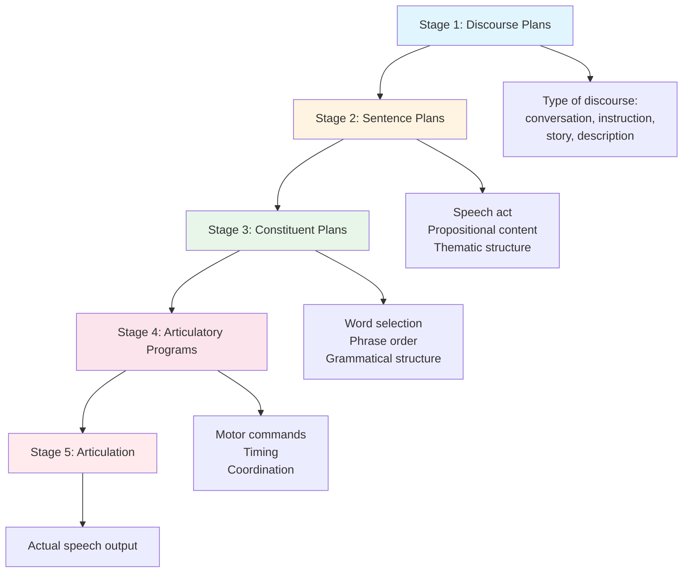
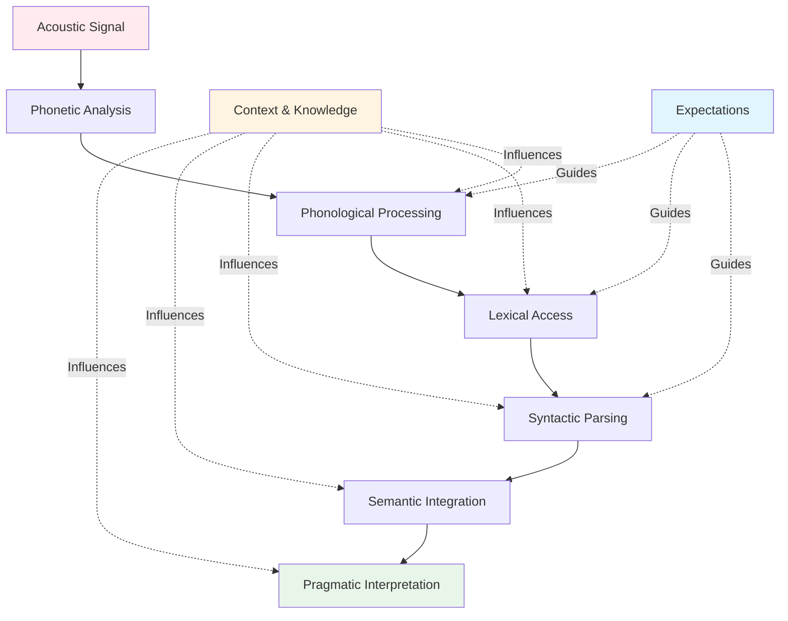

# Language Processes: Speech Production and Comprehension

## Introduction

Language is fundamentally a **dynamic process** that unfolds in real time. When you speak, your brain must plan what to say, select appropriate words, construct grammatical sentences, and coordinate precise movements of your vocal apparatus—all within milliseconds. When you listen, you must decode rapid sound waves, recognize words, parse sentence structure, and extract meaning—often from ambiguous or incomplete input.

Understanding language processes requires examining the **microstructure** of mental operations as they occur moment by moment. Only through careful analysis of the temporal course of language processing can we hope to discover its true nature.

:::tip Key Insight
Language processing is **bidirectional**: 
- **Production** flows from intention → planning → articulation
- **Comprehension** flows from sound → recognition → interpretation
Both processes involve multiple levels operating simultaneously and interactively.
:::

## Three Fundamental Processes in Language

This unit examines three interconnected language processes:

1. **Production of Language**: How speakers plan and execute utterances
2. **Speech Perception and Comprehension**: How listeners decode and understand speech
3. **Language Development**: How language abilities emerge and mature (covered separately)

## The Production of Language

When you begin speaking, an extraordinarily complex process unfolds. Before you utter even a single word, your brain must engage in sophisticated planning based on multiple factors.

### The Instrumental Nature of Speech

Speaking is fundamentally an **instrumental act**—speakers talk in order to produce some effect. Before speaking, the speaker must consider:

1. **Intended Effect**: What influence do I want to have on the listener?
   - Inform, persuade, entertain, request, command, comfort?

2. **Listener's Knowledge**: What does my listener already know?
   - Shared knowledge, background information, technical expertise

3. **Linguistic Form**: What form should my utterance take?
   - Syntactic structure, semantic content, pragmatic appropriateness

4. **Social Context**: What is socially appropriate here?
   - Formality level, politeness, cultural norms

:::info Research Insight
[McNeil (1985)](https://en.wikipedia.org/wiki/David_McNeill_(psychologist)) demonstrated that gestures and speech originate in a similar verbal plan—speakers planning utterances also plan associated gestures, showing the integrated nature of communication planning.
:::

### The Five Stages of Speech Production

According to the influential model by [Clark & Clark (1977)](https://en.wikipedia.org/wiki/Herbert_H._Clark), speech production involves five distinct but interconnected stages:



#### Stage 1: Discourse Plans (Global Level)

**Decision**: What type of discourse will I produce?

Speakers must first decide on the overall structure their communication will follow:

**Types of Discourse**:
- **Conversation**: Turn-taking, responsive, collaborative
- **Description**: Spatial or temporal organization, detail level
- **Instructions**: Step-by-step, logical sequence, clarity
- **Narrative/Story**: Setting → events → climax → resolution
- **Lecture/Presentation**: Introduction → body → conclusion

Each discourse type has its own structural requirements that constrain later planning.

**Example: Joke-telling**
- Must establish setting/context first
- Describe events in proper sequence
- Save punch line for the end
- Timing is crucial

**Violating discourse structure destroys effectiveness**:
- Giving away the punch line early ruins the joke
- Presenting conclusions before evidence confuses the audience
- Jumping between unrelated topics disrupts comprehension

#### Stage 2: Sentence Plans (Local Level)

**Decision**: What specific sentences will accomplish my goal?

Once the discourse type is determined, specific sentences must be selected. This involves determining:

1. **Speech Act Type**: Question, assertion, command, promise?
2. **Propositional Content**: What information to convey?
3. **Thematic Structure**: How to organize information for this listener?

**Example: Describing a New House**

**Effective Organization** (general to specific):
1. Location of house ("in the suburbs near the university")
2. Type/style of house ("modern two-story colonial")
3. Overall floor plan ("open concept with four bedrooms")
4. Room-by-room details ("the kitchen features granite countertops...")

**Poor Organization** (random details):
- "The bathroom tile is blue, and we're near the university, also the kitchen has granite, oh and it's a colonial style..."

The structure matters—moving systematically from global to specific information aids comprehension.

#### Stage 3: Constituent Plans (Component Level)

**Decision**: What specific words, phrases, and grammatical structures?

At this stage, speakers must:

- **Select appropriate words** from their mental lexicon
- **Arrange words in correct order** according to grammar rules
- **Choose grammatical structures** (active/passive, simple/complex)

This level of planning operates at the phrase and clause level, determining the specific linguistic building blocks of each sentence.

#### Stage 4: Articulatory Programs

**Decision**: How will I physically produce these sounds?

The articulatory program specifies the **motor commands** for speech production:

- **Muscle contractions** in the vocal tract
- **Timing and coordination** of tongue, lips, jaw, larynx
- **Breath control** for proper airflow
- **Prosody**: Rhythm, stress, intonation patterns

Speech production is one of the most complex motor activities humans perform, requiring precise coordination of over 100 muscles.

:::tip Did You Know?
Speech production requires coordinating muscles at speeds faster than any other human motor activity. Articulators must move to precise positions within 50-100 milliseconds while producing 10-15 speech sounds per second.
:::

#### Stage 5: Articulation (Output)

**Result**: The actual production of speech sounds

This final stage is the observable output—the acoustic speech signal that reaches the listener's ears. It represents the culmination of all the planning stages.

### Gricean Maxims in Speech Production

[Levelt (1989)](https://en.wikipedia.org/wiki/Willem_Levelt) and others note that effective speakers follow the **Gricean Maxims** (discussed in Unit 2.1) throughout the planning process:

**Quantity**: Speakers calibrate how much to say
- Too little information confuses
- Too much information overwhelms

**Quality**: Speakers strive for truthfulness
- Avoid known falsehoods
- Have evidence for claims

**Relation (Relevance)**: Speakers stay on topic
- Contributions connect to current discourse
- Topic changes are marked explicitly

**Manner**: Speakers aim for clarity
- Avoid ambiguity when possible
- Organize thoughts logically
- Use appropriate vocabulary for audience

**Violation creates implicature**: When speakers deliberately violate these maxims, they convey meaning indirectly (conversational implicature).

### Speech Errors: Windows into Planning

**Slips of the tongue** provide valuable evidence about planning processes. Interestingly, these errors follow systematic patterns:

#### Regularities in Speech Errors

1. **Phonological legality**: Slips rarely produce impossible sound combinations
   - English speakers won't produce combinations like /pf-/ at word start
   - Errors respect phonotactic constraints of the language

2. **Morpheme integrity**: Morphemes tend to move as units
   - "I hate raining on a rainday" (not "I rate haining on a rainday")
   - Whole morphemes swap, not random segments

3. **Similar units swap**: Errors typically involve similar elements
   - Consonants swap with consonants ("par cark" for "car park")
   - Vowels swap with vowels
   - Stressed syllables swap with stressed syllables

4. **Anticipatory vs. perseverative**: 
   - **Anticipatory**: "reading list" → "leading list" (upcoming sound intrudes)
   - **Perseverative**: "beef noodle" → "beef beedle" (previous sound persists)

#### Famous Bloopers

Broadcasting has produced memorable speech errors:

**Example 1**: Radio announcer for "Friendly Homemaker Program"
- Intended: "And now we present our friendly homemaker"
- Said: "And now we present our **homely friendmaker**"

**Example 2**: Commentator covering British royal visit
- Intended: "When they arrive, you will hear a 21-gun salute"
- Said: "When they arrive, you will hear a **21-son salute**"

These errors demonstrate that speech planning occurs at multiple levels simultaneously—speakers are thinking ahead to upcoming words, which can intrude on current articulation.

## Speech Perception and Comprehension

Understanding speech is a remarkable cognitive achievement. We perceive speech with amazing rapidity, extracting meaning from a continuous, rapidly changing acoustic signal that is often ambiguous or degraded.

### The Speed of Speech Perception

**Fluent Language Processing**:
- Listeners can perceive **up to 50 phonemes per second** in their native language (Foulke & Sticht, 1969)
- This is about **25 times faster** than processing non-speech sounds

**Non-Speech Sound Processing**:
- Listeners can identify only **2-3 individual sounds per second** when hearing random non-speech sounds (Warren et al., 1969)

**Why Foreign Languages Sound Fast**:
- Unfamiliar phonemic contrasts slow processing
- Unable to chunk sound stream into familiar units
- Must process more analytically rather than automatically

:::caution Important Distinction
Speech perception is not simple sound identification. It involves **complex interpretative processes** where meaning, context, and expectations play crucial roles in what we ultimately "hear."
:::

### The Complexity of Speech Perception

Speech comprehension is not a simple bottom-up process of sound identification. Instead, it involves:



### The Role of Context in Speech Perception

Context profoundly influences what we perceive in speech. The same acoustic signal can be interpreted differently depending on surrounding context.

#### Context Effects at the Word Level

**Example: Question interpretation depends on context**

Consider: "Have you washed your hands for dinner?"

**Context 1**: Hungry child
- **Interpretation**: Indirect speech act—come to dinner now
- Not really asking about hand-washing status

**Context 2**: Concerned parent
- **Interpretation**: Direct question—checking hygiene compliance
- Genuinely inquiring about hand-washing

The acoustic signal is identical, but the child's state (hungry vs. not hungry) changes interpretation completely.

#### Sentence Completion from Context

Context allows listeners to infer words with minimal acoustic information:

**Example**: "The young girl was awakened by her frightening d...."

**Prediction**: Most listeners immediately think "dream"
- Context (young girl, awakened, frightening) strongly suggests dream
- The word seems to "pop out" automatically
- No conscious deliberation required

This demonstrates **top-down processing**—higher-level knowledge guiding lower-level perception.

### Phonemic Restoration Effect

A striking demonstration of context's power is the **[phonemic restoration effect](https://en.wikipedia.org/wiki/Phonemic_restoration_effect)** discovered by Richard Warren.

#### The Classic Experiment (Warren & Obusek, 1971)

**Method**:
- Subjects heard: "The state governors met with their respective legi*latures convening in the capital city"
- The first /s/ sound in "legislatures" was replaced with a coughing sound
- Task: Identify where the cough occurred

**Results**:
- Subjects "restored" the missing /s/ sound mentally
- **Could not locate** where the cough had actually occurred
- Perceived the sentence as complete, with no missing sounds

**Interpretation**: 
- The brain actively fills in missing speech information based on context
- This happens automatically and unconsciously
- We perceive what *should be there*, not just what *is there*

#### Enhanced Phonemic Restoration

**Further research** (Samuel, 1987) found phonemic restoration is even stronger when:

- **Multiple completions possible**: "_egion" could be "legion" or "region"
- **Stronger context**: More constraining sentence context
- **Better acoustic match**: The replacing sound is acoustically similar

This suggests an **active word-searching process** where the brain generates and tests possible completions.

### The Nature of the Speech Signal

**Common Misconception**: Words in speech are distinct, separated units

**Reality**: Words typically **run together** as continuous sound patterns

#### Evidence from Spectrographic Analysis

[Cole (1979, 1980)](https://www.sciencedirect.com/journal/journal-of-phonetics) used **spectrograms** (visual representations of sound) to show:

1. **Word boundaries are often absent** in the acoustic signal
   - No clear pauses between words
   - Sound patterns overlap

2. **Words often unrecognizable in isolation**
   - [Pollack & Pickett (1963)](https://asa.scitation.org/journal/jasa) extracted words from conversations
   - When single words played alone: often incomprehensible
   - When words heard in sentence context: easily understood

**Implication**: Word recognition depends critically on **context**—we don't simply hear words, we construct them from partial acoustic cues plus contextual knowledge.

### Theories of Speech Perception

#### Template-Matching and Feature-Detection Theories

One approach equates speech perception with auditory perception of other sounds:

**[Template-Matching](https://en.wikipedia.org/wiki/Template_matching)**: 
- Speech sounds matched against stored templates
- Similar to pattern recognition in vision
- Problem: Too rigid to handle variability

**[Feature-Detection](https://en.wikipedia.org/wiki/Feature_detection_(nervous_system))**:
- Speech analyzed into acoustic features (voicing, manner, place)
- Features combined to identify phonemes
- More flexible than template matching

**Phonetic Refinement Theory** ([Pisoni et al., 1985](https://psycnet.apa.org/record/1986-13820-001)):
- Start with auditory analysis
- Shift to higher-level phonetic processing
- Multiple stages of refinement

#### The TRACE Model

The **[TRACE model](https://en.wikipedia.org/wiki/TRACE_model)** ([McClelland & Elman, 1986](https://www.sciencedirect.com/science/article/pii/0010028586900155)) proposes **interactive processing** at three levels:

```mermaid
graph TB
    A[Acoustic Features Level] <--> B[Phoneme Level]
    B <--> C[Word Level]
    
    A --> A1[Voice onset time<br/>Formant frequencies<br/>Duration<br/>Amplitude]
    
    B --> B1[/p/, /b/, /t/, /k/<br/>Individual phonemes]
    
    C --> C1[Whole word units<br/>Lexical access]
    
    style A fill:#ffebee
    style B fill:#fff4e1
    style C fill:#e8f5e9
```

**Key Features**:
1. **Three levels** of representation (acoustic features, phonemes, words)
2. **Bidirectional connections**: Lower levels affect higher levels AND vice versa
3. **Parallel processing**: All levels active simultaneously
4. **Competition**: Alternative interpretations compete until one wins

**Example**: Hearing "cat"
- Acoustic features activate multiple possible phonemes
- Phonemes activate possible words ("cat," "cap," "cab")
- Word level feedback strengthens "cat" phonemes
- Competition resolves in favor of "cat"

#### The Role of Expectations

All theories acknowledge that speech perception involves **decision-making beyond feature detection**. The speech we ultimately perceive may differ from the actual acoustic signal due to:

1. **Cognitive factors**: Knowledge, beliefs, assumptions
2. **Contextual factors**: Preceding discourse, situational context
3. **Social factors**: Who is speaking, relationships
4. **Linguistic factors**: Grammar rules, semantic constraints

:::tip Clinical Application
Understanding speech perception helps explain why individuals with hearing loss can function better with context. Providing contextual information significantly improves comprehension even when acoustic signal quality is poor.
:::

### Comprehension Beyond Sound Perception

Speech perception is just the beginning of comprehension. Full understanding requires:

#### Integration Across Multiple Systems

1. **Syntactic Parsing**: Determining sentence structure
2. **Semantic Processing**: Accessing word meanings and combining them
3. **Pragmatic Inference**: Determining speaker intentions
4. **Discourse Integration**: Connecting to prior conversation
5. **World Knowledge**: Using general knowledge to interpret

#### Active Construction of Meaning

Modern theories view comprehenders as **active participants** who:

- **Generate hypotheses** about upcoming input
- **Use multiple information sources** simultaneously
- **Revise interpretations** when necessary
- **Fill in gaps** using inference
- **Construct mental models** of described situations

This contrasts with older **passive models** where comprehenders simply decoded input sequentially.

## Educational Video Resources

📺 **[Speech Production - MIT OpenCourseWare](https://www.youtube.com/results?search_query=speech+production+psychology+MIT)** (Search for latest)
Comprehensive overview of the speech production system.

📺 **[Speech Perception - Crash Course Psychology](https://www.youtube.com/results?search_query=speech+perception+psychology)** (Search for latest)
Introduction to how we understand spoken language.

📺 **[The TRACE Model Explained](https://www.youtube.com/results?search_query=TRACE+model+speech+perception)** (Search for latest)
Explanation of interactive speech perception models.

## Memory Aids

**Five Production Stages = D-S-C-A-A**:
1. **D**iscourse plans (what type?)
2. **S**entence plans (which sentences?)
3. **C**onstituent plans (which words?)
4. **A**rticulatory programs (how to say it?)
5. **A**rticulation (actual speech)

**Perception is Construction**:
- **C**ontext matters
- **O**ne signal, multiple interpretations
- **N**ot passive decoding
- **S**ound + meaning integrated
- **T**op-down and bottom-up
- **R**estoration when missing
- **U**nderstanding is active
- **C**omplex multi-level process
- **T**ime-critical processing

---

## Summary

Language processing involves complex real-time operations:

**Speech Production** progresses through five stages:
1. Discourse planning (conversation, story, instruction, etc.)
2. Sentence planning (speech acts, content, structure)
3. Constituent planning (specific words and phrases)
4. Articulatory programming (motor commands)
5. Articulation (physical sound production)

**Speech Perception and Comprehension** is an active, constructive process:
- Context profoundly influences what we perceive
- Missing information is filled in automatically (phonemic restoration)
- Words run together in speech—we construct word boundaries
- Multiple levels process simultaneously and interactively
- Top-down knowledge guides bottom-up perception

Understanding language processes reveals that both speaking and listening involve sophisticated cognitive operations occurring in milliseconds, seamlessly integrating multiple levels of analysis to enable human communication.

---

## Further Reading

- 📖 Clark, H.H., & Clark, E.V. (1977). *Psychology and Language: An Introduction to Psycholinguistics*. Harcourt Brace Jovanovich.
- 📖 Levelt, W.J.M. (1989). *Speaking: From Intention to Articulation*. MIT Press.
- 📄 [Warren, R.M. (1970). Perceptual restoration of missing speech sounds. *Science*, 167(3917), 392-393.](https://www.science.org/journal/science)
- 📄 [McClelland, J.L., & Elman, J.L. (1986). The TRACE model of speech perception. *Cognitive Psychology*.](https://www.sciencedirect.com/journal/cognitive-psychology)

---

**Source PDFs**: 
- 📄 [Block-3/Unit-2.pdf - Pages 28-31](/pdfs/MPC-001%20Cognitive%20Psychology,%20Learning%20and%20Memory/Block-3/Unit-2.pdf)
- 📚 MPC-001 Cognitive Psychology, Learning and Memory

---

## Self-Assessment Questions

1. **Describe the five stages of speech production using a specific example (e.g., asking someone for directions). What happens at each stage?**

2. **Explain why phonemic restoration occurs. What does this phenomenon tell us about the nature of speech perception?**

3. **Why can we process speech at 50 phonemes per second but only 2-3 non-speech sounds per second? What cognitive mechanisms explain this difference?**

4. **How does context influence speech perception? Provide three specific examples from everyday communication.**

5. **Compare and contrast template-matching, feature-detection, and interactive (TRACE) models of speech perception. What are the strengths and weaknesses of each?**

6. **Why do speech errors follow systematic patterns (e.g., morphemes stay intact, similar units swap)? What does this reveal about speech planning?**
