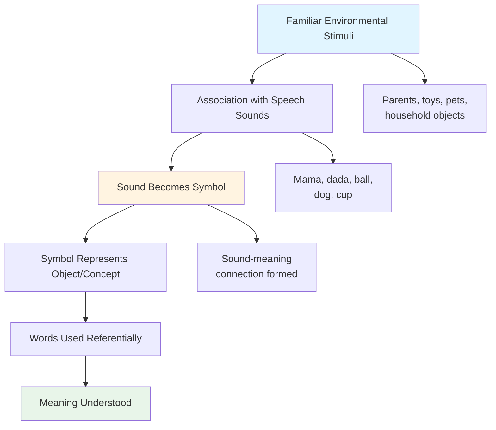
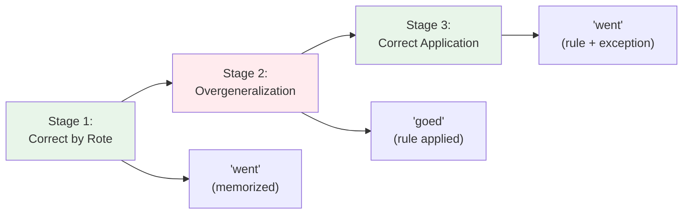
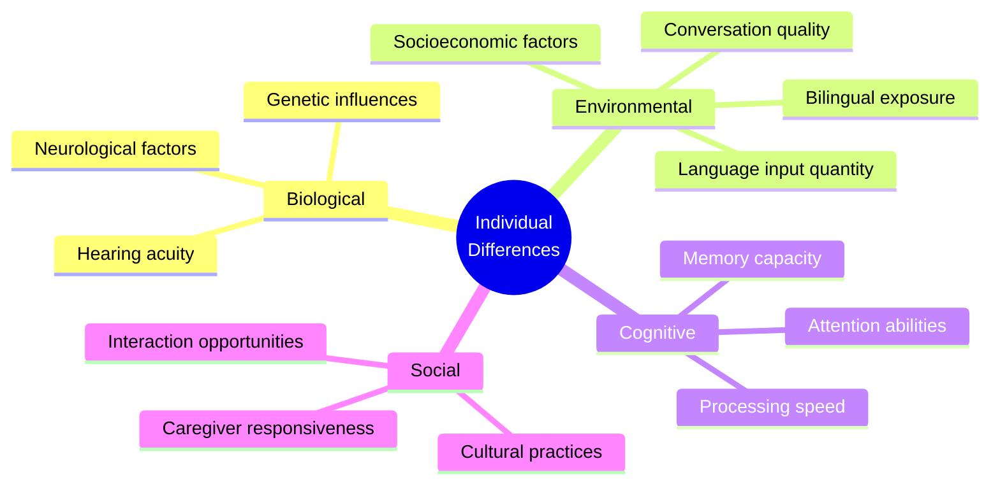

# Language Development: Semantic and Pragmatic Growth

## Introduction

Language acquisition represents one of the most remarkable achievements of human development. Within just a few years, children progress from babbling infants to sophisticated communicators who can express complex thoughts, tell stories, ask questions, and engage in nuanced social interactions.

While previous units covered the **stages of language acquisition** (cooing, babbling, one-word stage, etc.), this unit focuses specifically on **how meaning develops**—how children come to understand what words mean, how they learn to construct meaningful sentences, and how they master the pragmatic aspects of language use.

:::tip Key Developmental Principle
Language development follows a predictable sequence across cultures, but the **rate** of development varies considerably among individual children. Understanding both universal patterns and individual variation is crucial.
:::

## The Challenge of Semantic Development

Before children can use language effectively, they must accomplish an enormously challenging task: **learning that speech sounds represent specific objects, events, and concepts in their environment**.

### From Sound to Symbol

The journey to semantic understanding involves several critical steps:

**Example Process**:
1. **Familiarity**: Child frequently sees mother
2. **Association**: Parents repeatedly say "Mama" when mother is present
3. **Symbolization**: The sound "Mama" comes to stand for mother
4. **Understanding**: Child recognizes "Mama" refers to mother specifically

:::info Critical Insight
Learning these associations is only **part** of language development. Children must also learn:
- How words combine into sentences
- Grammatical rules governing word order
- Pragmatic rules for appropriate language use
- How meaning changes with context
:::

## Early Semantic Development: Feature Theory and Prototypes

### Feature-Based Acquisition

One influential view proposes that children learn **semantic features** of words and initially apply words based on shared features.

#### The Feature Hypothesis

**Process**:
1. Child learns a word (e.g., "ball")
2. Child identifies features of the exemplar (round, rollable, graspable)
3. Child overgeneralizes to other objects sharing those features

**Classic Example**: The word "ball"

| Object | Round? | Rollable? | Graspable? | Child's Response |
|--------|---------|-----------|------------|------------------|
| Ball | ✓ | ✓ | ✓ | Correctly says "ball" |
| Moon | ✓ | ✗ | ✗ | May call it "ball" |
| Orange | ✓ | ✓ | ✓ | May call it "ball" |
| Balloon | ✓ | ✗ | ✓ | May call it "ball" |

**Overgeneralization**: The child applies "ball" to the moon, oranges, and balloons because they share the salient feature of roundness.

**Refinement**: Gradually, the child learns more features:
- Balls bounce
- Balls are used for games
- Balls have specific size ranges
- The moon is in the sky, much larger, and unchanging

Through experience, the child **narrows the application** of "ball" to appropriate referents.

### Prototype Theory in Development

[**Prototype theory**](https://en.wikipedia.org/wiki/Prototype_theory) (Rosch, 1973) suggests children learn categories based on **best examples** rather than strict feature lists.

**Example: Learning "bird"**

**Prototypical birds** (learned first):
- Robin, sparrow, blue jay
- Small, fly easily, perch in trees, common

**Non-prototypical birds** (learned later):
- Penguin (doesn't fly, swims)
- Ostrich (very large, runs but doesn't fly)
- Chicken (domesticated, rarely flies)

**Developmental Pattern**:
1. **Early**: "Bird" means robin-like creatures
2. **Intermediate**: Child puzzled by penguins ("Is that a bird?")
3. **Mature**: Understands category has central and peripheral members

:::caution Common Error
Children don't just learn "all birds fly." Rather, they learn that **flying is typical but not necessary** for being a bird. This represents sophisticated category understanding.
:::

## Grammatical Development: From Words to Rules

### The Challenge of Grammar Acquisition

Constructing complex sentences represents an **enormously challenging task** (Brown, 1973). Children must learn:

- **Grammatical rules**: Subject-verb agreement, tense marking, etc.
- **Semantic rules**: How word meanings combine
- **Pragmatic rules**: When and how to use different sentence types

### Linguistic Competence vs. Performance

**[Linguistic Competence](https://en.wikipedia.org/wiki/Linguistic_competence)**: The unconscious knowledge of language rules that allows generating grammatical sentences

**[Linguistic Performance](https://en.wikipedia.org/wiki/Linguistic_performance)**: The actual use of language in concrete situations

**Key Point**: Children (and adults) possess linguistic competence even if they **cannot verbalize the rules** they follow.

**Example**: A 4-year-old can correctly say:
- "I went to the park" (not "I goed")
- "She is eating" (not "She eating" or "She are eating")

Yet if asked "Why do you say 'went' not 'goed'?" the child cannot explain the rule. **Performance demonstrates competence.**

## Overgeneralization: Evidence of Rule Learning

One of the best pieces of evidence for rule learning is the phenomenon of **[overgeneralization](https://en.wikipedia.org/wiki/Overgeneralization_(linguistics))** (also called overregularization).

### The U-Shaped Development Pattern

Children's mastery of irregular forms follows a surprising pattern:

### Classic Example: Past Tense Formation

**Stage 1** (Early, ~2 years):
- Child says "went" correctly
- Learned as a single memorized unit
- No rule application yet

**Stage 2** (Middle, ~2.5-3 years):
- Child learns the rule: "Add -ed to make past tense"
- Applies rule everywhere: "goed," "eated," "runned"
- **Worse performance** but **better understanding**

**Stage 3** (Later, ~4+ years):
- Child maintains general rule
- Learns specific exceptions
- Says "went" again, but now knows why

### Why Overgeneralization is Important

Overgeneralization demonstrates:

1. **Active rule learning**: Children aren't just imitating; they're generating novel forms
2. **Creative construction**: "Goed" is never heard in adult speech
3. **Systematic errors**: Errors follow patterns, not random
4. **Universal pattern**: Occurs across languages and deaf children learning sign language

:::info Research Evidence
Deaf children learning [American Sign Language](https://en.wikipedia.org/wiki/American_Sign_Language) show identical overgeneralization patterns with sign formation rules, demonstrating this is a universal language learning process, not specific to spoken language.
:::

### Other Examples of Overgeneralization

**Plural Formation**:
- Correct → Overgeneralize → Correct again
- "feet" → "foots" → "feet"
- "mice" → "mouses" → "mice"
- "sheep" → "sheeps" → "sheep"

**Pronoun Use**:
- Early: "Me want cookie" (overgeneralize object form)
- Later: "I want cookie" (correct subject form)

**Negative Formation**:
- Stage 1: "No go" (simple negation)
- Stage 2: "I no go" (more complex)
- Stage 3: "I don't want to go" (full auxiliary system)

## Pragmatic Development: Learning Speech Acts

Beyond grammar and vocabulary, children must learn the **pragmatic** aspects of language—how to use language appropriately in social contexts.

### Understanding "I Promise"

Philosopher [John Searle (1969)](https://plato.stanford.edu/entries/searle/) identified conditions for a sincere promise:

**Felicity Conditions for Promising**:
1. **Propositional content**: Future act by speaker
2. **Preparatory**: Hearer wants act done; speaker can do act
3. **Sincerity**: Speaker **intends** to carry out act
4. **Essential**: Speaker accepts obligation to perform act

### Developmental Changes in Understanding Promises

Research by [Bernicot & Laval (1996)](https://journals.sagepub.com/home/jls) reveals age-related changes:

**3-year-olds**:
- Understand **Condition 2** poorly: Don't consistently check if hearer wants the action
- Focus mainly on: Did the promised action occur?
- Less concerned with: Did the speaker intend it? Does the hearer want it?

**5-year-olds**:
- Improving understanding of both conditions
- Beginning to consider speaker's intentions
- Still focus heavily on outcome

**10-year-olds**:
- Evaluate **both conditions equivalently**
- Understand that promises create obligations
- Consider speaker's intentions and hearer's desires
- Mature understanding of commitments

### Practical Implications

When adults say to children "I promise we'll go to the park":

**To a 3-year-old**: Promise means "We will go to the park" (focus on outcome)

**To a 10-year-old**: Promise means "I am committed to ensuring we go to the park, and I understand you want this" (focus on commitment and intention)

:::tip Parenting Insight
Understanding developmental differences in promise interpretation helps adults communicate more effectively with children. A 3-year-old may be devastated if a promised activity doesn't occur, regardless of circumstances, because they don't yet fully understand the complexity of commitments.
:::

## The Role of Context in Children's Language Understanding

As children develop, they become increasingly sophisticated at using **contextual information** to interpret meaning.

### Early Context Use (Ages 2-4)

**Limited perspective-taking**:
- Difficulty understanding others have different knowledge
- Assumes others see/know what they see/know
- Over-explicit or under-explicit communication

**Example**:
- Child: "I want that!" (pointing at toy parent can't see)
- Doesn't realize parent needs more information

### Developing Context Sensitivity (Ages 4-7)

**Growing theory of mind**:
- Beginning to understand others have different perspectives
- Starting to adjust language based on listener knowledge
- Improving at following conversational rules

**Example**:
- Child: "Mom, can I have the red truck? The one in my room?"
- Provides context about which truck

### Mature Context Use (Ages 8+)

**Sophisticated audience design**:
- Consistently monitors listener understanding
- Adjusts explanations based on listener's knowledge
- Uses appropriate formality levels
- Understands indirect speech acts

**Example**:
- To younger sibling: "Do you want to play with my new game?" (direct)
- To friend: "Wanna come over?" (casual)
- To teacher: "Excuse me, may I ask a question?" (formal)

## Individual Differences in Language Development

While the sequence of language development is universal, there is **considerable variation** in developmental rate:

### Sources of Variation

### Normal Range

**First Words**:
- Typical range: 10-18 months
- Some children: 8 months
- Others: 20+ months (still normal)

**Two-Word Combinations**:
- Typical range: 18-24 months
- Normal variation: 15-30 months

**Complex Sentences**:
- Typical range: 3-4 years
- Normal variation: 2.5-5 years

:::caution Clinical Note
While variation is normal, significant delays (e.g., no words by 18 months, no two-word combinations by 30 months) warrant professional evaluation for language disorders.
:::

## The Complexity of Language Learning

This brief sketch only hints at the enormity of children's language learning task. Consider what children master:

### Phonological System
- 40-45 phonemes
- Phonotactic rules (legal sound combinations)
- Stress and intonation patterns
- Coarticulation effects

### Morphological System
- Free and bound morphemes
- Inflectional morphology (plural, past tense, etc.)
- Derivational morphology (prefixes, suffixes)
- Irregular forms and exceptions

### Syntactic System
- Word order rules
- Phrase structure
- Grammatical relations (subject, object, etc.)
- Complex constructions (relative clauses, embedding)

### Semantic System
- 50,000+ word meanings (by adulthood)
- Semantic features and prototypes
- Compositional meaning
- Metaphor and figurative language

### Pragmatic System
- Speech acts (requesting, promising, asserting)
- Conversational rules (turn-taking, relevance)
- Politeness conventions
- Indirect speech acts

**The fact that young children accomplish this within 4-5 years emerges as a truly remarkable achievement.**

## Educational Video Resources

📺 **[Language Development - MIT OpenCourseWare](https://www.youtube.com/results?search_query=language+development+psychology+MIT)** (Search for latest)
Comprehensive overview of language acquisition.

📺 **[Overgeneralization in Child Language - Crash Course Linguistics](https://www.youtube.com/results?search_query=overgeneralization+child+language)** (Search for latest)
Explanation of rule learning in language development.

## Memory Aids

**Three Stages of Overgeneralization = C-O-C**:
1. **C**orrect by rote (memorized)
2. **O**vergeneralize rule (creative errors)
3. **C**orrect with understanding (rule + exceptions)

**Promise Development = O-I-C**:
- **O**utcome focus (age 3)
- **I**ntention emerging (age 5)
- **C**omplete understanding (age 10)

**Remember**: Children make "errors" that show **progress** (like "goed")—they're learning rules, not just imitating!

---

## Summary

Language development involves mastering multiple interconnected systems:

**Semantic Development**:
- Children learn word-object associations
- Use feature-based and prototype-based categorization
- Gradually refine word meanings through experience

**Grammatical Development**:
- Children acquire unconscious rule knowledge (linguistic competence)
- Overgeneralization demonstrates active rule learning
- U-shaped development pattern shows rule acquisition
- Similar patterns in spoken and signed languages

**Pragmatic Development**:
- Understanding of speech acts develops gradually
- Young children focus on outcomes
- Older children understand intentions and commitments
- Context sensitivity improves with age

The rapidity with which children master this extraordinarily complex system—phonology, morphology, syntax, semantics, and pragmatics—represents one of the most remarkable achievements of human cognitive development.

---

## Further Reading

- 📖 Brown, R. (1973). *A First Language: The Early Stages*. Harvard University Press.
- 📖 Berko Gleason, J. (2016). *The Development of Language* (9th ed.). Pearson.
- 📄 [Bernicot, J., & Laval, V. (1996). Promises in French children. *Journal of Speech and Hearing Research*.](https://pubs.asha.org/journal/jslhr)
- 📄 [Rosch, E. (1973). Natural categories. *Cognitive Psychology*.](https://www.sciencedirect.com/journal/cognitive-psychology)

---

**Source PDFs**: 
- 📄 [Block-3/Unit-2.pdf - Pages 31-33](/pdfs/MPC-001%20Cognitive%20Psychology,%20Learning%20and%20Memory/Block-3/Unit-2.pdf)
- 📚 MPC-001 Cognitive Psychology, Learning and Memory

---

## Self-Assessment Questions

1. **Explain the U-shaped development pattern in past tense formation. Why do children initially say "went" correctly, then "goed," then "went" again? What does this tell us about rule learning?**

2. **How does a 3-year-old's understanding of "I promise" differ from a 10-year-old's? What developmental changes in social cognition explain this difference?**

3. **Compare and contrast feature theory and prototype theory as explanations for how children learn word meanings. Which theory better explains why children might call the moon "ball"?**

4. **Why is overgeneralization considered evidence for creative rule learning rather than simple imitation? Provide three specific examples from different grammatical domains.**

5. **What is the difference between linguistic competence and linguistic performance? Why can children use grammatical rules correctly without being able to explain them?**

6. **Describe how context sensitivity develops between ages 2 and 10. How would a 3-year-old versus an 8-year-old differently request a toy from a parent?**
