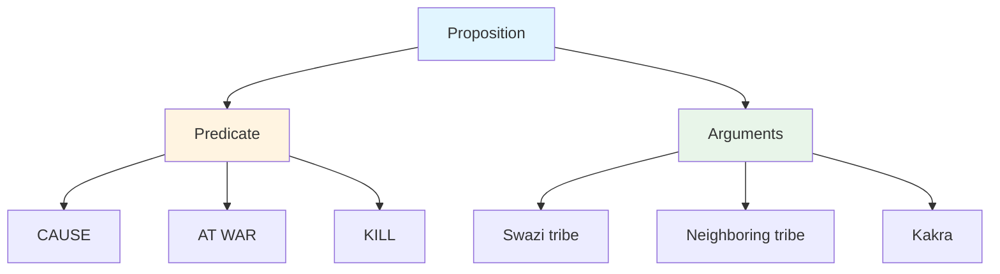
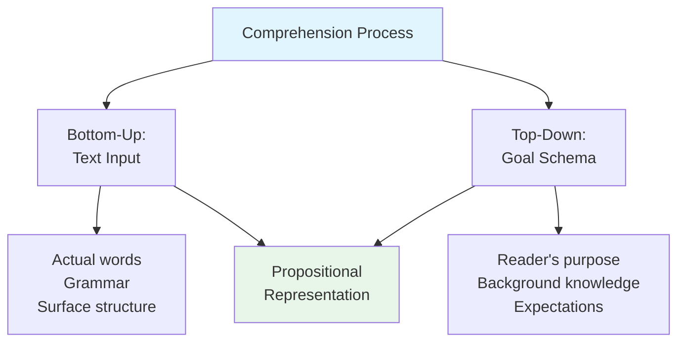
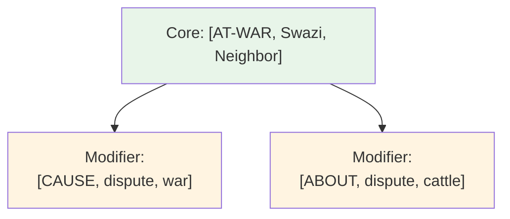
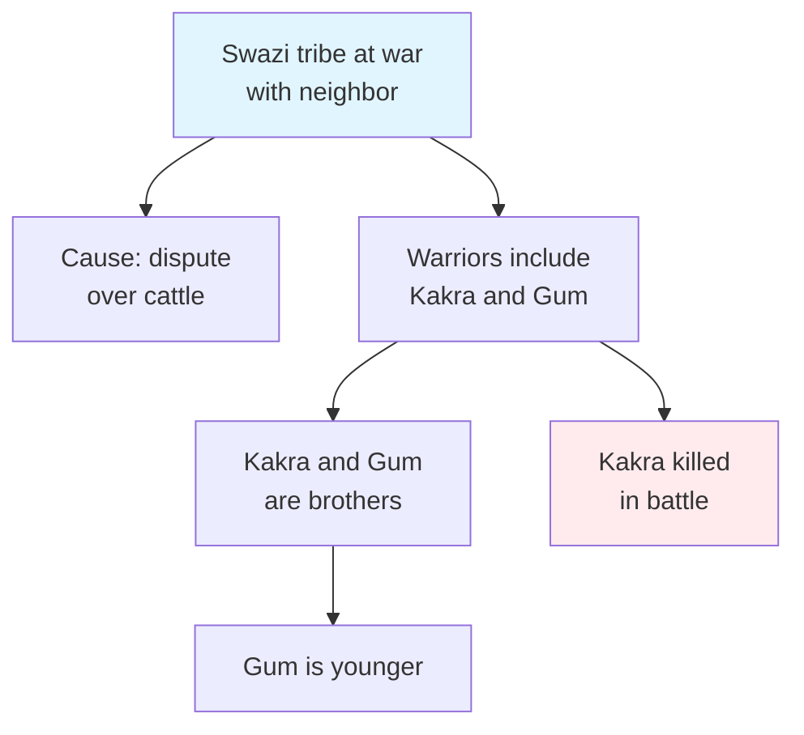
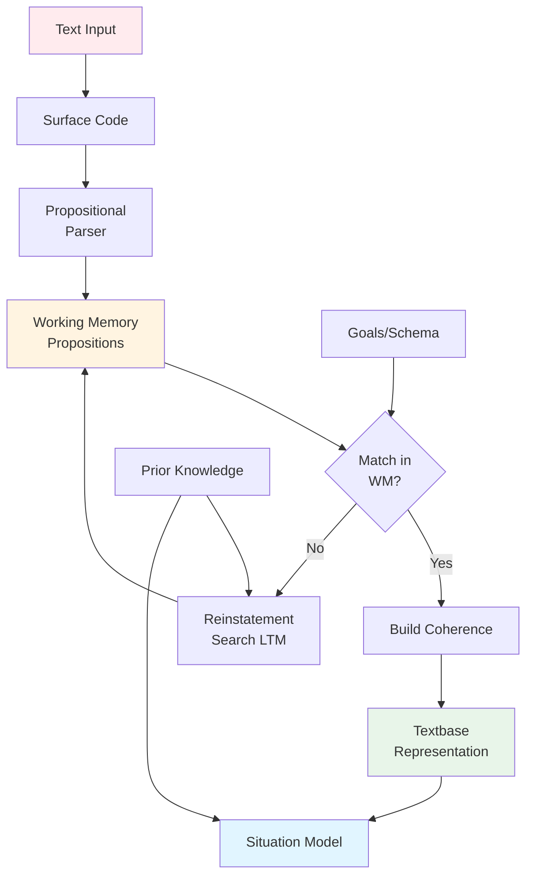

# Kintsch's Model of Comprehension: Propositional Processing

## Introduction

How do we understand written text or spoken discourse? What cognitive processes transform ink marks on paper or sound waves into meaningful mental representations? The model developed by [Walter Kintsch](https://en.wikipedia.org/wiki/Walter_Kintsch) and Teun van Dijk (Kintsch, 1974, 1979, 1988, 1990; Kintsch & van Dijk, 1978) provides one of the most influential, extensive, and comprehensive theories of language comprehension.

This model is far more than a system for understanding text—it's a theory that cuts across many topics in cognitive psychology, including **memory, comprehension of written and spoken language, and discourse processing**. It integrates insights from linguistics, psychology, and artificial intelligence to explain how we construct meaning from language.

:::tip Key Innovation
Kintsch's model treats **propositions**—abstract meaning units—as the fundamental currency of comprehension, not words or sentences. This explains why we remember meaning better than exact wording.
:::

## The Theoretical Foundation

### The Propositional Basis

The Kintsch-van Dijk model is fundamentally based on **[propositions](https://en.wikipedia.org/wiki/Proposition)**. But what exactly is a proposition?

#### Characteristics of Propositions

Propositions are abstractions with specific properties:

1. **Abstract nature**: Not tied to specific words or surface forms
2. **Based on observation**: Derived from reading text or hearing speech
3. **Stored in memory**: Follow general memory laws (encoding, storage, retrieval)
4. **Structured**: Consist of a **predicate** and one or more **arguments**

**Structure**: Proposition = **Predicate** + **Arguments**

- **Predicates** correspond to: Verbs, adjectives, adverbs, connectives
- **Arguments** correspond to: Nouns, noun phrases, clauses

### Surface Structure vs. Propositional Representation

A critical distinction underlies the model:

**Surface Structure**: The actual words and grammar of a sentence as written or spoken

**Propositional Representation**: The underlying meaning extracted from surface structure

**Example**:
- Surface: "The Swazi tribe was at war with a neighboring tribe"
- Propositions:
  1. [AT-WAR, Swazi-tribe, neighboring-tribe]
  2. [CAUSE, dispute, at-war]
  3. [ABOUT, dispute, cattle]

Different surface structures can express the same propositions:
- "The Swazi tribe fought a neighboring tribe" (different words)
- "A neighboring tribe was at war with the Swazi tribe" (different order)
- Both express similar propositional content

## Comprehension as Dual Processing

Kintsch's model describes comprehension as dependent on **two disparate sources**, similar to bottom-up and top-down processing:

### Bottom-Up: The Text

**Text-driven processing**: The actual linguistic input—words, sentences, grammatical structure

**Starting point**: The material to be comprehended

### Top-Down: The Goal Schema

**Knowledge-driven processing**: The reader's:
- Purpose for reading
- Background knowledge
- Expectations
- Goals and intentions

**Decision maker**: Determines what material is relevant to current goals

### The Central Role of Working Memory

A **critical constraint** in the model: Initial text processing occurs in **[Short-Term Memory (STM)](https://en.wikipedia.org/wiki/Short-term_memory)** / **Working Memory**.

**Working Memory Limitations**:
- Limited capacity (7±2 chunks)
- Rapid decay without rehearsal
- Only portion of propositions held simultaneously

This constraint shapes the entire comprehension process.

## Processing a Text: A Detailed Example

Let's work through Kintsch's analysis of a short story to understand the model:

### The Swazi Story

> **Sentence 1**: The Swazi tribe was at war with a neighboring tribe because of a dispute over some cattle.
> 
> **Sentence 2**: Among the warriors were two unmarried men, Kakra and his younger brother Gum.
> 
> **Sentence 3**: Kakra was killed in battle.

### Processing Sentence 1

**Step 1: Propositional Analysis**

The first sentence divides into five propositional groups:

1. The Swazi tribe
2. Was at war with
3. A neighboring tribe
4. Because
5. A dispute over some cattle

**Step 2: Coherence Analysis**

According to coherence analysis, only **three factors initially enter working memory**:

- The Swazi tribe
- Was at war with
- A neighboring tribe

**Why only three?** Working memory capacity limits prevent processing all five simultaneously.

**Step 3: Identifying the Core**

The predicate **"was at war with"** is considered the **most important part** for story comprehension. Other elements cluster around this central proposition.

### Processing Sentence 2

**Challenge**: Connecting new information to existing representation

**In Working Memory** from Sentence 1:
- [AT-WAR, Swazi-tribe, neighboring-tribe]
- [CAUSE, dispute, at-war]
- (Maybe) [ABOUT, dispute, cattle]

**New Propositions** from Sentence 2:
- [AMONG, warriors, two-men]
- [UNMARRIED, men]
- [NAMED, first-man, Kakra]
- [NAMED, second-man, Gum]
- [BROTHER-OF, Gum, Kakra]
- [YOUNGER, Gum]

**The Problem**: **No direct match** between old and new propositions!

### The Reinstatement Search

**When no match exists** between propositions in working memory and new propositions, the reader must perform a **reinstatement search** of Long-Term Memory (LTM).

**Process**:
1. New information doesn't connect to working memory contents
2. Reader searches LTM for relevant propositions
3. Reinstates necessary background propositions into working memory
4. Constructs connections between old and new information

**In our example**:
- Reader infers: "The two men were members of the Swazi tribe"
- This inference bridges Sentence 1 and Sentence 2
- Connection: [MEMBER-OF, Kakra, Swazi-tribe]

:::caution Reading Difficulty
Reinstatement searches are **one major reason text material may be hard to read**. Texts requiring many reinstatement searches impose heavy cognitive load and slow comprehension.
:::

### Processing Sentence 3

**Sentence 3**: "Kakra was killed in battle"

**New Proposition**: [KILL, (unknown-agent), Kakra, in-battle]

**Connection to Working Memory**:
- "Kakra" present in working memory from Sentence 2
- Easy connection—no reinstatement search needed
- "Battle" connects to earlier "war" concept

**Resulting Network**: The semantic network becomes increasingly interconnected as reading progresses.

## The Resulting Mental Representation

After processing these three sentences, the reader has constructed a **coherent mental representation** consisting of:

### Proposition Network

### Types of Information Stored

1. **Explicit propositions**: Directly stated in text
2. **Bridging inferences**: Connections between sentences (e.g., warriors are Swazi)
3. **Elaborative inferences**: World knowledge applications (e.g., war is dangerous)
4. **Macropropositions**: Global themes and main ideas

## Propositional Complexity and Reading Difficulty

The model makes a testable prediction: **Sentences with more propositions should be harder to comprehend**, even if surface complexity is similar.

### The Kintsch & Keenan (1973) Experiment

**Hypothesis**: Reading time increases with propositional complexity, independent of sentence length

**Method**:
- Subjects read ten sentences
- All sentences had approximately the **same number of words** (~14-16 words)
- Sentences varied greatly in **number of propositions** (4-9 propositions)
- Measured reading time for each sentence

**Example Sentences**:

**Sentence A** (4 propositions, simpler):
> "Romulus, the legendary founder of Rome, took the women of Sabine by force."

**Propositions**:
1. [FOUND, Romulus, Rome]
2. [LEGENDARY, Romulus]
3. [TAKE, Romulus, women]
4. [BY-FORCE, taking]

**Sentence B** (9 propositions, more complex):
> "Cleopatra's downfall lay in her foolish trust in the fickle political figures of the Roman world."

**Propositions**:
1. [DOWNFALL, Cleopatra]
2. [CAUSE, trust, downfall]
3. [BY, Cleopatra, trust]
4. [FOOLISH, trust]
5. [IN, trust, figures]
6. [POLITICAL, figures]
7. [FICKLE, figures]
8. [OF, figures, world]
9. [ROMAN, world]

### Results

**Finding**: **Extraordinarily consistent relationship** between number of propositions and reading time

**Pattern**:
- More propositions → Longer reading time
- Approximately 1-1.5 seconds added per additional proposition
- Relationship holds even when word count is constant

**Conclusion**: **Propositional complexity**, not surface complexity, determines comprehension difficulty.

:::tip Practical Application
When writing for comprehension (textbooks, instructions, educational materials), reduce propositional density:
- Break complex sentences into simpler ones
- One main idea per sentence
- Explicit rather than embedded propositions
:::

## The Complete Kintsch-van Dijk Model

### Key Components

### Levels of Representation

The model distinguishes three levels:

1. **Surface Code**: Exact wording (quickly forgotten)
2. **Textbase**: Propositional representation (retained longer)
3. **Situation Model**: Mental model of described situation (best retained)

**Example**: Reading about a fire
- Surface: Quickly forget exact words
- Textbase: Remember propositions (who, what, where)
- Situation model: Understand fire dynamics, imagine scene

## Memory Predictions

### What We Remember

According to the model:

**Better Memory For**:
1. **Meaning (propositions)** over exact wording
2. **Gist** over details
3. **Connected propositions** over isolated ones
4. **Reinstated propositions** (retrieved from LTM)

**Poorer Memory For**:
1. Surface structure (exact words)
2. Peripheral details
3. Unconnected information

### The Reinstatement Advantage

**Counterintuitive finding**: Propositions requiring reinstatement searches are often **remembered better** than easily integrated ones.

**Why?** 
- Reinstatement involves retrieval from LTM
- Retrieval strengthens memory traces
- Deep processing during search enhances encoding

This explains why **slightly difficult** texts are sometimes better remembered than very easy texts.

## Critique and Extensions

### Strengths of the Model

1. **Empirically validated**: Numerous studies confirm predictions
2. **Comprehensive**: Integrates multiple cognitive processes
3. **Practical applications**: Informs text design, education
4. **Formal precision**: Clear, testable predictions

### Limitations and Challenges

1. **Propositional analysis complexity**: Not always clear how to divide text
2. **Individual differences**: Doesn't fully account for reader variation
3. **Imagery and emotion**: Less emphasis on non-propositional processing
4. **Computational demands**: Difficult to implement fully in AI systems

### Modern Extensions

Contemporary models build on Kintsch:

- **Construction-Integration Model** (Kintsch, 1988): Adds integration phase
- **Landscape Model**: Models reading as dynamic activation patterns
- **Event-Indexing Model**: Emphasizes situation model construction

## Applications

### Educational Settings

**Textbook Design**:
- Control propositional density
- Add coherence cues
- Minimize reinstatement searches

**Teaching Reading**:
- Teach students to identify main propositions
- Practice making bridging inferences
- Build background knowledge to reduce search demands

### Clinical Assessment

**Comprehension Disorders**:
- Test propositional extraction
- Assess working memory capacity
- Evaluate inference-making ability

### Computational Linguistics

**Automatic Summarization**:
- Extract main propositions
- Maintain coherence
- Generate macropropositions

**Question Answering Systems**:
- Build propositional representations
- Match questions to text propositions

## Educational Video Resources

📺 **[Text Comprehension Models - MIT OpenCourseWare](https://www.youtube.com/results?search_query=text+comprehension+psychology+MIT)** (Search for latest)
Overview of comprehension models including Kintsch's.

📺 **[Propositional Networks - Cognitive Psychology](https://www.youtube.com/results?search_query=propositional+networks+psychology)** (Search for latest)
Explanation of propositional representation.

## Memory Aids

**Three Levels of Representation = SSS**:
1. **S**urface (exact words - forgotten quickly)
2. **S**emantic/Textbase (propositions - retained better)
3. **S**ituation model (mental model - retained best)

**Key Model Features = PWRC**:
- **P**ropositions (fundamental units)
- **W**orking memory (limited capacity)
- **R**einstatement search (when no match)
- **C**oherence (connecting propositions)

**Remember**: More propositions = Longer reading time (even with same word count!)

---

## Summary

Kintsch's model of comprehension provides a comprehensive account of language understanding:

**Core Principles**:
1. **Propositions** are the fundamental units of meaning representation
2. **Working memory limitations** constrain processing
3. **Coherence building** connects propositions across sentences
4. **Reinstatement searches** retrieve relevant information from LTM when needed

**Key Findings**:
- Propositional complexity predicts reading difficulty better than surface complexity
- Readers remember meaning (propositions) better than exact wording (surface)
- Text requiring moderate inference-making may be better remembered than very easy text
- Comprehension involves constructing multiple levels of representation

The model successfully integrates insights from linguistics, psychology, and computer science to explain how humans transform linguistic input into meaningful mental representations. While not without limitations, it remains one of the most influential theories of language comprehension.

---

## Further Reading

- 📖 Kintsch, W. (1998). *Comprehension: A Paradigm for Cognition*. Cambridge University Press.
- 📖 van Dijk, T.A., & Kintsch, W. (1983). *Strategies of Discourse Comprehension*. Academic Press.
- 📄 [Kintsch, W., & van Dijk, T.A. (1978). Toward a model of text comprehension and production. *Psychological Review*, 85(5), 363-394.](https://psycnet.apa.org/record/1979-06862-001)
- 📄 [Kintsch, W., & Keenan, J. (1973). Reading rate and retention as a function of the number of propositions in the base structure of sentences. *Cognitive Psychology*, 5(3), 257-274.](https://www.sciencedirect.com/journal/cognitive-psychology)

---

**Source PDFs**: 
- 📄 [Block-3/Unit-2.pdf - Pages 33-35](/pdfs/MPC-001%20Cognitive%20Psychology,%20Learning%20and%20Memory/Block-3/Unit-2.pdf)
- 📚 MPC-001 Cognitive Psychology, Learning and Memory

---

## Self-Assessment Questions

1. **What is a proposition according to Kintsch's model? How does it differ from a sentence? Provide three examples of propositions from a sentence of your choice.**

2. **Explain why the sentence about Cleopatra is harder to read than the sentence about Romulus, even though they have similar word counts. Use the concept of propositional complexity in your answer.**

3. **What is a reinstatement search? Why does it occur, and what makes it cognitively demanding? Provide an example from the Swazi story.**

4. **Compare the three levels of representation in Kintsch's model: surface code, textbase, and situation model. Which is retained longest in memory, and why?**

5. **How does working memory capacity constrain text comprehension according to Kintsch's model? What strategies might readers use to overcome this limitation?**

6. **Apply Kintsch's model to analyze this passage: "The scientist discovered a cure. The cure eliminated the disease. The disease had killed thousands." How many propositions are there? Where might a reinstatement search be needed?**
