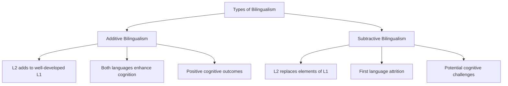
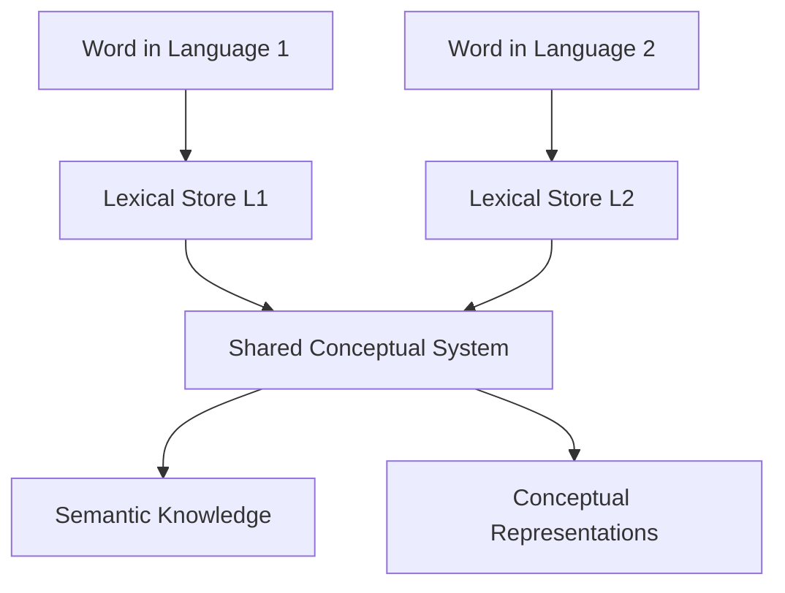

# Multilingualism: Basic Concepts and Structure

> "To have another language is to possess a second soul." — Charlemagne (742/7 – 814), King of the Franks

## Introduction

Multilingualism is not an exception but the natural state of human language capacity. Contrary to popular belief, most of the world's population is multilingual. The ability to use multiple languages represents one of the most sophisticated cognitive achievements of the human mind.

In this comprehensive exploration, we examine the fundamental concepts of multilingualism, its structural components, and how it manifests across different societies, with special attention to the rich multilingual landscape of India.

## Defining Multilingualism

### Core Definition

**Multilingualism** refers to the knowledge and use of more than one language by an individual or within a social group. It encompasses the ability to switch between languages in speech, writing, or reading contexts. Related terms include:

- **Bilingualism**: Use of two languages
- **Polylingualism**: Use of multiple languages
- **Plurilingualism**: Individual's repertoire of languages
- **Diglossia**: Functional distribution of languages in society
- **Languages-in-contact**: Interaction between language systems

:::tip Key Terminology
- **Polyglot**: A person who knows multiple languages (from Greek: poly = "many", glot = "language")
- **Monoglot**: A person who knows only one language
:::

### Types of Multilingualism

#### 1. **Personal Multilingualism**
Individual knowledge and verbal behavior not necessarily shared by the entire community. For example, a person who learns French for career purposes while living in a predominantly English-speaking area.

#### 2. **Social Multilingualism**
Communicative practices of a nation, tribe, or social group that sustains multiple languages. India exemplifies this with nearly 200 languages spoken by its population.

#### 3. **Intersubjective Multilingualism**
Shared language practices between specific groups or communities, creating unique communication dynamics.

## The Evolution of Multilingualism Definitions

### Traditional Definition (Bloomfield, 1933)
Early scholars like Leonard Bloomfield held a restrictive view:
- Languages must be learned simultaneously in early childhood
- Native-like competence required in all modalities (oral and written)
- Equal proficiency across all languages

### Contemporary Definition (Haugen, Oksaar, Grosjean)
Modern linguists adopt a broader, more inclusive perspective:
- Regular use of multiple languages
- Ability to switch between languages as needed
- Independent of symmetry in command
- Regardless of acquisition modality
- Irrespective of linguistic distance between varieties

:::info Real-World Example
An Indian guest worker who learns Swiss German dialect for daily communication in Switzerland is considered bilingual, just as an EU interpreter with systematic French-English bilingualism is—though in different ways.
:::

## Categories of Multilingualism

### Elite vs. Neighborhood Bilingualism

#### Elite Bilingualism
- **Context**: Formal educational settings
- **Method**: Planned, systematic instruction
- **Example**: Learning French in school
- **Characteristics**: Academic approach, structured curriculum

#### Neighborhood Bilingualism
- **Context**: Natural community settings
- **Method**: Interaction-based acquisition
- **Example**: Learning Hindi from neighborhood friends
- **Characteristics**: Organic, contextual learning

### Additive vs. Subtractive Bilingualism

**Additive Bilingualism** (Cummins, 1976):
- Second language acquired alongside well-developed first language
- Both languages maintain vitality
- Associated with enhanced cognitive abilities
- Typical in supportive educational environments

**Subtractive Bilingualism**:
- Elements of second language replace first language
- First language may atrophy
- Can lead to decreased thinking ability
- Common in assimilationist contexts

### Simultaneous vs. Sequential Bilingualism

| Feature | Simultaneous Bilingualism | Sequential Bilingualism |
|---------|---------------------------|-------------------------|
| **Acquisition Timing** | From birth | After first language established |
| **Language Exposure** | Both languages from infancy | L1 first, then L2 |
| **Common Context** | Bilingual household | Immigration, education |
| **Developmental Pattern** | Parallel development | Consecutive development |
| **Example** | Child with parents speaking different languages | School-based language learning |

## The Structure of Multilingual Competence

### Universal Grammar and Language Acquisition

According to Chomsky's **Principles and Parameters** theory:

1. **Principles**: Universal features common to all languages
2. **Parameters**: Variables that account for linguistic diversity
3. **Language Acquisition Device (LAD)**: Innate biological endowment for language

When a child is exposed to multiple linguistic systems:
- The innate LAD activates for each language
- Parameters are set according to input
- Multiple grammars coexist in the mind

:::note Theoretical Framework
Grammar represents a collection of choices from a universal menu of options. Each language "selects" different parameter settings, and children exposed to multiple languages set multiple parameter configurations simultaneously.
:::

### The Multilingual Lexicon

The multilingual mind maintains complex lexical organization:

#### Theoretical Perspectives

**1. Concept Mediation Account** (Kroll & Sholl, 1992)
- Lexical knowledge stored in language-specific systems
- Semantic knowledge stored in common conceptual system
- Translation accesses shared conceptual representations
- Supported by evidence from fluent bilinguals

**2. Language-Specific Storage** (Paivio, 1986)
- Both lexical and semantic knowledge language-specific
- Separate memory stores for each language
- Limited cross-language semantic facilitation
- Less empirical support

## Multilingualism in India

### The Sociolinguistic Giant

India represents one of the world's most complex multilingual environments:

**Statistical Overview**:
- 1,620 mother tongues (reduced to ~200 languages)
- Many minority language populations exceed European countries
- Multilingualism is the norm, not the exception
- Constitutional recognition of 22 scheduled languages

### Three Language Formula

The Indian educational system implements a systematic approach:

1. **Mother Tongue/Regional Language**: Primary language of instruction
2. **Hindi**: Official language (or another Indian language in Hindi-speaking regions)
3. **English**: Link language for higher education and administration

**Implementation**:
- Introduced at upper primary level
- Simultaneous learning of multiple languages
- Aims to promote national integration and linguistic diversity

### Metropolitan Multilingualism

Cities like Mumbai and Delhi showcase extreme linguistic diversity:

**Mumbai Example** (Pai, 2005):
- Every child exposed to at least 4 languages from infancy
- Marathi (regional language)
- Hindi (national language)
- English (education/administration)
- Heritage language (family's origin state)

This early and rich exposure creates unique cognitive advantages and linguistic flexibility.

## Global Perspectives on Multilingualism

### Multilingualism as Global Norm

**Key Statistics**:
- 60% of world population affected by multilingualism (end of 20th century)
- Monolingualism represents a boundary case, not the norm
- Specific cultural conditions create monolingual environments
- Bilingualism is one form within the multilingual spectrum

### Cultural Variations

#### United States
- Bilingualism viewed as exceptional
- Relatively few native-born Americans achieve fluency in second language
- Recent increase in Spanish-English bilingualism

#### Europe
- Multilingualism standard in many regions
- Flemish Belgium: French, English, German commonly learned
- Luxembourg: Luxembourgish, French, German standard

#### India
- Four or more languages common (Khubchandani, 1997)
- Linguistic diversity viewed as cultural wealth
- Practical necessity drives multilingualism

## Language and Culture

### The Inseparability of Language and Culture

Language serves as repository of:
- Cultural values
- Collective memories
- Historical knowledge
- Social practices
- Identity markers

:::important Cultural Semiotics
The boundary between language semantics and cultural semiotics is blurred. Multilingualism naturally extends into multiculturalism, as each language carries its cultural universe.
:::

### Historical Example: Austro-Hungarian Empire

The empire demonstrated complex multilingualism:
- Multiple linguistic communities with territorial bases
- Common state dominated by German
- Each language preserved distinct cultural identity
- Language diversity reflected political complexity

## Cognitive Implications

### The Threshold Hypothesis (Cummins, 1976)

For positive cognitive effects of bilingualism:
1. **Minimum Threshold**: Both languages must reach certain proficiency level
2. **Balanced Proficiency**: Similar competence in both languages optimal
3. **Additive Context**: Supportive environment for both languages

Below threshold: Potential negative effects
Above threshold: Enhanced cognitive abilities

### Neurocognitive Foundations

Recent neuroscience research reveals:
- **Early Bilinguals**: Single integrated neural network adaptable to multiple languages
- **Late Bilinguals**: May establish separate neural areas for later-acquired languages
- **Plasticity**: Brain's remarkable ability to accommodate multiple language systems

## Practical Implications

### Educational Contexts

**Optimal Conditions for Multilingual Development**:
1. Early exposure to multiple languages
2. Consistent use of each language in meaningful contexts
3. Positive attitudes toward all languages
4. Opportunities for formal and informal learning
5. Recognition of multilingualism as asset

### Social Contexts

**Supporting Multilingualism**:
- Value diversity of languages
- Create spaces for multiple language use
- Recognize cognitive and cultural benefits
- Avoid subtractive language environments

## Memory Aids

### Key Concepts Mnemonic: "SIMPLE"

- **S**ocial and Personal types
- **I**nnate capacity (LAD)
- **M**ultiple exposure patterns
- **P**arameters and Principles
- **L**exical organization
- **E**lite vs. Neighborhood contexts

### Types of Bilingualism Matrix

| Dimension | Type A | Type B |
|-----------|--------|--------|
| Timing | Simultaneous | Sequential |
| Context | Elite | Neighborhood |
| Effect | Additive | Subtractive |
| Balance | Balanced | Unbalanced |

## Self-Assessment Questions

1. **Conceptual Understanding**: Explain the difference between personal, social, and intersubjective multilingualism. Provide examples from your own experience or observation.

2. **Theoretical Application**: How does Chomsky's Principles and Parameters theory explain how children can acquire multiple languages simultaneously without confusion?

3. **Critical Analysis**: Compare and contrast the traditional (Bloomfield) and contemporary (Grosjean) definitions of multilingualism. Which definition is more inclusive and why?

4. **Indian Context**: How does the Three Language Formula in Indian education support multilingual development? What are its strengths and potential limitations?

5. **Cognitive Development**: Explain the threshold hypothesis. Why might balanced bilingualism lead to cognitive advantages while unbalanced bilingualism might not?

6. **Real-World Application**: Design a language learning environment for a child that would promote additive rather than subtractive bilingualism. What factors would you consider?

## Exam Preparation Notes

### High-Yield Topics
- Definitions and types of multilingualism ⭐⭐⭐
- Additive vs. subtractive bilingualism ⭐⭐⭐
- Multilingualism in Indian context ⭐⭐⭐
- Principles and Parameters theory ⭐⭐
- Threshold hypothesis ⭐⭐

### Common Exam Questions
1. Discuss the multilingual landscape of India
2. Explain types of bilingualism with examples
3. Compare traditional and contemporary definitions
4. Analyze the relationship between multilingualism and culture

---

## Further Reading

### Research Articles
- **Grosjean, F. (1982).** Life with Two Languages: An Introduction to Bilingualism. Harvard University Press.
- **Cummins, J. (1976).** The influence of bilingualism on cognitive growth: A synthesis of research findings. *Working Papers on Bilingualism, 9*, 1-43.
- **Bhatia, T. K., & Ritchie, W. C. (1999).** The bilingual child. In T. K. Bhatia & W. C. Ritchie (Eds.), *Handbook of Child Language Acquisition* (pp. 569-646).

### Books
- Edwards, J. (1994). *Multilingualism*. London: Routledge.
- Cenoz, J., & Genesee, F. (1998). *Beyond Bilingualism: Multilingualism and Multilingual Education*. Clevedon: Multilingual Matters.

### Online Resources
- [Wikipedia: Multilingualism](https://en.wikipedia.org/wiki/Multilingualism)
- [Wikipedia: Bilingualism](https://en.wikipedia.org/wiki/Bilingualism)
- [MIT OpenCourseWare: Bilingualism](https://ocw.mit.edu/search/?q=bilingualism)

### Videos
- **CrashCourse Linguistics**: [What is Multilingualism?](https://www.youtube.com/c/crashcourse) - Overview of multilingual language use
- **TED-Ed**: [The benefits of a bilingual brain](https://www.youtube.com/watch?v=MMmOLN5zBLY) - Cognitive advantages of multilingualism

---

**Source PDFs**: 
- 📄 [Block-3/Unit-3.pdf - Pages 37-40](/pdfs/MPC-001%20Cognitive%20Psychology,%20Learning%20and%20Memory/Block-3/Unit-3.pdf)
- 📚 MPC-001 Cognitive Psychology, Learning and Memory
