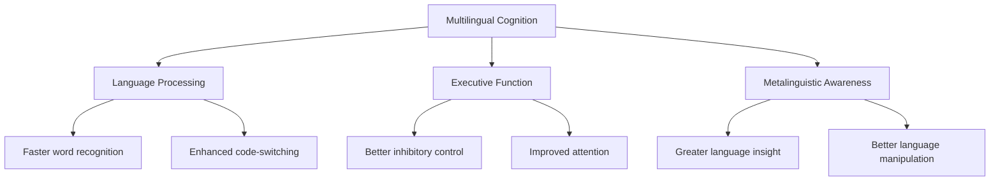
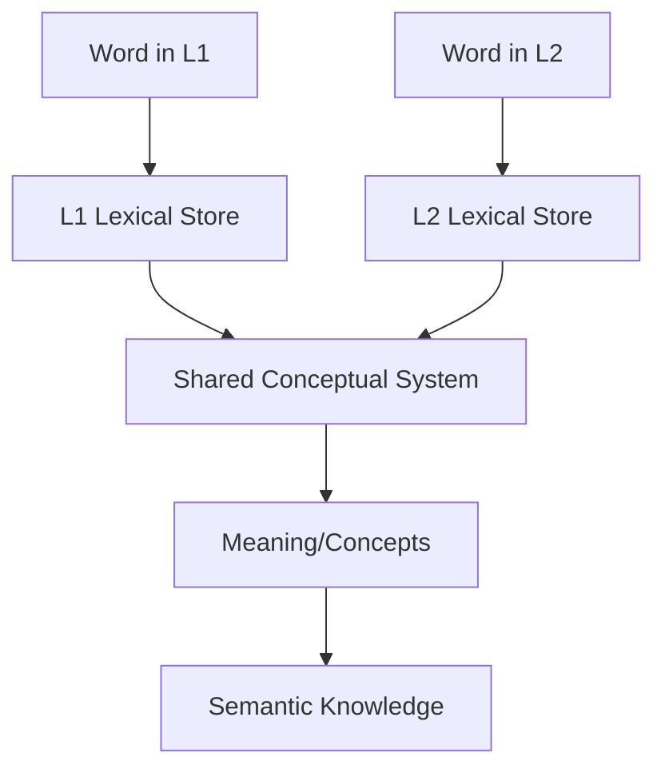
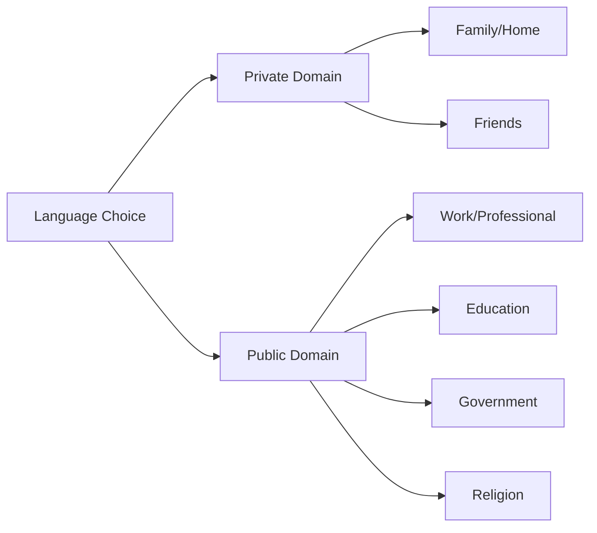
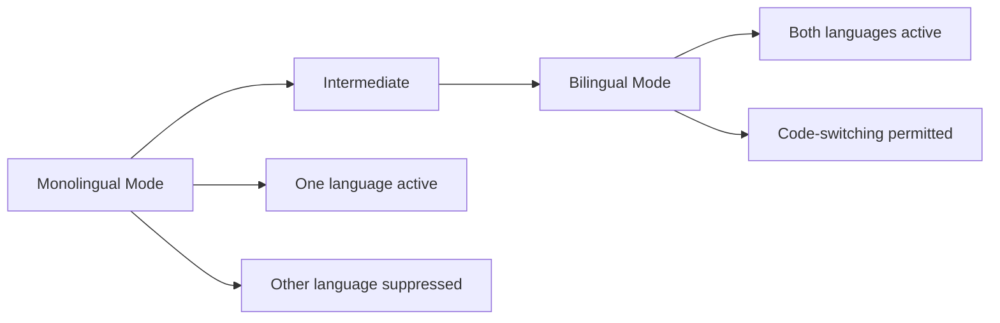
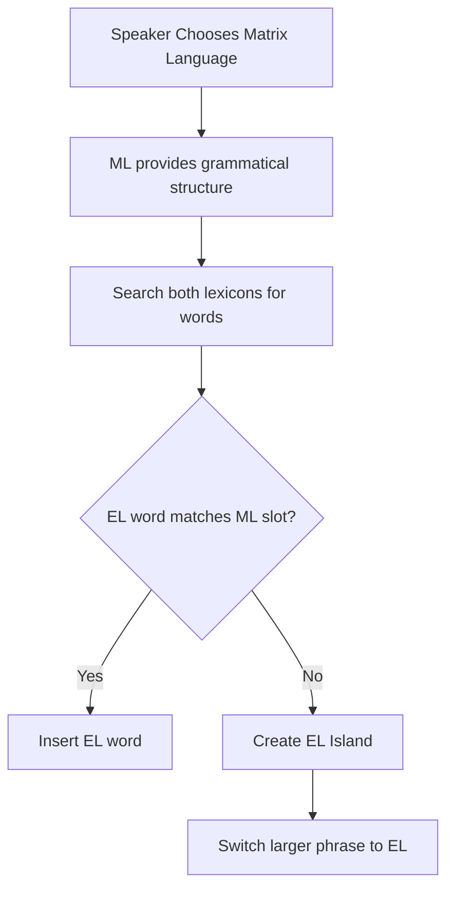

# Multilingualism and Cognition: Language Choice and Code-Switching

## Introduction

The multilingual mind represents one of the most fascinating subjects in cognitive psychology. How do individuals who speak multiple languages manage to keep their languages separate yet accessible? How do they choose which language to use in different contexts? And most intriguingly, how do they seamlessly switch between languages mid-conversation?

This exploration delves into the cognitive mechanisms underlying multilingual language use, focusing on code-switching, language choice strategies, and the cognitive processing advantages that multilinguals demonstrate over monolinguals.

## Multilingualism as the Norm

> "What all this means is that the monolingual approach is neither appropriate nor adequate for the investigation of language use in a society where multilingualism was endemic and where, for the educated at least, monolingualism was the exception and not the norm." — Trotter (2000)

This perspective challenges traditional psycholinguistic research that has typically used monolinguals as the "standard" participants. In reality:
- Multilingualism affects 60% of the world's population
- Monolingualism represents a special case, not the universal standard
- Language processing theories must account for multilingual capabilities

## Relations Between Languages and Their Users

### How Multilingualism Develops

#### Natural Acquisition Contexts

**1. Family Context**
- Growing up with parents speaking different languages
- Grandparents using heritage language
- Siblings using different languages in different settings

**2. Community Context**
- Being part of a linguistic minority
- Living in multilingual communities
- Exposure through neighborhood interactions

**3. Educational Context**
- Formal language instruction in schools
- Immersion programs
- Academic language requirements

**4. Immigration Context**
- Learning host country language
- Maintaining heritage language
- Navigating between cultural contexts

### Enhanced Cognitive Abilities

Research consistently demonstrates that multilingualism enhances various cognitive capacities:

## Code-Switching: The Cognitive Marvel

### Definition and Significance

**Code-switching** refers to the ability of multilinguals to alternate between languages during communication. This phenomenon demonstrates:
- Remarkable cognitive flexibility
- Sophisticated language control mechanisms
- Enhanced communicative competence

:::important Key Finding
Code-switching often requires **no additional processing time** compared to monolingual speech, and may actually be **faster** in some contexts. This challenges the notion that managing multiple languages imposes cognitive burden.
:::

### Research Evidence: Cross-Word Puzzle Study

**Peynircioglu & Tekcan (1993)** conducted a landmark study:

**Method**:
- Monolinguals and bilinguals searched completed crossword puzzles
- Task: Find words in Turkish and English
- Measured time to locate words

**Results**:

| Group | Single Language Search | Dual Language Search |
|-------|------------------------|----------------------|
| Monolinguals | Baseline time | N/A |
| Bilinguals | Equal to monolinguals | **Faster than monolinguals** |

**Conclusion**: Bilinguals demonstrate an **advantage in word recognition** when allowed to use both languages, suggesting enhanced lexical access mechanisms.

### Types of Code-Switching

#### 1. **Inter-Sentential Code-Switching**
Switching between languages at sentence boundaries:
> "I went to the store yesterday. वहाँ बहुत भीड़ थी।" (There was a lot of crowd.)

#### 2. **Intra-Sentential Code-Switching**
Switching within a single sentence:
> "Main office में meeting hai at 3 PM."

#### 3. **Tag-Switching**
Inserting tags or exclamations from one language into another:
> "That's a beautiful painting, *¿no?*"

#### 4. **Insertional Code-Switching**
Inserting words or phrases from one language into another:
> "I need to buy कुछ vegetables from the market."

### Cognitive Processes in Code-Switching

**Control Mechanisms**:
1. **Language Selection**: Choosing appropriate language
2. **Inhibition**: Suppressing non-target language
3. **Monitoring**: Checking output for appropriateness
4. **Flexibility**: Rapid switching when needed

## Lexical and Semantic Processing

### Two Competing Theories

#### Theory 1: Concept Mediation Model (Kroll & Sholl, 1992)

**Key Features**:
- Lexical knowledge stored separately for each language
- Semantic/conceptual knowledge shared across languages
- Translation accesses common conceptual representations
- Predicts facilitation for semantic processing across languages

**Supporting Evidence** (Amrhein & Sanchez, 1997):
- Semantic processing of words in one language facilitates memory in another
- Categorized list translation shows better recall than random list translation
- Fluent bilinguals show stronger concept mediation effects

#### Theory 2: Language-Specific Storage (Paivio, 1986)

**Key Features**:
- Both lexical AND semantic knowledge stored separately
- Each language maintains independent memory stores
- Cross-language facilitation should be minimal
- Less empirical support in recent research

### Research Findings

**De Groot, Dannenburg, & Van Hell (1994)** study:
- Tested translation and semantic categorization
- Found evidence for shared conceptual system
- Fluent bilinguals showed automatic concept mediation
- Supports Theory 1 (Concept Mediation)

**Implications**:
- Multilinguals access a common meaning system
- Translating between languages activates shared concepts
- Fluency enhances cross-linguistic semantic connections

## Voice Recognition and Language Familiarity

### Goggin Study (1991): Voice Identification Across Languages

**Research Question**: Does language familiarity affect voice recognition accuracy?

**Participants**:
- English monolinguals
- Spanish-English bilinguals

**Method**:
1. Participants heard texts read in English, Spanish, or Spanish-accented English
2. Later heard "voice line-up" of different speakers
3. Task: Identify original speaker

**Results**:

| Group | Best Performance |
|-------|------------------|
| **Monolinguals** | Native language (English) |
| **Bilinguals** | **Equal across all three voice types** |

**Interpretation**:
- Bilinguals' knowledge of multiple languages aids voice source identification
- Represents interesting interaction between speech perception and higher-level language analysis
- Demonstrates **multilingual advantage** in auditory processing

:::tip Practical Application
This finding has implications for:
- Eyewitness testimony in multilingual contexts
- Voice recognition technology
- Understanding speaker identification processes
:::

## Rule-Governed Language Choice

### Not Random: Systematic Language Selection

Contrary to popular belief, multilinguals don't randomly choose which language to speak. Language choice follows **systematic rules** based on multiple factors.

### Domains of Language Use (Fishman, 1967)

**Macrosociolinguistic Domains**:

**Examples**:
- **Home**: Heritage language (e.g., Hindi)
- **Work**: Professional language (e.g., English)
- **Education**: Academic language (varies)
- **Religion**: Traditional/classical language (e.g., Sanskrit)
- **Friends**: Peer group language (code-mixed)

### Situational Factors (Grosjean, 1982)

When domains overlap, multilinguals consider:

1. **Interlocutor**: Who am I speaking to?
   - Their language competence
   - Their language preference
   - Power dynamics

2. **Topic**: What am I discussing?
   - Technical vs. casual
   - Emotional vs. neutral
   - Shared vs. individual knowledge

3. **Setting**: Where am I?
   - Formal vs. informal
   - Public vs. private
   - Traditional vs. modern spaces

4. **Function**: Why am I communicating?
   - Information exchange
   - Social bonding
   - Identity marking
   - Accommodation

**Example Scenario**:
> An adolescent speaks with a minister [religion] about football [leisure] in the school building [education]

**Decision Process**:
- Individual factors are isolated and weighted
- Most salient factor typically determines language choice
- May involve code-switching to navigate competing demands

## Monolingual vs. Bilingual Communication Modes

### Grosjean's Language Mode Continuum (1985)

#### Monolingual Mode
- **Characteristics**: One language active, other(s) deactivated
- **Context**: Speaking with monolinguals
- **Strategy**: Maximum suppression of non-target language
- **Effort**: Requires cognitive control

#### Bilingual Mode
- **Characteristics**: Both languages activated
- **Context**: Speaking with other bilinguals
- **Strategy**: Full repertoire available
- **Effort**: Natural, less cognitive load

**Factors Determining Mode**:
- Interlocutors' linguistic repertoires
- Degree of formality
- Social norms and expectations
- Normative representations
- Mutual agreement on appropriateness

:::note Important Insight
A bilingual conversation isn't "automatic" even between two bilinguals. It requires **locally established mutual agreement** about the appropriateness of bilingual mode.
:::

## The Grammar of Code-Switching

### Mixing is Rule-Governed

Code-switching isn't chaotic language mixing but follows systematic grammatical principles:

#### Matrix Language Frame Model (Myers-Scotton, 1993)

**Core Concepts**:
1. **Matrix Language (ML)**: Provides grammatical framework
2. **Embedded Language (EL)**: Provides insertions
3. **Constraints**: Rules govern what can be mixed

**Process**:

**Example**:
> *Matrix Language: English*
> "I need to buy some **sabzi** (vegetables) from the market."
> 
> Here, "sabzi" (Hindi) fits into English grammatical slot for object noun.

**When Matching Fails**:
> *Create Embedded Language Island*
> "I went **bazaar mein** (to the market) yesterday."
> 
> Here, "bazaar mein" (Hindi postpositional phrase) doesn't match English structure, so entire phrase switches to Hindi.

### Minimalist Approach (MacSwan, 1997, 1999)

**Key Claim**: "Nothing constrains code-switching apart from the requirements of the mixed grammars."

**Implications**:
- Code-switching follows universal grammatical principles
- No special "code-switching grammar"
- Any combination permitted if both grammars allow it
- Linguistic theory must account for multilingual competence

### Universal Constraints

Research identifies several universal constraints:

1. **Free Morpheme Constraint**: Can't switch between bound morphemes
   - ✅ "I'm eating **khana**" (food)
   - ❌ "I'm **eat**-ing" (partial English verb stem with Hindi suffix)

2. **Equivalence Constraint**: Switch only where syntactic structures align
   - Must respect word order of both languages

3. **Functional Head Constraint**: Function words come from matrix language
   - Determiners, auxiliaries, pronouns from one language

## Cognitive Advantages of Multilingual Language Processing

### Enhanced Executive Function

Multilinguals constantly:
- Monitor which language to use
- Inhibit inappropriate language
- Switch between language systems
- Resolve linguistic conflicts

This ongoing mental exercise strengthens **executive function**:
- Better inhibitory control
- Enhanced selective attention
- Improved cognitive flexibility
- Superior problem-solving

### Metalinguistic Awareness

**Definition**: Understanding language as a system that can be examined and manipulated.

**Multilingual Advantages**:
1. Greater awareness of language structures
2. Better ability to detect anomalous sentences
3. Enhanced understanding of grammatical rules
4. Superior language learning capabilities

**Research Example** (Galambos & Goldin-Meadow, 1990):
- Bilingual children better at detecting grammatical errors
- Superior ability to explain language rules
- Enhanced understanding of arbitrariness of language

### Processing Speed

Contrary to earlier beliefs:
- Multilinguals process language as fast as monolinguals
- Code-switching adds minimal or no processing time
- In some contexts, bilingual mode is **faster**

**Why?**
- Parallel activation of both languages
- Larger combined vocabulary
- Multiple routes to meaning
- Enhanced lexical access mechanisms

## Implications for Language Theory

### Rethinking Linguistic Theory

Traditional linguistic theory based on monolingual competence is **insufficient**:

1. **Must Account for Multilingual Competence**
   - Code-switching data reveals universal constraints
   - Mixed utterances test grammatical theories
   - Multilingualism is default, monolingualism special case

2. **Lexical Theory Requirements**
   - Explain bilingual lexicon organization
   - Account for cross-language semantic effects
   - Integrate findings from code-switching research

3. **Theory Evaluation Criteria**
   - Capacity to explain bilingual speech
   - Ability to predict code-switching patterns
   - Consistency with neurolinguistic evidence

## Memory Aids

### Code-Switching Mnemonic: "CRIMES"

- **C**ontext matters (formal vs. informal)
- **R**ules govern choices (not random)
- **I**nterlocutor competence considered
- **M**atrix language provides structure
- **E**mbedded language fills gaps
- **S**witching enhances communication

### Language Choice Factors: "FITS"

- **F**unction: Purpose of communication
- **I**nterlocutor: Who you're speaking to
- **T**opic: What you're discussing
- **S**etting: Where conversation occurs

## Self-Assessment Questions

1. **Cognitive Processing**: Explain why code-switching doesn't necessarily slow down communication. What does this reveal about bilingual language processing?

2. **Theory Application**: Use the Matrix Language Frame Model to analyze this sentence: "I'm going to the bazaar to buy sabzi and phool." Identify the matrix language and explain the code-switches.

3. **Research Evaluation**: Compare the Concept Mediation Model and Language-Specific Storage Model. Which has better empirical support and why?

4. **Critical Analysis**: A monolingual might view code-switching as "confused" language use. Using evidence from this unit, explain why this view is incorrect.

5. **Practical Application**: Design a study to test whether bilinguals have better executive function than monolinguals. What tasks would you use and why?

6. **Real-World Context**: Analyze your own or observed language choice patterns using Grosjean's situational factors framework. What patterns emerge?

## Exam Preparation Notes

### High-Yield Topics
- Code-switching mechanisms ⭐⭐⭐
- Matrix Language Frame Model ⭐⭐⭐
- Concept Mediation vs. Language-Specific Storage ⭐⭐⭐
- Grosjean's Language Modes ⭐⭐
- Rule-governed language choice ⭐⭐

### Common Exam Questions
1. Explain the cognitive processes involved in code-switching
2. Discuss research evidence for cognitive advantages of multilingualism
3. Describe theories of bilingual lexical organization
4. Analyze factors influencing language choice in multilinguals

---

## Further Reading

### Research Articles
- **Myers-Scotton, C. (1993).** Dueling Languages: Grammatical Structure in Code-Switching. Oxford University Press.
- **Kroll, J. F., & Sholl, A. (1992).** Lexical and conceptual memory in fluent and nonfluent bilinguals. In R. J. Harris (Ed.), *Cognitive Processing in Bilinguals* (pp. 191-204).
- **Grosjean, F. (1985).** The bilingual as a competent but specific speaker-hearer. *Journal of Multilingual and Multicultural Development, 6*(6), 467-477.

### Contemporary Research
- **Peynircioglu, Z. F., & Tekcan, A. İ. (1993).** Word perception in two languages. *Journal of Memory and Language, 32*, 390-401.
- **Goggin, J. P., et al. (1991).** Cross-language voice identification. *Journal of Experimental Psychology: Human Perception and Performance, 17*, 1088-1098.

### Books
- Grosjean, F. (1982). *Life with Two Languages: An Introduction to Bilingualism*. Harvard University Press.
- MacSwan, J. (Ed.). (2014). *Grammatical Theory and Bilingual Code-switching*. MIT Press.

### Online Resources
- [Wikipedia: Code-Switching](https://en.wikipedia.org/wiki/Code-switching)
- [Wikipedia: Metalinguistic Awareness](https://en.wikipedia.org/wiki/Metalinguistic_awareness)
- [Linguistic Society of America: Code-Switching](https://www.linguisticsociety.org/resource/faq-what-code-switching)

### Videos
- **TED Talk**: [The benefits of a bilingual brain](https://www.youtube.com/watch?v=MMmOLN5zBLY) - Mia Nacamulli
- **Crash Course Linguistics**: [Code-Switching](https://www.youtube.com/watch?v=9lu8OWs84z8) - Mechanisms and examples

---

**Source PDFs**: 
- 📄 [Block-3/Unit-3.pdf - Pages 40-43](/pdfs/MPC-001%20Cognitive%20Psychology,%20Learning%20and%20Memory/Block-3/Unit-3.pdf)
- 📚 MPC-001 Cognitive Psychology, Learning and Memory
