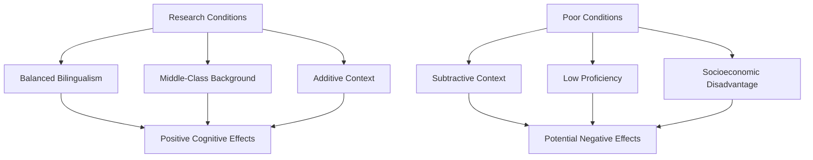
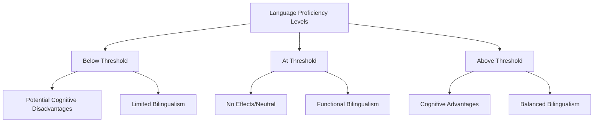
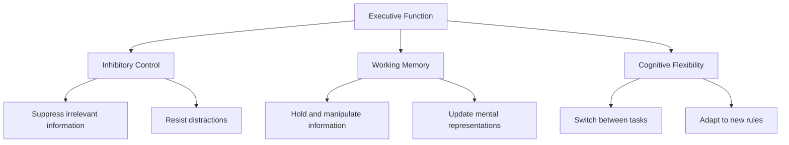
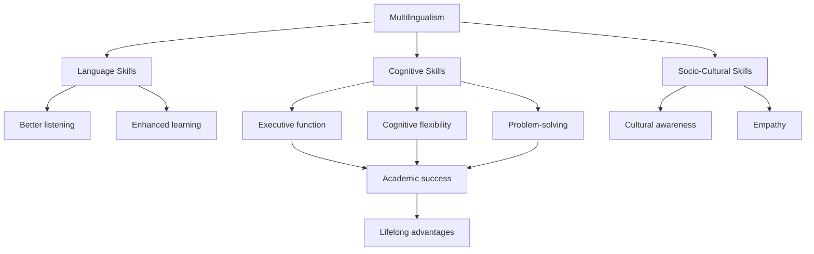

# Multilingualism and Thinking: Cognitive Benefits and Enhanced Abilities

## Introduction

One of the most intriguing questions in cognitive psychology is whether speaking multiple languages changes the way we think. Does a person who can speak and think in two or more languages think differently in each language? Do multilinguals think differently from monolinguals? And perhaps most importantly, does multilingualism enhance or hinder cognitive abilities?

This comprehensive exploration examines the extensive research demonstrating that multilingualism confers substantial cognitive advantages, from enhanced executive function to superior problem-solving abilities.

## The Fundamental Questions

### Core Research Questions

1. **Language-Specific Thinking**: Does a person think differently when using different languages?
2. **Comparative Cognition**: Do multilinguals think differently from monolinguals?
3. **Cognitive Impact**: What differences emanate from multiple versus single language availability?
4. **Intelligence Effects**: Does multilingualism affect intelligence positively or negatively?
5. **Processing Efficiency**: Does multilingualism make thinking more difficult or enhanced?

## Historical Context: Evolving Perspectives

### Early Contradictory Findings

**Pre-1960s Research** (Hakuta, 1986):
- Mixed and contradictory results
- Negative views of bilingualism prevalent
- Concerns about cognitive confusion
- "Semilingualism" concept suggested cognitive deficits

**Contributing Factors to Inconsistency**:
- Different participant populations
- Varying methodologies
- Different language combinations
- Experimenter biases
- Failure to control for socioeconomic status
- Incomplete language proficiency assessments

### The Paradigm Shift

**1960s Onwards**:
- Positive effects consistently found when properly controlled
- Recognition of moderating variables
- Understanding of threshold effects
- Appreciation of context importance

## Additive vs. Subtractive Bilingualism

### Cummins' Framework (1976)

#### Additive Bilingualism

**Definition**: Second language acquired alongside well-developed first language.

**Characteristics**:
- Both languages maintain vitality
- Neither language displaces the other
- Supportive educational environment
- Positive attitudes toward both languages
- Cultural pride in both linguistic identities

**Cognitive Outcomes**:
- ✅ Enhanced metalinguistic awareness
- ✅ Improved executive function
- ✅ Greater cognitive flexibility
- ✅ Superior problem-solving abilities
- ✅ Enhanced creativity

**Example Contexts**:
- Canadian French immersion programs
- Elite bilingual schools
- Supportive immigrant communities
- Middle-class bilingual households

#### Subtractive Bilingualism

**Definition**: Elements of second language replace first language.

**Characteristics**:
- First language attrition
- Pressure to abandon heritage language
- Negative attitudes toward L1
- Assimilationist educational policies
- Cultural-linguistic identity conflict

**Cognitive Outcomes**:
- ⚠️ Potential cognitive confusion
- ⚠️ Academic difficulties
- ⚠️ Reduced metalinguistic awareness
- ⚠️ Identity conflicts affecting cognition

**Example Contexts**:
- Historical "English-only" policies
- Forced language shift situations
- Unsupportive educational environments
- Socioeconomic disadvantage

### Comparison Table

| Feature | Additive Bilingualism | Subtractive Bilingualism |
|---------|----------------------|-------------------------|
| **L1 Status** | Maintained and valued | Diminished or lost |
| **L2 Acquisition** | Adds to repertoire | Replaces L1 elements |
| **Environment** | Supportive | Assimilationist |
| **Cognitive Effect** | Enhancement | Potential deficit |
| **Identity** | Integrated bicultural | Conflicted |
| **Academic Outcome** | Positive | Variable/negative |

## The Threshold Hypothesis

### Cummins' Threshold Model (1976)

One of the most influential theories explaining variable outcomes in bilingual cognition:

**Key Components**:

1. **First Threshold**: Minimum level for avoiding negative effects
   - Must achieve basic proficiency in both languages
   - Below this: risk of cognitive confusion
   - "Semilingualism" concerns apply here

2. **Second Threshold**: Level for positive cognitive effects
   - High proficiency in both languages
   - Balanced competence
   - Above this: cognitive advantages emerge

**Critical Implications**:
- Proficiency level matters more than mere bilingualism
- Both languages must reach threshold
- Partial bilingualism may not confer benefits
- Quality of bilingualism crucial

:::important Clinical Application
This framework helps explain why some research found negative effects while others found positive effects. The determining factor isn't bilingualism itself but the **level of proficiency achieved** in both languages.
:::

## Research Evidence: Eleanor Study (1993)

### Comprehensive Investigation

**Research Design**:
- **Participants**: 227 adults (mostly university students)
  - 17 monolinguals
  - 120 partial multilinguals
  - 90 competent multilinguals

**Variables Measured**:
1. Language proficiency
2. Learning mode (concrete experience, reflective observation, abstract conceptualization, active experimentation)
3. Learning style (diverger, assimilator, converger, accommodator)
4. Abstract reasoning (analogy-solving ability)
5. Age of second language acquisition

### Key Findings

#### 1. **Language and Analogy-Solving**

| Group | Analogy-Solving Score |
|-------|----------------------|
| Native English speakers | Higher |
| Non-native English speakers | Lower |
| **Competent multilinguals** | **Highest overall** |

Among competent multilinguals, native English speakers scored higher than non-native speakers, but **both outperformed less proficient bilinguals**.

#### 2. **Learning Mode Differences**

- Competent multilinguals scored **lower on reflective observation**
- Suggests more active, engaged learning style
- Significant **negative correlation** between learning mode and analogy-solving

#### 3. **Age of Acquisition Effects**

**Unexpected Finding**:
- Individuals learning L2 **after age 12** had **higher analogy-solving scores**
- However, early L2 learners were more likely to become competent multilinguals

**Interpretation**:
- Early acquisition → Better proficiency
- Later acquisition + high proficiency → Enhanced abstract reasoning
- Optimal: Early start with continued development

#### 4. **No Significant Style Effects**

- No difference in learning styles between groups
- No interaction between proficiency and learning mode/style
- Suggests cognitive advantages relatively independent of learning preferences

### Implications

1. Competent multilingualism confers cognitive advantages
2. Proficiency level crucial for benefits
3. Age effects complex and nuanced
4. Native language background influences specific abilities

## Cognitive Benefits: Beyond Language

### The Multifaceted Advantages

Research demonstrates that multilingual advantages **extend far beyond linguistic knowledge** into general cognitive abilities (Cook, 1999, 2002).

### 1. Enhanced Metalinguistic Awareness

**Definition**: Understanding language as a system that can be examined and manipulated.

**Research Evidence**:

**Galambos & Goldin-Meadow (1990)**:
- Bilingual children showed superior awareness of language structures
- Better detection of grammatical anomalies
- Enhanced understanding of language arbitrariness

**Bialystok (2001)**:
- Bilingual children better at detecting anomalous sentences
- Example: "Why is the cat barking?" recognized as semantically odd faster
- Superior metalingual abilities across age ranges

**Ewert (2006, 2008)**:
- Longitudinal studies confirm persistent advantages
- Benefits maintained into adulthood
- Enhanced language learning capabilities

**Cummins (1981)** Quotation:
> "Foreign language learning enhances children's understanding of how language itself works and their ability to manipulate language in the service of thinking and problem solving."

**Practical Manifestations**:
- Better grammar understanding
- Superior language learning ability
- Enhanced reading comprehension
- Improved writing skills

### 2. Superior Executive Function

**Components of Executive Function**:

**Bialystok et al. (2004)** Landmark Study:
- Bilinguals consistently better at dealing with distractions
- Enhanced selective attention across lifespan
- **Critical Finding**: May help **offset age-related cognitive decline**
- Executive function advantages maintained in elderly bilinguals

**Mechanism**:
- Constant language management exercises executive control
- Monitoring which language to use
- Inhibiting non-target language
- This ongoing practice strengthens executive function networks

:::tip Lifespan Benefits
Bilingualism may provide "cognitive reserve" that protects against:
- Age-related cognitive decline
- Dementia onset (delayed by 4-5 years in some studies)
- Executive function deterioration
:::

### 3. Enhanced Memory and Attention

**Ratte (1968)** & **Lapkin et al. (1990)**:
- Bilinguals demonstrate better auditory processing
- Superior listening skills
- Enhanced memory for verbal information
- "Better ear for listening and sharper memories"

**Attentional Advantages**:
- Better selective attention
- Superior divided attention
- Enhanced sustained attention
- Improved attention switching

### 4. Superior Spatial Abilities

**Diaz (1983)** Research:
- Bilingual children showed better spatial abilities
- Enhanced performance on:
  - Mental rotation tasks
  - Spatial visualization
  - Pattern recognition
  - Geographic reasoning

**Why Spatial Advantages?**
- Language switching exercises mental flexibility
- May transfer to spatial reasoning
- Abstract thinking enhanced
- Multiple perspective-taking practiced

### 5. Greater Cognitive Flexibility

**Hakuta (1986)** Review:
- Bilinguals show generally greater cognitive flexibility
- Better at:
  - Switching between different task demands
  - Adapting to new situations
  - Considering multiple perspectives simultaneously
  - Creative problem-solving

**Problem-Solving Advantages**:
- Higher-order thinking skills
- Better divergent thinking
- Enhanced convergent thinking
- Superior analytical abilities

### 6. Enhanced Creativity

**Creativity Measures** (Diaz, 1985):
- Better conceptual development
- Enhanced creativity scores
- Superior analogical reasoning

**Landry Studies (1968, 1972, 1973, 1974)**:
- Bilingual children showed:
  - Enhanced divergent thinking
  - Greater figural creativity
  - More original problem solutions
  - Higher fluency in idea generation

**Creative Advantages**:
- More flexible thinking patterns
- Greater ability to see novel connections
- Enhanced imagination
- Superior idea generation

### 7. Academic Performance

**Standardized Test Performance**:
- Foreign language learners consistently **outperform monoglingual peers**
- Advantages in core subjects:
  - Mathematics
  - Reading comprehension
  - Science reasoning
  - Problem-solving

**Brussels Study Example**:
- Multilingual children in secondary schools
- **Outperformed monoglot schoolmates** in:
  - Problem-solving exercises
  - Fraction calculations
  - Mathematical reasoning

**Why Academic Advantages?**
- Enhanced cognitive skills transfer to academic tasks
- Better executive function aids learning
- Superior metalinguistic awareness helps with instruction
- Greater cognitive flexibility enables adaptation

## Additional Cognitive Skills

### Unique Multilingual Abilities

**Grosjean (1989)** documented skills **usual for multilinguals but exceptional for monolinguals**:

1. **Transfer**: Moving knowledge/skills between languages
2. **Borrowing**: Taking words/concepts from one language to another
3. **Code-switching**: Multiple types (insertional, alternational)
4. **Mixing**: Blending languages for communicative effect
5. **Translation**: Converting meaning across languages

**Majer (2006)** Analysis:
- These are psycholinguistically motivated
- Serve different functions:
  - Interactional (building relationships)
  - Linguistic (filling lexical gaps)
  - Pragmatic (achieving communicative goals)
  - Cognitive (optimal information processing)
  - Strategic (impression management)

### Mental Gymnastics Analogy

**Historical Parallel**:
- Latin traditionally taught as mental exercise
- Goal: Cognitive training, not communication
- Recognized value of linguistic complexity

**Modern Understanding**:
- **Any** additional language provides cognitive exercise
- Mental gymnastics through:
  - Language switching
  - Grammatical complexity navigation
  - Vocabulary management
  - Pragmatic considerations

**Result**: "People who know more than one language usually think more flexibly than monolinguals."

## The Bilingual Advantage Summary

### Comprehensive Benefits Table

| Cognitive Domain | Specific Advantage | Research Support |
|------------------|-------------------|------------------|
| **Metalinguistic** | Language structure awareness | Galambos & Goldin-Meadow, 1990 |
| **Executive Function** | Distraction resistance | Bialystok et al., 2004 |
| **Memory** | Sharper verbal memory | Ratte, 1968; Lapkin et al., 1990 |
| **Spatial** | Enhanced visualization | Diaz, 1983 |
| **Flexibility** | Cognitive adaptability | Hakuta, 1986 |
| **Creativity** | Divergent thinking | Landry, 1974; Diaz, 1985 |
| **Academic** | Test performance | Multiple studies |
| **Problem-Solving** | Higher-order thinking | Hakuta, 1986 |

### Comprehensive Benefits Model

## Contextual Factors: When Benefits Emerge

### Necessary Conditions for Cognitive Advantages

**Thomas & Collier (1998)** - Conditions for Enrichment Bilingual Contexts:

1. **High Proficiency**: Both languages developed well
2. **Additive Context**: Languages complement each other
3. **Positive Attitudes**: Value placed on bilingualism
4. **Educational Support**: Quality instruction in both languages
5. **Social Support**: Community values multilingualism
6. **Cognitive Engagement**: Active use of both languages
7. **Age-Appropriate Development**: Continued growth in both languages

### When Benefits May Not Appear

**Risk Factors**:
- Low proficiency in one or both languages
- Subtractive environment
- Negative attitudes toward L1
- Poor quality instruction
- Social stigma
- Limited exposure to one language
- Early L1 attrition

## Implications for Education and Policy

### Educational Recommendations

1. **Support Both Languages**: Maintain and develop L1 while acquiring L2
2. **Quality Instruction**: Ensure high-quality teaching in both languages
3. **Sufficient Time**: Provide adequate exposure (not just 2-3 years)
4. **Integrated Approach**: Use languages across content areas
5. **Value Diversity**: Create positive attitudes toward multilingualism

### Policy Implications

1. **Bilingual Education Programs**: Support and expand
2. **Heritage Language Maintenance**: Value and resources
3. **Teacher Training**: Prepare educators for multilingual classrooms
4. **Assessment Practices**: Fair evaluation of multilingual students
5. **Community Support**: Engage families and communities

## Memory Aids

### Cognitive Benefits Mnemonic: "CREAM FEST"

- **C**reativity enhanced
- **R**easoning abilities improved
- **E**xecutive function superior
- **A**cademic performance better
- **M**etalinguistic awareness heightened
- **F**lexibility in thinking
- **E**nhanced problem-solving
- **S**patial abilities improved
- **T**hinking more flexibly

### Threshold Hypothesis: "BLT"

- **B**elow threshold: potential problems
- **L**evel of threshold: neutral effects
- **T**hreshold surpassed: cognitive advantages

## Self-Assessment Questions

1. **Concept Application**: Explain the threshold hypothesis using a real or hypothetical example. What level of proficiency is needed for cognitive advantages to emerge?

2. **Critical Analysis**: Why did early research on bilingualism show mixed results? What methodological improvements led to more consistent positive findings?

3. **Theory Comparison**: Compare additive and subtractive bilingualism. What environmental and educational factors determine which occurs?

4. **Research Interpretation**: In the Eleanor (1993) study, why did individuals learning L2 after age 12 have higher analogy-solving scores, yet early learners were more likely to be competent multilinguals?

5. **Practical Application**: Design an educational program that would promote additive rather than subtractive bilingualism. What features would you include?

6. **Real-World Analysis**: Identify examples of additive and subtractive bilingual contexts in your community or country. What factors contribute to each type?

7. **Cognitive Transfer**: How might enhanced executive function from bilingualism transfer to non-linguistic cognitive tasks? Provide specific examples.

## Exam Preparation Notes

### High-Yield Topics
- Additive vs. subtractive bilingualism ⭐⭐⭐
- Threshold hypothesis ⭐⭐⭐
- Cognitive benefits (executive function, flexibility) ⭐⭐⭐
- Research evidence (Eleanor, Bialystok studies) ⭐⭐
- Educational implications ⭐⭐

### Common Exam Questions
1. Explain the cognitive advantages of balanced bilingualism
2. Discuss the threshold hypothesis with examples
3. Compare early research findings with contemporary understanding
4. Analyze factors leading to additive vs. subtractive bilingualism
5. Evaluate evidence for cognitive benefits of multilingualism

---

## Further Reading

### Seminal Works
- **Cummins, J. (1976).** The influence of bilingualism on cognitive growth: A synthesis of research findings and explanatory hypotheses. *Working Papers on Bilingualism, 9*, 1-43.
- **Hakuta, K. (1986).** *Mirror of Language: The Debate on Bilingualism*. New York: Basic Books.

### Contemporary Research
- **Bialystok, E., et al. (2004).** Bilingualism, aging, and cognitive control: Evidence from the Simon task. *Psychology and Aging, 19*(2), 290-303.
- **Thomas, W. P., & Collier, V. (1998).** Two languages are better than one. *Educational Leadership, 55*(4), 23-26.

### Meta-Analyses
- **Adesope, O. O., et al. (2010).** A systematic review and meta-analysis of the cognitive correlates of bilingualism. *Review of Educational Research, 80*(2), 207-245.

### Books
- Cook, V. (1999). *Going Beyond the Native Speaker in Language Teaching*. TESOL Quarterly.
- Bialystok, E. (2001). *Bilingualism in Development: Language, Literacy, and Cognition*. Cambridge University Press.

### Online Resources
- [Wikipedia: Bilingualism and Cognition](https://en.wikipedia.org/wiki/Cognitive_advantages_of_bilingualism)
- [Wikipedia: Executive Functions](https://en.wikipedia.org/wiki/Executive_functions)
- [Bilingualism Matters](https://www.bilingualism-matters.ppls.ed.ac.uk/)

### Videos
- **TED-Ed**: [The benefits of a bilingual brain - Mia Nacamulli](https://www.youtube.com/watch?v=MMmOLN5zBLY)
- **Crash Course Psychology**: [Cognition: How Your Mind Can Amaze and Betray You](https://www.youtube.com/watch?v=Qd8HsWZp2rc)

---

**Source PDFs**: 
- 📄 [Block-3/Unit-3.pdf - Pages 43-45](/pdfs/MPC-001%20Cognitive%20Psychology,%20Learning%20and%20Memory/Block-3/Unit-3.pdf)
- 📚 MPC-001 Cognitive Psychology, Learning and Memory
