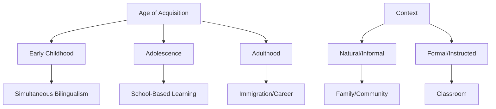
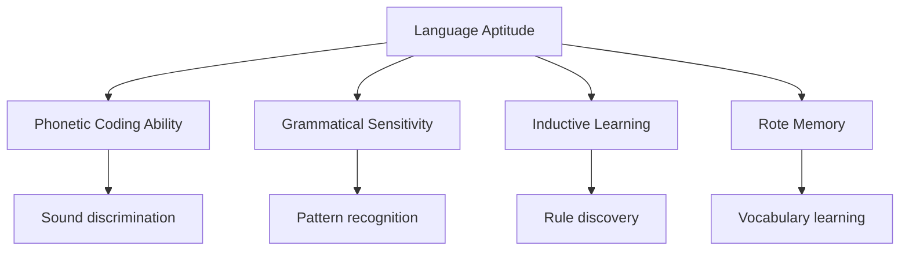
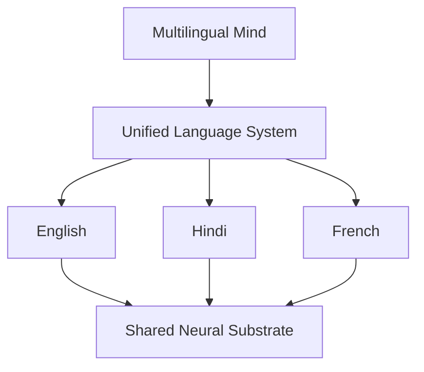
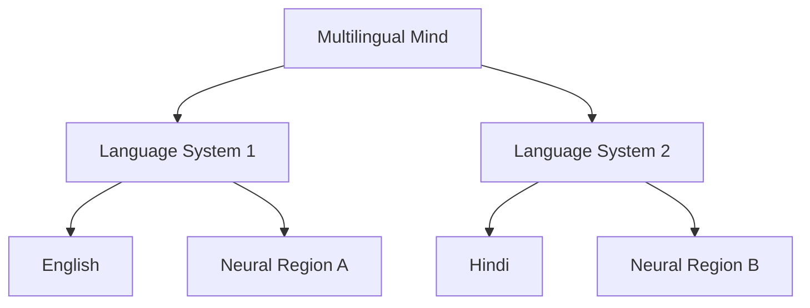
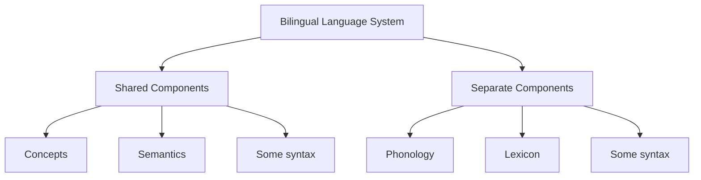

# Second Language Acquisition: Processes and Mechanisms

## Introduction

Second language acquisition (SLA) represents one of the most complex cognitive achievements humans can undertake. Unlike first language acquisition, which occurs relatively automatically given minimal linguistic input, second language learning involves conscious effort, explicit instruction, and variable success across individuals.

This comprehensive exploration examines how second languages are acquired, what factors facilitate or hinder acquisition, and how the multilingual brain organizes multiple language systems.

## The Context of Second Language Acquisition

### Multiple Paths to Multilingualism

Languages are acquired at different ages, in different situations, and to very different levels of competence. This diversity profoundly affects how multilingual repertoires are structured.

### Acquisition Contexts and Outcomes

#### Natural Contexts
**Characteristics**:
- Immersion in target language environment
- Communication-driven learning
- Implicit grammar acquisition
- Variable systematic instruction

**Examples**:
- Childhood immigration
- Study abroad programs
- International marriages
- Expatriate living

**Outcomes**:
- Often high oral proficiency
- May have literacy gaps
- Native-like pronunciation possible
- Functional communication prioritized

#### Formal Contexts
**Characteristics**:
- Classroom-based instruction
- Explicit grammar teaching
- Limited authentic communication
- Structured curriculum

**Examples**:
- School language classes
- Language institutes
- Online courses
- University foreign language programs

**Outcomes**:
- Strong metalinguistic knowledge
- May have speaking/listening gaps
- Written skills often better developed
- Academic proficiency emphasized

## The Age Factor: Critical Periods Debate

### Critical Period Hypothesis

**Original Claim** (Lenneberg, 1967):
- Biological window for language acquisition
- Closes around puberty
- Native-like acquisition impossible after closure

**Evidence For Critical Periods**:
1. **Pronunciation**: Native-like accent extremely rare after adolescence
2. **Grammatical Intuitions**: Subtle grammar mastery difficult in adulthood
3. **Neurological Changes**: Brain plasticity decreases with age
4. **Speed of Initial Learning**: Children acquire L1 faster than adults acquire L2

### Modern Understanding: Multiple Sensitive Periods

Research suggests **no absolute critical period** for most aspects of L2 acquisition (Birdsong, 1999):

#### What's Age-Sensitive?

| Language Component | Age Effect | Evidence |
|-------------------|------------|----------|
| **Pronunciation** | Strong | Native accent rare after age 6-12 |
| **Morphosyntax** | Moderate | Possible but difficult after puberty |
| **Vocabulary** | Weak | Can be acquired throughout life |
| **Pragmatics** | Weak | Learnable at any age |
| **Reading/Writing** | Weak | Often better in adult learners |

:::important Key Insight
There may be **sensitive periods** rather than a single critical period. Different language components have different optimal acquisition windows, with only pronunciation showing truly critical period effects.
:::

### Why Adults Seem to Struggle More

**Apparent Paradox**: Adults often appear less successful than children, but research shows complex picture:

**Adult Advantages**:
- ✅ Better metalinguistic awareness
- ✅ Superior learning strategies
- ✅ More efficient vocabulary learning
- ✅ Better literacy skills transfer
- ✅ Greater motivation and focus

**Child Advantages**:
- ✅ More neural plasticity
- ✅ Less L1 interference
- ✅ More exposure hours
- ✅ Lower affective filter
- ✅ Greater willingness to make errors

**The Key Difference**:
Children in immersion settings **must** achieve high proficiency (for school success). Adults often can function with intermediate proficiency, so they may not push to native-like levels.

## Factors Facilitating Second Language Acquisition

### Individual Differences

#### 1. **Cognitive Abilities**

Each learner brings distinctive cognitive abilities:

**Language Aptitude Components** (Carroll, 1981):

**Working Memory**:
- Critical for processing complex sentences
- Affects ability to hold and manipulate linguistic information
- Predicts grammar learning success

**Analytical Ability**:
- Important for explicit grammar instruction
- Helps in rule application
- Facilitates error correction

#### 2. **Motivation**

**Types of Motivation** (Gardner & Lambert, 1972):

**Integrative Motivation**:
- Desire to integrate with target language community
- Interest in culture and people
- Long-term commitment
- Associated with higher proficiency

**Instrumental Motivation**:
- Practical goals (career, education)
- Short-term oriented
- Task-focused
- Can be highly effective

:::tip Research Finding
Both types effective, but **integrative motivation** associated with:
- Greater persistence
- Higher ultimate attainment
- Better cultural adaptation
- More natural communication
:::

#### 3. **Personality Factors**

**Extroversion**:
- Facilitates communication practice
- More opportunities for interaction
- Lower anxiety in speaking

**Risk-Taking**:
- Willingness to make errors
- Try new structures
- Engage in authentic communication

**Empathy**:
- Better understanding of pragmatic norms
- Enhanced cultural sensitivity
- Superior communication effectiveness

### Contextual Factors

#### 1. **Input Quality and Quantity**

**Comprehensible Input** (Krashen, 1982):
- Slightly above current level (i+1)
- Contextualized and meaningful
- Adjusted to learner needs

**Modified Input** (Simplified speech):
- Slower rate
- Clear pronunciation
- Simplified vocabulary
- Repetition and paraphrase

**Interaction Opportunities**:
- Negotiation of meaning
- Feedback on errors
- Pushed output opportunities

#### 2. **Learning Environment**

**Supportive Features**:
- Low anxiety atmosphere
- Error tolerance
- Opportunities for practice
- Authentic materials
- Encouraging feedback

**Detrimental Features**:
- High anxiety
- Fear of mistakes
- Limited practice opportunities
- Rigid correction
- Negative attitudes

## The Social Context: Vygotsky's Perspective

### Language Acquisition Support System (LASS)

**Bruner (1982, 1983)** building on **Vygotsky (1978)**:

**Key Concepts**:
1. **Zone of Proximal Development (ZPD)**:
   - Gap between actual and potential development
   - Learning occurs within this zone
   - Requires expert assistance

2. **Scaffolding**:
   - Temporary support from more competent speakers
   - Gradually withdrawn as proficiency increases
   - Essential for development

3. **Social Interaction**:
   - Not just input exposure
   - Active negotiation of meaning
   - Collaborative construction of knowledge

### Exolingual Communication

**Krafft & Dausendschön-Gay (1994)** Research:

**Exolingual Situations**: Communication between native and non-native speakers

**Interactive Procedures Observed**:
- Comprehension checks
- Clarification requests
- Confirmation requests
- Self-repairs
- Other-repairs
- Recasts (reformulations)

**Benefits**:
- Provides necessary help for communication
- Continues learning process during interaction
- Makes linguistic forms salient
- Offers implicit feedback

:::note Theoretical Integration
L2 acquisition isn't just cognitive procedure supported by Language Acquisition Device (LAD), but also social process requiring Language Acquisition Support System (LASS) through interaction.
:::

## Matching Learning to Needs

### No Single "Best" Method

**Bialystock & Hakuta (1994)** emphasize: Optimal learning experiences depend on:
1. Individual learner characteristics
2. Learning context
3. Goals for language use
4. Available resources and time

### Four Learner Profiles

#### Profile 1: Ria (Child Learner)

**Context**: Young child learning language for peer interaction

**Needs**:
- Basic phonology mastery
- Simple syntactical rules
- Basic vocabulary
- Pragmatic competence for play situations

**Appropriate Approach**:
- Natural communication emphasis
- Play-based learning
- Minimal explicit instruction
- Focus on meaning over form

**Sufficiency for Fluency**: Yes, for peer interaction contexts

---

#### Profile 2: Kishen (Survival Communicator)

**Context**: Adult needing language for daily transactions

**Needs**:
- Practical vocabulary (shopping, transportation)
- Basic syntax
- Pragmatic knowledge (politeness, appropriateness)
- Survival communication skills

**Appropriate Approach**:
- Situational/functional syllabus
- Task-based learning
- Immediate practical application
- Cultural training

**Sufficiency for Proficiency**: Yes, for intended contexts

---

#### Profile 3: Meenakshi (Technical Specialist)

**Context**: Professional needing specialized communication

**Needs**:
- Technical vocabulary in specific field
- Formal register
- Reading comprehension in specialty
- Professional communication norms

**Appropriate Approach**:
- ESP (English for Specific Purposes)
- Field-specific materials
- Specialized vocabulary development
- Minimal general conversation

**Sufficiency for Proficiency**: Yes, for professional domain

---

#### Profile 4: Sumesh (Academic Student)

**Context**: Language learned in academic setting

**Needs**:
- Firm grasp of syntax
- Broad but shallow vocabulary
- Reading and writing skills
- Academic discourse skills

**Appropriate Approach**:
- Grammar-focused instruction
- Academic vocabulary development
- Reading and writing emphasis
- Test preparation strategies

**Sufficiency for Proficiency**: Depends on future needs

### Comparative Analysis

| Learner | Phonology | Vocabulary | Syntax | Pragmatics | Priority |
|---------|-----------|------------|--------|------------|----------|
| **Ria** | High | Basic | Basic | High | Natural use |
| **Kishen** | Moderate | Practical | Basic | High | Survival |
| **Meenakshi** | Low | Technical | Moderate | Moderate | Professional |
| **Sumesh** | Low | Broad | High | Low | Academic |

## Language Distance and Difficulty

### Relative Difficulty

Languages are **differentially difficult** depending on learner's L1:

**For English Speakers**:

**Easier Languages** (Similar to English):
- Spanish: Shared roots, similar syntax
- French: Romance vocabulary, familiar structure
- Dutch: Germanic language, close relative
- Norwegian: Similar grammar patterns

**Harder Languages** (Distant from English):
- Russian: Complex inflection, cases, aspect
- Arabic: Different script, root system
- Mandarin: Tonal, characters, different syntax
- Japanese: Multiple writing systems, different grammar

### Why Distance Matters

**Factors Affecting Difficulty**:

1. **Shared Roots**: More cognates = easier vocabulary
2. **Grammatical Structure**: 
   - Inflection complexity
   - Word order differences
   - Gender/case systems
3. **Writing System**: Alphabetic vs. logographic
4. **Phonology**: Sound inventory overlap

:::important Key Principle
Difficulty as L2 ≠ Difficulty as L1

Russian may be harder for English speakers to learn than Spanish, but Russian infants acquire Russian as easily as Spanish infants acquire Spanish. L2 difficulty is **relative to L1**, not absolute.
:::

## Single-System vs. Dual-System Hypotheses

### The Fundamental Question

How are multiple languages represented in the multilingual mind?

### Single-System Hypothesis

**Core Claim**: Multiple languages represented in **one integrated system**.

**Supporting Evidence**:
- Hernandez et al. (2001): fMRI studies show overlapping activation
- Early bilinguals show greatest integration
- Shared conceptual system across languages
- Common syntactic processing areas

**Predictions**:
- Similar recovery patterns after brain injury
- Parallel development in children
- Transfer effects between languages

### Dual-System Hypothesis

**Core Claim**: Different languages represented in **separate systems**.

**Supporting Evidence**:
- De Houwer (1995): Selective impairment possible
- Paradis (1981): Differential recovery patterns
- Some brain damage affects languages differently
- Language-specific neural regions identified

**Predictions**:
- Unequal impairment after brain damage
- Independent development possible
- Minimal cross-language interference

### Evidence from Brain Damage Studies

**Mixed Results**:

**Case 1**: First language recovers first
- Supports separate storage hypothesis
- Suggests L1 more entrenched neurologically

**Case 2**: Second language recovers first
- Challenges simple separation hypothesis
- May depend on recent usage patterns

**Case 3**: Equal recovery in both languages
- Suggests shared representation
- Common underlying system

**Meinzer et al. (2006)** Study:
- Early bilingual aphasic
- Training given only in native language
- Result: Significant L1 recovery, **no L2 change**
- Interpretation: Some independence of systems

### The Middle Ground: Hybrid Models

**Ojemann & Whitaker (1978)** Electrical Stimulation Study:

**Method**:
- Mapped cortical areas relevant to language
- Two bilingual epilepsy patients
- Mild electrical stimulation inhibited local activity
- Tested naming in both languages

**Results**:
- **Some areas**: Affected both languages equally (shared)
- **Other areas**: Affected only one language (separate)

**Conclusion**: **Neither purely single nor purely dual system**

### Contemporary Understanding

**Convergent Model**:
- Some aspects integrated (conceptual/semantic)
- Other aspects separated (lexical/phonological)
- Degree of integration depends on:
  - Age of acquisition
  - Proficiency level
  - Language similarity
  - Usage patterns

## Passive Exposure and Unfocused Learning

### Surprising Research Findings

**Ellis (1995), Franceschini (1996, 1999)** discovered:

**Phenomenon**: Passive childhood exposure can lead to:
- Unfocused form of language learning
- Dormant competence
- Reactivation potential at later stages

**Examples**:
- Child overhears grandparents speaking heritage language
- Never actively used it
- Years later, relearns with remarkable ease
- "Hidden" knowledge activated

**Implications**:
- Early exposure valuable even without active use
- Neural traces remain accessible
- Supports early bilingual education
- Multiple paths to multilingual competence

## Memory Aids

### SLA Factors Mnemonic: "CLAIM IT"

- **C**ontext of acquisition (natural vs. formal)
- **L**earner differences (aptitude, motivation)
- **A**ge effects (sensitive periods)
- **I**nput quality (comprehensible, interactive)
- **M**otivation type (integrative vs. instrumental)
- **I**nteraction opportunities (negotiation of meaning)
- **T**arget language distance (similarity to L1)

### Learning Context Match: "RIGHT FIT"

- **R**ia: Regular play-based learning
- **I**nstruction type matches goals
- **G**oal-specific vocabulary emphasized
- **H**olistic approach for children
- **T**echnical focus for specialists
- **F**unctional syllabus for survival
- **I**ndividual needs considered
- **T**ailored to context

## Self-Assessment Questions

1. **Age Effects**: Compare and contrast the critical period hypothesis with modern understanding of age effects in SLA. What aspects of language show strongest age effects?

2. **Theory Application**: Using the single-system vs. dual-system debate, explain what brain damage studies reveal about bilingual language representation. Why are results mixed?

3. **Learner Profiles**: Create a fifth learner profile (like Ria, Kishen, etc.) for a different L2 acquisition context. What would be their optimal learning approach?

4. **Critical Analysis**: Why might adults appear less successful at SLA than children, despite having cognitive advantages? What factors contribute to this paradox?

5. **Research Evaluation**: Evaluate the evidence for concept mediation vs. language-specific storage in the bilingual lexicon. Which theory has stronger support?

6. **Practical Application**: Design a second language course for university students. How would you balance explicit instruction with communicative practice? Justify your approach.

7. **Individual Differences**: How might high aptitude, integrative motivation, and extroversion interact to facilitate SLA? Provide specific examples.

## Exam Preparation Notes

### High-Yield Topics
- Critical period effects ⭐⭐⭐
- Single vs. dual-system hypotheses ⭐⭐⭐
- Age effects on different language components ⭐⭐
- Learning contexts and optimal approaches ⭐⭐
- Brain damage evidence ⭐⭐

### Common Exam Questions
1. Discuss the role of age in second language acquisition
2. Compare single-system and dual-system hypotheses
3. Explain factors facilitating successful SLA
4. Analyze evidence from brain damage studies
5. Evaluate optimal learning approaches for different contexts

---

## Further Reading

### Foundational Works
- **Lenneberg, E. (1967).** *Biological Foundations of Language*. New York: Wiley.
- **Krashen, S. (1982).** *Principles and Practice in Second Language Acquisition*. Oxford: Pergamon.

### Contemporary Research
- **Birdsong, D. (1999).** Second Language Acquisition and the Critical Period Hypothesis. Mahwah, NJ: Lawrence Erlbaum.
- **Bialystok, E., & Hakuta, K. (1994).** In Other Words: The Science and Psychology of Second Language Acquisition. Basic Books.

### Brain and SLA
- **Hernandez, A. E., et al. (2001).** Language switching and language representation in Spanish-English bilinguals: An fMRI study. *NeuroImage, 14*(2), 510-520.
- **Ojemann, G. A., & Whitaker, H. A. (1978).** Language localization and variability. *Brain and Language, 6*, 239-260.

### Social Perspectives
- **Vygotsky, L. S. (1978).** *Mind in Society*. Cambridge, MA: Harvard University Press.
- **Bruner, J. (1983).** Child's Talk: Learning to Use Language. New York: Norton.

### Online Resources
- [Wikipedia: Second Language Acquisition](https://en.wikipedia.org/wiki/Second-language_acquisition)
- [Wikipedia: Critical Period Hypothesis](https://en.wikipedia.org/wiki/Critical_period_hypothesis)
- [Applied Linguistics Research](https://www.linguisticsociety.org/resource/second-language-acquisition)

### Videos
- **MIT OpenCourseWare**: [Second Language Acquisition](https://ocw.mit.edu/courses/linguistics-and-philosophy/)
- **TED Talk**: [How Language Shapes Thought - Lera Boroditsky](https://www.youtube.com/watch?v=RKK7wGAYP6k)

---

**Source PDFs**: 
- 📄 [Block-3/Unit-3.pdf - Pages 45-47](/pdfs/MPC-001%20Cognitive%20Psychology,%20Learning%20and%20Memory/Block-3/Unit-3.pdf)
- 📚 MPC-001 Cognitive Psychology, Learning and Memory
