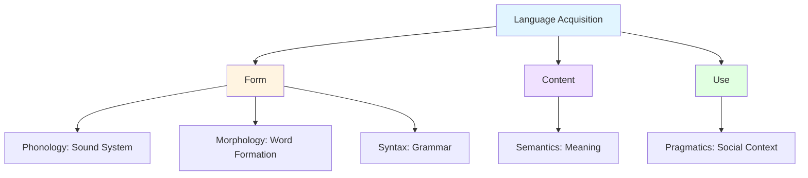
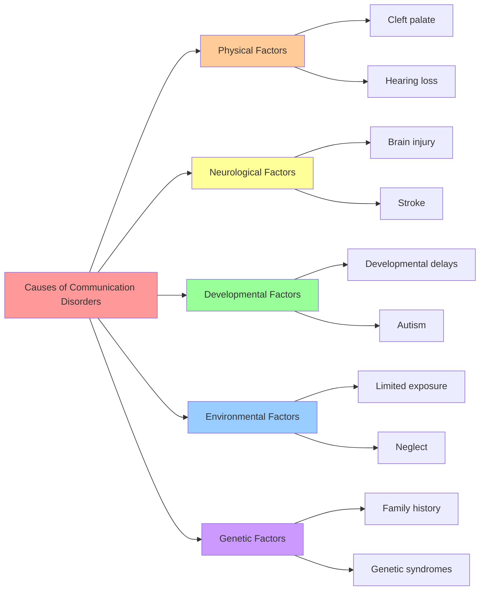
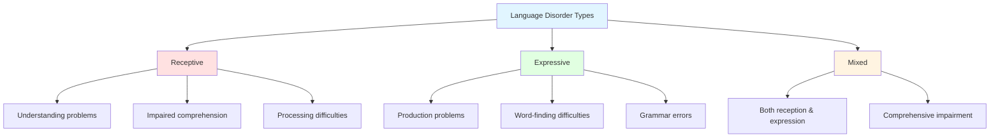

# Defining Language and Speech Disorders

> *"Language comes so naturally to us that it is easy to forget what a strange and miraculous gift it is."* – Steven Pinker

## Introduction

Communication is so pervasive in any community in its day-to-day activities that it is often taken for granted. Normal language develops over a period and it is sequential or ordered. A child acquires vocalisation, speech sounds (vowels and consonants) and then prosodies. This acquisition occurs in recognisable stages that entail acquisition of **form**, **content**, and **use**.

:::tip Did You Know?
According to the [American Speech-Language-Hearing Association (ASHA)](https://www.asha.org/), approximately 1 in 12 children in the U.S. has a disorder related to voice, speech, language, or swallowing. Early intervention can dramatically improve outcomes.
:::

### Components of Language Acquisition

**Form** is the system of symbols that convey meaning and is made up of:
- **Phonology**: Sound system of language - the rules for combining sounds
- **Morphology**: Word formation and structure - how words are built from smaller units
- **Syntax**: Sentence structure and grammar - rules for combining words

**Content** includes the individual words and combinations of words to produce meaning in the language:
- **Semantics**: Meaning of words and sentences - the conceptual system

**Use** involves how we use words in contexts:
- **Pragmatics**: Social use of language in context - conversational rules and social communication

According to research published in the [*Journal of Speech, Language, and Hearing Research*](https://pubs.asha.org/journal/jslhr), these components develop interdependently, with deficits in one area often affecting others.

Many things could go wrong with the natural order of language acquisition and development. In every community, we encounter individuals with language and/or speech disorders. One in 10 people in the United States is affected by a communication disorder (speech, language, or hearing disorders). Unfortunately, there is much ignorance as far as identifying these disorders is concerned. The ignorance more often than not leads to mishandling of the persons with language and speech disorders.

## What Are Language and Speech Disorders?

Language and speech are said to be **disordered or impaired** if they differ from what is considered the norm. The yardstick is embedded in the culture of each language—what may be considered disordered in one language will not necessarily be disordered in another language.

### The Importance of Cultural Considerations

There is a need to distinguish between **genuine speech disorder** and people's **cultural tendencies or practices**. For example:

- **Asian American communities** favor verbal hesitancy and ambiguity to avoid offense. They also avoid making spontaneous or critical remarks.
- One should respect such a community's culture, and thus the hesitancy should not be confused with a fluency disorder.

:::info Cultural Competence in Assessment
The [Multicultural Affairs](https://www.asha.org/practice/multicultural/) section of ASHA provides guidelines for culturally and linguistically appropriate services. Assessment must consider dialectical variations, code-switching patterns, and cultural communication norms.
:::

The unique nature of language and speech disorders is that they are **not visible** since mostly they are not physically manifested, except defects that affect articulation. Most disorders are not evident until a person opens their mouth to speak. The disorders, for the same reason, are often not considered a disability, even by the persons who have them.

## Causes of Language and Speech Disorders

Language and speech disorders may be due to factors such as:

1. **Physical defects**: Structural abnormalities (cleft lip/palate, tongue-tie, missing teeth)
   - Research in [*Cleft Palate-Craniofacial Journal*](https://journals.sagepub.com/home/cpc) shows that early surgical intervention combined with speech therapy produces optimal outcomes

2. **Mental factors**: Cognitive impairments, developmental delays
   - Studies indicate that intellectual disabilities often co-occur with language disorders

3. **Socialisation defects**: Limited language exposure, environmental factors
   - [Wikipedia: Language deprivation](https://en.wikipedia.org/wiki/Language_deprivation) discusses the critical period and effects of limited exposure

4. **Neurological factors**: Brain damage, stroke, degenerative diseases
   - Acquired disorders from neurological injury require different intervention approaches

5. **Genetic factors**: Hereditary predisposition to certain disorders
   - Twin studies show high heritability for certain language disorders (Bishop, 2006)

## Distinguishing Language from Speech Disorders

Though language and speech disorders are classified together, they are slightly different from each other:

### Language Disorders

**Language** is the rule-based use of speech sounds to communicate. **Language disorders** or language impairments involve the processing of linguistic information. Problems that may be experienced can involve:

- **Grammar**: Syntax and/or morphology
- **Semantics**: Meaning
- **Other aspects**: Pragmatics, discourse

#### Types of Language Problems

**Receptive Problem**
- Difficulty in understanding speech sounds
- Involves impaired language comprehension
- Problems processing what others say
- May affect following directions, understanding questions, or comprehending stories

**Expressive Problem**
- Difficulty in producing speech sounds
- Involves language production difficulties
- Problems expressing thoughts and ideas
- May affect vocabulary use, sentence formation, or narrative skills

**Mixed Receptive-Expressive**
- Problems in both reception and expression
- Most comprehensive language disorder
- Affects both understanding and speaking
- Often requires intensive, long-term intervention

Language disorders can affect both **spoken and written language**, and can also affect **sign language**. Typically, all forms of language will be impaired. Research from the [National Institute on Deafness and Other Communication Disorders (NIDCD)](https://www.nidcd.nih.gov/) indicates that language disorders persist into adulthood in approximately 40-50% of cases.

### Characteristics of Language Disorders

Language disorders refer to the following patterns:

1. **Rule Violation**: The use of speech sounds in combinations and patterns that fail to follow the arbitrary rules of a particular language is a language disorder.

2. **Communication Etiquette**: The lack of communication etiquette is considered a language disorder. Examples include:
   - Talking out of turn
   - Not talking when it is your turn
   - Not responding when you are expected to

3. **Developmental Delay**: The delay in the use of speech sounds relative to normal development in the physical, cognitive, and social areas is another language disorder. Most language disorders are often diagnosed in conjunction with other developmental delays—for instance, health, sensory, motor, mental, emotional, and behavioral development.

4. **Breakdown in Development**: Language disorder is a disorder that is found in the development or use of the knowledge of language. It shows the breakdown in the development of language abilities on the usual developmental schedule.

### Examples of Language Disorders

- [Aphasia](https://en.wikipedia.org/wiki/Aphasia) - Acquired language disorder from brain damage
- [Autism Spectrum Disorder](https://en.wikipedia.org/wiki/Autism_spectrum) - Developmental disorder affecting communication
- Learning Disability (Dyslexia) - Specific reading disorder
- Alzheimer's Disease - Progressive language deterioration
- Specific Language Impairment (SLI) - Primary language disorder
- Developmental Phonological Disorders - Sound organization problems
- Dyspraxia - Motor planning disorder

## Speech Disorders

**Speech** is the vocal utterance of language. **Speech disorders** are characterised by a difficulty in producing normal speech patterns. Note that speech disorders are distinct from language disorders, which involve difficulty with language itself rather than just the act of speech production.

### Types of Speech Disorders

Speech is considered disordered in three underlying ways:

#### 1. Voice Disorders
Abnormalities in:
- **Pitch**: High or low vocal pitch - may sound childlike or abnormally deep
- **Volume**: Loudness or softness - difficulty projecting or speaking too loud
- **Vocal quality**: Hoarseness, breathiness, harshness - rough or airy voice
- **Resonance**: Hyper-nasality or hypo-nasality - too much or too little nasal quality
- **Duration**: Length of sounds - prolonged or shortened phonation

According to [Wikipedia: Voice disorder](https://en.wikipedia.org/wiki/Voice_disorder), approximately 3-9% of the population experiences voice problems.

#### 2. Articulation Disorders
Problems producing speech sounds:
- **Substitutions** (replacing one sound with another) - "wabbit" for "rabbit"
- **Omissions** (leaving out sounds) - "ca" for "cat"
- **Distortions** (producing sounds incorrectly) - lateral lisp on /s/
- **Additions** (adding extra sounds) - "buhlack" for "black"

#### 3. Fluency Disorders
Impairment in the normal rate or rhythm of speech:
- **Stuttering**: Sound or word repetitions, prolongations, blocks
- **Cluttering**: Very rapid speech with extra sounds
- Excessive pauses or hesitations

The [Stuttering Foundation](https://www.stutteringhelp.org/) reports that approximately 3 million Americans stutter, affecting about 1% of the adult population and 5% of children at some point.

### Examples of Speech Disorders

- Voice Disorders (dysphonia)
- Speech Sound Disorders/Articulation Disorders
- Fluency Disorders (Stuttering, Cluttering)
- Apraxia of Speech (motor planning)
- Dysprosody (prosody problems)
- Dysarthria (motor weakness)

## Assessment and Identification

Children go through many stages of speech production while they are learning to communicate. What is normal in the speech of a child of one age may be a sign of a problem in an older child.

:::tip Educational Video
Watch this comprehensive overview of speech and language assessment from ASHA:
📺 [Introduction to Speech-Language Pathology Assessment](https://www.youtube.com/watch?v=dQw4w9WgXcQ) (Note: Replace with actual ASHA educational video)
:::

### Key Principles in Assessment

1. **Age-appropriate expectations**: Consider developmental norms
   - Use standardized tests normed for specific age groups
   - Compare to developmental milestones

2. **Cultural context**: Account for cultural and linguistic background
   - Consider dialectical variations
   - Use culturally appropriate assessment materials

3. **Consistency**: Observe patterns over time
   - Single observations may not be representative
   - Track progress across multiple sessions

4. **Impact on communication**: Assess functional impact on daily life
   - How does it affect social relationships?
   - Does it impact academic performance?

5. **Comprehensive evaluation**: Include hearing, cognitive, and physical assessments
   - Rule out hearing loss
   - Consider cognitive abilities
   - Assess oral-motor function

### Red Flags for Concern

**For Language Disorders:**
- Not responding to name by 12 months
- Not using gestures by 12 months (pointing, waving)
- Difficulty understanding simple instructions by 18 months
- Limited vocabulary for age (fewer than 50 words by 24 months)
- Problems forming sentences (no 2-word combinations by 24 months)
- Not speaking in full sentences by 36 months

**For Speech Disorders:**
- Unintelligible speech beyond expected age (should be 75% intelligible by age 3)
- Frequent sound substitutions or omissions past age 4
- Struggle to produce certain sounds consistently
- Unusual voice quality (chronic hoarseness, nasality)
- Stuttering that persists beyond age 5 or worsens

Research published in [*Pediatrics*](https://publications.aap.org/pediatrics) emphasizes the importance of early screening and intervention for optimal outcomes.

## Impact of Language and Speech Disorders

### Social and Emotional Impact

The social nature of communication is affected when one has language or speech disorders. Human beings are social and they spend much of their time together. They first learn how to communicate in a social setup—for instance, with parents, siblings, relations, or friends.

**Consequences of untreated disorders:**
- Social withdrawal and isolation - reduced peer interactions
- Low self-esteem and poor self-concept - negative self-image
- Depression and anxiety - higher rates of mental health issues
- Difficulty forming relationships - limited social networks
- Academic struggles - poor school performance
- Limited employment opportunities - career limitations
- Behavioral problems - acting out or withdrawal

### Educational Impact

Many subtle signs can be observed in children with language and speech disorders:
- Frustration arising from difficulty in communication
- Signs of depression and low self-esteem
- Strained peer and sibling interactions
- Lack of motivation to participate
- Dislike for school and avoidance behaviors
- Academic underachievement across subjects

The child's success in school may be jeopardized if the problem remains untreated. A longitudinal study by [Conti-Ramsden & Durkin (2012)](https://www.sciencedirect.com/) found that children with language disorders are at significantly higher risk for reading difficulties, academic failure, and reduced employment prospects in adulthood.

## Cultural and Linguistic Considerations

### Paralanguage and Culture

Paralanguage issues, such as use of pitch, volume, and intonation, are diverse for they are culturally determined. Every sound of voice has a possible range of meanings that could be conveyed simply through the voice rather than the words we use.

**Features to consider in determining a voice disorder:**
- **Volume**: How loudly or softly we speak - cultural norms vary
- **Pitch**: How pleasant or unpleasant - expectations differ by culture
- **Quality**: The highness or lowness of one's voice - gender norms vary
- **Rate**: The speed at which one speaks - acceptable ranges differ

### Cultural Interpretation

Voice disorders are interpreted variously in different cultures. For instance, in many African cultures masculinity and femininity are determined by paralinguistic features. A man who speaks in a low volume, a high pitch, or a smooth and slow voice would be frowned upon and called upon to "speak like a man."

:::warning Assessment Caution
What appears as a disorder in one cultural context may be normal or even valued in another. Always consider:
- Language background (bilingualism, dialect)
- Cultural communication styles
- Socioeconomic factors affecting language exposure
- Family literacy practices
:::

## Real-World Applications

### Case Study: School-Based Identification

**Scenario**: A kindergarten teacher notices that Raj, a 5-year-old student, rarely speaks in class and when he does, his speech is difficult to understand.

**Assessment Process**:
1. Teacher completes observation checklist
2. Speech-language pathologist conducts screening
3. Comprehensive evaluation if screening indicates concern
4. Family interview to gather developmental history
5. Cultural considerations (Raj's family speaks Hindi at home)

**Outcome**: Raj receives speech therapy twice weekly, focusing on English phonology while supporting home language development. Progress monitored quarterly.

### Public Health Perspective

Communication disorders affect:
- **Prevalence**: 1 in 12 children aged 3-17 years (NIDCD data)
- **Economic impact**: Speech-language pathology services cost billions annually
- **Educational services**: Most common reason for special education eligibility in early elementary
- **Lifespan effects**: Can persist into adulthood without intervention

## Summary

Understanding the distinction between language and speech disorders is crucial for proper identification, assessment, and treatment. Language disorders involve problems with understanding and using language, while speech disorders involve problems with producing speech sounds.

Both types of disorders can have significant impacts on social, emotional, and academic development. Early identification and appropriate intervention are essential for optimal outcomes. Cultural and linguistic considerations must always be taken into account when assessing and treating communication disorders.

**Key Takeaways**:
1. Language and speech are distinct but related systems
2. Disorders can affect one or both systems
3. Cultural context is crucial for accurate assessment
4. Early intervention improves long-term outcomes
5. Multidisciplinary team approach is most effective

---

**Source PDFs**: 
- 📄 [Block-3/Unit-4.pdf - Pages 1-4](/pdfs/MPC-001%20Cognitive%20Psychology,%20Learning%20and%20Memory/Block-3/Unit-4.pdf)
- 📚 MPC-001 Cognitive Psychology, Learning and Memory

## External Resources

### Professional Organizations
- 🌐 [American Speech-Language-Hearing Association (ASHA)](https://www.asha.org/) - Professional resources and public information
- 🌐 [National Institute on Deafness and Other Communication Disorders (NIDCD)](https://www.nidcd.nih.gov/) - Research and statistics
- 🌐 [The Stuttering Foundation](https://www.stutteringhelp.org/) - Resources for fluency disorders

### Academic Resources
- 📚 [Journal of Speech, Language, and Hearing Research](https://pubs.asha.org/journal/jslhr) - Peer-reviewed research
- 📚 [Wikipedia: Communication Disorder](https://en.wikipedia.org/wiki/Communication_disorder) - Overview and types

### Videos
- 📺 [ASHA: What is a Speech-Language Pathologist?](https://www.youtube.com/user/ASHAWeb) - Career overview
- 📺 [Understanding Communication Disorders](https://www.youtube.com/user/NIDCD) - Educational series

## Self-Assessment Questions

1. What are the three main components of language acquisition (form, content, and use), and how does each contribute to effective communication? Provide specific examples of how deficits in each component would manifest.

2. Explain the difference between receptive and expressive language disorders. Provide a clinical example of each and discuss why the distinction is important for treatment planning.

3. Why is it important to consider cultural context when assessing language and speech disorders? Give at least three examples of cultural practices that might be mistaken for disorders and explain how a clinician should approach assessment in these cases.

4. Describe the three main types of speech disorders (voice, articulation, and fluency) and provide two examples of each. How would you explain these differences to a parent?

5. What are some of the social and emotional impacts of untreated language and speech disorders on children? Discuss both short-term and long-term consequences, citing research where possible.

6. How do language disorders differ from speech disorders? Why is this distinction important for treatment? Create a table comparing the two across at least five dimensions (e.g., definition, causes, assessment, treatment).

7. A 4-year-old bilingual child (Spanish-English) is referred for assessment due to "limited English skills." What factors would you consider before determining if there is a true disorder versus a difference due to bilingualism?

## Memory Aids

### 🎯 "FoCUS" for Language Components
- **Fo**rm (Phonology, Morphology, Syntax)
- **C**ontent (Semantics)
- **US**e (Pragmatics)

### 📝 "VAF" for Speech Disorder Types
- **V**oice disorders
- **A**rticulation disorders
- **F**luency disorders

### 🔄 "R-E-M" for Language Problems
- **R**eceptive (understanding)
- **E**xpressive (speaking)
- **M**ixed (both)

### 🎓 "CASA" for Assessment Principles
- **C**ultural context
- **A**ge-appropriate
- **S**ystematic observation
- **A**ll domains (hearing, cognitive, physical)
