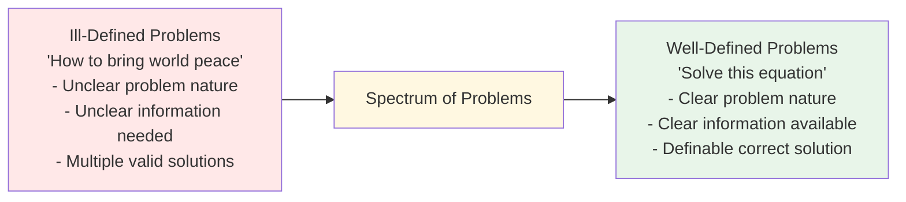
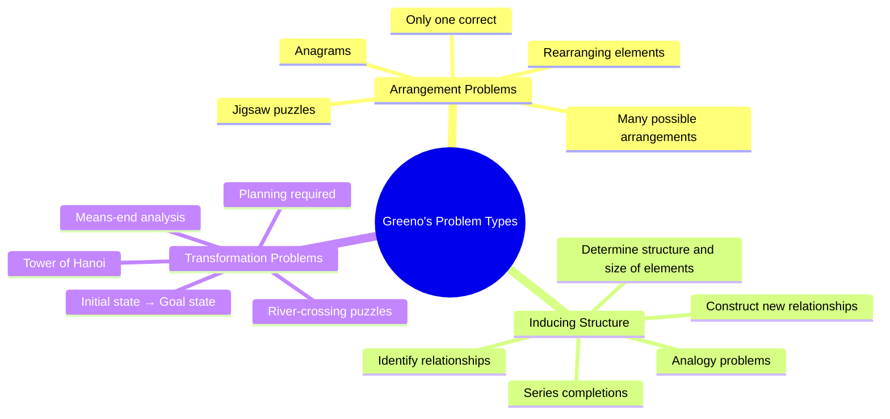

import Tabs from '@theme/Tabs';
import TabItem from '@theme/TabItem';

# Types and Characteristics of Problems in Problem Solving

> *"Solving a problem means finding a way out of a difficulty, a way around an obstacle, attaining an aim that was not immediately understandable. Solving problems is the specific achievement of intelligence and intelligence is the specific gift of mankind."*  
> — George Polya (1962)

## Introduction

In our day-to-day life we constantly solve problems — in the classroom, family, or workplace. Problem solving is nearly inescapable. We engage in it whenever we want to reach a goal that is not immediately available, and something is blocking our path.

To appreciate the complexity of problem solving, try these warm-up problems:

:::tip Warm-Up Problems
1. What one mathematical symbol placed between **2 and 3** gives a number greater than 2 and less than 3?
2. Rearrange the letters **NEWDOOR** to make one word.
3. How many pets do you have if all of them are birds except two, all are cats except two, and all are dogs except two?

*(Answers at the bottom of this page)*
:::

Problems span a vast range: from personal decisions (who to marry, career choices) to scientific challenges (curing cancer, proving theorems) to everyday tasks (preparing a meal, planning a study schedule). Understanding the *types* of problems we face — and *why* some are harder than others — is the foundation of the psychology of problem solving.

:::info Source
📄 [MPC-001 Block-4/Unit-1.pdf - Pages 5-8](/pdfs/MPC-001%20Cognitive%20Psychology,%20Learning%20and%20Memory/Block-4/Unit-1.pdf)
📚 MPC-001 Cognitive Psychology, Learning and Memory, IGNOU
:::

---

## 🎬 Video Resources

- 📺 [**Problem Solving** — Crash Course Psychology #29](https://www.youtube.com/watch?v=h5xst5AEONc) — Overview of problem types, heuristics, and barriers (10 min)
- 📺 [**Tower of Hanoi Explained** — TED-Ed](https://www.youtube.com/watch?v=UuIneNBbscc) — Visual explanation of transformation problems (5 min)
- 📺 [**Types of Problems in Psychology** — Dr. Todd Grande](https://www.youtube.com/watch?v=1Bkfh5VdHMA) — Well-defined vs. ill-defined problems in clinical context (8 min)

---

## Types of Problems: A Spectrum

Problems vary along a spectrum from **ill-defined** to **well-defined**:

**Well-defined problems** (mathematical equations, jigsaw puzzles):
- The nature of the problem is clear
- The information needed to solve it is available
- One can make straightforward judgments about whether a potential solution is appropriate

**Ill-defined problems** (how to bring peace, how to improve one's relationships):
- The specific nature of the problem may be unclear
- The information required to solve it is even less obvious
- Multiple solutions may be valid; no clear criterion for success

> 📖 **Wikipedia**: [Problem solving](https://en.wikipedia.org/wiki/Problem_solving) — Comprehensive overview of problem solving types, strategies, and research.

---

## Greeno's Classification of Well-Defined Problems

**Greeno (1978)** proposed a classification of well-defined problems based on the psychological skills and knowledge required to solve them. He identified **three core types**:

### 1. Arrangement Problems

The problem solver must **rearrange or recombine elements** in a way that satisfies certain criteria. Usually, several different arrangements can be made, but only one or a few will produce the correct solution.

**Examples:**
- **Anagram problems:** Rearrange NEWDOOR to spell one word → *WOODERN* or *DOORMEN*
- **Jigsaw puzzles:** Fit pieces into the correct configuration
- **String arrangement problems:** Classic lab tasks where you must tie two strings together

**Key skill required:** Spatial reasoning and systematic search through possible arrangements.

---

### 2. Problems of Inducing Structure

The person must **identify existing relationships among elements** and then construct a new relationship among them to solve the problem. The solver must determine not only the relationships but also the structure and size of the elements involved.

**Examples:**
- **Analogy problems:** "Doctor is to patient as teacher is to ___?"
- **Number series:** "2, 4, 8, 16, ___ ?"
- **Pattern recognition tasks:** Identifying the rule governing a sequence

**Key skill required:** Relational reasoning and abstract thinking — seeing the underlying pattern.

---

### 3. Transformation Problems

One takes into consideration an **initial state** and attempts to **change it to a goal state** through a series of permitted operations.

The **Tower of Hanoi** is the classic example:
- *Initial state:* Three disks stacked on peg A (largest at bottom)
- *Goal state:* All three disks on peg C in the same order
- *Operators:* Move only one disk at a time; never place a larger disk on a smaller one

According to Greeno (1978), solving transformation problems primarily requires skills in planning based on a method called **means-end analysis** — identifying differences between the current state and goal state, then selecting operations to reduce those differences.

> 📖 **Wikipedia**: [Tower of Hanoi](https://en.wikipedia.org/wiki/Tower_of_Hanoi) — The mathematical puzzle used to study transformation problem solving.

**Other transformation problem examples:**
- River-crossing puzzles (farmer, fox, chicken, grain)
- Rubik's Cube
- Chess problems (achieving checkmate in n moves)

:::note Comparison Table

| Problem Type | Core Task | Key Skill | Example |
|-------------|-----------|-----------|---------|
| **Arrangement** | Rearrange elements to fit criteria | Spatial reasoning, systematic search | Anagrams, jigsaw puzzles |
| **Inducing Structure** | Identify and construct relationships | Relational reasoning, abstract thinking | Analogies, number series |
| **Transformation** | Move from initial state to goal state | Planning, means-end analysis | Tower of Hanoi, chess |

:::

---

## Characteristics of Difficult Problems

Not all problems within these categories are equally hard. Researchers have identified specific **characteristics that make problems difficult** to solve:

```mermaid
graph TD
    A[Characteristics of Difficult Problems] --> B[Clarity Issues]
    A --> C[Goal Issues]
    A --> D[Complexity Issues]
    A --> E[Dynamic Issues]
    
    B --> B1[Intransparency\nLack of clarity about the situation]
    B --> B2[Commencement Opacity\nConfusion about how to start]
    B --> B3[Continuation Opacity\nOngoing confusion throughout]
    B --> B4[Inexpressiveness\nInability to state the problem clearly]
    
    C --> C1[Polytely\nMultiple conflicting goals]
    C --> C2[Opposition\nGoals in conflict with each other]
    
    D --> D1[Complexity\nMany items, interrelationships, decisions]
    D --> D2[Enumerability\nCannot be listed or quantified]
    D --> D3[Connectivity\nHierarchy of sub-problems]
    D --> D4[Heterogeneity\nNon-uniform, hard to handle]
    
    E --> E1[Transience\nProblem keeps changing]
    E --> E2[Dynamics\nTime considerations]
    E --> E3[Temporal Constraints\nMust be solved within a time limit]
    E --> E4[Temporal Sensitivity\nAffected by time factor]
    E --> E5[Phase Effects\nChanges in different phases]
    E --> E6[Dynamic Unpredictability\nHigh degree of unpredictability]
    
    style A fill:#f0f4ff
```

### Detailed Explanation of Each Characteristic

**Clarity-related difficulties:**

| Characteristic | Definition |
|---------------|------------|
| **Intransparency** | Lack of clarity about the nature of the situation itself |
| **Commencement opacity** | Confusion about how to even start stating or approaching the problem |
| **Continuation opacity** | Continuing confusion throughout the problem — no clarity emerges as work progresses |
| **Inexpressiveness** | Inability to express the problem clearly to oneself or others |

**Goal-related difficulties:**

| Characteristic | Definition |
|---------------|------------|
| **Polytely** | The problem has multiple goals; reaching and selecting a particular goal is difficult |
| **Opposition** | Goals within the problem conflict with each other |

**Complexity-related difficulties:**

| Characteristic | Definition |
|---------------|------------|
| **Complexity** | Large numbers of items, too many interrelationships and decisions required |
| **Enumerability** | It is not possible to list or quantify all aspects of the problem |
| **Connectivity** | A hierarchy of problems exists — solving one opens up others |
| **Heterogeneity** | The problem is not homogeneous, making consistent handling difficult |

**Dynamic difficulties:**

| Characteristic | Definition |
|---------------|------------|
| **Transience** | The problem keeps changing while one is trying to solve it |
| **Dynamics** | Time plays a central role in the problem structure |
| **Temporal constraints** | A time limit applies — must be solved within a period |
| **Temporal sensitivity** | The problem is influenced and affected by timing |
| **Phase effects** | Changes occur in different phases of the problem |
| **Dynamic unpredictability** | The problem involves high unpredictability and complexity |

:::note Real-World Application
Complex, real-world problems like climate change or healthcare system reform exhibit **all of these characteristics** simultaneously — they are intransparent, polytelic, heterogeneous, transient, and dynamically unpredictable. This is why real-world problem solving is so much harder than laboratory tasks.
:::

> 📖 **Wikipedia**: [Wicked problem](https://en.wikipedia.org/wiki/Wicked_problem) — A category of problems that exhibit many of these difficult characteristics; used in policy and design fields.

---

## Why Lab Problems vs. Real-World Problems Differ

Early psychological research on problem solving used **simple, well-defined laboratory tasks** (like the Tower of Hanoi) on the assumption that they captured the essential properties of real-world problems. Researchers could:
- Trace problem-solving steps precisely
- Control variables systematically
- Define clear success criteria

However, real-world problems **differ critically** from lab problems:
- They are emotionally loaded (clinical psychology research shows poor emotional control disrupts problem solving — Rath et al., 2004)
- They lack clear success criteria
- They involve multiple conflicting stakeholders
- They change while being solved (transience)

:::note Recent Research
A 2022 meta-analysis in *Psychological Bulletin* (Sala & Gobet) examined whether training on laboratory problem-solving tasks (like the Tower of Hanoi) transfers to real-world problem solving. Finding: **near-zero transfer** to novel real-world problems. This supports the view that real-world problem solving requires domain-specific knowledge, not just general problem-solving skill.
:::

---

## Problem Solving as a Cognitive Process

Problem solving is considered one of the most **complex of all intellectual functions** — a higher-order cognitive process that requires modulation and control of more routine skills.

It consists of two related processes:

**1. Problem Orientation** — the motivational/attitudinal/affective approach to problematic situations (how one *feels* about and *frames* the problem)

**2. Problem-Solving Skills** — the actual cognitive-behavioural steps used to reach a solution

When cognitive skills are successfully implemented, they lead to effective problem resolution.

> 📖 **Wikipedia**: [Cognition](https://en.wikipedia.org/wiki/Cognition) — The mental representation and manipulation of information used in problem solving.

Key definitions:
- **Baron (2001):** Problem solving involves efforts to develop or choose among various responses in order to attain desired goals
- **Witting and Williams (1984):** Problem solving is the use of thought processes to overcome obstacles and work towards goals

---

## 🌐 External Resources

- 📰 [**Types of Problems in Cognitive Psychology** — Simply Psychology](https://www.simplypsychology.org/problem-solving.html) — Overview of problem types and solving strategies
- 📰 [**Greeno's Problem Classification** — Encyclopedia of Cognitive Science](https://onlinelibrary.wiley.com/doi/abs/10.1002/0470018860.s00472) — Detailed treatment of Greeno's 1978 taxonomy
- 🔬 [**Problem Solving Research** — APA PsycINFO](https://www.apa.org/pubs/databases/psycinfo) — Research database for problem solving literature
- 📖 [**Ill-defined problem** — Wikipedia](https://en.wikipedia.org/wiki/Ill-defined_problem) — The contrast between structured and unstructured problems
- 📖 [**Means-ends analysis** — Wikipedia](https://en.wikipedia.org/wiki/Means%E2%80%93ends_analysis) — The cognitive strategy central to transformation problem solving

---

## 🧠 Memory Aids

### Greeno's Three Types — **AIT**
> **A**rrangement (rearrange elements) · **I**nducing Structure (find/build relationships) · **T**ransformation (move from initial to goal state)

### Difficult Problem Characteristics — **ICTEP-CEHTTDP**
Group by theme:
- **Clarity:** Intransparency, Commencement opacity, Continuation opacity, Expressiveness (lack of)
- **Goals:** Polytely, Opposition
- **Complexity:** Complexity, Enumerability, Heterogeneity, Connectivity
- **Dynamics:** Transience, Temporal constraints, Temporal sensitivity, Dynamics, Phase effects, Dynamic unpredictability

### Well-Defined vs. Ill-Defined — the "GPS" analogy
> **Well-defined** = GPS with a known destination (clear route, clear arrival).  
> **Ill-defined** = Wandering without knowing your destination (unclear route, unclear success).

---

## ✅ Self-Assessment Questions

<Tabs>
<TabItem value="basic" label="Basic">

1. What is a problem? How does problem solving differ from routine task completion?
2. Distinguish between well-defined and ill-defined problems with two examples of each.
3. Describe Greeno's three types of well-defined problems with an example of each.
4. What is the Tower of Hanoi, and which of Greeno's problem types does it represent?
5. List any five characteristics that make a problem difficult.

</TabItem>
<TabItem value="intermediate" label="Intermediate">

6. Compare arrangement problems and transformation problems in terms of the psychological skills required.
7. Explain *polytely* and *intransparency* as characteristics of difficult problems. How do they interact to make a problem harder?
8. Why did early researchers use simple laboratory tasks for studying problem solving? What are the limitations of this approach?
9. What is means-end analysis? How is it applied in transformation problem solving?

</TabItem>
<TabItem value="exam" label="Exam Focus">

10. Classify the following as well-defined or ill-defined, and identify Greeno's problem type where applicable: (a) Solving a crossword puzzle (b) Deciding how to reduce crime in a city (c) Completing a number series (d) Moving chess pieces to achieve checkmate.
11. "Real-world problems are fundamentally different from laboratory problems in cognitive psychology research." Discuss with reference to the characteristics of difficult problems.
12. Analyse a complex societal problem (e.g., traffic congestion in a city) using the characteristics of difficult problems. How many of the 16 characteristics apply?

</TabItem>
</Tabs>

---

:::tip Warm-Up Answers
1. A **decimal point** → 2.3 (greater than 2, less than 3)
2. **DOORMEN** (or WOODNER)
3. You have **3 pets** — one bird, one cat, and one dog (each "except two" = the other two species)
:::

---

## 🔗 Related Topics

- [Nature and Stages of Problem Solving](/mpc-001/block-4/nature-stages-problem-solving)
- [Types of Thinking and Insight in Problem Solving](/mpc-001/block-4/thinking-types-insight-problem-solving)
- [Algorithms vs. Heuristics](/mpc-001/block-4/algorithms-heuristics-problem-solving)
- [Gestalt Approaches to Problem Solving](/mpc-001/block-4/gestalt-approaches-problem-solving)

---

**Source PDFs**:
- 📄 [Block-4/Unit-1.pdf - Pages 5-8](/pdfs/MPC-001%20Cognitive%20Psychology,%20Learning%20and%20Memory/Block-4/Unit-1.pdf)
- 📚 MPC-001 Cognitive Psychology, Learning and Memory, IGNOU
