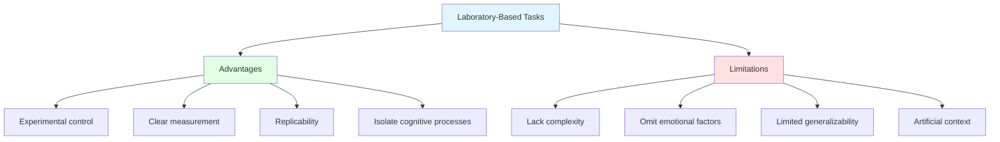
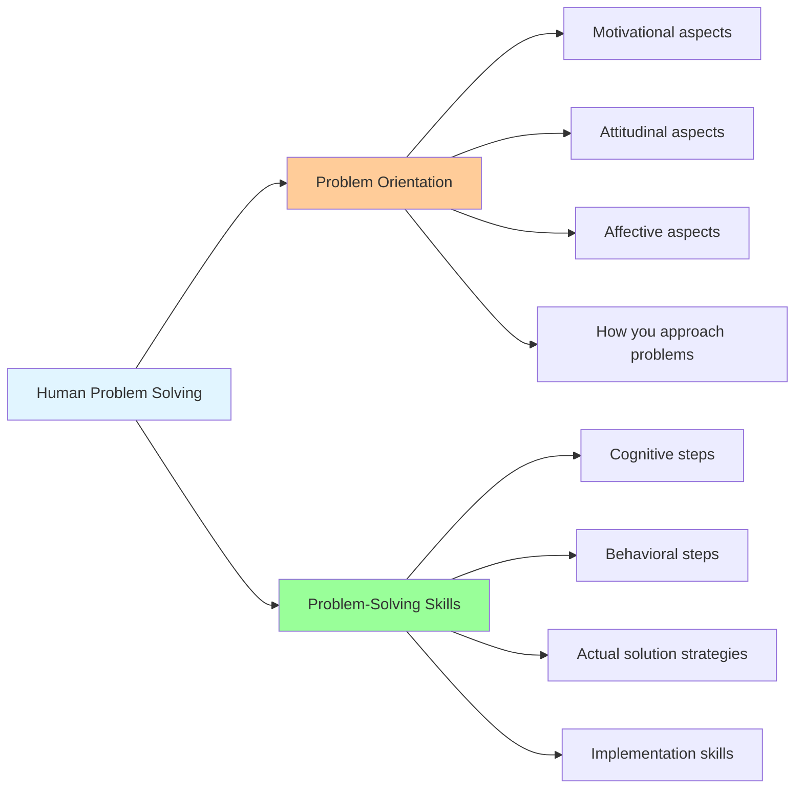
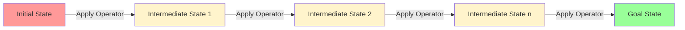
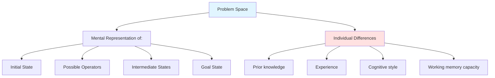
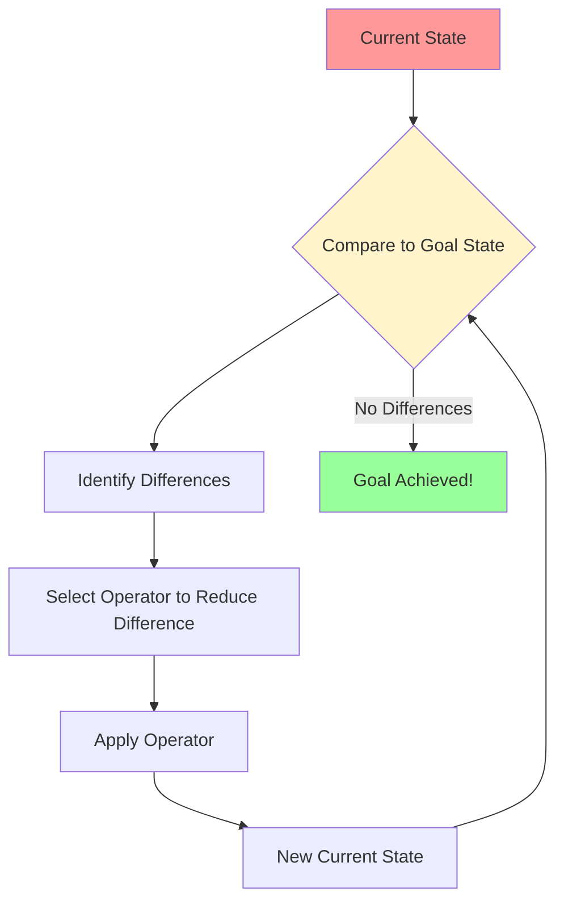

# Nature and Stages of Problem Solving

## Introduction to Problem Solving

Problem solving is a mental process and is part of the larger problem process that includes **problem finding** and **problem shaping**. Considered the most complex of all intellectual functions, problem solving has been defined as a **higher-order cognitive process** that requires the modulation and control of more routine or fundamental skills.

:::info Core Concept
**Problem solving** occurs when an organism or an artificial intelligence system needs to move from a given state to a desired goal state. It is one of the many forms that thinking or cognition may take.
:::

By **cognition** one refers to the mental representation of information which can be manipulated and used to solve problems. Problem solving is a major cognitive behavior.

**Problem solving becomes necessary when**:
- An individual wants to reach a goal
- That goal is not easily available
- There are obstacles preventing direct achievement

## Historical Perspective on Problem Solving Research

The nature of human problem-solving methods has been studied by psychologists over the past hundred years. There are several methods of studying problem solving, including:

1. **Introspection** - Self-observation of thought processes
2. **Behaviorism** - Observable behavior analysis
3. **Simulation** - Creating controlled problem-solving scenarios
4. **Computer modeling** - Artificial intelligence approaches
5. **Experimental methods** - Controlled laboratory studies

### Early Research: The Gestalt Tradition

Beginning with the early experimental work of the **Gestaltists in Germany** and continuing through the 1960s and early 1970s, research on problem solving was typically conducted in **relatively simple, laboratory tasks** that appeared novel to participants (e.g., Mayer, 1992).

**Characteristics of these tasks**:
- Clearly defined optimal solutions
- Solvable within a relatively short time frame
- Researchers could trace participants' problem-solving steps
- Novel to participants (unfamiliar problems)

**Underlying Assumption**:
The researchers made the assumption that simple tasks such as the **Tower of Hanoi** captured the main properties of "real world" problems, and that the cognitive processes underlying participants' attempts to solve simple problems were representative of the processes engaged in when solving "real world" problems.

**Rationale**: Researchers used simple problems for reasons of **convenience** and **experimental control**.

### Value and Limitations of Laboratory Tasks

**Benefits**:
Simple laboratory-based tasks can be useful in **explicating the steps of logic and reasoning** that underlie problem solving.

**Limitations**:
However, they **omit the complexity and emotional valence** of "real-world" problems.

### Real-World Problem Solving

In **clinical psychology**, researchers have focused on the role of emotions in problem solving, demonstrating that **poor emotional control can disrupt focus** on the target task and **impede problem resolution** (Rath, Langenbahn, Simon, Sherr, & Diller, 2004).

**Real-world problems differ from laboratory problems in**:
- **Emotional involvement** - Personal stakes and consequences
- **Complexity** - Multiple interacting factors
- **Ambiguity** - Unclear goals and solution paths
- **Time pressure** - Real deadlines and constraints
- **Social context** - Involving other people and relationships

:::warning Important Distinction
While laboratory tasks help us understand basic cognitive mechanisms, real-world problem solving involves additional factors like emotion regulation, stress management, and social dynamics that must be considered for a complete understanding.
:::

## Definitions of Problem Solving

Various psychologists have offered definitions of problem solving:

### Baron (2001)
> *"Problem solving involves efforts to develop or choose among various responses in order to attain desired goals."*

**Key elements**:
- Generating or selecting responses
- Goal-directed activity
- Multiple possible approaches

### Witting and Williams III (1984)
> *"Problem solving is the use of thought processes to overcome obstacles and work towards goals."*

**Key elements**:
- Cognitive processes central
- Overcoming obstacles
- Goal orientation

### Synthesis
Problem solving is a **cognitive process** that involves:
1. Recognizing a problem exists (gap between current and desired state)
2. Representing the problem mentally
3. Generating potential solutions
4. Evaluating solutions
5. Implementing and monitoring solutions

## Two Related Processes in Human Problem Solving

Human problem solving consists of **two related processes**:

### 1. Problem Orientation

**Definition**: The motivational/attitudinal/affective approach to problematic situations.

**Components**:
- **Attitude toward problems**: Seeing problems as challenges vs. threats
- **Self-efficacy beliefs**: Confidence in ability to solve problems
- **Emotional regulation**: Managing frustration and anxiety
- **Problem recognition**: Sensitivity to when problems exist

**Impact on Problem Solving**:
- Positive orientation → More likely to engage with problem
- Negative orientation → Avoidance or premature giving up
- Influences persistence and effort invested

**Example**:
Two students face a difficult math problem:
- **Positive orientation**: "This is challenging, but I can figure it out if I work through it systematically."
- **Negative orientation**: "I'm not good at math. This is impossible. I give up."

### 2. Problem-Solving Skills

**Definition**: The actual cognitive and behavioral steps taken to solve problems.

**Components**:
- **Problem definition**: Clearly articulating what the problem is
- **Generation of alternatives**: Brainstorming possible solutions
- **Decision making**: Selecting the best solution approach
- **Implementation**: Carrying out the chosen solution
- **Verification**: Checking if the solution worked

**Relationship to Orientation**:
If cognitive skills are **successfully implemented**, it will lead to **effective problem resolution**. However, even excellent skills may fail without proper orientation, and vice versa.

## The Four Molar Stages of Problem Solving

Every problem-solving activity involves **four molar components**:

### 1. The Initial State

**Definition**: How the starting conditions are defined.

**Characteristics**:
- Where you begin
- Given information and constraints
- Current situation assessment

**Importance**:
The **initial state of a problem is critical** to problem solving:
- Some problem's initial state may lead to **efficient problem solving**
- Others may end up in **high complexity**
- How you represent the initial state affects your solution path

**Example - Tower of Hanoi**:
- Initial state: Three disks on peg A (largest to smallest, bottom to top)
- This clear initial state helps solver understand starting position

### 2. The Operators

**Definition**: Moves or operations available to move from one state to another.

**Characteristics**:
- Legal moves or transformations
- Rules governing what you can do
- Tools or methods available

**Types of Operators**:
- **Physical operations**: Moving objects, applying force
- **Mental operations**: Calculations, logical deductions
- **Symbol manipulations**: Algebraic operations, linguistic transformations

**Example - Tower of Hanoi**:
- Operator 1: Move one disk at a time
- Operator 2: Only move top disk from a peg
- Operator 3: Never place larger disk on smaller disk

### 3. Intermediate Problem States

**Definition**: Any states that are generated by applying an operator to a state on the way to the final goal.

**Characteristics**:
- Transitional positions
- Progress indicators
- May be multiple paths to goal
- Some may be dead ends

**Function**:
- Mark progress toward goal
- Provide feedback on strategy effectiveness
- May reveal new insights or approaches

**Example - Tower of Hanoi**:
After moving the small disk from A to C, you're in an intermediate state. Many more intermediate states follow before reaching the goal.

### 4. The Goal State

**Definition**: How the final state or goal conditions are described.

**Characteristics**:
- Desired end result
- Success criteria
- May be specific or general

**Types**:
- **Well-defined goal**: Specific, measurable (e.g., all disks on peg C)
- **Ill-defined goal**: General, subjective (e.g., "be happy")

**Importance**:
Clear goal states make it easier to:
- Evaluate progress
- Know when you've succeeded
- Plan your approach

## The Concept of Problem Space

**Definition**: The **internal representation** (or mental model) of these four states of a problem is called the **"Problem Space"**.

### Key Characteristics of Problem Space

**Individuality**:
- This problem space **varies from one individual to another**
- Each individual's problem space is **unique**
- Depends on personal knowledge, experience, and cognitive abilities

**Problem Dependency**:
- Depends on the **nature of the problem**
- Some problems have larger, more complex problem spaces
- Others have more constrained, smaller spaces

**Dynamic Nature**:
- Problem space can change as you work on the problem
- New information may expand or restructure the space
- Learning occurs within the problem space

### Factors Affecting Problem Space

1. **Prior Knowledge**
   - Experts have richer, more organized problem spaces
   - Novices have sparse, poorly organized spaces

2. **Working Memory**
   - Limited capacity affects how much of problem space can be active
   - Chunking helps manage complex spaces

3. **Problem Representation**
   - How you conceptualize the problem shapes the space
   - Different representations → different problem spaces

4. **Cognitive Style**
   - Some people naturally generate broader spaces (divergent thinking)
   - Others focus on narrower, deeper exploration (convergent thinking)

## Means-End Analysis: A Key Problem-Solving Strategy

For **transformation problems**, solving primarily requires skills in **planning** based on a method called **means-end analysis**.

### What Is Means-End Analysis?

**Definition**: A problem-solving heuristic that involves:
1. **Identifying differences** between current state and goal state
2. **Selecting operations** (means) that will reduce these differences (ends)

### Steps in Means-End Analysis

1. **Compare current state to goal state**
   - What's different?
   - How far are you from the goal?

2. **Set a sub-goal**
   - If difference is large, break it down
   - Focus on reducing one aspect of the difference

3. **Select an operator**
   - Choose a move that reduces the difference
   - May need to achieve sub-goals first

4. **Apply the operator**
   - Make the move
   - Create new current state

5. **Repeat**
   - Continue until goal is reached
   - May need to backtrack if stuck

### Example: Using Means-End Analysis

**Problem**: Need to write a research paper (current state = blank page, goal state = completed paper)

**Application of Means-End Analysis**:

1. **Main difference**: No content vs. complete paper
2. **Sub-goal 1**: Have a topic → Research topics, select one
3. **Sub-goal 2**: Have sources → Search literature, gather articles
4. **Sub-goal 3**: Have outline → Organize ideas, create structure
5. **Sub-goal 4**: Have draft → Write sections based on outline
6. **Sub-goal 5**: Have polished paper → Revise, edit, format

Each sub-goal reduces the difference between current and goal state.

### Advantages of Means-End Analysis

✅ **Systematic approach** - Provides structure
✅ **Progress tracking** - Can measure advancement
✅ **Applicable across domains** - Works for many problem types
✅ **Manages complexity** - Breaks large problems into smaller parts

### Limitations of Means-End Analysis

❌ **May not find optimal solution** - Focuses on immediate differences
❌ **Can miss creative solutions** - Too linear for some problems
❌ **Requires clear goal state** - Doesn't work well for ill-defined problems
❌ **May lead to local maxima** - Gets stuck in sub-optimal positions

## Real-World Applications

### Application 1: Software Debugging

**Initial State**: Program with bugs
**Goal State**: Working program
**Operators**: Code changes, testing, debugging tools
**Intermediate States**: Various versions with some bugs fixed

**Means-End Analysis**:
1. Identify difference: Specific bug behavior vs. desired behavior
2. Locate source of bug
3. Modify code to fix bug
4. Test to verify fix
5. Repeat for remaining bugs

### Application 2: Career Planning

**Initial State**: Current job/skills
**Goal State**: Dream career
**Operators**: Education, networking, job applications, skill development
**Intermediate States**: Various positions and achievements along the way

**Problem Orientation Matters**:
- Positive: "I can develop the skills needed"
- Negative: "I'll never get there"

**Problem-Solving Skills**:
- Define career goals clearly
- Identify skill gaps
- Create development plan
- Implement and adjust

## Summary

The nature of problem solving involves understanding both the cognitive processes (problem-solving skills) and the motivational/affective factors (problem orientation) that contribute to successful problem resolution. Every problem can be analyzed in terms of four molar components: initial state, operators, intermediate states, and goal state. These components form the problem space—an individual's mental representation of the problem.

Effective problem solving, particularly for transformation problems, often relies on means-end analysis, a systematic approach to reducing differences between current and goal states. However, real-world problem solving is more complex than laboratory tasks suggest, involving emotional, social, and contextual factors that must be managed alongside cognitive strategies.

**Key Takeaways**:
1. Problem solving requires both proper orientation and skills
2. Four stages: initial state, operators, intermediate states, goal state
3. Problem space is individual's mental representation
4. Means-end analysis is key strategy for transformation problems
5. Real-world problems involve emotional and social factors beyond cognition

---

**Source PDFs**: 
- 📄 [Block-4/Unit-1.pdf - Pages 7-10](/pdfs/MPC-001%20Cognitive%20Psychology,%20Learning%20and%20Memory/Block-4/Unit-1.pdf)
- 📚 MPC-001 Cognitive Psychology, Learning and Memory

## Self-Assessment Questions

1. Explain the difference between problem orientation and problem-solving skills. Why are both necessary for effective problem solving? Provide an example illustrating each.

2. Describe the four molar stages of problem solving. Using a problem from your daily life, identify each of the four stages.

3. What is a "problem space" and how does it differ from person to person? Discuss at least three factors that influence an individual's problem space.

4. Explain means-end analysis as a problem-solving strategy. Provide a detailed example of how you would use this approach to solve a complex problem (not the Tower of Hanoi).

5. Discuss the advantages and limitations of studying problem solving using simple laboratory tasks. What important aspects of real-world problem solving might be missed?

6. How does emotional control relate to problem-solving effectiveness? Provide evidence from research and personal examples.

7. Compare problem solving in experts vs. novices. How do their problem spaces differ, and how does this affect their problem-solving approaches?

## Memory Aids

### 🎯 "IOIG" for Problem-Solving Stages
- **I**nitial state (where you start)
- **O**perators (legal moves)
- **I**ntermediate states (steps along the way)
- **G**oal state (destination)

### 📝 "OS" for Human Problem Solving
- **O**rientation (attitudes, emotions, motivation)
- **S**kills (cognitive and behavioral strategies)

### 🔄 "CDSA" for Means-End Analysis
- **C**ompare current to goal state
- **D**etermine differences
- **S**elect operator to reduce difference
- **A**pply and repeat
