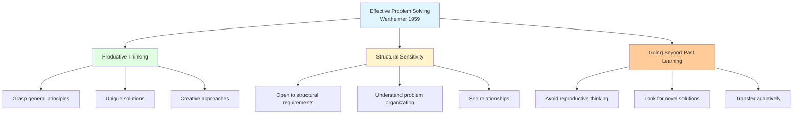
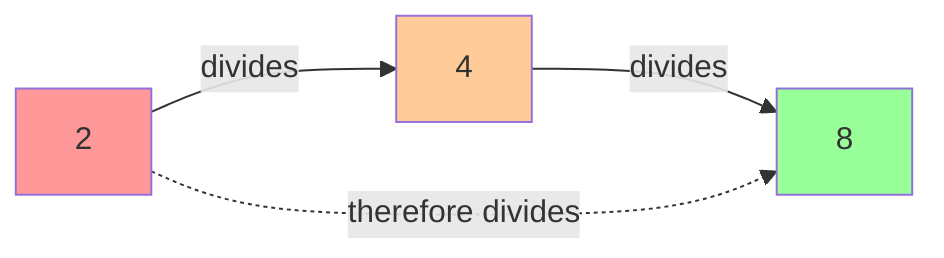
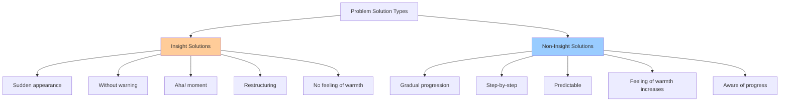

# Types of Thinking and Insight in Problem Solving

## Introduction to Thinking in Problem Solving

Problem solving is fundamentally a cognitive activity that requires various types of thinking processes. Understanding these different types of thinking helps us approach problems more effectively and recognize when sudden insights occur versus gradual problem solving.

## Productive Thinking: The Gestalt Perspective

According to **Wertheimer (1959)**, effective problem solving requires three key elements:

### 1. Productive Thinking

**Definition**: For productive thinking, there is a need to have a **grasp of the general principles** that apply in the particular problem situation.

**Characteristics**:
- Understanding underlying principles
- Generating novel solutions
- Seeing problems from new perspectives
- Creating rather than reproducing solutions

**Contrast with Reproductive Thinking**:
Since individuals do have a tendency to **reproduce thinking appropriate for other situations**, they need to think beyond that solution and look for unique solutions.

**Example**:
- **Reproductive**: Using the same formula for every math problem
- **Productive**: Understanding when to apply different mathematical principles based on problem structure

### 2. Being Sensitive and Open to Structural Requirements

**Importance**: It is important to keep in mind the **structure of the problem** without which solutions may not come about.

**Structural Sensitivity Involves**:
- Recognizing the essential elements of the problem
- Understanding relationships among components
- Seeing the problem's organization
- Being flexible in restructuring when needed

**Example**: In the nine-dot problem (connect 9 dots with 4 straight lines without lifting pen), structural sensitivity helps you realize you must go outside the implicit boundary.

### 3. Going Beyond Previous Problem-Solving Tasks

**Challenge**: People naturally try to apply solutions that worked before, even when they don't fit the current problem.

**Requirement**: Look for unique solutions appropriate to the current problem's structure, not just recycled approaches from past problems.

## The Two Kinds of Thinking Processes

The kinds of thinking processes involved in problem solving are:

### 1. Analytical Thinking

**Definition**: In analytic thinking, there is **nothing more in the solution than in the premise**.

**Characteristics**:
- Conclusion contained in premises
- Deductive reasoning
- Following logical steps
- No new information created

**Example**: 
**Problem**: "How many doors are there in your house?"

**Solution Process**:
- Count doors in each room
- Add them up
- Report total

**Key Point**: The answer is simple counting and adding. There can be no other answer and there can also be no other solution. Everything needed for the solution is already present in the premises (your knowledge of your house).

**Other Examples**:
- 2 + 2 = 4 (arithmetic)
- If all men are mortal, and Socrates is a man, then Socrates is mortal (logical deduction)
- Following a recipe exactly as written

### 2. Synthetic Thinking

**Definition**: Synthetic Thinking **does not contain the conclusion in the premise** itself because the solution is not needed in the construction of the mental object.

**Characteristics**:
- Creates new understanding
- Goes beyond given information
- Constructs mental models
- Generates insights

**Example**: 
We know that:
- 2 is a divisor of 4
- 4 is a divisor of 8
- 2 is also a divisor of 8

**Insight**: In general, it is true that **a divisor of a divisor of a number is a divisor of that number**.

Such solutions are best reached by **constructing mental models** like images such as number lines.

**The Power of Synthetic Thinking**:
> *"The importance of synthetic thinking is that you can get out more than you put into it."*

After you construct a mental model, you can **see relationships that were not evident** before you constructed it. Seeing these new relationships is what comprises problem solving through synthetic thinking.

**In other words**: One is **synthesizing the available information and facts to derive new solutions**. This is also termed as **developing insight**.

## Newell's Mental Model Approach

**Newell** is one of the most influential cognitive psychologists who made the **computer simulation approach** to the study of problem solving.

### The Mental Model Process

Newell stated that the goal is to **construct a mental model**. From this model one will find answers to a problem by **inspecting that model itself**.

**Process**:
1. **Write mentally on the model**: Represent parts of the problem in your mental model
2. **Construct the model**: Build an internal representation
3. **Read the results**: Inspect the model to find answers
4. **Use the "mind's eye"**: Examine the mental representation

**Example**: When solving a geometry problem, you might construct a mental image of the shapes, then "see" the relationships by examining that mental image.

### The Controversy: "Mind's Eye" or Homunculus

:::warning Philosophical Debate
The **"mind's eye"** has traditionally been a controversial issue in cognitive psychology. Another word for it is **"homunculus"** meaning "little man in the head."
:::

**The Problem**:
Most cognitive psychologists disapprove of this concept on the premise that it reflects **nonscientific theories of behavior** that were largely based on concepts like the soul.

**The Infinite Regress Issue**:
- If there's a "little man" reading the mental model...
- Who's reading the little man's mental model?
- This leads to an infinite regress

**Modern View**:
Contemporary cognitive science explains mental imagery through neural activation patterns rather than invoking a homunculus. The "inspection" of mental models is understood as pattern recognition in neural networks.

## Insight Problems

There are **two types of solutions** to problems:
1. **Insightful solutions**
2. **Solutions without involving insight**

### Characteristics of Insight Solutions

**The Essential Characteristic**: The solution appears **suddenly, without warning**.

**Example**: You've been struggling with a riddle for 10 minutes with no progress, then suddenly the answer pops into your head.

### Non-Insight Solutions

**By Contrast**: Problems solved without insight are solved **gradually rather than suddenly**. The solution process here involves a **stepwise progression** towards the solution.

**Example**: Arithmetic and algebraic problems fall into the category of problems solved without insight.

**Process**:
- Step 1: Set up equation
- Step 2: Isolate variable
- Step 3: Solve for x
- Step 4: Check answer

Each step brings you measurably closer to the solution.

### Subjective Experience: The "Feeling of Warmth"

**Important Requirement**: The subjects themselves must be able to **distinguish between these two types of solutions**.

#### For Non-Insight Problems

As the subjects solve a non-insight problem, they should be able to tell that **they are getting closer to the solution**.

**"Feeling of Warmth"**: For non-insight problems, subjects generally have a **greater feeling of warmth** as they get closer and closer to the solution.

**Why?** 
- Non-insightful problems are solved **step by step**
- With each step, the subject gets closer to the solution
- Thus feel **warmer with each step**

**Example**: In algebra, after each correct step, you know you're closer to finding x.

#### For Insight Problems

As for insight problems, there is **no gradual approach** to the solution and so subjects **do not feel warmer** until the solution actually appears.

**Experience**:
- Feel "cold" or stuck
- No sense of progress
- Suddenly—solution appears!
- Instant "warmth" only upon solution

## Metacognition and Problem Solving

**Feeling of knowing** and **feeling of warmth** reflect judgments that subjects make about their own knowledge. Such judgments are examples of **metacognition**.

:::info Definition
**Metacognition** refers to what one knows about the technique of how accurately one can assess one's own cognitive processes—thinking about thinking.
:::

### Components of Metacognition in Problem Solving

1. **Monitoring**: Keeping track of your understanding and progress
2. **Evaluation**: Assessing whether your strategy is working
3. **Planning**: Deciding on approaches before attempting
4. **Regulation**: Adjusting strategies based on monitoring

### Accuracy of Metacognitive Judgments

**For Non-Insight Problems**:
It has been shown that people's **metacognitive assessments** of their performance on non-insight problems are **quite accurate**.

**Why Accurate?**
- Stepwise progress is observable
- Clear milestones indicate advancement
- Feedback is immediate and clear

**For Insight Problems**:
However, their metacognitive assessments of their performance on insight problems are **not accurate**.

**Why Inaccurate?**
Because an **insight is not something that can be planned**. An insight is something that **happens to the person**, not something that a person decides to have.

### The Nature of Insight

**Precursors to Insight**:
- Insight is preceded by a **gradual process** whereby relevant parts of the problem are identified
- However, **solvers may not be aware** that this process is leading toward an insight
- Unconscious processing may be occurring

**Characteristics**:
- Sudden illumination
- Restructuring of problem
- Cannot be forced
- Often accompanied by strong emotion ("Aha!")

## Sources of Difficulty in Insight Problems

Another aspect of insight problems is that the source of difficulty in some insight problems is the **inability to see that something you already know is needed for the solution**.

### The Role of Hints

**Hints given within the context of the problem** are fairly effective in facilitating subsequent insight.

**Why Hints Help**:
- Direct attention to relevant information
- Reduce search space
- Trigger appropriate knowledge
- Overcome functional fixedness

**Example**: 
Problem: "A man has to get a fox, a chicken, and grain across a river. His boat only holds him and one other thing. If left alone, the fox will eat the chicken, and the chicken will eat the grain. How does he get everything across?"

**Hint**: "Think about which item can safely be left alone on either side."

### Gestalt Observation

As the **Gestalt psychologists** often observe, people are generally **not efficient at realizing** that a new problem can be solved with information already at their disposal.

**Phenomenon**: **Functional fixedness** or mental set prevents seeing novel uses for existing knowledge.

**Classic Example**: Duncker's candle problem—using a box of tacks as a candle holder, not just as a container.

## Sagacity: The Ability to Discriminate What's Important

**Definition**: People differ in their ability to **select information that is relevant** to the problem at hand.

**Sagacity** is this ability to discover what is essential about a situation. This ability is important as well as the ability to **remember information that is relevant** to the problem.

### Sagacity vs. Learning

**Distinction**: Sagacity differs from learning in that it involves:
- A **sensitivity to detail**
- A **discernment of what is important** in a situation
- The ability to **see into the situation**
- The ability to **discriminate the important aspects** of it

**In Practice**:
- **Learning**: Acquiring new information
- **Sagacity**: Recognizing which existing information applies

**Example**: 
A doctor sees a patient with various symptoms. Sagacity is the ability to recognize which symptoms are significant diagnostic indicators versus which are incidental.

## Format Effects on Insight Problem Solving

The **format in which the information is presented** makes a difference in insightful problem solving.

### Puzzle Format vs. Declarative Format

**Puzzle Format**: Information embedded in a puzzle or riddle form

**Declarative Format**: Information stated directly as facts

**Research Finding**:
The information given in the **puzzle format leads the subject to discriminate the relevant information better** than when the information is in declarative format.

**Why?**
- The puzzle format leads the subject to **process the relevant information in a way that makes it accessible for later use**
- The declarative format leads to the acquisition of the relevant information, but in a way that makes it **less obvious to see its relevance** for subsequent problem solving

### Example: Multiple Interpretations

Select a word that can be interpreted in different ways. For example, the word **"lake"** can refer to a **frozen or unfrozen** body of water.

**Common Interpretation**: Most people interpret the word to refer to an **unfrozen body of water**.

**Riddle Construction**: A riddle can be constructed by requiring the problem solver to come up with the **less accessible meaning** in order to make sense of what is being described.

**Example Riddle**:
"A stone rested on the surface of the lake for 3 months, after which it sank to the bottom some 10 meters below."

**Solution**: This would provide the solution that "lake" here refers to a **frozen lake** for 3 months (stone on ice surface) and then a **running water lake** afterwards (stone sinks when ice melts).

**Cognitive Process**:
The puzzle format forces you to:
1. Recognize the usual interpretation doesn't work
2. Search for alternative meanings
3. Find the interpretation that makes the scenario possible
4. Experience insight when correct meaning is found

## Practical Applications

### Application 1: Problem-Solving in Science

**Scenario**: A researcher notices an unexpected result in an experiment.

**Analytical Thinking**: Follow standard procedures to verify the result
**Synthetic Thinking**: Construct a mental model of why this might occur, leading to a new hypothesis
**Insight**: Suddenly realize this unexpected result reveals a new principle

### Application 2: Creative Problem Solving

**Challenge**: Design a new product for elderly users

**Productive Thinking**: Don't just modify existing products (reproductive), but understand elderly users' needs fundamentally
**Structural Sensitivity**: Recognize the real problem isn't just physical limitations but maintaining independence
**Sagacity**: Discriminate which user complaints indicate deep needs vs. superficial preferences

### Application 3: Learning and Education

**For Non-Insight Material (e.g., math procedures)**:
- Students can track their progress
- Feeling of warmth increases with practice
- Metacognition is accurate
- Build confidence through measurable advancement

**For Insight-Required Material (e.g., conceptual understanding)**:
- Students may struggle without apparent progress
- Sudden understanding emerges
- Can't force insights
- Create conditions conducive to insight (hints, examples, time)

## Summary

Problem solving involves various types of thinking processes, each suited to different types of problems. Productive thinking requires grasping general principles, being sensitive to problem structure, and going beyond past solutions. The two main types of thinking—analytical and synthetic—differ in whether conclusions are contained in premises or emerge from constructing mental models.

Insight problems are characterized by sudden solutions without gradual progress, contrasting with non-insight problems that involve stepwise advancement. Metacognitive judgments are accurate for non-insight problems but unreliable for insight problems because insights cannot be planned. Sagacity—the ability to discriminate relevant information—and the format of problem presentation significantly affect problem-solving success.

**Key Takeaways**:
1. Productive thinking requires understanding principles, not just reproducing past solutions
2. Analytical thinking finds conclusions in premises; synthetic thinking creates new understanding
3. Insight solutions appear suddenly; non-insight solutions develop gradually
4. Metacognition is accurate for non-insight but not insight problems
5. Sagacity helps identify relevant information
6. Problem format affects accessibility of solutions

---

**Source PDFs**: 
- 📄 [Block-4/Unit-1.pdf - Pages 10-14](/pdfs/MPC-001%20Cognitive%20Psychology,%20Learning%20and%20Memory/Block-4/Unit-1.pdf)
- 📚 MPC-001 Cognitive Psychology, Learning and Memory

## Self-Assessment Questions

1. Explain Wertheimer's three requirements for effective problem solving. Provide an original example demonstrating each requirement.

2. Compare and contrast analytical thinking and synthetic thinking. Create two problems—one solvable by analytical thinking and one requiring synthetic thinking.

3. What is the difference between insight and non-insight problems? Describe the role of "feeling of warmth" in distinguishing between them.

4. Why are metacognitive judgments accurate for non-insight problems but not for insight problems? Discuss the implications for education and learning.

5. Define sagacity and explain how it differs from learning. Provide examples of situations where sagacity would be particularly valuable.

6. Explain why the format (puzzle vs. declarative) in which information is presented affects problem-solving success. Design an experiment to test this effect.

7. Describe Newell's mental model approach to problem solving. What is the "homunculus problem" and why do modern cognitive scientists avoid this concept?

## Memory Aids

### 🎯 "PSG" for Productive Thinking (Wertheimer)
- **P**rinciples (grasp general principles)
- **S**tructure (sensitive to structural requirements)
- **G**o beyond (go beyond past learning)

### 📝 "AS" for Thinking Types
- **A**nalytical (conclusion in premises)
- **S**ynthetic (creates new understanding)

### 🔄 "SINGA" for Insight Characteristics
- **S**udden appearance
- **I**mmediate (without warning)
- **N**o gradual warmth
- **G**estalt restructuring
- **A**ha! moment

### 💡 "MEPS" for Metacognition Components
- **M**onitoring (track progress)
- **E**valuation (assess strategies)
- **P**lanning (decide approaches)
- **S**trategy regulation (adjust methods)
