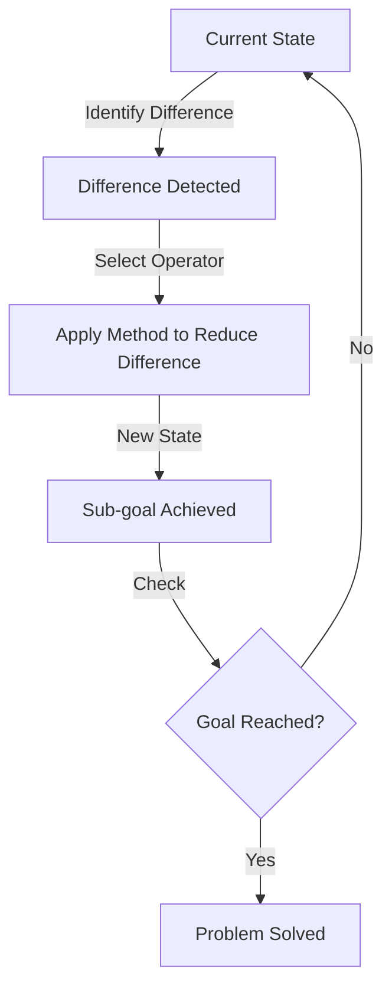

# Specific Problem-Solving Techniques

## Introduction

While general strategies like algorithms and heuristics provide broad frameworks for problem solving, specific techniques offer targeted approaches for particular types of problems. These domain-independent techniques can be applied across various problem contexts, from everyday decisions to complex technical challenges.

## 1. Generate-and-Test Technique

### Overview

The **generate-and-test** technique involves two cyclical phases:
1. **Generate**: Produce possible solutions
2. **Test**: Evaluate whether those solutions meet all criteria

### Simple Example

**Problem**: "Think of ten words beginning with letter 'c' that you eat or drink."

**Process**:
```
Generate → Test → Accept/Reject
━━━━━━━━━━━━━━━━━━━━━━━━━━━━━━━━
Coffee  → Starts with 'c'? Yes. Eat/drink? Yes. ✓ Accept
Cable   → Starts with 'c'? Yes. Eat/drink? No.  ✗ Reject
Ketchup → Starts with 'c'? No (starts with 'k'). ✗ Reject
Cake    → Starts with 'c'? Yes. Eat/drink? Yes. ✓ Accept
```

### When Generate-and-Test Works Well

**1. Limited Possibilities**
- Lost keys between classroom and cafeteria
- Choosing from a small menu
- Selecting from a limited set of options

**2. Clear Criteria**
- Easy-to-test conditions
- Unambiguous success/failure
- Quick verification

**3. Low Cost of Testing**
- Testing doesn't waste resources
- Fast evaluation process
- No penalty for wrong guesses

### When Generate-and-Test Becomes Problematic

**1. Enormous Search Spaces**

**Example: Forgotten ATM PIN**
- 10,000 possible 4-digit combinations (0000-9999)
- Account gets locked after 3-5 attempts
- Frustration exceeds willingness to continue

**Problem**: Too many possibilities to test systematically

**2. No Memory of Attempts**
- Risk of repeating failed solutions
- No learning from mistakes
- Inefficient use of time

**3. Expensive Testing**
- Each test consumes resources
- Penalties for incorrect attempts
- High stakes for failures

### Improving Generate-and-Test

**Use Informed Generation**:
- Don't generate randomly—use relevant knowledge
- For the ATM example: Try frequently used PINs first (birthdays, patterns)
- Rank possibilities by likelihood

**Keep Records**:
- Track what's been tried
- Note why solutions failed
- Build knowledge systematically

**Learn from Failures**:
- Each rejection provides information
- Adjust generation strategy based on feedback
- Refine understanding of criteria

## 2. Means-Ends Analysis

### Core Concept

**Means-ends analysis** breaks complex problems into smaller sub-problems by:
1. Identifying the difference between current state and goal state
2. Finding operators (actions) that reduce these differences
3. Establishing sub-goals to reach the main goal

The name fits perfectly: figure out the "**ends**" (goals) you want, then determine the "**means**" (methods) to reach those ends.

### The Fundamental Process



### Classic Example: Algebraic Equation

**Problem**: Solve for 's'
```
2s - 10 + 5 = s + 5 + 8
```

**Current State**: Complex equation with 's' on both sides
**Goal State**: Equation with single 's' alone on one side

**Means-Ends Analysis Application**:

**Step 1**: Simplify left side
```
2s - 5 = s + 5 + 8
```
**Difference reduced**: Fewer terms on left

**Step 2**: Simplify right side
```
2s - 5 = s + 13
```
**Difference reduced**: Fewer terms on right

**Step 3**: Get all 's' terms on one side
```
2s - s = 13 + 5
s = 18
```
**Goal reached**: Single 's' isolated

### Everyday Example: Getting to Work

**Current State**: Home
**Goal State**: Office 20 miles away

**Means-Ends Analysis**:

**Sub-goal 1**: Get to car
- **Difference**: Need transportation
- **Operator**: Walk to parking lot

**Sub-goal 2**: Start journey
- **Difference**: Car not running
- **Operator**: Start engine

**Sub-goal 3**: Navigate to office
- **Difference**: Don't know exact route
- **Operator**: Use GPS navigation

**Sub-goal 4**: Park
- **Difference**: Need parking space
- **Operator**: Find available spot

### Key Advantages

1. **Manageable Chunks**: Large problems become smaller, solvable pieces
2. **Progress Tracking**: Can measure advancement toward goal
3. **Flexible**: Can adjust if sub-goals change
4. **Natural**: Mirrors how humans naturally think
5. **Teachable**: Easy to explain and learn

### Implementation Steps

1. **Clearly define start and end states**
2. **Identify all differences between states**
3. **Select most significant difference to address first**
4. **Find operators that reduce this difference**
5. **Apply operator to create intermediate state**
6. **Repeat until goal state reached**

## 3. Backward Search

### Core Concept

**Backward search** (or **working backward**) involves:
- Starting at the goal state
- Working backward toward the initial state
- Identifying what must come immediately before the goal
- Continuing backward until reaching the starting point

### When Backward Search is Ideal

**1. Uniquely Specified Goal State**
- Only one clear ending point
- Multiple paths leading to goal
- Complex starting conditions

**Example: Maze Solving**
- Many paths from start
- Single exit point
- Easier to trace backward from exit

**2. Forward Complexity**
- Too many initial possibilities
- Branching paths early in problem
- Clear constraints at goal

### Classic Example: Planning a Dinner Party

**Goal**: Serve dinner at 7:00 PM

**Working Backward**:
```
7:00 PM - Serve dinner
↑
6:45 PM - Final plating and garnishing
↑
6:15 PM - Finish cooking main course
↑
5:30 PM - Start cooking main course
↑
5:00 PM - Prepare ingredients
↑
4:00 PM - Shop for ingredients
↑
3:00 PM - Plan menu
```

This backward planning ensures everything is ready on time.

### Advantages

1. **Reveals Sub-goals**: Working backward naturally identifies necessary steps
2. **Reduces Complexity**: Fewer branches when working from single goal
3. **Ensures Necessity**: Every step identified is required for the goal
4. **Time Planning**: Natural for scheduling and planning

### Example: Mathematical Proof

**Goal**: Prove theorem T

**Backward Reasoning**:
1. "T would be true if proposition P is true"
2. "P would be true if lemma L is true"
3. "L would be true if axiom A applies"
4. "A is a known axiom" ✓

Then construct proof forward: A → L → P → T

## 4. Planning Strategy

### Core Concept

**Planning strategy** involves:
1. Dividing problem into **simple** and **complex** aspects
2. Solving simple aspects first
3. Incorporating complex aspects into the simple solution
4. Refining until complete solution emerges

### Using Analogy as Planning

**Analogy**: Using a solution to an earlier, similar problem to help with current problem.

**Process**:
1. Recognize similarities between current and past problems
2. Recall solution to past problem
3. Adapt that solution to current situation
4. Test and refine as needed

### Example: Anagram with Planning

**Problem**: Solve anagram "BODUT"

**Planning Approach**:
1. **Simple aspect**: Find common letter combinations
   - "OU" is common
   - "D" and "T" often end words

2. **Build from simple**:
   - D-OU-T? → "DOUBT"? Test with 'B'...
   - "DOUBT" ✓ (all letters accounted for)

### Advantages

1. **Reduces Cognitive Load**: Focus on easier parts first
2. **Builds Momentum**: Early success motivates continued effort
3. **Identifies Constraints**: Simple aspects reveal limitations
4. **Natural Integration**: Complex parts fit into simple framework

### Example: Writing a Research Paper

**Simple Aspects First**:
1. Topic selection
2. Basic outline
3. Literature search

**Complex Aspects Later**:
1. Detailed analysis
2. Data interpretation
3. Theoretical integration

## 5. Thinking Aloud Method

### Overview

**Thinking aloud** (or **concurrent verbalization**) involves verbalizing thought processes as they occur during problem solving.

### Ericsson and Simon's Framework

**Concurrent Verbalization**:
- Verbalizing information **while attending to it**
- Relies on **short-term memory**
- Captures real-time thought processes

**Retrospective Verbalization**:
- Describing thoughts **after** they occurred
- Relies on **long-term memory**
- Subject to memory distortions

### The Protocol Analysis Method

**What is a Protocol?**
A verbal description of a problem solver's solution process, obtained through thinking aloud.

### Newell's Steps for Protocol Analysis

**Step 1: Divide into Phrases**
Break the verbal protocol into descriptions of single acts:

```
"I'm looking at the equation..."
"I notice 's' appears on both sides..."
"I'll subtract 's' from each side..."
"Now I have s = 18..."
```

**Step 2: Construct Problem Behavior Graph**
Create a concrete description of how the subject moves through the problem space:

```
Initial State → [Observation] → Decision Point → [Action] → New State
```

**Step 3: Model with Production System**
Design a computational model that reproduces the subject's behavior.

### Benefits of Thinking Aloud

**1. Research Tool**:
- Reveals cognitive processes
- Identifies problem-solving strategies
- Shows decision points and reasoning

**2. Educational Tool**:
- Teachers can demonstrate thinking
- Students can compare their processes
- Metacognitive awareness develops

**3. Debugging Tool**:
- Catches errors as they occur
- Identifies flawed reasoning
- Reveals misconceptions

### Limitations and Criticisms

#### Schooler, Ohlsson, and Brooks (1993) Study

**Finding**: Verbalizing strategies **interfered** with insight problem solving.

**Procedure**:
1. Subjects work on insight problem
2. Interrupted mid-solution
3. **Group A**: Describe their strategies
4. **Group B**: Engage in irrelevant activity
5. Resume problem-solving

**Result**: Group A (verbalization) **less likely** to solve problem than Group B.

**Conclusion**: "Non-reportable or unconscious processes" lead to insight, and verbalization disrupts these processes.

### When Thinking Aloud Helps vs. Hurts

**Helps With**:
- Logical, step-by-step problems
- Algorithmic procedures
- Explicit reasoning tasks
- Teaching and learning

**Hurts With**:
- Insight problems
- Intuitive judgments
- Unconscious processing
- Automatic skills

### Best Practices

**For Researchers**:
1. Include silent control groups
2. Compare verbalization vs. non-verbalization performance
3. Analyze whether verbalization affects outcomes
4. Be aware of process interference

**For Learners**:
1. Use for explicit, logical problems
2. Avoid for insight-requiring tasks
3. Practice until skills become automatic
4. Then reduce verbalization

## 6. Other Problem-Solving Strategies

### Abstraction
**Definition**: Solving problem in a simplified model before applying to the real system.

**Example**: Architects create scale models before building actual structures.

### Divide and Conquer
**Definition**: Breaking large, complex problem into smaller, solvable problems.

**Example**: Software development breaks programs into modules and functions.

### Hypothesis Testing
**Definition**: Assuming possible explanation and trying to prove (or disprove) it.

**Example**: Scientific method involves forming and testing hypotheses.

### Lateral Thinking
**Definition**: Approaching solutions indirectly and creatively from unexpected angles.

**Example**: Using a shoe to hammer a nail when no hammer is available.

### Method of Focal Objects
**Definition**: Synthesizing non-matching characteristics of different objects into something new.

**Example**: Combining a phone + camera + computer = smartphone.

### Reduction
**Definition**: Transforming problem into another problem with known solutions.

**Example**: Converting word problem into algebraic equation.

### Research
**Definition**: Employing existing ideas or adapting solutions to similar problems.

**Example**: Literature review before starting new research project.

### Root Cause Analysis
**Definition**: Identifying and eliminating underlying cause of problem.

**Example**: "5 Whys" technique to find root cause.

### Trial-and-Error
**Definition**: Testing possible solutions until finding one that works.

**Example**: Trying different keys on a key ring until finding the right one.

### Brainstorming
**Definition**: Group generation of many solutions, then combining and refining.

**Example**: Team sessions where all ideas are welcomed without initial judgment.

## Selecting the Right Technique

| Technique | Best For | Avoid When |
|-----------|----------|------------|
| **Generate-and-Test** | Limited options, clear criteria | Huge search space, expensive testing |
| **Means-Ends Analysis** | Multi-step problems, clear goals | Simple one-step problems |
| **Backward Search** | Unique goal, complex start | Multiple valid goals |
| **Planning Strategy** | Complex with simple elements | Uniformly difficult problems |
| **Thinking Aloud** | Logical, explicit tasks | Insight, intuitive problems |

## Practical Integration

Most real-world problems benefit from **combining multiple techniques**:

**Example: Planning a Vacation**

1. **Generate-and-Test**: List possible destinations
2. **Planning Strategy**: Start with simple aspects (budget, dates)
3. **Means-Ends Analysis**: Break trip planning into sub-goals
4. **Backward Search**: Work from desired return date
5. **Research**: Look up similar trips others have taken

## Conclusion

Mastering specific problem-solving techniques expands your cognitive toolkit. While no single technique works universally, understanding when and how to apply each one—and how to combine them—dramatically improves problem-solving effectiveness. The key is recognizing problem characteristics and matching them to appropriate techniques.

---

**Source PDFs**: 
- 📄 [Block-4/Unit-2.pdf - Pages 19-23](/pdfs/MPC-001%20Cognitive%20Psychology,%20Learning%20and%20Memory/Block-4/Unit-2.pdf)
- 📚 MPC-001 Cognitive Psychology, Learning and Memory

---

## Self-Assessment Questions

1. Explain the generate-and-test technique and when it's most effective.
2. What makes means-ends analysis particularly useful for complex problems?
3. Describe a situation where backward search would be more effective than forward planning.
4. How does the planning strategy reduce cognitive load?
5. What is the difference between concurrent and retrospective verbalization?
6. Why does thinking aloud sometimes interfere with insight problem solving?
7. Provide an example of using abstraction to solve a real-world problem.
8. How can divide-and-conquer be applied to academic studying?
9. Compare trial-and-error with systematic algorithmic approaches.
10. When might brainstorming be preferred over individual problem solving?

---

## Memory Aids

**GTM for Core Techniques**:
- **G**enerate-and-Test: Try and check
- **T**racking progress: Means-ends analysis
- **M**oving backward: Backward search

**PAST for Technique Selection**:
- **P**roblem type: Match technique to problem
- **A**vailable time: Quick vs thorough
- **S**takeholders: Individual vs group
- **T**esting cost: Expensive vs cheap errors

---

## External Resources

### Academic Sources
- 📚 [Wikipedia: Means-Ends Analysis](https://en.wikipedia.org/wiki/Means%E2%80%93ends_analysis)
- 📚 [Wikipedia: Problem Solving Strategies](https://en.wikipedia.org/wiki/Problem_solving#Strategies)
- 📚 [Wikipedia: Protocol Analysis](https://en.wikipedia.org/wiki/Protocol_analysis)

### Video Resources
- 🎥 [Problem Solving Strategies - Khan Academy](https://www.khanacademy.org/math/algebra/x2f8bb11595b61c86:working-with-units/x2f8bb11595b61c86:problem-solving-strategies/v/problem-solving-strategies)
- 🎥 [Thinking Aloud Method Explained](https://www.youtube.com/results?search_query=thinking+aloud+protocol+analysis)

### Research Papers
- Newell, A., & Simon, H. A. (1972). Human problem solving. Englewood Cliffs, NJ: Prentice-Hall.
- Ericsson, K. A., & Simon, H. A. (1993). Protocol analysis: Verbal reports as data (Revised edition). Cambridge, MA: MIT Press.
- Schooler, J. W., Ohlsson, S., & Brooks, K. (1993). Thoughts beyond words: When language overshadows insight. Journal of Experimental Psychology: General, 122(2), 166-183.
