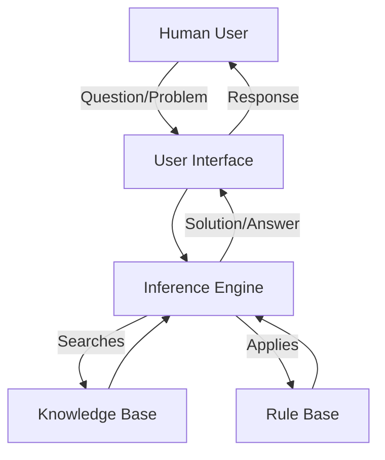

# Artificial Intelligence in Problem Solving

## Introduction

The intersection of artificial intelligence (AI) and problem solving represents one of the most fascinating areas of cognitive psychology. Can machines think like humans? Can computer programs solve problems the way we do? These questions have driven decades of research into artificial intelligence approaches to problem solving, yielding both impressive achievements and important limitations.

## The Problem Space Hypothesis

### Core Concept

The **problem space hypothesis** is a fundamental theory in AI and cognitive science that provides a framework for understanding how problems are mentally represented and solved.

**Key Proposition**:
> "Every possible state of affairs within a problem corresponds to a particular mental node, and the entire set of nodes occupies some mental area. This area, together with the mental graph connecting nodes, constitutes a problem space."

### Components of Problem Space

**1. States**
- Each possible configuration of the problem
- Represents a snapshot at a particular point
- Includes both intermediate and final states

**2. Nodes**
- Mental representations of states
- Connected by possible transitions
- Form a network structure

**3. Operators**
- Actions that transform one state into another
- Legal moves within the problem
- Create paths through the space

**4. Problem Space**
- The complete set of all possible states
- All connections between states
- Entire landscape of the problem

### Example: 8-Puzzle

Consider the classic sliding tile puzzle:

```
Start State:        Goal State:
┌───┬───┬───┐      ┌───┬───┬───┐
│ 1 │ 2 │ 3 │      │ 1 │ 2 │ 3 │
├───┼───┼───┤      ├───┼───┼───┤
│ 8 │   │ 4 │      │ 8 │   │ 4 │
├───┼───┼───┤      ├───┼───┼───┤
│ 7 │ 6 │ 5 │      │ 7 │ 6 │ 5 │
└───┴───┴───┘      └───┴───┴───┘
```

**Problem Space**:
- **States**: All possible tile arrangements
- **Operators**: Moving tiles into empty space (up, down, left, right)
- **Solution**: Path from start state to goal state

### Significance

The problem space hypothesis has been crucial because it:
1. **Formalizes Problem Solving**: Provides precise language for describing problems
2. **Enables Computation**: Can be programmed into computers
3. **Facilitates Research**: Allows systematic study of problem-solving strategies
4. **Bridges Human and Machine**: Same framework applies to both

## Expert Systems

### What Are Expert Systems?

**Expert systems** are computer programs designed to model the judgments and reasoning of one or more human experts in a particular field.

**Purpose**: To capture human expertise in a form that computers can process and apply to solve problems.

### Architecture of Expert Systems



#### 1. Knowledge Base

**Function**: Stores facts and information relevant to the domain.

**Contents**:
- Factual knowledge about the field
- Relationships between concepts
- Domain-specific data
- Established principles and theories

**Example (Medical Diagnosis)**:
```
- Fever is a symptom of infection
- Bacteria cause infections
- Antibiotics kill bacteria
- Penicillin is an antibiotic
```

#### 2. Inference Rules (Rule Base)

**Function**: Logical rules that guide reasoning and decision-making.

**Format**: Often "IF-THEN" statements

**Example**:
```
IF patient has fever AND 
   patient has bacterial infection THEN 
   prescribe antibiotic

IF antibiotic is needed AND 
   no penicillin allergy THEN 
   consider penicillin
```

#### 3. Inference Engine (Search Engine)

**Function**: The "brain" that applies rules to knowledge to derive conclusions.

**Process**:
1. Accept user query
2. Search knowledge base for relevant facts
3. Apply inference rules
4. Chain logical steps together
5. Generate solution or recommendation

**Reasoning Strategies**:
- **Forward Chaining**: Start with known facts, derive conclusions
- **Backward Chaining**: Start with hypothesis, work backward to verify

#### 4. User Interface

**Function**: Means of interaction between human users and the system.

**Features**:
- Query input
- Explanation of reasoning
- Results presentation
- Follow-up questions

### Real-World Expert Systems

**1. MYCIN (Medical Diagnosis)**
- Domain: Bacterial infection diagnosis
- Task: Recommend antibiotics
- Performance: Often matched or exceeded human experts

**2. DENDRAL (Chemistry)**
- Domain: Organic chemistry
- Task: Determine molecular structure
- Impact: First expert system to demonstrate practical value

**3. XCON (Configuration)**
- Domain: Computer system configuration
- Task: Configure VAX computer systems
- Success: Saved millions of dollars for DEC Corporation

**4. PROSPECTOR (Geology)**
- Domain: Mineral exploration
- Task: Identify likely mineral deposits
- Achievement: Successfully predicted major molybdenum deposit

### Advantages of Expert Systems

**1. Accessibility**
- Makes expert knowledge available 24/7
- No need to wait for human expert
- Can serve multiple users simultaneously

**2. Consistency**
- Always applies same reasoning
- No emotional factors
- Systematic consideration of all rules

**3. Cost-Effectiveness**
- Lower cost than human experts over time
- No salary, benefits, or training costs
- Easily replicated

**4. Preservation of Expertise**
- Captures knowledge of retiring experts
- Maintains institutional knowledge
- Can be updated as knowledge grows

**5. Educational Value**
- Explains reasoning process
- Teaching tool for students
- Demonstrates expert-level thinking

### Limitations of Expert Systems

**1. Knowledge Acquisition Bottleneck**
- Difficult to extract expert knowledge
- Experts may not be aware of their reasoning
- Time-consuming to program all rules

**2. Brittleness**
- Only works within narrow domain
- Cannot handle novel situations
- No common sense reasoning

**3. Maintenance Challenges**
- Knowledge becomes outdated
- Rules may conflict as system grows
- Difficult to modify complex systems

**4. Lack of Learning**
- Traditional systems don't learn from experience
- Cannot adapt without reprogramming
- No improvement over time

**5. No Intuition**
- Purely rule-based reasoning
- Missing human "gut feelings"
- Cannot recognize when rules don't apply

## Computer Simulation Approach

### Core Idea

**Computer simulation** attempts to create programs that solve problems in ways similar to human problem solving.

**Goal**: Not just to solve problems, but to solve them *the way humans do*.

### Methodology

**1. Study Human Problem Solvers**
- Observe humans solving problems
- Use think-aloud protocols
- Identify strategies and heuristics

**2. Program Computer Simulation**
- Translate human strategies into code
- Create algorithms that mimic human approaches
- Test against human performance

**3. Compare and Refine**
- Compare program outputs to human solutions
- Identify discrepancies
- Refine model to better match human behavior

### Classic Example: General Problem Solver (GPS)

**Developed by**: Newell and Simon (1960s)

**Approach**: Implemented means-ends analysis as a computer program

**Process**:
1. Identify difference between current and goal state
2. Find operator to reduce difference
3. Apply operator
4. Repeat until goal reached

**Significance**: Demonstrated that complex human problem-solving could be modeled computationally.

### Achievements

**1. Tower of Hanoi**
- Successfully solved the puzzle
- Used strategies similar to humans
- Replicated typical human errors

**2. Logic Theorem Proving**
- Proved mathematical theorems
- Discovered novel proofs
- Demonstrated machine reasoning

**3. Chess Playing**
- Programs that play at expert level
- Use combination of search and evaluation
- Some superhuman performance

**4. Natural Language Processing**
- Understanding typed questions
- Generating coherent responses
- Translation between languages

## Criticisms of Computer Simulation

### 1. Complexity Argument

**Criticism**: Human thinking is too complex to be captured by any machine.

**Response from AI Researchers**:
- Computer programs can handle very complicated problems
- Demonstrated success in many domains
- No theoretical reason complexity cannot be modeled

**Counter-Criticism**: Complexity of human thought may be qualitatively different from computational complexity.

### 2. The "Real Thinking" Argument

**Criticism**: Whatever computers do, it doesn't count as real thinking.

**Philosophical Basis**: Martin Heidegger and phenomenology

**Heidegger's Position**:
> "The essence of thinking lies behind processes like reasoning and calculating. Computers simulate reasoning and calculating but miss the subjective origin of thinking—the concern with the fundamental problem of being alive in the world."

**Key Points**:
- **Consciousness**: Computers lack subjective experience
- **Intentionality**: No genuine understanding of meaning
- **Embodiment**: No lived experience in the world
- **Being**: No existential concerns or awareness

### 3. The Chinese Room Argument (Searle)

**Thought Experiment**:
1. A person who doesn't understand Chinese sits in a room
2. Chinese characters are passed in
3. Person follows English rulebook to manipulate characters
4. Chinese characters are passed out
5. To outside observers, perfect Chinese responses emerge

**Question**: Does the person (or system) understand Chinese?

**Searle's Answer**: No—just following rules without understanding.

**Implication**: Computers similarly follow rules without genuine understanding.

### 4. The Symbol Grounding Problem

**Issue**: How do symbols in a computer relate to real-world meanings?

**Example**:
- Humans connect word "cat" to actual experiences with cats
- Computers only manipulate symbols with no connection to reality
- No genuine understanding of what symbols represent

### 5. Lack of Common Sense

**Problem**: Computers lack basic common-sense knowledge humans possess.

**Example**:
- Humans know that water is wet without being told
- Computers need explicit programming of all facts
- No intuitive understanding of the world

### 6. No Genuine Learning

**Criticism**: Traditional AI systems don't truly learn like humans.

**Human Learning**:
- Generalizes from few examples
- Learns concepts inductively
- Transfers knowledge across domains

**Traditional AI**:
- Requires extensive training data
- Limited generalization
- Narrow domain expertise

**Note**: Modern machine learning partially addresses this criticism.

## Current State and Future Directions

### Advances Since Original Criticisms

**1. Machine Learning**
- Systems that improve from experience
- Deep learning neural networks
- More human-like learning patterns

**2. Natural Language Processing**
- Sophisticated language models
- Context-aware responses
- Approaching human-like conversation

**3. Computer Vision**
- Image recognition surpassing humans
- Object detection and classification
- Scene understanding

**4. Hybrid Approaches**
- Combining symbolic AI with learning
- Integration of multiple techniques
- More robust systems

### Remaining Challenges

**1. Consciousness and Qualia**
- No progress on subjective experience
- Philosophical questions remain
- Hard problem of consciousness unsolved

**2. General Intelligence**
- Most AI still narrow and specialized
- Lack of flexible, general reasoning
- No genuine understanding

**3. Common Sense Reasoning**
- Still difficult for AI systems
- Requires vast amounts of world knowledge
- Implicit understanding missing

**4. Creativity and Innovation**
- Limited genuine creativity
- Mostly recombination of existing patterns
- No true novelty generation

### Practical Value Despite Limitations

**Important Recognition**: Even if AI doesn't truly "think," it has enormous practical value:

**1. Problem-Solving Tools**
- Augment human capabilities
- Handle routine tasks
- Process vast data quickly

**2. Research Instruments**
- Test cognitive theories
- Explore problem-solving strategies
- Generate hypotheses

**3. Commercial Applications**
- Medical diagnosis support
- Financial analysis
- Manufacturing optimization

**4. Educational Resources**
- Intelligent tutoring systems
- Personalized learning
- Skill assessment

## Integration with Human Problem Solving

### Complementary Strengths

**Humans Excel At**:
- Common sense reasoning
- Flexible adaptation
- Creative insight
- Understanding context
- Moral judgment

**AI Excels At**:
- Rapid calculation
- Memory for vast data
- Consistent application of rules
- Pattern recognition in large datasets
- Tireless operation

### Optimal Combination

**Human-AI Collaboration**:
1. AI handles computational aspects
2. Humans provide judgment and creativity
3. AI presents options and analysis
4. Humans make final decisions
5. Both learn and improve

## Conclusion

Artificial intelligence has made significant contributions to understanding and implementing problem-solving processes. The problem space hypothesis provides a formal framework for representing problems, while expert systems demonstrate practical applications of AI. Computer simulation attempts to model human problem-solving, achieving remarkable success in specific domains. However, fundamental philosophical questions about consciousness, understanding, and the nature of thinking remain unresolved. Despite these limitations, AI continues to provide valuable tools for problem solving and insights into human cognition. The future likely lies not in AI replacing human problem solvers, but in sophisticated collaboration between human intelligence and artificial systems.

---

**Source PDFs**: 
- 📄 [Block-4/Unit-2.pdf - Pages 26-27](/pdfs/MPC-001%20Cognitive%20Psychology,%20Learning%20and%20Memory/Block-4/Unit-2.pdf)
- 📚 MPC-001 Cognitive Psychology, Learning and Memory

---

## Self-Assessment Questions

1. Explain the problem space hypothesis and its key components.
2. What is an expert system, and what are its main components?
3. Describe the architecture of a typical expert system using a diagram.
4. What advantages do expert systems offer over human experts?
5. What are the main limitations of expert systems?
6. What is the goal of the computer simulation approach to problem solving?
7. Explain Heidegger's criticism of artificial intelligence.
8. Describe the Chinese Room argument. What is it trying to demonstrate?
9. What is the symbol grounding problem?
10. How can humans and AI systems best work together in problem solving?

---

## Memory Aids

**NIKE for Expert System Components**:
- **N**odes of knowledge: Knowledge Base
- **I**nference rules: Rule Base
- **K**ey processor: Inference Engine  
- **E**ntry point: User Interface

**HAL for Human vs AI**:
- **H**umans: Context, creativity, common sense
- **A**I: Accuracy, algorithms, automation
- **L**everage both: Complementary collaboration

**PACK for Problem Space**:
- **P**ossible states: All configurations
- **A**ctions available: Operators
- **C**onnections: Paths between states
- **K**ey solution: Path to goal

---

## External Resources

### Academic Sources
- 📚 [Wikipedia: Problem Space](https://en.wikipedia.org/wiki/Problem_space)
- 📚 [Wikipedia: Expert System](https://en.wikipedia.org/wiki/Expert_system)
- 📚 [Wikipedia: Chinese Room](https://en.wikipedia.org/wiki/Chinese_room)
- 📚 [Wikipedia: Artificial Intelligence](https://en.wikipedia.org/wiki/Artificial_intelligence)

### Video Resources
- 🎥 [Expert Systems Explained](https://www.youtube.com/results?search_query=expert+systems+explained)
- 🎥 [Chinese Room Argument](https://www.youtube.com/results?search_query=chinese+room+argument)

### Research Papers
- Newell, A., & Simon, H. A. (1972). Human problem solving. Englewood Cliffs, NJ: Prentice-Hall.
- Searle, J. R. (1980). Minds, brains, and programs. Behavioral and Brain Sciences, 3(3), 417-424.
- Heidegger, M. (1968). What is called thinking? New York: Harper & Row.
- Russell, S., & Norvig, P. (2020). Artificial Intelligence: A Modern Approach (4th ed.). Pearson.

### Further Exploration
- Stanford Encyclopedia of Philosophy: Chinese Room Argument
- MIT OpenCourseWare: Artificial Intelligence courses
- Explore modern AI applications like ChatGPT to understand current capabilities
