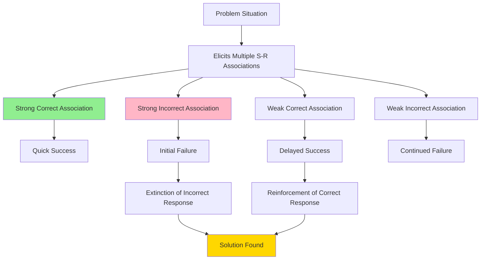
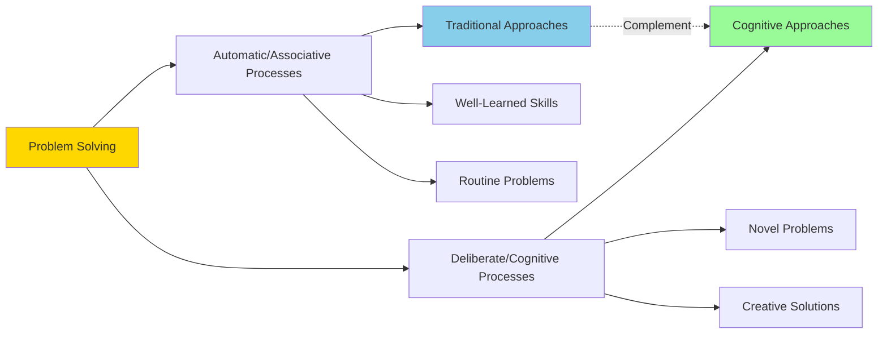

# Traditional Approaches to Problem Solving

## Introduction

Traditional approaches to problem solving emerged from **behaviorist psychology** in the early 20th century, explaining human problem-solving behavior through principles of **associative learning**. Unlike later cognitive approaches that emphasize mental representations and information processing, traditional approaches focus on observable stimulus-response relationships and the role of prior learning experiences.

These approaches, grounded in the experimental work of pioneers like **Ivan Pavlov**, **John B. Watson**, and **B.F. Skinner**, view problem solving as the application and rearrangement of learned associations rather than as insight or creative restructuring. Understanding these foundational theories provides essential context for appreciating how problem-solving research evolved toward cognitive and information-processing models.

:::tip Key Concept
Traditional approaches explain problem solving through **stimulus-response (S-R) associations** formed through classical and instrumental conditioning, emphasizing the transfer of prior learning to new problem situations.
:::

---

## Core Principles of Traditional Approaches

### 1. Associative Learning Foundation

Traditional theories explain problem solving through two fundamental learning mechanisms:

#### **Classical Conditioning (Pavlovian Learning)**
- **Discovered by**: Ivan Pavlov (1849-1936)
- **Mechanism**: Learning through association between stimuli
- **Application**: Problem situations become associated with previously learned responses
- **Example**: A student who experienced success solving algebra problems using a specific method automatically applies that method to new mathematical challenges

#### **Instrumental (Operant) Conditioning**
- **Developed by**: Edward Thorndike and later refined by B.F. Skinner
- **Mechanism**: Learning through consequences (reinforcement and punishment)
- **Law of Effect**: Responses followed by positive outcomes are strengthened
- **Application**: Problem-solving behaviors that lead to successful solutions are reinforced and become more likely to recur

### 2. The Role of Prior Experience

According to traditional approaches, individuals enter problem situations with a **complex of stimulus-response associations** built from previous experiences:

:::info Transfer of Learning
The traditional view emphasizes **transfer of prior learning** to new problem situations. Problem difficulty depends on:
- **Strength of correct associations** relative to incorrect ones
- **Similarity** between current and past problem situations
- **Amount of previous reinforcement** for relevant responses
:::

### 3. Associative Rearrangement

Problem solving involves the **rearrangement of associative complexes**:

**During Problem Solving:**
1. **Extinction**: Incorrect associations are weakened through failure (non-reinforcement)
2. **Strengthening**: Correct associations are strengthened through success (reinforcement)
3. **Reorganization**: The associative structure is gradually modified

**Example: Solving a Mechanical Puzzle**
- Initial attempts activate various learned behaviors (pulling, pushing, twisting)
- Unsuccessful actions are gradually extinguished
- The successful action sequence is reinforced
- Future similar problems benefit from this reorganized associative structure

---

## Problem Difficulty in Traditional View

Traditional approaches predict that **problem difficulty** is determined by:

### 1. **Associative Competition**
- Problems are harder when **incorrect associations** are stronger than correct ones
- Example: Using inefficient problem-solving strategies because they were extensively reinforced in the past

### 2. **Negative Transfer**
- Previous learning can **interfere** with new problem solving
- Example: Students who learned to solve quadratic equations by factoring may struggle with the quadratic formula approach initially

### 3. **Associative Strength Hierarchy**

| Association Type | Strength | Outcome |
|-----------------|----------|---------|
| Correct & Strong | High | Easy problem |
| Correct & Weak | Low | Difficult problem |
| Incorrect & Strong | High | Very difficult problem (negative transfer) |
| Incorrect & Weak | Low | Moderate difficulty |

---

## Trial and Error Learning

A central feature of traditional approaches is **trial-and-error learning**, systematically studied by **Edward Thorndike** (1874-1949):

### Thorndike's Puzzle Box Experiments

Thorndike placed hungry cats in puzzle boxes with food visible outside. To escape, cats had to:
- Pull a lever
- Press a button
- Pull a string

**Observations:**
1. Initial behavior was **random** (scratching, biting, meowing)
2. **Accidental success** led to escape
3. With repeated trials, **unsuccessful behaviors decreased**
4. **Successful behaviors increased** in frequency
5. Eventually, cats solved puzzles **immediately** upon placement

:::note Law of Effect
*"Responses that produce a satisfying effect in a particular situation become more likely to occur again in that situation, and responses that produce a discomforting effect become less likely to occur again in that situation."*  
— Edward Thorndike (1911)
:::

---

## Strengths of Traditional Approaches

### 1. **Empirical Foundation**
- Based on rigorous experimental research
- Observable and measurable behaviors
- Replicable findings across species

### 2. **Practical Applications**
- Educational methods (drill and practice)
- Behavioral modification techniques
- Training programs in various domains

### 3. **Emphasis on Practice**
- Recognizes importance of **repetition**
- Explains skill acquisition through reinforcement
- Accounts for **automaticity** of well-learned skills

### 4. **Transfer of Learning**
- Explains how past experience influences current problem solving
- Predicts difficulties based on prior learning history
- Provides framework for understanding interference effects

---

## Limitations and Criticisms

### 1. **Neglect of Mental Processes**
Traditional approaches were criticized for being "**black box**" theories that:
- Ignored internal cognitive processes
- Failed to explain sudden insights
- Could not account for creative problem solving

### 2. **Inadequate Explanation of Complex Problems**
Cannot fully explain:
- **Insight problems** (like Köhler's ape experiments)
- Problems requiring **restructuring** of the situation
- **Novel problems** with no prior similar experiences
- **Creative solutions** that go beyond previous associations

### 3. **Passive Learning Model**
- Views learners as **passive responders** to environmental stimuli
- Underestimates active cognitive involvement
- Does not account for **goal-directed behavior** and planning

### 4. **Species Limitations**
While effective for explaining:
- Simple animal learning
- Basic skill acquisition
- Rote learning tasks

Less effective for:
- Human higher-order thinking
- Abstract reasoning
- Language-based problem solving

---

## Historical Context and Evolution

### The Behaviorist Era (1913-1950s)

**Key Figures and Contributions:**

| Psychologist | Contribution | Relevance to Problem Solving |
|--------------|--------------|------------------------------|
| **John B. Watson** (1913) | Founded behaviorism | Emphasized observable behavior over introspection |
| **Edward Thorndike** (1911) | Law of Effect | Trial-and-error learning in problem solving |
| **B.F. Skinner** (1938) | Operant conditioning | Reinforcement schedules in skill acquisition |
| **Clark Hull** (1943) | Drive-reduction theory | Motivation in problem-solving behavior |

### Transition to Cognitive Approaches

By the 1950s-1960s, limitations of traditional approaches led to the **Cognitive Revolution**:
- **Gestalt psychology** demonstrated insight and restructuring
- **Information processing** models emerged
- **Computer analogies** provided new frameworks
- **Neuroscience** revealed brain mechanisms beyond S-R associations

---

## Real-World Applications

### 1. **Educational Settings**
- **Programmed instruction**: Breaking complex skills into small steps
- **Mastery learning**: Ensuring thorough learning before progression
- **Practice and repetition**: Building strong associations

### 2. **Clinical Applications**
- **Systematic desensitization**: Treating phobias
- **Token economies**: Behavioral management
- **Habit reversal**: Breaking unwanted response patterns

### 3. **Workplace Training**
- **Procedural learning**: Standard operating procedures
- **Safety training**: Reinforcing correct responses in hazardous situations
- **Quality control**: Establishing consistent performance standards

### 4. **Sports and Skill Development**
- **Motor skill acquisition**: Repeated practice with feedback
- **Muscle memory**: Automaticity through reinforcement
- **Error correction**: Extinction of incorrect movements

---

## Integration with Modern Cognitive Science

While traditional approaches are now seen as **incomplete**, they remain valuable:

### Contemporary Recognition of Traditional Principles

**Modern cognitive psychology acknowledges:**
1. **Procedural memory** operates through associative strengthening
2. **Automaticity** develops through practice (reinforcement)
3. **Habit formation** follows associative learning principles
4. **Implicit learning** occurs without conscious awareness (similar to classical conditioning)

### Complementary Perspectives

---

## Memory Aid: SARS Framework

Remember traditional approaches with **SARS**:

- **S**timulus-Response associations
- **A**ssociative learning (classical & instrumental)
- **R**einforcement and extinction
- **S**trength of prior learning matters

---

## Self-Assessment Questions

1. **Basic Understanding**: Explain how classical and instrumental conditioning contribute to problem-solving behavior according to traditional approaches.

2. **Application**: A student consistently uses the same ineffective study strategy despite poor grades. Use traditional approaches to explain why this behavior persists and how it might change.

3. **Critical Thinking**: What aspects of problem solving can traditional approaches explain well, and what aspects require cognitive theories to explain adequately?

4. **Comparison**: How does the traditional view of problem difficulty differ from the Gestalt view? Which seems more accurate for different types of problems?

5. **Integration**: How might you combine insights from traditional approaches with modern cognitive theories to design an effective problem-solving training program?

---

## External Resources

### Research Articles
- **Thorndike, E. L. (1898).** "Animal Intelligence: An Experimental Study of the Associative Processes in Animals." *Psychological Review Monograph Supplement*, 2(4), i-109. [Classic foundational study]
- **Skinner, B. F. (1953).** "Science and Human Behavior." New York: Macmillan. [Comprehensive behaviorist framework]
- **Estes, W. K. (1950).** "Toward a statistical theory of learning." *Psychological Review*, 57(2), 94-107. [Mathematical models of associative learning]

### Educational Videos
- [Behaviorism: Pavlov, Thorndike, and Skinner](https://www.youtube.com/watch?v=qG2SwE_6uVM) - Crash Course Psychology
- [Classical and Operant Conditioning](https://www.youtube.com/watch?v=H6LEcM0E0io) - Khan Academy

### Wikipedia References
- [Behaviorism](https://en.wikipedia.org/wiki/Behaviorism)
- [Edward Thorndike](https://en.wikipedia.org/wiki/Edward_Thorndike)
- [Law of Effect](https://en.wikipedia.org/wiki/Law_of_effect)

---

**Source PDFs**: 
- 📄 [Block-4/Unit-3.pdf - Pages 29-31](/pdfs/MPC-001%20Cognitive%20Psychology,%20Learning%20and%20Memory/Block-4/Unit-3.pdf)
- 📚 MPC-001 Cognitive Psychology, Learning and Memory
