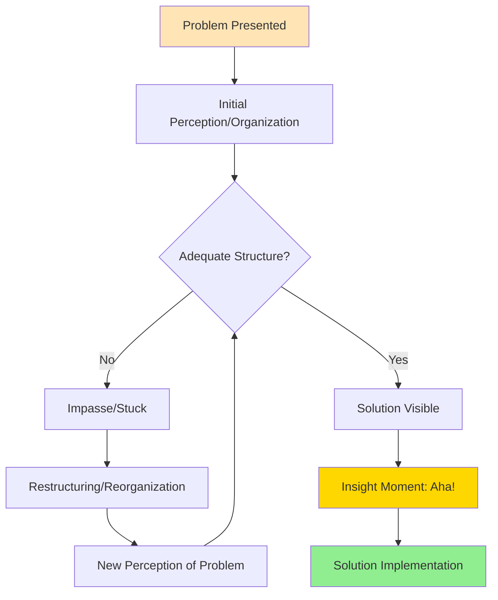
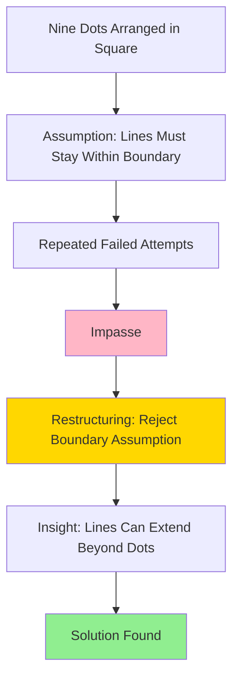
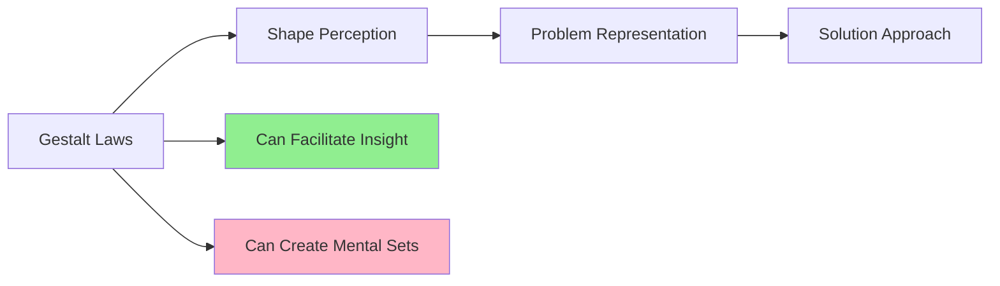
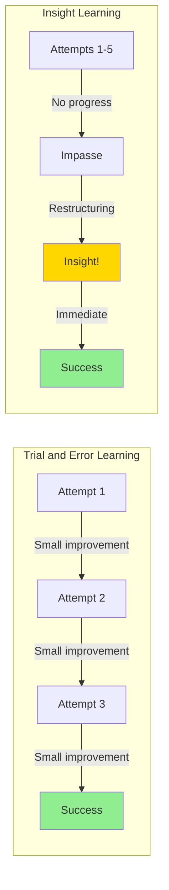

# Gestalt Approaches to Problem Solving

## Introduction

In stark contrast to traditional behaviorist approaches, **Gestalt psychology** revolutionized the understanding of problem solving by emphasizing **insight, restructuring, and holistic perception**. Emerging in Germany in the early 20th century through the work of **Max Wertheimer**, **Wolfgang Köhler**, and **Kurt Koffka**, Gestalt theory challenged the notion that problem solving occurs through gradual, incremental trial-and-error learning.

The term "**Gestalt**" (German for "form" or "configuration") reflects the movement's central principle: **"The whole is different from the sum of its parts."** Gestalt psychologists argued that problem solvers perceive and reorganize entire problem structures rather than building solutions from individual stimulus-response associations.

:::tip Core Principle
Gestalt approaches emphasize that problem solving involves **sudden reorganization** or **restructuring** of the problem situation, leading to insight—an "aha!" moment when the solution becomes clear all at once.
:::

---

## Historical Context and Key Figures

### Origins of Gestalt Psychology

**Founders and Their Contributions:**

| Psychologist | Key Work | Contribution to Problem Solving |
|--------------|----------|--------------------------------|
| **Max Wertheimer** (1880-1943) | *Productive Thinking* (1945) | Distinguished reproductive from productive thinking |
| **Wolfgang Köhler** (1887-1967) | *The Mentality of Apes* (1925) | Demonstrated insight in primates |
| **Kurt Koffka** (1886-1941) | *Principles of Gestalt Psychology* (1935) | Applied Gestalt principles to learning |
| **Kurt Lewin** (1890-1947) | Field theory | Problem space as psychological field |

### The Cognitive Revolution Connection

Gestalt psychology laid groundwork for the **cognitive revolution** by:
- Emphasizing **mental representations** and internal processes
- Challenging behaviorist "black box" approaches
- Introducing concepts later adopted by cognitive science
- Focusing on **problem structure** rather than just behavior

---

## Core Concepts of Gestalt Problem Solving

### 1. Problem Structure and Reorganization

Gestalt psychologists emphasized the **structure of the problem situation** rather than associations:



**Key Features:**
- Problems have an **objective structure** independent of the solver
- Success depends on **perceiving the correct structure**
- **Restructuring** involves seeing elements in new relationships
- Solutions often appear **suddenly** rather than gradually

### 2. Insight: The "Aha!" Experience

**Definition**: Insight is the **sudden comprehension** of a solution following a period of unsuccessful attempts.

**Characteristics of Insight:**
1. **Suddenness**: Solution appears abruptly, not gradually
2. **Completeness**: Entire solution grasped at once
3. **Ease of execution**: Once seen, solution is implemented smoothly
4. **Memorability**: Insightful solutions are retained well
5. **Transfer**: Insight generalizes to similar problems

:::info Classic Example: Köhler's Apes
Wolfgang Köhler observed chimpanzees solving problems in ways that couldn't be explained by trial-and-error:

**The Banana Problem:**
- Bananas hung from cage ceiling (too high to reach)
- Boxes and sticks scattered in cage
- After period of apparent thinking, apes suddenly stacked boxes or used sticks
- Solution appeared complete and purposeful, not accidental
- No gradual improvement typical of associative learning

**Interpretation**: The apes **restructured** their perception of objects (boxes as climbing tools, sticks as reaching extensions), demonstrating insight rather than random trial-and-error.
:::

### 3. Reproductive vs. Productive Thinking

**Max Wertheimer** distinguished two fundamentally different types of thinking:

#### **Reproductive Thinking**
- **Applies familiar methods** to new problems
- Uses **rote memory** and practiced procedures
- **Algorithmic**: Following known steps
- **Mechanical**: No deep understanding required
- **Limited generalization**: Works only for similar problems

**Example**: Solving 234 + 567 using memorized addition algorithm

#### **Productive Thinking**
- Requires **insight and creativity**
- Involves **restructuring** the problem
- Generates **new understanding**
- **Flexible**: Adapts to novel situations
- **Deep transfer**: Applies to diverse problems

**Example**: Realizing that 234 + 567 can be solved by thinking "234 + 500 + 67" for mental calculation

| Dimension | Reproductive | Productive |
|-----------|-------------|------------|
| **Approach** | Apply known method | Discover new structure |
| **Understanding** | Surface | Deep |
| **Flexibility** | Limited | High |
| **Learning** | Memorization | Insight |
| **Transfer** | Narrow | Broad |

---

## The Nine-Dot Problem: A Classic Example

The **Nine-Dot Problem** perfectly illustrates Gestalt principles:

### Problem Statement

Connect all nine dots with **four straight lines** without lifting your pencil from the paper:

```
• • •
• • •
• • •
```

### Why It's Difficult

Most people **assume** the lines must stay within the visual boundaries of the dots, creating a self-imposed constraint. This represents a **perceptual set** or **mental fixation**.

### The Solution Requires Restructuring

The solution involves **going outside** the implicit boundary:



**Solution:**
The four lines must extend beyond the visual square formed by the dots. Starting from a corner dot, draw diagonally through the center to the opposite corner, then angle back through the remaining dots.

:::tip Key Lesson
The Nine-Dot Problem demonstrates how **unnecessary assumptions** create mental blocks. **Productive thinking** requires identifying and challenging these implicit constraints.
:::

---

## Gestalt Laws and Problem Solving

Gestalt psychologists identified **organizational principles** that shape perception, which also affect problem solving:

### 1. **Law of Prägnanz (Good Figure)**
- People perceive the **simplest, most stable** configuration
- **Impact on problem solving**: May prevent seeing complex but correct solutions
- **Example**: Seeing nine dots as a square limits creative solutions

### 2. **Law of Proximity**
- Elements close together are perceived as grouped
- **Impact**: May create false relationships between problem elements
- **Example**: Grouping steps that should be separated

### 3. **Law of Similarity**
- Similar elements are grouped together
- **Impact**: May highlight or obscure relevant problem features
- **Example**: Noticing pattern in mathematical problems

### 4. **Law of Closure**
- Incomplete figures are perceived as complete
- **Impact**: Filling in gaps can help or hinder problem solving
- **Example**: Completing partial patterns correctly or incorrectly

### 5. **Figure-Ground Organization**
- Distinction between focal elements (figure) and background (ground)
- **Impact**: What is treated as figure vs. ground affects problem approach
- **Example**: Focusing on wrong problem aspect



---

## Barriers to Insight: Functional Fixedness

### Definition

**Functional fixedness** is the inability to see new uses for objects or concepts beyond their typical function—a form of mental rigidity that blocks productive thinking.

### Classic Experiment: Duncker's Candle Problem (1945)

**Karl Duncker** demonstrated functional fixedness with an elegant problem:

**Setup:**
- Participants given: candle, box of thumbtacks, matches
- **Task**: Attach candle to wall so it burns without dripping wax on floor

**Two Conditions:**
1. **Experimental**: Tacks presented **inside the box**
2. **Control**: Tacks presented **beside the empty box**

**Results:**
- **Control group**: Most solved problem (~80% success)
- **Experimental group**: Few solved problem (~20% success)

**Solution**: Empty the box, tack it to the wall as a platform, place candle on it.

**Explanation**: When tacks were **inside** the box, participants fixated on the box's function as a **container**, blocking perception of it as a potential **platform**. The empty box condition made the alternative function more salient.

:::note Clinical Application
Functional fixedness appears in various contexts:
- **Depression**: Fixation on problems rather than solutions
- **Anxiety**: Rigid coping strategies
- **Organizational behavior**: "We've always done it this way"
- **Innovation**: Inability to see new applications for existing technology
:::

---

## Overcoming Mental Sets

### What Are Mental Sets?

**Mental sets** (or **Einstellung effect**) are tendencies to approach problems in a particular way based on past experience, even when better methods exist.

### Luchins' Water Jug Problem (1942)

**Abraham Luchins** demonstrated mental sets using water jug problems:

**Setup**: Three jugs with different capacities; goal is to measure specific amount of water.

**Example Problems:**

| Problem | Jug A | Jug B | Jug C | Goal | Solution |
|---------|-------|-------|-------|------|----------|
| 1 | 21 | 127 | 3 | 100 | B - A - 2C |
| 2 | 14 | 163 | 25 | 99 | B - A - 2C |
| 3 | 18 | 43 | 10 | 5 | B - A - 2C |
| 4 | 9 | 42 | 6 | 21 | **A + C** (simple) |
| 5 | 20 | 59 | 4 | 31 | **A - C** (simple) |

**Results**:
- After learning complex formula (B - A - 2C) in first problems
- Most participants **continued using it** for problems 4-5
- Even though **simpler solutions** existed (A + C or A - C)
- **Control group** (no practice problems) found simple solutions immediately

### Strategies to Overcome Mental Sets

1. **Incubation**: Taking breaks allows unconscious restructuring
2. **Change perspective**: Look at problem from different angles
3. **Question assumptions**: Explicitly identify implicit constraints
4. **Analogical thinking**: Connect to different problem domains
5. **Collaborative problem solving**: Different people have different sets

---

## Insight vs. Trial-and-Error: Key Differences

### Behavioral Patterns

**Trial-and-Error (Traditional View):**
- Gradual improvement over attempts
- Smooth learning curve
- Random variations become systematic
- Errors decrease incrementally

**Insight (Gestalt View):**
- Sudden improvement (discontinuous)
- Plateau period followed by breakthrough
- All-or-none understanding
- Few errors after insight

### Graphical Comparison



### Evidence for Insight

**Modern research supports** (with qualifications):
- **Neuroimaging studies**: Different brain activation for insight vs. analytical problem solving
- **Phenomenology**: People report sudden "aha!" experiences
- **Performance patterns**: Some problems show discontinuous improvement
- **Transfer**: Insightful solutions transfer better than rote solutions

**However**:
- **Not all-or-nothing**: Some problems show mixed patterns
- **Prior knowledge matters**: "Insight" often builds on extensive knowledge
- **Unconscious processing**: Apparent suddenness may mask gradual unconscious work

---

## Contemporary Relevance and Integration

### Contributions to Modern Cognitive Science

Gestalt ideas influenced:

1. **Problem representation**: How problems are mentally structured (Newell & Simon)
2. **Mental models**: Internal simulations of problem situations (Johnson-Laird)
3. **Analogical reasoning**: Structural mapping between problem domains (Gentner)
4. **Creative thinking**: Understanding innovation and discovery (Sternberg)
5. **Educational psychology**: Teaching for understanding vs. rote learning (Bruner)

### Limitations Acknowledged

**Criticisms of Gestalt approaches:**
- **Vague mechanisms**: How does restructuring actually occur?
- **Limited predictive power**: Difficult to predict when insight will occur
- **Overemphasis on novelty**: Many problems do benefit from practiced procedures
- **Underestimation of knowledge**: Expertise matters more than pure insight

### Integration with Information Processing

**Modern synthesis recognizes**:
- **Both** trial-and-error **and** insight occur (context-dependent)
- Insight often follows **extensive unconscious processing**
- **Working memory** limitations create impasses requiring restructuring
- **Prior knowledge** enables productive restructuring

---

## Practical Applications

### 1. **Education**

**Teaching for Understanding (not just memorization):**
- Encourage **multiple representations** of concepts
- Facilitate **discovery learning** experiences
- Create opportunities for **productive struggle**
- Help students identify and overcome **mental sets**

**Example**: Teaching fractions through pattern recognition and multiple models (pizzas, number lines, ratios) rather than just algorithms.

### 2. **Problem Solving Training**

**Strategies inspired by Gestalt principles:**
- **Reframe problems**: State them in different ways
- **Question assumptions**: Identify implicit constraints
- **Use analogies**: Connect to familiar situations
- **Take breaks**: Allow incubation time
- **Visualize**: Draw diagrams and alternative representations

### 3. **Innovation and Creativity**

**Design Thinking Applications:**
- **Brainstorming**: Overcome functional fixedness
- **Prototyping**: External representations enable restructuring
- **Divergent thinking**: Generate multiple problem structures
- **User empathy**: See problems from different perspectives

### 4. **Clinical Psychology**

**Cognitive Therapy Techniques:**
- **Cognitive restructuring**: Challenge maladaptive thought patterns
- **Perspective-taking**: See situations differently
- **Problem-solving therapy**: Overcome mental rigidity
- **Mindfulness**: Reduce automatic mental sets

---

## Memory Aid: IRIS Framework

Remember Gestalt approaches with **IRIS**:

- **I**nsight: Sudden solution comprehension
- **R**estructuring: Reorganizing problem elements
- **I**mplicit assumptions: Challenge constraints
- **S**tructure matters: Problem organization is key

---

## Self-Assessment Questions

1. **Conceptual Understanding**: Explain the difference between reproductive and productive thinking. Provide examples of each from your own experience.

2. **Application**: Design a teaching activity that promotes productive thinking (Gestalt approach) rather than reproductive thinking (rote learning) for teaching a mathematical concept.

3. **Critical Analysis**: The Nine-Dot Problem demonstrates insight, but could someone solve it through systematic trial of all possibilities? What does this say about the insight vs. trial-and-error debate?

4. **Problem Solving**: You're stuck on a difficult problem. Based on Gestalt principles, what specific strategies would you use to overcome your impasse?

5. **Integration**: How might both traditional (associative) and Gestalt (insight) approaches be correct, explaining different aspects of problem solving? Give examples where each seems more applicable.

6. **Real-World Application**: Identify a real-world problem where functional fixedness might prevent a solution. How would you overcome it using Gestalt principles?

7. **Research Design**: How would you experimentally distinguish between gradual trial-and-error learning and sudden insight? What patterns of behavior would indicate each?

---

## External Resources

### Research Articles
- **Köhler, W. (1925).** *The Mentality of Apes*. London: Routledge & Kegan Paul. [Classic insight experiments]
- **Wertheimer, M. (1959).** *Productive Thinking* (Enlarged Ed.). New York: Harper & Row. [Reproductive vs. productive thinking]
- **Duncker, K. (1945).** "On problem-solving." *Psychological Monographs*, 58(5), i-113. [Functional fixedness and insight]
- **Ohlsson, S. (2011).** *Deep Learning: How the Mind Overrides Experience*. Cambridge University Press. [Modern integration of insight]

### Educational Videos
- [Gestalt Psychology and Problem Solving](https://www.youtube.com/watch?v=pODW2nYm8nM) - Introduction to Gestalt principles
- [Insight Problems and The Aha! Moment](https://www.youtube.com/watch?v=sppvbsd3RDk) - Scientific American
- [The Nine Dot Problem Explained](https://www.youtube.com/watch?v=q7RP2nVQLzY) - Visual demonstration

### Wikipedia References
- [Gestalt Psychology](https://en.wikipedia.org/wiki/Gestalt_psychology)
- [Insight](https://en.wikipedia.org/wiki/Insight)
- [Functional Fixedness](https://en.wikipedia.org/wiki/Functional_fixedness)
- [Mental Set](https://en.wikipedia.org/wiki/Mental_set)

---

**Source PDFs**: 
- 📄 [Block-4/Unit-3.pdf - Pages 30-31](/pdfs/MPC-001%20Cognitive%20Psychology,%20Learning%20and%20Memory/Block-4/Unit-3.pdf)
- 📚 MPC-001 Cognitive Psychology, Learning and Memory
