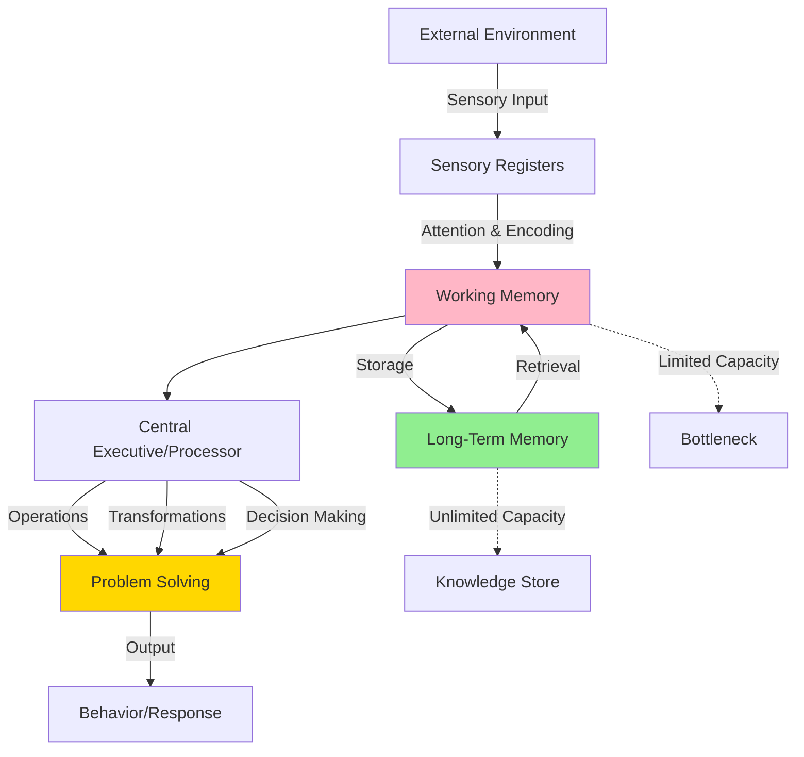
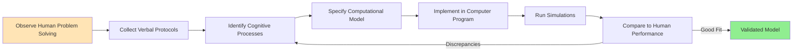
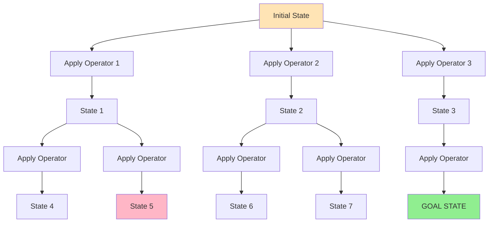
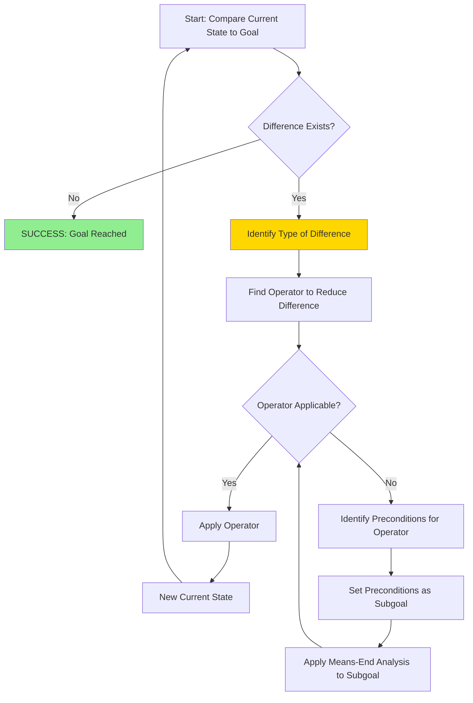
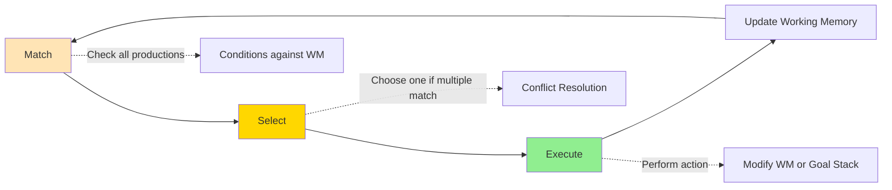
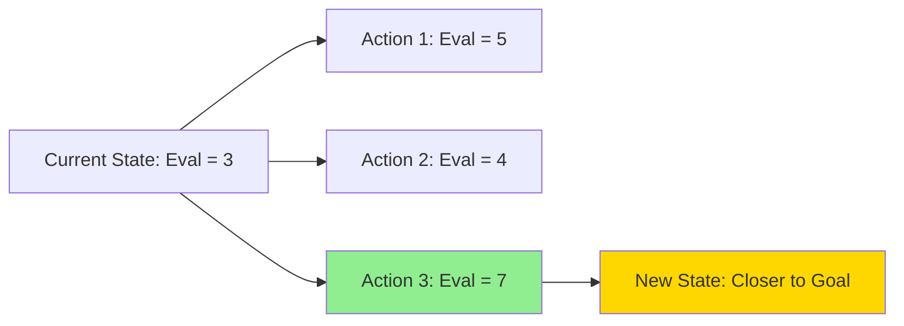

# Information Processing and the General Problem Solver

## Introduction

The **information processing approach** revolutionized cognitive psychology by conceptualizing the human mind as an **information-processing system** analogous to a computer. Emerging in the 1950s-1960s, this perspective bridged behaviorism and cognitive science, offering precise, testable models of mental processes.

At the heart of this revolution was the **General Problem Solver (GPS)**, developed by **Allen Newell**, **Herbert Simon**, and **Clifford Shaw** in 1957. GPS represented the first comprehensive computational model of human problem solving, introducing concepts that remain foundational to cognitive science today: **problem spaces**, **heuristic search**, **means-end analysis**, and **production systems**.

:::tip Key Innovation
Information processing treats problem solving as **symbolic computation**: the manipulation of mental representations through rule-based operations, constrained by the architecture of human cognition.
:::

---

## The Information Processing Framework

### Core Assumptions

The information processing view conceptualizes cognition through several key assumptions:



### 1. **Information Flow Model**

Problem solving involves a sequence of stages:

**Input → Processing → Output**

| Stage | Function | Characteristics |
|-------|----------|-----------------|
| **Sensory Registers** | Brief storage of sensory input | Large capacity, very brief duration (&lt;1 sec) |
| **Working Memory** | Active processing and manipulation | Limited capacity (7±2 items), temporary storage |
| **Long-Term Memory** | Permanent knowledge storage | Unlimited capacity, relatively slow retrieval |
| **Central Processor** | Executes operations, makes decisions | Serial processing, one operation at a time |

### 2. **Mental Representations**

Information is represented **symbolically** in the mind:
- **Declarative knowledge**: Facts and concepts (semantic networks, schemas)
- **Procedural knowledge**: How to do things (production rules, procedures)
- **Problem states**: Configurations of problem information
- **Goals**: Desired end states

### 3. **Mental Operations**

**Cognitive operations** transform representations:
- **Encoding**: Converting external information to internal format
- **Storage**: Placing information in memory
- **Retrieval**: Accessing stored information
- **Comparison**: Evaluating similarities/differences
- **Transformation**: Modifying representations
- **Execution**: Implementing actions

:::info Cognitive Architecture
The information processing approach specifies a **cognitive architecture**—the fixed structural constraints within which all cognition occurs. Key constraints include:
- **Working memory capacity** limitations (typically 7±2 chunks)
- **Serial processing** (one operation at a time)
- **Variable retrieval times** from long-term memory
- **Decay** and **interference** in working memory
:::

---

## Computer Simulation Method

### Rationale and Approach

**Why simulate on computers?**

1. **Precision**: Forces explicit specification of all assumptions
2. **Testability**: Computer models make precise, verifiable predictions
3. **Complexity**: Can model intricate processes beyond verbal theory
4. **Discovery**: Running simulations reveals unexpected implications

### Methodology



**Protocol Analysis**: 
- Participants "think aloud" while solving problems
- Verbalizations recorded and transcribed
- Protocols analyzed for strategies, heuristics, knowledge accessed
- Models built to reproduce observed behavior

### Early Success: Logic Theorist (1956)

Before GPS, Newell and Simon created **Logic Theorist**:
- First program to prove mathematical theorems
- Successfully proved 38 of first 52 theorems in Whitehead & Russell's *Principia Mathematica*
- One proof was more elegant than the original
- Demonstrated AI could perform intellectual tasks

---

## The General Problem Solver (GPS)

### Historical Significance

**GPS (1957-1972)** was groundbreaking because it:
- Was **domain-general**: Could solve various problem types
- Used **weak methods**: General heuristics, not domain-specific knowledge
- Modeled **human cognition**: Based on protocol analysis
- Introduced **key concepts**: Problem spaces, means-end analysis, production systems

:::note Nobel Prize
Herbert Simon won the **1978 Nobel Prize in Economics** partly for work on bounded rationality and satisficing, concepts developed through GPS research.
:::

### GPS Architecture

GPS was designed with **four key components** that mirror human cognitive limitations:

#### 1. **Limited Capacity Working Memory**
- **Function**: Temporary storage and active processing
- **Characteristics**: 
  - Small capacity (analogous to 7±2 chunks)
  - Fast storage and retrieval
  - Information lost if not maintained
- **Human parallel**: Conscious awareness, immediate memory

#### 2. **Large Capacity Long-Term Memory**
- **Function**: Permanent knowledge storage
- **Characteristics**:
  - Essentially unlimited capacity
  - Slower storage and retrieval than working memory
  - Contains declarative and procedural knowledge
- **Human parallel**: All learned information, skills, experiences

#### 3. **Serial Processor**
- **Function**: Executes cognitive operations
- **Characteristics**:
  - Performs **one operation at a time** (serial, not parallel)
  - Relatively slow compared to modern computers
  - Must wait for each operation to complete
- **Human parallel**: Conscious, deliberate thinking

#### 4. **Heuristic Methods (Not Algorithms)**
- **Function**: Guide search through problem space
- **Characteristics**:
  - **Heuristics**: Rules of thumb that usually work but aren't guaranteed
  - **Algorithms**: Guaranteed solutions but computationally expensive
  - GPS uses heuristics to avoid exhaustive search
- **Human parallel**: Shortcuts, intuitions, strategies

### Why Heuristics?

**Computational Explosion Problem:**

Consider the game of chess:
- Average 35 legal moves per position
- Looking ahead 10 moves: 35^10 ≈ 2.8 × 10^15 positions
- Impossible to evaluate exhaustively in reasonable time

**Solution**: Use heuristics to evaluate most promising moves, ignoring obviously poor options.

---

## Problem Spaces: The Conceptual Foundation

### Definition

A **problem space** consists of:
1. **States**: All possible configurations of problem information
2. **Operators**: Permissible actions that transform one state into another
3. **Initial state**: Starting configuration
4. **Goal state**: Desired end configuration

### Visual Representation



**State-Action Tree**: Shows all possible paths from initial to goal state.

### Example: Tower of Hanoi

**Problem**: Move all disks from peg A to peg C, following rules:
- Only one disk moved at a time
- Larger disk never on top of smaller disk

**Problem Space Components:**

| Component | Tower of Hanoi Example |
|-----------|------------------------|
| **States** | All legal disk configurations (3 pegs, N disks) |
| **Operators** | Move top disk from peg X to peg Y (if legal) |
| **Initial State** | All disks on peg A (largest to smallest) |
| **Goal State** | All disks on peg C (largest to smallest) |

**Size of Problem Space** (3 disks):
- 27 possible states
- Most states reachable via multiple paths
- Optimal solution: 7 moves (2^n - 1 moves for n disks)

:::tip Key Insight
**Problem solving = Search through problem space** for a path from initial to goal state. The challenge is finding that path efficiently without exhaustive search.
:::

---

## Means-End Analysis: GPS's Main Heuristic

### The Strategy

**Means-end analysis** is a goal-directed heuristic that works by:
1. **Identifying the difference** between current state and goal state
2. **Finding an operator** that reduces that difference
3. **Applying that operator** (if possible)
4. **If blocked**, set up **subgoals** to enable the operator
5. **Recursively apply** means-end analysis to subgoals

### Algorithm Steps



### Geometric Problem Example

**Problem**: Given rectangle ABCD, prove that sides AD and BC have equal length.

**GPS Approach Using Means-End Analysis:**

**Step 1**: Compare current knowledge to goal
- **Current state**: Know ABCD is a rectangle
- **Goal state**: Want to prove AD = BC
- **Difference**: Need equality of opposite sides

**Step 2**: Find operator to reduce difference
- **Operator**: If two triangles are congruent, corresponding sides are equal
- **Problem**: Don't yet know triangles are congruent (precondition not met)

**Step 3**: Set up subgoal
- **Subgoal 1**: Prove triangles ACD and BDC are congruent
- **Recursively apply** means-end analysis to subgoal

**Step 4**: Address subgoal
- **Operator**: Prove congruence using Side-Angle-Side (SAS) theorem
- **Problem**: Need to establish equal sides and angle

**Step 5**: Set up sub-subgoals
- **Subgoal 2a**: Prove AC = BD (diagonals equal in rectangle)
- **Subgoal 2b**: Prove DC = DC (reflexive property)
- **Subgoal 2c**: Prove angle ACD = angle BDC

**Step 6**: Solve sub-subgoals using known properties of rectangles

**Step 7**: Work back up through subgoal hierarchy to original goal

:::info Goal Stack
GPS maintains a **goal stack**: a last-in-first-out (LIFO) structure of goals and subgoals. It always works on the most recent subgoal (top of stack), popping it when solved and returning to parent goal.
:::

### Advantages of Means-End Analysis

1. **Goal-directed**: Focuses on reducing distance to goal
2. **Handles complexity**: Breaks hard problems into manageable subgoals
3. **General applicability**: Works across diverse problem types
4. **Psychologically plausible**: Matches human verbal protocols
5. **Computationally feasible**: Avoids combinatorial explosion

### Limitations

1. **Can get stuck**: If goal states are misleading (e.g., moving away to go around obstacle)
2. **Requires good difference metrics**: Must accurately assess progress toward goal
3. **Not always optimal**: May find suboptimal solutions
4. **Knowledge-lean**: Ignores domain-specific knowledge that could help

---

## Production Systems

### What Are Productions?

GPS was implemented as a **production system**: a set of **IF-THEN rules** (productions):

**Format**: 
```
IF (condition) THEN (action)
```

**Example Productions for GPS:**

| Production | Condition | Action |
|------------|-----------|--------|
| **P1** | IF goal is to reduce difference D between current and goal states | THEN search for operator that reduces D |
| **P2** | IF operator O reduces difference and preconditions of O are satisfied | THEN apply O |
| **P3** | IF operator O reduces difference but preconditions not satisfied | THEN set up subgoal to satisfy preconditions |
| **P4** | IF subgoal achieved | THEN pop goal stack and return to parent goal |

### Production System Cycle



**Production System Advantages:**
- **Modularity**: Individual productions are independent
- **Flexibility**: Easy to add, remove, or modify rules
- **Psychological plausibility**: Resembles human skill learning
- **Parallelism**: Multiple productions can match (though one selected)

---

## Wickelgren's General Problem Solving Strategies

### Seven Core Strategies

**Wayne Wickelgren** (1974) extended GPS ideas by identifying **seven general problem-solving techniques** for efficiently searching state-action trees:

#### 1. **Inference**
- **Definition**: Deducing new information from givens, goals, and operations
- **Application**: Logical reasoning, mathematical proof
- **Example**: From "All birds have wings" and "Sparrows are birds," infer "Sparrows have wings"

#### 2. **Classification of Action Sequences**
- **Definition**: Grouping equivalent action sequences into **equivalence classes**
- **Reduces search**: Treat equivalent paths as identical
- **Example**: In Tower of Hanoi, certain move sequences produce same result

#### 3. **State Evaluation and Hill Climbing**
- **Definition**: Define evaluation function; choose actions moving "uphill" toward goal
- **Hill climbing**: Always select action with best evaluation
- **Limitation**: Can get stuck at local maxima (not global optimum)



#### 4. **Subgoals**
- **Definition**: Breaking main goal into intermediate subgoals
- **Advantages**: Reduces complexity, provides milestones, enables planning
- **Example**: To write a paper, subgoals might be: outline, draft sections, revise, edit

#### 5. **Contradiction**
- **Definition**: Deriving inferences inconsistent with goal; eliminates impossible paths
- **Application**: Proof by contradiction, constraint satisfaction
- **Example**: In Sudoku, if placing "5" leads to duplicate in row, that placement is impossible

#### 6. **Working Backward**
- **Definition**: Starting from goal state, work toward initial state
- **When useful**: When goal more constrained than start, or branching factor lower
- **Example**: Proving mathematical theorems by assuming conclusion and deriving known facts

#### 7. **Finding Relations Between Problems**
- **Definition**: Connecting new problem to previously solved problems
- **Application**: Analogical reasoning, transfer of learning
- **Example**: Recognizing new problem has same structure as familiar one

:::tip Integration with GPS
Wickelgren's strategies **complement means-end analysis**, providing a richer toolkit for problem solving. Modern cognitive architectures incorporate many of these strategies.
:::

---

## Contemporary Significance

### Enduring Contributions

**GPS introduced concepts that remain central today:**

1. **Problem space hypothesis**: Problems as search through state space
2. **Heuristic search**: Efficient navigation without exhaustive search
3. **Means-end analysis**: Goal decomposition strategy
4. **Production systems**: Formal model of procedural knowledge
5. **Computer simulation**: Methodology for testing cognitive theories
6. **Bounded rationality**: Recognition of computational constraints

### Limitations Identified

**Why GPS wasn't the final answer:**

1. **Domain knowledge matters**: Expert problem solving relies heavily on specific knowledge
2. **Weak methods insufficient**: General heuristics can't match expert performance
3. **Knowledge representation**: How knowledge is structured matters enormously
4. **Pattern recognition**: Humans use perceptual chunking extensively
5. **Learning**: GPS didn't learn from experience
6. **Creativity**: Couldn't handle true insight or creative restructuring

### Evolution Beyond GPS

**Subsequent developments:**

| System/Approach | Innovation | Year |
|----------------|------------|------|
| **STRIPS** | Planning in robotics | 1971 |
| **ACT** (later ACT-R) | Learning productions through practice | 1976-present |
| **SOAR** | Unified cognitive architecture | 1983-present |
| **Expert systems** | Domain-specific knowledge bases | 1970s-1980s |
| **Machine learning** | Data-driven rather than rule-based | 1990s-present |

---

## Real-World Applications

### 1. **Artificial Intelligence**

**GPS pioneered AI problem solving:**
- **Automated planning**: Robot action planning
- **Game playing**: Chess programs, Go AI
- **Theorem proving**: Mathematical reasoning systems
- **Natural language processing**: Parse tree generation

### 2. **Cognitive Science**

**Influenced understanding of human cognition:**
- **Cognitive architecture** models (ACT-R, SOAR)
- **Working memory** research
- **Problem-solving expertise** studies
- **Skill acquisition** theories

### 3. **Education**

**Informed instructional design:**
- **Cognitive task analysis**: Breaking down complex skills
- **Intelligent tutoring systems**: Adaptive instruction
- **Worked examples**: Showing solution paths explicitly
- **Problem-based learning**: Structured problem decomposition

### 4. **Human-Computer Interaction**

**Design implications:**
- **User interface design**: Match cognitive capabilities
- **Error prevention**: Account for working memory limits
- **Help systems**: Provide appropriate scaffolding
- **Search interfaces**: Support heuristic exploration

---

## Memory Aid: SHIPS Framework

Remember information processing and GPS with **SHIPS**:

- **S**ymbolic representations and mental operations
- **H**euristics guide search (not exhaustive algorithms)
- **I**nformation flow: sensory → working → long-term memory
- **P**roblem spaces: states, operators, initial, goal
- **S**erial processing with limited working memory

---

## Self-Assessment Questions

1. **Basic Understanding**: Explain the four key components of GPS's cognitive architecture. How does each mirror human cognition?

2. **Problem Space Analysis**: For a problem of your choice, identify: (a) the initial state, (b) the goal state, (c) possible operators, and (d) constraints. Draw a partial state-action tree.

3. **Means-End Analysis Application**: Use means-end analysis to solve the following: You need to write a 10-page research paper due in two weeks, but you haven't chosen a topic yet. Show your subgoal hierarchy.

4. **Critical Evaluation**: What types of problems is GPS/means-end analysis well-suited for? What types would it struggle with? Explain why.

5. **Heuristics vs. Algorithms**: Why did GPS use heuristics rather than algorithms? Give an example where an algorithm would be preferred and where a heuristic would be necessary.

6. **Wickelgren's Strategies**: Select three of Wickelgren's seven strategies and explain with original examples how each reduces the search through a problem space.

7. **Historical Impact**: How did GPS influence the development of modern cognitive science and artificial intelligence? Name at least three specific contributions.

8. **Production Systems**: Write three productions (IF-THEN rules) that could be part of a GPS system for solving algebra equations.

---

## External Resources

### Research Articles
- **Newell, A., & Simon, H. A. (1972).** *Human Problem Solving*. Englewood Cliffs, NJ: Prentice-Hall. [Comprehensive GPS theory]
- **Newell, A., Shaw, J. C., & Simon, H. A. (1958).** "Elements of a theory of human problem solving." *Psychological Review*, 65(3), 151-166. [Original GPS paper]
- **Wickelgren, W. A. (1974).** *How to Solve Problems*. San Francisco: W. H. Freeman. [Practical problem-solving strategies]
- **Laird, J. E., Newell, A., & Rosenbloom, P. S. (1987).** "SOAR: An architecture for general intelligence." *Artificial Intelligence*, 33(1), 1-64. [GPS successor]

### Educational Videos
- [Newell and Simon's General Problem Solver](https://www.youtube.com/watch?v=n7EHLJm53_c) - AI History
- [Means-End Analysis Explained](https://www.youtube.com/watch?v=w4JEH4H_CbE) - Problem-Solving Strategies
- [Information Processing Theory](https://www.youtube.com/watch?v=fZSafWKFQQs) - Cognitive Psychology

### Wikipedia References
- [General Problem Solver](https://en.wikipedia.org/wiki/General_Problem_Solver)
- [Means–end analysis](https://en.wikipedia.org/wiki/Means%E2%80%93end_analysis)
- [Allen Newell](https://en.wikipedia.org/wiki/Allen_Newell)
- [Herbert A. Simon](https://en.wikipedia.org/wiki/Herbert_A._Simon)
- [Production system (computer science)](https://en.wikipedia.org/wiki/Production_system_(computer_science))

---

**Source PDFs**: 
- 📄 [Block-4/Unit-3.pdf - Pages 31-35](/pdfs/MPC-001%20Cognitive%20Psychology,%20Learning%20and%20Memory/Block-4/Unit-3.pdf)
- 📚 MPC-001 Cognitive Psychology, Learning and Memory
