# Newell's Approach and the Problem Space Hypothesis

## Introduction

**Allen Newell** (1927-1992) was one of the most influential figures in cognitive science and artificial intelligence. His work, often in collaboration with **Herbert Simon**, fundamentally shaped how we understand human cognition as **computational processes** operating within **constrained architectures**.

At the heart of Newell's theoretical contribution is the **Problem Space Hypothesis**—a comprehensive framework proposing that **all goal-directed human behavior can be understood as search through problem spaces**. This hypothesis provides a unifying conceptual framework for understanding problem solving across diverse domains and complexity levels.

:::tip Central Thesis
Newell's Problem Space Hypothesis: Human problem solving can be usefully viewed as heuristic search through a problem space, constrained by the architecture of the cognitive system.
:::

---

## The Problem Space Hypothesis: Core Concepts

### Fundamental Proposition

The Problem Space Hypothesis states that:

> **"A problem solver is faced with a problem space consisting of a set of states, some initial states and desired goal states. The problem solver has a set of operators that transform one state into another. Problem solving consists of searching through this space to find a sequence of operators that transform the initial state into a goal state."**

### The Maze Analogy

Newell used the **maze** as a powerful analogy for problem spaces:


**Key Features of the Maze Analogy:**

| Maze Element | Problem Space Equivalent | Cognitive Parallel |
|--------------|-------------------------|-------------------|
| **Starting point** | Initial state | Current knowledge/situation |
| **Center/goal** | Goal state | Desired outcome |
| **Junctions** | Choice points | Decision nodes |
| **Paths** | Operators/actions | Mental or physical operations |
| **Dead ends** | Unsuccessful states | Incorrect approaches |
| **Multiple routes** | Alternative solution paths | Different strategies |

### Strategies for Navigating Problem Spaces

Just as different strategies exist for maze navigation, different **search strategies** apply to problem spaces:

#### **Systematic Search Strategies:**

1. **Depth-First Search**
   - Follow one path until reaching goal or dead end
   - Backtrack to last junction and try alternative
   - **Advantage**: Memory efficient
   - **Disadvantage**: May pursue very long unsuccessful paths

2. **Breadth-First Search**
   - Explore all paths from each junction level by level
   - **Advantage**: Guaranteed to find shortest path
   - **Disadvantage**: Memory intensive

3. **Best-First Search**
   - Evaluate promising paths; pursue most likely first
   - **Advantage**: Often finds solution quickly
   - **Disadvantage**: Requires good evaluation function

:::info Human Search Behavior
Humans typically use **heuristic search** strategies that are neither purely systematic nor purely random. We use:
- **Hill climbing**: Move toward apparent progress
- **Means-end analysis**: Reduce difference to goal
- **Satisficing**: Accept "good enough" solutions
- **Pattern recognition**: Use familiar solution patterns
:::

---

## The Objective Structure of Problems

### States, Operators, and Constraints

According to Newell, every problem has an **objective structure** consisting of:

#### 1. **Set of States**
- **Definition**: All possible configurations of problem information
- **Size**: Can range from dozens to infinite states
- **Structure**: Often organized hierarchically or in networks

**Example: 8-Puzzle**
```
Initial State:     Goal State:
1 2 3             1 2 3
4 5 6             4 5 6
  7 8             7 8
```
**Total possible states**: 9!/2 = 181,440 (accounting for parity)

#### 2. **Initial State(s)**
- **Definition**: Starting configuration(s) of the problem
- **Uniqueness**: May be single state or set of acceptable starting states
- **Given**: Typically explicitly provided in problem statement

#### 3. **Goal State(s)**
- **Definition**: Desired end configuration(s)
- **Specification**: May be precisely defined or characterized by properties
- **Multiple goals**: Some problems have several acceptable solutions

#### 4. **Operators**
- **Definition**: Legal actions that transform one state into another
- **Applicability**: Each operator has preconditions for application
- **Effects**: Specify how state changes when operator applied

**Operator Example (Tower of Hanoi):**
```
Operator: MOVE(disk, from-peg, to-peg)
Preconditions:
  - disk is top disk on from-peg
  - to-peg is empty OR top disk on to-peg is larger than disk
Effects:
  - disk removed from from-peg
  - disk placed on to-peg
```

#### 5. **Path Constraints**
- **Definition**: Restrictions on sequences of operators
- **Types**: 
  - Can't repeat states (in some problems)
  - Must use minimum number of moves
  - Resource limitations (time, materials)

### Problem Space Size

The **size of a problem space** dramatically affects solvability:


**Examples by Size:**

| Problem | States | Search Strategy |
|---------|--------|----------------|
| Tic-Tac-Toe | 5,478 | Exhaustive possible |
| Rubik's Cube | 4.3 × 10^19 | Sophisticated heuristics |
| Chess | ~10^43 | Pruning + evaluation |
| Theorem proving | Infinite | Guided search |

---

## Knowledge States vs. Problem States

### Subjective Problem Space

Newell distinguished between:

**Objective Problem Space**: The actual structure of the problem (all legal states and operators)

**Subjective Problem Space**: The problem solver's **mental representation** or **knowledge** of the problem


### Knowledge States

**Knowledge states** represent what the problem solver **knows** at any point:

**Components:**
1. **Known facts**: Information established about the problem
2. **Generated hypotheses**: Possible approaches or solutions
3. **Evaluated options**: Actions considered and their assessments
4. **Recognized patterns**: Familiar configurations or situations
5. **Recalled relevant knowledge**: Retrieved from long-term memory

**Example: Medical Diagnosis**

| Time | Knowledge State |
|------|----------------|
| **T1** | Patient presents with fever and cough |
| **T2** | Lab results show elevated white blood cell count |
| **T3** | Chest X-ray reveals pneumonia |
| **T4** | Bacterial culture identifies specific pathogen |
| **T5** | Diagnosis confirmed; treatment plan determined |

Each state represents an increment in knowledge leading toward the goal (accurate diagnosis).

---

## The Role of Operators and Mental Operations

### Mental Operators

In problem solving, **operators** are not just physical actions but **mental operations**:

**Types of Mental Operators:**

1. **Encoding Operations**
   - Read problem statement
   - Interpret visual/verbal information
   - Create initial problem representation

2. **Retrieval Operations**
   - Access relevant knowledge from long-term memory
   - Recall similar problems
   - Retrieve applicable procedures

3. **Transformation Operations**
   - Apply rules or formulas
   - Make inferences
   - Generate new states

4. **Evaluation Operations**
   - Assess progress toward goal
   - Compare alternatives
   - Detect errors or inconsistencies

5. **Planning Operations**
   - Set subgoals
   - Sequence actions
   - Consider future consequences

### Operator Restrictions

**Preconditions** limit when operators can be applied:

```mermaid
graph TD
    A[Operator: Divide by X] --> B{Is X ≠ 0?}
    B -->|Yes| C[Operator Applicable]
    B -->|No| D[Operator Blocked]
    
    E[Operator: Apply Theorem] --> F{Is Theorem's Condition Met?}
    F -->|Yes| G[Operator Applicable]
    F -->|No| H[Must Establish Precondition First]
    
    H --> I[Create Subgoal]
    
    style C fill:#90EE90
    style G fill:#90EE90
    style D fill:#FFB6C6
```



**Why Restrictions Matter:**
- Prevent illegal moves
- Guide search by ruling out impossible paths
- Create subgoal structure when preconditions not met
- Model real-world constraints

---

## Heuristic Methods and Search Strategies

### The Need for Heuristics

**Combinatorial Explosion**: As problems grow, exhaustive search becomes impractical.

**Example: 15-Puzzle**
- States: 16!/2 ≈ 10^13
- Average solution: ~50 moves
- Branching factor: ~3 moves per state
- Paths to check: 3^50 ≈ 7 × 10^23

**Solution**: Use **heuristics** to focus search on promising paths.

### Common Heuristic Methods

#### 1. **Hill Climbing**

**Principle**: Always move to the state that looks best (highest evaluation)

**Advantages**:
- Simple to implement
- Memory efficient
- Often finds solutions quickly

**Limitations**:
- Can get stuck at local optima
- No backtracking
- Requires good evaluation function

**Example**: Gradient descent in optimization

#### 2. **Means-End Analysis** (covered in GPS section)

**Principle**: Reduce differences between current and goal states

**Key features**:
- Goal decomposition
- Subgoal creation
- Recursive application

#### 3. **Progressive Deepening**

**Principle**: Iteratively deepen search depth until solution found

**Process**:
1. Search depth 1 (immediate next states)
2. If no solution, search depth 2
3. Continue deepening until solution found

**Advantage**: Combines benefits of depth-first and breadth-first

#### 4. **Best-First Search with Evaluation Function**

**Principle**: Maintain priority queue of states; always expand most promising

**Evaluation Function**:
```
f(state) = g(state) + h(state)
where:
g(state) = cost so far to reach state
h(state) = estimated cost to goal (heuristic)
```

**Famous Example**: **A* algorithm** (used in GPS navigation, game AI)

:::tip Heuristic Quality
Good heuristics should be:
- **Admissible**: Never overestimate cost to goal
- **Consistent**: Estimates never increase along path
- **Informative**: Discriminate between good and poor states
- **Efficient**: Quick to compute
:::

---

## Cognitive System Constraints

### Working Memory Limitations

**Capacity Limits** profoundly affect problem solving:

**Miller's Law (1956)**: Working memory holds **7±2 chunks**

**Implications for Problem Solving:**


**Strategies to Overcome Limitations:**

1. **Chunking**: Group related elements
   - Example: Remember phone number as 555-123-4567 (3 chunks) vs. 10 digits

2. **External Memory**: Write things down
   - Example: Drawing diagrams, taking notes

3. **Automaticity**: Practice until sub-skills require no attention
   - Example: Expert chess players chunk board patterns

4. **Restructuring**: Reorganize information more efficiently
   - Example: Use formulas instead of remembering individual cases

### Processing Speed

**Serial Processing** means:
- One operation at a time
- Each step takes time
- Total time = (number of steps) × (time per step)

**Expertise Effect**: 
- Experts process faster due to:
  - Pattern recognition (fewer steps needed)
  - Automated sub-skills (faster execution)
  - Better problem representation (more efficient paths)

---

## Summary of the Problem Space Hypothesis

### Five Key Propositions

Newell formalized the Problem Space Hypothesis through **five interconnected propositions**:

#### 1. **Problem Space Existence**
> For any given problem, there exists a large space of alternative paths from initial to goal states, generated by legal operators.

**Implication**: Problem structure is real and analyzable

#### 2. **Problem Solving as Search**
> Human problem solving can be viewed as search through this problem space, moving from initial knowledge states toward goal knowledge states.

**Implication**: Problem solving is systematic exploration, not random

#### 3. **Operators as Mental Actions**
> Mental operators encode legal moves and their preconditions. Operators transform knowledge states.

**Implication**: Cognition involves rule-governed transformations

#### 4. **Heuristic Methods Guide Search**
> People use knowledge and heuristic methods (e.g., means-end analysis) to search selectively rather than exhaustively.

**Implication**: Intelligence involves smart search, not brute force

#### 5. **Cognitive Architecture Constraints**
> All these processes occur within the limits of human cognitive architecture (working memory, processing speed, etc.).

**Implication**: Universal computational constraints shape problem solving

### Graphical Summary


---

## The Knowledge Level

### Newell's Knowledge-Level Theory

Newell later extended his framework by distinguishing **three levels of analysis**:

| Level | Focus | Question Answered |
|-------|-------|------------------|
| **Knowledge Level** | Goals, beliefs, rational action | *What does the agent know?* |
| **Symbol Level** | Representations, processes | *How is knowledge represented and processed?* |
| **Implementation Level** | Neural/hardware substrate | *What is the physical realization?* |

### Knowledge Level Characteristics

At the **knowledge level**:

**Key Principle**: Agent's behavior is rationalized by its **knowledge** and **goals**

**Assumptions**:
1. Agent has **knowledge** about the world
2. Agent has **goals** it wants to achieve
3. Agent acts **rationally** given knowledge and goals
4. Actions are **means to ends** (instrumental)

**Example: Chess Player**
- **Knowledge level**: Understands chess rules, strategies, positions
- **Symbol level**: Mental representations of board, search through move trees
- **Implementation level**: Neural activity in brain regions

:::info Principle of Rationality (Knowledge Level)
*"If an agent has knowledge that one of its actions will lead to one of its goals, then the agent will select that action."*

This is a **specialized principle of rationality** that explains behavior in terms of reasons rather than mechanisms.
:::

---

## Problem Solving as Modeling

### Shift from Search to Model Construction

Newell's later work proposed viewing problem solving as **constructing case-specific models** rather than just search:

### Case Model Definition

A **case model** is a **situation-specific understanding** of a problem instance that:
- Summarizes the problem solver's current understanding
- Integrates domain knowledge with task requirements
- Guides action selection
- Allows recognition that goal is achieved

### Components of Modeling Approach


#### 1. **Domain Model**
**Contains**: Knowledge about the system/domain the problem is about
- Objects and their properties
- Relationships between objects
- Causal connections
- Constraints

**Example (Medical Diagnosis)**:
- Anatomy and physiology
- Disease characteristics
- Drug effects
- Symptom-disease relationships

#### 2. **Task Model**
**Contains**: Specification of what the goal means
- Problem type (diagnosis, design, planning, etc.)
- Success criteria
- Acceptable solution characteristics

**Example**:
- Diagnosis = identifying disease causing symptoms
- Must explain all symptoms
- Preferred: Single disease explanation

#### 3. **Method/Problem-Solving Strategy**
**Contains**: Procedure linking domain and task models
- How to use domain knowledge to achieve task
- Search strategy
- Inference rules

**Example**:
- Heuristic classification: Match symptoms to disease categories
- Causal reasoning: Trace from symptoms to underlying causes
- Hypothesize-and-test: Generate and eliminate hypotheses

### Problem Solving Process

Under the modeling view:

**Goal**: Construct a case model that incorporates:
1. **Case-specific information** (obtained through actions/perception)
2. **Domain model assumptions** (background knowledge)
3. **Task model assumptions** (what constitutes solution)

**Actions serve** to:
- Gather information to instantiate case model
- Test model predictions
- Refine model structure

**Solution occurs** when:
- Case model is complete and consistent
- Model satisfies task requirements
- Problem solver can conclude goal is achieved

:::tip Key Insight
In the modeling view, **actions are not the goal** but rather a **means to construct knowledge**. The goal is building an adequate understanding (model) of the specific situation.
:::

---

## Competence Theory

### Definition

**Competence theory** specifies:
1. **What the system can do** (capabilities)
2. **What counts as rational** behavior (specialized rationality principle)
3. **Why certain actions are taken** (rationalization)

### Example: Heuristic Classification

**Problem-Solving Method**: Heuristic Classification

**Competence Theory**:
- **Assumption**: Solution is in a pre-enumerated set (differential)
- **Capability**: Can match features to categories
- **Rationality**: Gather information to narrow differential
- **Success**: When differential reduced to single element or "good enough" set

**Application**: Medical diagnosis, equipment troubleshooting, classification tasks

**Implication**: System's behavior is rational *given its assumptions* about problem structure

---

## Integration with Earlier Theories

### Relationship to GPS

Newell's broader framework **encompasses GPS** as a specific instance:

| Aspect | GPS | Broader Framework |
|--------|-----|-------------------|
| **Level** | Symbol level | Also includes knowledge level |
| **Focus** | Search mechanisms | Also model construction |
| **Methods** | Means-end analysis | Multiple problem-solving methods |
| **Learning** | None | Incorporated in later systems |
| **Knowledge** | Minimal | Rich domain knowledge |

### Evolution of Ideas


---

## Real-World Applications and Legacy

### Influence on Cognitive Architectures

**SOAR (State, Operator And Result)**:
- Newell's final major project
- Unified cognitive architecture
- Implements problem space hypothesis
- Adds learning mechanisms

**ACT-R**:
- Developed by John Anderson (Newell's student)
- Production system architecture
- Widely used in cognitive modeling

### Applications

1. **Artificial Intelligence**
   - Planning systems
   - Expert systems
   - Game AI
   - Robotics

2. **Cognitive Science**
   - Models of human problem solving
   - Expertise studies
   - Skill acquisition research

3. **Human-Computer Interaction**
   - User interface design
   - Cognitive work analysis
   - Task modeling

4. **Education**
   - Intelligent tutoring systems
   - Cognitive task analysis
   - Instructional design

---

## Memory Aid: SOPHS Framework

Remember Newell's approach with **SOPHS**:

- **S**tates: All possible problem configurations
- **O**perators: Legal transformations between states
- **P**roblem space: Structure of states and operators
- **H**euristics: Smart search strategies
- **S**ystem constraints: Cognitive architecture limits

---

## Self-Assessment Questions

1. **Conceptual Understanding**: Explain the Problem Space Hypothesis in your own words. Why was it revolutionary for cognitive science?

2. **Maze Analogy**: How does navigating a maze parallel solving a complex problem? What are the strengths and limitations of this analogy?

3. **Objective vs. Subjective**: Distinguish between objective problem space and subjective (knowledge-based) problem space. Give an example where they might diverge.

4. **Operators and Preconditions**: For a problem of your choice, specify: (a) at least 5 states, (b) 3 operators, (c) preconditions for each operator.

5. **Heuristic Evaluation**: Why are heuristics necessary for problem solving? Under what conditions might systematic exhaustive search be preferred?

6. **Knowledge Level Analysis**: Analyze a real problem-solving scenario at all three levels: knowledge level, symbol level, and implementation level.

7. **Modeling vs. Search**: How does viewing problem solving as "model construction" differ from viewing it as "search"? Which seems more accurate for complex real-world problems?

8. **Cognitive Constraints Impact**: How do working memory limitations and serial processing affect the strategies people use to solve problems?

---

## External Resources

### Research Articles
- **Newell, A., & Simon, H. A. (1976).** "Computer science as empirical inquiry: Symbols and search." *Communications of the ACM*, 19(3), 113-126. [Turing Award lecture]
- **Newell, A. (1980).** "Reasoning, problem solving, and decision processes: The problem space as a fundamental category." In R. Nickerson (Ed.), *Attention and Performance VIII*. [Problem space hypothesis]
- **Newell, A. (1990).** *Unified Theories of Cognition*. Cambridge, MA: Harvard University Press. [Comprehensive framework]
- **Laird, J. E. (2012).** *The Soar Cognitive Architecture*. Cambridge, MA: MIT Press. [SOAR implementation]

### Educational Videos
- [Allen Newell: The Computer and the Mind](https://www.youtube.com/watch?v=K60YjgtvYGk) - Historical interview
- [Problem Space Hypothesis Explained](https://www.youtube.com/watch?v=FlZTpBWfOQ8) - Cognitive Science

### Wikipedia References
- [Allen Newell](https://en.wikipedia.org/wiki/Allen_Newell)
- [Problem space](https://en.wikipedia.org/wiki/Problem_space)
- [Soar (cognitive architecture)](https://en.wikipedia.org/wiki/Soar_(cognitive_architecture))
- [Cognitive architecture](https://en.wikipedia.org/wiki/Cognitive_architecture)

---

**Source PDFs**: 
- 📄 [Block-4/Unit-3.pdf - Pages 35-37](/pdfs/MPC-001%20Cognitive%20Psychology,%20Learning%20and%20Memory/Block-4/Unit-3.pdf)
- 📚 MPC-001 Cognitive Psychology, Learning and Memory
