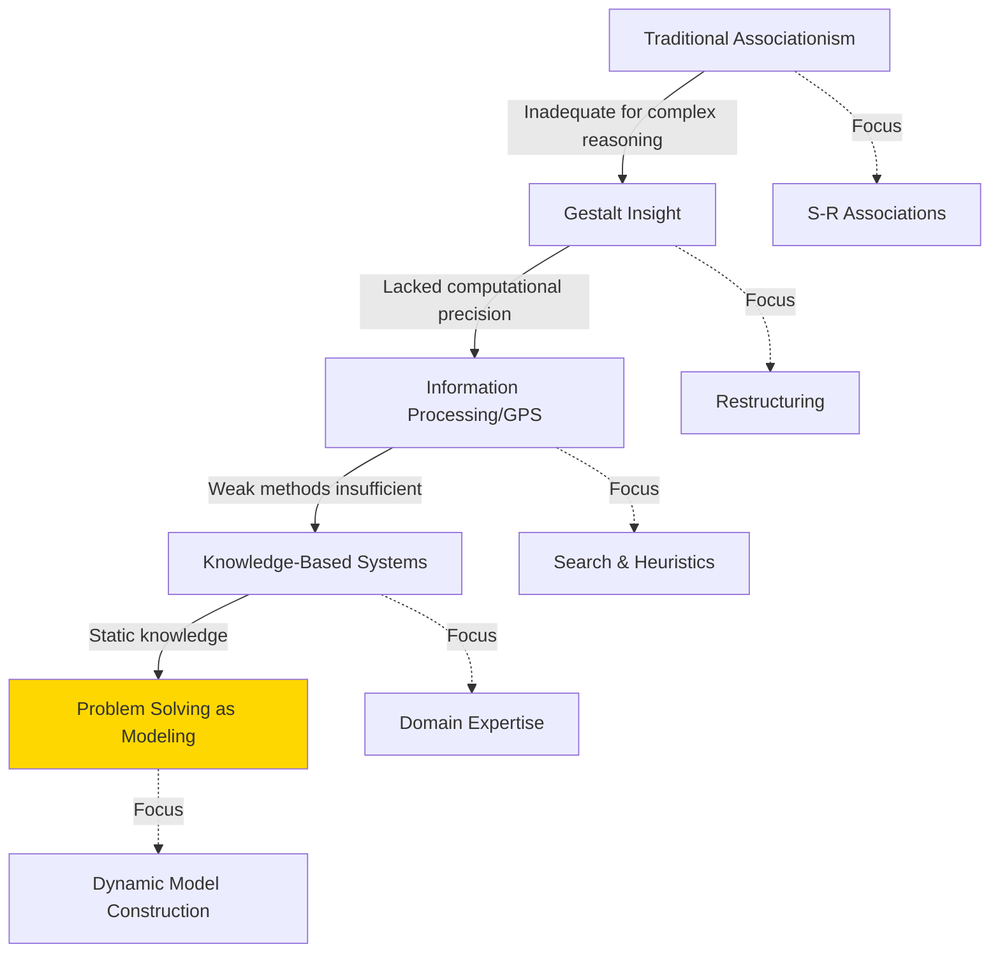
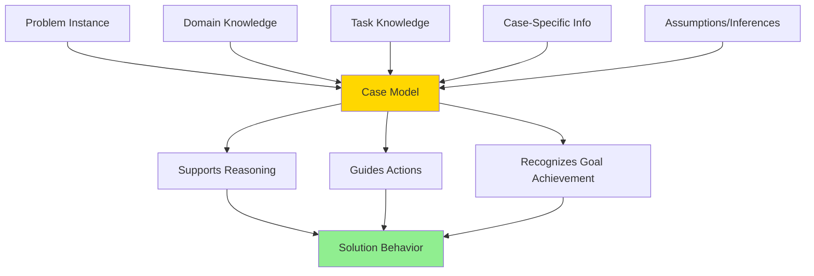
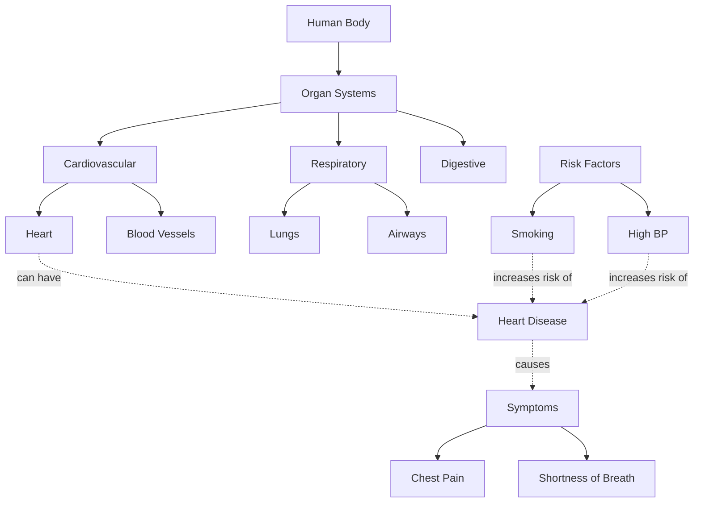
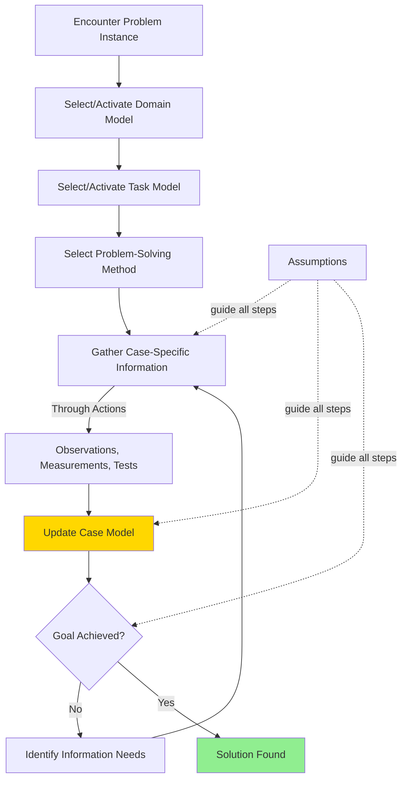
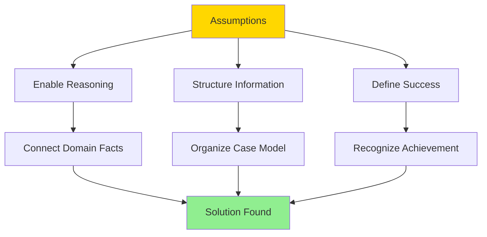
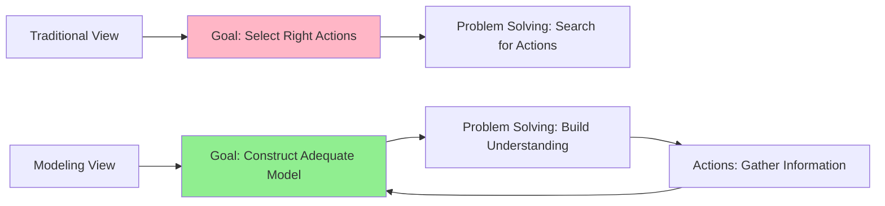
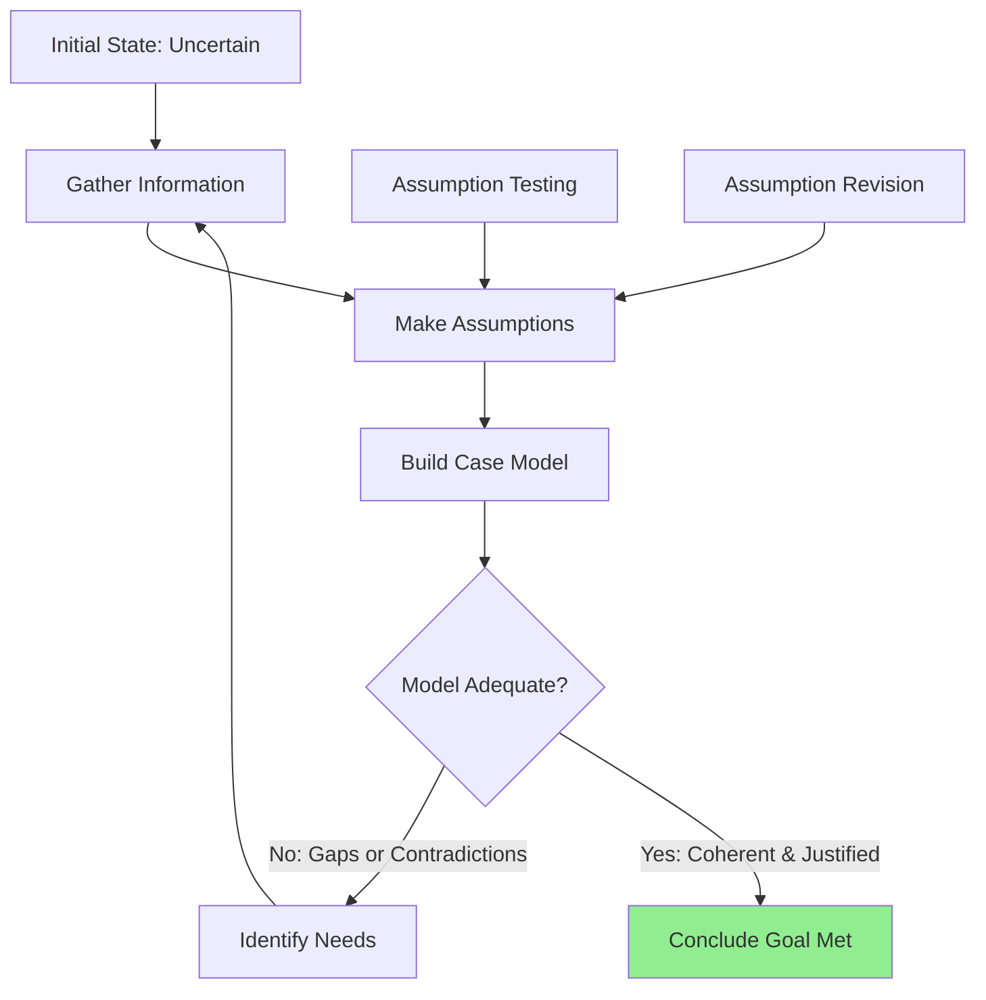

# Problem Solving as Modeling

## Introduction

The **modeling perspective** on problem solving represents a fundamental shift from viewing problem solving as merely **selecting actions** to understanding it as **constructing knowledge structures**. This approach, which emerged from the evolution of Newell's ideas and advancements in knowledge-based systems, proposes that problem solving is fundamentally about **building situation-specific models** that organize and integrate knowledge to achieve goals.

Rather than being an **input-output process** (Traditional) or simply a **means to select actions** (GPS/Newell's early work), problem solving becomes a process of **organizing knowledge through assumption-making** that allows problem solvers to conclude their task is accomplished.

:::tip Core Insight
In the modeling view, problem solving is the **creation of internal representations** (models) that provide coherent understanding of a specific situation, guiding action and recognizing goal achievement.
:::

---

## Theoretical Background

### Evolution of Problem-Solving Theories

The modeling perspective emerged as researchers recognized limitations of earlier approaches:



### Key Theoretical Advances

| Approach | View of Problem Solving | Limitation |
|----------|------------------------|------------|
| **Traditional** | Strengthening correct associations | Can't explain insight, reasoning |
| **Gestalt** | Restructuring perceptual organization | Vague mechanisms |
| **GPS** | Heuristic search through problem space | Weak methods, no learning |
| **Expert Systems** | Applying domain-specific rules | Static knowledge base |
| **Modeling** | Constructing situation-specific understanding | Current frontier |

---

## Core Concepts of the Modeling Perspective

### From Knowledge-Level to Model Construction

At the **knowledge level**, Newell proposed that:
- Agents perceive the world through **knowledge**
- Goals correspond to **desired knowledge states**
- Actions are **means to obtain knowledge**

The modeling perspective extends this by emphasizing that **knowledge must be organized** into coherent structures to support reasoning and goal achievement.

### What Is a Model?

A **model** in this context is:

**Definition**: A structured representation that captures the problem solver's current understanding of a specific problem instance, integrating:
1. **Domain knowledge**: What is known about the problem domain
2. **Task knowledge**: What the goal means and success criteria
3. **Case-specific information**: Particular details of this instance
4. **Assumptions**: Connections and inferences that make reasoning possible



---

## Components of the Modeling Framework

### 1. Domain Models

**Domain models** contain knowledge about the **systems and entities** the problem concerns.

#### Characteristics

**Content**:
- Objects and their properties
- Relationships between objects
- Causal connections
- Constraints and regularities
- Typical behaviors

**Structure**:
- Organized hierarchically or in networks
- May include multiple abstraction levels
- Contains general domain principles

**Example: Medical Diagnosis Domain Model**



**Assumptions in Domain Models**:
- Statements about domain are **connected** (not isolated facts)
- Entities have **typical behaviors** and **exceptions**
- Causal relationships exist and can be reasoned about
- Information can be at different **abstraction levels**

:::info Example Domain Assumptions
In a medical domain model, assuming:
- Symptoms are **caused** by underlying conditions (not random)
- Anatomically connected systems can **influence each other**
- Lab values outside normal ranges **indicate abnormality**
- Treatment effects are **predictable** based on mechanism
:::

### 2. Task Models

**Task models** specify what the **goal** means and how to recognize achievement.

#### Characteristics

**Content**:
- Type of problem (diagnosis, design, planning, etc.)
- What constitutes a solution
- Success criteria and constraints
- Acceptable solution properties

**Structure**:
- Goal specifications
- Success conditions
- Evaluation criteria

**Example: Diagnostic Task Model**

```
Goal: Identify condition causing observed symptoms
Success Criteria:
  - Identified condition explains ALL symptoms
  - Condition is consistent with patient history
  - No contradicting evidence
Constraints:
  - Prefer single-disorder explanation (parsimony)
  - Consider likelihood (base rates)
  - Account for severity (triage)
Solution Form:
  - Primary diagnosis
  - Confidence level
  - Alternative hypotheses (if applicable)
```

**Assumptions in Task Models**:
- Modeling a task makes **more precise** what accomplishing the goal means
- Different task models embody different **assumptions** about solution nature
- Task choice **constrains** possible solution approaches

:::tip Example Task Assumptions
Modeling diagnosis as "**generate-and-test over components**" assumes:
- Fault can be **localized** to component(s)
- Components have **discrete states** (working/broken)
- Faults are **independent** (not emergent from interactions)

Different task model = different assumptions!
:::

### 3. Problem-Solving Methods

**Methods** tie domain and task models together, providing strategies for using domain knowledge to achieve task goals.

#### Characteristics

**Content**:
- Inference strategies
- Search control knowledge
- Heuristics for efficiency
- Procedures for combining information

**Role**:
- **Bridge** between domain and task
- Specify **how** to use domain knowledge for task
- Define **competence** of the system

**Common Problem-Solving Methods**:

| Method | Task Type | Strategy |
|--------|-----------|----------|
| **Heuristic Classification** | Categorization, Diagnosis | Match features to pre-defined categories |
| **Case-Based Reasoning** | Any | Retrieve and adapt similar past cases |
| **Constructive Problem Solving** | Design, Planning | Build solution incrementally |
| **Model-Based Reasoning** | Diagnosis, Prediction | Reason from first principles using causal model |
| **Constraint Satisfaction** | Configuration, Scheduling | Find assignment satisfying all constraints |

#### Example: Heuristic Classification Method

```mermaid
graph LR
    A[Observable Data] -->|Abstraction| B[Abstract Features]
    B -->|Matching| C[Solution Categories]
    C -->|Refinement| D[Specific Solution]
    
    A -.e.g.-> A1[Fever: 102°F]
    B -.e.g.-> B1[High Fever]
    C -.e.g.-> C1[Bacterial Infection]
    D -.e.g.-> D1[Strep Throat]
    
    style B fill:#FFE4B5
    style C fill:#FFD700
    style D fill:#90EE90
```

**Heuristic Classification Assumptions**:
- Solution exists in **pre-enumerated set** (differential)
- Observable features can be **abstracted**
- Abstract features **map to** solution categories
- Categories can be **refined** to specific solutions
- Method defines **competence**: Can classify if solution in differential

---

## The Case Model

### Definition and Purpose

A **case model** is the **instantiation** of the general framework (domain + task + method) for a **specific problem instance**.

**Purpose**:
- Capture current understanding of the specific situation
- Organize case-specific information with domain knowledge
- Support reasoning toward goal
- Recognize when goal is achieved

### Construction Process



### Case Model Form

The **form** of the case model is determined by the **problem-solving method** selected.

**Examples**:

| Method | Case Model Form |
|--------|-----------------|
| **Heuristic Classification** | Differential list with supporting/contradicting evidence |
| **Case-Based Reasoning** | Retrieved similar case + adaptations needed |
| **Hierarchical Planning** | Goal-subgoal tree with action sequences |
| **Constraint Satisfaction** | Variables, domains, constraints, partial assignments |
| **Model-Based Diagnosis** | System model + component states + failure hypotheses |

:::info Key Principle
The **form** of the case model structures what information is relevant, how it's organized, and how reasoning proceeds—fundamentally shaping the problem-solving process.
:::

---

## Competence Theory

### Definition

A **competence theory** explains what the system can conclude and why its behavior is rational.

**Components**:
1. **Capabilities**: What the system can determine/achieve
2. **Assumptions**: What must be true for method to work
3. **Rationality Principle**: Why actions are appropriate given goals
4. **Justification**: Basis for "why" questions about behavior

### Example: Heuristic Classification Competence

**System Using Heuristic Classification for Medical Diagnosis**

**Capabilities**:
- Can classify symptoms into disease categories
- Can handle incomplete or uncertain information
- Can narrow differential based on evidence

**Assumptions**:
- Correct diagnosis is **in the differential** (pre-enumerated)
- Symptoms **correlate reliably** with diseases (though imperfectly)
- More evidence generally improves classification

**Specialized Rationality Principle**:
> "Actions should reduce the size of the differential by gathering information that discriminates between alternatives."

**Justification for Behavior**:
- **Why order test X?** → It discriminates between top 2 hypotheses
- **Why not consider disease Y?** → It's not in differential (outside system's competence)
- **Why ask about symptom Z?** → It's key feature for classification

:::note Limitations of Competence
The competence theory makes explicit what the system **can and cannot** do. A heuristic classifier **cannot** diagnose novel diseases not in its differential—this is a known limitation, not a failure.
:::

### Competence vs. Performance

| Aspect | Competence | Performance |
|--------|------------|-------------|
| **Focus** | What can ideally be achieved | What is actually achieved |
| **Constraints** | Method assumptions | Method + resource constraints |
| **Analysis Level** | Knowledge level | Symbol/implementation level |
| **Errors** | Outside competence = expected limitation | Within competence = system failure |

---

## Assumptions and Their Role

### The Central Role of Assumptions

In the modeling view, **assumptions** are fundamental:

> **"Successful problem solving is a matter of making the right assumptions and exploring their consequences."**

**Types of Assumptions**:

1. **Domain Assumptions**: How the problem domain works
   - "Symptoms have underlying causes"
   - "Similar inputs produce similar outputs"

2. **Task Assumptions**: What solving means
   - "Solution is in pre-enumerated set"
   - "Acceptable solution must satisfy all constraints"

3. **Method Assumptions**: How to solve
   - "Heuristic matches are reliable enough"
   - "Decomposition into subgoals is possible"

4. **Case Assumptions**: About this specific instance
   - "This symptom is reliable (not measurement error)"
   - "This patient is compliant with treatment"



### Making Appropriate Assumptions

**Good assumptions**:
- Are **explicit** (not hidden)
- Are **justified** by domain knowledge or task requirements
- Are **testable** (can be checked if doubted)
- Are **revisable** (can be changed if contradicted)

**Poor assumptions**:
- Are **implicit** (unrecognized)
- Are **unjustified** (arbitrary)
- Are **untestable** (can't be verified)
- Are **rigid** (maintained despite contradiction)

:::warning Common Assumption Errors
- **Assuming comprehensiveness**: "I've considered all possibilities" (may have missed some)
- **Assuming independence**: "These factors don't interact" (may actually interact)
- **Assuming uniformity**: "This always works this way" (may have exceptions)
- **Assuming accuracy**: "This measurement is precise" (may have error)
:::

---

## Actions as Knowledge Acquisition

### Reframing the Role of Actions

Traditional view: **Actions are the goal** of problem solving

Modeling view: **Actions are a resource** for model construction



### Actions in the Modeling Framework

**Purpose of Actions**:
1. **Perception**: Gather case-specific information
2. **Testing**: Check model predictions
3. **Refinement**: Improve model accuracy
4. **Validation**: Confirm model adequacy

**Example: Medical Diagnosis Actions**

| Action | Traditional View | Modeling View |
|--------|-----------------|---------------|
| **Order lab test** | Get information for diagnosis | Instantiate case model parameters |
| **Physical exam** | Look for diagnostic signs | Test model predictions about physical findings |
| **Ask about history** | Gather facts | Understand patient's situation (context) |
| **Trial treatment** | Attempt to cure | Validate diagnostic model (response confirms/disconfirms) |

:::tip Key Insight
Actions are **side effects** in the process of maintaining internal organization (the model). The primary goal is the creation of a suitable case model; interaction with the world is a resource for achieving this.
:::

---

## Successful Problem Solving

### What Constitutes Success?

In the modeling view, successful problem solving means:

> **"Making the right assumptions that allow one to conclude (in effect, only assume) that the task is accomplished."**

**Not**:
- Finding the objectively correct answer (may be unknowable)
- Executing perfect actions (focus is understanding, not action)
- Achieving certainty (satisfactory confidence suffices)

**But Rather**:
- Constructing a model that **coheres** (internally consistent)
- Making assumptions that are **justified** (based on evidence)
- Reaching a state where one can **reasonably conclude** goal is met



### Criteria for Model Adequacy

**A case model is adequate when**:

1. **Completeness**: All relevant aspects of problem are addressed
2. **Consistency**: No internal contradictions
3. **Coherence**: Elements fit together logically
4. **Justification**: Assumptions are warranted
5. **Sufficiency**: Supports goal recognition
6. **Efficiency**: No unnecessary complexity

**Example: Adequate Diagnostic Model**
- Explains **all** observed symptoms (completeness)
- No conflicting evidence (consistency)
- Mechanism is plausible (coherence)
- Hypothesis is supported by tests (justification)
- Diagnosis can be confidently stated (sufficiency)
- Single disease explanation preferred over multiple (efficiency)

---

## Comparison with Earlier Approaches

### Modeling vs. Search

| Dimension | Search View (GPS) | Modeling View |
|-----------|------------------|---------------|
| **Primary metaphor** | Navigating maze | Understanding situation |
| **Goal** | Select actions | Construct knowledge |
| **Problem space** | States and operators | Models and assumptions |
| **Progress** | Moving toward goal state | Increasing model adequacy |
| **Success** | Reaching goal state | Concluding goal is met |
| **Actions** | The point | A means to model building |

### Modeling vs. Input-Output Processing

**KADS-I Approach** (early expert systems):
- Problem solving as **transformation** process
- Input → Processing → Output
- Static knowledge application

**Modeling Approach**:
- Problem solving as **model construction** process
- Iterative building of understanding
- Dynamic knowledge organization

**Advantages of Modeling**:
- Explains **why** certain actions taken
- Accounts for **uncertainty** and **revision**
- Handles **incomplete information** naturally
- Provides **deeper understanding**

---

## Practical Implications

### For System Design

**Knowledge-Based System Design**:

1. **Identify domain** → Build domain model
2. **Clarify task** → Specify task model
3. **Select method** → Choose problem-solving approach
4. **Define competence** → State assumptions and capabilities
5. **Implement model construction** → Enable case model building

**Advantages**:
- Clear separation of knowledge types
- Explicit competence boundaries
- Easier maintenance and extension
- Better explanation capabilities

### For Human Problem Solving

**Implications for Learners**:

1. **Understand domain structure** (not just facts)
2. **Clarify what "solving" means** for task type
3. **Learn appropriate methods** for task-domain combinations
4. **Make assumptions explicit** (don't let them hide)
5. **Build coherent understanding** (not just collect facts)

**Teaching Strategies**:
- Help students **construct models**, not memorize answers
- Make **assumptions explicit** in worked examples
- Show **multiple representations** (multiple models)
- Encourage **explanation** and **justification**
- Teach **model evaluation** and **revision**

### For Expert Performance

**Expertise as Rich Models**:

Experts differ from novices in:
- **Richer domain models** (more connections, deeper understanding)
- **More refined task models** (clearer success criteria)
- **Flexible methods** (adapt approach to situation)
- **Better assumptions** (more accurate, appropriate)
- **Faster model construction** (efficient information gathering)

**Example: Expert Physician**
- Recognizes **patterns** quickly (chunked domain knowledge)
- Knows **when** each test is informative (task understanding)
- Selects **efficient** diagnostic strategy (method expertise)
- Makes **warranted assumptions** about typical vs. unusual cases
- Constructs **adequate model** with minimal information

---

## Future Directions

### Open Questions

1. **How are models actually constructed** in real-time?
2. **What triggers model revision** vs. accommodation of new info?
3. **How do people balance** competing assumptions?
4. **What individual differences** exist in modeling ability?
5. **Can modeling be effectively taught**?

### Research Opportunities

- **Computational modeling**: Implement model construction processes
- **Protocol analysis**: Study how experts build models
- **Educational interventions**: Teach modeling explicitly
- **Individual differences**: Identify effective modeling strategies
- **Development**: How modeling ability develops with age/experience

---

## Memory Aid: MADCAT Framework

Remember problem solving as modeling with **MADCAT**:

- **M**odels: Domain, Task, Case
- **A**ssumptions: Central to reasoning
- **D**ynamic construction: Not static application
- **C**ompetence theory: Defines capabilities
- **A**ctions as information: Not goals themselves
- **T**ask specification: Defines success

---

## Self-Assessment Questions

1. **Conceptual Understanding**: Explain how the modeling view differs from viewing problem solving as search. What are the key conceptual shifts?

2. **Model Components**: For a problem domain of your choice, sketch: (a) a domain model, (b) a task model, and (c) a potential problem-solving method. How do these connect?

3. **Assumptions Analysis**: Identify three assumptions you're making in approaching a current problem. Are they explicit or implicit? Justified or arbitrary? Testable?

4. **Competence Theory**: For a simple problem-solving system (e.g., a thermostat, a GPS navigation system), specify its competence theory: capabilities, assumptions, and rationality principle.

5. **Actions as Information**: Think of a recent problem you solved. How did your actions serve to build your understanding rather than being the goal themselves?

6. **Model Adequacy**: What makes a case model "adequate"? How would you know when to stop gathering information and conclude you've solved a problem?

7. **Comparison**: Compare the modeling view with Gestalt restructuring. Are they compatible? Do they explain different aspects of problem solving?

8. **Application**: How might explicitly teaching students to construct models (rather than just apply procedures) improve learning in a subject you're familiar with?

---

## External Resources

### Research Articles
- **Breuker, J., & Van de Velde, W. (Eds.). (1994).** *CommonKADS Library for Expertise Modelling*. Amsterdam: IOS Press. [Modeling framework]
- **Schreiber, G., et al. (2000).** *Knowledge Engineering and Management: The CommonKADS Methodology*. MIT Press. [Comprehensive methodology]
- **Chandrasekaran, B. (1986).** "Generic tasks in knowledge-based reasoning: High-level building blocks for expert system design." *IEEE Expert*, 1(3), 23-30. [Task-method framework]
- **Clancey, W. J. (1985).** "Heuristic classification." *Artificial Intelligence*, 27(3), 289-350. [Heuristic classification method]

### Educational Videos
- [Knowledge Modeling and Problem Solving](https://www.youtube.com/watch?v=x3pMO8rJqTo) - Expert Systems
- [Model-Based Reasoning](https://www.youtube.com/watch?v=pK8kPXvEkk0) - Cognitive Science Approach

### Wikipedia References
- [Knowledge representation and reasoning](https://en.wikipedia.org/wiki/Knowledge_representation_and_reasoning)
- [Expert system](https://en.wikipedia.org/wiki/Expert_system)
- [Case-based reasoning](https://en.wikipedia.org/wiki/Case-based_reasoning)

---

**Source PDFs**: 
- 📄 [Block-4/Unit-3.pdf - Pages 36-38](/pdfs/MPC-001%20Cognitive%20Psychology,%20Learning%20and%20Memory/Block-4/Unit-3.pdf)
- 📚 MPC-001 Cognitive Psychology, Learning and Memory
