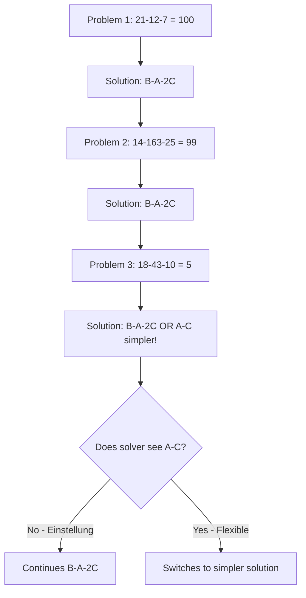

Understanding how past experience can both facilitate and hinder problem solving is crucial for developing flexible cognitive strategies. While experience typically helps us solve problems more efficiently, it can sometimes create rigid mental patterns that prevent us from seeing simpler or more creative solutions. This phenomenon, known as **Einstellung** or mental set, represents one of the most studied impediments to effective problem solving.

## The Nature of Einstellung

**Einstellung** is a German term used by Gestalt psychologists to describe the tendency to set the mind into a routine approach to problem solving. When we repeatedly use the same problem-solving method successfully, our minds become predisposed to apply that method automatically, even when simpler or better alternatives exist.

### Historical Context

The concept emerged from Gestalt psychology's broader investigation into how perception and cognition organize information into meaningful patterns. Just as we perceive visual patterns in predictable ways, we develop cognitive patterns for approaching problems. While these patterns usually serve us well, they can become obstacles when circumstances change.

### Key Characteristics

Einstellung manifests through several observable patterns:

**Automatic Application**: Solutions that worked previously are applied without conscious evaluation of alternatives
**Perceptual Blindness**: Simpler solutions become invisible because attention is focused on the familiar approach
**Resistance to Change**: Even when feedback suggests the current approach isn't optimal, people persist with established methods
**Efficiency Trade-off**: Initial success with a method creates efficiency that actually reduces flexibility

## Luchin's Water Jar Problems

Abraham Luchins (1942) provided one of the most elegant demonstrations of Einstellung effects through his water jar experiments. These problems require measuring specific quantities of water using jars of different capacities with no gradations marked on them.

### The Classic Experiment

Participants receive a series of problems where they must obtain a target amount of water using three jars (A, B, and C) with different capacities. Here's how the problems typically progress:

### The Problems in Detail

Let's examine the classic sequence:

**Problem 1**: Jars holding 21, 127, and 3 cups; goal = 100 cups
- Solution: Fill B (127), pour out A (21), pour out C twice (3+3)
- Formula: B - A - 2C = 127 - 21 - 6 = 100

**Problem 2**: Jars holding 14, 163, and 25 cups; goal = 99 cups
- Solution: 163 - 14 - 50 = 99
- Same formula: B - A - 2C

**Problems 3-5**: Continue reinforcing the B-A-2C pattern

**Problem 6**: Jars holding 23, 49, and 3 cups; goal = 20 cups
- Complex solution: 49 - 23 - 6 = 20 (B-A-2C)
- **Simple solution**: 23 - 3 = 20 (A-C)

### Experimental Findings

Luchins discovered that participants develop a strong set after solving the first few problems:

1. **Automatic Application**: Most participants automatically try B-A-2C without searching for alternatives
2. **Solution Blindness**: They overlook the obvious, simpler solution (A-C) in Problem 6
3. **Persistence**: Even when the complex solution requires significant effort, they don't explore other options
4. **Breaking the Set**: When given a warning to "Don't be blind" or when starting fresh, participants more easily see simpler solutions

**Statistical Results**: In control groups without prior problems, about 95% found simple solutions. After developing Einstellung, only about 20-30% discovered simpler alternatives.

## Theoretical Implications

### Cognitive Mechanisms

Several cognitive processes contribute to Einstellung effects:

**Pattern Recognition**: The brain efficiently identifies familiar patterns and activates associated solutions
**Cognitive Economy**: Once a reliable method is found, the brain conserves resources by not seeking alternatives
**Confirmation Bias**: Success with a method provides evidence that searching for alternatives is unnecessary
**Attentional Narrowing**: Focus on executing the familiar method reduces peripheral awareness of other possibilities

### Neural Correlates

Modern neuroscience research has identified brain regions involved in mental set:

- **Prefrontal Cortex**: Maintains the active problem-solving strategy
- **Anterior Cingulate Cortex**: Signals when current strategies aren't working optimally
- **Default Mode Network**: May be suppressed during rigid application of learned patterns, reducing creative insight

## Einstellung in Representation and Search

Einstellung affects both how we represent problems and how we search for solutions:

### Representation Effects

When a mental set develops, it influences how we initially conceptualize problems:

- **Selective Attention**: We notice features relevant to our established method
- **Schema Activation**: Problems are interpreted through the lens of familiar problem types
- **Constraint Imposition**: We may add unstated constraints based on previous similar problems

### Search Effects

The problem space search process becomes constrained:

- **Reduced Exploration**: Less thorough examination of alternative solution paths
- **Early Termination**: Stopping search once a familiar solution is found
- **Depth over Breadth**: Following known paths deeply rather than exploring broadly

## Mindlessness and Einstellung

Ellen Langer (1989) connected Einstellung to broader patterns of **mindlessness** in human behavior. Mindlessness occurs when we act from a single perspective or rule that has worked in the past, without carefully exploring our environment for alternative courses of action.

### Characteristics of Mindless Behavior

**Context Insensitivity**: Failing to notice when situational changes make established approaches less effective
**Categorical Thinking**: Over-reliance on familiar categories without nuanced distinction
**Rule Following**: Automatic application of rules without questioning their appropriateness
**Limited Information Sampling**: Gathering just enough information to confirm the familiar approach

### Real-World Implications

Mindlessness manifests in various domains:

- **Education**: Teachers using the same methods regardless of student needs
- **Healthcare**: Doctors applying standard protocols without considering individual patient factors
- **Business**: Organizations maintaining outdated practices despite changed markets
- **Personal Relationships**: Responding to partners with habitual patterns regardless of context

## Breaking Mental Sets

### Awareness Strategies

Overcoming Einstellung begins with recognition:

**Metacognitive Monitoring**: Regularly asking "Am I falling into a routine approach?"
**Explicit Search**: Deliberately seeking multiple solutions before committing to one
**Time Allocation**: Spending more time on problem representation before solution implementation
**Fresh Perspectives**: Taking breaks or consulting others when feeling stuck

### Practical Techniques

**Incubation**: Stepping away from a problem allows the mind to disengage from rigid patterns
**Constraint Relaxation**: Questioning assumptions about what's possible or required
**Alternative Representations**: Reframing the problem in different terms (verbal, visual, mathematical)
**Reverse Engineering**: Working backwards from the goal to discover novel paths

## Applications Across Domains

### Education

Teachers can help students avoid Einstellung by:

- Presenting varied problem types that require different approaches
- Encouraging multiple solution methods for the same problem
- Rewarding flexibility and creativity over routine efficiency
- Explicitly discussing when to apply versus when to abandon learned strategies

### Professional Settings

Organizations can combat institutional Einstellung through:

- **Innovation Teams**: Groups specifically tasked with challenging established practices
- **Rotation Programs**: Moving people between roles to prevent rigid specialization
- **Post-Mortems**: Analyzing failures to identify when mental sets contributed
- **Diverse Hiring**: Bringing in people with different backgrounds and perspectives

### Personal Problem Solving

Individuals can develop flexibility by:

- Maintaining awareness of their default problem-solving styles
- Deliberately practicing alternative approaches
- Seeking feedback from people with different perspectives
- Reflecting on times when routine approaches failed

## Contemporary Research

Recent studies have expanded our understanding of Einstellung:

### Neuroscience Investigations

fMRI studies show that breaking mental sets activates:
- Right hemisphere networks associated with insight
- Decreased activation in regions maintaining the current strategy
- Increased connectivity between distant brain regions (suggesting novel associations)

### Individual Differences

Research has identified factors affecting susceptibility to Einstellung:

**Cognitive Flexibility**: People who score high on measures of mental flexibility show less Einstellung
**Working Memory**: Higher capacity may allow maintaining multiple solution strategies
**Personality**: Openness to experience correlates with easier set-breaking
**Expertise Level**: Surprisingly, experts sometimes show stronger Einstellung in their domains

### Modern Applications

Studies examine Einstellung in:
- **Computer Programming**: Code refactoring and algorithm optimization
- **Medical Diagnosis**: Avoiding premature diagnostic closure
- **Business Strategy**: Adapting to disruptive innovations
- **Scientific Research**: Paradigm shifts and theoretical flexibility

## Connections to Other Cognitive Phenomena

### Functional Fixedness

While related, these differ:
- **Einstellung**: Fixedness on a problem-solving *method*
- **Functional Fixedness**: Fixedness on an object's typical *function*
- Both involve inflexibility, but at different levels of cognition

### Confirmation Bias

Mental sets interact with confirmation bias:
- Established methods create expectations
- We selectively attend to information confirming the method works
- Disconfirming information is overlooked or minimized

### Cognitive Load

Mental sets may actually reduce cognitive load:
- Automatic application requires less working memory
- This efficiency becomes costly when flexibility is needed
- Trade-off between efficiency and adaptability

## Practical Examples

### Academic Testing

Students often develop sets for certain problem types:
- Math students applying the most recently learned formula
- Reading comprehension using the same analysis structure
- Science problems approached with memorized procedures

**Impact**: May miss problems requiring different or simpler approaches

### Professional Decision-Making

Managers might habitually:
- Use the same staff meeting format regardless of agenda
- Apply familiar organizational structures to new initiatives
- Interpret financial data through established frameworks

**Risk**: Missing opportunities or threats that don't fit established patterns

### Daily Life

Common Einstellung examples:
- Always taking the same route to work, missing better alternatives
- Approaching household repairs with the same tools and methods
- Using technology features in limited, habitual ways

## 🎯 Self-Assessment Questions

1. **Concept Understanding**: Explain in your own words what Einstellung means. How does it differ from simply using past experience?

2. **Application**: Try the water jar problems yourself. Did you experience Einstellung on Problem 6? What helped you see (or prevented you from seeing) the simpler solution?

3. **Real-World Analysis**: Identify an example from your own life where you experienced Einstellung. What was the routine approach? What simpler or better alternative did you initially miss?

4. **Mechanism Explanation**: Why doesn't the brain naturally search for simpler solutions once one solution is found? What evolutionary or cognitive advantages might Einstellung provide despite its drawbacks?

5. **Breaking Sets**: Design a strategy you could use when approaching a difficult problem to avoid falling into Einstellung. What specific steps would you take?

6. **Domain Transfer**: How might Einstellung affect: (a) a doctor diagnosing patients, (b) a software engineer debugging code, (c) a teacher explaining concepts, and (d) a business developing marketing strategies?

7. **Critical Thinking**: Luchins found that warning people "Don't be blind" helped them avoid Einstellung. Why might this simple warning be effective? What does this suggest about the nature of mental sets?

## 💡 Memory Aids

**MENTAL Acronym for Einstellung Characteristics**:
- **M**ethod becomes automatic
- **E**xperience creates rigidity
- **N**arrowed attention
- **T**rying same approach repeatedly
- **A**lternatives become invisible
- **L**earned patterns override flexibility

**Remember**: "What worked before blinds us to what works better now"

**Visual Metaphor**: Think of Einstellung like wearing grooves into a path. Each successful use makes the groove deeper, making it harder to step out and see the easier route alongside.

---

**Source PDF**: [Block-4/Unit-4.pdf - Pages 41-43](/pdfs/MPC-001%20Cognitive%20Psychology,%20Learning%20and%20Memory/Block-4/Unit-4.pdf)  
**Course**: MPC-001 Cognitive Psychology, Learning and Memory

## 📚 Further Reading

- Luchins, A. S. (1942). Mechanization in problem solving: The effect of Einstellung. *Psychological Monographs, 54*(6), i-95.
- Langer, E. J. (1989). *Mindfulness*. Reading, MA: Addison-Wesley.
- Öllinger, M., Jones, G., & Knoblich, G. (2008). Investigating the effect of mental set on insight problem solving. *Experimental Psychology, 55*(4), 269-282.

## 🔗 Related Topics

- [Functional Fixedness](/mpc-001/block-4/functional-fixedness-problem-representation)
- [Problem Representation](/mpc-001/block-4/traditional-approaches-problem-solving)
- [Gestalt Approaches](/mpc-001/block-4/gestalt-approaches-problem-solving)
- [Cognitive Flexibility](../block-1/cognitive-psychology-introduction)
