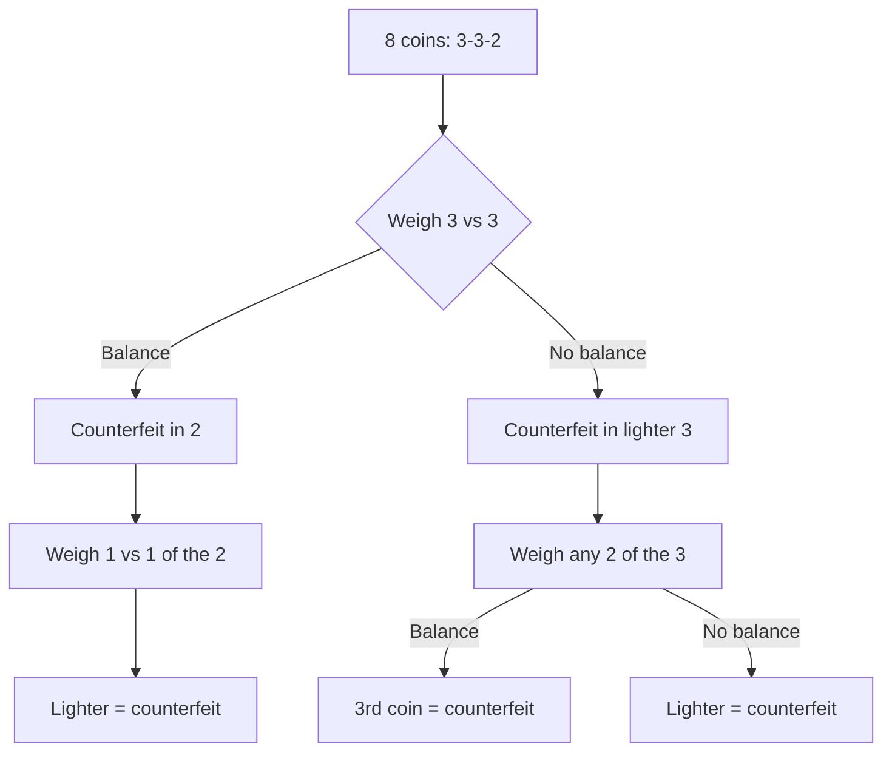

Have you ever struggled to solve a problem because you couldn't see beyond an object's typical use? Perhaps you needed a makeshift hammer but didn't think to use a shoe, or you needed a container but overlooked a coffee mug because you only saw it as something to drink from. This cognitive barrier, where we perceive objects as having only their conventional functions, is called **functional fixedness**, and it represents one of the most pervasive impediments to creative problem solving.

## Understanding Functional Fixedness

**Functional fixedness** is the tendency to see objects as having only a single, typical use based on their prototypical function. Discovered by Karl Duncker in 1935, this phenomenon demonstrates how our categorical knowledge about objects—while generally helpful—can limit our cognitive flexibility when problem-solving requires unconventional thinking.

### The Nature of Functional Thinking

We naturally categorize objects based on their functional features:

- **Functional Definition**: A hammer is "for pounding nails"
- **Category Membership**: Objects belong to categories defined by their primary use
- **Prototype Dominance**: The typical function dominates our conceptualization
- **Activation Patterns**: Thinking of an object automatically activates its standard function

This functional categorization serves us well in everyday life, allowing rapid recognition and appropriate use of objects. However, it becomes an obstacle when novel situations require seeing objects in new ways.

### Historical Context

Duncker's work emerged from the Gestalt psychology tradition, which emphasized:

- **Perceptual Organization**: How we structure and interpret sensory information
- **Insight Problems**: Problems requiring restructuring of the problem representation
- **Mental Restructuring**: The "Aha!" moment when seeing things differently
- **Productive Thinking**: Moving beyond reproductive (routine) thinking to genuinely creative solutions

## Duncker's Candle Problem

Duncker's classic 1945 experiment elegantly demonstrated functional fixedness through what became known as the **Candle Problem** or **Box-Candle Problem**.

### The Problem Setup

Participants entered a room containing a table with these objects:

**Materials Available**:
- Three cardboard boxes filled with:
  - Candles (in one box)
  - Tacks (in another box) 
  - Matches (in the third box)
- Additional materials: ashtray, paper, paper clips, string, pencils, tinfoil

**Task**: Mount the candles at eye level on the wall, ostensibly to prepare the room for a vision experiment.

### The Solution

The correct solution requires:

**Key Steps**:
1. Empty the boxes of their contents
2. Tack the boxes to the wall as platforms
3. Place candles on these platforms
4. Light the candles

### Experimental Results

**Original Condition** (boxes filled with contents):
- Only **43%** of participants solved the problem
- Most participants fixated on the boxes as containers
- Failed to see boxes as potential platforms

**Modified Condition** (boxes empty, contents on table):
- **100%** of participants solved the problem
- Boxes were more easily perceived as construction materials
- Their container function was less salient

### Cognitive Analysis

Why was the problem so much harder with filled boxes?

**Functional Embedding**: When boxes served as containers, this function became deeply embedded in how participants conceptualized them

**Perceptual Salience**: The filled state made the container function highly salient and dominant

**Conceptual Flexibility**: Empty boxes were more conceptually "available" for alternative functions

**Contextual Cueing**: The filled state created a strong context suggesting "these are storage containers"

## The Coin Problem

Another classic demonstration comes from Simmel (1953), known as the **Counterfeit Coin Problem**:

### Problem Statement

You have eight coins and a balance. One coin is counterfeit and lighter than the others. Find the counterfeit coin using the balance only twice.

### The Intuitive (Wrong) Approach

Most people initially think:

**Attempt 1**:
- Divide coins into two groups of four
- Weigh 4 vs. 4
- Lighter group contains counterfeit

**Attempt 2**:
- Take the lighter group of 4
- Weigh 2 vs. 2
- Lighter group contains counterfeit

**Problem**: You now have 2 coins but have used your 2 weighings. Cannot determine which is counterfeit!

### Understanding the Fixedness

**Why does everyone try 4 + 4 first?**

1. **Mathematical Availability**: The fact that 4 + 4 = 8 is highly accessible knowledge
2. **Even Division**: We naturally think of dividing things evenly
3. **Functional Fixedness**: We're "fixed" on the function of division as creating equal groups
4. **Mental Set**: The obvious division pattern captures our thinking

### The Correct Solution

The solution requires seeing the number 8 differently:

**Weighing 1**:
- Divide into groups of 3, 3, and 2
- Weigh 3 vs. 3

**Scenario A** (scales balance):
- Counterfeit must be in group of 2
- Weighing 2: Weigh the 2 coins (1 vs. 1)
- Lighter one is counterfeit

**Scenario B** (scales don't balance):
- Counterfeit is in the lighter group of 3
- Weighing 2: Take any 2 of the 3, weigh them
- If they balance, unweighed coin is counterfeit
- If they don't balance, lighter one is counterfeit

### The Lesson

This problem illustrates how functional fixedness extends beyond physical objects to **conceptual objects** like numbers. We fixate on the typical function of 8 (dividing evenly into 4+4) rather than seeing other organizational possibilities (3+3+2).

## Mechanisms of Functional Fixedness

### Cognitive Processes

Several interconnected processes create functional fixedness:

**Category Activation**:
- Seeing an object activates its category
- Category knowledge includes typical functions
- This activation dominates working memory

**Goal-Function Matching**:
- We search for objects whose typical function matches our goal
- Non-matching functions are inhibited or suppressed
- Alternative uses require overriding this automatic process

**Semantic Memory Structure**:
- Object representations in long-term memory are organized by function
- Retrieval cues naturally access typical functions first
- Alternative functions may be stored but less accessible

**Attentional Focus**:
- Attention drawn to features relevant to typical function
- Features relevant to alternative functions overlooked
- Requires deliberate shift of attention to break fixation

### Neural Correlates

Modern neuroscience reveals brain systems involved:

**Left Hemisphere Dominance**:
- Language and categorical thinking (including functional categories)
- May contribute to rigid functional thinking

**Right Hemisphere Contribution**:
- Associated with novel associations and creative insights
- Increased activity during moments of breaking fixedness

**Prefrontal Cortex**:
- Maintains task goals and object representations
- Must shift representations to overcome fixedness

**Temporal-Parietal Junction**:
- Integrates sensory and conceptual information
- May help reframe object affordances

## Overcoming Functional Fixedness

### Individual Strategies

**Deliberate Abstraction**:
- Ask "What are this object's physical properties?" rather than "What is this object for?"
- Focus on materials, shape, size, weight independent of function

**Feature Listing**:
- Systematically list all features of available objects
- Consider how each feature might be useful
- Separate physical properties from typical uses

**Analogical Thinking**:
- Ask "What else could do what I need?"
- Consider objects with similar physical properties but different functions
- Use analogy to transcend categories

**Environmental Manipulation**:
- Physically interact with objects in new ways
- Change spatial arrangements
- This can trigger new perceptual insights

### Group Approaches

**Diverse Perspectives**:
- People with different backgrounds see different functions
- Engineers vs. artists vs. children perceive objects differently
- Diversity combats collective fixedness

**Brainstorming Rules**:
- Withhold criticism during idea generation
- Encourage wild ideas
- Build on others' unconventional thoughts
- Quantity over quality initially

**Analogical Reasoning**:
- Draw parallels to distant domains
- Ask "How would a different profession approach this?"
- Use metaphorical thinking

## Real-World Implications

### Innovation and Creativity

Functional fixedness affects:

**Product Design**:
- Difficulty imagining new uses for existing materials
- Over-reliance on conventional design patterns
- Missing opportunities for dual-purpose designs

**Scientific Discovery**:
- Laboratory equipment used only in standard ways
- Methodological assumptions limiting approaches
- Paradigm rigidity in theoretical thinking

**Technological Innovation**:
- Seeing computers only as calculation devices (before personal computing)
- Phones only as communication devices (before smartphones)
- Internet only for data transfer (before social media)

### Educational Implications

**Teaching for Flexibility**:
- Encourage multiple uses for classroom objects
- Reward unconventional thinking
- Practice alternative categorization
- Discuss historical examples of overcoming fixedness

**Problem-Based Learning**:
- Present problems requiring non-standard uses
- Reflect on moments of insight
- Analyze what prevented versus enabled flexible thinking

### Professional Problem-Solving

**Engineering**:
- Medical devices repurposed for different applications
- Materials used beyond original specifications
- Tools adapted for novel manufacturing processes

**Medicine**:
- Drugs discovered for one condition treat others (e.g., aspirin, Viagra)
- Medical instruments used in creative ways during emergencies
- Treatment protocols adapted across conditions

**Business**:
- Products finding unexpected markets
- Resources reallocated to new purposes
- Business models adapted across industries

## Relationship to Other Cognitive Phenomena

### Einstellung vs. Functional Fixedness

**Key Differences**:

| Einstellung | Functional Fixedness |
|-------------|---------------------|
| Fixedness on a *method* | Fixedness on an object's *function* |
| Process-level rigidity | Object-level rigidity |
| "I always solve it this way" | "This object is only for X" |
| Mental set about procedures | Mental set about tools |

**Commonalities**:
- Both involve inflexibility
- Both arise from successful past experience
- Both overcome through restructuring
- Both studied by Gestalt psychologists

### Mental Representations

Functional fixedness highlights how **problem representation** affects solution:

**Initial Representation**:
- Objects represented by their prototypical functions
- This representation constrains search space
- Solution requires representation change

**Representation Shift**:
- Successful solvers restructure object representations
- Focus shifts from function to properties
- Enables seeing new affordances

### Affordances

James Gibson's concept of **affordances** relates closely:

**Perceived Affordances**:
- What actions an object invites or enables
- Typically dominated by conventional uses
- Functional fixedness = restricted perception of affordances

**Hidden Affordances**:
- Objects have many potential affordances
- Culture and experience highlight certain ones
- Creativity involves perceiving unused affordances

## Contemporary Research

### Individual Differences

Research identifies factors affecting susceptibility:

**Age Differences**:
- Young children show less functional fixedness (haven't fully learned conventional functions)
- Peaks in middle childhood and adulthood
- May decrease slightly in older adults (less rigid categorization)

**Expertise Effects**:
- Domain experts show strong fixedness within their domain
- Paradox: expertise aids routine problems but hinders creative ones
- Beginners sometimes solve problems experts can't

**Cultural Variations**:
- Western vs. Eastern thinking styles affect fixedness
- Holistic thinking may reduce fixedness
- Cultural tools shape functional categorizations

### Modern Applications

**Design Thinking**:
- Explicitly addresses functional fixedness
- Uses techniques like "defamiliarization"
- Encourages "beginner's mind" approach

**Innovation Training**:
- Corporate programs teach overcoming fixedness
- Use exercises similar to candle problem
- Measure improvement in flexible thinking

**Artificial Intelligence**:
- How to program systems to avoid functional fixedness?
- Machine learning of object categories may create AI fixedness
- Requires building in representational flexibility

## 🎯 Self-Assessment Questions

1. **Concept Application**: Describe functional fixedness in your own words. How does it differ from simply preferring familiar tools?

2. **Problem Analysis**: In the candle problem, why did filling the boxes make such a dramatic difference in solution rates? What does this tell us about how context affects functional perception?

3. **Personal Reflection**: Identify a time when you experienced functional fixedness. What object did you need to use differently? What helped you (or prevented you from) seeing the alternative use?

4. **Mechanism Understanding**: Explain why our brains create functional fixedness. What evolutionary or cognitive advantages might this provide, despite its costs?

5. **Solution Strategies**: You're stranded on a desert island with a suitcase, a plastic bottle, and a mirror. Brainstorm unconventional uses for each. Did you experience difficulty? What strategies helped overcome fixedness?

6. **Comparative Analysis**: How is functional fixedness similar to and different from Einstellung? Provide an example that illustrates each phenomenon clearly.

7. **Real-World Application**: How might functional fixedness affect: (a) a chef developing new recipes, (b) an architect designing a building, (c) a teacher creating learning activities, and (d) an entrepreneur starting a business?

## 💡 Memory Aids

**FIXED Acronym for Functional Fixedness**:
- **F**unction dominates perception
- **I**nflexible object categorization
- **X**-ing out alternative uses
- **E**xperience creates rigidity
- **D**efault uses blind to possibilities

**Remember**: "When all you have is a hammer, everything looks like a nail" (Maslow's Hammer)

**Visual Metaphor**: Think of functional fixedness like wearing blinders—you can only see the narrow path ahead (typical function) but miss the open field of possibilities on either side (alternative uses).

**The Candle Problem Mnemonic**: "BEEP"
- **B**oxes as containers (problem)
- **E**mpty them
- **E**levate on wall
- **P**latforms for candles (solution)

---

**Source PDF**: [Block-4/Unit-4.pdf - Pages 60-63](/pdfs/MPC-001%20Cognitive%20Psychology,%20Learning%20and%20Memory/Block-4/Unit-4.pdf)  
**Course**: MPC-001 Cognitive Psychology, Learning and Memory

## 📚 Further Reading

- Duncker, K. (1945). On problem-solving. *Psychological Monographs, 58*(5), i-113.
- German, T. P., & Barrett, H. C. (2005). Functional fixedness in a technologically sparse culture. *Psychological Science, 16*(1), 1-5.
- Adamson, R. E. (1952). Functional fixedness as related to problem solving: A repetition of three experiments. *Journal of Experimental Psychology, 44*(4), 288-291.

## 🔗 Related Topics

- [Einstellung and Mental Set](/mpc-001/block-4/einstellung-mental-set-luchin-water-jar)
- [Problem Representation](/mpc-001/block-4/traditional-approaches-problem-solving)
- [Creativity and Problem Solving](../block-2/creativity-meaning-aspects-theories)
- [Gestalt Psychology](/mpc-001/block-4/gestalt-approaches-problem-solving)
