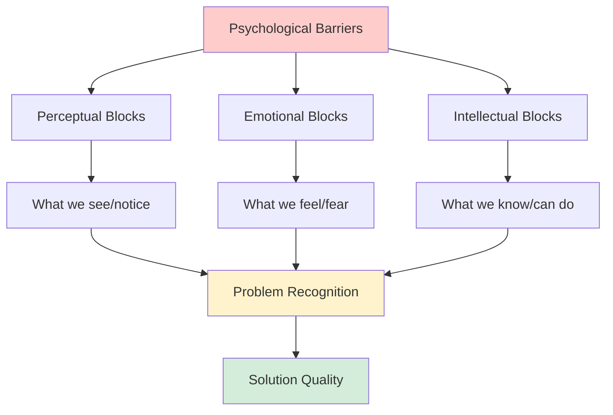
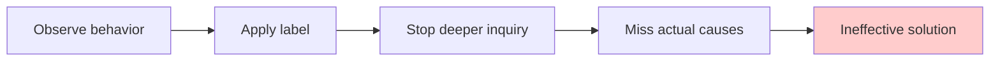
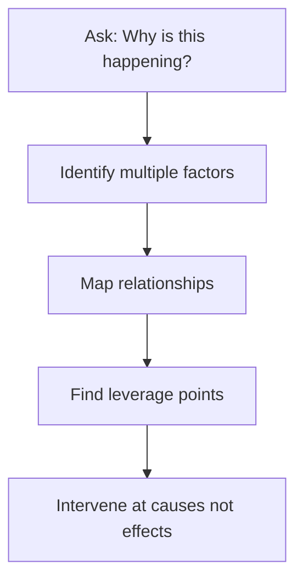
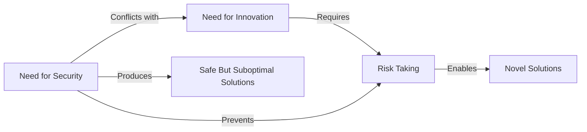
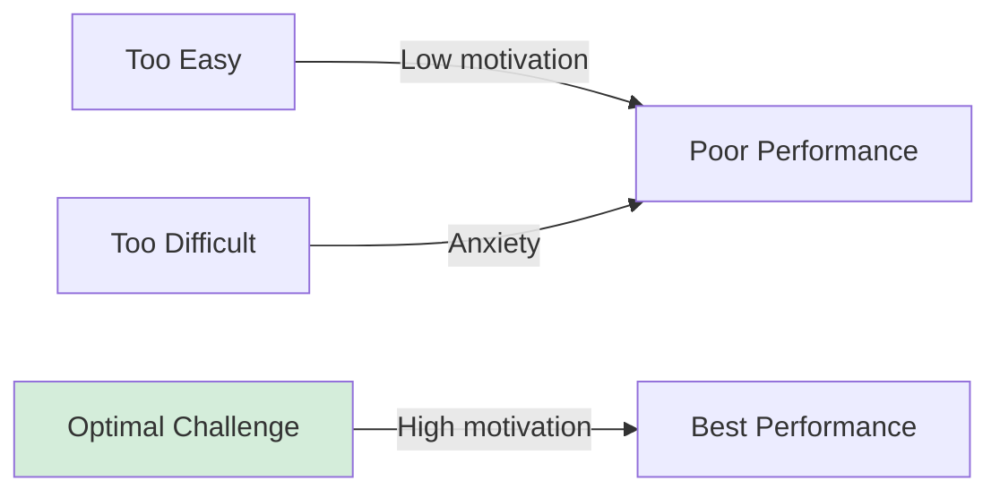
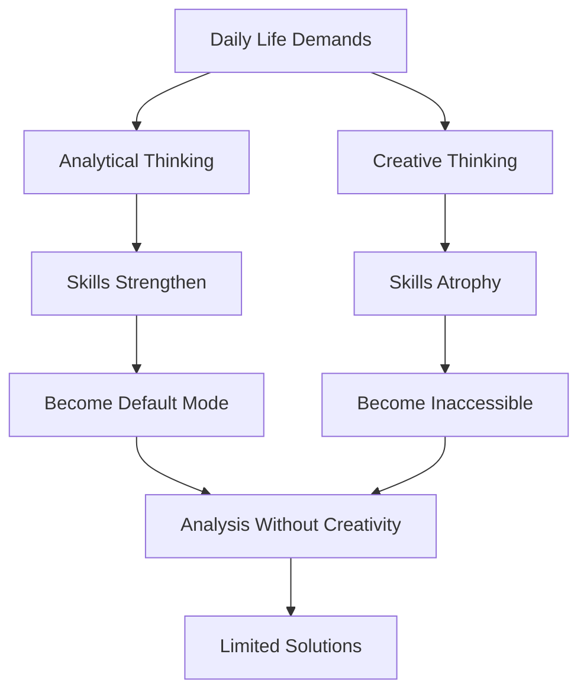

While cognitive phenomena like Einstellung and functional fixedness explain specific mechanisms that impede problem solving, a broader range of psychological barriers affects our ability to find effective solutions. These barriers operate at multiple levels—perceptual, emotional, and intellectual—creating a complex web of obstacles that can prevent even highly capable individuals from solving problems successfully.

## Understanding Psychological Barriers

Psychological barriers to problem solving are **internal constraints that prevent us from clearly perceiving problems, generating creative solutions, or implementing effective strategies**. Unlike external obstacles (lack of resources, time constraints), these barriers originate within our own cognitive and emotional systems.

### The Hierarchical Nature of Barriers

These barriers interact: perceptual blocks affect what problems we recognize, emotional blocks influence which ones we tackle, and intellectual blocks determine how effectively we solve them.

## Perceptual Blocks

**Perceptual blocks** exist when we are unable to clearly perceive a problem or the information needed to solve it effectively. Our perceptual systems, designed to simplify and organize incoming information, sometimes oversimplify or misorganize problem-relevant data.

### 1. Seeing Only What You Expect to See

Our expectations powerfully shape perception, sometimes obscuring the true nature of problems.

**Mechanism**:
- **Top-Down Processing**: Prior knowledge and expectations guide perception
- **Selective Attention**: We notice expected features and miss unexpected ones
- **Perceptual Set**: Mental predisposition to perceive in certain ways
- **Confirmation Seeking**: Actively looking for evidence supporting expectations

**Example**:
A manager expects employee problems stem from laziness. This expectation makes them:
- Notice instances confirming laziness
- Miss evidence of unclear instructions
- Ignore signs of inadequate training
- Overlook systemic workflow problems

**Consequences**:
- Relevant information excluded from problem representation
- Irrelevant information included because "it should be there"
- Solutions address expected rather than actual problems

### 2. Stereotyping

Labeling obscures deeper understanding and prevents nuanced problem analysis.

**The Process**:

**Common Stereotypes in Problem Contexts**:

| Stereotype | Actual Possibility Overlooked |
|------------|------------------------------|
| "They're lazy" | Boredom with monotonous work |
| "Not a team player" | Unclear role expectations |
| "Technically incompetent" | Inadequate tools or training |
| "Resistant to change" | Legitimate concerns not addressed |
| "Poor communicator" | Cultural or linguistic differences |

**Impact**: Solutions target symptoms (perceived laziness) rather than causes (lack of engagement), leading to ineffective interventions.

### 3. Not Recognizing Problems

Sometimes problems go completely unnoticed until effects become severe, requiring emergency action.

**Why Problems Go Unrecognized**:

**Gradual Onset**: Slow deterioration doesn't trigger attention
- Boiling frog syndrome: don't notice gradual temperature increase
- Organizational decline happening too slowly to alarm

**Normalization**: Problem becomes "just how things are"
- Accepting inefficiency as normal
- High turnover seen as inevitable rather than symptomatic

**Attention Allocation**: Focus on urgent matters prevents noticing important trends
- Fighting fires leaves no time for fire prevention
- Reactive mode prevents proactive problem detection

**Expertise Paradox**: Deep familiarity can breed blindness
- Industry veterans may not notice emerging disruptions
- Experts overlook obvious issues newcomers immediately spot

### 4. Not Seeing Problems in Perspective

Taking too narrow a view means recognizing only part of the problem or required information.

**Narrow Focus Manifestations**:

**Part-Whole Confusion**:
- Treating symptoms as the whole problem
- Missing how components interconnect
- Linear thinking in systemic situations

**Temporal Myopia**:
- Focus on immediate causes ignoring historical context
- Short-term solutions creating long-term problems
- Missing cyclical or seasonal patterns

**Level Confusion**:
- Individual-level analysis of organizational problems
- Technical solutions to human problems
- Local optimization ignoring system-wide effects

**Example**: 
Sales declining? Narrow view: "We need better salespeople."
Broader perspective might reveal:
- Product quality issues
- Competitor innovations
- Market shift
- Internal communication problems
- Inadequate training
- Unrealistic quotas

### 5. Mistaking Cause and Effect

Confusing cause and effect misdirects solution efforts toward effects rather than causes.

**The Fundamental Attribution Error**: Attributing problems to people rather than situations

**Common Cause-Effect Reversals**:

**Symptoms vs. Causes**:
- Late deliveries (effect) blamed on slow suppliers (assumed cause)
- Actual cause: ordering department delays
- Solution misdirected toward supplier management instead of internal process

**Correlation vs. Causation**:
- Ice cream sales correlate with drownings
- Both caused by summer weather
- Banning ice cream wouldn't reduce drownings

**Reciprocal Causation**:
- Poor morale reduces productivity
- Low productivity reduces morale
- Chicken-egg problem: where to intervene?

**Systems Thinking Solution**:

## Emotional Blocks

**Emotional blocks** exist when we perceive threats to our emotional needs, including needs for achievement, recognition, order, belonging, and self-esteem. These blocks are often more powerful than intellectual barriers because emotions can override rational analysis.

### 1. Fear of Making Mistakes or Looking Foolish

The most significant and pervasive emotional block affecting most people.

**Origins**:
- **Educational Conditioning**: Traditional schooling punishes mistakes
- **Social Learning**: Childhood ridicule for errors creates lasting fear
- **Professional Pressure**: Mistakes seen as incompetence
- **Perfectionism**: Internalized standards making mistakes intolerable

**Manifestations**:

**Risk Avoidance**:
- Only suggesting "safe" ideas certain to be accepted
- Extensive checking and rechecking before proposing solutions
- Defaulting to consensus positions
- Following established procedures even when inadequate

**Self-Censorship**:
- Filtering out creative ideas as "too different"
- Dismissing own insights as probably wrong
- Waiting for others to suggest ideas first
- Remaining silent in brainstorming sessions

**Status Consciousness**:
With superiors: Appear experienced and knowledgeable
- Fear seeming naive or uninformed
- Hesitate to ask clarifying questions
- Pretend to understand when confused

With subordinates: Protect expert image
- Reluctant to admit uncertainty
- Defend past decisions even when wrong
- Dismiss others' ideas to maintain authority

**Overcoming Strategies**:
- **Reframe mistakes**: As learning opportunities not failures
- **Psychological safety**: Create environments where errors are expected parts of problem solving
- **Separate person from idea**: Evaluate ideas not proposers
- **Model fallibility**: Leaders admitting mistakes normalizes them

### 2. Impatience

Desire to solve problems quickly leads to premature solutions and inadequate analysis.

**Drivers**:
- **Achievement Pressure**: Need to demonstrate competence
- **Discomfort Avoidance**: Problems create psychological tension
- **Time Pressure**: Real or perceived urgency
- **Action Bias**: Cultural preference for doing over thinking

**Consequences**:

**Premature Solution Acceptance**:
- Grab first solution that appears
- Inadequate problem analysis
- Skip exploring alternatives
- Rush to implementation

**Rapid Idea Evaluation**:
- Instantly reject unusual ideas
- Apply immediate feasibility filters
- Focus on obstacles rather than possibilities
- Short-circuit creative processes

**Example**:
Team brainstorming product names:
- Impatient member: "That won't work because..." after each suggestion
- Creative flow interrupted
- Group retreats to safe, conventional options
- Miss breakthrough possibilities

**Antidotes**:
- **Structured Process**: Separate analysis, generation, evaluation phases
- **Time Allocation**: Schedule sufficient time for each stage
- **Delay Judgment**: Explicit rule against evaluation during generation
- **Patience Practice**: Deliberately slow down, reflect before acting

### 3. Avoiding Anxiety

Some people find anxiety particularly unpleasant and avoid situations that trigger it.

**Anxiety Sources in Problem Solving**:
- **Risk and Uncertainty**: Outcomes unclear or potentially negative
- **Disorder and Ambiguity**: Messy, ill-defined problems
- **Long-term Stress**: Persistent unresolved problems
- **Security Threats**: Job, reputation, or status at risk

**Avoidance Behaviors**:

**Risk Avoidance**:
- Setting easy objectives ensuring success
- Preferring known solutions over potentially better unknown ones
- Seeking excessive guarantees before acting
- Paralysis in uncertain situations

**Seeking Premature Closure**:
- Jumping to conclusions to reduce ambiguity
- Black-and-white thinking (avoiding gray areas)
- Rigid categorization and organization
- Difficulty with open-ended problems

**Excessive Reliance on Others**:
- Deferring to authority figures
- Seeking constant reassurance
- Avoiding independent judgment
- Following consensus to reduce personal responsibility

**Security Focus**:
- Avoiding challenges to status quo
- Reluctance to suggest changes
- Protecting existing systems
- Conservative approach to all decisions

### 4. Fear of Taking Risks

Related to anxiety avoidance but specifically focused on situations with uncertain or potentially unpleasant outcomes.

**The Security-Innovation Tension**:

**Risk-Averse Behaviors**:
- Setting objectives within easy reach (no risk of failure)
- Accepting known solutions over innovative ones (certainty valued)
- Extensive planning and analysis (delay action)
- Seeking approval before proceeding (diffuse responsibility)

**Opposite Problem**: Over-confidence in risk-taking
- Ignoring genuine dangers
- Unrealistic optimism about avoiding negative outcomes
- Reckless experimentation without safeguards
- Both extremes problematic for problem solving

### 5. Need for Order

Inability to cope with situations that aren't clear-cut or where ambiguities exist.

**Characteristics**:
- **Low Ambiguity Tolerance**: Discomfort with unclear situations
- **Premature Structuring**: Imposing order before understanding complexity
- **Black-White Thinking**: Difficulty with nuanced positions
- **Process Rigidity**: Following procedures even when inappropriate

**Impact on Problem Solving**:
- Ill-defined problems create excessive frustration
- Complex problems over-simplified to impose order
- Novel situations forced into familiar frameworks
- Creative ambiguity phase cut short

### 6. Lack of Challenge

When problems are routine or benefits/losses aren't personally significant, motivation suffers.

**Indicators**:
- **Routine Autopilot**: Going through motions without engagement
- **Minimum Effort**: Taking easiest, quickest route
- **Procrastination**: Avoiding problem entirely
- **Low Quality**: Accepting first adequate solution

**Challenge-Performance Relationship**:

## Intellectual Blocks

**Intellectual blocks** exist when we lack necessary thinking skills or cannot use them effectively. Unlike emotional blocks (which involve what we feel) or perceptual blocks (which involve what we notice), intellectual blocks concern what we know and can do cognitively.

### 1. Lack of Problem-Solving Process Knowledge

One of the most common blocks: not knowing HOW to solve problems systematically.

**Missing Skills**:

**Analytical Thinking**:
- Breaking problems into components
- Identifying relationships between elements
- Distinguishing symptoms from causes
- Logical reasoning and inference

**Creative Thinking**:
- Generating multiple alternatives
- Making novel associations
- Suspending judgment during ideation
- Combining ideas in new ways

**Strategic Flexibility**:
- Adapting approach to problem type
- Recognizing when to switch strategies
- Balancing analysis and creativity
- Sequencing problem-solving steps

**Technique Application**:
- Using brainstorming effectively
- Applying systematic methods (IDEAL, design thinking)
- Employing visual thinking tools
- Structured decision-making

**Consequences**:
Without systematic approach:
- Wander aimlessly through problem space
- Miss critical aspects
- Get stuck without knowing how to proceed
- Produce suboptimal solutions

### 2. Dominance of Analytical Thinking

Analytical thinking dominates in day-to-day life, suppressing creative thinking skills.

**The Analysis-Creativity Imbalance**:

**Why Analysis Dominates**:
- **Educational Emphasis**: Schools heavily reward analytical thinking
- **Professional Demands**: Most jobs require more analysis than creativity
- **Measurement**: Analysis produces quantifiable, defensible decisions
- **Cultural Values**: Logic and reason privileged over intuition and imagination

**Result**: Creative thinking skills, though present, become rusty through disuse.

### 3. Inflexible Thinking

Difficulty switching between different types of thinking—from analysis to creativity, verbal to visual, abstract to concrete.

**Switching Problems**:

**Mode Rigidity**:
- Stuck in analytical mode when creativity needed
- Continuing to generate ideas when evaluation appropriate
- Verbal reasoning when visual thinking would help
- Abstract when concrete examples needed

**Category Boundaries**:
- Difficulty moving between detail and big picture
- Trapped at one level of abstraction
- Can't shift from technical to human perspectives
- Rigid disciplinary boundaries

**Cognitive Flexibility Skills**:
- **Attentional Shifting**: Redirecting mental focus
- **Task Switching**: Changing cognitive strategies
- **Set Shifting**: Updating mental rules
- **Perspective Taking**: Viewing from different angles

### 4. Not Being Methodical

Perhaps the most common intellectual block—lack of systematic, step-by-step approach.

**Unsystematic Problem Solving**:
- Jumping between stages randomly
- Starting with solutions before understanding problem
- Skipping critical steps
- No clear process or structure

**Why Methodology Matters**:

**Cognitive Load Management**:
- Systematic approach reduces working memory demands
- Clear steps prevent overwhelm with complexity
- Structure guides attention to relevant information

**Completeness Assurance**:
- Steps ensure no critical aspects overlooked
- Checklist effect catches omissions
- Progress tracking shows what remains

**Quality Control**:
- Built-in checkpoints for verification
- Natural points for reflection and adjustment
- Documentation enables learning from experience

**Problem-Solving Frameworks** (IDEAL, Design Thinking, etc.) provide methodology.

### 5. Lack of Problem-Language Fluency

Problems have "languages"—specialist terminology, mathematical notation, visual representation—that must be understood and used.

**Language Requirements**:

**Domain Jargon**:
- Technical terminology in specialized fields
- Professional vocabulary
- Industry-specific concepts
- Without understanding: can't comprehend problem

**Mathematical/Statistical**:
- Quantitative analysis requirements
- Statistical reasoning
- Algebraic manipulation
- Without skills: can't analyze numerical problems

**Visual-Spatial**:
- Diagrams and schematics
- Spatial relationships
- Geometric reasoning
- Without facility: miss visual patterns

**Inappropriate Language Use**:
- Verbal description of fundamentally mathematical problems
- Mathematical formalization of inherently qualitative issues
- Losing important information in translation between languages

### 6. Using Inadequate Information

Problems solved poorly when based on insufficient or inaccurate information.

**Information Problems**:

**Insufficient Collection**:
- Not gathering enough relevant information
- Stopping search prematurely
- Missing key data sources
- Assuming information that should be verified

**Relevance Misjudgment**:
- Not understanding what information matters
- Collecting data that doesn't help
- Missing connections to needed information
- Drowning in irrelevant detail

**Inaccuracy**:
- Using outdated information
- Accepting unreliable sources
- Measurement errors
- Misinterpreting data

**Source Problems**:
- Don't know where to find needed information
- Can't access required sources
- Don't know what questions to ask
- Can't distinguish quality sources

**Relational Understanding**:
- Not seeing how information pieces connect
- Missing patterns and relationships
- Failing to integrate disparate information
- Not recognizing what's missing

## Interactions Between Block Types

These psychological barriers don't operate in isolation—they interact and compound:

**Perceptual-Emotional Interaction**:
- Anxiety (emotional) → narrows attention (perceptual)
- Negative expectations (perceptual) → create fear (emotional)

**Emotional-Intellectual Interaction**:
- Fear of mistakes (emotional) → prevents trying new methods (intellectual)
- Impatience (emotional) → skips systematic analysis (intellectual)

**Perceptual-Intellectual Interaction**:
- Stereotyping (perceptual) → prevents deep analysis (intellectual)
- Narrow focus (perceptual) → limits information gathering (intellectual)

**Example Scenario**:
Engineer faces novel design problem:
1. **Perceptual**: Sees as familiar type (stereotyping)
2. **Emotional**: Fears revealing ignorance by asking questions
3. **Intellectual**: Applies routine method inappropriate for novel problem
4. **Result**: Suboptimal solution, problem persists

## Overcoming Psychological Barriers

### Awareness and Recognition

**First Step**: Recognize barriers operating

**Self-Monitoring Questions**:
- "What am I not seeing about this problem?"
- "What fears or anxieties am I feeling?"
- "Do I have adequate skills for this problem type?"
- "Am I using a systematic approach?"

**Metacognitive Skills**:
- Thinking about thinking
- Monitoring problem-solving process
- Recognizing when stuck
- Identifying barrier type operating

### Specific Interventions

**For Perceptual Blocks**:
- Seek multiple perspectives
- Challenge assumptions explicitly
- Use structured problem analysis
- Employ visual thinking tools

**For Emotional Blocks**:
- Create psychological safety
- Reframe failures as learning
- Practice deliberate patience
- Build tolerance for ambiguity
- Conduct risk-benefit analyses

**For Intellectual Blocks**:
- Learn systematic methods
- Practice creative techniques
- Develop multiple thinking modes
- Build domain knowledge
- Improve information skills

### Environmental Support

Organizations can reduce barriers through:

**Culture**:
- Normalize mistakes and experimentation
- Reward learning from failures
- Value diverse perspectives
- Encourage questioning

**Structure**:
- Provide problem-solving training
- Allow adequate time for quality solutions
- Create spaces for creative thinking
- Support systematic approaches

**Resources**:
- Access to needed information
- Tools and techniques training
- Expert consultation available
- Collaboration opportunities

## 🎯 Self-Assessment Questions

1. **Personal Barriers**: Identify your three most significant psychological barriers to problem solving. Provide specific examples of how each has affected your problem-solving effectiveness.

2. **Perceptual Analysis**: Describe a situation where you "saw only what you expected to see." What information did you miss? How did this affect the solution?

3. **Emotional Exploration**: Which emotional blocks affect you most: fear of mistakes, impatience, anxiety avoidance, need for order, or lack of challenge? Explain why and how this manifests in your problem solving.

4. **Intellectual Skills Audit**: Rate your capabilities in: (a) analytical thinking, (b) creative thinking, (c) systematic methodology, (d) flexible thinking, (e) information gathering. Where are your greatest development needs?

5. **Interaction Effects**: Describe a complex problem where multiple barrier types interacted. How did perceptual, emotional, and intellectual blocks reinforce each other?

6. **Intervention Design**: Choose one psychological barrier you commonly experience. Design a specific, practical strategy to overcome it. What concrete steps would you take?

7. **Organizational Context**: How do organizational cultures either reduce or amplify psychological barriers? Provide examples from workplaces or schools you've experienced.

## 💡 Memory Aids

**PEI Framework for Barrier Types**:
- **P**erceptual: What we SEE (or don't see)
- **E**motional: What we FEEL (fear, anxiety, impatience)
- **I**ntellectual: What we KNOW and CAN DO

**The FEAR Acronym for Emotional Blocks**:
- **F**ear of mistakes
- **E**xcess anxiety
- **A**ccelerating too quickly (impatience)
- **R**isk aversion

**The MAPS Acronym for Perceptual Blocks**:
- **M**istaking cause and effect
- **A**ssumptions (seeing what expected)
- **P**erspective too narrow
- **S**tereotyping

Remember**: "To solve problems effectively, first solve the problems preventing you from solving problems"

---

**Source PDF**: [Block-4/Unit-4.pdf - Pages 51-57](/pdfs/MPC-001%20Cognitive%20Psychology,%20Learning%20and%20Memory/Block-4/Unit-4.pdf)  
**Course**: MPC-001 Cognitive Psychology, Learning and Memory

## 📚 Further Reading

- Adams, J. L. (2001). *Conceptual blockbusting: A guide to better ideas* (4th ed.). Cambridge, MA: Perseus.
- Perkins, D. N. (2000). *Archimedes' bathtub: The art and logic of breakthrough thinking*. New York: Norton.

## 🔗 Related Topics

- [Einstellung and Mental Set](/mpc-001/block-4/einstellung-mental-set-luchin-water-jar)
- [Functional Fixedness](/mpc-001/block-4/functional-fixedness-problem-representation)
- [Problem Solving Strategies](/mpc-001/block-4/algorithms-heuristics-problem-solving)
- [Metacognition](/mpc-001/block-1/cognitive-psychology-introduction)
