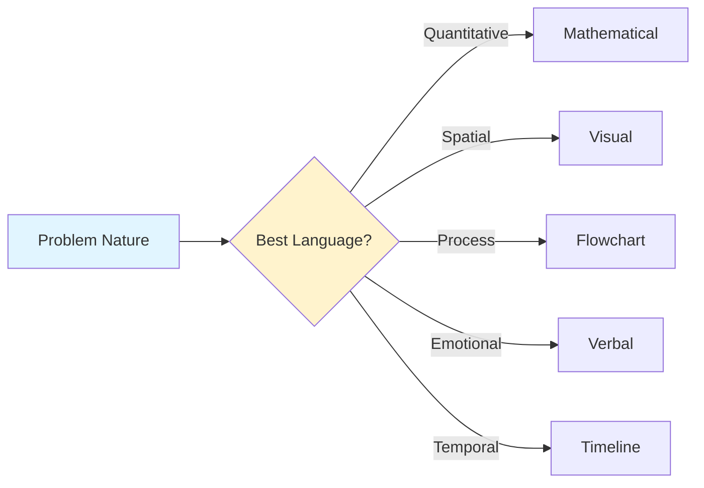
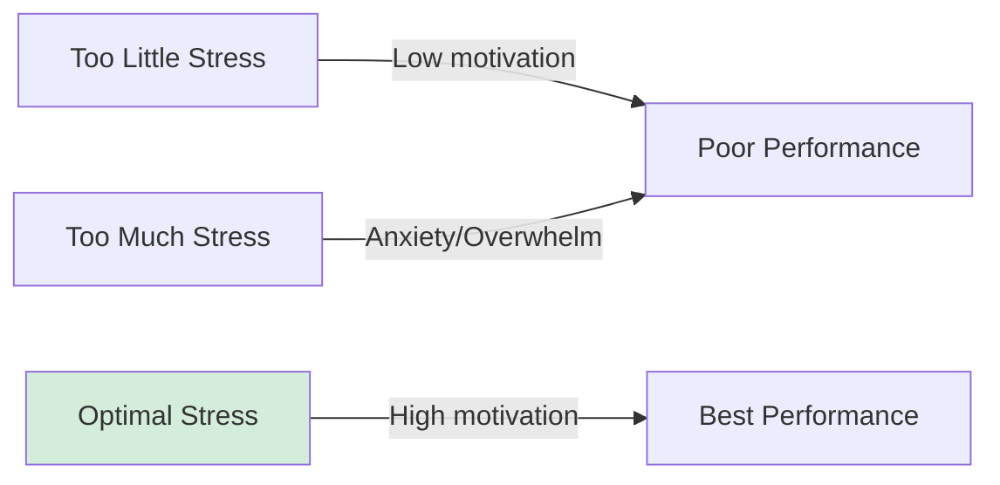
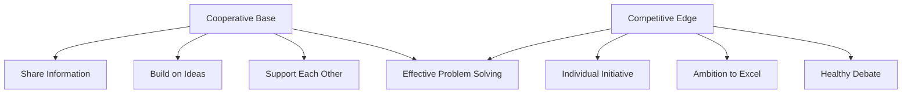

While perceptual, emotional, and intellectual blocks represent internal psychological barriers to problem solving, we also face significant external obstacles. Environmental conditions, cultural conditioning, and communication limitations create additional layers of impediments that can powerfully shape our problem-solving effectiveness. Understanding these external barriers is crucial because they often interact with internal blocks, creating compounding effects that make problem solving especially difficult.

## Expressive Blocks

**Expressive blocks** arise when we lack the knowledge or skills to communicate or record ideas in required ways. Even brilliant problem-solving insights become useless if we cannot effectively express them to ourselves or others.

### The Communication Imperative

Problem solving rarely occurs in isolation. Solutions must be:
- **Recorded**: For personal reference and development
- **Shared**: With colleagues, supervisors, or collaborators
- **Implemented**: Through instructions to others
- **Justified**: To gain approval and resources

Expressive blocks interfere with all these requirements.

### Types of Expressive Blocks

#### 1. Using the Wrong Language

Problems and solutions have natural languages that best capture their essence. Using inappropriate language loses critical meaning.

**Language Options**:
- **Verbal/Written**: Words and sentences
- **Mathematical**: Equations, formulas, statistics
- **Visual**: Diagrams, sketches, models
- **Physical**: Prototypes, demonstrations
- **Musical**: Rhythm, harmony (for temporal patterns)
- **Kinesthetic**: Movement, gesture

**Mismatch Problems**:

**Words for Numbers**:
Trying to describe statistical trends verbally:
- "Sales were somewhat higher except when they dropped significantly"
- Better: Graph showing trends with numerical values

**Numbers for Feelings**:
Attempting to quantify emotional dynamics:
- "The team's morale is approximately 6.3 out of 10"
- Better: Qualitative description of team atmosphere and specific concerns

**Verbal for Spatial**:
Describing complex 3D structures in words:
- Pages of text trying to convey building layout
- Better: Floor plans, 3D models, or diagrams

#### 2. Unfamiliarity with Specific Applications

We may know a language generally but lack skill in particular applications.

**Written vs. Oral**:
- Writing clearly ≠ speaking effectively
- Many capable writers struggle with public speaking
- Conversely, eloquent speakers may write poorly

**Technical vs. Popular**:
- Explaining to experts vs. general audience
- Academic writing vs. journalistic style
- Technical documentation vs. user manuals

**Formal vs. Informal**:
- Casual conversation vs. formal presentation
- Email vs. official report
- Brainstorming discussion vs. board proposal

**Example**:
Engineer brilliant at technical documentation freezes during presentations:
- Ideas clear in written form
- Unable to convey same information orally
- Expressive block limits career advancement despite technical excellence

#### 3. Inadequate Explanations

Insufficient information or incorrect assumptions about audience knowledge.

**Common Causes**:

**Insufficient Detail**:
- Skipping steps assumed "obvious"
- Omitting context
- Under-explaining complex concepts
- Not providing examples

**False Expertise Assumption**:
- Assuming audience knows technical terms
- Skipping foundational concepts
- Using insider jargon
- Not checking understanding

**Curse of Knowledge**:
Once you know something, hard to imagine not knowing it
- Experts forget what it's like to be a beginner
- Assume connections obvious to them are obvious to others
- Skip explanations of "simple" things

**Wrong Level**:
- Too technical for general audience
- Too simplistic for experts
- Inconsistent level within same explanation

#### 4. Passive Management Style

Reluctance or difficulty exerting influence prevents effective communication of ideas.

**Manifestations**:
- Hesitation to speak up in meetings
- Presenting ideas tentatively ("This might be wrong, but...")
- Backing down quickly when challenged
- Waiting to be asked rather than volunteering
- Avoiding confrontation even when ideas need defending

**Consequences**:
- Good ideas dismissed without adequate consideration
- Unable to convince others of solution merit
- Implementation sabotaged by lack of advocacy
- Credit for ideas taken by more assertive colleagues

**Underlying Causes**:
- Fear of conflict
- Low self-confidence
- Cultural/gender socialization
- Organizational hierarchy concerns

#### 5. Dominant Management Style

Exerting oppressive control makes others automatically reluctant or hostile to ideas.

**Characteristics**:
- Interrupting and talking over others
- Dismissing alternative viewpoints
- Using authority to force acceptance
- Threatening consequences for disagreement
- Taking credit for others' contributions

**Impact on Problem Solving**:
- Stifles input from others
- Creates resistant audience
- People focus on defending themselves rather than evaluating ideas
- Group problem solving becomes ineffective
- Best solutions may never surface

**Ironic Effect**: 
Dominance intended to gain acceptance creates opposition. Even good ideas rejected because of how they're communicated.

### Overcoming Expressive Blocks

**Language Versatility**:
- Develop multi-modal communication skills
- Practice translation between languages (verbal ↔ visual ↔ mathematical)
- Match language to problem and audience

**Audience Awareness**:
- Research audience knowledge level
- Test explanations with representative individuals
- Provide context and definitions
- Check understanding frequently

**Style Flexibility**:
- Adapt assertiveness to situation
- Balance confidence with openness
- Advocate without dominating
- Invite feedback genuinely

## Environmental Blocks

**Environmental blocks** are external obstacles in the physical or social environment that prevent effective problem solving. Unlike psychological blocks (which are internal), these arise from our surroundings.

### Physical Environment Blocks

#### 1. Distractions

Interruptions and noise affecting concentration.

**Types**:

**Auditory**:
- Conversations, phone calls
- Equipment noise
- Music (depending on task and preference)
- Unpredictable sounds (most disruptive)

**Visual**:
- Movement in peripheral vision
- Cluttered workspace
- Notifications and screens
- Interruptions from colleagues

**Impact**:
- Break concentration during complex thinking
- Lost train of thought
- Reduced working memory capacity
- Increased time to solution

**Individual Differences**:
People vary in distraction susceptibility:
- Some work well with background noise
- Others require silence
- Task complexity matters (simple tasks less affected)

#### 2. Physical Discomfort

Creates distraction and reduces cognitive capacity.

**Sources**:
- Poorly designed furniture (back pain)
- Inadequate lighting (eye strain)
- Temperature extremes (too hot/cold)
- Poor air quality
- Inadequate facilities

**Effects**:
- Reduced concentration
- Irritability affecting collaboration
- Desire to escape rather than solve problem
- Physical stress adding to mental stress

#### 3. Monotonous Work Environment

Dull surroundings reduce engagement and awareness.

**Characteristics**:
- Repetitive visual environment
- Unchanging routine
- Lack of stimulation
- Boring, predictable tasks

**Consequences**:
- "Automatic pilot" mode
- Reduced attention to problems
- Blindness to issues as they arise
- Decreased creative thinking

### Social Environment Blocks

#### 1. Management Style

How we're managed profoundly affects problem-solving ability.

**Inhibiting Management Behaviors**:

**Idea Dismissal**:
- "No, it wouldn't work because..."
- "We've tried it before and it didn't work"
- "That's not how we do things here"
- Automatic rejection without consideration

**Over-Control**:
- Micromanagement
- Excessive approval requirements
- Rigid procedures for everything
- No autonomy in approach

**Failure Punishment**:
- Blame culture
- Career consequences for mistakes
- Public criticism
- No tolerance for experimentation

**Effect**: People stop trying. Creative ideas withheld. Safe, conventional approaches dominate.

**Enabling Management Behaviors**:
- Genuine consideration of ideas
- Autonomy in problem-solving approach
- Learning from failures
- Psychological safety

#### 2. Lack of Support

Multiple forms of missing organizational support.

**Information Support**:
- Can't access needed data
- No expert consultation available
- Knowledge hoarding in organization
- Poor information systems

**Resource Support**:
- Inadequate tools or technology
- Insufficient time allocated
- Budget constraints
- Personnel limitations

**Authority Support**:
- Can't make necessary decisions
- Need excessive approvals
- Lack mandate to implement solutions
- Unclear responsibility

**Emotional Support**:
- No encouragement from leadership
- Isolation in problem solving
- Ideas go nowhere
- Lack of recognition for effort

#### 3. Stress

Excessive pressure affecting cognitive function.

**Sources**:
- Unrealistic deadlines
- Work overload
- Conflicting demands
- Job insecurity
- Interpersonal conflicts

**Individual Variation**:
People differ in:
- Stress tolerance
- What they find stressful
- Coping mechanisms
- Recovery speed

**Impact on Problem Solving**:
- Narrows attention
- Reduces creative thinking
- Increases rigidity
- Impairs judgment
- Reduces working memory capacity

**Optimal Stress**:

#### 4. Lack of Communication

Information flow problems within organization.

**Problems**:
- Siloed departments
- Information hoarding
- Poor communication systems
- Vertical but not horizontal communication
- Important information not shared

**Effects**:
- Can't get needed information
- Don't know relevant context
- Duplicate effort
- Missing pieces for problem solution
- Lack of encouragement (no one knows you're working on it)

#### 5. Expectations of Others

Peer and supervisor expectations shape our problem-solving ambition.

**Low Expectations**:
- Accepting mediocre solutions
- Not seeking innovation
- "Good enough" culture
- Waste of time to do better

**High Expectations**:
- Push for excellence
- Seek innovative solutions
- Greater effort invested
- Creative thinking valued

**Status Quo Expectations**:
- Change discouraged
- "That's how we've always done it"
- Innovation seen as risky
- Conformity valued over creativity

## Cultural Blocks

**Cultural blocks** result from conditioning to accept what's expected or "normal," binding us with custom and tradition. These are often invisible because they seem like "reality" rather than learned perspectives.

### 1. Unquestioning Acceptance of Status Quo

Tendency to conform to established ideas and methods without examining them.

**Manifestations**:
- "That's how we've always done it"
- Not questioning traditional approaches
- Focus on why ideas won't work rather than how they could work
- Defending current practices
- Resistance to challenging norms

**Underlying Mechanisms**:

**Social Proof**:
- If everyone does it this way, must be best way
- Long-standing practices assumed optimal
- Group consensus substitutes for critical analysis

**Authority Legitimation**:
- "Management knows best"
- "Experts must have good reasons"
- Deferring to institutional wisdom

**Comfort with Familiar**:
- Known problems preferred to unknown solutions
- Devil you know vs. devil you don't
- Familiar inefficiency more comfortable than unfamiliar efficiency

**Example**:
Organization using inefficient filing system for decades:
- Everyone complains but no one questions
- "That's just how it is here"
- New employee suggests digital system
- Met with resistance: "We've tried digital before, didn't work"
- Innovation blocked by cultural acceptance

### 2. Dislike of Change

Attitude that tradition is preferable to change, arising from need for security.

**Why Change Resisted**:

**Security Needs**:
- Current situation predictable
- Change brings uncertainty
- Risk of being worse off
- Loss of hard-earned expertise

**Investment Protection**:
- Time and effort invested in current system
- Skills developed for current methods
- Status derived from existing structure
- Admitting need for change = admitting past was wrong

**Cognitive Effort**:
- Change requires learning
- Comfortable with current approach
- Energy required for adaptation
- Temporary incompetence during transition

**Important Caveat**:
Not all change is good. Change for change's sake can be dangerous. Legitimate reasons to maintain traditions exist. Balance needed between stability and innovation.

### 3. Fantasy and Humor Seen as Unproductive

Belief that playfulness has no place in serious problem solving.

**The "Serious Business" Mentality**:
- Problem solving = serious work
- Fantasy = childish or frivolous
- Humor = unprofessional
- Play = waste of time
- Fun = not working hard

**Reality**:
Research and innovator reports suggest otherwise:

**Fantasy's Role**:
- Makes unlikely connections
- Suspends constraints temporarily
- Accesses unconscious creativity
- Provides psychological distance

**Humor's Function**:
- Unexpected combinations (like jokes)
- Revealing illogic through absurdity
- Releasing tension enabling creativity
- Creating psychological safety

**Common Feature**:
Both fantasy and humor involve **unlikely combination of ideas**—exactly what innovative solutions require.

**Historical Examples**:
- Einstein's thought experiments (fantasy)
- Kekulé's dream of ouroboros (benzene ring)
- Newton's apple (simplifying metaphor)
- Many inventions from "what if" play

### 4. Feelings and Intuition Seen as Unreliable

Strong bias toward reason, logic, and quantitative judgments over subjective experience.

**The Objectivity Bias**:

**Valued**:
- Reason and logic
- Quantitative measurement
- Objective analysis
- Verifiable data
- Explicit knowledge

**Devalued**:
- Feelings and emotions
- Intuition and hunches
- Subjective judgment
- Qualitative assessment
- Tacit knowledge

**Why Objectivity Preferred**:
- Measurable and documentable
- Communicable in precise terms
- Defendable in arguments
- Culturally legitimated (especially in Western contexts)
- "Rational" decision-making protected from criticism

**The Problem**:
Even highly logical fields rely on intuition:

**Mathematical Problem Solving**:
- Intuition guides which approach to try
- Feeling when proof is "elegant"
- Hunches about productive directions

**Scientific Discovery**:
- Intuition in hypothesis generation
- Aesthetic sense in theory choice
- Gut feelings about promising research directions

**Business Decisions**:
- Executive intuition about markets
- Gut feel about people and partnerships
- Sensing opportunities before data confirms

**Complete Problem Solving**:
Requires both objective and subjective methods:
- Analysis for understanding
- Intuition for insight
- Logic for verification
- Feeling for evaluation

### 5. Over-Emphasis on Competition or Cooperation

Cultural extremes in either direction impede problem solving.

**Strongly Competitive Environment**:

**Characteristics**:
- Individual recognition and rewards
- Performance ranking
- Win-lose framing
- Promotion competition
- Resource scarcity mindset

**Problems for Problem Solving**:
- Unwilling to share ideas (someone else might use them)
- Not listening to competitors' ideas
- Information hoarding
- Sabotaging others' work
- Inability to build on each other's thinking

**Strongly Cooperative Environment**:

**Characteristics**:
- Group harmony valued above all
- Consensus decision-making
- Avoid standing out
- Shared credit for everything
- Groupthink tendencies

**Problems for Problem Solving**:
- Reluctance to present novel ideas (might disrupt harmony)
- Conformity pressure
- Watering down of innovative proposals
- Difficulty making tough decisions
- Lowest common denominator solutions

**Optimal Balance**:

### 6. Taboos

Certain actions and ideas excluded from consideration because they're distasteful, harmful, or violate moral codes.

**Types of Taboos**:

**Moral Taboos**:
- Actions considered immoral
- Violating cultural values
- Religious prohibitions
- Ethical boundaries

**Social Taboos**:
- Discussing sensitive topics
- Challenging revered traditions
- Questioning authority figures
- Breaking social norms

**Professional Taboos**:
- Practices violating professional codes
- "We don't do that in this industry"
- Career-limiting moves
- Reputation risks

**The Problem Solving Paradox**:

**Legitimate Taboos**:
Many taboos serve important functions:
- Protect vulnerable people
- Prevent genuine harm
- Maintain ethical standards
- Preserve social fabric

**Cognitive Exploration**:
But taboos needn't extend to *thinking about* ideas:
- Considering doesn't mean implementing
- Thought experiments reveal assumptions
- Breaking taboos mentally can inspire legitimate solutions
- Distance from taboo provides new perspective

**Example**:
Student creativity test with calculus problem:
- Given rules to follow
- Objective: find most solution paths
- High scorers: temporarily broke given rules in thinking
- Explored forbidden territory mentally
- Led to more creative solutions within rules

**Principle**: Breaking taboos in thought (not action) can illuminate new perspectives without causing harm.

### Cultural Relativity

Important note: These cultural blocks vary across:
- National cultures
- Organizational cultures
- Professional cultures
- Generational cohorts
- Socioeconomic groups

What's a strong block in one context may be weak in another.

## Block Interactions and Compounding

Environmental and cultural blocks don't operate in isolation—they interact with psychological blocks and with each other.

**Example Scenario**:
Junior employee in hierarchical organization with idea for improvement:

**Environmental Blocks**:
- Management style discourages suggestions
- Open office with constant distractions
- High stress from overwork
- Lack of time allocated for problem solving

**Cultural Blocks**:
- Strong respect for hierarchy
- Change seen as disrespectful to elders
- Fantasy/play inappropriate at work
- Must show "serious" demeanor

**Psychological Blocks** (resulting):
- Fear of looking foolish (emotional)
- Seeing only approved problem types (perceptual)
- Not trying unconventional approaches (intellectual)

**Result**: Good ideas never surface. Organization misses improvements.

## Overcoming External Blocks

### Individual Strategies

**For Expressive Blocks**:
- Develop multi-modal communication skills
- Practice specific weak applications
- Use visual aids to support verbal explanation
- Get feedback on communication effectiveness

**For Environmental Blocks**:
- Create optimal physical workspace
- Manage attention and interruptions
- Build stress resilience
- Develop communication networks
- Seek out supportive relationships

**For Cultural Blocks**:
- Become aware of cultural assumptions
- Consciously question "that's how it's done"
- Give self permission for mental exploration
- Separate thought from action
- Seek diverse cultural perspectives

### Organizational Interventions

**Physical Environment**:
- Quiet spaces for concentration
- Collaborative spaces for teamwork
- Ergonomic workstations
- Environmental variety

**Social Environment**:
- Train managers in supportive leadership
- Create psychological safety
- Recognize and reward problem solving
- Provide adequate resources
- Manage stress levels

**Cultural Change**:
- Challenge status quo thinking explicitly
- Create permission for experimentation
- Value diverse perspectives
- Balance cooperation and competition
- Discuss and examine taboos

## 🎯 Self-Assessment Questions

1. **Expressive Analysis**: How effectively do you communicate ideas in: (a) writing, (b) speech, (c) visual formats, (d) mathematical notation? Which causes you most difficulty?

2. **Environmental Impact**: Describe your typical problem-solving environment. What physical or social features help versus hinder your effectiveness?

3. **Cultural Conditioning**: Identify three cultural blocks affecting your problem solving. Where did these come from (education, profession, organization, society)?

4. **Communication Barriers**: Recall a time when you had a good solution but couldn't communicate it effectively. What expressive block was operating?

5. **Status Quo Challenge**: What practices in your work or school environment does everyone accept but nobody questions? Why do these go unchallenged?

6. **Taboo Exploration**: Identify a taboo in your field or organization. What legitimate concerns does it address? What might we learn by thinking about it differently?

7. **Intervention Design**: If you could change one environmental or cultural factor in your organization to improve problem solving, what would it be? How specifically would you change it?

## 💡 Memory Aids

**SPACE Framework for Environmental Blocks**:
- **S**tress and pressure
- **P**hysical discomfort
- **A**bsent support systems
- **C**ommunication problems
- **E**xpectations limiting ambition

**STATUS Framework for Cultural Blocks**:
- **S**tatus quo acceptance
- **T**radition over change
- **A**nalysis over intuition
- **T**aboos limiting exploration
- **U**nbalanced competition/cooperation
- **S**eriousness excluding play

Remember: "Culture is water to the fish—invisible until you're out of it"

---

**Source PDF**: [Block-4/Unit-4.pdf - Pages 53-57](/pdfs/MPC-001%20Cognitive%20Psychology,%20Learning%20and%20Memory/Block-4/Unit-4.pdf)  
**Course**: MPC-001 Cognitive Psychology, Learning and Memory

## 📚 Further Reading

- Schein, E. H. (2010). *Organizational culture and leadership* (4th ed.). San Francisco: Jossey-Bass.
- Adams, J. L. (2001). *Conceptual blockbusting: A guide to better ideas*. Cambridge, MA: Perseus.

## 🔗 Related Topics

- [Psychological Barriers](/mpc-001/block-4/psychological-barriers-problem-solving)
- [Team Problem Solving](/mpc-001/block-4/problem-solving-approaches-expertise)
- [Organizational Learning](/mpc-001/block-2/intelligence-theories-integration)
- [Creative Problem Solving](/mpc-001/block-2/creativity-meaning-aspects-theories)
