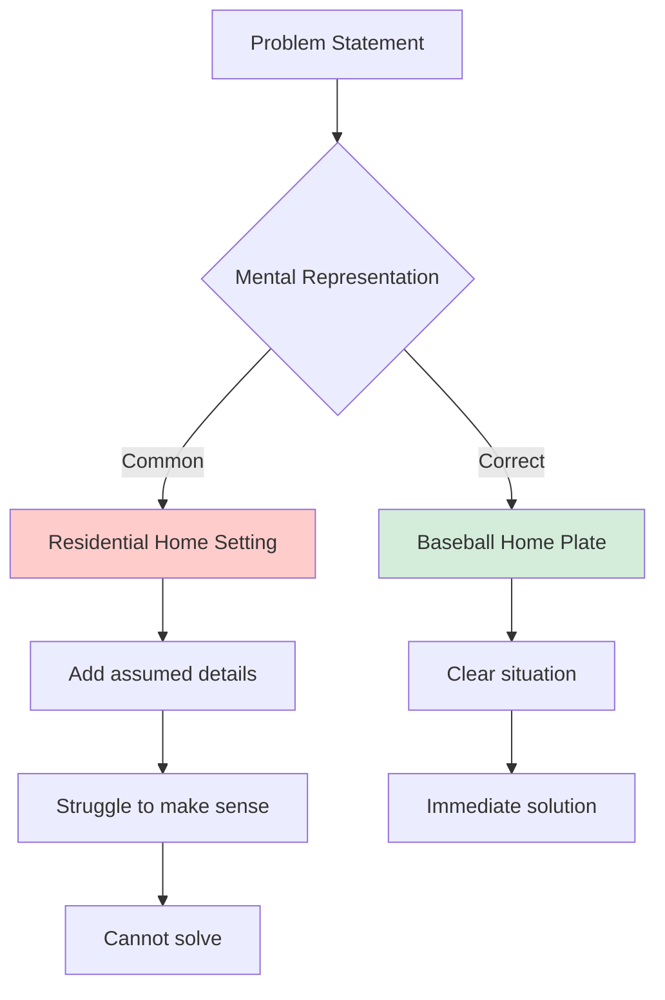
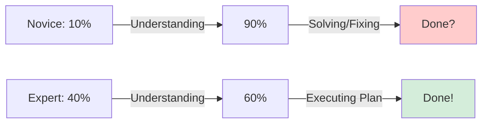
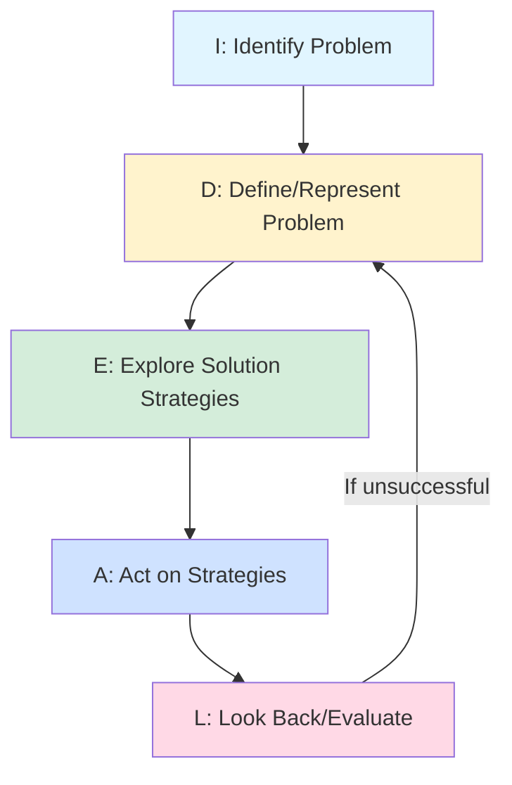

The way we represent a problem in our minds profoundly influences whether we can solve it. Two people facing the identical problem may represent it so differently that one finds the solution obvious while the other struggles endlessly. Similarly, experts and novices don't just know different amounts—they think about problems fundamentally differently. Understanding these representational and expertise differences, along with strategies for overcoming them, completes our examination of impediments to problem solving.

## Problem Representation as an Impediment

**Problem representation** refers to how we mentally conceptualize and structure a problem. The same external problem can be represented internally in multiple ways, and the representation largely determines solution success.

### The Man at Home Problem

Consider this classic problem from Perkins (1981):

> "There is a man at home. That man is wearing a mask. There is a man coming home. What's happening?"

**Common Misrepresentation**:
Most people initially think:
- Home = house
- Mask = disguise, Halloween, robbery
- Men in residential setting
- Trying to construct scenarios involving crime or parties

**Assumptions Added**:
- "Home" must mean a residential house
- Masks worn for concealment or costume
- Indoor domestic situation
- Human drama or conflict

**Correct Representation**:
- Home = home plate (baseball)
- Mask = catcher's protective mask
- Man at home = catcher
- Man coming home = runner
- Situation = baseball game

**Why It's Hard**:


### Incomplete or Incorrect Representations

**Incomplete Representation**:
Missing crucial information:
- Ignoring constraints
- Overlooking key relationships
- Not including all relevant elements
- Superficial understanding

**Incorrect Representation**:
Including wrong information:
- Adding unstated assumptions
- Misinterpreting given information
- Importing irrelevant knowledge
- False analogies

**Perkins' Argument**:
These assumptions constitute a kind of **mental set**:
- Habitual way of interpreting certain situations
- Activated automatically by problem cues
- Hinders seeing alternative representations
- Must be broken to solve problem

### The Power of Representation Choice

Schwartz (1971) demonstrated that representation format dramatically affects success.

**The Study**:
Participants solved problems requiring tracking multiple relationships and constraints.

**Findings**:
- People using charts and flowcharts: High success rate
- People writing facts as sentences: Low success rate
- **Same information, different representation format**

**Why Representation Matters**:

**Working Memory Load**:
- Some representations are more compact
- Easier to hold in working memory
- Reduce cognitive load
- Free resources for actual solving

**Revealing Relationships**:
- Visual representations show connections
- Spatial arrangements suggest patterns
- Hierarchies become visible
- Constraints more apparent

**Supporting Operations**:
- Different representations support different manipulations
- Diagrams: spatial reasoning
- Equations: mathematical operations
- Tables: comparison and lookup

### The Numbers Game Example

A compelling demonstration of representation power:

**The Game**:
Two players, digits 1-9 available
- Take turns crossing off digits
- Add to personal list
- First to have three digits totaling exactly 15 wins
- Examples: 4+5+6=15, or 1+6+8=15

**Standard Representation**:
List of numbers: 1 2 3 4 5 6 7 8 9
- Track what's taken
- Calculate possible combinations
- Predict opponent moves
- **Cognitively demanding, difficult to play well**

**Alternative Representation**:
```
6 7 2
1 5 9
8 3 4
```

This is a **magic square**—every row, column, and diagonal sums to 15!

**Revelation**:
The numbers game **is actually tic-tac-toe**:
- Each position in square corresponds to a digit
- Trying to get three-in-a-row that sum to 15
- Same as trying to get three-in-a-row in tic-tac-toe
- Strategy becomes obvious with this representation

**Lesson**:
Problem difficulty depends enormously on representation. Finding the right representation is often the key to solution.

## Lack of Problem-Specific Knowledge or Expertise

Not all problems are equally accessible to everyone. Domain-specific knowledge and expertise dramatically change how problems are approached and solved.

### Expert-Novice Differences

Research comparing experts and novices reveals fundamental thinking differences.

#### 1. Problem Representation

**Novices**:
- **Surface-Level Representation**: Focus on objects and surface features
- Example (physics): "This problem has an inclined plane"
- Organize by **surface similarity**: "These both mention pulleys"
- Concrete, perceptual features dominate

**Experts**:
- **Deep-Level Representation**: Focus on underlying principles
- Example (physics): "This is a conservation of energy problem"
- Organize by **structural similarity**: "These both involve Newton's second law"
- Abstract principles dominate

**Chi, Feltovich, & Glaser (1981) Study**:

Physicists and students sorted physics problems into categories:

**Novice Categories**:
- "Inclined plane problems"
- "Spring problems"
- "Problems with pulleys"

**Expert Categories**:
- "Conservation of energy problems"
- "Newton's second law problems"
- "Work-energy theorem problems"

**Significance**:
Experts see through surface features to underlying structure, enabling transfer to new situations that look different but share deep similarities.

#### 2. Problem-Solving Approach

**Time Allocation**:

**Novices**:
- Quick problem reading
- Jump immediately to solution attempts
- Little time on understanding
- Trial and error dominates

**Experts**:
- Extensive time on qualitative analysis
- Understanding before solving
- Mental simulation
- Planning solution path



**Solution Process**:

**Novices**:
- Work forward from given information
- Try equations until something works
- Get stuck frequently
- Backtrack often
- Solution path messy and inefficient

**Experts**:
- Work backward from goal
- Identify principles that apply
- Construct solution plan
- Execute systematically
- Fewer false starts
- Elegant solution paths

#### 3. Self-Monitoring

**Error Detection**:

**Novices**:
- Limited error checking
- Don't recognize mistakes
- No sense of when solution feels "wrong"
- Accept implausible answers

**Experts**:
- Constant monitoring
- Catch errors quickly
- Intuitive sense of correctness
- Reject implausible results automatically

**Metacognition**:

**Novices**:
- Limited awareness of thinking process
- Don't know when they're stuck
- Can't identify what's missing
- Limited strategy repertoire

**Experts**:
- Strong metacognitive awareness
- Recognize impasses
- Know what information needed
- Flexibly switch strategies

#### 4. Knowledge Organization

**Memory Structure**:

**Novices**:
- Isolated facts
- Disconnected procedures
- Fragmented knowledge
- Difficult retrieval

**Experts**:
- Rich schemas
- Interconnected knowledge
- Patterns and templates
- Rapid retrieval

**Example: Chess Masters (de Groot, 1965; Chase & Simon, 1973)**:

**Setup**: Brief (5-second) exposure to chess board positions

**Condition A** (Actual game positions):
- **Masters**: Remember 20+ piece positions
- **Beginners**: Remember 6-8 positions
- Masters extract meaningful patterns
- Chunk information efficiently

**Condition B** (Random piece positions):
- **Masters**: Remember only 6-8 positions
- **Beginners**: Remember 6-8 positions
- Expertise advantage disappears
- No meaningful patterns to recognize

**Implication**:
Expert memory advantage comes from **pattern recognition** based on domain knowledge, not from superior memory capacity generally.

### Domain Specificity of Expertise

**Key Principle**: Expertise doesn't transfer easily across domains.

**Within-Domain**:
- Chess master excellent at chess
- Physics PhD solves physics problems expertly
- Master chef creates sophisticated recipes

**Cross-Domain**:
- Chess master not automatically better at physics
- Physicist may struggle with cooking
- Chef doesn't necessarily excel at chess

**Explanation**:
Expertise derives from domain-specific knowledge structures, not from general cognitive superiority.

### The Expertise Paradox

Surprisingly, expertise sometimes **hinders** problem solving:

**When Expertise Helps**:
- Routine problems in domain
- Recognizing familiar patterns
- Applying known solutions
- Efficient execution

**When Expertise Hinders**:
- Novel problems requiring new approaches
- Functional fixedness (seeing only typical solutions)
- Einstellung (applying familiar methods automatically)
- Difficulty seeing problems from fresh perspective

**Example**:
Experienced doctors sometimes misdiagnose because they:
- Jump to familiar diagnosis too quickly
- Miss atypical presentations
- Don't consider rare conditions
- Beginners take longer but sometimes catch what experts miss

### Medical Problem Solving (Goel & Grafman, 2000)

Expertise alone insufficient for effective problem solving—other factors matter:

**Factors Affecting Medical Problem Solving**:

**Cognitive Factors**:
- Working memory capacity
- Reasoning ability
- Pattern recognition skills
- Metacognitive awareness

**Emotional Factors**:
- Stress levels
- Emotional state
- Burnout status
- Decision fatigue

**Situational Factors**:
- Time pressure
- Available information
- Patient cooperation
- Resource availability

**Physical Factors**:
- Sleep deprivation
- Physical fatigue
- Health status
- Substance effects

**Implication**:
Expertise necessary but not sufficient. Context and cognitive/emotional state critically important.

## Teaching and Learning Strategies

How can we help people overcome impediments and develop better problem-solving skills?

### Pedagogical Strategies (Teacher-Centered)

#### 1. Creating Psychological Safety

**First Day Discussion**:
- Open discussion about course challenges
- Encourage voicing fears and concerns
- Normalize difficulty and mistakes
- Establish supportive environment

**Effects**:
- Reduces emotional blocks
- Increases engagement
- Promotes risk-taking
- Enables learning from errors

#### 2. Active Learning Groups

**Small Group Problem Solving**:
- Students work together on problems
- Discuss approaches
- Explain reasoning to each other
- Active experimentation encouraged

**Benefits**:
- Practice with immediate feedback
- Multiple perspectives on problems
- Social support
- Develops communication skills

#### 3. Multiple Solution Attempts

**Accept Revised Solutions**:
- Students can resubmit improved solutions
- Record solution process
- Discuss alternative methods
- Reflect on what was learned

**Why This Works**:
- Removes fear of mistakes
- Encourages experimentation
- Metacognitive reflection
- Understanding that problem solving is iterative

#### 4. Address Learning Styles and Gender Differences

**Varied Instructional Methods**:

| Learning Style | Method |
|----------------|---------|
| Visual | Graphics, diagrams, videos |
| Auditory | Discussions, explanations |
| Read/Write | Notes, texts, writing exercises |
| Kinesthetic | Hands-on activities, practice |

**Why Variety Matters**:
- Lecturing only reaches one style (auditory)
- Other styles need different approaches
- Multiple methods = broader reach
- Accommodates individual differences

**Gender-Specific Considerations**:
Research suggests some thinking style differences:
- Data organization approaches
- Spatial reasoning patterns
- Communication preferences
- Neither better/worse—just different

**Inclusive Teaching**:
- Use multiple representation formats
- Provide various problem types
- Offer choice in approach
- Recognize diverse strengths

#### 5. Dialogue and Comparison

**Expert-Novice Contrasts**:
Explicitly highlight differences:
- How experts vs. novices approach problems
- What experts notice that novices miss
- How problem representation differs
- Why experts' time allocation differs

**Encouraging Metacognitive Discussion**:
- "How did you approach this?"
- "What made this difficult?"
- "What would you do differently?"
- "What strategy did you use?"

### The IDEAL Problem-Solving Framework

A systematic five-step approach for problem solving:



**I - Identify the Problem**:
- Recognize that a problem exists
- Clarify the situation
- Determine if it's worth solving
- Distinguish from non-problems

**D - Define and Represent the Problem**:
- Gather relevant information
- Clarify goals and constraints
- Represent in appropriate format
- Check understanding with others

**E - Explore Possible Solution Strategies**:
- Generate multiple approaches
- Consider analogies
- Break into subproblems
- Don't commit too early

**A - Act on the Strategies**:
- Implement chosen approach
- Execute systematically
- Monitor progress
- Be prepared to adjust

**L - Look Back and Evaluate**:
- Did it solve the problem?
- Could it be improved?
- What did I learn?
- Can this approach apply elsewhere?

**Benefits**:
- Provides structure (overcomes "not being methodical")
- Applicable across many disciplines
- Teachable and learnable
- Emphasizes metacognition (Look Back step)

### Promoting Transfer

Transfer = applying problem-solving techniques from one problem to others.

#### Understanding Central Themes

**Goal**: Help students identify core principles common across problems.

**Method**:
- Present problem sets with similar deep structure
- Explicitly identify underlying theme
- Practice recognizing theme in new contexts
- Distinguish surface vs. deep features

**Example (Mathematics)**:
Present several problems that all involve:
- Different surface features (geometry, algebra, statistics)
- Same deep principle (proportional reasoning)
- Help students see the common structure

#### Using Analogy

**Analogical Transfer**:
- Find similar situations
- Map structure from known to new
- Transfer solution approach
- Adapt to new context

**Teaching Analogy Use**:
- Present analogous problems explicitly
- Discuss similarities and differences
- Practice identifying analogies
- Encourage generating own analogies

#### Distinguishing Surface vs. Deep Structure

**Critical Skill**:
Students must learn to see past surface features to underlying structure.

**Common Transfer Failure**:
Students match problems by surface similarity:
- "Both have springs, so must be solved same way"
- Actually different principles apply
- **Incorrect transfer** leads to wrong solutions

**Preventing Incorrect Transfer**:
- Work on problems with similar surface, different structure
- Explicitly discuss why different approaches needed
- Practice categorizing by deep structure
- Develop schemas for problem types

#### Progressive Problem Complexity

**Scaffolding**:
Move from simple to complex systematically:

**Simple, Well-Defined Problems**:
- Clear goals
- Known solution methods
- All information given
- Single correct answer

**Gradually Increase Complexity**:
- Multiple solution paths
- Missing information
- Ill-defined goals
- Ambiguous situations

**Complex, Ill-Defined Problems**:
- Real-world messiness
- Multiple stakeholders
- Conflicting constraints
- No single "right" answer

### Methodological Strategies (Learner-Centered)

#### Reflection and Self-Awareness

**Metacognitive Questions**:
- "What am I trying to accomplish?"
- "What strategy am I using?"
- "Is this working?"
- "What else could I try?"
- "What did I learn?"

**Problem-Solving Journal**:
- Record attempts and reasoning
- Note what worked/didn't
- Identify patterns in own thinking
- Track growth over time

#### Practice and Deliberate Training

**Quantity**:
- Solve many problems (not just a few)
- Build pattern recognition
- Automate basic procedures
- Develop fluency

**Quality**:
- Struggle with challenging problems
- Get feedback
- Analyze errors
- Revise understanding

**Variety**:
- Different problem types
- Multiple representation formats
- Various contexts
- Transfer opportunities

## Overcoming Cognitive Barriers

### For Learning Styles

**Visual Barriers**:
- Provide diagrams and visual aids
- Use color coding
- Create mind maps
- Watch demonstrations

**Auditory Barriers**:
- Discuss problems aloud
- Explain reasoning verbally
- Listen to explanations
- Participate in discussions

**Reading/Writing Barriers**:
- Write out problem analysis
- Create written summaries
- Read multiple explanations
- Take detailed notes

**Kinesthetic Barriers**:
- Hands-on practice
- Physical models
- Learning by doing
- Trial and error experimentation

### For Transfer Difficulties

**Pattern Recognition**:
- Build rich schemas
- Extensive practice with variations
- Explicit comparison of similar problems
- Identify common structures

**Analogical Thinking**:
- Practice finding analogies
- Map correspondences
- Adapt solutions
- Evaluate analogy quality

**Avoiding Functional Fixedness**:
- Consider multiple representations
- Question assumptions
- Generate alternatives before evaluating
- Practice flexibility

### For Limited Expertise

**Build Knowledge Base**:
- Study systematically
- Connect new to known
- Organize hierarchically
- Create schemas

**Develop Pattern Recognition**:
- Solve many problems
- Study expert solutions
- Categorize by principle
- Build problem templates

**Practice Metacognition**:
- Monitor understanding
- Evaluate progress
- Identify knowledge gaps
- Seek feedback

## Critical Thinking in Problem Solving

### Three Steps of Critical Thinking

**1. Becoming Aware that Assumptions Exist**:
- Recognize you're making assumptions
- Identify implicit beliefs
- Notice unstated premises
- Question "obvious" truths

**2. Making Assumptions Explicit**:
- State assumptions clearly
- Write them down
- Share with others
- Examine them consciously

**3. Assessing Their Accuracy**:
- Test assumptions
- Seek disconfirming evidence
- Consider alternatives
- Evaluate validity

### Common Misconceptions About Critical Thinking

**Myth 1**: Purely Negative Process
- Reality: Constructive—builds better understanding
- Tears down to rebuild stronger
- Not destructive criticism

**Myth 2**: Leads to Relativism
- Reality: Improves judgment, doesn't paralyze it
- Better discrimination, not inability to decide
- More thoughtful commitments

**Myth 3**: Requires Constant Radical Change
- Reality: Incremental refinement typical
- Major insights occasional
- Most learning gradual

### Logical Fallacies Affecting Problem Solving

**Irrelevant Reason**:
- Supporting conclusion with unrelated evidence
- Red herring arguments
- Tangential information

**Ad Hominem**:
- Attacking person instead of argument
- Discrediting messenger not message
- "You're biased so you're wrong"

**Post Hoc, Ergo Propter Hoc**:
- "After this, therefore because of this"
- Correlation confused with causation
- Temporal sequence assumed causal

**Slippery Slope**:
- Extreme consequences predicted
- Small step leads inevitably to catastrophe
- Ignores intermediate possibilities

**Appeal to Emotion**:
- Emotional manipulation instead of reasoning
- Fear, pity, anger used instead of logic
- Feelings substituted for evidence

## 🎯 Self-Assessment Questions

1. **Representation Analysis**: Take a problem you struggled with recently. How did you initially represent it? Can you think of an alternative representation that might have made it easier?

2. **Expert Thinking**: In your area of expertise (if you have one), how do you think about problems differently than beginners? If you're a beginner in some area, what do experts seem to see that you don't?

3. **Transfer Challenge**: Think of a problem-solving technique you use well in one context. Could you transfer it to a completely different domain? What makes transfer difficult?

4. **IDEAL Application**: Apply the IDEAL framework to a current problem you face. Work through each step systematically. Did the structure help?

5. **Learning Style**: What's your dominant learning style? How could you strengthen weaker styles to become more versatile at problem solving?

6. **Critical Thinking**: Identify three assumptions you're currently making about some problem or situation. Are they accurate? How could you test them?

7. **Teaching Design**: If you were to teach problem solving to beginners, which strategies from this unit would you emphasize most? Why?

## 💡 Memory Aids

**IDEAL Mnemonic**:
- **I**dentify what's really the problem
- **D**efine it clearly and completely
- **E**xplore all possible approaches
- **A**ct on your chosen strategy
- **L**ook back and learn from results

**Expert vs. Novice**:
- **D**eep vs. surface representation
- **E**xtensive vs. brief analysis
- **P**rinciples vs. objects focus
- **T**ime on understanding vs. solving
- **H**igh vs. low metacognition

**Remember**: "The problem well-stated is half-solved"

---

**Source PDF**: [Block-4/Unit-4.pdf - Pages 57-65](/pdfs/MPC-001%20Cognitive%20Psychology,%20Learning%20and%20Memory/Block-4/Unit-4.pdf)  
**Course**: MPC-001 Cognitive Psychology, Learning and Memory

## 📚 Further Reading

- Chi, M. T. H., Feltovich, P. J., & Glaser, R. (1981). Categorization and representation of physics problems by experts and novices. *Cognitive Science, 5*(2), 121-152.
- Ericsson, K. A., & Lehmann, A. C. (1996). Expert and exceptional performance: Evidence of maximal adaptation to task constraints. *Annual Review of Psychology, 47*, 273-305.

## 🔗 Related Topics

- [Einstellung and Mental Set](/mpc-001/block-4/einstellung-mental-set-luchin-water-jar)
- [Functional Fixedness](/mpc-001/block-4/functional-fixedness-problem-representation)
- [Problem-Solving Strategies](/mpc-001/block-4/algorithms-heuristics-problem-solving)
- [Intelligence and Expertise](../block-2/nature-intelligence-definitions)
