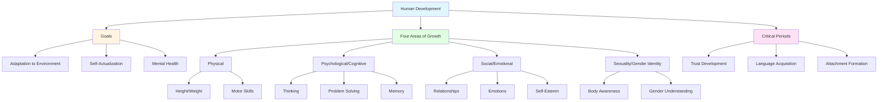

## Introduction

From the moment of conception to the day of death, humans undergo constant change and development. While some changes result from chance incidents and personal choices, the vast majority of life changes and stages are due to common biological and psychological factors—partly inherited and partly environmental—shared by all people.

**Development** refers to the biological and psychological changes that occur in human beings between birth and the end of adolescence, as individuals progress from dependency to increasing autonomy. These developmental changes may be strongly influenced by genetic and environmental factors during prenatal life and are part of the study of child development.

:::tip Key Concept
Development describes patterns of change over time, involving not just biological and physical aspects of growth, but also cognitive and social aspects related to development.
:::

---

## 1.0 What is Development?

### 1.1 Definition and Scope

Development encompasses:
- **Motor skills** and psychophysiological processes
- **Cognitive development**: Problem solving, moral understanding, conceptual understanding, language acquisition
- **Social, personality, and emotional development**
- **Self-concept** and identity formation

**Growth** is defined as an increase in size, while **development** is defined as a progression toward maturity. Development is a continuous process with competencies developing, disappearing, and reappearing at later ages.

:::info Example
Newborns can walk if held, but this ability disappears only to reappear at eight or ten months of age. This demonstrates the wave-like pattern of development.
:::

### 1.2 Goals of Development Changes

The primary goal of development is to **enable people to adapt to the environment** in which they live. Self-actualization is essential to achieve these changes.

**Key aspects:**
- **Mental health**: People who make good personal and social adjustments must have opportunities to express their interests and desires
- **Satisfaction**: Expression should give them satisfaction while conforming to accepted standards
- **Negative outcomes**: Lack of opportunities results in frustrations and generally negative attitudes toward people and life

---

## 2.0 Growth and Development

### 2.1 Understanding Growth

Growth refers to the development of children from birth to adolescence. The World Health Organization (WHO) coordinates international efforts to develop child growth standards for infants and young children (age 0-5 years).

**Growth Curve**: A statistical curve derived from plotting weight and height against chronological age for comparing an individual child's growth pattern with the average age of growth.

:::note Important
Personality is influenced by many factors involved in the development of a child. The strongest factor is society and the child's experiences in that society and environment.
:::

### 2.2 Factors Influencing Development

#### 1. **Societal Experiences**
Most children's learning comes from:
- Society and surroundings
- Personal experiences
- Family or neighborhood settings
- Spontaneous interactions

**Result**: Every child is different from every other child.

#### 2. **Cultural Factors**
Through various means, children are encouraged to embody the typical or ideal personality of their culture:
- Music and television
- Incidental remarks (overheard but hardly understood)
- Deliberate modeling and training

#### 3. **Biological Factors**
In addition to society and culture, biological factors play crucial roles in development as children grow through different stages.

---

---

## 3.0 Four Areas of Children's Growth

### 3.1 Physical Development

**Physical growth** is perhaps the most obvious developmental area.

**Key changes:**
- Growth in height and weight
- Appearance changes during puberty
- Development of physical abilities: crawling, walking, running, writing
- Motor coordination becomes more refined
- Ability to target accurately improves

:::example Real-World Application
A toddler progresses from crawling (8-10 months) to walking (12-15 months) to running (18-24 months), demonstrating the sequential nature of physical development.
:::

### 3.2 Psychological and Cognitive Development

Children develop psychologically and cognitively as their brains absorb and process information.

**Learning requirements:**
- Learn how to think purposefully
- Process and organize environmental information
- Solve problems
- Talk and communicate
- Complete mental tasks (remembering phone numbers, using computers)

### 3.3 Social and Emotional Development

Children learn how to function in social contexts.

**Key aspects:**
- Interacting with family, friends, teachers, employers
- Understanding their own feelings and others' emotions
- Dealing with strong emotions
- Developing self-esteem
- Figuring out identity
- Developing morality (distinguishing right from wrong)

:::tip Practical Insight
To function well as independent adults, children must develop a sense of self-esteem through the long process of identity formation.
:::

### 3.4 Sexuality and Gender Identity

This development is unique because it spans physical, psychological, and social channels.

**Early development:**
- Learning how bodies work and look
- Understanding what it means to be a boy or girl
- Recognizing gender differences

**Adolescence and puberty:**
- Continuing to learn how bodies work sexually
- Learning to handle sexuality responsibly
- Balancing sexual desires with appropriate behavior
- Deciding what masculinity or femininity means throughout the lifespan

---

## 4.0 Critical Periods During Development

### 4.1 Understanding Critical Periods

**Critical periods** (also called **difficult periods**) are specific times when children are particularly receptive to certain types of stimulation. Children who don't receive special stimulation during these periods may experience developmental delays.

### 4.2 Example: Trust Development

#### **Positive Scenario**
If parents are consistently:
- Loving and affectionate
- Providing care unconditionally

**Result**: The child learns to trust parents and, subsequently, other adults in the environment.

#### **Negative Scenario**
If the child is:
- Neglected and abused
- Not given care, affection, and love

**Result**: The child may develop distrust of parents, which transfers to other adults.

:::info Hope for Recovery
Even if a child's development has been adversely affected, if given opportunities to be with foster parents who care and love the child, the child can develop the capacity to trust other adults over time.
:::

### 4.3 Theoretical Perspectives

Different theorists have varying conclusions about child development:

**Continuous Development**
- Some believe children develop smoothly and continuously

**Stage-Based Development**
- Others believe children develop discretely in a series of stages
- Each stage is fairly stable
- Development involves qualitative changes

---

## Self-Assessment Questions

1. **Define development and explain how it differs from growth.**
2. **What are the four main areas of children's growth? Provide examples for each.**
3. **Explain the concept of critical periods with reference to trust development.**
4. **What are the goals of developmental changes?**
5. **How do cultural factors influence child development?**

---

## Memory Aids

### **4 P's of Development**
- **P**hysical: Body changes and motor skills
- **P**sychological/Cognitive: Thinking and learning
- **P**ersonality/Social: Relationships and emotions
- **P**ersonal Identity: Sexuality and gender

### **Critical Period Reminder**
**"TRUST"**
- **T**ime-sensitive receptivity
- **R**ecovery is possible with intervention
- **U**nconditional love builds foundation
- **S**timulation during critical windows
- **T**ransfers to other relationships

---

## Practical Applications

### For Parents and Educators

1. **Physical Development**
   - Provide age-appropriate physical activities
   - Ensure proper nutrition for growth
   - Monitor developmental milestones

2. **Cognitive Development**
   - Create stimulating learning environments
   - Encourage problem-solving activities
   - Support language development

3. **Social-Emotional Development**
   - Model healthy relationships
   - Teach emotion regulation
   - Build self-esteem through positive reinforcement

4. **During Critical Periods**
   - Be aware of developmental windows
   - Provide consistent love and care
   - Intervene early if development seems delayed

---

**Source PDF**: 
- 📄 [Block-1/Unit-1.pdf - Pages 5-10](/pdfs/MPC-002%20Life%20Span%20Psychology/Block-1/Unit-1.pdf)
- 📚 MPC-002 Life Span Psychology

---

## External Resources

### 📚 Research Papers & Academic Sources

1. **Critical Periods in Human Neurodevelopment (2024)**
   - Herzberg et al., "Measuring neuroplasticity in human development"
   - *Neuropsychopharmacology*, 2024
   - [Research Link](https://www.nature.com/articles/s41386-025-02246-5)
   - Explores hierarchical critical periods across sensorimotor and association cortical regions

2. **Critical Periods and Diseases of Aging (2003)**
   - "Critical periods in human growth and their relationship to diseases of aging"
   - [PubMed](https://pubmed.ncbi.nlm.nih.gov/12653312/)
   - Lifespan perspective on accumulating risks from prenatal life onward

### 🌐 Educational Websites

1. **Critical Period - Wikipedia**
   - Comprehensive overview of critical periods in development
   - [https://en.wikipedia.org/wiki/Critical_period](https://en.wikipedia.org/wiki/Critical_period)
   - Covers neurobiological mechanisms, examples, and research

2. **Critical Period Development - Simply Psychology**
   - [Critical Period Explanation](https://www.simplypsychology.org/critical-period.html)
   - Covers language development, attachment, and brain plasticity

### 🎥 Educational Videos

1. **The Growth of Knowledge - Crash Course Psychology #18**
   - Covers cognitive development, Piaget's stages, Vygotsky's scaffolding
   - [YouTube - Crash Course](https://www.youtube.com/watch?v=8nz2dtv--ok)
   - Duration: ~10 minutes

2. **Child Development - MIT OpenCourseWare**
   - Professor lecture on developmental milestones and theories
   - [MIT OCW](https://ocw.mit.edu/courses/9-00sc-introduction-to-psychology-fall-2011/pages/child-development/)
   - Includes lecture notes and assignments

### 📊 Interactive Tools

1. **Critical Periods of Development Tool - MotherToBaby**
   - Interactive chart showing sensitive periods in prenatal development
   - [https://mothertobaby.org/critical-periods-pregnancy-development-tool/](https://mothertobaby.org/critical-periods-pregnancy-development-tool/)

---

## Recent Research Insights (2023-2024)

### Hierarchical Critical Periods Framework

Recent 2024 research by Herzberg et al. in *Neuropsychopharmacology* has revolutionized our understanding of critical periods. Rather than viewing them as isolated windows, scientists now recognize:

- **Hierarchical Organization**: Critical periods unfold sequentially from sensorimotor to association cortices
- **Multiple Timescales**: Different brain regions have different critical period timing
- **Clinical Implications**: Understanding these windows can inform timing of interventions for neurodevelopmental conditions

:::tip 2024 Research Finding
New evidence suggests critical periods in human development extend well into adolescence and even early adulthood for higher-order cognitive functions, challenging earlier views that plasticity dramatically decreases after early childhood.
:::

### Environmental Impact on Development

The 2024 UNDP Human Development Report highlights how global inequalities and environmental factors profoundly shape developmental trajectories, with half of the world's poorest countries remaining below pre-crisis development levels.

---

## Summary

Development is a complex, multifaceted process involving biological and psychological changes from conception to death. It encompasses physical, cognitive, social-emotional, and gender identity development. Understanding the goals of development, the four areas of growth, and the importance of critical periods helps parents, educators, and professionals support optimal development. Recent 2024 research reveals that critical periods follow hierarchical patterns and extend into adolescence. While development follows general patterns, it's influenced by genetic, environmental, cultural, and societal factors, making each individual's developmental journey unique.
