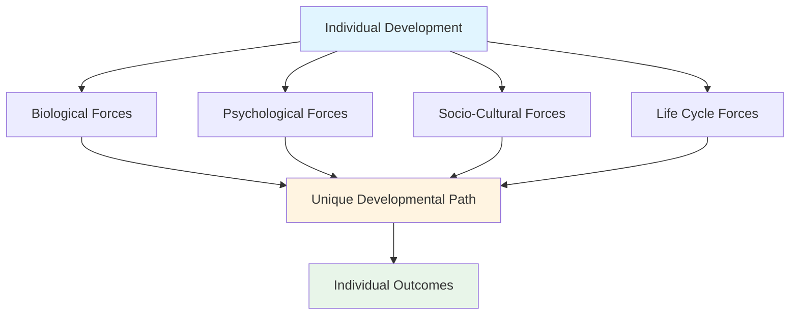
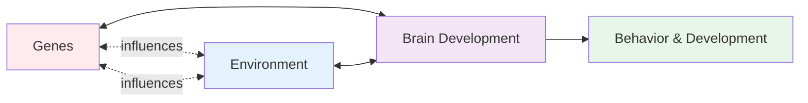
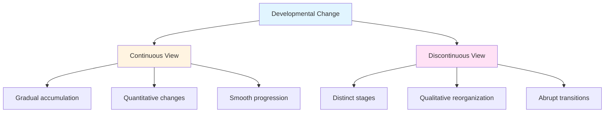

## Introduction

Life span refers to the ongoing process that we go through while growing up. It is the period of time from conception extending to death. Studying life span development is essential because it helps in describing and explaining the mysteries of human development, including issues such as the extent to which development occurs through gradual accumulation of knowledge versus stage-like development.

:::tip Key Definition
**Life span development** is defined as the pattern of change that begins at conception and continues through the life cycle. It encompasses biological, psychological, social, and cognitive transformations across all stages of life.
:::

The life-span perspective revolutionized developmental psychology by challenging the traditional view that development primarily occurs in childhood. Paul Baltes, a pioneering German psychologist, established this comprehensive framework that views development as a lifelong process, emphasizing that no single age period dominates human development.

---

## 1.0 What is Life Span Development?

### 1.1 Definitions and Scope

**Comprehensive Definition**: Life span development is a methodical, intra-individual change associated with progressions corresponding to age. The development progresses in a manner implicating the level of functioning.

**Life-span developmental psychology** involves the examination of both constancy and change in human behavior across the entire life span—from conception to death (Baltes, 1987). This field represents an overarching framework that considers individual development (ontogenesis) across all ages, recognizing that development doesn't stop at adolescence or young adulthood.

### 1.2 Baltes' Life-Span Perspective: Core Principles

Paul Baltes identified six fundamental characteristics that define the life-span perspective:

#### **1. Development is Lifelong**
- No single age period dominates development
- Growth and decline occur throughout life
- New developmental acquisitions can emerge at any point

#### **2. Development is Multidirectional**
- Development doesn't follow a single linear path
- Growth (gain) and decline (loss) occur simultaneously
- Different abilities may peak at different ages
- Example: While reaction time may decline in older adults, wisdom and emotional regulation often increase

#### **3. Development is Multidimensional**
- Occurs across multiple domains simultaneously:
  - **Biological**: Physical changes, brain maturation
  - **Cognitive**: Intelligence, memory, problem-solving
  - **Socioemotional**: Relationships, personality, emotions

#### **4. Development is Plastic**
- Plasticity refers to the capacity for change and malleability throughout life
- Brain plasticity continues into old age
- Skills can be learned and relearned at any age
- Environmental interventions can modify developmental trajectories

#### **5. Development is Contextual**
- Occurs within historical, cultural, and social contexts
- Three types of contextual influences (discussed below)
- Individual experiences shape unique developmental paths

#### **6. Development is Multidisciplinary**
- Requires perspectives from psychology, biology, sociology, anthropology, neuroscience
- Integration across disciplines provides comprehensive understanding

### 1.3 Domains of Development

Development occurs in interconnected domains:

| Domain | Key Changes | Examples |
|--------|-------------|----------|
| **Biological** | Physical being and health | Brain development, puberty, aging |
| **Cognitive** | Thought processes | Language, memory, problem-solving |
| **Socioemotional** | Relationships and emotions | Attachment, identity, emotional regulation |
| **Psychosocial** | Social interactions | Peer relationships, family dynamics |

:::note Important Perspective
Some developmental psychologists restrict the notion of development only to changes that lead to qualitative reorganization in the structure of a behavior, skill, or ability (Crain, 2000). However, the life-span perspective embraces both quantitative and qualitative changes.
:::

### 1.4 The Developmental Process

The progression initiates with the emergence of a fetus from a one-celled organism. As the unborn child enters the world, the environment begins to influence the child's development (Educational Foundation, 2001).

**Developmental Periods:**
- **Prenatal period**: Conception to birth
- **Infancy and toddlerhood**: Birth to 2-3 years
- **Early childhood**: 3-6 years
- **Middle childhood**: 6-12 years
- **Adolescence**: 12-20 years
- **Emerging adulthood**: 18-25 years (contemporary addition)
- **Early adulthood**: 20s-30s
- **Middle adulthood**: 40s-60s
- **Late adulthood**: 60+ years

**Transition Characteristics:**
- Each transition involves necessary changes in the character of the individual's life
- Transitions can take up to six years to complete
- Involve both losses and gains
- Require adaptation and reorganization

---

## 2.0 Four Interactive Forces Shaping Development

Baltes identified that human development is shaped by the combination of four interactive forces. These forces don't operate independently but interact dynamically to shape individual development.

### 2.1 Biological Forces

**Definition**: All genetic and health-related factors that influence development.

**Functions:**
- Provide raw materials (genetics, DNA)
- Set boundary conditions (health status, physical capabilities)
- Determine species-universal characteristics

**Examples:**
- Prenatal development and fetal programming
- Brain maturation and neuroplasticity
- Puberty and hormonal changes
- Menopause and reproductive changes
- Cardiovascular functioning across lifespan
- Impact of diet, exercise, and sleep
- Genetic predispositions to various conditions

:::example Real-World Application
A child's height potential is determined by genetic factors (biological force), but actual height achieved depends on nutrition and health during critical growth periods. Malnutrition during infancy can permanently affect growth trajectories, while adequate nutrition allows genetic potential to be realized.
:::

**Contemporary Research**: Recent 2024 neuroscience research examining 11,800 youth in the ABCD study found that brain structure (specifically left hippocampus size) interacts with social environments to influence depression risk, demonstrating the complex interplay of biological and environmental factors.

### 2.2 Psychological Forces

**Definition**: All internal perceptual, cognitive, emotional, and personality factors that affect development.

**Components:**
- **Cognitive**: Intelligence, attention, memory, problem-solving
- **Emotional**: Self-regulation, emotional understanding
- **Personality**: Temperament, self-concept, self-esteem
- **Motivational**: Goals, aspirations, values

**Impact**: These internal factors shape how individuals:
- Perceive experiences
- Process information
- Respond to challenges
- Form relationships
- Navigate transitions

**Developmental Changes**: Psychological forces themselves develop across the lifespan. For example, emotional regulation abilities typically improve from childhood through middle adulthood, while processing speed may decline in later life.

### 2.3 Socio-Cultural Forces

**Definition**: Interpersonal, societal, cultural, and ethical factors that affect development.

**Key Aspects:**
- **Microsystem**: Immediate environment (family, peers, school)
- **Exosystem**: Indirect influences (parents' workplace, community resources)
- **Macrosystem**: Broader cultural values, economic conditions, policies
- **Chronosystem**: Historical time and social change

**Cultural Variations**: Development is deeply embedded in cultural context. What constitutes "normal" or "optimal" development varies significantly across cultures. For example:
- Independence vs. interdependence as developmental goals
- Timing of key transitions (marriage, parenthood)
- Value placed on different abilities (individual achievement vs. group harmony)

**Example**: Poverty as a socio-cultural force significantly impacts educational opportunities, health outcomes, access to resources, and developmental trajectories across multiple generations.

:::tip Understanding Interactions
No two individuals, even in the same family, experience these forces in the same way. Each person is a product of a unique combination of these forces interacting over time.
:::

### 2.4 Life Cycle Forces

**Definition**: Differences in how the same event affects people of different ages—the timing of experiences matters significantly.

**Key Principle**: The developmental meaning and impact of an event depends critically on when it occurs in the life course.

**Three Types of Influences** (Baltes, 1987):

#### **Normative Age-Graded Influences**
- Events and transitions strongly correlated with chronological age
- **Biological**: Puberty, menopause, general aging processes
- **Social**: Starting school, retirement, age-based social roles
- Relatively predictable and universal within cultures

#### **Normative History-Graded Influences**
- Events affecting entire cohorts born in the same time period
- **Examples**: Wars, economic depressions, pandemics, technological revolutions
- Create generational differences
- Historical research shows events like the Vietnam War and Great Depression significantly affected personality development of entire cohorts

#### **Nonnormative Influences**
- Unique, unpredictable life events
- **Examples**: Winning lottery, serious accidents, unexpected career changes
- High individual variability
- Can create critical turning points

**Examples of Life Cycle Effects:**
- **Losing a parent**:
  - Age 5: May struggle with concept of death, attachment disruption, developmental regression
  - Age 15: Identity formation challenges, increased responsibilities
  - Age 35: Grief while managing own family, potential role reversal
  - Age 65: Expected transition, reflection on relationship

- **Starting a career**:
  - Age 22: Expected transition, identity formation
  - Age 45: May involve major life reorganization, different motivations

- **Marriage**:
  - Age 20: Earlier identity integration with partner
  - Age 40: More established individual identities, different life priorities

---

## 3.0 Major Issues in Life Span Development

### 3.1 Nature vs. Nurture

**The Central Question**: Whether behavior is due to hereditary factors (nature) or environmental factors (nurture).

**Historical Context**: This debate is one of the oldest issues in both philosophy and psychology, concerning the relative contributions of inheritance and the environment. Plato emphasized innate knowledge, while Locke proposed the mind as a "blank slate."

#### **Modern Understanding: Gene-Environment Interaction**

Contemporary 2023 research in behavioral genetics reveals that distinguishing between nature and nurture is a major challenge because parents are the source of both DNA and rearing environment, making it difficult to separate these influences.

**Key Contemporary Concepts:**

1. **Gene-Environment Interaction**
   - Genes and environments interact and transact in particular domains
   - Same gene may have different effects in different environments
   - Example: A genetic predisposition to anxiety may only manifest in stressful environments

2. **Gene-Environment Correlation**
   - Individuals with certain genes often experience correlated environments
   - **Passive**: Parents provide both genes and environment
   - **Evocative**: Genetic characteristics evoke environmental responses
   - **Active**: Individuals select environments matching genetic predispositions

3. **Genetic Nurture**
   - Recent research shows parental genotypes can influence children through environmental pathways, not just genetic transmission
   - Parents' genes affect the environment they create for children

4. **Epigenetics**
   - Life experiences can affect gene expression
   - Nature is vulnerable to nurture
   - Environmental factors can turn genes "on" or "off"

**Current Scientific Consensus:**
- Both genetic traits and environmental circumstances are essential
- Neither nature nor nurture plays a more important role—they have a complex, interconnected relationship
- The amount of influence varies by trait, individual, and circumstance
- Focus has shifted from "which matters more" to "how do they interact"

**Examples:**

| Trait/Behavior | Nature Contribution | Nurture Contribution | Interaction |
|----------------|---------------------|----------------------|-------------|
| Height | Strong genetic influence | Nutrition, health critical during growth | Genes set range; environment determines expression within range |
| Intelligence | Genetic component (~50%) | Education, stimulation, nutrition | Gene-environment correlations strong |
| Depression | Genetic vulnerability | Life stress, childhood adversity | Diathesis-stress model |
| ADHD | Strong genetic component | Environmental factors affect symptom expression | 2023 Norwegian study shows genetics predispose to ADHD, but environment significantly impacts functioning |

:::info Critical Insight
The National Research Council emphasizes that the inseparability of nature and nurture has profound implications for understanding human development. Beginning at conception, hereditary potential unfolds in concert with the environment.
:::

#### **Implications for Practice**

Modern understanding suggests practitioners must assess both the individual child and the environment to identify optimal child-environment fit for development:

1. **Assessment**: Evaluate biological predispositions AND environmental contexts
2. **Intervention**: Target gene-environment fit, not just individual or environment
3. **Prevention**: Recognize vulnerable individuals may need enhanced environmental support
4. **Policy**: Balance investments in individual capabilities and environmental enrichment

### 3.2 Continuity and Discontinuity

**Question**: Does development occur slowly and smoothly (continuously), or do changes happen in distinct stages (discontinuously)?

#### **Continuous Model**
**View**: Development is a relatively smooth, gradual process
- No sharp or distinct stages
- Gradual accumulation of behaviors, skills, or knowledge
- Quantitative changes (more of the same ability)
- Like a ramp—steady, gradual incline

**Examples:**
- Vocabulary growth (adding words continuously)
- Height increase in childhood
- Gradual improvements in memory capacity

**Theoretical Support**:
- Information processing theories
- Behavioral/learning theories
- Skill acquisition models

#### **Discontinuous Model**
**View**: Development occurs in a series of discrete stages
- Each stage is qualitatively different from previous
- New organizations emerge abruptly
- Clear transitions between stages
- Like stairs—distinct steps with landings

**Examples:**
- Piaget's cognitive stages (sensorimotor → preoperational → concrete → formal)
- Erikson's psychosocial stages
- Kohlberg's moral development stages

**Stage Characteristics:**
- Universal sequence (everyone progresses in same order)
- Qualitatively different thinking/behavior at each stage
- Stage transitions may be abrupt
- Earlier stages prerequisite for later stages

:::example Practical Example
**Continuous View**: Language development gradually improves from babbling (6 months) → simple words (12 months) → two-word phrases (18 months) → simple sentences (2 years) → complex sentences (3-4 years). Each stage builds smoothly on the previous.

**Discontinuous View**: Piaget argued cognitive development occurs in distinct, qualitatively different stages. A 6-year-old in the preoperational stage thinks fundamentally differently than an 8-year-old in the concrete operational stage—not just "thinking better," but thinking in a different way entirely.
:::

#### **Contemporary Resolution**

Most developmentalists now recognize both processes occur:
- **Microgenetic changes**: Continuous, gradual improvements
- **Macrogenetic changes**: Stage-like reorganizations
- Different domains may show different patterns
- Timing and rapidity of stage transitions varies individually

Baltes emphasized that developmental functions differ in onset, duration, termination, and directionality, supporting a more nuanced view that includes both continuous and discontinuous elements.

### 3.3 Stability and Change

**Central Question**: Do behaviors, traits, or characteristics remain stable over time, or do they change across the lifespan?

#### **Stability Position**
**Argument**: Early experiences create lasting patterns
- Personality traits show consistency
- Early attachment patterns predict later relationships
- Childhood temperament persists into adulthood
- "As the twig is bent, so grows the tree"

**Evidence for Stability:**
- Longitudinal studies showing trait consistency
- Attachment security correlates from infancy to adulthood
- IQ scores relatively stable after age 7
- Temperamental characteristics (shyness, activity level) persist

#### **Change Position**
**Argument**: People can and do change throughout life
- Life experiences reshape personality
- Therapy and intervention produce change
- Adult experiences matter as much as childhood
- Plasticity continues across lifespan

**Evidence for Change:**
- Personality maturation in adulthood (increased conscientiousness, agreeableness)
- Successful interventions modify behavior patterns
- Late-life changes in cognitive strategies
- Environmental changes produce behavioral changes

#### **Critical Periods vs. Sensitive Periods**

**Critical Periods**: Narrow time windows when specific experiences must occur
- More common in physical development (e.g., visual system development)
- Limited evidence in psychological development

**Sensitive Periods**: Optimal times for certain developments
- More flexibility than critical periods
- More common in psychological development
- Language acquisition, attachment formation

:::info Balanced Perspective
The life-span perspective emphasizes both stability and plasticity in development. Some characteristics show remarkable stability (e.g., intelligence, temperament), while others demonstrate considerable plasticity (e.g., expertise, emotion regulation).
:::

#### **Implications for Practice**

**Clinical Settings:**
- Early intervention important but not deterministic
- Change possible at any age with appropriate support
- Balance between respecting stability and encouraging growth

**Educational Settings:**
- Growth mindset: Abilities can be developed
- Recognize both stable traits and capacity for change
- Provide opportunities for development at all ages

**Policy:**
- Invest in early intervention (sensitive periods)
- Don't abandon investment in later interventions
- Recognize potential for rehabilitation and change

**Personal Development:**
- Some traits relatively stable (personality core)
- Skills, knowledge, emotional regulation can improve
- Never "too late" for meaningful change

---

## 4.0 Selective Optimization with Compensation (SOC)

Baltes developed the SOC model to describe how individuals adapt to age-related changes through orchestrated interaction of three processes:

### **Selection**
- Focus on high-priority goals and domains
- Let go of less important activities
- Adapt goals to changing capacities

### **Optimization**
- Practice and refine skills in selected domains
- Acquire new strategies and knowledge
- Maximize functioning in priority areas

### **Compensation**
- Find alternative means when preferred methods fail
- Use technology or environmental supports
- Recruit help from others

**Famous Example**: Pianist Arthur Rubinstein in old age:
- **Selection**: Reduced repertoire, focused on pieces he played best
- **Optimization**: Practiced selected pieces more
- **Compensation**: Played slower passages before fast ones to create contrast (making fast passages seem faster)

This model applies across the lifespan, not just aging. Even young adults select goals, optimize efforts, and compensate for limitations.

---

## Self-Assessment Questions

1. **Explain Baltes' six characteristics of life-span development with examples.**

2. **Describe the four interactive forces that shape human development. How do they interact to create unique developmental paths?**

3. **Compare and contrast the nature vs. nurture debate. What is the modern understanding based on recent research (2023-2024)?**

4. **Explain the difference between continuous and discontinuous models of development. Can both be valid?**

5. **Why is the stability vs. change issue important in developmental psychology? What are the practical implications?**

6. **How do life cycle forces demonstrate that timing matters in development? Give specific examples.**

7. **Distinguish between normative age-graded, normative history-graded, and nonnormative influences with examples from your own culture.**

8. **How does the concept of plasticity throughout the lifespan challenge traditional views of development?**

9. **Explain the Selective Optimization with Compensation model. How might it apply to a college student managing academic and social demands?**

10. **How do modern genetic concepts (epigenetics, gene-environment interaction) transform our understanding of nature vs. nurture?**

---

## Memory Aids

### **6 Characteristics of Life-Span Development: "LMMPMC"**
- **L**ifelong: Development never stops
- **M**ultidirectional: Gains and losses occur together
- **M**ultidimensional: Multiple domains (bio-psycho-social)
- **P**lastic: Capacity for change throughout life
- **M**ulticontextual: Embedded in contexts
- **C**ross-disciplinary: Multiple fields contribute

### **4 Forces Acronym: "BPSL"**
- **B**iological: Genes and health
- **P**sychological: Internal mental processes
- **S**ocio-cultural: Social and cultural context
- **L**ife cycle: Age-related timing effects

### **3 Major Issues: "NCS"**
- **N**ature vs. Nurture: Genes or environment?
- **C**ontinuity vs. Discontinuity: Smooth or stages?
- **S**tability vs. Change: Consistent or variable?

### **SOC Model: "Select, Optimize, Compensate"**
Remember elderly pianist: Select fewer pieces, Optimize through practice, Compensate with strategic techniques

### **3 Types of Influences: "Age, History, Individual"**
- **Age-graded**: Puberty, retirement (predictable by age)
- **History-graded**: Wars, pandemics (affects cohorts)
- **Nonnormative**: Accidents, windfalls (unique events)

---

## Practical Applications

### For Researchers
1. **Design**: Consider all four forces and their interactions
2. **Measurement**: Assess multiple domains and contexts
3. **Analysis**: Look for both continuity and discontinuity
4. **Interpretation**: Recognize historical and cultural embeddedness

### For Practitioners

#### **Clinical Settings**
- Assess biological, psychological, and social factors comprehensively
- Consider developmental timing of interventions (sensitive periods)
- Recognize both stability (core personality) and potential for change (skills, coping)
- Evaluate gene-environment fit, not just individual pathology

#### **Educational Settings**
- Provide age-appropriate challenges across lifespan
- Create culturally responsive environments
- Support both continuous learning and stage transitions
- Recognize plasticity: learning possible at all ages

#### **Policy Making**
- Consider multiple forces affecting populations
- Recognize critical and sensitive periods for intervention
- Balance nature and nurture in program design
- Invest across the lifespan, not just early childhood

### For Individuals

**Self-Understanding:**
- Recognize your development as influenced by multiple forces
- Understand timing effects on your experiences
- Appreciate both your stable characteristics and capacity for change

**Personal Growth:**
- Apply SOC model: Select priorities, Optimize efforts, Compensate for limitations
- Recognize plasticity: Never too late for meaningful change
- Understand that your genes interact with your choices and environment

---

## Extended Learning Resources

### Research Papers

1. **Baltes, P. B. (1987).** [Theoretical Propositions of Life-Span Developmental Psychology: On the Dynamics Between Growth and Decline](https://www.imprs-life.mpg.de/25277/022_baltes_1987.pdf). *Developmental Psychology, 23*(5), 611-626.
   - Foundational paper on life-span perspective

2. **McAdams, T. A., et al. (2023).** [Annual Research Review: Towards a Deeper Understanding of Nature and Nurture](https://pmc.ncbi.nlm.nih.gov/articles/PMC10952916/). *Journal of Child Psychology and Psychiatry.*
   - Contemporary understanding of gene-environment interaction

3. **Northwestern University Research (2024).** [Nature vs. Nurture: The Interplay Between Mind and Environment](https://news.northwestern.edu/stories/2024/august/depression-amplified-in-difficult-environments-for-youth-with-a-larger-left-hippocampus-study-finds/)
   - Brain structure × environment interactions in adolescent depression

### Educational Videos

1. **Lifespan Development Lecture Series** - [Full Course on YouTube](https://www.classcentral.com/course/youtube-lifespan-development-lectures-90935)
   - Comprehensive video lectures covering conception to death

2. **MIT OpenCourseWare** - [Introduction to Psychology: Child Development](https://ocw.mit.edu/courses/9-00sc-introduction-to-psychology-fall-2011/pages/child-development/)
   - Academic-level content on developmental psychology

### Wikipedia Resources

1. [Paul Baltes](https://en.wikipedia.org/wiki/Paul_Baltes) - Biography and contributions to life-span psychology

2. [Nature versus Nurture](https://en.wikipedia.org/wiki/Nature_versus_nurture) - Comprehensive overview of the debate

### Interactive Resources

1. [Lumen Learning: Lifespan Development](https://lumenlearning.com/courses/lifespan-development/)
   - Interactive course materials with assessments

2. [Khan Academy: Human Development](https://www.khanacademy.org/science/health-and-medicine/mental-health)
   - Free educational videos and practice exercises

---

**Source PDFs**: 
- 📄 [Block-1/Unit-1.pdf - Pages 8-12](/pdfs/MPC-002%20Life%20Span%20Psychology/Block-1/Unit-1.pdf)
- 📚 MPC-002 Life Span Psychology

---

## Summary

The life-span perspective, pioneered by Paul Baltes, revolutionized developmental psychology by viewing development as a lifelong process characterized by six key features: it is lifelong, multidirectional, multidimensional, plastic, contextual, and multidisciplinary. Four interactive forces—biological, psychological, socio-cultural, and life cycle—shape individual development in unique ways through complex interactions rather than simple additive effects.

Three major theoretical issues continue to guide research and practice: the nature versus nurture debate (now understood as gene-environment interaction), continuity versus discontinuity (recognizing both processes occur), and stability versus change (balancing consistency with plasticity). Modern research, particularly from 2023-2024 studies, emphasizes that development results from dynamic interactions between genes and environments, with neither deterministic.

The Selective Optimization with Compensation model illustrates how individuals adapt to developmental changes across the lifespan by selecting priorities, optimizing performance in chosen domains, and compensating for limitations. Understanding these perspectives helps professionals support optimal development while recognizing both universal patterns and individual differences, emphasizing that meaningful change and growth remain possible throughout life.
