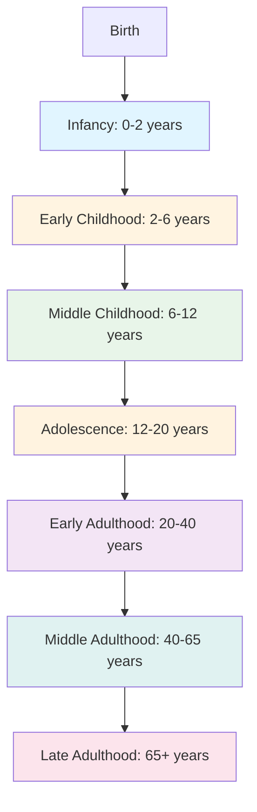
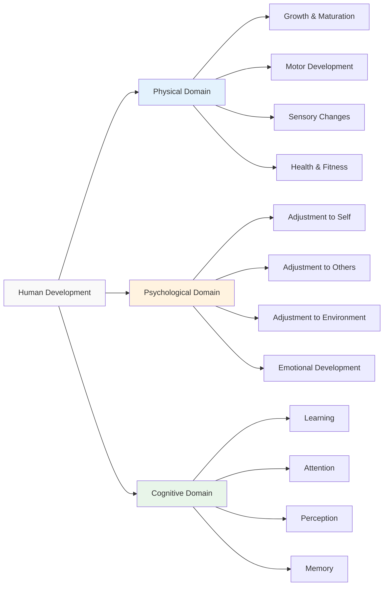
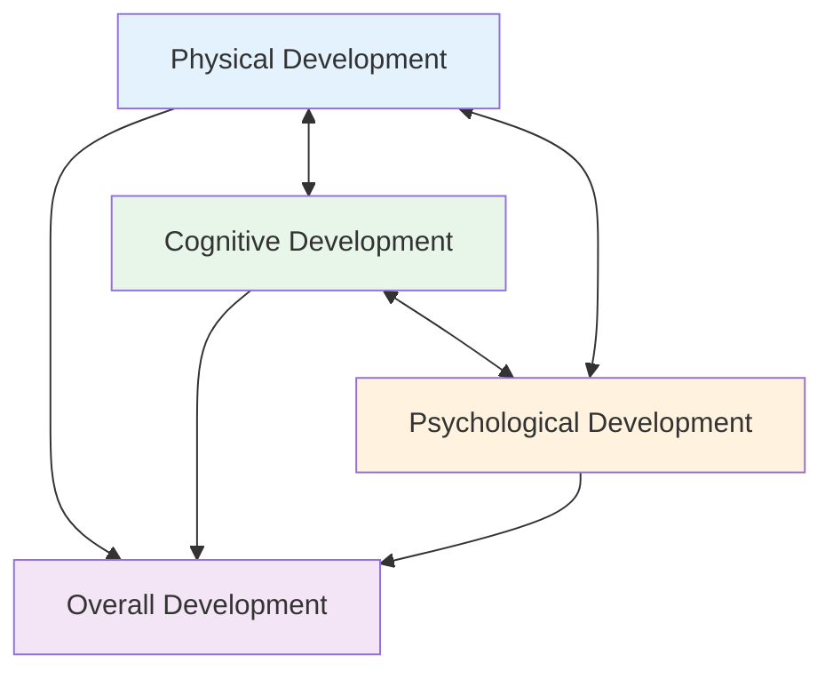

## Introduction

Individuals pass through various stages throughout their life, moving systematically through a series of phases toward some form of adult status. This movement involves changes in intellectual and physical powers as well as the impact of life events and experiences. Understanding these stages and the domains through which development occurs is essential for comprehending the complete picture of human development.

The study of developmental stages has evolved significantly since [Erik Erikson's pioneering work](https://en.wikipedia.org/wiki/Erikson%27s_stages_of_psychosocial_development) on psychosocial development, and contemporary research continues to refine our understanding of how individuals navigate life transitions. Recent neuroscience research has revealed that [brain development continues well into the mid-20s](https://www.ncbi.nlm.nih.gov/pmc/articles/PMC2892678/), challenging traditional views of when adulthood truly begins.

The [life-span developmental approach](https://en.wikipedia.org/wiki/Developmental_psychology#Life-span_developmental_perspective), pioneered by Paul Baltes and colleagues, emphasizes that development is a lifelong process characterized by multidirectionality, plasticity, and contextual influences. This perspective has transformed how we understand human change across the entire lifespan (Baltes et al., 2006).

:::tip Key Concept
Developmental stages are often defined by **milestones**—specific accomplishments that mark progress, such as walking in infancy, entering school in early childhood, or achieving career stability in adulthood. These milestones serve as markers for typical development and help identify when intervention may be needed.
:::

---

## Educational Video: Life-Span Development Overview

<iframe width="560" height="315" src="https://www.youtube.com/embed/4_sLMK4o_E0" title="Life-Span Development" frameborder="0" allow="accelerometer; autoplay; clipboard-write; encrypted-media; gyroscope; picture-in-picture" allowfullscreen></iframe>

*MIT OpenCourseWare: Introduction to Human Development - provides comprehensive overview of developmental stages and theories*

---

## 1.0 Understanding Developmental Stages

### 1.1 What are Milestones?

A **milestone** refers to development that has to take place according to the age of the child. The [CDC's developmental milestones framework](https://www.cdc.gov/ncbddd/actearly/milestones/index.html) provides evidence-based guidelines for tracking typical development and identifying potential delays.

**Examples of Age-Related Milestones:**
- **Motor Development**: Almost all children start standing and walking at age 1 year and older
- **Language Development**: Most children say a few words by 1.5 to 2 years
- **Social Development**: Children typically enter school around age 5-6
- **Cognitive Development**: Abstract reasoning emerges during adolescence (ages 11-12)
- **Identity Development**: Consolidation of personal identity occurs in late adolescence/early adulthood

**Significance**: Successfully passing a developmental stage is indicated by the child mastering the developmental tasks of that particular period. [Robert Havighurst's developmental tasks theory](https://en.wikipedia.org/wiki/Robert_J._Havighurst#Developmental_tasks) emphasizes that each life stage presents specific challenges that must be navigated for healthy development.

:::note Important Research Finding
Recent longitudinal research (Petersen et al., 2023) demonstrates that milestone achievement shows considerable individual variation while maintaining predictable sequences. The [National Institute of Child Health and Human Development](https://www.nichd.nih.gov/health/topics/child-development) emphasizes that children develop at different rates, and slight variations from typical timelines don't necessarily indicate problems.
:::

### 1.2 Continuity and Discontinuity in Development

Development can be viewed through two complementary lenses:

**Continuous Development**: 
- Gradual, incremental changes over time
- Like a ramp—smooth and ongoing
- Example: Vocabulary growth throughout life
- Supported by information-processing theories

**Discontinuous Development**:
- Distinct stages with qualitative changes
- Like stairs—clear steps between stages
- Example: Piaget's stages of cognitive development
- Each stage represents fundamentally different ways of thinking

:::example Real-World Application
Consider learning to ride a bicycle: The physical skills develop gradually (continuous), but the moment of mastering balance represents a qualitative shift (discontinuous). Both perspectives capture different aspects of the same developmental phenomenon.
:::

---

## 2.0 Main Developmental Periods: A Lifespan Framework

### 2.1 Childhood and Adolescence (Birth to Age 20)

This extended developmental period encompasses four sub-stages, each with distinct characteristics and challenges:

#### **Infancy (0-2 years)**

**Key Developments:**
- Rapid brain growth: Brain reaches 60% of adult size by age 1
- Sensorimotor intelligence (Piaget)
- Attachment formation with caregivers
- Basic trust vs. mistrust (Erikson)
- Explosive language acquisition begins around 12 months

**Critical Research**: Recent studies show that [early attachment quality predicts social competence](https://srcd.onlinelibrary.wiley.com/doi/10.1111/cdev.13606) decades later (Groh et al., 2022).

#### **Early Childhood (2-6 years)**

**Key Characteristics:**
- Preoperational thinking emerges
- Language explosion: 50 words at age 2 to 10,000+ by age 6
- Initiative vs. guilt (Erikson)
- Theory of mind develops (understanding others' mental states)
- Self-concept formation begins

**Practical Significance**: This period is crucial for school readiness, with executive function skills (self-regulation, working memory, cognitive flexibility) predicting academic success more strongly than IQ (Blair & Raver, 2015).

#### **Middle Childhood (6-12 years)**

**Key Characteristics:**
- Concrete operational thinking (Piaget)
- Industry vs. inferiority (Erikson)
- Peer relationships gain importance
- Academic skills consolidation
- Moral reasoning develops (Kohlberg's conventional level)
- Self-esteem becomes more differentiated

**Social Context**: [Research on peer relationships](https://www.sciencedirect.com/science/article/abs/pii/S0272735820300337) shows that friendship quality during middle childhood predicts mental health outcomes in adolescence and adulthood (Bagwell & Bukowski, 2018).

#### **Adolescence (12-20 years)**

**Key Characteristics:**
- Puberty and rapid physical changes
- Formal operational thinking emerges
- Identity vs. role confusion (Erikson)
- Increased risk-taking behavior
- Peer influence peaks
- Abstract reasoning and metacognition
- Preparation for independence

**Neuroscience Insight**: The [adolescent brain undergoes significant reorganization](https://www.nature.com/articles/nrn2897), with the prefrontal cortex (responsible for planning and impulse control) developing last. This explains the "maturity gap" where adolescents have adult desires but immature self-regulation (Steinberg, 2014).

:::example Real-World Application
During adolescence, individuals face the challenge of identity formation while managing rapid physical changes and increasing social complexity. The rise of social media has added new dimensions to this developmental period, with research showing both opportunities for connection and risks for mental health (Orben, 2020).
:::

### 2.2 Early Adulthood (Age 20 to 40)

**Emerging Adulthood (20-29)**: Jeffrey Arnett (2000) identified this as a distinct period characterized by:
- Identity exploration in love, work, and worldviews
- Instability in residence, relationships, and work
- Self-focus and freedom to make independent decisions
- Feeling "in-between"—neither adolescent nor fully adult
- Sense of possibilities and optimism

**Established Adulthood (30-40)**:

**Key Characteristics:**
- Peak physical capabilities
- Intimacy vs. isolation (Erikson)
- Career establishment and advancement
- Intimate relationship formation and maintenance
- Potential parenthood
- Economic independence
- Identity consolidation

**Major Challenges:**
- Balancing work and relationships
- Achieving financial stability
- Establishing life direction
- Managing competing demands
- [Work-family conflict](https://psycnet.apa.org/record/2005-06139-001) becomes prominent

**Contemporary Research**: A 2023 longitudinal study found that [life satisfaction during early adulthood](https://www.apa.org/pubs/journals/releases/dev-dev0001505.pdf) is most strongly predicted by quality of relationships, sense of purpose, and work engagement—not income or status (Luhmann et al., 2023).

:::tip Clinical Application
Mental health professionals recognize early adulthood as a critical period for intervention, as many psychological disorders first emerge during this time. Early identification and treatment can significantly alter life trajectories.
:::

### 2.3 Middle Adulthood (Age 40 to 65)

**Key Characteristics:**
- Generativity vs. stagnation (Erikson)
- Career peak or redirection
- Parenting of adolescents or young adults
- Care for aging parents ("sandwich generation")
- Physical changes: menopause, decreased metabolism, vision changes
- Reflection on life accomplishments
- Potential for midlife transitions
- Wisdom accumulation begins

**Unique Aspects:**
- **"Sandwich generation" responsibilities**: Managing dual caregiving roles
- **Career maintenance or change**: Balancing experience with evolving job markets
- **Preparation for retirement**: Financial and psychological planning
- **Reassessment of goals and priorities**: The "midlife review"

**Midlife Crisis Myth**: Research shows that the [notion of a universal midlife crisis](https://www.apa.org/monitor/julaug99/midlife) is largely mythical. Most people navigate middle age successfully, though some do experience significant transitions (Lachman, 2004).

**Recent Research**: Studies indicate that [psychological well-being often peaks](https://www.pnas.org/doi/10.1073/pnas.1000084107) in middle age, challenging negative stereotypes. Middle-aged adults report high life satisfaction, emotional stability, and sense of control (Stone et al., 2010).

### 2.4 Late Adulthood (Over 60 Years)

#### **Young-Old (60-75 years)**

**Characteristics:**
- Generally healthy and active
- Retirement transitions
- Grandparenting roles
- Continued productivity and engagement
- Some physical and cognitive changes
- Social network maintenance

#### **Old-Old (75-85 years)**

**Characteristics:**
- More noticeable physical limitations
- Potential chronic health conditions
- Adaptation to multiple losses
- Life review intensifies
- Increased dependence on support systems

#### **Oldest-Old (85+ years)**

**Characteristics:**
- Frailty becomes more common
- Heightened risk for dementia
- Requires more assistance with daily living
- Resilience and adaptability remain important
- Quality of life remains possible with support

**Erik Erikson's Final Stage**: **Integrity vs. Despair**
- Looking back on life with satisfaction or regret
- Accepting one's life story
- Wisdom as the culmination of development

:::note Important Demographic Shift
The population of adults 65+ is growing rapidly worldwide. The [World Health Organization](https://www.who.int/news-room/fact-sheets/detail/ageing-and-health) projects that by 2050, the global population aged 60+ will reach 2 billion, up from 900 million in 2015. This demographic shift necessitates new approaches to supporting healthy aging.
:::

**Successful Aging**: [Research by Rowe and Kahn](https://gerontologist.oxfordjournals.org/content/37/4/433) identifies three components:
1. Avoiding disease and disability
2. Maintaining high cognitive and physical function
3. Continuing engagement with life

Recent work emphasizes that [successful aging is multidimensional](https://www.annualreviews.org/doi/10.1146/annurev-psych-010419-050955) and should include subjective well-being, not just objective health measures (Cosco et al., 2014).

**Important Note**: Each major transition can take up to six years to complete, involving necessary changes in the character of the individual's life (Smith, 2009). These transition periods involve:
- Psychological adjustment to new roles
- Social network reorganization
- Identity reformulation
- Adaptation to changed circumstances

---

## 3.0 Three Domains of Human Development

### 3.1 Physical Domain

**Focus**: How humans grow and change physically at all stages of development

The physical domain encompasses all biological changes across the lifespan, from conception through old age. This domain is perhaps the most visible, with dramatic transformations occurring during childhood, adolescence, and late adulthood.

**Core Components:**

1. **Prenatal Development and Birth**
   - Rapid cell division and differentiation
   - Formation of major organ systems
   - Environmental influences (teratogens, nutrition)
   - Birth process and neonatal adaptation

2. **Infancy and Childhood Growth**
   - Most rapid growth period after birth
   - [Brain plasticity peaks](https://www.nature.com/articles/nrn2897) in early childhood
   - Motor milestones: rolling, sitting, crawling, walking
   - Fine motor skill refinement
   - Sensory system maturation

3. **Puberty and Adolescence**
   - [Hormonal changes trigger physical maturation](https://www.nichd.nih.gov/health/topics/puberty)
   - Primary sex characteristics develop
   - Secondary sex characteristics emerge
   - Growth spurt and body composition changes
   - Brain reorganization and pruning

4. **Adult Physical Changes**
   - Peak physical capacity in 20s-30s
   - Gradual decline in strength, speed, sensory acuity
   - Menopause in women (typically 45-55)
   - Andropause in men (gradual testosterone decline)
   - Bone density loss
   - Cardiovascular changes

5. **Aging and Late Adulthood**
   - Sensory declines (vision, hearing)
   - Reduced muscle mass and strength
   - Slower reaction times
   - Changes in sleep patterns
   - Increased health vulnerabilities
   - Potential for maintaining function with exercise

**Influenced By:**
- Genetic inheritance
- Nutrition and health behaviors
- Exercise and physical activity
- Environmental factors
- Socioeconomic status
- Access to healthcare

:::tip Clinical Relevance
Understanding physical development helps identify when interventions are needed for developmental delays or health concerns. Early detection of developmental delays can lead to interventions that significantly improve outcomes. The [American Academy of Pediatrics](https://www.aap.org/) recommends regular developmental screening at well-child visits.
:::

**Contemporary Research**: Recent studies show that [physical activity throughout life](https://www.who.int/news-room/fact-sheets/detail/physical-activity) not only maintains physical health but also supports cognitive function and mental health. The WHO recommends at least 150 minutes of moderate-intensity aerobic activity weekly for adults.

### 3.2 Psychological Domain

**Focus**: Adjustment of the individual to the environment and development of personality

**Core Principle**: Adjustment is essential for survival and well-being throughout the lifespan.

#### **Foundations of Adjustment**

**Definition of Adjustment**: The psychological process of adapting to and coping with changes in one's environment, including physical, social, and emotional challenges. Successful adjustment leads to well-being; difficulties in adjustment can lead to psychological distress.

#### **Key Adjustments in Early Life**

**Basic Survival Skills** (Infancy):
- Learning to suck and ingest food
- Learning to breathe independently
- Learning to eliminate
- Skills that were automatic in utero must now be learned
- Developing sleep-wake cycles
- Regulating body temperature

**Progressive Adjustments** (Early Childhood):
- Eating independently
- Toilet training—eliminating as required, not as desired
- Talking and walking
- Expressing needs and communicating effectively
- Self-regulation of emotions and behavior
- Following social rules

:::info Critical Insight
All these adjustments are necessary for survival and social integration. Success leads to **healthy adjustment** and competence; failure leads to **maladjustment** and potential psychological difficulties. The quality of early attachments significantly influences adjustment capacity (Bowlby, 1969).
:::

#### **Complexity of Adjustments Across the Lifespan**

**Three Key Areas:**

1. **Adjustment to Self**
   - Understanding and accepting oneself
   - Developing realistic self-concept
   - Managing emotions effectively
   - Building self-esteem and self-efficacy
   - Identity formation and consolidation
   - Accepting physical and psychological changes with age

2. **Adjustment to Others**
   - Forming and maintaining relationships
   - Developing empathy and perspective-taking
   - Managing conflicts constructively
   - Cooperating and collaborating
   - Navigating intimacy and commitment
   - Adapting to relationship changes (marriage, parenthood, loss)

3. **Adjustment to Environment**
   - Adapting to various contexts (home, school, work)
   - Managing transitions and changes
   - Coping with stress and challenges
   - Achieving independence and autonomy
   - Balancing multiple roles and demands
   - Adapting to life changes (retirement, health changes)

**Developmental Pattern:**
- Adjustments become increasingly complex as individuals develop
- Each life stage presents unique adjustment challenges
- **Success = Healthy adjustment, competence, well-being**
- **Failure = Maladjustment, distress, dysfunction**

:::example Case Study: Adjustment in Adolescence
Consider a 15-year-old navigating multiple adjustments: physical changes (puberty), social challenges (peer pressure, dating), academic demands (preparing for college), and identity questions ("Who am I?"). Success requires adjusting to self (accepting body changes), to others (maintaining friendships while individuating), and to environment (balancing school, family, and social demands). Failure in any domain can cascade to others.
:::

#### **Personality Development**

**Definition**: Personality comprises the characteristic patterns of thoughts, feelings, and behaviors that make individuals unique. It develops through:
- Genetic predispositions (temperament)
- Environmental influences (family, culture, experiences)
- Person-environment interactions
- Conscious choices and self-direction

**Major Theories:**
- **Psychoanalytic**: Freud's psychosexual stages, Erikson's psychosocial stages
- **Trait**: Big Five personality factors (OCEAN)
- **Humanistic**: Self-actualization (Maslow, Rogers)
- **Social-Cognitive**: Bandura's reciprocal determinism

**Contemporary Understanding**: [Research shows](https://www.annualreviews.org/doi/10.1146/annurev-psych-020821-114927) that personality continues to develop and change across the lifespan, with most people becoming more agreeable, conscientious, and emotionally stable with age (Roberts & Mroczek, 2008).

### 3.3 Cognitive Domain

**Focus**: Mental processes including learning, attention, perception, memory, reasoning, and problem-solving

The cognitive domain encompasses all mental processes that allow us to know, understand, and interact with the world. [Cognitive development](https://en.wikipedia.org/wiki/Cognitive_development) follows predictable patterns but also shows considerable individual variation.

**Key Components:**

#### **1. Learning**
- **Definition**: Relatively permanent change in behavior resulting from experience
- **Manner of learning**: Classical conditioning, operant conditioning, observational learning
- **Rate of progress**: Individual differences in learning speed
- **Learning strategies**: Evolve from simple to complex across development

**Developmental Changes:**
- **Infancy**: Habituation, classical and operant conditioning
- **Childhood**: Observational learning, strategy development
- **Adolescence**: Self-directed learning, metacognition
- **Adulthood**: Expertise development, compensatory strategies
- **Late Adulthood**: Wisdom, selective optimization

#### **2. Attention**
- **Selective attention**: Focusing on relevant information while ignoring distractions
- **Sustained attention**: Maintaining focus over time
- **Divided attention**: Multitasking capabilities
- **Attention control**: Executive function that improves with age and experience

**Developmental Trajectory:**
- Infants: Brief attention spans, easily distracted
- Children: Gradual improvement in sustained attention
- Adolescents: Adult-like attention control in optimal conditions
- Adults: Peak attention abilities
- Older Adults: Some decline in divided attention, maintained selective attention

**Contemporary Issue**: [Digital technology impacts attention](https://www.apa.org/monitor/2019/01/ce-corner-technology), with concerns about shortened attention spans, particularly in younger generations (Carr, 2010).

#### **3. Perception**
- **Definition**: Interpreting sensory information to understand the world
- **Perceptual development**: From basic sensory detection to complex interpretation
- **Integration of senses**: Multisensory processing improves with development
- **Perceptual biases**: Develop based on experience and expectations

**Key Developments:**
- Newborns: Preference for faces, patterns
- Infants: Depth perception (visual cliff), object perception
- Children: Improved integration of sensory information
- Adults: Experience-based perceptual expertise
- Older Adults: Compensatory strategies for sensory decline

#### **4. Memory**

**Types of Memory:**
- **Sensory Memory**: Brief storage of sensory information (< 1 second)
- **Working Memory**: Active manipulation of information (Baddeley's model)
- **Long-Term Memory**: 
  - Explicit (declarative): Episodic and semantic memory
  - Implicit (procedural): Skills, habits, conditioning

**Developmental Changes:**
- **Infancy**: Basic recognition memory, deferred imitation
- **Childhood**: Expanding working memory capacity, developing memory strategies
- **Adolescence**: Adult-like memory systems, metacognitive awareness
- **Adulthood**: Peak memory performance, domain-specific expertise
- **Older Adulthood**: Decline in episodic memory, preserved semantic memory and procedural memory

**Memory Strategies:**
- Rehearsal, organization, elaboration
- Mnemonics and memory aids
- Metamemory: Understanding one's own memory

:::tip Research Insight
Recent research (Nyberg et al., 2023) shows that [memory decline is not inevitable](https://www.nature.com/articles/s41583-023-00724-9) with aging. Cognitive training, physical exercise, social engagement, and lifelong learning can maintain and even improve memory function in older adults.
:::

**Importance**: Progress in school and home indicates how well these cognitive components function and improve. [Cognitive development](https://www.simplypsychology.org/piaget.html) follows stage-like progressions (Piaget) but also shows continuous improvements in processing speed and efficiency (information processing theory).

:::example Educational Application
A child's academic performance reflects not just intelligence, but the integrated functioning of learning (acquiring new information), attention (focusing during lessons), perception (interpreting teacher instructions), and memory (retaining and retrieving information). Deficits in any area can impact overall achievement.
:::

**Executive Functions**: Higher-order cognitive processes that emerge in childhood and mature through adolescence:
- **Inhibitory control**: Suppressing inappropriate responses
- **Working memory**: Holding and manipulating information
- **Cognitive flexibility**: Shifting between tasks or mental sets

These [executive functions are crucial](https://developingchild.harvard.edu/science/key-concepts/executive-function/) for academic success, self-regulation, and life outcomes (Diamond, 2013).

---

## 4.0 Domain Interdependence and Integration

### 4.1 The Interconnected Nature of Development

:::caution Critical Understanding
All domains operate together and are profoundly affected by each other (Boyd & Bee, 2006). Changes in one domain inevitably influence the others, creating complex patterns of development.
:::

**Examples of Interdependence:**

1. **Physical → Psychological → Cognitive → Social**
   - **Puberty** (physical) affects **self-concept and mood** (psychological), enables **abstract thinking about self and identity** (cognitive), and transforms **peer relationships and social status** (social)
   - Hormonal changes drive physical maturation
   - Physical changes affect self-image and emotional regulation
   - New cognitive abilities enable identity exploration
   - Social relationships reorganize around dating and intimacy

2. **Cognitive → Social → Psychological → Physical**
   - **Development of theory of mind** (cognitive) enables **complex social interactions** (social), which support **emotional regulation** (psychological), and stress from social challenges can affect **physical health and sleep** (physical)
   - Understanding others' mental states enables cooperation
   - Social success builds self-esteem
   - Emotional well-being supports immune function

3. **Psychological → Physical → Cognitive**
   - **Depression** (psychological) leads to **changes in sleep, appetite, and energy** (physical), which impair **concentration, memory, and decision-making** (cognitive)
   - Emotional distress affects neurotransmitter function
   - Physical symptoms emerge (fatigue, pain)
   - Cognitive abilities are compromised

4. **Social → All Domains**
   - **Social isolation or loneliness** affects **physical health** (increased inflammation, cardiovascular risk), **psychological well-being** (depression, anxiety), and **cognitive function** (accelerated cognitive decline)

### 4.2 Contextual Influences on Development

Development occurs within multiple nested contexts ([Bronfenbrenner's Ecological Systems Theory](https://en.wikipedia.org/wiki/Ecological_systems_theory)):

**Microsystem**: Immediate environments (family, school, peers)
**Mesosystem**: Connections between microsystems
**Exosystem**: External environments that indirectly affect the individual
**Macrosystem**: Cultural values, laws, customs
**Chronosystem**: Historical time and life transitions

:::example Real-World Application
Consider a child experiencing parental divorce (microsystem change). This affects school performance (mesosystem), is influenced by legal custody arrangements (exosystem), occurs within cultural attitudes about divorce (macrosystem), and has different impacts depending on the child's age and developmental stage (chronosystem).
:::

**Contemporary Research**: A 2024 meta-analysis found that [socioeconomic status affects development](https://www.apa.org/pubs/journals/releases/dev-dev0001505.pdf) across all domains, with effects mediated by access to resources, parental stress, and environmental quality (Duncan et al., 2024). Interventions targeting multiple systems show the best outcomes.

---

## 5.0 Practical Applications and Implications

### For Parents and Educators

**Understanding Stages:**
1. **Recognize age-appropriate expectations**
   - Avoid developmentally inappropriate demands
   - Understand typical vs. atypical development
   - Appreciate individual variation within normal ranges

2. **Support transitions between stages**
   - Prepare children/adolescents for upcoming changes
   - Provide scaffolding during transitions
   - Allow time for adjustment (up to 6 years)
   - Maintain stable support systems during change

3. **Provide scaffolding for milestone achievement**
   - Offer challenges slightly above current level (zone of proximal development)
   - Break complex skills into manageable steps
   - Provide guidance and support, then gradually withdraw
   - Celebrate progress and effort, not just outcomes

4. **Be patient during transition periods**
   - Understand that regression may occur during transitions
   - Maintain consistency and support
   - Recognize that adjustment takes time
   - Seek professional help if prolonged difficulties occur

**Supporting Domain Development:**

1. **Physical Domain**
   - Provide opportunities for physical activity and motor skill development
   - Ensure proper nutrition at all life stages
   - Monitor developmental milestones and address concerns early
   - Adapt environment for physical changes (e.g., safety modifications for older adults)
   - Model healthy behaviors (exercise, sleep, nutrition)

2. **Psychological Domain**
   - Teach adjustment skills progressively
   - Model healthy coping strategies and emotional regulation
   - Support independence development while maintaining secure base
   - Address maladjustment early through intervention
   - Foster positive self-concept and resilience
   - Validate emotions while teaching regulation

3. **Cognitive Domain**
   - Create stimulating learning environments rich in language and exploration
   - Teach learning strategies explicitly (note-taking, organization, study skills)
   - Support attention development through scaffolding and reducing distractions
   - Build memory skills through encoding strategies and retrieval practice
   - Encourage curiosity and love of learning
   - Adapt teaching to individual learning styles and needs

### For Mental Health Professionals

1. **Assessment**
   - Consider all three domains in comprehensive assessment
   - Recognize how domains interact and influence each other
   - Identify adjustment difficulties and their origins
   - Understand developmental context of presenting problems
   - Use developmentally appropriate assessment tools

2. **Intervention**
   - Address maladjustments early to prevent escalation
   - Support healthy adjustments across all domains
   - Recognize stage-specific challenges and resources
   - Build on developmental strengths and protective factors
   - Tailor interventions to developmental level
   - Involve family and social support systems

3. **Prevention**
   - Promote positive development through all stages
   - Educate about upcoming transitions
   - Build resilience and coping skills
   - Support optimal development across domains

### For Policy Makers

1. **Create developmentally appropriate policies**
   - Consider evidence on brain development (e.g., juvenile justice)
   - Support families during critical transition periods
   - Invest in early intervention programs
   - Promote lifelong learning and healthy aging

2. **Reduce disparities**
   - Address socioeconomic barriers to optimal development
   - Ensure access to healthcare, education, and support services
   - Recognize that development is shaped by context
   - Implement evidence-based programs

---

## Self-Assessment Questions

1. **What are developmental milestones? Provide specific examples for different age periods and explain their significance.**

2. **Describe the four main developmental periods and their key characteristics. How do recent theories like "emerging adulthood" modify traditional stage models?**

3. **Explain the physical domain of development and how it changes across the lifespan. What factors influence physical development?**

4. **What is meant by "adjustment" in the psychological domain? Why is it essential for healthy development? Provide examples of adjustments required at different life stages.**

5. **Describe the cognitive domain and its main components (learning, attention, perception, memory). How does each component change across the lifespan?**

6. **How do the different domains of development interact with each other? Provide at least three specific examples of domain interdependence.**

7. **Why might a transition between developmental periods take up to six years? What factors influence the length and difficulty of transitions?**

8. **Compare and contrast continuous and discontinuous views of development. Which view do you find more convincing and why?**

9. **How has modern neuroscience research changed our understanding of developmental stages, particularly adolescence and early adulthood?**

10. **Discuss Bronfenbrenner's ecological systems theory and explain how different contextual levels influence development across the lifespan.**

---

## Memory Aids and Mnemonics

### **4 Life Stages Acronym: "CEML"**
- **C**hildhood and Adolescence (0-20) - Foundation building
- **E**arly Adulthood (20-40) - Establishing life
- **M**iddle Adulthood (40-65) - Maintaining and mentoring
- **L**ate Adulthood (65+) - Legacy and wisdom

### **3 Domains Acronym: "PPC"**
- **P**hysical: Body changes and biological development
- **P**sychological: Adjustment and personality
- **C**ognitive: Learning, thinking, and memory

### **4 Cognitive Components: "LAPM"**
- **L**earning: Acquiring new knowledge and skills
- **A**ttention: Focusing on relevant information
- **P**erception: Interpreting sensory input
- **M**emory: Storing and retrieving information

### **3 Adjustments: "SEE"**
- **S**elf: Internal adjustment to own characteristics
- **E**nvironment: External adjustment to contexts
- **E**veryone (Others): Social adjustment to relationships

### **Sub-stages of Childhood/Adolescence: "I-EAR-MA"**
- **I**nfancy (0-2)
- **E**arly childhood (2-6)
- **A**dolescence (12-20)
- (skip R)
- **M**iddle childhood (6-12)
- (rearrange for age order)

### **Successful Aging Components: "ADE"**
- **A**void disease and disability
- **D**evelop high cognitive/physical function
- **E**ngage with life actively

### **Bronfenbrenner's Systems: "Mi-Me-Ex-Ma-Ch"**
- **Mi**crosystem: Direct environment
- **Me**sosystem: Connections between environments
- **Ex**osystem: Indirect influences
- **Ma**crosystem: Cultural context
- **Ch**ronosystem: Time and transitions

---

## Further Reading and Resources

### Academic Resources
1. **Baltes, P. B., Lindenberger, U., & Staudinger, U. M. (2006)**. Life span theory in developmental psychology. *Handbook of Child Psychology*.

2. **Arnett, J. J. (2000)**. Emerging adulthood: A theory of development from the late teens through the twenties. *American Psychologist, 55*(5), 469-480.

3. **Steinberg, L. (2014)**. Age of opportunity: Lessons from the new science of adolescence. Houghton Mifflin Harcourt.

### Online Resources
- [CDC Developmental Milestones](https://www.cdc.gov/ncbddd/actearly/milestones/index.html)
- [Harvard Center on the Developing Child](https://developingchild.harvard.edu/)
- [National Institute on Aging](https://www.nia.nih.gov/)
- [Society for Research in Child Development](https://www.srcd.org/)

---

**Source PDF**: 
- 📄 [Block-1/Unit-1.pdf - Pages 10-12](/pdfs/MPC-002%20Life%20Span%20Psychology/Block-1/Unit-1.pdf)
- 📚 MPC-002 Life Span Psychology

---

## Summary

Human development progresses through four main stages—childhood/adolescence (with four sub-stages), early adulthood (including emerging adulthood), middle adulthood, and late adulthood (with three sub-stages)—each marked by specific milestones and lasting up to six years for transitions. Development occurs across three deeply interconnected domains: **physical** (bodily changes and biological maturation), **psychological** (adjustment to self, others, and environment; personality development), and **cognitive** (learning, attention, perception, and memory). 

Understanding these stages and domains helps professionals and caregivers support optimal development while recognizing that successful adjustment in all areas is essential for healthy functioning. The domains don't operate in isolation but constantly influence each other, creating complex developmental patterns. Contemporary research emphasizes that development is lifelong, multidirectional, and shaped by biological, psychological, and contextual factors. Recent neuroscience findings have refined our understanding of when maturity is reached (mid-20s) and have demonstrated that cognitive abilities can be maintained and even improved through late adulthood with appropriate support and engagement.

Development is best understood through the lens of domain interdependence, recognizing that interventions targeting one domain will affect the others, and that optimal support must address the whole person within their developmental stage and ecological context.
