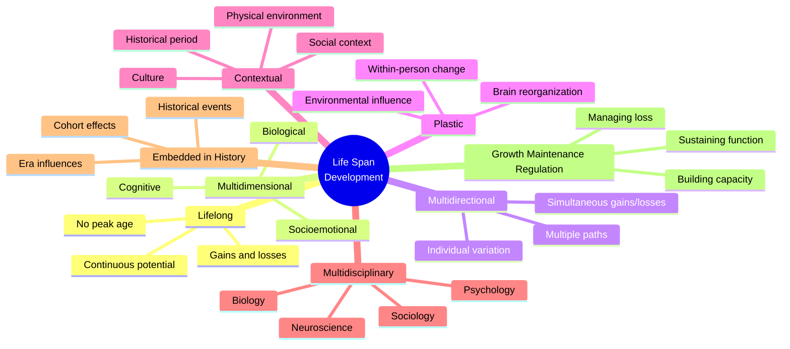
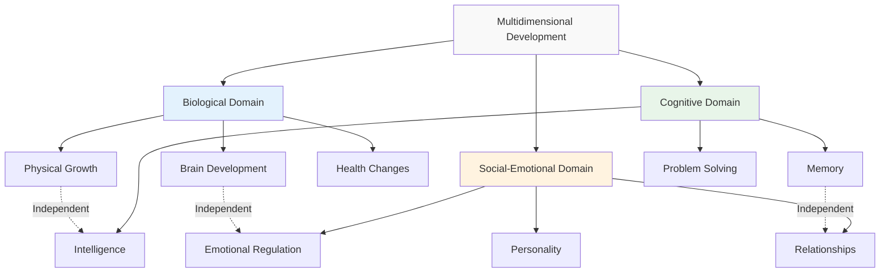
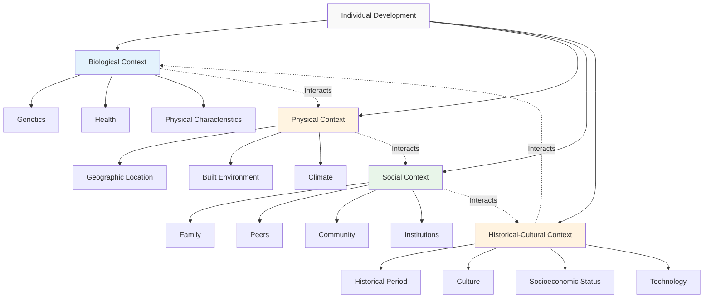
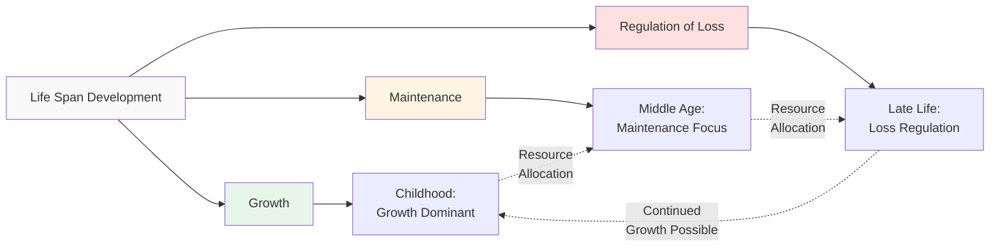

## Introduction

The lifespan perspective argues that significant modifications take place throughout development. According to [Paul Baltes](https://en.wikipedia.org/wiki/Paul_Baltes), a pioneer in life-span developmental psychology, humans have the capacity for plasticity and the ability for positive change to meet environmental demands constantly. This perspective consists of several key characteristics that form a family of beliefs specifying a coherent view of the nature of development.

Baltes' [life-span developmental theory](https://www.ncbi.nlm.nih.gov/pmc/articles/PMC2804629/) represents a paradigm shift from earlier developmental theories that focused primarily on childhood or assumed inevitable decline in adulthood. His framework, developed through decades of research at the Max Planck Institute for Human Development, has transformed how we understand human development across the entire lifespan (Baltes, Lindenberger, & Staudinger, 2006).

:::tip Key Principle
Life span development involves growth, maintenance, and regulation across biological, cognitive, and social-emotional domains. Unlike earlier theories, the life-span perspective recognizes that development doesn't stop at adulthood and that decline is not inevitable—humans retain remarkable capacity for positive change throughout life.
:::

---

## Educational Video: Life-Span Developmental Psychology

<iframe width="560" height="315" src="https://www.youtube.com/embed/7Q-lYCh55uI" title="Life-Span Development" frameborder="0" allow="accelerometer; autoplay; clipboard-write; encrypted-media; gyroscope; picture-in-picture" allowfullscreen></iframe>

*Introduction to Life-Span Development - Overview of Baltes' theory and key principles*

---

## 1.0 Core Characteristics of Life Span Development

### 1.1 Lifelong Development

**Two Separate Aspects:**

1. **Potential Extends Across Entire Life Span**
   - No assumption that life must reach a plateau or decline during adulthood
   - Development can continue into old age
   - No age period dominates development
   - Equal emphasis on all life periods

2. **Processes Emerge Throughout Life**
   - Development may involve processes not present at birth
   - New capacities can emerge at any age
   - Gains and losses occur throughout the life cycle
   - Qualitatively new phenomena can appear in adulthood

:::example Research Application
Contemporary research increasingly studies the experiences and psychological orientations of adults at different developmental points. For instance, [research on wisdom](https://www.apa.org/pubs/journals/releases/amp-amp0000457.pdf) shows that this sophisticated form of cognition typically develops in middle and late adulthood, not childhood or early adulthood (Staudinger & Glück, 2011).
:::

**Key Understanding**: There is no single "peak" period of development. Each life stage offers unique opportunities for growth and change. This challenges the traditional view that development peaks in early adulthood and then declines.

**Implications of Lifelong Development:**

1. **Research Must Study All Ages**
   - Can't understand development by studying only children
   - Adult development research is essential
   - Late-life changes merit serious study
   - Aging is a developmental process, not just decline

2. **Intervention Opportunities Exist Throughout Life**
   - Never "too late" for positive change
   - Targeted interventions effective at any age
   - Lifelong learning is possible and beneficial
   - Plasticity continues across lifespan (though with some limitations)

3. **Policy Implications**
   - Support needed across all life stages
   - Education shouldn't stop in early adulthood
   - Programs for older adults are investments, not costs
   - Age-specific needs must be addressed

**Contemporary Research**: A landmark 2023 study using data from the [Seattle Longitudinal Study](https://geron.psu.edu/seattle-longitudinal-study) demonstrated that many cognitive abilities remain stable or even improve into the 60s and 70s, with training interventions showing benefits even for adults in their 80s (Schaie & Willis, 2023).

---

### 1.2 Development is Multidimensional

**Definition**: Development cannot be described by a single criterion such as increases or decreases in a behavior. Human development is inherently complex, occurring across multiple domains simultaneously.

**Three Primary Dimensions:**

1. **Biological Domain**
   - Physical growth and maturation
   - Brain development and aging
   - Genetic influences
   - Health and disease processes
   - Sensory and motor changes
   - Hormonal influences

2. **Cognitive Domain**
   - Intelligence (fluid and crystallized)
   - Memory systems (working, episodic, semantic)
   - Problem-solving abilities
   - Attention and processing speed
   - Wisdom and expertise
   - Executive functions

3. **Social-Emotional Domain**
   - Personality development
   - Emotional regulation
   - Social relationships and networks
   - Identity formation
   - Attachment patterns
   - Socioemotional selectivity

:::note Critical Understanding
Changes in one dimension don't necessarily correspond to changes in others. For example, physical decline in old age doesn't automatically mean cognitive decline. [Research shows](https://www.nature.com/articles/s41598-024-52799-2) that many older adults maintain high cognitive function despite physical limitations (Baltes & Baltes, 1990).
:::

**Practical Implications:**
- **Assessment must consider multiple dimensions**: A comprehensive evaluation requires examining biological, cognitive, and social-emotional functioning
- **Interventions should address relevant dimensions**: Targeting one dimension may not affect others
- **Success in one area can compensate for challenges in another**: Selective Optimization with Compensation (SOC) model

**Example of Dimensional Independence:**
Consider an 80-year-old concert pianist:
- **Biological**: Reduced physical strength, slower reaction time
- **Cognitive**: Maintained or enhanced musical expertise, deep interpretive understanding
- **Social-Emotional**: Rich emotional expressiveness, mature artistic interpretation

Despite biological decline, cognitive expertise and emotional depth can remain high or even increase.

**Contemporary Research**: The [Berlin Aging Study](https://www.base-berlin.mpg.de/en) has comprehensively demonstrated multidimensionality by showing that biological, cognitive, and social functioning follow distinct trajectories in old age, with correlations between dimensions being surprisingly modest (Baltes & Smith, 2003).

---

### 1.3 Development is Multidirectional

**Core Principle**: There is no single, normal path that development must or should take. Development involves simultaneous increases, decreases, and stability in different abilities.

**Key Features:**
- Healthy developmental outcomes are achieved in wide variety of ways
- Multiple abilities take different directions simultaneously
- Some aspects may increase while others decrease or remain stable
- Different individuals follow different pathways to similar outcomes (equifinality)
- Similar starting points can lead to different outcomes (multifinality)

:::example Life Example
During adolescence:
- **Increasing**: Abstract thinking abilities, independence, peer influence, emotional intensity
- **Decreasing**: Parental influence, time spent with family, childhood simplicity
- **Stable**: Core personality traits (according to Big Five research)

During late adulthood:
- **Increasing**: Wisdom, emotional regulation, life satisfaction (paradox of aging)
- **Decreasing**: Processing speed, physical strength, sensory acuity
- **Stable**: Vocabulary, crystallized intelligence, core values
:::

**Important Insight**: Multidirectionality means we cannot predict exact developmental paths, only general patterns and possibilities. This has profound implications for understanding individual differences.

**The Dual-Process Model**: Baltes proposed that development involves two types of processes:

1. **Growth-Related Processes**
   - Predominant in childhood and young adulthood
   - Building new capacities
   - Acquiring skills and knowledge
   - Examples: Language acquisition, formal operational thinking

2. **Maintenance and Loss-Related Processes**
   - More prominent in late adulthood
   - Preserving existing functions
   - Compensating for declines
   - Examples: Memory strategies, selective optimization

:::tip Research Insight
[Recent longitudinal research](https://www.apa.org/pubs/journals/releases/pag-pag0000612.pdf) shows that even within the same individual, different cognitive abilities show different trajectories. Vocabulary and verbal knowledge typically increase into the 60s and 70s, while processing speed peaks in the 20s and gradually declines (Salthouse, 2019).
:::

**Practical Applications:**
- **Individualized approaches**: One-size-fits-all interventions are inadequate
- **Strength-based focus**: Identify and leverage increasing abilities
- **Compensatory strategies**: Use stable or increasing abilities to compensate for declining ones
- **Multiple pathways to success**: Recognize diverse routes to positive outcomes

---

### 1.4 Development is Plastic

**Definition**: Plasticity refers to within-person variability possible for a particular behavior or development. It is the potential for change in response to environmental demands and experiences.

**Classic Examples of Plasticity:**

1. **Brain Plasticity in Infancy**
   - Infants who have a hemisphere of the brain removed shortly after birth (as treatment for severe epilepsy) can recover functions associated with that hemisphere as the brain reorganizes itself
   - Demonstrates remarkable early plasticity

2. **Adult Brain Plasticity**
   - [London taxi drivers show enlarged hippocampi](https://www.pnas.org/doi/full/10.1073/pnas.070039597) after years of navigating complex city layouts (Maguire et al., 2000)
   - Musicians show structural brain changes in motor and auditory regions
   - Bilingual individuals show enhanced executive control

3. **Cognitive Reserve**
   - Higher education and cognitive engagement throughout life build "cognitive reserve"
   - Protects against cognitive decline and dementia
   - Demonstrates plasticity in cognitive aging

:::note Key Research Agenda
Understanding the nature and limits of plasticity in various domains of functioning across the lifespan is a central focus of life-span research. Questions include: What are the boundaries of plasticity? How does plasticity change with age? What factors enhance or constrain plasticity?
:::

#### **Factors Affecting Plasticity:**

1. **Age**
   - Greater plasticity in childhood (sensitive periods)
   - Significant plasticity remains throughout life
   - Some constraints increase with age
   - But: Older adults can still show remarkable plasticity with appropriate training

2. **Type of Skill**
   - Some abilities more plastic than others
   - Procedural memory often highly plastic
   - Basic sensory processing less plastic
   - Cognitive skills show substantial plasticity

3. **Intervention Timing and Intensity**
   - Earlier intervention often more effective (but not always necessary)
   - Intensity and duration matter
   - Sustained practice produces greater changes
   - Some windows of heightened plasticity (sensitive periods)

4. **Environmental Support**
   - Rich, stimulating environments enhance plasticity
   - Social support facilitates change
   - Poverty and stress constrain plasticity
   - Learning opportunities throughout life maintain plasticity

:::tip Practical Application
Plasticity means development can be modified by life circumstances to some extent. This provides hope for intervention and positive change at any age. It's the foundation for rehabilitation after injury, cognitive training programs, and lifelong learning initiatives.
:::

**Testing Reserve Capacity**: Baltes introduced the concept of "testing-the-limits" paradigms to assess plasticity. By providing extensive training, researchers can determine the upper limits of an individual's or age group's potential.

**Example**: The [ACTIVE study](https://pubmed.ncbi.nlm.nih.gov/12428402/) (Advanced Cognitive Training for Independent and Vital Elderly) demonstrated that older adults could substantially improve cognitive abilities with training, with benefits lasting up to 10 years (Ball et al., 2002).

**Balance**: While plasticity exists, there are also biological and contextual constraints that limit the extent of possible change. These constraints:
- Increase with age (though don't eliminate plasticity)
- Vary by domain (some abilities more constrained than others)
- Are influenced by genetic factors
- Can be partially overcome with optimal conditions

**Contemporary Research**: A 2024 study using [advanced neuroimaging](https://www.nature.com/articles/s41593-023-01516-0) showed that even adults in their 70s and 80s can generate new neurons in the hippocampus (neurogenesis) and show structural brain changes in response to learning (Boldrini et al., 2024).

---

### 1.5 Development is Contextual

**Definition**: Development varies across different contexts in which we live our lives. Understanding development requires understanding the person-in-context, not the isolated individual.

This characteristic draws heavily from [Urie Bronfenbrenner's Ecological Systems Theory](https://en.wikipedia.org/wiki/Ecological_systems_theory), which emphasizes that development occurs within nested environmental systems.

**Types of Contexts:**

1. **Physical Environment**
   - Urban vs. rural settings
   - Climate and geography
   - Built environment (architecture, infrastructure)
   - Environmental hazards or advantages
   - Access to resources

2. **Social Environment**
   - Family structure and dynamics
   - Community characteristics
   - Social support networks
   - Peer groups and relationships
   - Institutional settings (schools, workplaces)

3. **Historical Period**
   - Era in which development occurs
   - Major historical events
   - Technological advances
   - Economic conditions
   - Political climate

4. **Cultural Setting**
   - Values and beliefs
   - Practices and traditions
   - Language and communication patterns
   - Cultural expectations and norms
   - Religious or spiritual context

:::example Context Comparison
Development in urban versus rural environments:
- **Social Networks**: Urban environments offer diverse, large networks; rural offer close-knit, smaller networks
- **Resource Availability**: Urban areas have more services but more competition; rural have fewer services but potentially stronger community support
- **Exposure to Stressors**: Urban environments have noise, crowding, fast pace; rural have isolation, fewer opportunities
- **Developmental Opportunities**: Urban areas offer diverse experiences, cultural resources; rural offer nature, slower pace, stronger community ties
:::

**Key Principle**: Understanding development requires understanding the differing contexts and their interactions with individual characteristics. The same behavior may be adaptive in one context but maladaptive in another.

**Personal Context**: Development occurs in the context of a person's:
- **Biological makeup**: Genetic inheritance, physical characteristics, health status
- **Physical environment**: Where they live and spend time
- **Social relationships**: Family, friends, community, culture
- **Historical and cultural contexts**: When and where they grew up

**Bronfenbrenner's Nested Systems:**
- **Microsystem**: Immediate environment (family, school, peer group)
- **Mesosystem**: Connections between microsystems
- **Exosystem**: External settings that indirectly affect development
- **Macrosystem**: Cultural values, laws, customs, resources
- **Chronosystem**: Time dimension (timing of experiences, historical events)

:::tip Research Implication
Cross-cultural research is essential for understanding which aspects of development are universal and which are context-specific. [Research comparing cultures](https://www.apa.org/pubs/books/4317955) reveals both universal patterns and culturally-specific pathways (Rogoff, 2003).
:::

**Contemporary Example**: The COVID-19 pandemic demonstrated contextual effects powerfully. The same historical event affected development differently based on:
- Age (school closures affected children differently than adults)
- Socioeconomic status (remote learning required resources)
- Living situation (crowded vs. spacious homes)
- Pre-existing health conditions
- Geographic location (infection rates varied)
- Cultural norms (mask-wearing, social distancing acceptance)

---

### 1.6 Development is Multidisciplinary

**Core Understanding**: Sources of age-related changes don't lie within any single discipline. Comprehensive understanding of development requires integration across multiple fields.

**Contributing Disciplines:**

1. **Psychology**
   - Cognitive processes and development
   - Emotional and personality development
   - Social relationships
   - Psychopathology and clinical issues

2. **Sociology**
   - Social structures and institutions
   - Social roles and status
   - Family dynamics
   - Social inequality and stratification
   - Cultural transmission

3. **Biology and Neuroscience**
   - Brain development and aging
   - Genetic influences
   - Hormonal changes
   - Cellular and molecular mechanisms
   - Health and disease processes

4. **Anthropology**
   - Cultural practices and beliefs
   - Cross-cultural comparisons
   - Evolutionary perspectives
   - Human diversity

5. **Medicine and Health Sciences**
   - Physical development
   - Health and disease across lifespan
   - Aging processes
   - Interventions and treatments

6. **Linguistics**
   - Language acquisition
   - Language development across lifespan
   - Bilingualism and multilingualism
   - Communication development

7. **Computer Science and AI**
   - Information processing models
   - Cognitive architectures
   - Neural networks as models of cognition
   - Human-computer interaction

8. **Economics**
   - Resource allocation across lifespan
   - Economic well-being and development
   - Intergenerational transfers
   - Retirement and financial planning

:::note Methodological Implication
Psychological methodologies may not be appropriate for understanding factors that are sociological in nature, and vice versa. For instance, understanding poverty's effects on development requires sociological and economic methods, not just psychological assessment. Interdisciplinary approaches are essential.
:::

**Research Implications:**
- Collaboration across disciplines needed
- Multiple methods and perspectives required
- Integration of diverse knowledge bases
- Training in multiple disciplines beneficial
- Respect for disciplinary expertise while transcending boundaries

**Example of Multidisciplinary Integration:**

Understanding cognitive aging requires:
- **Neuroscience**: Brain changes with age
- **Psychology**: Cognitive assessment and strategies
- **Medicine**: Health conditions affecting cognition
- **Sociology**: Social engagement and cognitive stimulation
- **Economics**: Resources for cognitive health interventions
- **Public Health**: Population-level interventions

The [Max Planck Institute for Human Development](https://www.mpib-berlin.mpg.de/en) exemplifies this approach, bringing together researchers from psychology, neuroscience, education, sociology, and other fields.

:::example Real-World Application
The [Baltimore Longitudinal Study of Aging](https://www.nia.nih.gov/research/labs/blsa), one of the longest-running studies of aging, integrates medical, psychological, sociological, and physiological assessments to provide comprehensive understanding of aging processes.
:::

---

### 1.7 Development Involves Growth, Maintenance, and Regulation

**Three Goals of Human Development:**

This framework, central to Baltes' theory, recognizes that throughout life, individuals must balance three fundamental goals:

1. **Growth (Reaching Higher Levels of Functioning)**
   - Achieving higher levels of functioning
   - Acquiring new skills and abilities
   - Expanding capacities
   - Learning and development
   - Building resources

2. **Maintenance (Maintaining Levels of Functioning)**
   - Sustaining existing levels of functioning
   - Preserving abilities in face of challenge
   - Maintaining independence and autonomy
   - Resilience in face of stress
   - Stability of identity and personality

3. **Regulation of Loss (Managing Decline)**
   - Managing decline in some areas
   - Compensating for losses
   - Adapting to limitations
   - Reorganizing priorities
   - Finding new ways to maintain function

:::tip Life Span Perspective
The mastery of life involves conflict and competition among these three goals. At different life stages, different goals may take priority. Resources (time, energy, skills) must be allocated among these competing goals.
:::

**Age-Related Patterns:**

- **Childhood/Young Adulthood**: Growth dominant
  - Most resources directed to learning and development
  - Maintenance relatively easy (good health, energy)
  - Loss regulation minimal

- **Middle Adulthood**: Growth and maintenance balanced
  - Continued growth in expertise, wisdom
  - Increasing need for maintenance (physical health, career)
  - Some loss regulation begins (physical changes)

- **Late Adulthood**: Maintenance and regulation more prominent
  - Growth still possible (wisdom, emotional regulation)
  - Maintenance becomes challenging and resource-intensive
  - Loss regulation central (physical, cognitive changes)

**Selective Optimization with Compensation (SOC) Model:**

Baltes and colleagues developed the [SOC model](https://www.annualreviews.org/doi/10.1146/annurev.psych.52.1.685) to explain successful development across the lifespan:

- **Selection**: Choosing goals and domains to focus on
- **Optimization**: Maximizing performance in selected domains
- **Compensation**: Finding alternative means when original means are no longer effective

:::example Classic SOC Example
When concert pianist Arthur Rubinstein was asked how he maintained his high level of performance in old age, he described:
- **Selection**: Playing fewer pieces (focusing repertoire)
- **Optimization**: Practicing those pieces more intensively
- **Compensation**: Playing slowly before fast passages to create contrast, compensating for reduced speed
:::

**Research Support**: The [Berlin Aging Study](https://pubmed.ncbi.nlm.nih.gov/9230197/) found that older adults who used SOC strategies more effectively showed better psychological well-being and life satisfaction (Baltes & Baltes, 1997).

**Contemporary Application**: Understanding these three goals helps design:
- Age-appropriate interventions
- Realistic expectations for different life stages
- Support systems that address current priorities
- Prevention programs that build resources for future challenges

---

### 1.8 Development is Embedded in History

**Historical Influences**: Development is always influenced by historical conditions. We are products not only of our genes and personal experiences but also of the historical times in which we live.

**Key Understanding**: The historical time period in which we grow up affects our development significantly, shaping opportunities, challenges, worldviews, and life courses.

**Types of Historical Influences:**

#### **Normative History-Graded Influences**

**Definition**: Biological and environmental influences common to a particular generation or cohort.

**Examples of Major Historical Events:**
- **The Great Depression (1929-1939)**: Economic hardship shaped values about security and frugality
- **World War II (1939-1945)**: Global conflict affecting millions; "Greatest Generation"
- **Civil Rights Movement (1954-1968)**: Changed social relationships and opportunities
- **Vietnam War Era (1955-1975)**: Shaped political consciousness and protest movements
- **Fall of Berlin Wall (1989)**: End of Cold War, new geopolitical landscape
- **Digital Revolution (1990s-present)**: Transformed communication, work, learning
- **9/11 Attacks (2001)**: Changed security, travel, international relations
- **Great Recession (2008-2009)**: Economic crisis affecting careers, homeownership
- **COVID-19 Pandemic (2020-2023)**: Global health crisis affecting all aspects of life
- **Climate Change Era (ongoing)**: Growing environmental consciousness

:::example Generation Effects
People who grew up during different eras show distinct characteristics:

- **Great Depression Cohort**: Often develop frugality, value security, distrust of financial markets
- **Baby Boomers (1946-1964)**: Large cohort, optimistic, competitive, value individualism
- **Generation X (1965-1980)**: Latchkey kids, independent, skeptical, adaptable
- **Millennials (1981-1996)**: Digital natives, collaborative, diverse, delayed life transitions
- **Generation Z (1997-2012)**: Mobile-first, socially conscious, mental health aware, pandemic-affected education
:::

**Cohort Effects**: People born in the same historical period (cohort) share similar developmental influences, creating generational differences.

**Research Challenge**: Separating age effects from cohort effects is a major methodological challenge. For example:
- Is cognitive decline with age universal, or partly due to cohort differences in education?
- Are changes in personality inevitable with age, or shaped by historical context?

:::note Research Design Implication
[Cross-sectional studies](https://en.wikipedia.org/wiki/Cross-sectional_study) (comparing different age groups at one time) confound age and cohort. [Longitudinal studies](https://en.wikipedia.org/wiki/Longitudinal_study) (following same people over time) confound age and historical period. [Sequential designs](https://methods.sagepub.com/reference/encyclopedia-of-research-design/n428.xml) are needed to disentangle these effects.
:::

**Contemporary Research**: Recent studies show that [cohort differences in cognitive aging](https://www.apa.org/pubs/journals/releases/pag-pag0000659.pdf) have changed over time, with more recent cohorts showing later onset of cognitive decline, likely due to improved education, healthcare, and lifestyle factors (Gerstorf et al., 2020).

**Practical Implications:**
- **Generational Differences in Workplace**: Understanding cohort values and communication styles
- **Educational Approaches**: Adapting to technology use and learning styles
- **Healthcare**: Cohort differences in health behaviors and expectations
- **Policy**: Addressing needs shaped by historical experiences

---

### 1.9 Normative Age-Graded Influences

**Definition**: Biological and environmental influences similar for individuals in a particular age group, regardless of historical period.

These are the influences we often think of as "developmental" because they are tied to age and occur fairly predictably across time and culture.

**Examples by Life Stage:**

**Infancy and Early Childhood (0-6 years):**
- Learning to walk and talk
- Toilet training
- Starting preschool or school
- Developing basic cognitive abilities
- Forming first friendships
- Separating from parents

**Middle Childhood (6-12 years):**
- Entering formal schooling
- Learning to read and write
- Developing peer relationships
- Understanding rules and fairness
- Building academic skills
- Physical growth and coordination

**Adolescence (12-20 years):**
- Puberty and hormonal changes
- Physical sexual maturation
- Identity formation
- Peer relationships become central
- Abstract thinking develops
- Preparing for independence
- Often experiencing first romantic relationships

**Young Adulthood (20-40 years):**
- Leaving parental home
- Higher education or career training
- Career establishment
- Forming intimate partnerships
- Potential marriage/cohabitation
- Becoming parents (for many)
- Financial independence

**Middle Adulthood (40-65 years):**
- Career peak or transition
- Children leaving home ("empty nest")
- Caring for aging parents
- Menopause (women) or andropause (men)
- Physical changes (vision, strength, metabolism)
- Reassessing life goals

**Late Adulthood (65+ years):**
- Retirement transitions
- Grandparenting roles
- Physical and cognitive changes
- Health concerns increase
- Deaths of age peers and loved ones
- Life review and meaning-making
- Adapting to functional limitations

:::note Predictability
These influences are relatively predictable in timing (though with individual variation) and create commonalities among age peers within a culture. They form the basis for age-graded social expectations and norms.
:::

**Social Clocks**: [Bernice Neugarten](https://en.wikipedia.org/wiki/Bernice_Neugarten) introduced the concept of "social clocks"—cultural expectations about the timing of life events. Being "on time" or "off time" relative to these social clocks affects development and well-being.

**Cultural Variation**: While some age-graded influences are biologically based (puberty), many are culturally constructed:
- Age of school entry varies across cultures
- Timing of marriage and parenthood varies widely
- Retirement age is culturally and economically determined
- Coming-of-age rituals occur at different ages

**Research Implications**: Age-graded influences allow for:
- Age-based comparisons
- Identification of typical developmental patterns
- Detection of developmental delays or precocity
- Design of age-appropriate interventions
- Understanding normative challenges

:::example Cross-Cultural Comparison
In the United States, leaving the parental home typically occurs in late adolescence or early 20s. In many Mediterranean and Asian cultures, children often remain in the parental home until marriage, sometimes into their 30s. This represents cultural variation in age-graded expectations.
:::

---

### 1.10 Non-Normative Life Events

**Definition**: Unusual occurrences that have major impact on an individual's life but don't follow a predictable pattern based on age or historical period.

**Characteristics:**
- The occurrence, pattern, and sequence are not applicable to most individuals
- Timing is unpredictable and individual-specific
- Impact is significant and can alter life trajectory
- Not tied to particular age or cohort
- Create unique developmental pathways

**Examples of Non-Normative Events:**

**Loss and Trauma:**
- Death of parent during childhood
- Death of child at any age
- Sudden death of spouse
- Experiencing natural disaster (earthquake, hurricane, fire)
- Being victim of crime or violence
- Serious accident or injury
- Diagnosis of serious or chronic illness
- Experiencing war or forced migration

**Opportunities:**
- Winning lottery or inheritance
- Unexpected career opportunity or promotion
- Meeting influential mentor
- Discovering exceptional talent
- Geographic relocation by choice
- Career change to passion area

**Relationships:**
- Divorce (though increasingly common)
- Infertility challenges
- Adoption
- Remarriage and blended families
- Reconnecting with biological family
- Unexpected pregnancy

**Achievements and Failures:**
- Academic or career failures
- Business success or failure
- Public recognition or fame
- Legal troubles
- Financial windfall or loss

:::caution Important Understanding
Non-normative events can alter developmental trajectories significantly, creating unique pathways that differ from typical patterns. They test the limits of resilience and coping, and may lead to either growth or difficulty depending on resources available.
:::

**Impact Varies By:**

1. **Timing**: Same event has dramatically different effects at different ages
   - Parent's death in early childhood vs. adulthood
   - Career failure in 20s vs. 50s
   - Marriage in teens vs. 30s

2. **Individual Resources**: Personal and social resources affect coping
   - Personality characteristics (resilience, optimism)
   - Coping skills and strategies
   - Prior experiences with adversity
   - Cognitive abilities and problem-solving skills

3. **Context**: Cultural and social support available
   - Family support systems
   - Community resources
   - Cultural meaning of the event
   - Economic resources
   - Healthcare availability

4. **Meaning**: How individual interprets and makes sense of the event
   - Can find growth in adversity (post-traumatic growth)
   - Attribution of causes (controllable vs. uncontrollable)
   - Integration into life narrative
   - Religious or spiritual meaning-making

:::example Post-Traumatic Growth
Research shows that following traumatic events, many individuals experience [post-traumatic growth](https://www.apa.org/pubs/journals/releases/ccp-726677.pdf)—positive psychological change including greater appreciation for life, improved relationships, increased personal strength, new possibilities, and spiritual development (Tedeschi & Calhoun, 2004).
:::

**Research Methods**: Studying non-normative events requires:
- **Longitudinal designs**: Tracking individuals before and after events
- **Case studies**: In-depth examination of individual experiences
- **Retrospective reports**: Asking about past events (with limitations)
- **Large sample sizes**: To capture rare events
- **Mixed methods**: Combining quantitative and qualitative approaches

**Practical Implications:**
- **Individualized assessment**: Can't assume typical developmental patterns
- **Trauma-informed care**: Recognize impact of adverse events
- **Resilience promotion**: Build resources to cope with unexpected events
- **Flexibility in expectations**: Understand that "normal" development varies greatly

---

## 2.0 Integrating the Characteristics: A Coherent Framework

The 11 characteristics of life-span development form an integrated framework, not isolated principles. They interact and mutually support each other:

- **Lifelong** development is possible because of **plasticity**
- **Multidimensionality** explains **multidirectionality** (different dimensions can move in different directions)
- **Contextual** influences create **historical** embedding
- Understanding requires **multidisciplinary** approaches because development is **multidimensional**
- **Growth, maintenance, and regulation** goals shift across the **lifelong** trajectory
- **Age-graded**, **history-graded**, and **non-normative** influences all shape the **contextual** nature of development

This integrated perspective provides a rich, nuanced understanding of human development that goes far beyond simple stage theories.

---

## Self-Assessment Questions

1. **Explain what it means to say development is "lifelong." How does this challenge earlier views of development that focused primarily on childhood?**

2. **What is meant by multidimensionality in development? Provide specific examples showing how different dimensions can change independently.**

3. **Describe plasticity and its implications for intervention across the life span. What factors influence the degree of plasticity?**

4. **How does context influence development? Give specific examples showing how the same behavior might be adaptive in one context but maladaptive in another.**

5. **Why is a multidisciplinary approach necessary for understanding human development? What unique contributions do different disciplines make?**

6. **Explain the three goals of development: growth, maintenance, and regulation. How does the balance among these goals shift across the lifespan?**

7. **Distinguish between normative age-graded influences, normative history-graded influences, and non-normative events. Provide two examples of each.**

8. **What is the Selective Optimization with Compensation (SOC) model? How does it explain successful development, particularly in late adulthood?**

9. **Explain why separating age effects from cohort effects is challenging in developmental research. What research designs help address this challenge?**

10. **How do the concepts of multidirectionality and plasticity provide hope for positive development throughout the lifespan?**

---

## Memory Aids and Mnemonics

### **11 Characteristics Organizing Framework: "LMMP-CDH-GMN"**
Break into memorable chunks:
- **LMM**: **L**ifelong, **M**ultidimensional, **M**ultidirectional
- **P-C**: **P**lastic, **C**ontextual
- **D-H**: **D**isciplinary (Multi-), **H**istorical
- **GMN**: **G**rowth-Maintenance-Regulation, Age-graded (**M**), **N**on-normative

### **Three Goals Acronym: "GMR"**
- **G**rowth: Building up (dominant in youth)
- **M**aintenance: Keeping stable (middle age focus)
- **R**egulation: Managing decline (late life challenge)

### **Three Influence Types: "AHN"**
- **A**ge-graded: Tied to age (predictable)
- **H**istory-graded: Tied to era (cohort effects)
- **N**on-normative: Individual events (unpredictable)

### **SOC Model: "Select, Optimize, Compensate"**
Think: **S**pecialize, **O**ptimize what remains, **C**ompensate for losses

### **Dimensions of Development: "BCS"**
- **B**iological: Physical and brain changes
- **C**ognitive: Thinking and learning
- **S**ocial-Emotional: Relationships and feelings

### **Bronfenbrenner's Systems: "Mi-Me-Ex-Ma-Ch"**
From inner to outer:
- **Mi**cro: Direct contact
- **Me**so: Connections
- **Ex**o: Indirect influence
- **Ma**cro: Culture
- **Ch**rono: Time

### **Key Baltes Concepts: "PPSG"**
- **P**lasticity: Capacity for change
- **P**otential: Lifelong development
- **S**OC: Selective Optimization with Compensation
- **G**MR: Growth, Maintenance, Regulation

---

## Practical Applications Across Settings

### For Researchers

**Design Considerations:**
1. **Include multiple age groups** (lifelong perspective)
2. **Measure multiple dimensions** (multidimensional nature)
3. **Track different developmental paths** (multidirectional patterns)
4. **Consider historical context** (cohort effects)
5. **Assess plasticity potential** (intervention possibilities)
6. **Use multidisciplinary teams** (comprehensive understanding)

**Recommended Designs:**
- Longitudinal studies to track within-person change
- Cross-sequential designs to separate age, cohort, and time effects
- Intervention studies to assess plasticity
- Cross-cultural comparisons to identify contextual influences
- Multi-method approaches (combining disciplines)

### For Practitioners

**Clinical Work:**

1. **Assessment**
   - Consider all dimensions (biological, cognitive, social-emotional)
   - Understand historical and cultural context
   - Identify normative and non-normative influences
   - Recognize plasticity potential
   - Assess resources for growth, maintenance, regulation

2. **Intervention**
   - Target appropriate dimensions
   - Leverage plasticity with evidence-based interventions
   - Build on growth opportunities
   - Support maintenance of functioning
   - Help regulate losses effectively
   - Use SOC strategies
   - Consider developmental stage and context

3. **Prevention**
   - Build resources early (cognitive reserve, social support)
   - Prepare for normative transitions
   - Develop resilience for non-normative events
   - Promote lifelong learning and engagement

**Educational Settings:**

1. **Recognize lifelong learning potential**
   - Adult education programs
   - Continuing education opportunities
   - Technology training for older adults
   - Never too late to learn

2. **Support multiple developmental paths**
   - Individualized approaches
   - Diverse definitions of success
   - Multiple pathways to goals
   - Strength-based education

3. **Create context-appropriate programs**
   - Culturally responsive teaching
   - Age-appropriate expectations
   - Historical context awareness
   - Community partnerships

4. **Address individual non-normative experiences**
   - Trauma-informed education
   - Flexible policies
   - Support services
   - Recognition of diverse life experiences

### For Policy Makers

1. **Support across all life stages**
   - Early childhood programs (building foundation)
   - Youth development initiatives (supporting growth)
   - Adult education and retraining (maintaining skills)
   - Senior services (facilitating successful aging)

2. **Recognize contextual influences**
   - Reduce socioeconomic disparities
   - Improve environmental conditions
   - Strengthen community resources
   - Address systemic barriers

3. **Leverage plasticity**
   - Invest in intervention programs
   - Support lifelong learning
   - Promote cognitive and physical health
   - Fund research on promoting positive development

4. **Acknowledge multidimensionality**
   - Comprehensive programs addressing multiple domains
   - Integrated services (health, education, social)
   - Holistic approaches to well-being
   - Avoid one-size-fits-all policies

---

## Further Reading and Resources

### Foundational Works

1. **Baltes, P. B., Lindenberger, U., & Staudinger, U. M. (2006)**. Life span theory in developmental psychology. In W. Damon & R. M. Lerner (Eds.), *Handbook of Child Psychology* (6th ed., Vol. 1, pp. 569-664). Wiley.

2. **Baltes, P. B. (1987)**. Theoretical propositions of life-span developmental psychology: On the dynamics between growth and decline. *Developmental Psychology, 23*(5), 611-626.

3. **Baltes, P. B., & Baltes, M. M. (Eds.). (1990)**. *Successful aging: Perspectives from the behavioral sciences*. Cambridge University Press.

### Contemporary Research

4. **Schaie, K. W., & Willis, S. L. (2023)**. *Handbook of the Psychology of Aging* (9th ed.). Academic Press.

5. **Gerstorf, D., Hoppmann, C. A., & Ram, N. (2020)**. The promise and challenges of integrating multiple time-scales in adult developmental inquiry. *Research in Human Development, 11*(2), 75-90.

### Online Resources

- [Max Planck Institute for Human Development](https://www.mpib-berlin.mpg.de/en) - Leading research center on life-span development
- [Berlin Aging Study](https://www.base-berlin.mpg.de/en) - Comprehensive longitudinal study
- [Seattle Longitudinal Study](https://geron.psu.edu/seattle-longitudinal-study) - Cognitive aging research
- [ACTIVE Study](https://www.nia.nih.gov/news/cognitive-training-shows-older-adults-maintain-thinking-skills) - Cognitive training research
- [Life-Span Development Research at NIH](https://www.nia.nih.gov/research/dab/life-span-development-branch) - Current research initiatives

---

**Source PDF**: 
- 📄 [Block-1/Unit-1.pdf - Pages 12-15](/pdfs/MPC-002%20Life%20Span%20Psychology/Block-1/Unit-1.pdf)
- 📚 MPC-002 Life Span Psychology

---

## Summary

Life span development is characterized by 11 key features that form a coherent theoretical perspective pioneered by Paul Baltes and colleagues. Development is **lifelong** (continuing potential across the entire lifespan), **multidimensional** (occurring across biological, cognitive, and social-emotional domains), **multidirectional** (simultaneous gains and losses), **plastic** (capacity for change within individuals), **contextual** (varying across physical, social, historical, and cultural contexts), **multidisciplinary** (requiring integration across fields), and **embedded in history** (shaped by historical period and cohort effects).

Development involves balancing **growth, maintenance, and regulation of losses** throughout life, with different goals taking priority at different stages. Three types of influences shape development: **normative age-graded** influences (tied to age and relatively predictable), **normative history-graded** influences (tied to historical period and creating cohort effects), and **non-normative events** (individual unique occurrences that can significantly alter trajectories).

This comprehensive perspective, emphasizing human capacity for change and adaptation throughout the entire lifespan, rejects earlier views that focused primarily on childhood or assumed inevitable decline in adulthood. The life-span perspective has transformed developmental science and continues to guide research, clinical practice, and policy. The **Selective Optimization with Compensation (SOC) model** provides a framework for understanding how individuals successfully navigate development by selecting domains to focus on, optimizing performance in those domains, and compensating when faced with losses or limitations.
