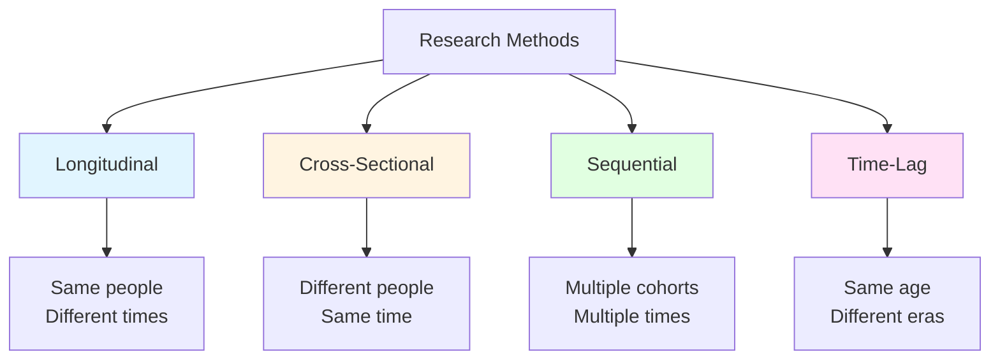

## Introduction

Development is a continuous process occurring over a lifetime period. Special techniques are employed to study life span development due to its extended timeframe and complexity. Understanding these research methods, fundamental developmental facts, and research challenges is essential for conducting and interpreting developmental research.

:::tip Key Understanding
Each research method has specific strengths and limitations. Choosing the appropriate method depends on the research question, available resources, and practical constraints.
:::

---

## 1.0 Research Methods for Life Span Development

### 1.1 Longitudinal Method

**Definition**: Studies developmental changes in the same group or individual over a period of time.

**Procedure**:
- Same individuals tested at different ages
- Repeated measurements over time
- Can span years or even decades

**Advantages:**
- Shows individual patterns of change
- Can identify causes of developmental changes
- Captures stability and change within individuals
- Best for studying developmental processes

**Disadvantages:**
- Time-consuming and expensive
- Subject attrition (dropout)
- Practice effects from repeated testing
- Cohort-specific findings may not generalize

:::example Classic Study
**Example**: Case study of children's behavior in classroom tracked from kindergarten through high school, showing how early behavior patterns predict later outcomes.
:::

---

### 1.2 Cross-Sectional Method

**Definition**: Studies developmental changes by testing individuals of different ages at the same time, only once.

**Procedure**:
- Different age groups tested simultaneously
- Each person tested only once
- Provides snapshot of age differences

**Advantages:**
- Faster and cheaper than longitudinal
- No subject attrition problems
- Can establish norms or standards for different ages
- Practical for many research questions

**Disadvantages:**
- Cannot show individual change patterns
- Cohort effects may confound age differences
- Cannot establish causation
- May miss important developmental processes

:::tip Practical Use
Helps establish typical patterns of development for different ages quickly. Useful for initial exploration of age-related differences.
:::

**Example**: Studying eating behavior of 5-year-olds by testing a group of 5-year-olds once, rather than following them over time.

---

### 1.3 Sequential Method

**Definition**: Combines longitudinal and cross-sectional approaches to overcome their respective drawbacks.

**Procedure**:
- People in cross-sectional sample tested more than once
- Multiple cohorts followed over time
- Results analyzed to determine differences over time for different groups

**Advantages:**
- More realistic assessment
- Can separate age effects from cohort effects
- Reduces time needed compared to pure longitudinal
- Provides richer data than pure cross-sectional

**Disadvantages:**
- Still time-consuming
- Complex data analysis required
- More expensive than cross-sectional alone
- Requires careful design and planning

:::note Best Method
This is considered the best method as it combines strengths of both longitudinal and cross-sectional approaches while minimizing their weaknesses.
:::

**Design Example:**
- Test 20, 30, and 40-year-olds in 2020
- Retest same people in 2025 and 2030
- Can separate age effects, cohort effects, and time-of-measurement effects

---

### 1.4 Time-Lag Method

**Definition**: Studies development of different age groups in different years to determine effect of historical events on behavior.

**Procedure**:
- Different samples of same age tested at different times
- Example: Compare 20-year-olds tested in 1990, 2000, 2010, 2020

**Advantages:**
- Can identify historical/cultural changes
- Shows how same age behaves differently across eras
- Useful for understanding cohort effects

**Disadvantages:**
- Rarely used in developmental psychology
- Takes very long time
- Requires large numbers of subjects
- All subjects must be same age at testing

:::example Historical Application
Comparing attitudes toward technology among 20-year-olds in 1980 versus 2020 shows how historical context shapes development.
:::

---

## 2.0 Comparison of Research Methods

---

## 3.0 Facts of Development

### 3.1 Early Foundations are Critical

**Principle**: Attitudes, habits, and patterns of behavior established during early years determine to a large extent how successfully individuals adjust in later life.

**Implications:**
- Early intervention is often more effective
- Prevention better than later correction
- Early experiences create lasting impact
- Windows of opportunity in early development

:::caution Critical Period Awareness
While early foundations matter, remember plasticity - later experiences and interventions can still make significant differences.
:::

---

### 3.2 Role of Maturation and Learning

**Maturation**: Unfolding of individual's inherent traits
**Learning**: Development occurring from experience and individual effort

**Key Relationship**:
- Maturation provides raw material for learning
- Development influenced by interaction of both
- Neither operates in isolation
- Balance varies by domain and age

**Example**: Language development requires both maturational readiness (brain development) and learning opportunities (exposure to language).

---

### 3.3 Development Follows Definite and Predictable Pattern

**Orderly Patterns Exist for:**
- Physical development
- Motor development
- Intellectual development
- Speech development

**Two Governing Laws:**

1. **Cephalocaudal Law**
   - Development spreads from head to foot
   - Head and upper body develop before lower body
   - Example: Babies control head before trunk, trunk before legs

2. **Proximodistal Law**
   - Development spreads outward from central axis
   - Center of body develops before extremities
   - Example: Shoulder control before elbow, elbow before wrist/fingers

:::info Predictability
While individual timing varies, the sequence of development is remarkably consistent across individuals and cultures.
:::

---

### 3.4 All Individuals are Different

**Core Principle**: No two people react the same way to the same environmental stimuli.

**Implications:**
- Cannot predict with accuracy how people will react
- Individual differences are significant
- Responsible for individuality in personality
- Require personalized approaches

**Sources of Individual Differences:**
- Genetic variations
- Different experiences
- Unique interactions of forces
- Personal interpretations of events

---

### 3.5 Each Phase Has Characteristic Behaviors

**Equilibrium Periods:**
- Individuals adapt easily to environmental demands
- Good personal and social adjustment
- Smooth functioning

**Disequilibrium Periods:**
- Difficulty in adaptation
- Poor personal and social adjustment
- Challenging times requiring support

:::tip Understanding Phases
Recognizing these phases helps parents and educators adjust expectations and support appropriately.
:::

---

### 3.6 Hazards in Each Phase

**Three Types of Hazards:**

1. **Physical Hazards**: Illnesses, injuries, developmental delays
2. **Psychological Hazards**: Emotional difficulties, adjustment problems
3. **Environmental Hazards**: Poverty, trauma, inadequate resources

**Importance of Awareness:**
- Prevention possible when aware
- Can alleviate problems if cannot prevent
- Early identification crucial
- Adjustment problems inevitably result

---

### 3.7 Development is Aided by Stimulation

**Key Principles:**
- While development occurs through maturation and environmental experiences, much can be done to aid development
- Stimulation especially effective at time when ability normally developing
- However, stimulation important at all times

**Applications:**
- Enriched environments support development
- Critical periods exist for optimal stimulation
- Never too late for beneficial stimulation
- Quality matters as much as quantity

---

### 3.8 Cultural Changes Affect Development

**Understanding:**
- Individual's development molded to conform to cultural standards and norms
- Changes in standards affect developmental pattern
- Culture provides context for interpreting development

**Examples:**
- Technology changing childhood experiences
- Changing gender roles affecting development
- Cultural values shaping priorities
- Historical events creating cohort effects

---

### 3.9 Every Stage Has Social Expectations

**Principle**: Society has certain expectations for each developmental stage.

**Success Factors:**
- Fulfilling expectations depends on adhering to family and societal rules
- Varies across cultures
- Creates developmental tasks
- Influences self-evaluation

:::example Cultural Variation
Age expectations for independence, marriage, career establishment vary significantly across cultures.
:::

---

### 3.10 Traditional Beliefs Influence Development

**Impact**: Traditional beliefs about physical and psychological characteristics affect:
- Judgments of others
- Self-evaluation
- Developmental expectations
- Treatment by society

**Persistence**: So long as these beliefs persist, they have profound influence on developmental patterns.

---

## 4.0 Obstacles in Studying Life Span Development

### 4.1 Representative Sample

**The Challenge**: Obtaining a representative sample across different age levels.

**Specific Difficulties:**
- **School children**: Relatively easy access
- **Newborns/Infants**: Strong parental objections, infant mood variability
- **Older adolescents/Young adults not in school**: Difficult to locate, may not volunteer
- **Middle-aged/Older adults**: May shy away from testing, reluctant to share personal details, skeptical of research

:::caution Research Limitation
Even with payment, getting truly representative samples across all age groups remains challenging.
:::

---

### 4.2 Establishing Rapport with Subjects

**The Challenge**: Difficulty getting full personal details and establishing trust.

**Complications:**
- Personal rapport varies from stage to stage
- Even willing participants may provide false information
- No guarantee information is accurate
- Questionable whether data represents true attitudes, feelings, values

**Mitigation Strategies:**
- Build trust gradually
- Ensure confidentiality
- Use multiple data sources
- Validate responses when possible

---

### 4.3 Appropriate Methodology

**The Challenge**: Adapting methodology to wide age range and variety of developmental areas.

**Complications:**
- Different age groups require different methods
- Target may be child, adult, or older person
- Cultural changes affect patterns over time
- Cross-sectional research problems
- Values of subjects affected by cultural changes

**Requirements:**
- Assorted methods must be used
- Flexibility in approach needed
- Cultural sensitivity essential
- Multiple perspectives necessary

---

### 4.4 Accuracy of Data

**The Challenge**: Ensuring data obtained from studies is accurate.

**Sources of Inaccuracy:**
- **Different methods** produce different results
- **Observation methods** for behavior, well-being, life satisfaction vary in reliability
- **Self-report data** may be biased or inaccurate
- **Different age levels** require different measures
- **Longitudinal approach** has accuracy advantages but problems remain

:::note Researcher Responsibility
Must critically evaluate accuracy of measures and acknowledge limitations in findings.
:::

---

### 4.5 Ethical Aspects

**The Challenge**: Protecting rights of subjects while conducting research.

**Key Considerations:**
- Rights of subjects must be considered
- Applies even if participants are paid
- **Consent required**:
  - Adults: Must provide informed consent
  - Children: Parents/guardians must provide consent
- Considerations apply to younger and older subjects
- Balance between research needs and participant protection

**Ethical Principles:**
- Do no harm
- Informed consent
- Right to withdraw
- Confidentiality
- Debriefing when appropriate

---

## Self-Assessment Questions

1. **Compare and contrast longitudinal and cross-sectional research methods. What are the advantages and disadvantages of each?**
2. **Why is the sequential method considered the best approach for studying development?**
3. **Explain the cephalocaudal and proximodistal laws of development with examples.**
4. **What is meant by "early foundations are critical"? How does this relate to plasticity?**
5. **Describe the five major obstacles in studying life span development.**
6. **How do cultural changes affect the developmental pattern?**
7. **Why is obtaining representative samples across age groups particularly challenging?**

---

## Memory Aids

### **4 Research Methods: "LCST"**
- **L**ongitudinal: Same people, different times
- **C**ross-sectional: Different people, same time
- **S**equential: Multiple cohorts, multiple times
- **T**ime-lag: Same age, different eras

### **2 Developmental Laws: "CP"**
- **C**ephalocaudal: Head to foot
- **P**roximodistal: Center to extremities

### **5 Research Obstacles: "RRAME"**
- **R**epresentative sample
- **R**apport
- **A**ppropriate methodology
- **A**ccuracy of data
- **E**thical aspects

---

## Practical Applications

### For Researchers

**Method Selection:**
1. **Quick snapshot needed** → Cross-sectional
2. **Individual change patterns** → Longitudinal
3. **Comprehensive understanding** → Sequential
4. **Historical effects** → Time-lag

**Addressing Obstacles:**
1. Use multiple recruitment strategies for representative samples
2. Build rapport through pilot work and training
3. Validate measures across age groups
4. Ensure ethical review and compliance
5. Use multiple data sources for accuracy

### For Practitioners

**Understanding Research:**
1. Recognize method limitations when applying findings
2. Consider sample representativeness
3. Evaluate accuracy of measures used
4. Understand historical context of research

**Applying Developmental Facts:**
1. Recognize critical early periods
2. Support both maturation and learning
3. Understand individual differences
4. Prepare for phase-specific challenges
5. Provide appropriate stimulation
6. Consider cultural context

---

**Source PDF**: 
- 📄 [Block-1/Unit-1.pdf - Pages 15-19](/pdfs/MPC-002%20Life%20Span%20Psychology/Block-1/Unit-1.pdf)
- 📚 MPC-002 Life Span Psychology

---

## Summary

Four main research methods study life span development: longitudinal (same people over time), cross-sectional (different ages at one time), sequential (combining both), and time-lag (same age across eras). The sequential method is considered best but most resource-intensive. Ten fundamental facts guide understanding of development, including the critical nature of early foundations, the interaction of maturation and learning, predictable developmental patterns, and cultural influences. Researchers face five major obstacles: obtaining representative samples, establishing rapport, selecting appropriate methodology, ensuring data accuracy, and maintaining ethical standards. Understanding these methods, facts, and obstacles is essential for conducting and interpreting developmental research.
