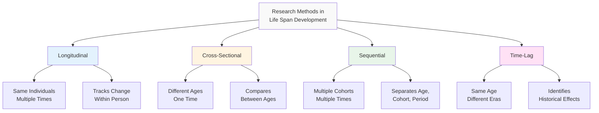
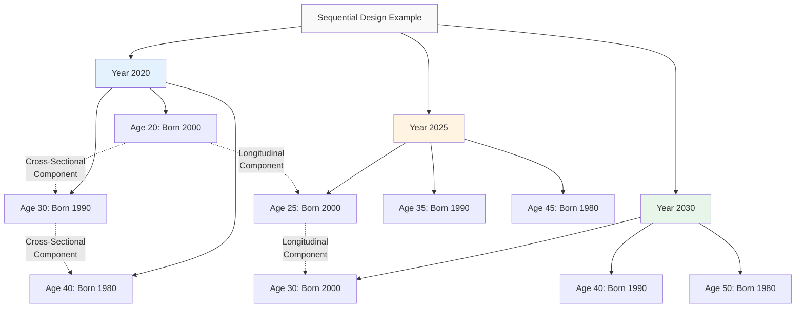
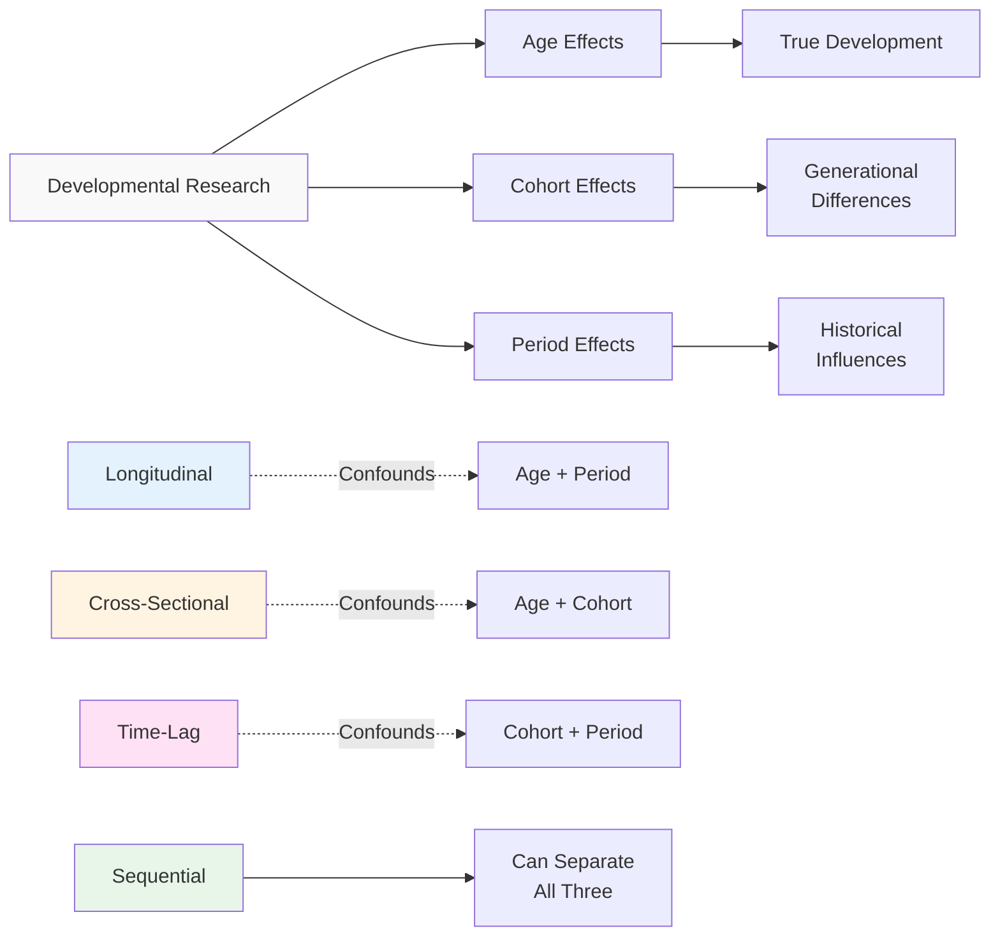
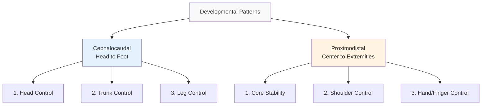

## Introduction

Development is a continuous process occurring over a lifetime period. Special techniques are employed to study life span development due to its extended timeframe and complexity. Understanding these research methods, fundamental developmental facts, and research challenges is essential for conducting and interpreting developmental research.

[Developmental research methods](https://en.wikipedia.org/wiki/Developmental_psychology#Research_methods) have evolved significantly over the past century, with each approach offering unique insights while presenting distinct challenges. The choice of method profoundly affects what we can learn about human development and how confidently we can draw conclusions about developmental processes.

:::tip Key Understanding
Each research method has specific strengths and limitations. Choosing the appropriate method depends on the research question, available resources, practical constraints, and the trade-offs researchers are willing to accept. No single method is perfect for all questions.
:::

---

## Educational Video: Developmental Research Methods

<iframe width="560" height="315" src="https://www.youtube.com/embed/YvLN2VGzM5A" title="Developmental Research Methods" frameborder="0" allow="accelerometer; autoplay; clipboard-write; encrypted-media; gyroscope; picture-in-picture" allowfullscreen></iframe>

*Introduction to Research Methods in Developmental Psychology - Overview of major approaches*

---

## 1.0 Research Methods for Life Span Development

### 1.1 Longitudinal Method

**Definition**: Studies developmental changes in the same group or individual over a period of time, providing the most direct measure of developmental change.

**Procedure**:
- Same individuals tested at multiple ages
- Repeated measurements over time (months to decades)
- Can track individual trajectories
- Follows actual developmental change

:::example Classic Longitudinal Studies
- **[Terman's Study of the Gifted](https://en.wikipedia.org/wiki/Genetic_Studies_of_Genius)** (1921-present): Following intellectually gifted children into old age
- **[Harvard Study of Adult Development](https://www.adultdevelopmentstudy.org/)** (1938-present): One of longest studies of adult life
- **[Dunedin Multidisciplinary Study](https://dunedinstudy.otago.ac.nz/)** (1972-present): Comprehensive study from birth through middle age
- **[Seattle Longitudinal Study](https://geron.psu.edu/seattle-longitudinal-study)** (1956-present): Cognitive development across adulthood
:::

**Advantages:**

1. **Shows Individual Patterns of Change**
   - Can identify different developmental trajectories
   - Reveals individual stability and change
   - Shows intra-individual variability

2. **Can Identify Causes of Developmental Changes**
   - Temporal ordering establishes potential causation
   - Can assess predictive relationships
   - Allows examination of developmental cascades

3. **Captures Stability and Change Within Individuals**
   - Measures growth, decline, and stability
   - Identifies turning points
   - Assesses recovery from setbacks

4. **Best for Studying Developmental Processes**
   - Can model developmental trajectories
   - Examines rates of change
   - Identifies factors affecting development

**Disadvantages:**

1. **Time-Consuming and Expensive**
   - Can take decades to complete
   - Requires sustained funding
   - Demands long-term institutional commitment
   - Researcher may not see completion

2. **Subject Attrition (Dropout)**
   - Participants move, lose interest, die
   - Attrition may be systematic (healthier people stay)
   - Reduces sample size over time
   - Threatens representativeness

3. **Practice Effects from Repeated Testing**
   - Familiarity with tests improves scores
   - May overestimate stability
   - Confounds true development with test-taking skill
   - Requires careful test design

4. **Cohort-Specific Findings**
   - Results may not generalize to other cohorts
   - Historical period confounded with age
   - Difficult to separate age from time-of-measurement effects

5. **Practical Challenges**
   - Maintaining contact with participants
   - Updating measures as field advances
   - Staff turnover
   - Technology changes

:::note Research Insight
The [Framingham Heart Study](https://www.framinghamheartstudy.org/), begun in 1948, demonstrates how longitudinal research can transform understanding—its findings revolutionized knowledge of cardiovascular disease risk factors and continues to influence health policy (Dawber et al., 1951).
:::

**Contemporary Applications**: Modern longitudinal studies increasingly use:
- Online data collection to reduce attrition
- Multiple measurement modalities
- Biomarkers and neuroimaging
- Intensive longitudinal designs (daily diaries, ecological momentary assessment)

---

### 1.2 Cross-Sectional Method

**Definition**: Studies developmental changes by testing individuals of different ages at the same time, providing a snapshot of age differences.

**Procedure**:
- Different age groups tested simultaneously
- Each person tested only once
- Compares between-person differences
- Provides quick results

**Advantages:**

1. **Faster and Cheaper than Longitudinal**
   - Results available quickly (months not years)
   - Single data collection wave
   - Lower cost per participant
   - Easier to complete and publish

2. **No Subject Attrition Problems**
   - Each person tested once
   - No longitudinal follow-up needed
   - No practice effects from repeated testing

3. **Can Establish Norms or Standards**
   - Useful for developmental milestones
   - Creates age-based expectations
   - Informs assessment tools
   - Provides population benchmarks

4. **Practical for Many Research Questions**
   - Initial exploration of age differences
   - Hypothesis generation
   - Pilot work for longitudinal studies
   - Policy-relevant quick answers

**Disadvantages:**

1. **Cannot Show Individual Change Patterns**
   - Between-person differences ≠ within-person change
   - No information about trajectories
   - Cannot identify individual variation in development
   - Assumes all individuals follow same path

2. **Cohort Effects May Confound Age Differences**
   - Different ages = different birth cohorts
   - Historical experiences differ across cohorts
   - Cannot separate age from cohort effects
   - May misattribute cohort differences to age

3. **Cannot Establish Causation**
   - Cross-sectional = correlational
   - Temporal ordering unknown
   - Third variables may explain differences
   - Difficult to test developmental theories

4. **May Miss Important Developmental Processes**
   - Transitions between assessments invisible
   - Individual variation hidden in group means
   - Discontinuous changes may appear smooth
   - Critical periods may be missed

:::tip Practical Use
Cross-sectional studies help establish typical patterns of development for different ages quickly. Useful for initial exploration of age-related differences, screening for developmental problems, and when longitudinal studies are impractical.
:::

:::example Research Application
A classic example: Studying eating behavior of 5-year-olds by testing a group of 5-year-olds once, rather than following them over time. Quick, efficient, but can't tell us how individual children's eating behavior changes with development.
:::

**The Cross-Sectional Problem**: [Research has shown](https://psycnet.apa.org/record/1996-97568-000) that cross-sectional age differences often overestimate decline and underestimate growth compared to longitudinal studies, particularly in cognitive aging research (Schaie, 1965).

---

### 1.3 Sequential Method

**Definition**: Combines longitudinal and cross-sectional approaches to overcome their respective drawbacks, allowing separation of age, cohort, and time-of-measurement effects.

**Procedure**:
- Multiple cohorts recruited (cross-sectional component)
- Each cohort followed over time (longitudinal component)
- Creates matrix of age × cohort × time
- Multiple analyses possible

**Types of Sequential Designs:**

1. **Cohort-Sequential Design**
   - Multiple cohorts, same ages
   - Example: Follow 1990 and 2000 birth cohorts from ages 20-30

2. **Time-Sequential Design**
   - Multiple time points, same ages
   - Example: Test 30-year-olds in 2010, 2020, 2030

3. **Cross-Sequential Design**
   - Multiple cohorts and multiple ages
   - Most comprehensive but complex

**Advantages:**

1. **More Realistic Assessment**
   - Can separate age, cohort, and period effects
   - Reduces time needed compared to pure longitudinal
   - Provides richer data than pure cross-sectional
   - Multiple perspectives on development

2. **Can Identify Historical Effects**
   - Compares cohorts at same ages
   - Reveals cultural/historical influences
   - Shows how development changes across time
   - Tests generalizability of findings

3. **Flexibility in Analysis**
   - Multiple analytic strategies possible
   - Can test competing hypotheses
   - Provides convergent evidence
   - Strengthens causal inferences

4. **Addresses Major Confounds**
   - Age effects: Longitudinal component
   - Cohort effects: Cross-sectional component
   - Time-of-measurement: Sequential component
   - More valid conclusions possible

**Disadvantages:**

1. **Still Time-Consuming**
   - Takes years to complete
   - Not as fast as cross-sectional
   - Requires sustained effort
   - Delays publication of findings

2. **Complex Data Analysis Required**
   - Sophisticated statistical methods needed
   - Multiple effects to disentangle
   - Requires careful interpretation
   - Potential for over-interpretation

3. **More Expensive than Cross-Sectional Alone**
   - Multiple cohorts increase sample size
   - Repeated assessments increase cost
   - Attrition from multiple groups
   - Greater logistical complexity

4. **Careful Design and Planning Required**
   - Must anticipate long-term needs
   - Measure selection critical
   - Balancing comprehensiveness with burden
   - Institutional support essential

:::note Best Method
This is considered the gold standard for developmental research as it combines strengths of both longitudinal and cross-sectional approaches while minimizing their weaknesses. However, practical constraints often limit its use.
:::

**Classic Example**: [K. Warner Schaie's Seattle Longitudinal Study](https://geron.psu.edu/seattle-longitudinal-study) pioneered sequential designs, demonstrating that many cognitive abilities don't decline as early as cross-sectional studies suggested (Schaie, 1965, 2012).

**Contemporary Applications**: The [NICHD Study of Early Child Care and Youth Development](https://www.nichd.nih.gov/research/supported/seccyd) uses sequential design to understand how child care experiences affect development across multiple cohorts (NICHD Early Child Care Research Network, 2005).

---

### 1.4 Time-Lag Method

**Definition**: Studies development of different age groups in different years to determine effect of historical events on behavior, holding age constant while varying historical period.

**Procedure**:
- Different samples of same age tested at different times
- Example: Compare 20-year-olds tested in 1990, 2000, 2010, 2020, 2030
- Reveals cohort/period effects
- Controls for age effects

**Advantages:**

1. **Can Identify Historical/Cultural Changes**
   - Shows how same age changes across time
   - Reveals cultural shifts
   - Identifies generation effects
   - Demonstrates societal changes

2. **Controls for Age Effects**
   - All participants same age
   - Pure measure of historical influence
   - No developmental confound
   - Clear interpretation

3. **Useful for Understanding Cohort Effects**
   - Documents generational differences
   - Shows impact of historical events
   - Informs policy about changing needs
   - Predicts future cohorts

**Disadvantages:**

1. **Rarely Used in Developmental Psychology**
   - Doesn't directly address developmental questions
   - More relevant for sociology/history
   - Limited developmental theory testing
   - Difficult to publish in developmental journals

2. **Takes Very Long Time**
   - Decades between assessments
   - Requires multi-generational planning
   - Few researchers commit to this design
   - Institutional memory challenges

3. **Requires Large Numbers of Subjects**
   - New sample each time
   - No longitudinal component
   - Recruitment repeatedly needed
   - Expensive over time

4. **All Subjects Must Be Same Age**
   - Narrow age restriction
   - Doesn't show development
   - Only shows historical change
   - Limited generalizability

:::example Historical Application
Comparing attitudes toward technology among 20-year-olds in 1980 (pre-personal computer), 2000 (internet emerging), and 2020 (smartphone native) shows how historical context shapes development and generational characteristics.
:::

**Research Example**: Studies of [IQ changes across generations](https://en.wikipedia.org/wiki/Flynn_effect) (the Flynn Effect) use time-lag comparisons, showing consistent increases in measured intelligence across cohorts born in different eras (Flynn, 1984).

---

## 2.0 Comparison and Integration of Research Methods

### 2.1 Method Comparison Table

| Method | Same People? | Multiple Times? | Primary Question | Best For | Major Limitation |
|--------|--------------|----------------|------------------|----------|------------------|
| **Longitudinal** | Yes | Yes | How do individuals change? | Within-person development | Time/cost |
| **Cross-Sectional** | No | No | How do ages differ? | Quick age comparisons | Cohort confound |
| **Sequential** | Some same, some different | Yes | How do age, cohort, period interact? | Comprehensive understanding | Complexity |
| **Time-Lag** | No | Yes | How do cohorts differ? | Historical changes | Doesn't show development |

### 2.2 Confounds in Developmental Research

Three effects are confounded in developmental research:

1. **Age Effects**: True developmental changes
2. **Cohort Effects**: Differences due to being born at different times
3. **Period/Time-of-Measurement Effects**: Changes affecting everyone at a particular historical moment

:::note Critical Understanding
No single design can perfectly isolate age effects from cohort and period effects. Sequential designs come closest but require assumptions. Researchers must acknowledge these limitations when interpreting findings.
:::

### 2.3 Choosing the Right Method

**Decision Framework:**

**Choose Longitudinal when:**
- Individual change is the research question
- Have long-term funding and institutional support
- Can minimize attrition
- Need to establish temporal ordering/causation
- Interested in developmental trajectories

**Choose Cross-Sectional when:**
- Need quick initial results
- Budget/time limited
- Establishing age norms
- Pilot work for future longitudinal study
- Policy decisions need immediate data

**Choose Sequential when:**
- Need to separate age, cohort, period effects
- Have moderate time frame (5-15 years)
- Substantial resources available
- Generalizability across cohorts important
- Testing developmental theories rigorously

**Choose Time-Lag when:**
- Interested in historical/cultural change
- Focus on cohort/generation differences
- Very long-term perspective possible
- Collaborating with sociologists/historians

---

## 3.0 Facts of Development

### 3.1 Early Foundations are Critical

**Principle**: Attitudes, habits, and patterns of behavior established during early years determine to a large extent how successfully individuals adjust in later life.

**Research Support**:
- [Adverse childhood experiences (ACEs)](https://www.cdc.gov/violenceprevention/aces/index.html) predict adult physical and mental health (Felitti et al., 1998)
- Early attachment quality predicts social competence decades later
- Early intervention programs show lasting effects (Perry Preschool, Abecedarian Project)
- Brain development is most rapid and plastic in early years

**Implications:**
- Early intervention often more effective than later remediation
- Prevention better than later correction
- Early experiences create lasting neural pathways
- Windows of opportunity exist for some abilities

:::caution Balanced Understanding
While early foundations matter tremendously, remember **plasticity**—later experiences and interventions can still make significant differences. The "first years last forever" doesn't mean "only the first years matter." Development is lifelong!
:::

**Contemporary Research**: The [Abecedarian Project](https://abc.fpg.unc.edu/) demonstrated that high-quality early childhood intervention produces benefits lasting into middle adulthood, including better health, education, and employment outcomes (Campbell et al., 2012).

---

### 3.2 Role of Maturation and Learning

**Maturation**: Unfolding of individual's inherent traits according to genetic blueprint
- Biologically programmed changes
- Species-universal sequences
- Relatively immune to environmental influence
- Provides readiness for learning

**Learning**: Development occurring from experience and individual effort
- Environmentally-influenced changes
- Varies by experience and culture
- Requires practice and opportunity
- Builds on maturational foundation

**Key Relationship**:
- Maturation provides raw material for learning
- Development influenced by continuous interaction
- Neither operates in isolation
- Balance varies by domain and age
- Gene × Environment interactions throughout

:::example Classic Illustration
**Language development** requires both:
- **Maturation**: Brain regions (Broca's, Wernicke's areas) must develop; vocal apparatus must mature
- **Learning**: Must be exposed to language; need social interaction; practice required

Children can't learn language before brain is ready (maturation), but without exposure, language won't develop even with mature brain (learning). The interplay is essential.
:::

**Critical Periods vs. Sensitive Periods**:
- **Critical periods**: Narrow window; if missed, difficult or impossible to acquire (rare in humans except perhaps early vision)
- **Sensitive periods**: Optimal window for learning; can learn later but with more difficulty (more common—e.g., language, music)

---

### 3.3 Development Follows Definite and Predictable Pattern

**Orderly Patterns Exist For:**
- Physical development (height, weight, proportions)
- Motor development (rolling, sitting, crawling, walking)
- Intellectual development (sensorimotor → preoperational → concrete operational → formal operational)
- Speech development (cooing → babbling → words → phrases → sentences)

**Two Governing Laws:**

#### **1. Cephalocaudal Law** (Head to Foot)

**Pattern**: Development spreads from head downward toward feet

**Evidence**:
- Head and brain develop first (largest proportion in infancy)
- Upper body develops before lower body
- Control develops progressively downward

**Examples**:
- Newborns: Can lift head before can control trunk
- Infants: Can reach with arms before can walk
- Babies: Master head control (2-3 months) → trunk control (sitting, 6 months) → leg control (walking, 12 months)

#### **2. Proximodistal Law** (Center to Extremities)

**Pattern**: Development spreads outward from central axis of body to extremities

**Evidence**:
- Torso develops before arms/legs
- Upper arms/legs before lower arms/legs
- Large muscle control before fine motor control

**Examples**:
- Shoulder control before elbow control before wrist/finger control
- Gross motor skills (kicking, swinging arms) before fine motor skills (grasping, manipulating objects)
- Core stability before peripheral coordination

:::info Predictability and Individual Variation
While the **sequence** of development is remarkably consistent across individuals and cultures (barring serious pathology), the **timing** shows considerable individual variation. Some children walk at 10 months, others at 15 months—both normal.
:::

**Contemporary Understanding**: [Dynamic systems theory](https://en.wikipedia.org/wiki/Dynamic_systems_theory_of_motor_skill_development) has refined our understanding, showing that development is not simply maturational unfolding but emerges from interaction of multiple factors including body characteristics, motivation, and environmental support (Thelen & Smith, 1994).

---

### 3.4 All Individuals are Different

**Core Principle**: No two people react the same way to the same environmental stimuli. Individual differences are fundamental to human development.

**Sources of Individual Differences:**

1. **Genetic Variations**
   - Unique genetic combinations (except identical twins)
   - Genetic influences on temperament, intelligence, personality
   - Gene × Environment interactions
   - Epigenetic modifications

2. **Different Experiences**
   - Family environments vary
   - Cultural contexts differ
   - Unique life events (non-normative influences)
   - Birth order effects

3. **Unique Interactions of Forces**
   - Same genes in different environments → different outcomes
   - Same environment with different genes → different outcomes
   - Reciprocal person ↔ environment effects
   - Cumulative effects over time

4. **Personal Interpretations**
   - Cognitive appraisals differ
   - Meaning-making processes
   - Attributional styles
   - Cultural lenses

**Implications:**
- Cannot predict with accuracy how specific individuals will react
- Personalized approaches required
- Responsible for individuality in personality
- Group averages may not apply to individuals
- Need person-centered as well as variable-centered approaches

:::example Differential Susceptibility
Research on [differential susceptibility](https://www.ncbi.nlm.nih.gov/pmc/articles/PMC4165328/) shows that some children are more affected by environmental quality—doing worse in poor environments but better in supportive environments than less susceptible children. Individual differences in reactivity shape developmental outcomes (Belsky & Pluess, 2009).
:::

---

### 3.5 Each Phase Has Characteristic Behaviors

**Equilibrium Periods** (Relative Calm):
- Individuals adapt easily to environmental demands
- Good personal and social adjustment
- Smooth functioning
- Integration of previous development
- Consolidation phase

**Disequilibrium Periods** (Turbulence):
- Difficulty in adaptation
- Poor personal and social adjustment
- Challenging times requiring support
- Transition between stages
- Reorganization phase

:::tip Understanding Phases
Recognizing these alternating phases helps parents and educators:
- Adjust expectations appropriately
- Provide support during difficult periods
- Not panic during disequilibrium (it's normal!)
- Celebrate equilibrium periods
- Prepare for transitions
:::

**Examples Across Development:**

**Early Childhood**:
- Equilibrium: Ages 2, 3.5, 5
- Disequilibrium: Ages 2.5, 4, 5.5 ("terrible twos," "frustrating fours")

**Adolescence**:
- Early adolescence often disequilibrium (11-14)
- Middle adolescence more equilibrium (15-17)
- Late adolescence may show disequilibrium with identity formation

**Adulthood**:
- Major transitions (new job, marriage, parenthood, retirement) often bring disequilibrium
- Periods of stability bring equilibrium

**Research Foundation**: Based on [Gesell's maturation theory](https://en.wikipedia.org/wiki/Arnold_Gesell) and subsequent research showing developmental transitions often involve temporary disorganization before new organization emerges (Gesell & Ilg, 1943).

---

### 3.6 Hazards in Each Phase

**Three Types of Hazards:**

1. **Physical Hazards**
   - Illnesses and diseases
   - Injuries and accidents
   - Developmental delays
   - Malnutrition or obesity
   - Substance abuse
   - Sensory or motor impairments

2. **Psychological Hazards**
   - Emotional difficulties (anxiety, depression)
   - Adjustment problems
   - Trauma and abuse
   - Low self-esteem
   - Identity confusion
   - Cognitive impairments

3. **Environmental Hazards**
   - Poverty and resource scarcity
   - Family dysfunction or violence
   - Inadequate education
   - Discrimination and prejudice
   - Unsafe neighborhoods
   - Social isolation

**Phase-Specific Examples:**

**Infancy**: SIDS, attachment disorders, neglect
**Early Childhood**: Accidents, language delays, behavior problems
**Middle Childhood**: Learning disabilities, peer rejection, anxiety
**Adolescence**: Risk-taking, substance use, depression, eating disorders
**Early Adulthood**: Career instability, relationship problems, identity foreclosure
**Middle Adulthood**: Chronic disease, work stress, caregiver burden
**Late Adulthood**: Falls, dementia, social isolation, elder abuse

**Importance of Awareness:**
- Prevention possible when aware
- Can alleviate problems if cannot prevent
- Early identification crucial
- Untreated hazards create adjustment problems inevitably
- Timing of intervention matters

:::caution Cumulative Risk
Multiple hazards have multiplicative, not just additive, effects. Children facing multiple risks (poverty + family conflict + dangerous neighborhood) show disproportionately poor outcomes. Protective factors can buffer against risks.
:::

---

### 3.7 Development is Aided by Stimulation

**Key Principles:**

1. **Development Requires Stimulation**
   - While maturation provides biological foundation, stimulation is essential for realization of potential
   - Enriched environments enhance development
   - Deprivation impairs development even with normal maturation

2. **Timing Matters**
   - Stimulation especially effective when ability is developing
   - Sensitive periods for optimal learning
   - But: Never too late for beneficial stimulation

3. **Quality Over Quantity**
   - Appropriate, responsive stimulation most effective
   - Over-stimulation can be counterproductive
   - Match stimulation to child's current level
   - Follow child's interests and readiness

**Research Evidence:**

**Animal Studies**: [Enriched environment research](https://www.ncbi.nlm.nih.gov/pmc/articles/PMC3133268/) with rodents shows increased brain complexity, neurogenesis, improved learning (Rosenzweig & Bennett, 1996).

**Human Studies**:
- Romanian orphanage studies show severe deprivation impairs cognitive and social development (Rutter et al., 2007)
- Early intervention programs enhance outcomes
- Adult cognitive training improves function
- Language exposure in infancy affects later language abilities

**Applications:**

**Infancy**:
- Responsive caregiving
- Language-rich environment
- Varied sensory experiences
- Social interaction

**Childhood**:
- High-quality education
- Extracurricular activities
- Reading and conversation
- Problem-solving opportunities

**Adolescence**:
- Academic challenges
- Identity exploration opportunities
- Autonomy support
- Meaningful responsibilities

**Adulthood**:
- Lifelong learning
- Cognitive challenges
- Social engagement
- Physical activity

:::note Contemporary Understanding
The [National Scientific Council on the Developing Child](https://developingchild.harvard.edu/) emphasizes that development requires "serve and return" interactions—responsive back-and-forth exchanges that build brain architecture.
:::

---

### 3.8 Cultural Changes Affect Development

**Understanding**:
- Individual's development molded to conform to cultural standards and norms
- Changes in standards affect developmental pattern
- Culture provides context for interpreting development
- Historical period shapes developmental opportunities and challenges

**Examples of Cultural Change Effects:**

1. **Technology**
   - Digital natives develop differently than pre-digital generations
   - Changes in attention, social interaction, learning
   - New opportunities and new risks

2. **Gender Roles**
   - Changing expectations for women and men
   - Expanded educational and career opportunities
   - Different socialization patterns
   - Varied family structures

3. **Family Structures**
   - Diverse family forms (single-parent, same-sex parents, blended)
   - Delayed marriage and parenthood
   - Increased cohabitation
   - Multigenerational households

4. **Education**
   - Extended education becoming normative
   - Online and hybrid learning
   - Emphasis on STEM fields
   - Lifelong learning expectations

5. **Work**
   - Gig economy and flexible work
   - Multiple career changes normative
   - Later retirement
   - Work-life balance emphasis

:::example Historical Comparison
**1950s development** (Leave It to Beaver era):
- Early marriage normative (women ~20, men ~23)
- Clear gender roles
- Limited higher education
- Single lifelong career
- Extended family nearby

**2020s development**:
- Later marriage (women ~28, men ~30)
- Flexible gender roles
- Majority attend college
- Multiple career changes expected
- Geographic mobility common

These cultural changes fundamentally alter developmental trajectories and timelines.
:::

**Research Area**: [Cultural psychology](https://en.wikipedia.org/wiki/Cultural_psychology) investigates how cultural practices shape cognitive, emotional, and social development, finding substantial cultural variation in developmental processes and outcomes (Rogoff, 2003).

---

### 3.9 Every Stage Has Social Expectations

**Principle**: Society has certain expectations for each developmental stage, creating age-graded "social clocks."

**Bernice Neugarten's Social Clocks**:
- Culturally-defined timetables for life events
- Being "on time" vs. "off time"
- Affects self-evaluation and social acceptance
- Varies across cultures and historical periods

**Examples of Age-Graded Expectations:**

**Childhood**:
- Start school ~age 5-6
- Learn to read by age 7-8
- Develop friendships
- Become independent in self-care

**Adolescence**:
- Complete puberty
- Graduate high school
- Begin considering career/college
- Develop romantic interests

**Young Adulthood**:
- Complete education/training
- Establish career
- Form intimate partnerships
- Achieve financial independence
- (For many) Marry and have children

**Middle Adulthood**:
- Career peak and advancement
- Launch children
- Prepare for retirement
- Support aging parents

**Late Adulthood**:
- Retire
- Adjust to grandparent role
- Maintain independence
- Cope with losses

**Success Factors:**
- Fulfilling expectations depends on adhering to family and societal norms
- Varies across cultures significantly
- Creates developmental tasks (Havighurst)
- Influences self-evaluation and life satisfaction
- "Off-time" transitions can be stressful

:::example Cultural Variation
**United States**: Expected to leave home around age 18-22
**Mediterranean/Asian cultures**: Often remain home until marriage (ages 25-35)
**Nordic countries**: Early independence valued (age 17-19)

No "right" age—depends on cultural norms. Being off-time in one's own culture can be more challenging than the timing itself.
:::

**Contemporary Changes**: Social clocks are becoming more flexible in many societies, with greater acceptance of diverse timelines. The concept of "emerging adulthood" (18-29) partly reflects loosened social clock expectations (Arnett, 2000).

---

### 3.10 Traditional Beliefs Influence Development

**Impact**: Traditional beliefs about physical and psychological characteristics affect:
- Judgments of others
- Self-evaluation
- Developmental expectations
- Treatment by society
- Opportunities provided

**Types of Traditional Beliefs:**

1. **About Age**
   - Stereotypes of children, adolescents, elderly
   - "Young people are irresponsible"
   - "You can't teach an old dog new tricks"
   - These beliefs create self-fulfilling prophecies

2. **About Gender**
   - "Boys are better at math"
   - "Girls are more emotional"
   - Affect educational and career paths
   - Influence socialization practices

3. **About Abilities**
   - Fixed vs. growth mindset beliefs
   - Intelligence as stable vs. malleable
   - Affect effort and persistence

4. **About Development**
   - Beliefs about what's "normal"
   - Expectations for timing of milestones
   - Assumptions about aging
   - Cultural developmental models

**Persistence**: So long as these beliefs persist, they have profound influence on developmental patterns through:
- **Stereotype threat**: Awareness of negative stereotypes impairs performance
- **Self-fulfilling prophecies**: Expectations shape behavior
- **Differential treatment**: People treated according to beliefs
- **Opportunity structures**: Beliefs affect access to resources

:::note Research Evidence
[Carol Dweck's research on mindsets](https://www.mindsetworks.com/science/) shows that beliefs about whether intelligence is fixed or malleable profoundly affect achievement. Growth mindset beliefs promote persistence and higher achievement (Dweck, 2006).
:::

**Combating Negative Beliefs**:
- Education about actual developmental capabilities
- Exposure to counter-stereotypical examples
- Promoting growth mindsets
- Creating inclusive environments
- Challenging ageism, sexism, and other stereotypes

---

## 4.0 Obstacles in Studying Life Span Development

### 4.1 Representative Sample

**The Challenge**: Obtaining a truly representative sample across different age levels.

**Specific Difficulties by Age Group:**

**Infants and Toddlers**:
- **Access**: Must go through parents/guardians
- **Parental objections**: Parents protective, concerned about stress
- **Infant state**: Mood variability, frequent fussiness, short attention
- **Testing challenges**: Limited response capabilities
- **Relatively easy if**: Parents recruited through pediatricians, child care centers

**School-Age Children and Adolescents**:
- **Relatively easy access**: Through schools, after-school programs
- **Parental consent required**: But usually obtainable
- **Challenges**: Busy schedules, testing anxiety
- **Need**: Engagement strategies, age-appropriate procedures

**Young Adults Not in School**:
- **Difficult to locate**: No institutional settings
- **May not volunteer**: Busy with work, family
- **Recruitment**: Through workplaces, social media, community
- **Retention**: High mobility, competing demands

**Middle-Aged Adults**:
- **Challenging**: Multiple responsibilities (work, family, aging parents)
- **May shy away**: Testing anxiety, time pressure
- **Reluctant**: May not see relevance
- **Privacy concerns**: Uncomfortable sharing personal details

**Older Adults**:
- **Skeptical of research**: Generational attitudes toward psychology
- **Reluctant to share**: Personal information, perceived vulnerabilities
- **Health concerns**: Fatigue, sensory limitations, mobility
- **Cognitive concerns**: Worry about memory tests revealing decline
- **Transportation**: Getting to research sites

**Sampling Bias Consequences**:
- **Volunteer bias**: Participants differ from non-participants
- **Healthier, more educated**: Often overrepresented
- **Results may not generalize**: To broader population
- **Underrepresentation**: Of disadvantaged, minority groups

:::caution Research Limitation
Even with payment, getting truly representative samples across all age groups remains challenging. Most developmental research is based on WEIRD samples (Western, Educated, Industrialized, Rich, Democratic), limiting generalizability (Henrich et al., 2010).
:::

**Solutions Being Tried**:
- Online data collection (increases access)
- Community partnerships (builds trust)
- Longitudinal incentive structures (retention bonuses)
- Mobile research labs (goes to participants)
- Culturally-sensitive recruitment
- Multiple recruitment strategies

---

### 4.2 Establishing Rapport with Subjects

**The Challenge**: Difficulty getting full, accurate personal details and establishing genuine trust across diverse age groups.

**Age-Specific Rapport Challenges:**

**Children**:
- May be shy with unfamiliar adults
- Desire to please may bias responses
- Limited self-reflection abilities
- May not understand questions
- Rely on nonverbal observation

**Adolescents**:
- Self-conscious, concerned about evaluation
- May resist adult authority
- Peer influence on responses
- Identity exploration complicates consistency
- Privacy concerns prominent

**Adults**:
- Social desirability bias (presenting favorably)
- Privacy concerns about sensitive topics
- May distrust researchers' motives
- Busy, may rush through assessments
- Cognitive appraisal of research purpose affects honesty

**Older Adults**:
- Generational communication differences
- May downplay difficulties (stoicism)
- Concern about appearing incompetent
- Reminiscence bias (positive past)
- Sensory challenges affect interaction

**General Complications:**
- Personal rapport varies from stage to stage
- Even willing participants may provide false information (consciously or unconsciously)
- No guarantee information is accurate
- Questionable whether data represents true attitudes, feelings, values
- Social desirability bias ubiquitous

**Factors Affecting Rapport:**
- Demographic match/mismatch with researcher
- Cultural sensitivity
- Interviewer skill and training
- Setting and comfort level
- Confidentiality assurances
- Purpose and relevance of research

**Mitigation Strategies:**

1. **Build Trust Gradually**
   - Start with non-threatening questions
   - Establish comfort before sensitive topics
   - Be genuine and non-judgmental

2. **Ensure Confidentiality**
   - Explain data protection procedures
   - Use anonymous or coded data
   - Separate identifying information

3. **Use Multiple Data Sources**
   - Self-report + observation
   - Multiple informants
   - Behavioral measures
   - Physiological measures

4. **Validate Responses**
   - Include consistency checks
   - Validity scales
   - Cross-validate with other sources

5. **Train Interviewers**
   - Cultural sensitivity
   - Building rapport
   - Recognizing bias
   - Standardized procedures

6. **Appropriate Setting**
   - Comfortable, private space
   - Minimize distractions
   - Accessible location

:::note Research Finding
Studies show that [rapport and interview characteristics](https://psycnet.apa.org/record/2008-00008-000) significantly affect data quality, particularly for sensitive topics. Warm, professional, non-judgmental interviewers obtain more valid responses (Cannell et al., 1981).
:::

---

### 4.3 Appropriate Methodology

**The Challenge**: Adapting methodology to wide age range and variety of developmental areas.

**Complications:**

1. **Different Age Groups Require Different Methods**
   - Infants: Preferential looking, habituation, sucking patterns
   - Toddlers: Simple tasks, behavioral observation, parent report
   - Children: Concrete tasks, interviews adapted to language level
   - Adolescents: Self-report questionnaires, interviews, behavioral tasks
   - Adults: Variety of methods possible
   - Older adults: May need accommodations (large print, extra time)

2. **Measuring Same Construct Across Ages**
   - Attachment: Different measures for infants, children, adults
   - Intelligence: Different tests for different ages
   - Personality: Age-appropriate instruments needed
   - Cannot simply use same measure at all ages

3. **Cultural Changes Affect Patterns**
   - Cross-sectional research confounds age with cohort
   - Methods must be culturally appropriate
   - Values of subjects affected by cultural changes
   - Historical period influences responses

4. **Multiple Developmental Domains**
   - Physical, cognitive, social-emotional
   - Each requires different measurement approaches
   - Integration across domains challenging
   - No single method captures all

**Requirements:**

1. **Assorted Methods Must Be Used**
   - Mixed methods (qualitative + quantitative)
   - Multiple measures of same construct
   - Triangulation across methods
   - Developmentally appropriate at each age

2. **Flexibility in Approach Needed**
   - Adapt procedures as needed
   - Standardize while allowing appropriate accommodation
   - Pilot test with each age group
   - Iterative refinement

3. **Cultural Sensitivity Essential**
   - Culturally-appropriate measures
   - Translated and adapted instruments
   - Culturally-diverse research teams
   - Avoid ethnocentric assumptions

4. **Multiple Perspectives Necessary**
   - Self-report
   - Observer ratings
   - Behavioral measures
   - Physiological/biological measures
   - Contextual information

:::example Methodological Adaptation
Measuring **social competence**:
- **Infancy**: Infant-parent interaction quality (observation)
- **Early childhood**: Peer play observation, teacher rating
- **Middle childhood**: Sociometric nominations, friendship quality
- **Adolescence**: Self-report + peer report, social network analysis
- **Adulthood**: Relationship quality, social support measures
- **Older adulthood**: Social network size, relationship satisfaction

Same construct, but age-appropriate methods required at each stage.
:::

---

### 4.4 Accuracy of Data

**The Challenge**: Ensuring data obtained from studies is accurate and validly represents the constructs of interest.

**Sources of Inaccuracy:**

1. **Different Methods Produce Different Results**
   - Observation vs. self-report often diverge
   - Questionnaires vs. interviews show differences
   - Physiological measures may contradict subjective reports
   - Need to determine which is "correct"

2. **Observation Methods Vary in Reliability**
   - Behavior, well-being, life satisfaction difficult to observe objectively
   - Observer bias affects ratings
   - Behavior changes when observed (reactivity)
   - Natural vs. laboratory settings differ

3. **Self-Report Data May Be Biased**
   - Social desirability bias
   - Memory distortions (especially retrospective)
   - Limited self-awareness
   - Response styles (acquiescence, extreme responding)
   - Mood affects reporting

4. **Different Age Levels Require Different Measures**
   - Measurement non-equivalence across ages
   - Construct may mean different things at different ages
   - Difficult to compare across ages
   - Scaling issues

5. **Longitudinal Approach Advantages and Challenges**
   - Advantages: Can validate against later outcomes, within-person consistency checks
   - Problems: Practice effects, attrition biases, measure obsolescence

**Strategies for Ensuring Accuracy:**

1. **Multiple Methods (Triangulation)**
   - Self-report + observation + physiological
   - Multiple informants (self, parent, teacher, peer)
   - Convergence increases confidence
   - Divergence requires explanation

2. **Validated Measures**
   - Use instruments with established psychometric properties
   - Reliability (consistency) testing
   - Validity (measures what it claims) testing
   - Age-appropriate norms

3. **Careful Observer Training**
   - Standardized procedures
   - Reliability checks
   - Blind to hypotheses when possible
   - Multiple observers

4. **Longitudinal Validation**
   - Predictive validity (do early measures predict later outcomes?)
   - Stability assessment
   - Construct consistency over time

5. **Acknowledgment of Limitations**
   - Report reliability and validity statistics
   - Discuss measurement limitations
   - Caveat conclusions appropriately
   - Replicate with different methods

:::note Researcher Responsibility
Developmental researchers must critically evaluate accuracy of their measures, use multiple methods when feasible, and clearly acknowledge limitations in their findings. Overconfidence in measurement accuracy has led to replication failures.
:::

**Contemporary Approaches**:
- Ecological momentary assessment (EMA): Real-time data collection
- Passive sensing: Smartphone and wearable data
- Neuroimaging: Objective brain measures
- Genomics: Biological markers
- Machine learning: Pattern detection in complex data

These new methods offer promise but also introduce new accuracy challenges.

---

### 4.5 Ethical Aspects

**The Challenge**: Protecting rights of subjects while conducting scientifically valuable research.

**Key Ethical Principles (Belmont Report):**

1. **Respect for Persons**
   - Autonomy: People make own decisions
   - Protection: Those with diminished autonomy need special protection
   - Informed consent required
   - Right to withdraw

2. **Beneficence**
   - Maximize benefits, minimize harms
   - Do no harm (non-maleficence)
   - Benefits should outweigh risks
   - Protect welfare

3. **Justice**
   - Fair distribution of benefits and burdens
   - No exploitation
   - Special populations not overburdened
   - Benefits shared equitably

**Developmental Research Ethical Challenges:**

**Informed Consent Issues:**

**Children**:
- Parents/guardians must provide consent
- Children should provide assent (age ~7+)
- Balance parental rights with child's best interests
- Children's assent can be withdrawn

**Adolescents**:
- Parental consent typically required
- Mature minors in some contexts
- Tension between autonomy and protection
- Sensitive topics (sexuality, substance use) create challenges

**Older Adults**:
- Cognitive impairment may affect capacity
- Assessment of decision-making capacity
- Surrogate consent if incompetent
- Respect residual autonomy

**Research-Specific Ethical Issues:**

1. **Minimal Risk Standard**
   - Risks no greater than everyday life
   - Different standards for children vs. adults
   - Must justify any risks

2. **Deception**
   - Sometimes scientifically necessary
   - Must be minimized
   - Debriefing required
   - Not permissible if causes distress

3. **Confidentiality vs. Mandatory Reporting**
   - Protect participant privacy
   - But: Must report abuse, danger to self/others
   - Inform participants of limits
   - Creates trust issues

4. **Longitudinal Study Ethics**
   - Long-term commitments
   - Obligation to participants over years
   - Finding and reporting significant problems
   - Re-consent as procedures change

5. **Vulnerable Populations**
   - Extra protections needed
   - Infants, children, adolescents
   - Elderly, cognitively impaired
   - Institutionalized persons
   - Socioeconomically disadvantaged

6. **Cultural Sensitivity**
   - Respect cultural values
   - Avoid exploitation
   - Community engagement
   - Culturally appropriate consent

**Institutional Review Board (IRB) Oversight:**
- All human subjects research must be reviewed
- Ensures ethical standards met
- Risk-benefit analysis
- Consent procedures adequate
- Special scrutiny for vulnerable populations

:::caution Ethical Balance
Researchers must balance scientific value of research with protection of participants. When in doubt, prioritize participant welfare. Unethical research, even if scientifically valuable, is unacceptable.
:::

**Historical Lessons**:
Unethical research (Tuskegee syphilis study, Little Albert, etc.) led to current protections. Vigilance required to maintain ethical standards.

---

## Self-Assessment Questions

1. **Compare and contrast longitudinal and cross-sectional research methods. What are the advantages and disadvantages of each? When would you choose one over the other?**

2. **Why is the sequential method considered the best approach for studying development? What specific confounds does it address that other methods cannot?**

3. **Explain the cephalocaudal and proximodistal laws of development with specific examples. How do these patterns illustrate the orderliness of development?**

4. **What is meant by "early foundations are critical"? How does this principle relate to the concept of plasticity? Does one contradict the other?**

5. **Describe the five major obstacles in studying life span development. For each, explain one strategy researchers use to address the obstacle.**

6. **How do cultural changes affect the developmental pattern? Provide specific examples of how development in the 1950s differs from development in the 2020s.**

7. **Why is obtaining representative samples across age groups particularly challenging? Which age groups are hardest to recruit and why?**

8. **Distinguish between age effects, cohort effects, and period effects in developmental research. Which research design(s) can separate these effects?**

9. **Explain how "traditional beliefs influence development." Provide examples of beliefs that create self-fulfilling prophecies.**

10. **What ethical challenges are unique to developmental research compared to research with only adults? How are these challenges addressed?**

---

## Memory Aids and Mnemonics

### **4 Research Methods: "LCST"**
- **L**ongitudinal: Same people, different times → tracks CHANGE
- **C**ross-sectional: Different people, same time → compares AGES
- **S**equential: Multiple cohorts, multiple times → separates EFFECTS
- **T**ime-lag: Same age, different eras → identifies HISTORY

### **3 Confounded Effects: "ACP"**
- **A**ge: Developmental changes
- **C**ohort: Generational differences  
- **P**eriod: Historical influences

### **2 Developmental Laws: "CP - Head to Toe, Core to Extremities"**
- **C**ephalocaudal: Head → Foot (Cephalo = head)
- **P**roximodistal: Center → Extremities (Proxim = near)

### **5 Research Obstacles: "RRAME"**
- **R**epresentative sample: Hard to get all ages
- **R**apport: Building trust varies by age
- **A**ppropriate methodology: Different ages need different methods
- **A**ccuracy: Data validity challenges
- **E**thical aspects: Protecting vulnerable participants

### **3 Types of Hazards: "PPE"**
- **P**hysical: Illnesses, injuries, delays
- **P**sychological: Emotional, adjustment problems
- **E**nvironmental: Poverty, trauma, resources

### **10 Development Facts: First Letter Memory**
1. **E**arly foundations critical
2. **M**aturation and learning interact
3. **P**atterns predictable (Cephalocaudal, Proximodistal)
4. **I**ndividuals different
5. **P**hases have characteristic behaviors
6. **H**azards in each phase
7. **S**timulation aids development
8. **C**ultural changes affect development
9. **S**ocial expectations per stage
10. **T**raditional beliefs influence

Remember: **"EMP-IPH-SCST"**

### **3 Ethical Principles: "RBJ"**
- **R**espect for persons: Autonomy and protection
- **B**eneficence: Maximize benefits, minimize harms
- **J**ustice: Fair distribution

---

## Practical Applications

### For Researchers

**Research Design Decisions:**

1. **Question-Method Match**
   - Individual change → Longitudinal
   - Age differences → Cross-sectional
   - Comprehensive understanding → Sequential
   - Historical effects → Time-lag
   - Quick exploration → Cross-sectional
   - Causal questions → Longitudinal or experimental

2. **Addressing Methodological Obstacles**
   - **Sampling**: Multiple recruitment strategies, community partnerships, incentives
   - **Rapport**: Train interviewers, culturally-appropriate procedures, comfortable settings
   - **Methodology**: Age-appropriate measures, mixed methods, pilot testing
   - **Accuracy**: Multiple methods, validated instruments, triangulation
   - **Ethics**: IRB approval, informed consent, ongoing monitoring

3. **Interpreting Findings**
   - Acknowledge method limitations
   - Consider confounded effects
   - Evaluate generalizability
   - Replicate with different methods

### For Practitioners

**Understanding Research:**

1. **Evaluating Studies**
   - What method was used?
   - What are the limitations?
   - How representative was the sample?
   - Were measures appropriate and accurate?
   - Were ethical standards met?

2. **Applying Findings**
   - Consider your population vs. research sample
   - Be cautious about cross-sectional age differences (may be cohort effects)
   - Look for replicated findings
   - Consider developmental context
   - Individual variation around group averages

**Applying Developmental Facts:**

1. **Early Intervention**
   - Recognize critical early periods
   - Intervene early when possible
   - But: Don't give up on older individuals

2. **Supporting Development**
   - Provide appropriate stimulation
   - Support both maturation and learning
   - Understand individual differences require personalized approaches
   - Prepare for phase-specific challenges
   - Consider cultural context always

3. **Assessment**
   - Use age-appropriate measures
   - Consider multiple perspectives
   - Understand limitations of methods
   - Establish rapport before assessment

### For Educators

**Research-Informed Practice:**

1. **Understanding Students**
   - Individual differences significant
   - Cultural context matters
   - Equilibrium/disequilibrium phases normal
   - Early foundations matter but plasticity continues

2. **Instructional Strategies**
   - Developmentally appropriate
   - Culturally responsive
   - Differentiated (individual differences)
   - Stimulating but not overwhelming

3. **Assessment Practices**
   - Multiple methods
   - Age-appropriate
   - Culturally fair
   - Acknowledges limitations

---

## Further Reading and Resources

### Foundational Works on Research Methods

1. **Schaie, K. W. (1965)**. A general model for the study of developmental problems. *Psychological Bulletin, 64*(2), 92-107.
   - Original article introducing sequential designs

2. **Baltes, P. B., Reese, H. W., & Nesselroade, J. R. (1977)**. *Life-span developmental psychology: Introduction to research methods*. Brooks/Cole.
   - Classic comprehensive text

3. **Hartmann, D. P., & George, T. P. (1999)**. Design, measurement, and analysis in developmental research. In M. H. Bornstein & M. E. Lamb (Eds.), *Developmental psychology: An advanced textbook* (4th ed., pp. 125-195). Erlbaum.

### Contemporary Resources

4. **Laursen, B., Little, T. D., & Card, N. A. (Eds.). (2012)**. *Handbook of developmental research methods*. Guilford Press.
   - Comprehensive modern resource

5. **Adolph, K. E., & Robinson, S. R. (2015)**. Motor development. In R. M. Lerner (Ed.), *Handbook of child psychology and developmental science* (7th ed., Vol. 2, pp. 114-157). Wiley.
   - Modern perspectives on developmental patterns

### Online Resources

- [Society for Research in Child Development - Methods](https://www.srcd.org/)
- [NIH Office of Human Subjects Research](https://www.hhs.gov/ohrp/index.html)
- [American Psychological Association Ethics](https://www.apa.org/ethics)
- [Developmental Research Designs Tutorial](https://www.education.com/reference/article/developmental-research-designs/)

---

**Source PDF**: 
- 📄 [Block-1/Unit-1.pdf - Pages 15-19](/pdfs/MPC-002%20Life%20Span%20Psychology/Block-1/Unit-1.pdf)
- 📚 MPC-002 Life Span Psychology

---

## Summary

Four main research methods study life span development, each with distinct strengths and limitations: **longitudinal** (same people over time—best for tracking individual change but time-consuming), **cross-sectional** (different ages at one time—quick but confounds age with cohort), **sequential** (combining both—gold standard that separates age, cohort, and period effects but complex), and **time-lag** (same age across eras—identifies historical effects but rarely used). Understanding these methods is critical for interpreting research, as cross-sectional age differences may actually reflect cohort differences rather than true developmental change.

Ten fundamental facts guide understanding of development: (1) early foundations are critical, (2) maturation and learning interact continuously, (3) development follows predictable patterns (cephalocaudal and proximodistal laws), (4) substantial individual differences exist, (5) phases alternate between equilibrium and disequilibrium, (6) each phase has characteristic hazards, (7) appropriate stimulation aids development, (8) cultural changes affect developmental patterns, (9) each stage has social expectations, and (10) traditional beliefs influence development through self-fulfilling prophecies.

Researchers face five major obstacles: obtaining representative samples across age groups (especially difficult for infants and older adults), establishing rapport that elicits accurate information (varies by age and cultural factors), selecting appropriate methodology for diverse ages and domains (no single method works for all ages), ensuring data accuracy (self-report, observation, and physiological measures often diverge), and maintaining ethical standards (informed consent, protecting vulnerable participants, balancing research value with participant welfare).

Understanding these methods, developmental facts, and research challenges is essential for conducting rigorous developmental science and for practitioners who must evaluate and apply research findings in real-world settings. The choice of research method profoundly affects what can be learned about human development, and methodological limitations must be acknowledged when drawing conclusions about developmental processes.
