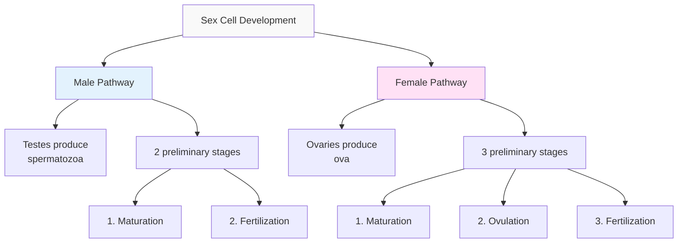
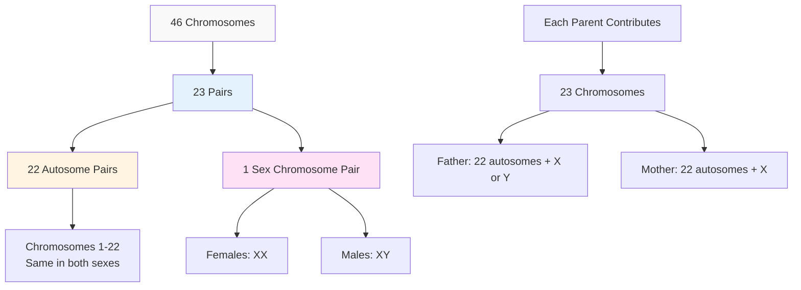
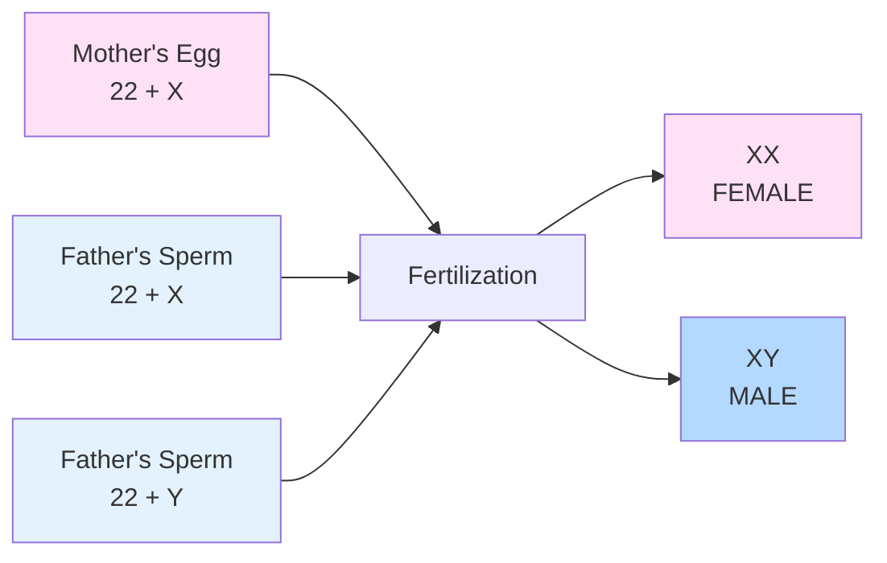

## Introduction

The beginning of human life is a remarkable biological event that sets the stage for all future development. At the moment of conception, when a sperm cell penetrates an egg cell, a unique genetic blueprint is established that will guide development throughout the lifespan. This single-cell beginning contains all the hereditary information needed to create a complex human being with approximately 37 trillion cells by adulthood.

Understanding the biological foundations of life—from sex cell formation to fertilization to genetic inheritance—is essential for comprehending prenatal development and the lifelong effects of our genetic endowment. [Human genetics](https://en.wikipedia.org/wiki/Human_genetics) has advanced dramatically in recent decades, particularly with the completion of the [Human Genome Project](https://www.genome.gov/human-genome-project) in 2003, which mapped all ~20,000-25,000 human genes.

:::tip Key Principle
Every individual's biological heritage—physical characteristics, predispositions, and developmental trajectory—is established at the moment of conception through the unique combination of genetic material from both parents. While environment profoundly shapes development, this genetic foundation provides the raw material upon which all development builds.
:::

---

## Educational Video: Conception and Early Development

<iframe width="560" height="315" src="https://www.youtube.com/embed/BtsSbZ85yiQ" title="Conception to Birth" frameborder="0" allow="accelerometer; autoplay; clipboard-write; encrypted-media; gyroscope; picture-in-picture" allowfullscreen></iframe>

*Conception to Birth: Visualizing the journey from fertilization through prenatal development*

---

## 1.0 The Beginning of Life: Conception

### 1.1 The Moment of Conception

**Definition**: Conception (fertilization) occurs when a male sperm cell successfully penetrates and fuses with a female egg cell (ovum), creating a new, genetically unique individual.

**The Process**:

The new life begins with the combination of a male sex cell (spermatozoon) and a female sex cell (ovum). This extraordinary event typically occurs in the **Fallopian tube**, not in the uterus as commonly believed.

**Key Steps**:

1. **Sperm Journey**: Millions of sperm cells begin the journey, but only one will successfully fertilize the egg
2. **Penetration**: When the tadpole-shaped sperm penetrates the ovum's outer wall (zona pellucida)
3. **Genetic Fusion**: The sperm releases its 23 chromosomes into the egg
4. **Nuclear Fusion**: The egg's nucleus breaks up, releasing its 23 chromosomes
5. **New Individual**: The resulting cell (zygote) contains 46 chromosomes—23 from each parent

:::note Remarkable Statistics
- **Sperm released**: 200-300 million per ejaculation
- **Sperm reaching egg**: Only 200-300
- **Sperm fertilizing egg**: Exactly 1
- **Time to reach egg**: 30 minutes to 3 days
- **Viability of sperm**: Up to 5 days in female reproductive tract
- **Viability of egg**: 12-24 hours after ovulation
:::

**From One Cell to Trillions**: At conception, the single-celled zygote contains all the genetic information needed to create a human being with:
- 37 trillion cells (by adulthood)
- 200+ different cell types
- Every cell (except red blood cells) containing the complete genetic blueprint

### 1.2 Development of Sex Cells

Sex cells (gametes) are specialized cells that must undergo specific developmental processes before they can create a new human being.

**Two Types of Sex Cells**:

1. **Male Sex Cells (Spermatozoa)**
   - Produced in male gonads (testes)
   - Small, mobile cells with tail (flagellum)
   - Contain either X or Y sex chromosome
   - Produced continuously after puberty
   - Millions produced daily

2. **Female Sex Cells (Ova/Eggs)**
   - Produced in female gonads (ovaries)
   - Large, non-mobile cells
   - Always contain X sex chromosome
   - Fixed number present at birth (~1-2 million)
   - One typically released per menstrual cycle

### 1.3 Preliminary Stages of Sex Cell Development

**Critical Difference**: Male sex cells go through **2 preliminary stages**, while female sex cells go through **3 preliminary stages** before they can produce a new human being.

#### **Stage 1: Maturation (Both Male and Female)**

**Definition**: Maturation is the process of chromosome reduction through meiotic cell division.

**The Process**:
- Occurs after puberty for both sexes
- [Meiosis](https://en.wikipedia.org/wiki/Meiosis) reduces chromosome number from 46 to 23
- One chromosome from each pair goes to a subdivided cell
- Creates "haploid" cells (23 chromosomes instead of normal 46 "diploid")
- This reduction allows two gametes to combine and restore 46 chromosomes

**Why Reduction is Necessary**:
- Normal body cells (somatic cells): 46 chromosomes (23 pairs)
- Sex cells must have: 23 chromosomes (one from each pair)
- When two sex cells combine: 23 + 23 = 46 chromosomes restored

:::example Genetic Variation Through Meiosis
[Meiosis creates genetic diversity](https://www.genome.gov/genetics-glossary/Meiosis) through two mechanisms:
1. **Independent assortment**: Chromosomes randomly distributed to daughter cells
2. **Crossing over**: Chromosome pairs exchange genetic material

This means each person can produce 8.4 million genetically different sex cells before considering crossing over—making each child truly unique!
:::

**Timing of Maturation**:
- **Males**: Begins at puberty, continues throughout adult life
- **Females**: Begins before birth (arrested in immature stage), completes after puberty

#### **Stage 2: Ovulation (Female Only)**

**Definition**: Ovulation is the process by which one mature ovum escapes from the ovary during each menstrual cycle.

**The Process**:
- Occurs approximately every 28 days (range: 21-35 days)
- One ovum released per cycle (typically)
- Two ovaries alternate in producing ripe ova
- Egg travels from ovary through Fallopian tube
- Viable for fertilization for 12-24 hours

**Key Facts**:
- Average woman experiences ~400-500 ovulations in lifetime
- Ovulation typically occurs ~14 days before next menstrual period
- Hormonal signals (LH surge) trigger ovulation
- Multiple ovulations can occur (fraternal twins)

**Contemporary Understanding**: [Modern ovulation tracking](https://www.nichd.nih.gov/health/topics/menstruation/conditioninfo/symptoms) uses multiple indicators:
- Basal body temperature rise
- Cervical mucus changes
- Ovulation predictor kits (detecting LH surge)
- Ultrasound monitoring (for fertility treatments)

#### **Stage 3: Fertilization (Both Male and Female)**

**Definition**: Fertilization is the fusion of male and female gametes, occurring at the time of conception.

**Location**: Normally occurs in the **upper third of the Fallopian tube**, not in the uterus.

**The Fertilization Process**:

1. **Capacitation** (0-6 hours after intercourse)
   - Sperm undergo biochemical changes in female reproductive tract
   - Become capable of penetrating egg

2. **Chemotaxis** 
   - Egg releases chemical signals
   - Guides sperm toward it

3. **Binding**
   - Sperm binds to zona pellucida (egg's outer layer)
   - Acrosomal reaction releases enzymes

4. **Penetration**
   - Single sperm penetrates zona pellucida
   - Immediate block to prevent other sperm (polyspermy prevention)

5. **Fusion**
   - Sperm and egg cell membranes fuse
   - Sperm nucleus enters egg cytoplasm

6. **Completion**
   - Egg completes final meiotic division
   - Male and female genetic material combine
   - Zygote formed with 46 chromosomes

:::tip Timing Window for Conception
**Fertile window**: The ~6-day period ending on ovulation day
- Sperm can survive up to 5 days in female reproductive tract
- Egg viable for 12-24 hours after ovulation
- Highest conception probability: 2 days before ovulation
- This narrow window explains why conception doesn't occur every cycle even with well-timed intercourse
:::

---

## 2.0 Chromosomes: The Carriers of Heredity

### 2.1 Understanding Chromosomes

**Definition**: [Chromosomes](https://en.wikipedia.org/wiki/Chromosome) are thread-like structures located in the cell nucleus that carry genetic information in the form of genes.

**Structure**:
- Made of DNA (deoxyribonucleic acid) wrapped around proteins (histones)
- Contain genes (specific DNA sequences)
- Visible under microscope only during cell division

**Human Chromosome Complement**:
- **46 total chromosomes** in normal human cells
- **23 pairs** of chromosomes
- **22 pairs** are autosomes (same in males and females)
- **1 pair** are sex chromosomes (XX for females, XY for males)

### 2.2 Types of Chromosomes

#### **Autosomes (Pairs 1-22)**

**Characteristics**:
- **22 pairs** possessed equally by males and females
- Numbered 1-22 by size (1 = largest, 22 = smallest)
- Carry genes for most physical and psychological traits
- Same in both sexes

**Function**:
- Determine most physical characteristics (height, eye color, etc.)
- Influence intelligence, personality traits, abilities
- Affect disease susceptibility
- Guide bodily development and function

#### **Sex Chromosomes (Pair 23)**

**The 23rd Pair**: These chromosomes differ in males and females and determine biological sex.

**X Chromosome**:
- Larger, contains ~1,000-1,500 genes
- All individuals have at least one X
- Females have two X chromosomes (XX)
- Carries genes for many traits beyond sex determination

**Y Chromosome**:
- Much smaller, contains only ~50-200 genes
- Only males have Y chromosome (XY)
- Contains SRY gene (Sex-determining Region Y)
- SRY gene triggers male development around week 6-7 of prenatal development

:::note Scientific Discovery
The [SRY gene was discovered in 1990](https://www.nature.com/articles/346240a0), finally identifying the specific genetic switch that determines male sex. Without a functioning SRY gene, even an XY individual will develop as female (Sinclair et al., 1990).
:::

### 2.3 Genes: The Units of Heredity

**What are Genes?**:
- Segments of DNA that code for specific proteins
- Basic units of heredity
- Humans have approximately 20,000-25,000 genes
- Each gene occupies specific location (locus) on a chromosome

**Gene Function**:
- Provide instructions for making proteins
- Proteins determine physical and biochemical characteristics
- Genes can be "turned on" or "turned off" (gene expression)
- Environmental factors influence gene expression (epigenetics)

**Alleles**: Different versions of the same gene
- Each person inherits two alleles for each gene (one from each parent)
- **Homozygous**: Two identical alleles (AA or aa)
- **Heterozygous**: Two different alleles (Aa)

**Dominant vs. Recessive**:
- **Dominant allele**: Expressed even with only one copy
- **Recessive allele**: Expressed only with two copies
- Examples: Brown eyes (dominant), blue eyes (recessive)

:::example Complex Inheritance
Most traits are **polygenic**—influenced by many genes, not just one. For example:
- **Height**: Influenced by 700+ genetic variants
- **Intelligence**: Hundreds or thousands of genes contribute
- **Personality**: Complex interactions of genes and environment
- **Skin color**: At least 6 genes involved

This complexity means that predicting traits from parents is challenging for most characteristics.
:::

---

## 3.0 Sex Determination: A Lifelong Influence

### 3.1 The Mechanism of Sex Determination

**Critical Principle**: **The father's sperm determines the sex of the child**, not the mother's egg.

**Why the Father Determines Sex**:

**Mother's Contribution**:
- All ova contain 22 autosomes + **X sex chromosome**
- Mother always contributes an X chromosome
- No variation in sex chromosome from mother

**Father's Contribution**:
- All sperm contain 22 autosomes + **X or Y sex chromosome**
- Approximately 50% of sperm carry X chromosome
- Approximately 50% of sperm carry Y chromosome
- Which sperm fertilizes the egg determines sex

**The Combinations**:
1. **If X-bearing sperm fertilizes egg**: XX = **Female**
2. **If Y-bearing sperm fertilizes egg**: XY = **Male**

:::note Historical Misunderstanding
Throughout history, women were often blamed for not producing male heirs. We now know this is scientifically incorrect—the father's sperm determines the child's sex. King Henry VIII of England famously divorced and executed wives for "failing" to produce male heirs, when biologically, the sex determination was entirely due to his sperm!
:::

**Sex Ratio at Conception and Birth**:
- **At conception**: Approximately 120-160 males conceived per 100 females
- **At birth**: Approximately 105-107 males born per 100 females
- **Why the change?**: Higher male fetal and infant mortality
- **By adulthood**: Ratio approaches 1:1, then favors females (women live longer)

### 3.2 Timing of Sex Determination

**When Sex is Determined**:
- **Chromosomal sex**: Determined at conception (moment of fertilization)
- **Gonadal sex**: Begins week 6-7 when SRY gene (if present) activates
- **Phenotypic sex** (external genitalia): Develops weeks 8-12

**Cannot Be Changed After Conception**:
Once fertilization occurs, the chromosomal sex is fixed. While surgical and hormonal interventions can later modify physical sex characteristics (sex reassignment), the chromosomal complement established at conception remains unchanged in every cell.

:::example Disorders of Sex Development (DSD)
Sometimes sex determination doesn't follow the typical pattern:
- **Androgen Insensitivity Syndrome**: XY individual develops female appearance
- **Congenital Adrenal Hyperplasia**: XX individual may have masculinized genitalia
- **Klinefelter Syndrome**: XXY (extra X chromosome in males)
- **Turner Syndrome**: X (missing second sex chromosome in females)

These conditions demonstrate that sex development is more complex than simply XX vs. XY, involving intricate hormonal and genetic cascades.
:::

### 3.3 Lifelong Significance of Sex

**Why Sex Matters for Development**:

The question arises: Why is the sex of an individual important to lifelong development? The answer consists of three main points:

#### **1. Cultural Pressure and Social Expectations**

**Principle**: Each year, from infancy onward, children come under increasing cultural pressure from parents, teachers, peer groups, and society at large to develop attitudes and behavior patterns considered appropriate for members of their sex.

**Evidence**:
- Parents treat boys and girls differently from birth
- Toy preferences are heavily gender-influenced
- Peer groups enforce gender norms strictly
- Media reinforces gender stereotypes
- Career expectations differ by sex

**Consequence**: Children who learn to behave in ways considered appropriate for their sex are assured of social acceptance, while those who deviate may face rejection or ridicule.

:::example Gender Socialization
Research shows that:
- Parents provide different toys (dolls vs. trucks) based on child's sex
- Adults describe identical infant behavior differently based on perceived sex
- By age 3, children show strong gender-typed toy preferences
- Peer teasing for gender non-conformity peaks in middle childhood
- [Cross-cultural studies](https://www.ncbi.nlm.nih.gov/pmc/articles/PMC3166361/) show both universal and culturally-specific gender expectations
:::

#### **2. Differential Learning Experiences**

**Principle**: Learning experiences throughout childhood and adolescence are significantly determined by the individual's sex. Children learn what is considered appropriate for members of their sex through observation, instruction, and reinforcement.

**Examples**:
- **Boys**: Encouraged toward active play, rough-and-tumble, competitive sports, mechanical/building toys
- **Girls**: Encouraged toward nurturant play, dolls, cooperation, domestic activities
- A boy who prefers "girls' games" may be called a **"sissy"**
- A girl who prefers "boys' games" may be called a **"tomboy"**

**Contemporary Changes**:
- Gender-neutral parenting approaches
- Declining enforcement of rigid gender norms
- More acceptance of gender diversity
- Yet significant gender typing persists

:::note Research Evidence
Longitudinal studies show that:
- Early gender-typed toy play predicts later gender-typed interests
- But: Many children show cross-gender interests without problems
- Extreme restriction of cross-gender activities may be harmful
- Flexibility in gender expression associated with better adjustment
:::

#### **3. Attitudes of Parents and Family Members**

**Principle**: The attitudes of parents and other family members toward the child's sex profoundly influence early personality development.

**Critical Early Period**: During the first years of life, when foundations of personality patterns are being laid, differential treatment based on sex can have lasting effects.

**Twin Studies Show**:
- When twins are same-sex vs. opposite-sex, parental attention may differ
- Mother must share attention between two infants
- If one child gets more attention (often the male), the other may feel rejected
- Feelings of rejection in early childhood can shape lifelong personality patterns

**Son Preference**: Recent studies show that traditional preference for male children, especially as firstborn, still persists in many cultures:
- Affects parental emotional investment
- Influences family resource allocation
- Shapes sibling relationships
- Creates different developmental environments

:::caution Sex Bias Effects
[Research from cultures with strong son preference](https://www.who.int/news-room/fact-sheets/detail/gender) shows:
- Girls may receive less nutrition, healthcare, education
- Sex-selective abortion in some regions
- Female infanticide historically
- These practices have serious developmental consequences
- Modern efforts aim to promote gender equity
:::

**Contemporary Perspective**: While biological sex matters, [gender identity](https://en.wikipedia.org/wiki/Gender_identity) (one's internal sense of gender) may not always align with chromosomal or anatomical sex. Understanding this distinction has become increasingly important in developmental psychology.

---

## 4.0 Differences Between Male and Female Sex Cells

### 4.1 Two Critical Differences

Male and female sex cells differ in **two important ways** that have significant implications for reproduction and development:

#### **Difference 1: Chromosome Composition**

**Mature Ovum (Female)**:
- Contains 23 **matched** chromosomes
- 22 autosomes + X sex chromosome
- Always contributes an X chromosome
- No variation in sex chromosome contribution

**Mature Spermatozoon (Male)**:
- Contains 22 matched chromosomes + 1 unmatched chromosome
- 22 autosomes + **either X or Y** sex chromosome
- Determines offspring's sex
- Variation in sex chromosome contribution

**Sex Determination Process**:
- **X-bearing spermatozoon + X-bearing ovum → XX (Female)**
- **Y-bearing spermatozoon + X-bearing ovum → XY (Male)**

**Important Fact**: The X and Y chromosomes are the **sex determinant chromosomes**. The mature ovum always contains an X chromosome. The sex of the offspring depends entirely on whether the fertilizing spermatozoon carries an X or Y chromosome.

#### **Difference 2: Number of Preliminary Stages**

**Male Sex Cells**:
- **2 preliminary stages**:
  1. Maturation
  2. Fertilization

**Female Sex Cells**:
- **3 preliminary stages**:
  1. Maturation
  2. Ovulation (unique to females)
  3. Fertilization

**Why This Matters**:
- Female reproductive process is more complex
- Additional stage (ovulation) creates temporal constraints
- Timing of ovulation critical for conception
- Understanding these stages important for fertility

### 4.2 Sex Cell Production Differences

**Spermatogenesis (Male)**:
- Begins at puberty
- Continues throughout adult life
- Millions of sperm produced daily
- Takes ~74 days per sperm cell
- Production relatively constant
- Quality may decline with age but production continues

**Oogenesis (Female)**:
- Begins before birth
- Arrested in immature stage
- Fixed number of eggs (~1-2 million at birth)
- Decreases over time (~400,000 at puberty)
- Only ~400-500 eggs ovulated in lifetime
- One released per cycle (typically)
- Egg quality declines with maternal age

:::note Biological Asymmetry
The vast difference in gamete production creates biological asymmetry:
- **Males**: Potential to father thousands of offspring (theoretically)
- **Females**: Limited to ~400 potential offspring (practically much fewer)
- This asymmetry has evolutionary, social, and psychological implications
- Influences reproductive strategies and parental investment
:::

---

## Self-Assessment Questions

1. **Explain the process of fertilization. Where does it typically occur, and what are the key steps involved?**

2. **Why must sex cells undergo maturation (meiosis) before they can produce a new individual? What would happen without this chromosome reduction?**

3. **Describe the three preliminary stages that female sex cells must pass through before producing a new human being. Why do male sex cells require only two stages?**

4. **Explain how sex is determined at conception. Why is it scientifically incorrect to blame women for not producing male children?**

5. **What are chromosomes, and how many does a normal human cell contain? Distinguish between autosomes and sex chromosomes.**

6. **Discuss the three reasons why an individual's sex is important to lifelong development. Provide specific examples for each.**

7. **Compare and contrast spermatogenesis and oogenesis. How do these differences affect reproductive potential?**

8. **What is the "fertile window" for conception? Why is timing so critical for successful fertilization?**

9. **Explain the concept of haploid vs. diploid cells. Why is this distinction important in sexual reproduction?**

10. **How has understanding of human genetics advanced with the Human Genome Project? What are some practical applications of this knowledge?**

---

## Memory Aids and Mnemonics

### **3 Preliminary Stages for Female Sex Cells: "MOF"**
- **M**aturation: Chromosome reduction
- **O**vulation: Egg release from ovary
- **F**ertilization: Union with sperm

### **2 Preliminary Stages for Male Sex Cells: "MF"**
- **M**aturation: Chromosome reduction
- **F**ertilization: Union with egg

### **Chromosome Numbers: "46 total, 23 pairs, 22 auto, 1 sex"**
- **46**: Total chromosomes in normal human cell
- **23**: Pairs of chromosomes
- **22**: Pairs of autosomes (same in both sexes)
- **1**: Pair of sex chromosomes (XX female, XY male)

### **Sex Determination: "Father's Sperm Decides"**
- **Mother**: Always gives X (no choice)
- **Father**: Gives X (→girl) or Y (→boy)
- **Remember**: King Henry VIII blamed wives, but it was his fault!

### **Gamete = Sex Cell: "GAme of METE-ing"**
- **GA**mete
- **ME**eting (two cells meet at fertilization)
- Specialized cells for reproduction

### **3 Reasons Sex Matters: "CLA"**
- **C**ultural pressure and social expectations
- **L**earning experiences differ by sex
- **A**ttitudes of parents/family members

### **Haploid vs. Diploid: "HALf vs. DIplo-twice"**
- **Haploid**: 23 chromosomes (half the normal number)
- **Diploid**: 46 chromosomes (double set, normal body cells)

### **SRY Gene: "Sex-determining Region on Y"**
- Located on Y chromosome
- Triggers male development
- Without it: female development occurs (even with XY)

---

## Practical Applications

### For Healthcare Professionals

**Genetic Counseling**:
1. Understand inheritance patterns for genetic conditions
2. Explain sex-linked disorders (X-linked recessive, etc.)
3. Discuss sex determination with prospective parents
4. Address concerns about chromosomal abnormalities
5. Explain genetic testing options

**Fertility Treatment**:
1. Time interventions with ovulation
2. Understand male and female factor infertility
3. Explain success rates realistically
4. Monitor egg and sperm quality
5. Support couples through process

### For Educators

**Sex Education**:
1. Teach basic reproductive biology accurately
2. Explain conception and sex determination
3. Discuss both biological sex and gender identity
4. Address common misconceptions
5. Promote gender equity

**Genetics Education**:
1. Teach Mendelian and non-Mendelian inheritance
2. Explain chromosome structure and function
3. Discuss ethical issues in genetics
4. Connect to evolution and biodiversity
5. Address genetic testing and privacy

### For Parents

**Understanding Development**:
1. Recognize that sex is determined at conception
2. Understand genetic contribution from both parents
3. Avoid gender stereotyping while acknowledging biological differences
4. Support child's individual personality regardless of sex
5. Provide equal opportunities and expectations

**Gender Socialization**:
1. Be aware of unconscious gender biases
2. Provide diverse toys and activities
3. Model gender flexibility
4. Support child's interests regardless of gender typicality
5. Teach respect for all gender expressions

---

## Further Reading and Resources

### Academic Resources

1. **Moore, K. L., Persaud, T. V. N., & Torchia, M. G. (2019)**. *The Developing Human: Clinically Oriented Embryology* (11th ed.). Elsevier.
   - Comprehensive textbook on human embryology

2. **Sadler, T. W. (2018)**. *Langman's Medical Embryology* (14th ed.). Wolters Kluwer.
   - Classic medical embryology text

3. **Gilbert, S. F. (2016)**. *Developmental Biology* (11th ed.). Sinauer Associates.
   - Excellent resource on developmental mechanisms

### Online Resources

- [National Human Genome Research Institute](https://www.genome.gov/) - Genetics education
- [American Society for Reproductive Medicine](https://www.reproductivefacts.org/) - Fertility information
- [March of Dimes](https://www.marchofdimes.org/) - Pregnancy and birth defects
- [Khan Academy: Meiosis](https://www.khanacademy.org/science/biology/cellular-molecular-biology/meiosis) - Free educational videos

---

**Source PDF**: 
- 📄 [Block-1/Unit-2.pdf - Pages 1-6](/pdfs/MPC-002%20Life%20Span%20Psychology/Block-1/Unit-2.pdf)
- 📚 MPC-002 Life Span Psychology

---

## Summary

Human life begins at conception when a sperm cell from the father fertilizes an egg cell from the mother, creating a zygote with 46 chromosomes—23 from each parent. Male sex cells must pass through two preliminary developmental stages (maturation and fertilization), while female sex cells must pass through three stages (maturation, ovulation, and fertilization) before they can produce a new individual.

All biological heritage from both parents is contained in 23 pairs of chromosomes: 22 pairs of autosomes (same in both sexes) and one pair of sex chromosomes (XX for females, XY for males). The father's sperm determines the child's sex—X-bearing sperm produces females (XX), Y-bearing sperm produces males (XY). This chromosomal sex is fixed at conception and cannot be changed.

Sex has lifelong developmental significance for three main reasons: (1) children face increasing cultural pressure to develop sex-appropriate attitudes and behaviors, (2) learning experiences are determined by the individual's sex, and (3) attitudes of parents and family members toward the child's sex profoundly influence early personality development. Understanding these genetic foundations is essential for comprehending prenatal development and recognizing the interplay between biological sex and social gender throughout the lifespan.

The Human Genome Project has revolutionized our understanding of human genetics, revealing approximately 20,000-25,000 genes that guide development. While genes provide the blueprint, environmental factors profoundly influence how this genetic potential is expressed—a principle known as gene-environment interaction that operates throughout the lifespan.
