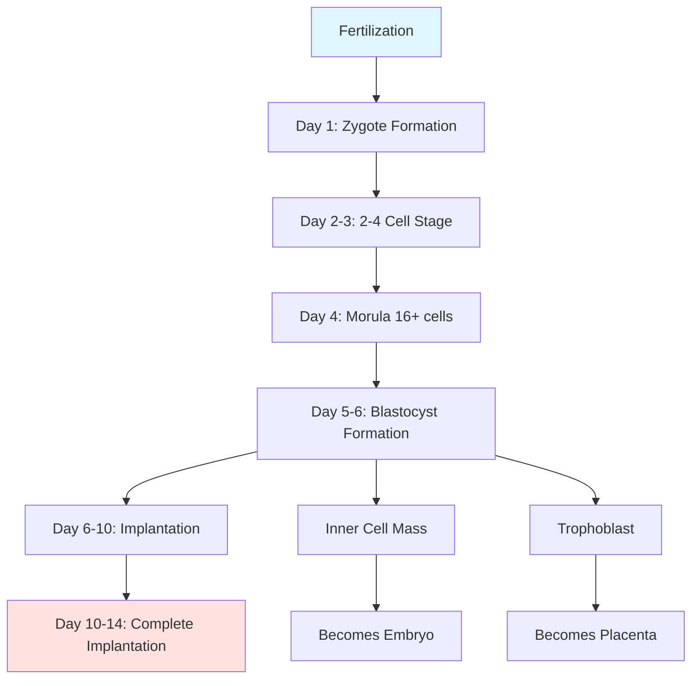
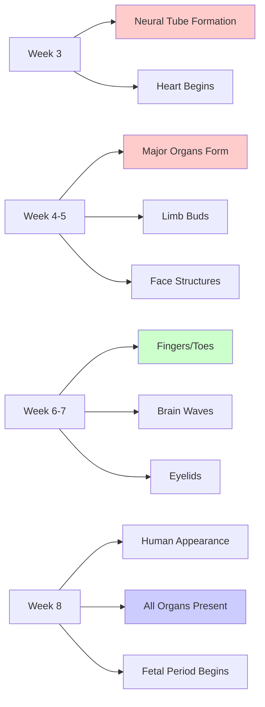
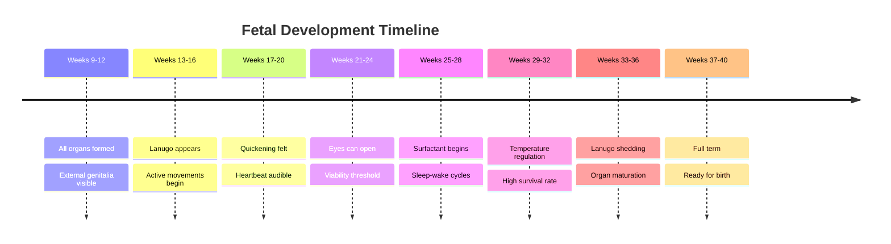

# Stages of Prenatal Development: Zygote, Embryo, and Fetus

## Introduction

The prenatal period represents the most dramatic developmental transformation in the human lifespan. In approximately 266-280 days (38-40 weeks), a single-celled zygote transforms into a fully formed infant ready for birth. This journey involves three distinct stages—the period of the zygote, the period of the embryo, and the period of the fetus—each characterized by unique developmental milestones, vulnerabilities, and rapid growth patterns. Understanding these stages is crucial for comprehending normal development, identifying developmental abnormalities, and implementing appropriate prenatal care.

The prenatal period is characterized by extraordinarily rapid growth—weight increases approximately 11 million times from conception to birth. No other period in the human lifespan witnesses such dramatic physical transformation. This unit explores each developmental stage in detail, examining the biological processes, critical periods, and clinical significance of prenatal development.

## Overview of Prenatal Development

### Timeline and Duration

The prenatal period extends from conception (fertilization) to birth, typically lasting:

- **Gestational age**: 38-40 weeks (calculated from last menstrual period)
- **Developmental age**: 36-38 weeks (calculated from conception)
- **Average duration**: 266-280 days or 9 calendar months
- **Lunar months**: 10 lunar months of 28 days each

Research by Meredith (1991) indicates that approximately 70% of births occur between 36-40 weeks, while 98% fall within the 34-42 week range (238-294 days). Understanding this variability is important for clinical practice, as premature births (before 37 weeks) and post-term pregnancies (after 42 weeks) carry distinct health implications.

### Division into Three Stages

The prenatal period is conventionally divided into three distinct stages based on developmental characteristics:

1. **Period of the Zygote** (Weeks 0-2): From fertilization to implantation
2. **Period of the Embryo** (Weeks 3-8): From implantation through organogenesis
3. **Period of the Fetus** (Weeks 9-birth): From differentiation through maturation

Each stage has distinct developmental processes, vulnerabilities to teratogens (harmful environmental agents), and clinical significance. The transitions between stages represent major developmental milestones rather than arbitrary temporal divisions.

## Period of the Zygote (Fertilization to End of Second Week)

### Fertilization: The Beginning of Life

The period of the zygote begins with **fertilization**—the moment when a sperm cell successfully penetrates and merges with an ovum (egg cell). This remarkable event typically occurs in the **ampulla** of the fallopian tube, the widest portion located near the ovary.

#### The Fertilization Process

When ejaculated, approximately 200-300 million sperm begin their journey through the female reproductive tract. Only a few hundred reach the vicinity of the egg, and typically only one succeeds in fertilization:

1. **Sperm capacitation**: During the journey through the uterus and fallopian tube, sperm undergo biochemical changes that enable them to penetrate the egg
2. **Acrosome reaction**: The sperm releases enzymes that digest the egg's protective layers
3. **Membrane fusion**: The sperm cell membrane fuses with the egg cell membrane
4. **Chromosome delivery**: The sperm nucleus containing 23 chromosomes enters the egg
5. **Cortical reaction**: The egg immediately undergoes chemical changes that prevent other sperm from entering (polyspermy block)

Recent research using time-lapse imaging has revealed that the egg plays an active role in selecting which sperm fertilizes it, challenging earlier assumptions about passive fertilization (Fitzharris, 2023).

### Genetic Combination and Sex Determination

At fertilization, the zygote receives its complete genetic blueprint:

- **23 chromosomes from mother** (contained in the egg)
- **23 chromosomes from father** (delivered by sperm)
- **Total: 46 chromosomes** organized into 23 pairs

Of these 23 pairs:
- **22 pairs are autosomes** (identical in males and females)
- **1 pair consists of sex chromosomes** (determines biological sex)

Sex determination occurs at the moment of fertilization:

**Female (XX)**:
- Egg always contributes an X chromosome
- Sperm contributes an X chromosome
- Result: XX combination = female

**Male (XY)**:
- Egg always contributes an X chromosome
- Sperm contributes a Y chromosome
- Result: XY combination = male

The sex of the offspring is thus determined by which type of sperm (X-bearing or Y-bearing) fertilizes the egg. Recent discoveries have identified the SRY gene (Sex-determining Region Y) on the Y chromosome as the primary trigger for male sexual differentiation (Capel, 2023).

### Early Cell Division: From One Cell to Many

Following fertilization, the zygote begins a series of rapid cell divisions called **cleavage**:

#### Mitotic Division Timeline

**Day 1 (0-24 hours post-fertilization)**:
- Single-celled zygote begins first cleavage division
- DNA replication and chromosome duplication occur

**Day 2 (24-48 hours)**:
- Zygote divides into 2 cells, then 4 cells
- Cells are called **blastomeres**
- Division continues as zygote travels down fallopian tube

**Day 3-4 (48-96 hours)**:
- 8-cell stage, then 16-cell stage (morula)
- Cells remain approximately the same total size
- No growth occurs—only division

**Day 5-6 (96-144 hours)**:
- Blastocyst formation begins
- Fluid-filled cavity (blastocoel) develops
- Two distinct cell populations emerge:
  - **Trophoblast**: Outer cell layer (becomes placenta)
  - **Inner cell mass**: Inner cell cluster (becomes embryo)

### Implantation: Establishing Connection

Approximately 6-10 days after fertilization, the blastocyst reaches the uterus and begins **implantation**—embedding itself into the uterine wall (endometrium). This complex process is critical for pregnancy success:

#### Stages of Implantation

1. **Apposition** (Day 6-7): Blastocyst adheres to uterine wall
2. **Adhesion** (Day 7-8): Trophoblast cells attach firmly to endometrium
3. **Invasion** (Day 8-12): Trophoblast cells burrow into uterine tissue
4. **Placentation begins**: Formation of early placental structures

The trophoblast differentiates into two layers:
- **Cytotrophoblast**: Inner cellular layer
- **Syncytiotrophoblast**: Outer multinucleated layer that invades maternal tissue

By the end of the second week, the embryo is completely embedded in the uterine wall, and primitive placental structures begin forming. The **chorion** (outer membrane) and **amnion** (inner membrane) develop to protect and nourish the developing organism.

### Critical Vulnerabilities During Zygote Period

The period of the zygote has several important characteristics affecting development:

**High Loss Rate**: Research estimates that 50-70% of fertilized eggs fail to implant successfully or result in early pregnancy loss (Larsen et al., 2023). Many losses occur before women are aware of pregnancy.

**"All-or-Nothing" Principle**: During this stage, harmful exposures typically result in either:
- Complete pregnancy loss (the zygote does not survive)
- No significant effect (the zygote recovers)

Major congenital abnormalities rarely result from exposures during the zygote period because the cells are still undifferentiated and can compensate for damage.

## Period of the Embryo (End of Second Week to End of Eighth Week)

The embryonic period extends from approximately the 15th day after conception (end of second week) until about the 8th week, when the embryo measures approximately 1.2 inches (3 cm) in length. This stage is characterized by **organogenesis**—the formation of all major organ systems and body structures.

### Critical Period of Development

The embryonic period is widely recognized as the **most critical period** for human development. During these six weeks, the embryo transforms from a simple cluster of cells into a miniature human being with recognizable body structures. This period is marked by:

**Rapid Differentiation**: Cells differentiate into specialized tissues and organs
**Organogenesis**: All major organ systems begin forming
**Highest Vulnerability**: Maximum susceptibility to teratogens and developmental disruptions
**Foundation Building**: Structures formed now determine lifelong anatomical patterns

### Tissue Differentiation and Germ Layers

Early in the embryonic period, cells organize into three distinct layers called **germ layers**. This process, called **gastrulation**, occurs during the third week after conception:

#### The Three Germ Layers

**1. Ectoderm (Outer Layer)**
Develops into:
- Nervous system (brain, spinal cord, peripheral nerves)
- Sensory organs (eyes, ears, nose)
- Skin, hair, nails
- Mammary glands, tooth enamel

**2. Mesoderm (Middle Layer)**
Develops into:
- Skeletal system (bones, cartilage)
- Muscular system
- Circulatory system (heart, blood vessels, blood cells)
- Excretory system (kidneys, ureters)
- Reproductive system (gonads, ducts)
- Dermis of skin

**3. Endoderm (Inner Layer)**
Develops into:
- Digestive system (stomach, intestines, liver, pancreas)
- Respiratory system (lungs, trachea)
- Urinary bladder
- Thyroid and parathyroid glands

This three-layer organization represents one of the most fundamental principles of embryology. Understanding which structures derive from which germ layer helps explain why certain birth defects co-occur—organs developing from the same germ layer at the same time share vulnerability patterns.

### Week-by-Week Embryonic Development

#### Week 3 (Days 15-21)

**Major Developments**:
- **Gastrulation**: Formation of three germ layers
- **Neurulation begins**: Neural tube starts forming (becomes brain and spinal cord)
- **Primitive cardiovascular system**: Heart precursor cells begin organizing
- **Somites appear**: Segments that become vertebrae and muscles

**Size**: 1-2 mm (smaller than a grain of rice)

**Teratogen Vulnerability**: Neural tube defects (spina bifida, anencephaly) can result from disruptions during this week. Folic acid supplementation is critical during this period.

#### Week 4 (Days 22-28)

**Major Developments**:
- **Heart begins beating**: Around day 22-23, the heart starts rhythmic contractions (can be detected via ultrasound)
- **Neural tube closes**: Completion of brain and spinal cord enclosure
- **Limb buds appear**: Arm and leg buds become visible
- **Eye and ear rudiments**: Early sensory organ development
- **Pharyngeal arches form**: Structures that become jaw, middle ear, larynx

**Size**: 4-5 mm (¼ inch, about the size of a lentil)

**Teratogen Vulnerability**: Heart defects, facial clefts, limb abnormalities

**Clinical Significance**: The heart is still developing outside the body cavity at this stage. It will move into the chest later in development.

#### Week 5 (Days 29-35)

**Major Developments**:
- **Rapid brain growth**: Five distinct brain regions visible
- **Face formation begins**: Eyes, nose, mouth structures forming
- **Hand and foot plates**: Paddle-like appendages appear
- **Umbilical cord clearly forms**: Connection between embryo and developing placenta
- **Digestive tract lengthens**: Stomach, intestines differentiate

**Size**: 8-10 mm (½ inch)

**Teratogen Vulnerability**: Craniofacial abnormalities, heart defects, eye malformations

#### Week 6 (Days 36-42)

**Major Developments**:
- **Finger and toe ridges**: Digits begin separating (may still be webbed)
- **Facial features refining**: Eyes move toward front of face
- **Brain wave activity begins**: Primitive electrical activity detected
- **Lung buds form**: Respiratory system developing
- **Intestines lengthen significantly**: Begin to protrude into umbilical cord temporarily

**Size**: 12-14 mm (½ inch, about the size of a pea)

**Teratogen Vulnerability**: Cleft lip/palate, heart defects, ambiguous genitalia

#### Week 7 (Days 43-49)

**Major Developments**:
- **Eyelids form**: Begin covering eyes (will fuse shut)
- **Tongue develops**: Taste buds beginning
- **All essential organs begun**: Every major organ system has initiated development
- **Elbows and toes visible**: Limbs becoming more defined
- **Bone begins replacing cartilage**: Ossification starts

**Size**: 16-18 mm (⅝ inch)

**Teratogen Vulnerability**: Cleft palate, heart problems, genital abnormalities

#### Week 8 (Days 50-56)

**Major Developments**:
- **Embryo looks recognizably human**: Facial features, body proportions more human-like
- **External ears formed**: Auditory structures visible
- **External genitalia begin differentiating**: Still difficult to distinguish male/female visually
- **Eyelids meet and fuse**: Will remain closed until week 26-28
- **Muscles contract**: Movement begins (not yet felt by mother)
- **Fingers and toes separate**: Webbing disappears

**Size**: 25-30 mm (1 inch), weighs about 1/15 ounce (1.7 grams)

**Transition Point**: By the end of week 8, the embryo is officially termed a **fetus**. All major structures present in a full-term baby are now formed, though immature.

### Teratogenic Sensitivity During Embryonic Period

The embryonic period represents the time of **maximum sensitivity to teratogens**—environmental agents that can cause birth defects. This heightened vulnerability exists because:

1. **Rapid cell division**: Cells dividing quickly are more susceptible to disruption
2. **Differentiation occurring**: Cells committing to specific fates can be misdirected
3. **Critical periods**: Each organ has a specific window of formation
4. **Foundation building**: Errors now affect final structure permanently

**Critical Period Concept**: Each organ system has a specific time window during which it is most vulnerable to disruption. For example:

- **Heart**: Weeks 3-6 (peak sensitivity week 4-5)
- **Central nervous system**: Weeks 3-8 (continues beyond)
- **Eyes**: Weeks 4-7
- **Limbs**: Weeks 4-7
- **Palate**: Weeks 6-9
- **External genitalia**: Weeks 7-16

Contemporary research emphasizes that vulnerability extends beyond these windows but is highest during the critical period (Moore et al., 2023).

## Period of the Fetus (End of Eighth Week to Birth)

The fetal period extends from the beginning of the ninth week after conception until birth (approximately 30-32 weeks duration). During this longest prenatal stage, the primary developmental focus shifts from organ formation (organogenesis) to organ maturation, rapid growth, and functional development.

### Characteristics of Fetal Development

The fetal period is characterized by:

**Growth and Enlargement**: Dramatic increases in size and weight
**Functional Maturation**: Organs become capable of supporting life
**Refinement**: Body proportions become more balanced
**Preparation for Birth**: Systems develop capabilities needed for extra-uterine life
**Lower Teratogen Sensitivity**: Compared to embryonic period, but still vulnerable

While major structural abnormalities are less likely during the fetal period, teratogen exposure can still cause:
- Functional deficits (hearing loss, cognitive impairment)
- Growth restriction
- Minor structural abnormalities
- Premature birth

### First Trimester Conclusion (Weeks 9-12)

**Weeks 9-10**:
- **Size**: 3-4 cm (1.2 inches), 7 grams (¼ ounce)
- Nail beds forming on fingers and toes
- Eyelids still fused
- External ears well formed
- Face has distinctly human appearance
- Red blood cells produced in liver
- Kidneys begin producing urine
- Intestines pull back from umbilical cord into abdomen

**Weeks 11-12**:
- **Size**: 6-7.5 cm (2.5-3 inches), 14-28 grams (½-1 ounce)
- Sex differentiation visible via ultrasound (though often still difficult)
- Vocal cords forming
- Fingernails appear
- Face well formed
- Eyelids still closed
- Fetus can make coordinated movements

**Developmental Milestone**: By the end of week 12 (end of first trimester), all major organs and systems are formed. The risk of miscarriage decreases significantly after this point.

### Second Trimester (Weeks 13-27)

The second trimester is often considered the most comfortable period of pregnancy for mothers and represents rapid fetal growth and maturation.

#### Weeks 13-16 (Month 4)

**Major Developments**:
- **Size**: 15 cm (6 inches), 100 grams (3.5 ounces)
- Skin nearly transparent
- **Lanugo appears**: Fine, downy hair covering body (helps regulate temperature)
- Face more human-like, eyes moving toward front of head
- Ears moving toward correct position
- Neck elongates, head more erect
- Skeleton becoming visible on X-ray (bones hardening)
- Sucking reflex developing
- Fetus makes active movements (not yet felt by mother)

**Clinical Significance**: The fetus begins making breathing-like movements, though the lungs are not yet functional. This practice breathing is essential for lung development.

#### Weeks 17-20 (Month 5)

**Major Developments**:
- **Size**: 20-25 cm (8-10 inches), 300-450 grams (10-16 ounces)
- **Quickening**: Mother begins feeling fetal movements (primigravidas around week 18-20, multigravidas around week 16-18)
- **Vernix caseosa**: Protective greasy coating appears on skin
- Eyebrows and head hair growing
- Sebaceous glands forming
- Heartbeat audible with stethoscope
- **Fingerprints and footprints forming**: Unique patterns establish
- Rapid eye movement sleep appears

**Sex Determination via Ultrasound**: External genitalia fully differentiated and clearly visible on ultrasound by week 18-20.

**Contemporary Research**: Recent studies using 4D ultrasound have documented complex fetal behaviors during this period, including yawning, swallowing, and facial expressions, suggesting more sophisticated neural development than previously recognized (Reissland & Austen, 2023).

#### Weeks 21-24 (Month 6)

**Major Developments**:
- **Size**: 28-30 cm (11-12 inches), 600-700 grams (1.3-1.5 pounds)
- Skin wrinkled, reddish, covered with vernix caseosa
- Eyebrows and eyelashes well formed
- **Eyes can open**: Eyelid fusion ends around week 26
- **Fingernails complete**: Reach fingertips
- **Startle reflex**: Sudden movements in response to loud sounds
- Footprints and fingerprints distinct
- **Alveoli forming in lungs**: Air sacs where gas exchange will occur (though immature)
- Increased brain complexity

**Viability Milestone**: Week 24 is generally considered the threshold of viability—survival becomes possible with intensive medical support, though significant complications are common. Survival rates at 24 weeks are approximately 50-70% with modern NICU care, but long-term disabilities are frequent (Johnson et al., 2024).

#### Weeks 25-27 (End of Month 6-Start of Month 7)

**Major Developments**:
- **Size**: 35-37 cm (14-15 inches), 900-1000 grams (2-2.2 pounds)
- **Rapid brain development**: Cerebral cortex developing rapidly
- **Surfactant production begins**: Substance allowing lungs to expand (still insufficient for independent breathing)
- Eyelids can open and close
- **Regular sleep-wake cycles**: Distinct rest and activity periods
- Responds to light, sound, pain
- **Lung development critical**: Premature birth at this stage still requires respiratory support

**Clinical Significance**: Corticosteroid injections given to mothers at risk of preterm delivery during this period significantly improve fetal lung maturity and outcomes (Crowther et al., 2024).

### Third Trimester (Weeks 28-40)

The final trimester focuses on continued growth, functional maturation, and preparation for independent life outside the womb.

#### Weeks 28-32 (Months 7-8)

**Major Developments**:
- **Size**: 37-42 cm (15-17 inches), 1.1-1.8 kg (2.4-4 pounds)
- **Respiratory system maturing**: Surfactant production increasing
- **Temperature regulation improving**: Fat deposits accumulating
- Bones fully developed but still soft and flexible
- **Iron, calcium, phosphorus storage**: Essential minerals being stored
- Rhythmic breathing movements regular
- **Central nervous system maturing**: Better control over body functions
- Toenails complete

**Survival Rates**: A baby born at 32 weeks has excellent survival prospects (>95%) with modern NICU care, though respiratory support may be needed initially.

#### Weeks 33-36 (Month 9)

**Major Developments**:
- **Size**: 43-46 cm (17-18 inches), 2.0-2.7 kg (4.4-6 pounds)
- **Lanugo disappearing**: Body hair shedding
- **Fat accumulation**: Skin becoming smoother, less wrinkled
- Firm grasp reflex
- **Organs nearly mature**: Most systems functional
- Increasing antibody transfer from mother
- **Optimal survival**: 36+ week babies have excellent outcomes similar to full-term infants

**Definition Change**: Babies born after 34 weeks are considered "late preterm" rather than premature, reflecting improved maturity.

#### Weeks 37-40 (Full Term)

**Weeks 37-38 (Early Term)**:
- **Size**: 47-48 cm (18.5-19 inches), 2.9-3.2 kg (6.4-7 pounds)
- **Considered full term**: Ready for birth
- Lungs mature, producing sufficient surfactant
- Digestive system ready to process breast milk/formula
- Immune system functional (though still immature)

**Weeks 39-40 (Full Term)**:
- **Size**: 48-51 cm (19-20 inches), 3.2-3.6 kg (7-8 pounds)
- **Optimal birth timing**: Best outcomes occur with deliveries between 39-40 weeks
- Vernix caseosa mostly absorbed
- Lanugo completely gone
- Head circumference approximately equal to shoulder circumference
- Skull bones not yet fused (allows passage through birth canal)

**Week 41+ (Late Term/Post-Term)**:
- Pregnancies extending beyond 41 weeks require close monitoring
- Increased risk of placental insufficiency
- Higher rate of meconium passage
- After 42 weeks, classified as "post-term" pregnancy

Recent ACOG (American College of Obstetricians and Gynecologists) guidelines emphasize that babies born at 39-40 weeks have optimal outcomes, leading to reconsideration of elective inductions before 39 weeks (ACOG, 2024).

## Clinical Implications and Applications

### Prenatal Care and Monitoring

Understanding the stages of prenatal development informs critical clinical practices:

**First Trimester Screening**:
- Ultrasound confirmation of viable pregnancy (6-8 weeks)
- Dating ultrasound (establishes gestational age)
- First-trimester combined screening for chromosomal abnormalities (11-14 weeks)
- Early anatomy assessment (13-14 weeks in some protocols)

**Second Trimester Screening**:
- Detailed anatomy scan (18-22 weeks): Examines all major organ systems
- Maternal serum screening (15-20 weeks)
- Fetal echocardiography if indicated (18-24 weeks)
- Assessment of cervical length (preterm birth risk)

**Third Trimester Monitoring**:
- Growth ultrasounds (assessing fetal size and development)
- Non-stress testing (fetal heart rate monitoring)
- Biophysical profile (combined assessment of fetal well-being)
- Group B Streptococcus screening (35-37 weeks)

### Timing of Medical Interventions

Knowledge of developmental stages influences the timing of interventions:

**Folic Acid Supplementation**: Most critical before conception and during weeks 3-4 (neural tube closure). Recommendation: 400-800 mcg daily, beginning 1 month before conception.

**Corticosteroid Administration**: For mothers at risk of preterm delivery between 24-34 weeks, corticosteroids accelerate fetal lung maturity.

**Fetal Surgery**: Rare but possible interventions (e.g., for spina bifida, congenital diaphragmatic hernia) are now performed during specific gestational windows when benefits outweigh risks.

**Delivery Timing**: Elective deliveries should not occur before 39 weeks except for clear medical indications, based on understanding of continued fetal maturation benefits.

### Understanding Preterm Birth

Preterm births are classified based on gestational age:

- **Extremely preterm**: <28 weeks
- **Very preterm**: 28-32 weeks
- **Moderate to late preterm**: 32-37 weeks

Each category has distinct outcomes and complications:

**24-28 weeks**: Survival possible but with high rates of long-term complications including:
- Chronic lung disease (bronchopulmonary dysplasia)
- Intraventricular hemorrhage (brain bleeding)
- Retinopathy of prematurity (vision problems)
- Developmental delays

**28-32 weeks**: Good survival with lower complication rates, though respiratory support often needed initially

**32-37 weeks**: Excellent survival, primarily concerned with temperature regulation, feeding difficulties, and transient respiratory issues

Contemporary neonatology research continues to improve outcomes for preterm infants, with survival rates and quality of life improving even at very early gestational ages (American Academy of Pediatrics, 2024).

## Educational Videos

**Fertilization to Birth - Fetal Development**:
<iframe width="560" height="315" src="https://www.youtube.com/embed/BtsSbZ85yiQ" title="Development of Embryo" frameborder="0" allow="accelerometer; autoplay; clipboard-write; encrypted-media; gyroscope; picture-in-picture" allowfullscreen></iframe>

**The Three Stages of Prenatal Development**:
<iframe width="560" height="315" src="https://www.youtube.com/embed/yRwWPUz5sGA" title="Prenatal Development Stages" frameborder="0" allow="accelerometer; autoplay; clipboard-write; encrypted-media; gyroscope; picture-in-picture" allowfullscreen></iframe>

## Memory Aids and Mnemonics

### **Stages Timeline Mnemonic: "ZEF"**
- **Z**ygote (weeks 0-2): Tiny **Z**ip from egg to uterus
- **E**mbryo (weeks 3-8): **E**verything essential emerges
- **F**etus (weeks 9-birth): **F**inishing and growing **F**ast

### **Embryonic Week Events: "HFLB"**
- Week 3: **H**eart starts
- Week 4: **F**ace and limbs begin
- Week 5: **L**imb plates (hands/feet)
- Week 6: **B**rain waves begin

### **Germ Layer Derivatives: "MEN"**
- **M**esoderm → **M**uscles, bones, heart, blood
- **E**ctoderm → **E**pidermis (skin), nervous system
- **N**endoderm (ENdoderm) → **N**utrition organs (digestive, respiratory)

### **Viability Milestones: "24-32-37"**
- **24 weeks**: Threshold of viability (50% survival)
- **32 weeks**: Excellent survival (>95%)
- **37 weeks**: Full term, optimal outcomes

### **Trimester Key Events: "F-Q-M"**
- First trimester (1-12 weeks): **F**ormation (all organs form)
- Second trimester (13-27 weeks): **Q**uickening (mother feels movement)
- Third trimester (28-40 weeks): **M**aturation (organs mature for birth)

## Self-Assessment Questions

### Multiple Choice

1. During which prenatal period do all major organ systems begin forming?
   a) Period of the zygote
   b) Period of the embryo
   c) Period of the fetus
   d) All periods equally

2. The "all-or-nothing" principle primarily applies to which developmental stage?
   a) Period of the zygote
   b) Period of the embryo
   c) Early fetal period
   d) Late fetal period

3. At what gestational age is the threshold of viability generally considered to be?
   a) 20 weeks
   b) 24 weeks
   c) 28 weeks
   d) 32 weeks

4. Which germ layer gives rise to the nervous system?
   a) Endoderm
   b) Mesoderm
   c) Ectoderm
   d) All three contribute equally

5. When does the fetal heart typically begin beating?
   a) Week 2
   b) Week 3-4
   c) Week 6
   d) Week 8

6. "Quickening" refers to:
   a) Rapid cell division in the zygote
   b) Mother feeling fetal movements
   c) Heart beginning to beat
   d) Lungs producing surfactant

7. The period of highest sensitivity to teratogens is:
   a) Period of the zygote
   b) Period of the embryo
   c) Early fetal period
   d) Late fetal period

8. Lanugo refers to:
   a) Protective skin coating
   b) Fine body hair
   c) Lung surfactant
   d) Brain fluid

9. What is the average duration of the prenatal period?
   a) 38 weeks
   b) 40 weeks
   c) 42 weeks
   d) All can be considered normal

10. When does implantation typically occur?
    a) 1-2 days after fertilization
    b) 3-5 days after fertilization
    c) 6-10 days after fertilization
    d) 14-16 days after fertilization

### Short Answer Questions

1. Explain why the embryonic period is considered the most critical for development.

2. Describe the process of gastrulation and its significance for subsequent development.

3. What is the difference between developmental age and gestational age?

4. Why do babies born at 24 weeks have significantly poorer outcomes than those born at 32 weeks?

5. What structural changes allow the fetus to survive outside the womb after 24-28 weeks?

6. Explain why certain birth defects tend to co-occur (e.g., kidney and hearing problems).

7. Describe the key developmental milestones that distinguish the three prenatal periods.

### Application Questions

1. A pregnant woman discovers she is 10 weeks pregnant and realizes she was exposed to a potential teratogen at week 6. Using your knowledge of critical periods, explain which organ systems are most at risk.

2. Explain to an expectant parent why folic acid supplementation is most important very early in pregnancy, even before many women know they are pregnant.

3. A baby is born at 28 weeks gestation. What are the primary medical concerns, and why?

---

**Source PDFs**: 
- 📄 [Block-1/Unit-2.pdf - Pages 20-29](/pdfs/MPC-002%20Life%20Span%20Psychology/Block-1/Unit-2.pdf)
- 📚 MPC-002 Life Span Psychology

## Answers to Self-Assessment Questions

### Multiple Choice
1. b) Period of the embryo
2. a) Period of the zygote
3. b) 24 weeks
4. c) Ectoderm
5. b) Week 3-4
6. b) Mother feeling fetal movements
7. b) Period of the embryo
8. b) Fine body hair
9. d) All can be considered normal (38-42 weeks)
10. c) 6-10 days after fertilization

### Short Answer Sample Responses

1. The embryonic period (weeks 3-8) is most critical because: (a) All major organs and body structures form during this time (organogenesis), (b) Cells are rapidly dividing and differentiating, making them vulnerable to disruption, (c) Each organ has a critical period when formation errors have permanent effects, (d) Teratogen exposure causes most major birth defects during this period.

2. Gastrulation is the process occurring in week 3 where embryonic cells organize into three germ layers: ectoderm, mesoderm, and endoderm. Significance: (a) Establishes basic body plan, (b) Each layer gives rise to specific organ systems, (c) Determines which cells will become which structures, (d) Foundation for all subsequent development.

3. Developmental age (conceptional age) is calculated from the date of conception/fertilization, while gestational age is calculated from the first day of the last menstrual period. Gestational age is approximately 2 weeks longer than developmental age because it includes the time before conception.

## Further Resources

### External Links

**Embryology and Fetal Development**:
- [The Visible Embryo Project](https://www.visembryo.com/) - Interactive embryonic development visualization
- [Carnegie Stages of Development](https://embryology.med.unsw.edu.au/embryology/index.php/Carnegie_Stages) - Detailed embryonic staging system
- [Fetal Development Week by Week - Mayo Clinic](https://www.mayoclinic.org/healthy-lifestyle/pregnancy-week-by-week/in-depth/prenatal-care/art-20045302)

**Wikipedia Articles**:
- [Prenatal Development](https://en.wikipedia.org/wiki/Prenatal_development)
- [Embryonic Development](https://en.wikipedia.org/wiki/Embryonic_development)
- [Fetal Development](https://en.wikipedia.org/wiki/Fetal_development)
- [Gastrulation](https://en.wikipedia.org/wiki/Gastrulation)
- [Organogenesis](https://en.wikipedia.org/wiki/Organogenesis)
- [Teratology](https://en.wikipedia.org/wiki/Teratology)

**Recent Research**:
- Moore, K. L., Persaud, T. V. N., & Torchia, M. G. (2023). *The Developing Human: Clinically Oriented Embryology* (12th ed.). Elsevier.
- Larsen, W. J., Sherman, L. S., Potter, S. S., & Scott, W. J. (2023). *Human Embryology* (6th ed.). Churchill Livingstone.

---

*Last Updated: January 28, 2025*
