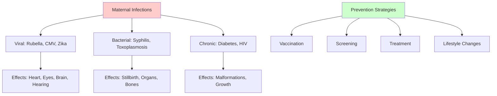

# Characteristics and Environmental Influences on Prenatal Development

## Introduction

The prenatal period represents a unique developmental stage with distinct characteristics that shape the individual's biological foundation for life. While genetic inheritance establishes the blueprint for development, environmental factors profoundly influence how that blueprint unfolds. Understanding both the inherent characteristics of prenatal development and the environmental influences that can enhance or compromise it is essential for promoting optimal outcomes and preventing developmental problems.

This unit examines the defining characteristics of the prenatal period and explores the complex array of environmental factors—from maternal nutrition and disease to chemical exposures and stress—that can alter the developmental trajectory. As the science of developmental toxicology and maternal-fetal medicine has advanced, we've gained unprecedented insight into how the prenatal environment shapes not just immediate development, but lifelong health and functioning.

## Characteristics of the Prenatal Period

### Most Important Period of Development

The prenatal period stands as the **most critical developmental period** in the human lifespan for several compelling reasons:

**Foundation Building**: Every structure, organ system, and biological process that will function throughout life is established during these nine months. Errors or disruptions during this foundational period can have permanent, lifelong consequences that cannot be fully corrected later.

**Rapid Development**: No other period witnesses such dramatic transformation—from a single cell to a complex organism with billions of specialized cells organized into intricate systems. This rapid pace of change creates both opportunities for optimal development and windows of vulnerability.

**Irreversibility**: Unlike later developmental periods where remediation and compensation are possible, many prenatal developmental problems cannot be reversed. A heart that forms incorrectly during weeks 3-6 will require surgical intervention; the original formation cannot be "redone."

### Shortest Yet Most Transformative Period

The prenatal period is notably brief compared to other developmental stages:

**Duration**: Approximately 9 calendar months (38-40 weeks or 266-280 days)
- Infancy: 0-2 years (24 months)
- Early childhood: 2-6 years (48 months)
- Middle childhood: 6-12 years (72 months)
- Adolescence: 12-18 years (72 months)

Despite being the shortest major developmental period, prenatal development involves the most dramatic physical changes. Consider that an infant grows from birth to age 2, roughly doubling in height and tripling in weight—yet this pales in comparison to prenatal growth, where weight increases approximately **11 million times** and length increases from microscopic to 20 inches.

### Heredity as Foundation

**Genetic Blueprint Established**: At conception, the individual's complete genetic heritage is determined through the combination of maternal and paternal chromosomes. This genetic endowment includes:

- Physical characteristics (height potential, body build, facial features)
- Metabolic tendencies (how nutrients are processed, energy regulation)
- Neurological patterns (brain structure, neural connectivity potential)
- Disease susceptibilities (genetic predispositions, inherited conditions)
- Developmental trajectories (timing of maturation, growth rates)

**Gene-Environment Interaction**: While heredity provides the blueprint, environmental factors determine how that blueprint is expressed. This concept, known as **epigenetics**, reveals that:

- Environmental factors can activate or suppress specific genes
- Prenatal exposures can create lasting changes in gene expression
- Some environmental effects on genes can be transmitted to future generations
- Optimal environments allow genetic potential to be fully realized

Recent research in **developmental origins of health and disease (DOHaD)** demonstrates that prenatal environmental conditions can "program" physiological systems in ways that influence health risks throughout life, including susceptibility to cardiovascular disease, diabetes, obesity, and mental health conditions (Barker & Thornburg, 2023).

### Environmental Influence Beginning at Conception

Contrary to older views that placed the developing organism in a protected, isolated environment, contemporary science recognizes that **environmental influence begins immediately at conception**:

**Maternal Body as Primary Environment**: From the moment of fertilization, the developing organism exists within and interacts with the mother's physiological environment, including:

- Nutrient availability and quality
- Oxygen levels and blood flow
- Hormone concentrations
- Immune system factors
- Metabolic waste removal
- Temperature regulation
- Physical protection

**Cascading Effects**: The immediate cellular environment influences gene expression, which affects tissue differentiation, which shapes organ development, which determines functional capacities—each level building on the previous one in a cascade of environmental-genetic interactions.

**Continuous Sensitivity**: While vulnerability to environmental disruption varies across the prenatal period (highest during the embryonic stage), the developing organism remains responsive to environmental influences throughout pregnancy.

### Sex Determination at Conception

An individual's biological sex is permanently fixed at the moment of conception through chromosomal combination:

**Mechanism of Sex Determination**:
- Female egg always contributes an X chromosome
- Male sperm contributes either an X or Y chromosome
- XX combination = female
- XY combination = male

**Lifelong Implications**: Sex determination has profound effects that extend far beyond reproductive anatomy:

**Biological Effects**:
- Different rates of physical maturation (females mature faster)
- Differential vulnerability to certain diseases and conditions
- Variations in neurological organization and brain structure
- Different hormonal environments and their effects

**Psychosocial Effects**:
- Societal expectations and gender role pressures
- Cultural attitudes toward male vs. female children
- Differential treatment by parents, teachers, and peers
- Identity development and self-concept formation

**Contemporary Understanding**: Recent research recognizes that biological sex exists on a spectrum, and that prenatal hormone exposures can influence sexual differentiation in complex ways beyond simple XX/XY determination (Joel & McCarthy, 2023).

### Proportionally Greatest Growth

The prenatal period witnesses growth of a magnitude never again matched in human development:

**Quantitative Growth Metrics**:
- **Weight**: Increases from one cell (0.0000015 grams) to average birth weight (3,200-3,600 grams) = approximately 11,000,000 times increase
- **Length**: Increases from microscopic (0.1 mm) to average birth length (48-52 cm) = approximately 5,000 times increase
- **Cell number**: From 1 cell to approximately 26 billion cells at birth
- **Growth rate**: Most rapid during embryonic and early fetal periods

**Comparative Growth Rates**:
- First trimester: Most rapid cell division and differentiation
- Second trimester: Continued rapid growth with functional development
- Third trimester: Primarily growth in size with organ maturation
- Postnatal first year: Growth rate dramatically slower than any prenatal month

**Clinical Significance**: This extraordinary growth rate requires optimal nutritional support and creates vulnerability to growth-disrupting factors. Intrauterine growth restriction (IUGR) during this period can have lasting effects on adult health (Gluckman et al., 2024).

### Hazardous Period

The prenatal period, particularly the embryonic stage (weeks 3-8), is widely recognized as the **most hazardous period of development**:

**Multiple Sources of Risk**:
- Genetic abnormalities (chromosomal disorders, gene mutations)
- Maternal health conditions (diabetes, hypertension, infections)
- Nutritional deficiencies or excesses
- Exposure to teratogens (drugs, chemicals, radiation)
- Inadequate oxygen supply
- Physical trauma
- Extreme stress

**High Loss Rate**: Research indicates that:
- 50-70% of fertilized eggs fail to implant or result in early pregnancy loss
- 15-20% of clinically recognized pregnancies end in miscarriage
- Most losses occur during the first trimester
- Many losses are due to severe chromosomal abnormalities incompatible with life

**Vulnerability Varies by Stage**:
- **Zygote period (weeks 0-2)**: "All-or-nothing" principle—either loss or survival
- **Embryonic period (weeks 3-8)**: Highest risk for major structural abnormalities
- **Fetal period (weeks 9-birth)**: Lower risk for structural problems but continued vulnerability to growth restriction and functional deficits

### Critical Periods and Sensitive Windows

Each organ system has a **critical period** during which it is most vulnerable to developmental disruption:

**Critical Period Characteristics**:
- Specific time window during rapid formation/differentiation
- Maximum sensitivity to teratogenic influences
- Disruptions during critical period cause most severe defects
- After critical period closes, that particular structural defect becomes less likely

**Examples of Critical Periods**:
- Central nervous system: Weeks 3-8 (and continues beyond)
- Heart: Weeks 3-7 (peak weeks 4-5)
- Eyes: Weeks 4-8
- Limbs: Weeks 4-7
- External genitalia: Weeks 7-12
- Palate: Weeks 6-9
- Teeth: Weeks 6-8 (deciduous teeth)

**Sensitive Periods Beyond Critical Windows**: While major structural abnormalities are most likely during critical periods, organ systems remain sensitive to environmental influences throughout development, potentially affecting:
- Size and growth
- Functional capacity
- Cellular organization
- Neurodevelopmental outcomes

## Attitudes of Significant People

### Importance of Maternal Attitude

The mother's emotional stance toward her pregnancy profoundly influences both the immediate prenatal environment and long-term developmental outcomes:

**Psychological-Physiological Connection**:
Research demonstrates that maternal psychological states directly affect the fetal environment through:

- **Stress hormones**: Cortisol crosses the placenta and affects fetal brain development
- **Immune system changes**: Psychological stress alters immune function
- **Behavioral factors**: Attitude influences health behaviors (nutrition, substance use, prenatal care)
- **Physiological regulation**: Maternal anxiety affects blood pressure, glucose regulation, and circulation

**Positive Maternal Attitude Benefits**:
- Better prenatal care compliance
- Healthier lifestyle choices
- Lower stress hormone levels
- Better fetal growth outcomes
- Reduced preterm birth risk
- Positive bonding preparation

**Negative Maternal Attitude Risks**:
- Increased stress hormone exposure for fetus
- Higher rates of pregnancy complications
- Greater substance use risk
- Delayed or inadequate prenatal care
- Possible effects on child temperament and stress regulation systems

Contemporary research in **fetal programming** suggests that maternal stress and negative emotions during pregnancy may have long-lasting effects on offspring stress responses, emotional regulation, and even mental health risk (Monk et al., 2023).

### Family and Social Support

The attitudes and support of family members and the broader social network significantly impact maternal well-being and, consequently, fetal development:

**Partner Support Effects**:
- Reduces maternal stress and anxiety
- Improves prenatal care participation
- Enhances maternal nutrition and self-care
- Decreases substance use risk
- Promotes positive birth outcomes

**Cultural Attitudes and Gender Preferences**:
In some cultures, strong preferences for male children persist, which can affect:

- Maternal stress levels during pregnancy
- Treatment during pregnancy
- Postnatal care and attention
- Long-term family dynamics
- Mental health of unwanted or "wrong-sex" children

**Social Support Networks**:
- Extended family support improves pregnancy outcomes
- Community resources reduce stress
- Cultural practices may offer protective factors
- Social isolation increases pregnancy risks

**Contemporary Concerns**: Modern research emphasizes the importance of addressing gender discrimination and ensuring that all pregnancies receive optimal support regardless of fetal sex (UNICEF, 2024).

## Environmental Influences and Hazards

### Maternal Disease and Infection

Maternal health conditions and infectious diseases can profoundly affect fetal development. The placenta, while providing some protection, cannot completely shield the fetus from maternal illnesses.

#### Viral Infections

**Rubella (German Measles)**:
- **Critical period**: First trimester (especially weeks 4-12)
- **Effects**: Congenital rubella syndrome includes:
  - Deafness (50-90% if infected before 11 weeks)
  - Congenital heart defects (especially patent ductus arteriosus)
  - Cataracts and other eye abnormalities
  - Intellectual disability
  - Growth retardation
- **Prevention**: MMR vaccination before pregnancy (live virus, contraindicated during pregnancy)
- **Current status**: Rare in countries with routine vaccination; remains concern in undervaccinated populations

**Cytomegalovirus (CMV)**:
- **Most common** congenital infection in developed countries
- **Transmission**: Primary infection or reactivation during pregnancy
- **Effects**: 
  - 10% of infected infants show symptoms at birth
  - Hearing loss (progressive in many cases)
  - Vision problems
  - Microcephaly (small head/brain)
  - Intellectual disabilities
  - Developmental delays
- **Significance**: Leading infectious cause of childhood hearing loss and neurological disability
- **Challenge**: No vaccine currently available; infection often asymptomatic in mothers

**Zika Virus**:
- **Discovery**: Emerged as major teratogen in 2015-2016 outbreak
- **Transmission**: Mosquito-borne; also sexual transmission
- **Effects**: Congenital Zika syndrome includes:
  - Severe microcephaly
  - Brain abnormalities
  - Eye defects
  - Joint contractures
  - Hypertonia (muscle stiffness)
- **Timing**: Most severe effects with first trimester infection
- **Current status**: Ongoing concern in endemic areas; travel advisories for pregnant women

**Varicella-Zoster Virus (Chickenpox)**:
- **Risk period**: First 20 weeks of pregnancy
- **Effects**: Congenital varicella syndrome (rare, 2%)
  - Limb abnormalities
  - Skin scarring
  - Eye defects
  - Neurological problems
- **Prevention**: Varicella vaccination before pregnancy
- **Treatment**: Varicella-zoster immune globulin if exposed during pregnancy

**Influenza**:
- Pregnant women at higher risk for severe complications
- Associated with increased risk of:
  - Preterm birth
  - Low birth weight
  - Fetal death (in severe maternal cases)
- **Prevention**: Flu vaccination recommended for all pregnant women
- **Research note**: 2009 H1N1 pandemic highlighted severe risks to pregnant women

#### Bacterial and Parasitic Infections

**Toxoplasmosis**:
- **Transmission**: Undercooked meat, cat feces, contaminated water
- **Effects**: Congenital toxoplasmosis
  - Hydrocephalus (fluid on brain)
  - Calcifications in brain
  - Chorioretinitis (eye inflammation, vision loss)
  - Intellectual disability
  - Often effects appear later in childhood
- **Prevention**: Avoid raw/undercooked meat; careful handling of cat litter; wash produce thoroughly

**Syphilis**:
- **Transmission**: Crosses placenta at any stage
- **Effects**: Congenital syphilis
  - Stillbirth or newborn death (high rate)
  - Premature birth
  - Bone abnormalities
  - Hepatosplenomegaly (enlarged liver/spleen)
  - Rash
  - Neurological complications
- **Prevention**: Prenatal screening and treatment with penicillin highly effective
- **Resurgence**: Congenital syphilis cases increasing in recent years, necessitating renewed public health focus

#### Chronic Maternal Conditions

**Diabetes**:
- **Type 1 or Type 2 diabetes**: Pre-existing condition
- **Gestational diabetes**: Develops during pregnancy
- **Effects with poor control**:
  - Congenital malformations (heart defects, neural tube defects)
  - Macrosomia (abnormally large baby)
  - Neonatal hypoglycemia
  - Respiratory distress syndrome
  - Later childhood obesity and diabetes risk
- **Management**: Strict blood glucose control dramatically reduces risks

**Hypertension/Preeclampsia**:
- **Effects**:
  - Placental insufficiency
  - Intrauterine growth restriction
  - Preterm delivery
  - Maternal and fetal complications
- **Management**: Monitoring, medication, timing of delivery

**HIV/AIDS**:
- **Without treatment**: 25-30% transmission rate to fetus/infant
- **With treatment**: <1% transmission rate
- **Prevention**: 
  - Antiretroviral therapy during pregnancy
  - Cesarean delivery may be recommended
  - Avoid breastfeeding in developed countries (formula safe)
- **Outcomes**: With proper treatment, infected mothers can have healthy, uninfected babies

### Drugs and Chemicals

Chemical exposures represent one of the most controllable yet frequently encountered categories of prenatal hazards.

#### Prescription and Over-the-Counter Medications

**Thalidomide** (Historical but Important):
- **Era**: 1950s-1960s, prescribed for morning sickness
- **Effects**: Phocomelia (severe limb malformations)
  - Arms and legs shortened or absent
  - Flipper-like appendages
- **Impact**: Led to modern drug safety testing requirements
- **Critical period**: Days 21-36 after conception
- **Legacy**: Revolutionized understanding of teratogenesis; established need for careful medication testing

**Isotretinoin (Accutane)**:
- **Use**: Severe acne treatment
- **Category**: Among most potent human teratogens known
- **Effects** (20-35% risk with exposure):
  - Craniofacial abnormalities
  - Heart defects
  - Thymus gland abnormalities
  - CNS malformations
- **Requirements**: Strict pregnancy prevention program (iPLEDGE) required
- **Note**: Related vitamin A derivatives also teratogenic in high doses

**Anticonvulsants**:
- **Valproate**: Highest risk (6-10% major malformations)
  - Neural tube defects
  - Facial anomalies
  - Developmental delays
  - Lower IQ in offspring
- **Other anticonvulsants**: Varied risks (phenytoin, carbamazepine, others)
- **Dilemma**: Balancing seizure control need vs. fetal risk
- **Management**: Lowest effective dose; folic acid supplementation

**Antidepressants (SSRIs)**:
- **Complexity**: Depression itself poses risks to pregnancy
- **Paroxetine**: Possibly increased heart defect risk
- **Other SSRIs**: Lower risk profile
- **Late pregnancy exposure**: 
  - Possible neonatal adaptation syndrome (temporary)
  - Possible persistent pulmonary hypertension (rare)
- **Recommendation**: Individual risk-benefit analysis with healthcare provider

**Acetaminophen (Tylenol)**:
- **Traditional view**: Considered safe
- **Recent research**: Long-term exposure may be associated with:
  - ADHD risk (controversial)
  - Altered reproductive development (animal studies)
- **Current guidance**: Use lowest effective dose for shortest duration

#### Recreational Drugs and Substances

**Alcohol**:
- **No safe amount** established during pregnancy
- **Fetal Alcohol Spectrum Disorders (FASD)**:

**Fetal Alcohol Syndrome (FAS)** - Most severe form:
- Growth deficits (prenatal and postnatal)
- Facial dysmorphology:
  - Smooth philtrum (reduced/absent groove between nose and upper lip)
  - Thin vermillion border (thin upper lip)
  - Small palpebral fissures (short eye openings)
- Central nervous system abnormalities:
  - Microcephaly (small head/brain)
  - Structural brain abnormalities
  - Intellectual disability
  - Behavioral problems
  - Learning difficulties

**Partial FAS and Alcohol-Related Effects**:
- Some but not all FAS features
- Neurodevelopmental problems without full syndrome
- May be more common than full FAS

**Mechanism**: Alcohol interferes with:
- Cell migration and differentiation
- Neural connectivity
- Growth factor signaling
- Oxidative stress pathways

**Prevalence**: FASD affects 1-5% of school-age children in U.S.; higher in some populations

**Key message**: Complete alcohol abstinence recommended throughout pregnancy

**Tobacco/Nicotine**:
- **Effects**:
  - Intrauterine growth restriction (IUGR)
  - Low birth weight
  - Preterm birth
  - Placental complications (placenta previa, abruption)
  - Stillbirth risk increased
  - SIDS risk increased postnatally
  - Childhood respiratory problems
  - Possible neurodevelopmental effects
- **Mechanism**: Nicotine causes vasoconstriction (reduced blood flow), carbon monoxide reduces oxygen delivery
- **Dose-dependent**: Heavier smoking = greater risk
- **E-cigarettes/Vaping**: Not safe alternative; contains nicotine and other chemicals

**Cannabis (Marijuana)**:
- **Increasing use**: With legalization, pregnant use rising
- **Effects** (evidence developing):
  - Possible low birth weight
  - Preterm birth risk
  - Potential neurodevelopmental effects
  - THC crosses placenta and affects endocannabinoid system
- **Concerns**: Higher potency products, lack of regulation
- **Recommendation**: Avoid during pregnancy

**Opioids**:
- **Epidemic concern**: Opioid crisis affecting pregnant women
- **Neonatal Abstinence Syndrome (NAS)**:
  - Withdrawal symptoms in newborn
  - Irritability, feeding difficulties
  - Tremors, seizures
  - Requires prolonged hospitalization
- **Prenatal effects**:
  - Growth restriction
  - Preterm birth
  - Placental abruption
- **Management**: Medication-assisted treatment (methadone, buprenorphine) preferred over abrupt discontinuation

**Cocaine and Methamphetamine**:
- **Effects**:
  - Placental abruption
  - Preterm birth
  - Low birth weight
  - Stroke risk (maternal and fetal)
  - Possible neurobehavioral effects
- **Mechanism**: Vasoconstriction, increased blood pressure

#### Environmental Chemicals

**Lead**:
- **Sources**: Old paint, contaminated water, occupational exposure
- **Effects**:
  - Neurodevelopmental impairment (no safe level known)
  - Cognitive deficits
  - Behavioral problems
  - Growth restriction
- **Persistence**: Lead stored in bone released during pregnancy
- **Prevention**: Water testing, avoid old paint dust, occupational safety

**Mercury**:
- **Sources**: Large fish (shark, swordfish, king mackerel, tilefish)
- **Effects**:
  - Neurotoxicity
  - Developmental delays
  - Cognitive impairment
- **Recommendation**: Avoid high-mercury fish; moderate amounts of low-mercury fish (salmon, tilapia) safe and beneficial (omega-3 fatty acids)

**Pesticides and Herbicides**:
- **Varied risks** depending on specific chemical
- **Concerns**:
  - Neurodevelopmental effects
  - Birth defects with certain exposures
  - Endocrine disruption
- **Prevention**: Wash produce thoroughly; avoid unnecessary pesticide exposure

**BPA and Phthalates** (Endocrine Disruptors):
- **Sources**: Plastics, food containers, personal care products
- **Concerns** (research ongoing):
  - Altered reproductive development
  - Neurobehavioral effects
  - Metabolic programming
- **Precautions**: Avoid heating food in plastic; choose BPA-free products when possible

### Radiation

**Ionizing Radiation**:
- **Therapeutic radiation**: High doses used in cancer treatment
  - Can cause severe fetal damage or death
  - Generally avoided during pregnancy
- **Diagnostic radiation** (X-rays, CT scans):
  - Low doses generally considered low risk
  - Avoid unnecessary exposures
  - Critical period: First trimester most vulnerable
  - Effects depend on dose and timing

**Guidelines**:
- Inform healthcare providers about pregnancy before any radiation procedures
- Shielding used when imaging needed
- Alternative imaging when possible (ultrasound, MRI)
- Most necessary diagnostic procedures involve low enough radiation to pose minimal risk

**Background Radiation**:
- Natural environmental radiation exposure varies by location
- Higher elevation = higher cosmic radiation
- Correlates with slightly higher rates of certain abnormalities
- Generally not modifiable factor

### Nutritional Factors

Maternal nutrition serves as the sole source of nutrients for fetal growth and development, making it critically important throughout pregnancy.

#### Essential Nutrients

**Folic Acid** (Vitamin B9):
- **Timing**: Most critical before conception and first 4 weeks (neural tube closure)
- **Recommended intake**: 400-800 mcg daily (higher for certain risk groups)
- **Effects of deficiency**:
  - Neural tube defects (spina bifida, anencephaly)
  - 50-70% of NTDs preventable with adequate intake
- **Sources**: Fortified grains, leafy greens, beans, supplements
- **Note**: Many NTDs occur before women know they're pregnant, emphasizing importance of preconception supplementation

**Iron**:
- **Increased needs**: Pregnancy requires 27 mg/day (vs. 18 mg normally)
- **Function**: Hemoglobin production, oxygen transport, fetal organ development
- **Deficiency effects**:
  - Maternal anemia
  - Preterm birth
  - Low birth weight
  - Neurodevelopmental delays
- **Sources**: Red meat, fortified cereals, beans, spinach

**Calcium and Vitamin D**:
- **Functions**: Bone and teeth development, cellular processes
- **Requirements**: 1000 mg calcium, 600 IU vitamin D daily
- **Deficiency effects**:
  - Compromised fetal bone development
  - Maternal bone density loss
  - Preeclampsia risk
- **Sources**: Dairy, fortified foods, sunlight (vitamin D)

**Protein**:
- **Increased needs**: Additional 25g per day in pregnancy
- **Function**: Cell growth, tissue formation, brain development
- **Deficiency effects**:
  - Growth restriction
  - Low birth weight
  - Possible neurodevelopmental effects

**Omega-3 Fatty Acids (DHA)**:
- **Function**: Brain and eye development
- **Sources**: Fish (low-mercury varieties), walnuts, flaxseed, supplements
- **Benefits**: Associated with:
  - Improved cognitive development
  - Visual development
  - Possible reduced preterm birth risk

#### Malnutrition and Undernutrition

**First Trimester Deficiency**:
- Most harmful for structural development
- Organ formation requires adequate nutrients
- May contribute to congenital abnormalities

**Second/Third Trimester Deficiency**:
- Growth restriction
- Low birth weight
- Brain development compromised (rapid growth period)

**Severe Undernutrition**:
- Intrauterine growth restriction (IUGR)
- Stillbirth risk
- Preterm delivery
- Long-term health effects (metabolic programming)

**Dutch Hunger Winter (1944-45)**:
- Historical natural experiment
- Demonstrated long-term health effects of prenatal famine
- Offspring showed increased rates of:
  - Cardiovascular disease
  - Obesity
  - Diabetes
  - Schizophrenia
- Illustrated **fetal programming** concept

#### Maternal Stress and Mental Health

**Physiological Stress Mechanisms**:
- Maternal stress elevates cortisol (crosses placenta)
- Affects fetal brain development, particularly:
  - Hippocampus (memory)
  - Amygdala (emotion regulation)
  - Prefrontal cortex (executive function)

**Effects of Chronic Maternal Stress**:
- Increased risk of preterm birth
- Low birth weight
- Altered temperament in offspring
- Possible increased anxiety/depression risk in childhood
- Altered stress response systems in offspring

**Maternal Depression and Anxiety**:
- Affect pregnancy behaviors (nutrition, prenatal care)
- Physiological effects on fetus
- Postpartum bonding and caregiving impacts

**Contemporary Understanding**:
Recent research emphasizes the importance of maternal mental health screening and treatment during pregnancy. Both the mental health conditions themselves and their treatment require careful consideration of risks and benefits to mother and fetus (Earls et al., 2024).

### The Rh Factor Incompatibility

**Background**:
- Rh factor is an inherited protein on red blood cells
- About 85% of people are Rh-positive (have the protein)
- About 15% are Rh-negative (lack the protein)

**Problem Scenario**:
- Rh-negative mother + Rh-positive father → Possibly Rh-positive fetus
- If fetal blood enters maternal circulation, mother may develop antibodies
- First pregnancy usually unaffected
- Subsequent Rh-positive pregnancies at risk

**Erythroblastosis Fetalis** (Hemolytic Disease of Newborn):
- Maternal antibodies attack fetal red blood cells
- **Effects**:
  - Severe anemia
  - Jaundice
  - Brain damage (kernicterus)
  - Hydrops fetalis (severe edema)
  - Stillbirth or death

**Prevention**: RhoGAM (Rh immune globulin)
- Given to Rh-negative mothers at 28 weeks and after delivery
- Prevents antibody formation
- Highly effective when properly administered
- Has virtually eliminated this as a major problem in developed countries

**Modern Management**:
- Routine prenatal blood typing
- RhoGAM administration as prevention
- Monitoring if sensitization occurs
- Treatment options if disease develops (transfusions, early delivery)

## Self-Assessment Questions

### Multiple Choice

1. Which characteristic makes the prenatal period the most critical developmental stage?
   a) It is the longest period
   b) It has the most gradual changes
   c) All major structures form during this time
   d) It has the least environmental influence

2. Approximately what percentage of fertilized eggs fail to result in a successful pregnancy?
   a) 10-20%
   b) 30-40%
   c) 50-70%
   d) 80-90%

3. The "fetal programming" concept suggests that:
   a) Genes determine all developmental outcomes
   b) Prenatal environment affects lifelong health
   c) Programming begins after birth
   d) Only severe exposures have lasting effects

4. Which infection is the leading infectious cause of childhood hearing loss?
   a) Rubella
   b) Cytomegalovirus (CMV)
   c) Toxoplasmosis
   d) Zika virus

5. What is the relationship between alcohol consumption and pregnancy?
   a) Moderate amounts are safe
   b) Only hard liquor is dangerous
   c) No safe amount has been established
   d) Only first trimester exposure is harmful

6. Folic acid supplementation is most critical during which period?
   a) Throughout pregnancy equally
   b) Before conception and first month
   c) Second trimester only
   d) Third trimester only

7. The Dutch Hunger Winter study demonstrated:
   a) Fetuses are well-protected from maternal malnutrition
   b) Only severe malnutrition affects development
   c) Prenatal nutrition affects lifelong health
   d) Effects are limited to birth weight

8. What is the primary prevention for Rh incompatibility problems?
   a) Avoiding pregnancy
   b) RhoGAM administration
   c) Early delivery
   d) Blood transfusions

9. Which medication is considered one of the most potent human teratogens?
   a) Acetaminophen
   b) Most antibiotics
   c) Isotretinoin (Accutane)
   d) Insulin

10. Maternal stress during pregnancy can affect the fetus through:
    a) No mechanism (stress doesn't affect fetus)
    b) Only if mother doesn't eat
    c) Cortisol crossing the placenta
    d) Only at birth

### Short Answer Questions

1. Explain why the embryonic period (weeks 3-8) is considered the most vulnerable time for teratogen exposure.

2. Describe three ways that maternal attitude toward pregnancy can influence fetal development.

3. What is the concept of "critical periods" in prenatal development, and why is it important?

4. Explain the mechanism by which Rh incompatibility causes problems and how it is prevented.

5. Discuss why complete alcohol abstinence is recommended during pregnancy, even though effects are dose-related.

### Application Questions

1. A pregnant woman asks whether she can have an occasional glass of wine with dinner. Using evidence-based information, explain the recommendations and reasoning.

2. Design a prenatal education program for a community health center. What are the top five environmental hazards you would address, and why?

3. A woman with epilepsy is planning pregnancy. Explain the considerations regarding her anticonvulsant medication during pregnancy.

---

**Source PDFs**: 
- 📄 [Block-1/Unit-2.pdf - Pages 20-29](/pdfs/MPC-002%20Life%20Span%20Psychology/Block-1/Unit-2.pdf)
- 📚 MPC-002 Life Span Psychology

## Answers to Self-Assessment Questions

### Multiple Choice
1. c) All major structures form during this time
2. c) 50-70%
3. b) Prenatal environment affects lifelong health
4. b) Cytomegalovirus (CMV)
5. c) No safe amount has been established
6. b) Before conception and first month
7. c) Prenatal nutrition affects lifelong health
8. b) RhoGAM administration
9. c) Isotretinoin (Accutane)
10. c) Cortisol crossing the placenta

## Educational Videos

**Environmental Influences on Prenatal Development**:
<iframe width="560" height="315" src="https://www.youtube.com/embed/NqNcQiZwQFc" title="Prenatal Environmental Influences" frameborder="0" allow="accelerometer; autoplay; clipboard-write; encrypted-media; gyroscope; picture-in-picture" allowfullscreen></iframe>

## Memory Aids

### **Environmental Hazards Mnemonic: "DRAIN MS"**
- **D**iseases (infections)
- **R**adiation
- **A**lcohol/drugs
- **I**nadequate nutrition
- **N**icotine/tobacco
- **M**aternal stress
- **S**ubstances (chemicals)

### **TORCH Infections Mnemonic**
Classic teratogenic infections:
- **T**oxoplasmosis
- **O**ther (syphilis, varicella, HIV)
- **R**ubella
- **C**ytomegalovirus
- **H**erpes simplex

### **Folic Acid Importance: "Fold the Tube"**
**Folic** acid helps the neural tube **fold** (close) properly to prevent defects

## Further Resources

### Wikipedia Articles
- [Teratology](https://en.wikipedia.org/wiki/Teratology)
- [Fetal Alcohol Spectrum Disorder](https://en.wikipedia.org/wiki/Fetal_alcohol_spectrum_disorder)
- [Prenatal Nutrition](https://en.wikipedia.org/wiki/Prenatal_nutrition)
- [Congenital Rubella Syndrome](https://en.wikipedia.org/wiki/Congenital_rubella_syndrome)
- [Rh Disease](https://en.wikipedia.org/wiki/Rh_disease)

### External Resources
- [CDC - Pregnancy and Vaccination](https://www.cdc.gov/vaccines/pregnancy/index.html)
- [March of Dimes - Environmental Risks](https://www.marchofdimes.org/find-support/topics/pregnancy/environmental-risks-during-pregnancy)
- [ACOG - Substance Use in Pregnancy](https://www.acog.org/clinical/clinical-guidance/committee-opinion/articles/2017/08/marijuana-use-during-pregnancy-and-lactation)

---

*Last Updated: January 28, 2025*
