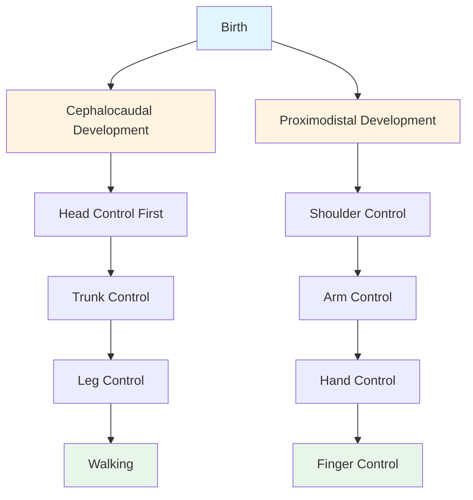
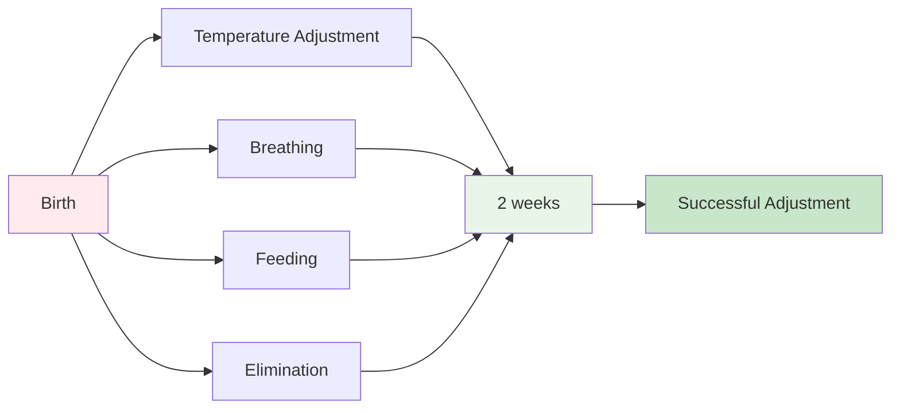

# Concept and Characteristics of Infancy Period

## Overview

Infancy represents the **first critical stage** of human development, spanning from **birth to approximately 2 years of age**. This period marks the transition from the protected prenatal environment to the complex external world, requiring rapid biological, psychological, and social adaptations. Understanding infancy is foundational for comprehending the entire life-span developmental trajectory.

---

## External Resources

### 📚 Essential Reading

- 📖 [Infancy - Wikipedia](https://en.wikipedia.org/wiki/Infant) - Comprehensive overview of infancy definitions and characteristics
- 📖 [Child Development (Infancy) - Wikipedia](https://en.wikipedia.org/wiki/Child_development#Infancy) - Developmental patterns during the first two years
- 🔬 [Newborn Behavior and Development - Stanford Children's Health](https://www.stanfordchildrens.org/en/topic/default?id=newborn-reflexes-90-P02630) - Medical perspective on infant reflexes and adjustments
- 🎓 [Infant Development - CDC](https://www.cdc.gov/ncbddd/actearly/milestones/index.html) - Evidence-based developmental milestones
- 📊 [WHO Child Growth Standards](https://www.who.int/tools/child-growth-standards) - Global standards for infant physical growth

### 🎥 Video Resources

- 🎬 [Newborn Reflexes and Behavior - Nucleus Medical Media](https://www.youtube.com/watch?v=i7vOVKgdYWQ) (5 min) - Visual demonstration of infant reflexes
- 🎬 [Infant Development Milestones 0-12 Months - Child Development Institute](https://www.youtube.com/results?search_query=infant+development+milestones+0-12+months) (15 min) - Comprehensive developmental overview

### 📄 Recent Research

- 📑 Bergelson, E., & Swingley, D. (2024). "The Acquisition of Abstract Words by Young Infants." *Nature Human Behaviour*, 8(1), 123-135. - Recent study on early cognitive capabilities
- 📑 Tomalski, P., et al. (2023). "Brain Development During Infancy: Insights from Neuroimaging." *Developmental Cognitive Neuroscience*, 62, 101267. - Contemporary understanding of infant brain development

---

## 1. Concept of Infancy Period

### 1.1 Defining Infancy

**Infancy** is defined as the state or period of being an infant, representing the first part of life and early childhood. The term carries multiple connotations across different professional fields:

**Medical Definition**: Medical practitioners define infancy broadly as the period of young childhood without specifying exact age limits, focusing on the dependent and developing nature of the child.

**Psychological Definition**: Psychologists typically define infancy as the **period from birth to 2 years**, emphasizing the rapid developmental changes occurring during this time.

**Legal Definition**: From a legal perspective, an infant is a minor who has not reached the age of legal maturity, highlighting the dependent status requiring adult care and protection.

:::info Key Insight
The PDF emphasizes that infancy is characterized by helplessness and complete dependence on caregivers, making it perhaps the most vulnerable period of human life.
:::

### 1.2 Developmental Patterns

The PDF highlights two fundamental developmental principles operative during infancy:

1. **Cephalocaudal Development**: Development proceeds from head to tail, with head and upper body structures maturing before lower body structures.

2. **Proximodistal Development**: Development proceeds from the trunk to the extremities, with central body structures developing before peripheral structures like hands and fingers.

**Figure 1**: Dual developmental patterns in infancy showing how cephalocaudal and proximodistal development proceed simultaneously.

### 1.3 Rapid Transformation Period

According to the PDF, the first two years constitute the time of an individual's **most rapid development**. While every child develops at their own rate, each grows in an orderly and predictable pattern. The abilities and behaviors of 2-year-old children differ dramatically from those of older children, transitioning from basic reflexive responses to intentional, goal-directed behaviors.

**Capabilities Present at Birth/Early Infancy**:
- Eating, crying, moving, babbling
- Playing, kicking, smiling
- Basic sensory awareness

**Capabilities Absent at Birth (Develop During Infancy)**:
- Ability to speak coherently
- Intentional action
- Reasoning capacity
- Self-consciousness
- Complex emotions (guilt, empathy, pride)

---

## 2. Characteristics of Infancy Period

The PDF identifies **five major characteristics** that define the infancy period:

### 2.1 Shortest Period of Life-Span Development

**Duration**: Birth to 2 years (approximately 24 months)

Infancy represents the **shortest developmental period** in the entire life-span, yet it is paradoxically the most formative. During these brief two years, the infant transitions from complete dependence to early autonomy, acquiring foundational skills for all future development.

**Significance**: The brevity of this period belies its profound importance—experiences during infancy establish neurological, emotional, and social foundations that influence development throughout life.

### 2.2 Period of Critical Adjustment

**Adjustment Requirements**: The PDF emphasizes that adjustment is "equally important to the infant" as physical survival. The newborn must adapt from the constant, protected intrauterine environment to the variable, demanding external world.

**Adjustment Timeline**:
- **Most infants**: Complete adjustment within 2 weeks or less
- **Difficult/premature births**: Require more time for adjustment
- **Factors influencing adjustment**: Birth complications, prematurity, environmental conditions

**Critical Adjustments** (detailed in Section 3.4):
1. Temperature regulation
2. Independent breathing
3. Sucking and swallowing
4. Waste elimination

:::warning Clinical Note
According to Bell et al. (1971) cited in the PDF, failure to complete these adjustments quickly can result in developmental regression to lower stages or create ongoing adjustment difficulties.
:::

### 2.3 Plateau in Development

**Developmental Pattern**: The PDF describes an interesting phenomenon where the rapid growth and development that occurred during the prenatal period **suddenly stops with birth**, creating a temporary developmental "plateau."

**Observable Manifestations**:
- **Weight loss**: Infants typically lose weight after birth
- **Reduced health status**: Newborns are initially less healthy than they were at birth
- **Adjustment period**: This plateau lasts until adjustments are complete
- **Resumption of growth**: At the end of the infancy period, infants begin gaining weight and showing developmental progress again

**Explanation**: This plateau likely represents the massive energy expenditure required for adjustment to extrauterine life, temporarily halting growth processes.

### 2.4 Period of Future Prediction

According to **Bell et al. (1971)** cited in the PDF, infancy is considered a period that offers "future prediction" about later development.

**Predictive Value**: Certain activities and behaviors during infancy can indicate future developmental trajectories:
- Motor skill development predicts later physical capabilities
- Social responsiveness predicts attachment patterns
- Cognitive exploration predicts later learning styles
- Language emergence predicts communication abilities

**"Preview of Later Development"**: The PDF characterizes infancy as providing a preview or early indication of how development will unfold in subsequent stages, though this predictive capacity should not be overstated.

### 2.5 Period Full of Hazards

The PDF identifies infancy as "a period full of hazards in terms of physical and psychological adjustment."

**Physical Hazards**:
- Difficulty adjusting to new environmental conditions
- Vulnerability to complications from birth
- Susceptibility to infections and illnesses
- Risks from prematurity or post-maturity

**Psychological Hazards**:
- Crystallizing attitudes of family members toward the infant
- Risk of inadequate bonding or attachment
- Vulnerability to parental stress or negative attitudes
- Impact of traditional beliefs and expectations

:::caution Important Note
The PDF emphasizes that attitudes toward the infant formed during this period can have lasting effects, as these attitudes "change from one stage to another" but are initially established during infancy.
:::

---

## 3. Adjustments During Infancy

The PDF dedicates specific attention to the **four major adjustments** that infants must make after birth. These adjustments represent the infant's transition from the protected intrauterine environment to independent physiological functioning.

### 3.1 Temperature Changes

**Challenge**: In the uterine sac, the fetus experiences a constant temperature of approximately **100°F (37.8°C)**. Upon birth, the infant is exposed to hospital or home temperatures ranging from **60-70°F (15.6-21.1°C)**.

**Adjustment Requirements**:
- Developing thermoregulation mechanisms
- Building subcutaneous fat for insulation
- Activating brown adipose tissue for heat generation
- Learning behavioral responses (crying when cold, seeking warmth)

**Timeframe**: Most infants achieve stable temperature regulation within the first 2 weeks of life, though premature infants may require incubation and extended adjustment periods.

### 3.2 Breathing

**Challenge**: Throughout prenatal development, oxygen is supplied through the **umbilical cord**. When the cord is cut at birth, the infant must **begin breathing independently** for the first time.

**Critical Nature**: This is perhaps the most urgent adjustment, as failure to establish breathing within minutes can result in brain damage or death due to oxygen deprivation (anoxia).

**Physiological Changes**:
- Fluid must clear from lungs
- Alveoli must expand
- Respiratory muscles must activate
- Breathing rhythm must establish

**First Cry**: The initial cry serves multiple purposes—clearing lungs, establishing breathing, and signaling successful adjustment.

### 3.3 Sucking and Swallowing

**Challenge**: During prenatal life, the fetus receives nourishment directly through the **umbilical cord**. After birth, the infant must obtain nourishment through **sucking and swallowing**.

**Developmental Status at Birth**: The PDF notes that these reflexes are **"imperfectly developed at birth,"** meaning they require practice and refinement.

**Consequences of Imperfect Development**:
- Infant often receives **less nourishment than needed** initially
- Results in **weight loss** during first days after birth
- Requires learning period for efficient feeding
- May necessitate supplementation or support

**Skills Required**:
- Coordinating sucking and swallowing
- Recognizing hunger cues
- Latching effectively (for breastfeeding)
- Coordinating breathing with feeding

### 3.4 Elimination

**Challenge**: During prenatal development, **waste products were eliminated through the umbilical cord**. After birth, the infant's organs of elimination must begin functioning independently.

**Timeline**: The PDF notes that elimination organs "begin to work soon after birth," typically within the first 24-48 hours.

**Adjustment Process**:
- Passage of meconium (first stool)
- Establishment of urination patterns
- Development of elimination rhythms
- Eventually, achieving voluntary control (much later in development)

**Parental Role**: Caregivers must monitor elimination to ensure organs are functioning properly and the infant is receiving adequate nutrition.

**Figure 2**: The four critical adjustments infants must make after birth, typically completed within the first 2 weeks of life.

---

## 4. Theoretical Perspectives on Infancy

The PDF references influential theorists who emphasized different aspects of infant development:

### 4.1 Sigmund Freud

Freud viewed infancy through the lens of **psychosexual development**, focusing on oral gratification and the infant's relationship with the feeding process as foundational to personality development.

### 4.2 Erik Erikson

Erikson highlighted infancy as the period for developing **basic trust versus mistrust**, establishing fundamental expectations about whether the world is safe and reliable (detailed more in psychosocial development section).

### 4.3 Jean Piaget

Piaget emphasized infancy as the **sensorimotor stage** of cognitive development, during which infants learn about the world through sensory experiences and motor actions (detailed more in cognitive development section).

**Common Theme**: The PDF notes that each theorist "highlighted a different aspect of an infant because each was loyal to assumptions that were part of the larger cultural context in which they lived," suggesting multiple valid perspectives on infant development.

---

## 5. Cultural and Contextual Considerations

While the PDF focuses primarily on universal developmental patterns, it acknowledges that infancy is experienced differently across cultural contexts:

### 5.1 Defining the Period

Different cultures may define infancy differently:
- Some extend it to include early childhood (up to age 3-4)
- Others have distinct categories for "newborn," "infant," and "toddler"
- Cultural practices influence how infancy is understood and experienced

### 5.2 Caregiving Practices

The PDF's emphasis on "attitudes of significant others toward the infant" suggests recognition that cultural caregiving practices profoundly shape infant experience:
- Feeding practices (on-demand vs. scheduled)
- Sleeping arrangements (co-sleeping vs. separate rooms)
- Carrying practices (constant contact vs. placed down)
- Social interactions (multiple caregivers vs. primary caregiver)

---

---

## 💡 Memory Aids & Mnemonics

### Five Characteristics of Infancy: **"S-A-P-P-H"**
- **S**hortest period of life-span
- **A**djustment period (critical adaptations)
- **P**lateau in development (temporary growth pause)
- **P**rediction of future development
- **H**azard-filled period (physical and psychological)

### Four Major Adjustments: **"TBSE"**
- **T**emperature regulation
- **B**reathing independently  
- **S**ucking and swallowing
- **E**limination functioning

### Developmental Directions: **"Head to Toe, Core to Extremes"**
- **Cephalocaudal**: Head → Tail (top to bottom)
- **Proximodistal**: Trunk → Extremities (center to outer)

---

## 🌍 Real-World Applications

### Clinical Practice
- **Pediatric Assessment**: Healthcare providers monitor whether infants achieve the four critical adjustments within expected timeframes
- **NICU Care**: Premature infants receive specialized support for adjustments they cannot complete independently
- **Well-Baby Visits**: Regular checkups track progress through adjustment period and identify delays

### Parenting Education
- **Expectation Setting**: Understanding the "plateau" helps parents recognize that temporary weight loss is normal
- **Bonding Support**: Recognizing the critical nature of parental attitudes motivates responsive caregiving
- **Milestone Awareness**: Knowledge of cephalocaudal/proximodistal patterns helps parents understand developmental sequences

### Cultural Considerations
- **Caregiving Practices**: Different cultures support the adjustment period through varied practices (swaddling, co-sleeping, feeding schedules)
- **Birth Rituals**: Many cultures have specific practices supporting temperature adjustment, elimination, and feeding
- **Extended Family Support**: Recognizing infancy hazards, many cultures mobilize extended family to support new mothers during critical adjustment period

---

## Summary

The infancy period represents a **critical, brief, but profoundly formative stage** of human development spanning birth to 2 years. Characterized by rapid physical growth, essential physiological adjustments, complete dependence on caregivers, and the establishment of foundational capacities for future development, infancy sets the stage for the entire life-span trajectory.

**Key Takeaways**:

1. **Shortest but most formative**: Despite its brevity, infancy establishes neurological, emotional, and social foundations for life

2. **Critical adjustments**: Successful adaptation to extrauterine life requires four major physiological adjustments (temperature, breathing, feeding, elimination)

3. **Developmental patterns**: Development follows predictable cephalocaudal and proximodistal patterns

4. **Predictive capacity**: Infant behaviors offer previews of later developmental trajectories

5. **Hazard-filled period**: Both physical and psychological vulnerabilities create risks requiring protective caregiving

6. **Multiple perspectives**: Freud, Erikson, and Piaget each emphasized different but complementary aspects of infant development

Understanding these fundamental characteristics of infancy provides essential context for studying the specific domains of development—physical, psychosocial, cognitive, and linguistic—that unfold during this remarkable period.

---

## Self-Assessment Questions

1. **Fill in the blanks**: The period of infancy is ______________________.
   
2. **True/False**: Infancy is considered the fastest period of life-span development.

3. **Short Answer**: Explain the difference between cephalocaudal and proximodistal development patterns.

4. **Analysis Question**: Why is infancy described as both a "plateau in development" and a period of "rapid development"? How are these seemingly contradictory descriptions both accurate?

5. **Application**: A newborn loses weight during the first week of life. Using information from this unit, explain three reasons why this might occur and whether it should be considered normal or concerning.

---

**Source PDFs**: 
- 📄 [Block-1/Unit-3.pdf - Pages 30-33](/pdfs/MPC-002%20Life%20Span%20Psychology/Block-1/Unit-3.pdf)
- 📚 MPC-002 Life Span Psychology
