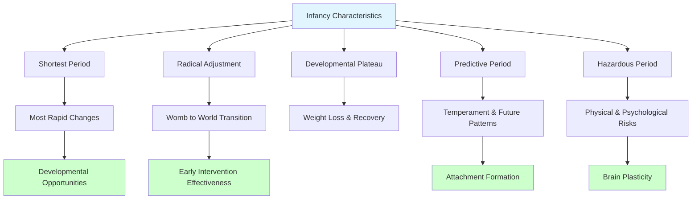

# Infancy Period: Concept, Characteristics, and Adjustments

## Introduction

Infancy represents one of the most remarkable periods of human development. In just two years, a helpless newborn transforms into a walking, talking toddler capable of expressing desires, solving problems, and forming meaningful relationships. This dramatic transformation occurs at a pace unmatched by any other developmental stage, making infancy both fascinating to study and critically important for establishing foundations for later development.

The period from birth to age 2 is characterized by extraordinary physical growth, rapid brain development, emerging cognitive capacities, and the formation of first social relationships. Understanding infancy is essential for parents, caregivers, educators, and healthcare professionals who work with young children and their families. This unit explores the concept of infancy, its defining characteristics, the adjustments newborns must make, and the potential hazards that can affect development during this crucial period.

## Concept and Definition of Infancy

### Defining Infancy

The term "infancy" derives from the Latin word *infans*, meaning "unable to speak," reflecting the young child's limited verbal communication abilities during this period. Different disciplines and professionals define infancy somewhat differently:

**Medical Definition**: The medical profession typically defines infancy as the period of life when a child is very young, generally from birth through the first year. Some medical texts extend this to 18-24 months. Medical professionals focus primarily on physical growth, health milestones, and developmental screening during this time.

**Psychological Definition**: Developmental psychologists generally define infancy as the **first two years of life** (birth to 24 months). This definition recognizes that major psychological transitions—particularly in cognitive and social-emotional domains—occur around age 2, marking the transition into early childhood.

**Legal Definition**: In legal contexts, an "infant" may refer to any minor who has not reached the age of legal majority (typically 18-21 years, varying by jurisdiction). However, this usage differs significantly from developmental science definitions.

**Contemporary Consensus**: For purposes of developmental psychology and this course, **infancy spans from birth to approximately age 2 years (24 months)**. This period is sometimes subdivided into:

- **Neonatal period**: Birth to 1 month (28 days)
- **Early infancy**: 1-6 months
- **Late infancy**: 6-12 months
- **Toddlerhood**: 12-24 months (sometimes considered a transitional period between infancy and early childhood)

### Historical Perspectives on Infancy

Views of infancy have evolved dramatically throughout history:

**Traditional Views**: Historically, infants were often viewed as miniature adults lacking only size and experience, or alternatively, as beings without reason or soul. High infant mortality rates (often exceeding 20-30% in pre-modern societies) meant that emotional investment in infants was sometimes guarded until survival seemed more assured.

**Enlightenment Period**: Philosophers like John Locke (1632-1704) proposed that infants were "blank slates" (*tabula rasa*), emphasizing the role of experience in shaping development. Jean-Jacques Rousseau (1712-1778) countered by arguing that infants possessed innate goodness and natural developmental tendencies.

**Scientific Revolution**: The late 19th and early 20th centuries witnessed the emergence of systematic scientific study of infancy. Pioneers like Charles Darwin, who kept detailed observational diaries of his own children's development, laid groundwork for modern infant research.

**Contemporary Understanding**: Modern developmental science recognizes infants as remarkably competent organisms equipped with sophisticated perceptual abilities, learning capacities, and social predispositions from birth. Rather than passive recipients of stimulation, infants actively explore, organize, and make sense of their experiences.

### Theoretical Framework: Understanding Infancy

Major theoretical perspectives have shaped our understanding of infancy:

**Psychoanalytic Theory** (Sigmund Freud, Erik Erikson):
- Emphasized emotional and social development
- Focused on infant-caregiver relationships as foundation for personality
- Erikson's first psychosocial stage (Trust vs. Mistrust) occurs during infancy

**Cognitive-Developmental Theory** (Jean Piaget):
- Described infancy as the sensorimotor stage
- Emphasized active exploration and learning through action
- Focused on how infants construct understanding of the world

**Learning Theory** (B.F. Skinner, Albert Bandura):
- Stressed role of environmental contingencies in shaping behavior
- Social learning theory emphasized observational learning even in infancy

**Ethological Theory** (John Bowlby, Mary Ainsworth):
- Emphasized evolutionary foundations of infant behavior
- Focused on attachment formation and its adaptive significance
- Highlighted critical periods for social bond formation

**Dynamic Systems Theory** (Esther Thelen):
- Views development as emerging from complex interactions between multiple systems
- Emphasizes continuous change rather than discrete stages
- Particularly influential in understanding motor development

Contemporary developmental science integrates insights from all these perspectives, recognizing that infant development involves biological maturation, active learning, social interaction, and cultural context working together in complex, dynamic ways.

## Characteristics of the Infancy Period

The infancy period possesses several distinctive characteristics that distinguish it from other developmental stages and have profound implications for the infant's present and future development.

### 1. Shortest Period of the Lifespan

**Duration and Significance**:
Infancy represents the **shortest major developmental period**, spanning only about 2 years (approximately 24 months) compared to:
- Early childhood: 4 years (ages 2-6)
- Middle childhood: 6 years (ages 6-12)
- Adolescence: 6-8 years (ages 12-18/20)

Despite its brevity, infancy witnesses the **most rapid and dramatic developmental changes** of any period in the human lifespan. Consider that:
- A newborn cannot hold up their head; by 12 months, most can walk
- A newborn's primary communication is crying; by 24 months, most use two-word sentences
- A newborn has reflexive responses; by 24 months, children engage in pretend play and problem-solving

**Implications**: The concentrated pace of change during this short period makes infancy a time of both tremendous developmental opportunity and potential vulnerability. The rapid rate of development means that:
- Interventions for developmental delays can be particularly effective
- Environmental deprivation or stress can have disproportionate effects
- Experiences during this period establish neural pathways and patterns that influence later development

### 2. Period of Radical Adjustment

**The Transition from Womb to World**:
Birth represents the most abrupt environmental change any human ever experiences. In a matter of hours, the fetus transitions from the relatively stable, protected intrauterine environment to the complex, demanding external world.

**Comparison of Environments**:

| Aspect | Intrauterine | Extrauterine |
|--------|--------------|--------------|
| Temperature | Constant 98-100°F | Variable 60-75°F |
| Nutrition | Continuous via placenta | Intermittent via feeding |
| Oxygen | Via maternal blood | Via own respiration |
| Stimulation | Muffled sounds, minimal light | Bright lights, loud sounds, varied touch |
| Support | Constant fluid support | Gravity, requires muscle control |

**Adjustment Challenges**:
The newborn must rapidly adapt to these dramatic changes. Most healthy full-term infants complete the major adjustments within the first two weeks of life, though some (particularly premature or medically complicated births) may require weeks or months to fully stabilize.

**Developmental Plasticity**: The rapid adjustment capacity of infants demonstrates remarkable **developmental plasticity**—the ability to modify development in response to environmental demands. This plasticity, while advantageous for adaptation, also means that the quality of early environment has significant impact on developmental trajectories.

### 3. Plateau in Development

**The Postnatal Adjustment Period**:
One of the most striking characteristics of early infancy is what appears to be a temporary slowdown or "plateau" in the dramatic growth observed during the prenatal period.

**Weight Loss and Recovery**:
- Most newborns lose 5-10% of birth weight in the first 3-5 days
- Weight loss results from:
  - Excretion of excess fluids
  - Meconium (first bowel movement) passage
  - Initial feeding difficulties
  - Caloric expenditure for temperature regulation and adjustment
- Birth weight typically regained by 10-14 days
- After this initial period, rapid weight gain resumes

**Activity and Health**:
- Newborns spend 16-18 hours per day sleeping
- Initial physiological instability (body temperature, respiration regulation)
- Temporary decline in some capacities compared to prenatal period
- Within 2-3 weeks, infants become more alert, active, and physiologically stable

**Biological Explanation**: This plateau represents a period of physiological reorganization as the infant's systems adapt to extrauterine life. Rather than representing true developmental stagnation, it reflects the enormous biological work of adaptation occurring during this transition.

**Clinical Significance**: Healthcare providers monitor this adjustment period carefully. Excessive weight loss (>10%), failure to regain birth weight by 2 weeks, or persistent physiological instability may indicate problems requiring intervention.

### 4. Period of Developmental Preview

**Predicting Future Development**:
Bell et al. (1971) identified infancy as a "**period of developmental preview**"—early behaviors and characteristics often (though not perfectly) predict later developmental patterns.

**Predictive Indicators**:

**Temperament**: Infant temperamental characteristics (activity level, adaptability, intensity of reaction) show moderate stability into childhood and adolescence. Thomas and Chess's (1977) research demonstrated that "difficult" temperament in infancy (irregular patterns, intense reactions, slow adaptability) predicted higher rates of later behavioral problems, though outcomes depended heavily on parent-child "goodness of fit."

**Cognitive Indicators**:
- Habituation rate (how quickly infants lose interest in repeated stimuli) in early infancy predicts later IQ scores more strongly than most infant tests
- Attention span and persistence in infancy relate to later academic achievement
- Language milestones in late infancy/early toddlerhood predict school readiness

**Social-Emotional Patterns**:
- Attachment security in infancy predicts social competence in preschool and beyond (though not deterministically)
- Social responsiveness in infancy relates to later social skills
- Emotional regulation patterns show some continuity

**Important Caveats**:
- Prediction is never perfect—many infants with challenging starts develop excellently
- Environment plays crucial role—responsive caregiving can alter trajectories
- Developmental pathways can change substantially, especially with intervention
- Predictions improve when considering both child characteristics and environmental factors

**Research Applications**: Understanding predictive relationships helps identify infants who may benefit from early intervention, though predictions should never be used to label or limit expectations for individual children.

### 5. Hazardous Period

**Physical Vulnerability**:
Despite dramatic improvements in infant mortality rates in developed countries (from 10-30% in 1900 to <0.6% today in countries like Japan and Finland), infancy remains a period of increased vulnerability compared to later childhood.

**Contemporary Infant Mortality** (U.S. 2023 data):
- Overall rate: Approximately 5.4 deaths per 1,000 live births
- Leading causes:
  1. Birth defects (congenital anomalies)
  2. Preterm birth and low birth weight
  3. Sudden Infant Death Syndrome (SIDS)
  4. Maternal pregnancy complications
  5. Unintentional injuries

**Health Vulnerability**:
Infants face elevated risks from:
- Infectious diseases (immature immune system)
- Respiratory conditions (small airways, developing lungs)
- Gastrointestinal problems (immature digestive system)
- Neurological vulnerabilities (developing brain)

**Psychological Hazards**:
Beyond physical risks, infancy presents potential psychological hazards:
- Formation of insecure attachment patterns
- Effects of early adversity on stress response systems
- Impact of neglect or abuse on brain development
- Consequences of inadequate stimulation or interaction

**Protective Factors**:
Modern understanding emphasizes not just hazards but also protective factors:
- Responsive, sensitive caregiving
- Adequate nutrition and healthcare
- Safe physical environment
- Appropriate stimulation and social interaction
- Supportive family and community context

**Contemporary Perspective**: While acknowledging real vulnerabilities, current developmental science emphasizes **resilience**—the capacity to develop positively despite adverse conditions. Understanding both risk and protective factors enables more effective support for infants and families.

## Adjustments During Infancy

The newborn infant must make several critical physiological adjustments to survive and thrive in the extrauterine environment. These adjustments typically occur rapidly, within the first hours and days of life, but the process continues throughout the first weeks.

### 1. Temperature Regulation

**The Challenge**:
- **Intrauterine environment**: Constant temperature of approximately 98-100°F (36.7-37.8°C)
- **Extrauterine environment**: Variable temperature, typically 68-72°F (20-22°C) in homes and hospitals

**Newborn Temperature Regulation Challenges**:
- High surface area-to-body mass ratio (lose heat quickly)
- Limited subcutaneous fat for insulation
- Immature thermoregulatory mechanisms
- Cannot shiver effectively
- Cannot remove clothing or blankets when hot

**Mechanisms of Heat Production**:
- **Non-shivering thermogenesis**: Newborns have "brown fat" (brown adipose tissue) that generates heat through metabolic processes
- **Increased metabolic rate**: Burn calories to generate warmth
- **Behavioral responses**: Crying, activity increase metabolic rate

**Supporting Temperature Regulation**:
- Immediate drying after birth
- Skin-to-skin contact with mother
- Appropriate clothing and blankets
- Maintaining warm ambient temperature
- Monitoring for signs of hypothermia or hyperthermia

**Clinical Significance**: Temperature instability in newborns can indicate infection or other health problems. Premature infants require incubators or radiant warmers due to even greater thermoregulation challenges.

### 2. Respiratory Adjustment

**The Most Critical Adjustment**:
Establishing independent breathing is the **most urgent and critical adjustment** the newborn must make.

**Prenatal Respiration**:
- Fetus receives oxygen via placenta and umbilical cord
- Lungs filled with amniotic fluid
- No air breathing required

**Birth Transition**:
When the umbilical cord is clamped:
- Oxygen supply via placenta immediately ends
- Blood carbon dioxide levels rise
- This triggers breathing reflex
- First breaths must:
  - Clear fluid from lungs
  - Expand collapsed alveoli (air sacs)
  - Establish regular breathing pattern

**First Breath Challenges**:
- Requires 5-10 times more pressure than normal breathing
- Surfactant (substance keeping alveoli open) may be insufficient, especially in premature infants
- Respiratory centers in brain must coordinate breathing rhythm
- Circulatory changes must redirect blood flow to lungs

**Signs of Successful Adjustment**:
- Strong, vigorous cry (demonstrates lung expansion and strength)
- Pink skin color (adequate oxygenation)
- Regular respiratory rate: 30-60 breaths per minute (faster than older children/adults)
- Good muscle tone

**Apgar Score**: Named after Virginia Apgar, this assessment at 1 and 5 minutes after birth evaluates:
- **A**ppearance (color)
- **P**ulse (heart rate)
- **G**rimace (reflex response)
- **A**ctivity (muscle tone)
- **R**espiration (breathing)

Each category scored 0-2, with total scores of 7-10 indicating good adjustment, 4-6 requiring assistance, and 0-3 requiring immediate emergency intervention.

**Long-term Implications**: Respiratory difficulties at birth, particularly if leading to oxygen deprivation (anoxia), can have lasting effects on development. Advances in neonatal respiratory support (surfactant replacement, mechanical ventilation, CPAP) have dramatically improved outcomes for infants with respiratory challenges.

### 3. Nutritional Adjustment: Sucking and Swallowing

**The Feeding Transition**:

**Prenatal Nutrition**:
- Continuous nutrient supply via umbilical cord and placenta
- No active feeding behavior required
- Nutrients delivered directly to bloodstream

**Postnatal Nutrition**:
- Intermittent feeding required
- Must actively suck and swallow
- Nutrients must be digested
- Must signal hunger and satiety

**Feeding Reflexes**:
Newborns possess several reflexes supporting feeding:

**Rooting Reflex**: When cheek or mouth area is stroked, baby turns head toward stimulus and opens mouth (helps locate nipple)

**Sucking Reflex**: When something touches roof of mouth, baby begins rhythmic sucking

**Swallowing Reflex**: Coordinates with sucking to move milk to stomach without choking

**Gag Reflex**: Protects airway by triggering coughing/gagging if liquid goes wrong way

**Early Feeding Challenges**:
- Reflexes present but not perfectly coordinated at birth
- Strength and stamina for feeding limited
- Difficulty coordinating sucking, swallowing, and breathing
- Takes several days to establish efficient feeding patterns

**Typical Pattern**:
- Initial weight loss (5-10% of birth weight) first 3-5 days
- Weight gain resumes once feeding established
- Birth weight regained by 10-14 days
- Thereafter, average weight gain: 5-7 ounces per week for first months

**Feeding Methods**:
**Breastfeeding**:
- Provides ideal nutrition
- Includes antibodies and immune factors
- Promotes mother-infant bonding
- Requires learning for both mother and infant

**Formula feeding**:
- Provides adequate nutrition
- May be necessary for medical reasons or maternal choice
- Allows others to participate in feeding

**Contemporary Understanding**: Both feeding methods can support healthy development. The choice depends on individual circumstances, and support should be provided regardless of feeding method chosen.

### 4. Elimination Adjustment

**Prenatal Elimination**:
- Waste products removed via placenta
- Fetal kidneys produce urine (contributes to amniotic fluid)
- Meconium (first stool) accumulates in intestines but not excreted until birth

**Postnatal Elimination**:

**Urination**:
- First urination typically within 24 hours of birth
- Newborns urinate 15-20 times per day (small amounts)
- Kidneys still maturing; limited concentration ability
- Adequate urination indicates proper hydration

**Bowel Movements**:
- **Meconium**: First stools, dark greenish-black, sticky, odorless
  - Passed in first 24-48 hours
  - Consists of materials ingested in utero
- **Transitional stools**: Greenish-brown, days 2-4
- **Normal infant stools**: Yellow (breastfed) or tan (formula-fed), soft
  - Frequency varies greatly
  - Breastfed infants: Multiple per day to once per week (both normal)
  - Formula-fed infants: Typically 1-4 per day

**Clinical Monitoring**: Healthcare providers monitor elimination carefully in first days as indicators of adequate feeding, hydration, and normal gastrointestinal function.

## Hazards During the Infancy Period

While the vast majority of infants develop healthily, various hazards can threaten optimal development. Understanding these hazards enables prevention, early identification, and intervention when problems occur.

### Physical Hazards

#### 1. Birth Complications

**Difficult Labor and Delivery**:
- **Prolonged labor**: Increases stress on infant
- **Precipitous birth**: Extremely rapid delivery can cause trauma
- **Assisted delivery**: Forceps or vacuum extraction can cause temporary bruising or, rarely, more serious injury
- **Malpresentation**: Breech or other non-head-first positions increase complication risk

**Anoxia** (Oxygen Deprivation):
- **Causes**: Umbilical cord compression, placental problems, respiratory difficulties
- **Duration matters**:
  - Brief (seconds): Usually no lasting effects
  - Moderate (several minutes): Possible subtle effects
  - Severe (prolonged): Risk of cerebral palsy, intellectual disability, other neurological impairments
- **Modern Monitoring**: Electronic fetal monitoring during labor helps detect oxygen deprivation

**Cesarean Section**:
- Sometimes necessary to protect mother or infant
- Generally very safe
- May involve brief respiratory adjustment period
- Recovery time for mother longer than vaginal delivery

**Obstetric Medications**:
- **Pain relief medications**: Generally safe when properly administered
- **Excessive medication**: Can depress infant respiration at birth
- **Modern protocols**: Carefully balance pain relief with infant safety

#### 2. Multiple Births

**Increased Risks with Multiples** (twins, triplets, etc.):

**Lower Birth Weight**:
- Average singleton: 7-8 pounds
- Average twins: 5-6 pounds each
- Higher-order multiples: Even lower weights
- Smaller size results from space constraints and shared nutrition

**Prematurity**:
- Twins average 35-36 weeks gestation
- Triplets average 32-33 weeks
- Higher-order multiples even earlier
- Early delivery increases health risks

**Complications**:
- Higher rates of birth defects
- Twin-to-twin transfusion syndrome (identical twins)
- Growth discordance (one twin much smaller)
- Delivery complications

**Long-term Implications**:
- With modern neonatal care, most multiples develop normally
- May have slightly higher rates of developmental delays
- Individual outcomes vary widely

#### 3. Postmaturity

**Definition**: Pregnancy extending beyond 42 weeks gestation

**Risks**:
- **Placental insufficiency**: Aging placenta less effective
- **Decreased amniotic fluid**: Can compress umbilical cord
- **Meconium aspiration**: If infant passes meconium in utero and inhales it
- **Macrosomia** (large baby):
  - Birth weight >9-10 pounds
  - Increases delivery difficulties
  - May require cesarean section
  - Risk of shoulder dystocia

**Modern Management**: 
- Induction of labor often recommended at 41-42 weeks
- Close monitoring if pregnancy continues
- Has reduced postmaturity complications significantly

#### 4. Prematurity

**Definition**: Birth before 37 completed weeks of gestation

**Classifications**:
- **Late preterm**: 34-36 weeks (most common)
- **Moderately preterm**: 32-33 weeks
- **Very preterm**: 28-31 weeks
- **Extremely preterm**: <28 weeks

**Major Complications**:

**Respiratory Distress Syndrome**:
- Insufficient surfactant in immature lungs
- Requires respiratory support
- Surfactant replacement therapy dramatically improved outcomes

**Intraventricular Hemorrhage** (Brain Bleeding):
- Fragile blood vessels in premature brain
- Can cause permanent neurological damage
- Risk decreases with greater maturity

**Infections**:
- Immature immune system
- Extended hospitalization increases exposure

**Feeding Difficulties**:
- Sucking/swallowing reflexes immature before 34 weeks
- May require tube feeding initially

**Developmental Outcomes**:
- Outcomes have improved dramatically with neonatal intensive care
- Most late preterm and moderately preterm infants develop normally
- Very and extremely preterm infants at higher risk for:
  - Learning disabilities
  - Attention problems
  - Motor delays
  - Vision/hearing problems
- Individual outcomes vary greatly; many do excellently

### Psychological Hazards

#### 1. Traditional Beliefs and Superstitions

**Cultural Attitudes About Birth**:
Different cultures hold various beliefs about birth circumstances and their implications:

**Birth Order Superstitions**:
- First-born superiority beliefs
- Unlucky birth dates or times
- Astrological or numerological significance

**Difficult Birth Interpretations**:
- Some cultures interpret difficult births as omens
- May affect parental attitudes toward child
- Can become self-fulfilling prophecies

**Gender Preferences**:
- Strong male preference in some cultures
- Can profoundly affect treatment of female infants
- Modern gender reveal practices intensified focus

**Contemporary Concern**: While cultural traditions deserve respect, beliefs that lead to differential treatment, neglect, or harm to infants based on birth circumstances or sex require addressing through education and advocacy.

#### 2. Helplessness and Dependency

**The Reality of Infant Dependence**:
Human infants are among the most helpless of all mammalian young:
- Cannot move independently
- Cannot obtain food
- Cannot escape danger
- Cannot regulate body temperature effectively
- Cannot communicate needs except through crying

**Hospital Birth Context**:
- Separation from familiar caregivers
- Exposure to multiple unfamiliar people
- Institutional routines vs. infant needs
- Parent anxiety and uncertainty

**First-Born Challenges**:
- Parents lack experience
- Greater anxiety about infant's fragility
- Uncertainty about crying and needs
- Learning curve for both parents and infant

**Supporting Families**:
- Parent education before and after birth
- Encouraging skin-to-skin contact
- Rooming-in practices
- Home visiting programs
- Peer support groups

#### 3. Parental Attitudes

**Factors Affecting Parental Attitudes**:

**Gender Disappointment**:
- Strong preference for specific sex
- Particularly problematic in cultures with male preference
- Can affect bonding and future relationship

**Unexpected Multiples**:
- Financial concerns
- Overwhelming caregiving demands
- Greater maternal depression risk
- Need for additional support

**Infant Characteristics**:
- **Difficult temperament**: Excessive crying, feeding problems, irregular patterns
- **Health problems**: Congenital conditions, prematurity complications
- **Appearance concerns**: Birthmarks, temporarily asymmetric features

**Life Circumstances**:
- Unplanned pregnancy
- Financial stress
- Relationship problems
- Mental health issues
- Social isolation

**Maternal Mental Health**:
**Postpartum Depression**:
- Affects 10-20% of mothers
- Symptoms: Sadness, anxiety, difficulty bonding, intrusive thoughts
- Can significantly impact infant development if untreated
- Treatable with therapy, support, sometimes medication

**Importance of Early Intervention**: Addressing parental mental health and attitude problems early benefits both parents and infant. Modern approaches emphasize:
- Screening for postpartum depression
- Supporting parent-infant bonding
- Addressing practical stressors
- Providing mental health treatment when needed
- Building support networks

## Self-Assessment Questions

### Multiple Choice

1. The infancy period is typically defined as:
   a) Birth to 1 year
   b) Birth to 18 months
   c) Birth to 2 years
   d) Birth to 3 years

2. Which adjustment is most critical for immediate infant survival?
   a) Temperature regulation
   b) Establishing respiration
   c) Feeding
   d) Elimination

3. The Apgar score assesses:
   a) Only heart rate and breathing
   b) Five aspects of newborn condition
   c) Cognitive development
   d) Feeding ability

4. Most healthy newborns regain their birth weight by:
   a) 3 days
   b) 5-7 days
   c) 10-14 days
   d) 21 days

5. The "developmental plateau" in early infancy refers to:
   a) Permanent slowing of development
   b) Temporary adjustment period with apparent developmental slowdown
   c) Cognitive delays
   d) Motor skill regression

6. Anoxia refers to:
   a) Excessive oxygen
   b) Oxygen deprivation
   c) Respiratory infection
   d) Breathing reflex

7. Brown adipose tissue (brown fat) in newborns functions to:
   a) Store energy
   b) Generate heat
   c) Cushion organs
   d) Produce hormones

8. Postmaturity is defined as pregnancy extending beyond:
   a) 38 weeks
   b) 40 weeks
   c) 41 weeks
   d) 42 weeks

9. The rooting reflex helps infants:
   a) Find food source
   b) Grasp objects
   c) Avoid falling
   d) Regulate temperature

10. Meconium is:
    a) Amniotic fluid
    b) First urine
    c) First stool
    d) Vernix caseosa

### Short Answer Questions

1. Explain why infancy is considered both a "period of developmental preview" and yet not deterministic of later development.

2. Describe the four major adjustments newborns must make and why each is important.

3. What is the significance of the temporary weight loss most newborns experience in the first days of life?

4. Explain why multiple births are associated with higher rates of complications.

5. How do parental attitudes during infancy affect infant development, and what factors can negatively influence these attitudes?

---

**Source PDFs**: 
- 📄 [Block-1/Unit-3.pdf - Pages 30-33](/pdfs/MPC-002%20Life%20Span%20Psychology/Block-1/Unit-3.pdf)
- 📚 MPC-002 Life Span Psychology

## Answers to Self-Assessment Questions

### Multiple Choice
1. c) Birth to 2 years
2. b) Establishing respiration
3. b) Five aspects of newborn condition
4. c) 10-14 days
5. b) Temporary adjustment period with apparent developmental slowdown
6. b) Oxygen deprivation
7. b) Generate heat
8. d) 42 weeks
9. a) Find food source
10. c) First stool

## Educational Videos

**Newborn Baby - First Hour After Birth**:
<iframe width="560" height="315" src="https://www.youtube.com/embed/3bk_zW8GVh8" title="Newborn Adjustments" frameborder="0" allow="accelerometer; autoplay; clipboard-write; encrypted-media; gyroscope; picture-in-picture" allowfullscreen></iframe>

## Memory Aids

### **Four Adjustments Mnemonic: "TRES"**
- **T**emperature regulation
- **R**espiration (breathing)
- **E**ating (sucking/swallowing)
- **S**toiling (elimination)

### **Apgar Components: "APGAR Stands For..."**
- **A**ppearance (color)
- **P**ulse (heart rate)
- **G**rimace response (reflexes)
- **A**ctivity (muscle tone)
- **R**espiration (breathing)

### **Infancy Characteristics: "SHARP"**
- **S**hortest period
- **H**azardous time
- **A**djustment period
- **R**adical changes
- **P**redictive of future

## Further Resources

### Wikipedia Articles
- [Infant](https://en.wikipedia.org/wiki/Infant)
- [Neonatal Period](https://en.wikipedia.org/wiki/Neonatal_period)
- [Apgar Score](https://en.wikipedia.org/wiki/Apgar_score)
- [Infant Mortality](https://en.wikipedia.org/wiki/Infant_mortality)
- [Postpartum Depression](https://en.wikipedia.org/wiki/Postpartum_depression)

### External Resources
- [CDC - Infant and Newborn Development](https://www.cdc.gov/ncbddd/childdevelopment/positiveparenting/infants.html)
- [AAP - Caring for Your Baby and Young Child](https://www.healthychildren.org/English/ages-stages/baby/Pages/default.aspx)
- [Zero to Three - Infant Development](https://www.zerotothree.org/resources/topics/early-development-and-well-being)

---

*Last Updated: January 28, 2025*
