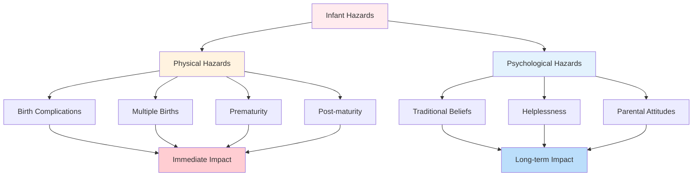
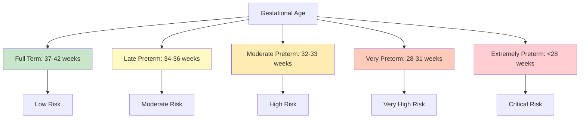

# Hazards and Adjustments During Infancy

## Overview

While infancy is a period of remarkable development and adaptation, it is also characterized by significant **physical and psychological hazards** that can impact both immediate adjustment and long-term developmental trajectories. This comprehensive exploration examines the various challenges infants face, from birth complications to parental attitudes, and their implications for healthy development.

---

## External Resources

### 📚 Essential Reading

- 📖 [Birth Complications - Wikipedia](https://en.wikipedia.org/wiki/Complications_of_childbirth) - Overview of delivery complications and risks
- 📖 [Premature Birth - Wikipedia](https://en.wikipedia.org/wiki/Preterm_birth) - Comprehensive information on prematurity
- 🔬 [Birth Complications and Long-term Outcomes - March of Dimes](https://www.marchofdimes.org/complications) - Evidence-based information on birth complications
- 🎓 [Neonatal Care - WHO](https://www.who.int/health-topics/newborn-health) - Global perspective on infant health hazards
- 📊 [Infant Mortality Statistics - CDC](https://www.cdc.gov/nchs/fastats/infant-health.htm) - Data on infant health risks

### 🎥 Video Resources

- 🎬 [Understanding Birth Complications - Mayo Clinic](https://www.youtube.com/results?search_query=birth+complications+mayo+clinic) (10 min) - Medical explanation of delivery risks
- 🎬 [Premature Birth: NICU Care - Stanford Children's](https://www.youtube.com/results?search_query=premature+baby+nicu+care) (8 min) - Understanding prematurity care

### 📄 Recent Research

- 📑 Lean, R. E., et al. (2023). "Social Adversity and Cognitive, Language, and Motor Development of Very Preterm Children from 2 to 5 Years of Age." *JAMA Pediatrics*, 177(8), 785-794. - Recent longitudinal study on prematurity outcomes
- 📑 Van Wickle, J., et al. (2024). "Birth Complications and Infant Neurodevelopment: A Systematic Review." *Pediatric Research*, 95(2), 412-428. - Contemporary meta-analysis of birth complication impacts

---

## 1. Classification of Hazards

The PDF categorizes infant hazards into **two major types**:

1. **Physical Hazards**: Biological and medical complications affecting the infant's body and brain
2. **Psychological Hazards**: Social, emotional, and attitudinal factors affecting the infant's psychological wellbeing

:::warning Critical Understanding
While physical hazards may seem more dramatic and obvious, the PDF emphasizes that psychological hazards can have equally profound and potentially more lasting effects on the infant's development.
:::

**Figure 1**: Classification of infant hazards showing both physical and psychological risk factors.

---

## 2. Physical Hazards

### 2.1 Complications at Birth

**Nature of Risk**: Birth complications represent one of the most significant physical hazards during infancy, with potential for immediate and long-term consequences.

#### 2.1.1 Maternal Complications

**Risk Factors**:
- Prolonged labor
- Difficult delivery
- Emergency situations requiring intervention
- Maternal health conditions affecting delivery

**Infant Consequences**:
- Physical injury during delivery
- Increased risk of oxygen deprivation
- Trauma from instrumental delivery
- Stress responses affecting adjustment

#### 2.1.2 Caesarean Birth

The PDF specifically mentions that **caesarean birth is likely to result in anoxia**, a temporary loss of oxygen to the brain.

**Anoxia Severity Spectrum**:

| Duration | Severity | Potential Consequences |
|----------|----------|----------------------|
| Few seconds | Mild | Minimal to no lasting effects |
| Several seconds | Moderate | Possible minor neurological impacts |
| Extended period | Severe | Significant brain damage possible |

**Critical Factor**: The PDF emphasizes that "if the anoxia is severe, brain damage will be far greater than if anoxia lasts for only a few seconds."

:::caution Clinical Importance
The relationship between birth complications and outcomes is dose-dependent: "The more complicated the birth and the more damage there is to the brain tissue, greater will be the effect on the infant's postnatal life and adjustment."
:::

#### 2.1.3 Medication During Birth

**Risk**: The PDF notes that "the use of too much medicine at the time of birth may lead to a serious complication."

**Potential Issues**:
- Respiratory depression in newborn
- Delayed initiation of breathing
- Altered consciousness in infant
- Interference with early bonding
- Effects on feeding behaviors

**Modern Considerations**: Contemporary obstetric practice carefully balances pain management with infant safety, using medications judiciously and monitoring effects closely.

### 2.2 Multiple Births

**Prevalence**: The occurrence of twins, triplets, or higher-order multiples creates unique physical challenges for infants.

#### 2.2.1 Prenatal Crowding Effects

**Mechanism**: According to the PDF, children of multiple births are usually **"smaller and weaker than singletons as a result of crowding during the prenatal period, which inhibits fetal movements."**

**Consequences of Reduced Movement**:
- Underdeveloped musculoskeletal system
- Reduced strength at birth
- Delayed motor milestone achievement
- Increased vulnerability to injury

#### 2.2.2 Prematurity Risk

The PDF notes that multiple birth infants "tend to be born premature, which adds to their adjustment problems."

**Compounding Factors**:
- Smaller size + prematurity = greater vulnerability
- Multiple adjustment challenges simultaneously
- Increased medical intervention requirements
- Extended hospitalization often necessary

**Long-term Implications**:
- Catch-up growth may take years
- Developmental monitoring required
- Higher rates of learning difficulties
- Greater parental stress and demands

### 2.3 Post-Maturity

**Definition**: Post-maturity occurs when pregnancy extends significantly beyond the expected due date, resulting in an unusually large fetus.

**Risk Profile**: According to the PDF, "if the size of fetus is large then at the time of birth, there may be a need to use instruments or surgery which becomes hazardous to the infant."

#### 2.3.1 Delivery Complications

**Instrumental Delivery Risks**:
- Forceps application → potential head trauma
- Vacuum extraction → scalp injury, intracranial hemorrhage
- Emergency cesarean → anoxia risk

**Surgical Risks**:
- Emergency procedures under stress
- Limited time for preparation
- Higher complication rates
- Maternal and infant risks combined

#### 2.3.2 Critical Conditions

The PDF emphasizes that "critical conditions of birth may create a hazard for the infant," particularly when:
- Time pressure demands rapid intervention
- Multiple complications occur simultaneously
- Medical resources are limited
- Emergency responses are required

### 2.4 Prematurity

**Severity**: The PDF notes that prematurity "may at times be the cause of death of the infant," highlighting the serious nature of this hazard.

**Figure 2**: Prematurity classification by gestational age and associated risk levels.

#### 2.4.1 Defining Prematurity

**Clinical Classifications**:
- **Late preterm**: 34-36 weeks (relatively minor issues)
- **Moderately preterm**: 32-33 weeks (significant challenges)
- **Very preterm**: 28-31 weeks (major medical needs)
- **Extremely preterm**: &lt;28 weeks (life-threatening)

#### 2.4.2 Respiratory System Vulnerability

According to the PDF, "prematurely born infants are especially susceptible to brain damage" because their "respiratory mechanism is not fully developed."

**Respiratory Distress Syndrome (RDS)**:
- Insufficient surfactant production
- Alveolar collapse
- Inadequate oxygenation
- Need for mechanical ventilation

#### 2.4.3 Anoxia in Premature Infants

The PDF specifically identifies **anoxia as another problem when premature infant's respiratory mechanism is not fully developed.**

**Anoxia Mechanisms in Prematurity**:
1. Immature lung development → inadequate gas exchange
2. Weak respiratory muscles → insufficient breathing effort
3. Underdeveloped respiratory center in brain → irregular breathing patterns
4. Apnea episodes → periodic cessation of breathing

**Long-term Effects**: The PDF emphasizes that "this effect may be such that it can also be long lasting," suggesting potential for:
- Neurological impairments
- Developmental delays
- Learning disabilities
- Behavioral challenges

#### 2.4.4 Additional Prematurity Complications

While not detailed extensively in the PDF, prematurity creates multiple vulnerabilities:
- Difficulty maintaining body temperature
- Immature immune system
- Feeding difficulties
- Jaundice and metabolic problems
- Sensory system immaturity

---

## 3. Psychological Hazards

The PDF emphasizes that psychological hazards, while perhaps less visible than physical ones, can profoundly impact infant development and family dynamics.

### 3.1 Traditional Beliefs About Birth

**Nature of Hazard**: Cultural beliefs and superstitions about birth circumstances can create psychological burdens for infants and families.

#### 3.1.1 Birth Timing Beliefs

**Examples from PDF**:
- Some people believe "those children born with difficult births, have difficult life situations"
- Beliefs about auspicious or inauspicious birth times
- Superstitions about birth dates or circumstances

**Impact on Infant**:
- Parental expectations shaped by beliefs
- Self-fulfilling prophecies possible
- Treatment of infant influenced by beliefs
- Family attitudes affected

#### 3.1.2 Scientific Evidence

**Important Note**: The PDF explicitly states "there is less scientific evidence to support these beliefs," suggesting:
- These are cultural constructs rather than biological realities
- Beliefs persist despite lack of evidence
- Psychology must address belief impacts regardless of validity

**Clinical Implications**:
- Healthcare providers must sensitively address cultural beliefs
- Education about evidence-based outcomes important
- Respect for beliefs while promoting optimal care
- Recognition that beliefs can create real psychological impacts

### 3.2 Helplessness

The PDF identifies **helplessness as a struggle for the infant in the outer world**, creating unique psychological challenges.

#### 3.2.1 Hospital Environment

**Contextual Factors**: "At the time of birth infants are in hospital and under the care of many doctors and nurses."

**Psychological Impacts**:
- Multiple caregivers vs. primary attachment figure
- Institutional environment vs. intimate home setting
- Medical procedures and interventions
- Separation from mother (in some cases)
- Overstimulation from hospital environment

#### 3.2.2 Birth Order Effects

According to the PDF, "the helplessness of the newborn is more of a psychological hazard in the case of first-born children than of later-born children."

**First-Born Infant Challenges**:
- Parents lack experience and confidence
- Anxiety about caregiving adequacy
- Uncertainty about infant needs
- Overprotection or under-response to cues
- Parents learning simultaneously with infant

**Later-Born Infant Advantages**:
- Experienced parents with confidence
- Established caregiving routines
- Ability to distinguish normal from concerning behaviors
- Reduced parental anxiety
- More relaxed, responsive caregiving

**Research Support**: This observation aligns with extensive research showing birth order effects on parenting behaviors and child outcomes.

### 3.3 Attitude of Parents

The PDF identifies parental attitudes as perhaps the **most significant psychological hazard**, stating "the attitude of the parents may be changed at the time of birth."

#### 3.3.1 Factors Changing Parental Attitudes

**Gender Preferences**: 
- Cultural preferences for male or female children
- Disappointment if infant is "wrong" gender
- Differential treatment based on gender
- Impact on bonding and attachment

**Excessive Crying**:
- Perception of "difficult" infant
- Parental frustration and stress
- Feeling of inadequacy as caregiver
- Strain on parent-infant relationship

**Feeding Difficulties**:
- Breastfeeding challenges
- Infant refusal or ineffective feeding
- Parental anxiety about nutrition
- Self-blame for feeding problems

**Complications at Birth**:
- Trauma from difficult delivery
- Post-traumatic stress in parents
- Fear and anxiety about infant's health
- Guilt or blame regarding complications

**Unexpected Multiples**:
- Shock at arrival of twins or triplets
- Overwhelm at care requirements
- Financial stress
- Inadequate preparation
- Grief for anticipated single infant experience

#### 3.3.2 Maternal Attitude Primacy

The PDF emphasizes: **"The mother's attitude is more important for the infant because infants are in direct touch with their mother."**

**Rationale**:
- Primary caregiver in most cultures
- Physical proximity (nursing, holding)
- Most frequent interactions
- Infant's primary attachment figure
- Mother's emotional state directly impacts infant

**Mechanisms of Impact**:
- **Attunement**: Mother's ability to read and respond to infant cues
- **Emotional contagion**: Infant absorbs mother's emotional states
- **Caregiving quality**: Attitudes affect care behaviors
- **Attachment security**: Attitudes shape attachment patterns

#### 3.3.3 Formation of Lasting Attitudes

**Critical Timing**: The PDF notes that "psychologically, the attitude of significant others toward the infant gets crystallized" during infancy.

**Crystallization Process**:
1. **Initial impressions** form immediately after birth
2. **Early interactions** reinforce or modify impressions
3. **Patterns establish** through repeated experiences
4. **Attitudes solidify** becoming relatively stable

**Developmental Changes**: The PDF acknowledges that "this attitude changes from one stage to another," suggesting:
- Attitudes formed in infancy are not permanent
- Later positive experiences can modify negative attitudes
- Developmental changes in child elicit different responses
- Hope for intervention and improvement

---

## 4. Interplay Between Physical and Psychological Hazards

While the PDF categorizes hazards separately, in reality they often interact and compound each other:

### 4.1 Physical → Psychological Pathway

**Example Cascade**:
1. **Premature birth** (physical hazard)
2. → Extended NICU hospitalization
3. → Delayed mother-infant contact
4. → Disrupted attachment formation (psychological hazard)
5. → Long-term relationship difficulties

### 4.2 Psychological → Physical Pathway

**Example Cascade**:
1. **Negative parental attitudes** (psychological hazard)
2. → Inadequate or inconsistent caregiving
3. → Poor nutrition or hygiene
4. → **Failure to thrive** (physical hazard)
5. → Developmental delays

### 4.3 Bidirectional Reinforcement

**Vicious Cycle Example**:
- Difficult birth creates physical complications
- ↓
- Parents become anxious and fearful
- ↓
- Anxiety interferes with responsive caregiving
- ↓
- Infant's adjustment and development affected
- ↓
- Developmental delays increase parental concern
- ↓
- Cycle continues and intensifies

---

## 5. Clinical and Practical Implications

### 5.1 Prevention Strategies

**Prenatal Care**:
- Regular medical monitoring
- Nutrition optimization
- Risk factor identification
- Preparation and education

**Birth Planning**:
- Informed decision-making
- Emergency preparedness
- Supportive birth environment
- Skilled attendants present

**Postnatal Support**:
- Early monitoring and intervention
- Parent education and support
- Mental health screening
- Home visiting programs

### 5.2 Intervention Approaches

**For Physical Hazards**:
- Immediate medical treatment
- Developmental monitoring
- Early intervention services
- Therapeutic support (physical, occupational)

**For Psychological Hazards**:
- Parent-infant psychotherapy
- Attachment-based interventions
- Parental mental health treatment
- Family support services

### 5.3 Cultural Sensitivity

**Addressing Beliefs**:
- Respect cultural perspectives
- Provide evidence-based information
- Work within belief systems when possible
- Avoid judgmental approaches

**Supporting Families**:
- Acknowledge cultural strengths
- Identify culture-specific stressors
- Mobilize cultural supports
- Bridge traditional and modern approaches

---

## 💡 Memory Aids & Mnemonics

### Physical Hazards: **"CMPP"**
- **C**omplications at birth (anoxia, trauma)
- **M**ultiple births (crowding, prematurity)
- **P**ost-maturity (large fetus, instrumental delivery)
- **P**rematurity (respiratory issues, brain vulnerability)

### Psychological Hazards: **"THA"**
- **T**raditional beliefs (superstitions about birth)
- **H**elplessness (especially for first-borns)
- **A**ttitudes (parental emotional responses)

### Anoxia Severity: **"Seconds Matter"**
- **Few seconds** = Minimal impact
- **Several seconds** = Possible minor effects
- **Extended period** = Significant brain damage

### Birth Order Effect: **"First-Time Anxiety"**
- First-born: Higher parental anxiety → Greater psychological hazard
- Later-born: Experienced parents → Reduced psychological hazard

---

## 🌍 Real-World Applications

### Medical Interventions
- **Prenatal Monitoring**: Early identification of risks like multiple pregnancies or growth abnormalities
- **Anoxia Prevention**: Careful monitoring during delivery with rapid intervention when needed
- **NICU Technology**: Specialized equipment supports premature infants through critical adjustments
- **Postnatal Screening**: Early detection of complications enables timely treatment

### Parent Support Programs
- **First-Time Parent Classes**: Address helplessness anxiety with education and skill-building
- **Cultural Competency**: Healthcare providers learn to work within cultural belief systems
- **Mental Health Screening**: Postpartum depression and anxiety screening protects infant wellbeing
- **Home Visiting Programs**: Support families at high risk for psychological hazards

### Policy Implications
- **Parental Leave**: Extended leave supports successful adjustment period
- **Universal Healthcare**: Access to prenatal and postnatal care reduces physical hazards
- **Family Support Services**: Government programs buffer against psychological hazards
- **Research Funding**: Continued study of prevention and intervention strategies

---

## 6. Long-term Considerations

### 6.1 Resilience and Recovery

**Positive Finding**: Many infants who experience hazards demonstrate remarkable resilience:
- With appropriate support, most overcome early challenges
- Plasticity of infant brain allows for recovery
- Sensitive caregiving can buffer against early adversity
- Long-term outcomes not determined solely by early hazards

### 6.2 Risk Accumulation

**Caution**: However, **cumulative risk** is important:
- Multiple hazards compound effects
- Chronic stressors more harmful than acute events
- Absence of protective factors increases vulnerability
- Early intervention becomes more critical

### 6.3 Monitoring and Support

**Ongoing Needs**:
- Developmental surveillance throughout childhood
- Early identification of emerging difficulties
- Timely referral for specialized services
- Family support and education
- Collaboration among professionals

---

## Summary

Infancy, while a period of remarkable developmental potential, is characterized by significant **physical and psychological hazards** that require careful attention from caregivers, healthcare providers, and society. Physical hazards—including birth complications, anoxia, multiple births, post-maturity, and prematurity—can impact immediate survival and long-term development. Psychological hazards—including traditional beliefs, helplessness, and parental attitudes—shape the infant's emotional world and attachment relationships.

**Key Takeaways**:

1. **Dual hazard types**: Both physical and psychological hazards threaten infant wellbeing, often interacting and compounding

2. **Birth complications**: Range from mild to severe, with anoxia representing particular danger for brain development

3. **Prematurity effects**: Create multiple vulnerabilities, with respiratory system immaturity being especially concerning

4. **Parental attitudes**: Crystallize during infancy and profoundly impact infant development through caregiving quality

5. **Cultural beliefs**: While lacking scientific support, traditional beliefs can create real psychological impacts

6. **Intervention opportunities**: Many hazards are preventable or treatable with appropriate support

7. **Resilience capacity**: With adequate intervention and support, most infants demonstrate remarkable recovery

Understanding these hazards enables healthcare providers, parents, and society to implement preventive strategies, provide timely interventions, and support optimal infant development despite challenges.

---

## Self-Assessment Questions

1. **Multiple Choice**: A caesarean birth is likely to result in:
   a) Enhanced bonding
   b) Anoxia
   c) Accelerated development
   d) Improved immune function

2. **True/False**: The PDF states that prematurely born infants are especially susceptible to brain damage.

3. **Short Answer**: Explain why the helplessness of newborns is described as "more of a psychological hazard" for first-born children compared to later-born children.

4. **Analysis Question**: The PDF states there is "less scientific evidence to support" traditional beliefs about birth, yet these beliefs persist. Explain how scientifically unsupported beliefs can still create real psychological hazards for infants.

5. **Application**: A mother is anxious and fearful after a difficult birth with complications. Her infant cries frequently and has feeding difficulties. Using the concept of bidirectional reinforcement, trace how physical and psychological hazards might interact in this situation.

6. **Critical Thinking**: The PDF emphasizes that "the mother's attitude is more important for the infant because infants are in direct touch with their mother." Evaluate this claim in light of modern understanding of multiple caregivers and diverse family structures.

---

**Source PDFs**: 
- 📄 [Block-1/Unit-3.pdf - Pages 32-33](/pdfs/MPC-002%20Life%20Span%20Psychology/Block-1/Unit-3.pdf)
- 📚 MPC-002 Life Span Psychology
