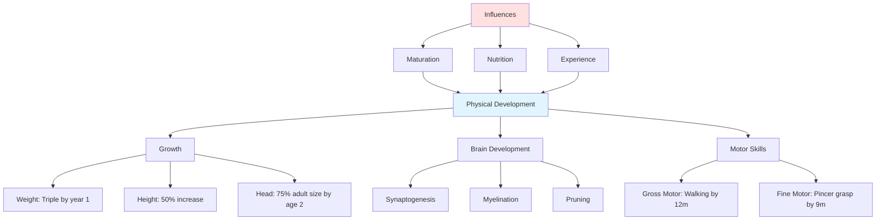

# Physical and Psychosocial Development in Infancy

## Introduction

The first two years of life witness extraordinary physical and psychosocial transformations. A helpless newborn who cannot lift their head becomes a walking, running toddler. An infant who communicates only through crying develops the capacity for complex social interactions, emotional expressions, and the beginnings of relationships that will shape their entire life. Understanding both physical and psychosocial development during infancy is essential for supporting optimal growth and recognizing when intervention may be needed.

This unit explores two interconnected domains of infant development: the remarkable physical growth and motor skill acquisition that characterize infancy, and the crucial psychosocial developments including trust formation, attachment relationships, and emerging social capacities that establish the foundation for lifelong emotional health and social competence.

## Physical Development in Infancy

### Physical Growth Patterns

**Rapid Growth Trajectory**:
The first year of infancy is characterized by the **most rapid physical growth** outside of the prenatal period. The dramatic changes in size, weight, and body proportions during this time reflect the extraordinary biological development occurring.

#### Weight Gain

**Typical Weight Progression**:
- **Birth weight**: Average 7-7.5 pounds (3.2-3.4 kg)
  - Range: 5.5-10 pounds generally considered normal
  - Boys typically slightly heavier than girls
- **By 6 months**: Doubles birth weight (14-15 pounds)
- **By 12 months**: Triples birth weight (21-22 pounds)
- **By 24 months**: Quadruples birth weight (28-30 pounds)

**Weight Gain Rate**:
- **First 3 months**: 5-7 ounces (140-200 grams) per week
- **3-6 months**: 4-5 ounces per week
- **6-12 months**: 3-4 ounces per week
- **12-24 months**: Slows considerably, approximately 4-6 pounds total for second year

**Individual Variation**: While these represent averages, healthy infants show considerable variation based on genetics, nutrition, and other factors. Growth charts track individual trajectories rather than expecting all infants to match average values exactly.

#### Length/Height Growth

**Typical Length Progression**:
- **Birth**: Average 19-20 inches (48-51 cm)
- **By 6 months**: 25-27 inches (approximately 50% increase)
- **By 12 months**: 28-30 inches (approximately 50% of adult height)
- **By 24 months**: 32-36 inches

**Growth Rate**:
- **First year**: Approximately 10 inches total
- **Second year**: Approximately 4-5 inches
- Growth occurs in spurts rather than continuously

#### Body Proportions

**Changing Proportions**:
At birth, infants have distinctive body proportions that change dramatically during infancy:

**Head Size**:
- **Newborn**: Head represents 25% of total body length
- **By 2 years**: Head approximately 20% of body length
- **Adult**: Head only 12-13% of body length

**Head Circumference Growth**:
- **Birth**: Average 13-14 inches (33-35 cm)
- **First year**: Increases approximately 5 inches
- **Second year**: Increases approximately 1 inch
- By end of second year: Brain has reached **75% of adult weight**

**Clinical Significance**: Head circumference is carefully monitored as indicator of brain growth. Abnormal patterns (microcephaly, macrocephaly) may signal developmental problems.

**Body Proportions Evolution**:
- Newborns have large heads, small chests, relatively large abdomens
- By age 2, body proportions becoming more balanced
- Cephalocaudal development: Head develops before trunk before legs

### Brain Development

**Neurological Growth**:
The infant brain undergoes extraordinary development during the first two years:

**Brain Weight Increase**:
- **Birth**: Brain weighs approximately 400 grams (25% of adult weight)
- **6 months**: Approximately 50% of adult weight
- **2 years**: Approximately 75% of adult weight (about 1,000 grams)
- **Adult**: Approximately 1,300-1,400 grams

**Neural Development Processes**:

**Neurogenesis**: While most neurons form prenatally, some brain regions continue producing new neurons during infancy.

**Synaptogenesis**: Explosive growth in connections (synapses) between neurons:
- Peak production: 15,000 synapses per neuron by age 2-3
- Visual cortex peaks at 2-4 months
- Prefrontal cortex peaks at 12-24 months
- Creates 1.8 million new synapses per second during first year

**Myelination**: Fatty coating (myelin) forms around nerve fibers:
- Speeds neural transmission
- Proceeds in predictable patterns: sensory/motor areas first, higher cortical areas later
- Continues into adolescence and early adulthood for some brain regions

**Synaptic Pruning**: Beginning in late infancy:
- Eliminates unused connections
- "Use it or lose it" principle
- Makes remaining connections more efficient
- Experience-dependent process

**Critical/Sensitive Periods**: Windows of optimal development for specific capacities:
- Vision: First 6-8 months most critical
- Language: First few years highly sensitive
- Emotional regulation: First 2-3 years important foundation

**Environmental Influence**: Brain development is profoundly shaped by experience:
- Enriched environments enhance neural connections
- Severe deprivation reduces brain development
- Quality of caregiving affects brain architecture
- Stress and trauma alter developing neural systems

### Motor Development

Motor development follows **predictable patterns and sequences**, though timing varies among individual infants. Two key principles govern motor development:

**Cephalocaudal Development**: "Head to tail"
- Head control develops before trunk control
- Trunk control before leg control
- Upper body abilities before lower body

**Proximodistal Development**: "Near to far"  
- Control of trunk before arms
- Arm control before hand control
- Hand control before finger control

#### Gross Motor Development

**Gross motor skills** involve large muscle groups and whole-body movements:

**Typical Milestones**:

**0-3 Months**:
- Lifts head briefly when on stomach (by 1 month)
- Holds head steady when upright (by 2-3 months)
- Pushes up on arms when on stomach (by 3 months)
- Brings hands together (by 3 months)

**4-6 Months**:
- Rolls from stomach to back (by 4 months)
- Rolls from back to stomach (by 5-6 months)
- Sits with support (by 5 months)
- Sits without support briefly (by 6 months)

**7-9 Months**:
- Sits steadily without support (by 7 months)
- Gets to sitting position independently (by 8 months)
- Crawls or creeps (by 8-9 months; some skip this stage)
- Pulls to standing position (by 9 months)

**10-12 Months**:
- Cruises (walks holding furniture) (by 10-11 months)
- Stands alone briefly (by 11 months)
- **Takes first independent steps** (by 12 months on average)
  - Normal range: 9-17 months
  - Walking considered "delayed" only if not achieved by 18 months

**13-24 Months**:
- Walks independently well (by 15 months)
- Walks backwards (by 16 months)
- Runs (by 18 months)
- Kicks ball (by 20 months)
- Jumps in place (by 24 months)
- Walks up stairs with assistance (by 24 months)

#### Fine Motor Development

**Fine motor skills** involve small muscle movements, particularly hands and fingers:

**Typical Milestones**:

**0-3 Months**:
- **Grasp reflex**: Automatically grasps objects placed in palm
- Hands mostly fisted
- Beginning to bat at objects (by 3 months)

**4-6 Months**:
- Reaches for and grasps objects (by 4-5 months)
- **Palmar grasp**: Uses whole hand to grasp
- Transfers objects hand to hand (by 6 months)
- Raking grasp for small objects

**7-9 Months**:
- **Pincer grasp emerges** (by 9 months)
  - Uses thumb and forefinger to pick up small objects
  - Major milestone enabling self-feeding
- Bangs objects together
- Pokes with index finger

**10-12 Months**:
- Refined pincer grasp
- Drops and throws objects deliberately
- Attempts to stack blocks (may succeed with help)
- Turns pages of board books (several at once)

**13-24 Months**:
- Stacks 2-4 blocks (by 18 months)
- Scribbles spontaneously (by 18 months)
- Turns pages one at a time (by 24 months)
- Beginning to show hand preference
- Stacks 6+ blocks (by 24 months)
- Begins using spoon with some success

**Individual Variation**: Motor milestone timing varies considerably among healthy infants. Cultural practices affect motor development—for example, infants given less "tummy time" may walk later but develop typically overall.

### Maturation and Development

**Maturation Defined**:
**Maturation** refers to the universal sequence of biological events in the central nervous system and body that enables psychological and physical functions to emerge, assuming:
- The child is physically healthy
- The environment contains people and objects for interaction

**Key Characteristics of Maturation**:

**1. Biological Foundation**: Maturation is primarily driven by genetic programs:
- Neural development follows species-typical patterns
- Myelination proceeds in predictable sequence
- Bone ossification occurs on schedule

**2. Universal Sequences**: All healthy humans follow same general sequence:
- All babies lift head before sitting
- All babies sit before standing
- All babies stand before walking
- Sequences can't be skipped or reversed

**3. Environment Enables but Doesn't Create**:
- Maturation sets the **earliest possible time** for skill emergence
- Adequate environment necessary but not sufficient
- Enriched environment doesn't accelerate maturation beyond limits
- Severely deprived environment can delay development

**4. Individual Timing Variation**:
- Maturation proceeds at slightly different rates in different children
- Same child may mature quickly in some domains, slowly in others
- Wide range of "normal" in milestone achievement

**Example**: Walking
- **Maturation requirement**: Neural and muscular systems must reach adequate development
- **Environmental requirement**: Opportunity to practice balance, standing, moving
- **Outcome**: Child walks when maturation permits and experience provides practice
- **Cannot be taught before readiness**: No amount of practice will cause 4-month-old to walk

**Contemporary Understanding**: Modern developmental science views development as arising from complex **transactions** between maturation and experience, rather than simple addition of the two.

### Nutrition and Physical Development

**Importance of Adequate Nutrition**:
Proper nutrition is essential for optimal physical growth and brain development during infancy.

**Nutritional Needs**:
Infants have high nutritional needs relative to body size due to rapid growth:
- **Calories**: Approximately 100 calories per kg of body weight per day
- **Protein**: Essential for tissue growth
- **Iron**: Critical for brain development; stores from birth depleted by 4-6 months
- **Zinc**: Important for growth and immune function
- **Essential fatty acids**: Particularly DHA for brain development

**Infant Feeding**:

**Breast Milk**:
- **Ideal nutrition** for first 6 months
- Contains antibodies and immune factors
- Composition changes to meet infant's needs
- Associated with:
  - Lower infection rates
  - Reduced SIDS risk
  - Possible cognitive benefits
  - Reduced obesity risk later

**Formula**:
- Designed to approximate breast milk
- Iron-fortified formulas recommended
- Adequate nutrition for healthy growth
- Choice depends on individual circumstances

**Solid Foods**:
- Introduced around 6 months
- Start with single-ingredient foods
- Gradual expansion of variety
- Self-feeding skills emerge during second year

**Malnutrition Effects**:
- **Undernutrition**: Growth faltering, developmental delays, weakened immunity
- **Overnutrition**: Increased obesity risk, metabolic programming
- **Micronutrient deficiencies**: Iron deficiency affects cognitive development

**Environmental and Genetic Factors**:
Growth depends on complex interaction:
- **Genetic potential**: Sets broad parameters
- **Nutrition quality**: Enables or constrains realization of potential
- **Health status**: Chronic illness affects growth
- **Psychological factors**: Severe stress can impact physical growth

## Psychosocial Development in Infancy

**Defining Psychosocial Development**:
Psychosocial development encompasses:
- Understanding of oneself in relation to the social environment
- Emotional capacities and regulation
- Formation of relationships
- Social behaviors and interactions
- Emerging sense of self

During infancy, psychosocial development focuses primarily on establishing basic trust, forming attachment bonds, and beginning to understand social interactions.

### Erikson's Psychosocial Theory: Trust vs. Mistrust

**Erik Erikson's Framework**:
Erik Erikson (1902-1994) proposed that personality development occurs through eight psychosocial stages across the lifespan. Each stage involves a **psychosocial crisis** or challenge that must be resolved. The outcome of each stage influences subsequent development, though outcomes can be revised through later experiences.

#### Stage 1: Trust vs. Mistrust (Birth to 12-18 Months)

**The Central Challenge**:
Infants must develop a sense of **trust**—the belief that the world is safe, predictable, and that their needs will be met—versus **mistrust**—the feeling that the world is unpredictable, unreliable, and threatening.

**Key Concepts**:

**Basic Trust**:
- Sense that the world is a good, safe place
- Confidence that needs will be met
- Foundation for secure attachment
- Basis for healthy personality development
- Includes trust in:
  - Caregivers' reliability
  - Self (own worthiness of care)
  - World's basic goodness

**Mistrust**:
- Belief that world is unpredictable, dangerous
- Expectation that needs won't be met consistently
- Vigilance and anxiety
- Difficulty forming secure relationships
- Can result from:
  - Inconsistent care
  - Neglect or abuse
  - Caregiver unavailability (physical or emotional)

**Developmental Process**:

**How Trust Develops**:
1. **Consistent need fulfillment**: Hungry infant is fed, uncomfortable infant is soothed
2. **Predictable caregiving**: Regular patterns and routines
3. **Sensitive responsiveness**: Caregiver accurately reads and responds to infant's signals
4. **Emotional availability**: Caregiver provides comfort, warmth, affection
5. **Physical comfort and security**: Adequate food, warmth, cleanliness

**The Role of Caregiving Quality**:
- **Optimal**: Consistent, sensitive, available care promotes basic trust
- **Inconsistent**: Unpredictable care creates uncertainty and partial mistrust
- **Inadequate**: Neglectful or abusive care generates pervasive mistrust

**Balance Concept**:
Erikson emphasized that development requires **favorable ratio** of trust to mistrust, not 100% trust:
- Some mistrust is adaptive (healthy caution)
- Excessive trust could be dangerous (inability to recognize threat)
- Optimal outcome: **Hope** - realistic optimism that even when things are difficult, they will work out

**Virtue Developed**: When stage is successfully resolved, the virtue of **HOPE** emerges:
- Belief that despite setbacks, positive outcomes are possible
- Confidence in facing future challenges
- Foundation for resilience

**Maladaptations**:
- **Sensory distortion** (too much trust): Unrealistic trust, vulnerability to exploitation
- **Withdrawal** (too much mistrust): Isolation, depression, inability to form relationships

**Long-term Implications**:
- Basic trust influences all subsequent stages
- Affects ability to form intimate relationships (Erikson's Stage 6: Intimacy vs. Isolation)
- Influences parenting capacity in next generation
- Can be revised through therapy or corrective relationships

**Contemporary Research Support**:
Modern attachment research (Bowlby, Ainsworth) has provided empirical support for Erikson's concepts:
- Secure attachment correlates with basic trust
- Insecure attachment patterns reflect difficulties in trust development
- Early relationship quality predicts later social-emotional functioning

### Attachment Theory

**Definition of Attachment**:
**Attachment** is an enduring emotional bond between infant and caregiver, characterized by:
- Seeking proximity, especially when distressed
- Using caregiver as secure base for exploration
- Experiencing distress upon separation
- Joy and comfort upon reunion

**Historical Development**:

**John Bowlby** (1907-1990):
- Developed attachment theory drawing on psychoanalysis, ethology, and cognitive psychology
- Proposed attachment has evolutionary basis: keeps infant near protective caregiver
- Described attachment as biological need, not secondary to feeding
- Identified four phases of attachment development

**Mary Ainsworth** (1913-1999):
- Extended Bowlby's work through systematic observation
- Developed "Strange Situation" assessment procedure
- Identified different attachment patterns (secure, insecure-avoidant, insecure-resistant)
- Emphasized sensitive responsiveness as key to secure attachment

#### Development of Attachment

**Phase 1: Pre-attachment (Birth-6 weeks)**:
- Infant displays indiscriminate social responsiveness
- Responds positively to most people
- No preference for specific caregivers yet
- Reflexive behaviors (grasping, sucking) promote proximity

**Phase 2: Attachment-in-the-Making (6 weeks-6 months)**:
- Beginning to discriminate familiar from unfamiliar people
- Responds more positively to familiar caregivers
- Not yet showing distress at separation
- Social smile emerges (7-8 weeks)

**Phase 3: Clear-cut Attachment (6 months-18 months)**:
- Specific attachment to primary caregiver(s) clearly evident
- Separation anxiety emerges (8-10 months)
- Stranger anxiety appears (8-12 months)
- Uses caregiver as secure base for exploration
- Follows caregiver, protests separation

**Phase 4: Reciprocal Relationships (18 months onward)**:
- More sophisticated understanding of caregiver's goals and feelings
- Can negotiate and compromise
- Represents caregiver mentally during absence
- Separation protests may decrease as understanding increases

**Ainsworth's Attachment Patterns**:

**Secure Attachment** (60-65% of infants):
- Uses caregiver as secure base
- Explores environment confidently when caregiver present
- Shows distress when separated but recovers when reunited
- Seeks contact when distressed, easily comforted
- **Caregiver characteristics**: Sensitive, responsive, consistent

**Insecure-Avoidant Attachment** (20-25%):
- Little emotional response to separation
- Avoids or ignores caregiver upon reunion
- Appears independent but may have elevated stress hormones
- Explores without using caregiver as base
- **Caregiver characteristics**: Rejecting, emotionally unavailable

**Insecure-Resistant (Ambivalent) Attachment** (10-15%):
- Extreme distress at separation
- Difficult to comfort upon reunion
- Shows both contact-seeking and anger/resistance
- Less exploration even when caregiver present
- **Caregiver characteristics**: Inconsistent, unpredictable

**Disorganized Attachment** (5-10%, identified later):
- Contradictory, confused behaviors
- May freeze, show apprehension of caregiver
- Often seen in maltreated children
- **Caregiver characteristics**: Frightening, frightened, or extremely insensitive

**Long-term Significance**:
- Attachment security predicts:
  - Later social competence
  - Emotional regulation abilities
  - Quality of peer relationships
  - Romantic relationship patterns in adulthood
- **Not deterministic**: Can change with changing circumstances
- Interventions can promote secure attachment

### Social Behaviors in Infancy

#### Smiling

**Evolution of Smiling**:

**Reflex Smile** (Birth-6 weeks):
- Spontaneous facial movement
- Occurs during sleep
- Not social in nature
- Muscular exercise

**Social Smile** (6-8 weeks):
- Responds to human faces and voices
- Initially somewhat indiscriminate
- Major milestone in social development
- By 3 months: Will smile at almost any face

**Selective Social Smile** (3-6 months):
- Smiles more readily at familiar faces
- Different quality smile for caregiver vs. stranger
- Incorporates memory and recognition

**Functions of Smiling**:
- **Bonding**: Strengthens emotional connection with caregivers
- **Communication**: Expresses pleasure, invites interaction
- **Caregiver reward**: Makes caregiving more rewarding, promotes continued care
- **Social development**: First true social interaction

**Reciprocal Smiling**: Mother-infant mutual smiling represents infant's first social exchange:
- Turn-taking structure
- Mutual regulation
- Foundation for later conversations

#### Separation Anxiety

**Definition**: Distress when separated from attachment figure, particularly in unfamiliar situations.

**Typical Development**:
- **Emerges**: Around 7-8 months
- **Peaks**: 10-18 months (varies considerably)
- **Decreases**: After 18-24 months as understanding increases

**Manifestations**:
- Crying and protest when caregiver leaves
- Following caregiver from room to room
- Clinging behavior
- Distress in unfamiliar environments

**Significance**:
- **Indicates healthy attachment**: Shows infant has formed specific bond
- **Normal development**: Not a sign of problem in most cases
- **Cross-cultural universal**: Observed in all studied cultures

**Cultural Variation**: Intensity and duration vary based on caregiving practices:
- Cultures with more infant-caregiver proximity may show less intense anxiety
- Cultures emphasizing independence may see earlier decrease

**Coping Strategies**:
- Brief, matter-of-fact departures
- Consistent goodbye routines
- Leaving infant with familiar, responsive caregiver
- Understanding this is temporary phase

#### Stranger Anxiety

**Definition**: Wariness or fear response to unfamiliar people, especially adults.

**Typical Development**:
- **Emerges**: Around 6-8 months
- **Peaks**: 8-10 months
- **Gradually decreases**: Over second year
- **Individual variation**: Some infants show intense reactions, others mild

**Typical Response Pattern**:
1. Infant sees stranger
2. Stares silently, unmoving
3. May cry or show distress
4. Looks to caregiver for reassurance
5. May tolerate stranger if caregiver present and responsive

**Influences on Response Intensity**:
- **Context**: Home vs. unfamiliar location
- **Approach style**: Gradual, gentle approach better tolerated
- **Infant temperament**: Some naturally more wary
- **Caregiver presence**: Anxiety less intense when caregiver present
- **Previous experiences**: More social exposure generally reduces intensity

**Adaptive Function**:
- Protects infant from potential danger
- Keeps infant near protective caregivers
- Demonstrates cognitive advance: can distinguish familiar from unfamiliar

**Not a Problem**: Stranger anxiety is normal development, not indicating:
- Insecurity or anxiety disorder
- Poor socialization
- Overattachment to parents

**Management**:
- Allow infant to warm up gradually
- Don't force interaction
- Let infant observe from security of caregiver's arms
- Respect infant's comfort level

### Contemporary Understanding of Psychosocial Development

**Temperament**: Individual differences in emotional reactivity and regulation:
- Present from birth
- Relatively stable over time
- Influences but doesn't determine outcomes
- Interactions with environment (goodness of fit) crucial

**Cultural Context**: Psychosocial development shaped by cultural values and practices:
- Different cultures emphasize different developmental goals
- Attachment patterns vary somewhat across cultures
- Core needs for responsiveness and sensitivity universal

**Individual Differences**: Wide range of normal variation:
- Timeline of milestones varies
- Intensity of emotions varies
- Social behaviors vary
- All can support healthy development

## Self-Assessment Questions

### Multiple Choice

1. Typically, infants triple their birth weight by:
   a) 6 months
   b) 9 months
   c) 12 months
   d) 18 months

2. By age 2, an infant's brain has reached approximately what percentage of adult weight?
   a) 50%
   b) 60%
   c) 75%
   d) 90%

3. The principle of cephalocaudal development means:
   a) Development proceeds from head to tail
   b) Development proceeds from center to extremities
   c) All areas develop simultaneously
   d) Development is unpredictable

4. According to Erikson, the psychosocial crisis of infancy is:
   a) Autonomy vs. Shame
   b) Trust vs. Mistrust
   c) Initiative vs. Guilt
   d) Identity vs. Role Confusion

5. The virtue that emerges from successfully resolving Erikson's first stage is:
   a) Will
   b) Purpose
   c) Hope
   d) Competence

6. Secure attachment is characterized by:
   a) No distress at separation
   b) Inability to be comforted
   c) Using caregiver as secure base
   d) Avoiding caregiver upon reunion

7. The social smile typically emerges around:
   a) 2 weeks
   b) 6-8 weeks
   c) 3 months
   d) 6 months

8. Separation anxiety typically peaks around:
   a) 6 months
   b) 10-18 months
   c) 24 months
   d) 3 years

9. Stranger anxiety is:
   a) Sign of psychological problems
   b) Preventable with proper socialization
   c) Normal developmental phenomenon
   d) Result of overprotective parenting

10. The pincer grasp, using thumb and forefinger, typically emerges around:
    a) 4 months
    b) 6 months
    c) 9 months
    d) 12 months

### Short Answer Questions

1. Explain the difference between maturation and learning in motor development.

2. Describe Erikson's concept of trust vs. mistrust and explain how caregiving quality influences the outcome.

3. What is attachment, and why is it considered important for later development?

4. Explain the difference between separation anxiety and stranger anxiety.

5. Why is the first two years critical for brain development?

---

**Source PDFs**: 
- 📄 [Block-1/Unit-3.pdf - Pages 33-37](/pdfs/MPC-002%20Life%20Span%20Psychology/Block-1/Unit-3.pdf)
- 📚 MPC-002 Life Span Psychology

## Answers to Self-Assessment Questions

### Multiple Choice
1. c) 12 months
2. c) 75%
3. a) Development proceeds from head to tail
4. b) Trust vs. Mistrust
5. c) Hope
6. c) Using caregiver as secure base
7. b) 6-8 weeks
8. b) 10-18 months
9. c) Normal developmental phenomenon
10. c) 9 months

## Educational Videos

**Physical Development in Infancy**:
<iframe width="560" height="315" src="https://www.youtube.com/embed/1gF6R4L6_M0" title="Infant Physical Development" frameborder="0" allow="accelerometer; autoplay; clipboard-write; encrypted-media; gyroscope; picture-in-picture" allowfullscreen></iframe>

**Attachment Theory and Strange Situation**:
<iframe width="560" height="315" src="https://www.youtube.com/embed/QTsewNrHUHU" title="Attachment Theory" frameborder="0" allow="accelerometer; autoplay; clipboard-write; encrypted-media; gyroscope; picture-in-picture" allowfullscreen></iframe>

## Memory Aids

### **Growth Milestones: "2-3-4"**
- **2x** birth weight by 6 months
- **3x** birth weight by 12 months  
- **4x** birth weight by 24 months

### **Erikson Stage 1: "HOPE for TRUST"**
- Virtue: **HOPE**
- Crisis: **TRUST** vs. Mistrust
- Outcome of consistent, sensitive caregiving

### **Development Principles: "CP"**
- **C**ephalocaudal (head to tail)
- **P**roximodistal (center to extremities)

## Further Resources

### Wikipedia Articles
- [Infant Development](https://en.wikipedia.org/wiki/Infant_cognitive_development)
- [Motor Development](https://en.wikipedia.org/wiki/Motor_skill)
- [Erik Erikson](https://en.wikipedia.org/wiki/Erik_Erikson)
- [Attachment Theory](https://en.wikipedia.org/wiki/Attachment_theory)
- [Mary Ainsworth](https://en.wikipedia.org/wiki/Mary_Ainsworth)

### External Resources
- [CDC Developmental Milestones](https://www.cdc.gov/ncbddd/actearly/milestones/index.html)
- [Zero to Three - Development](https://www.zerotothree.org/)

---

*Last Updated: January 28, 2025*
