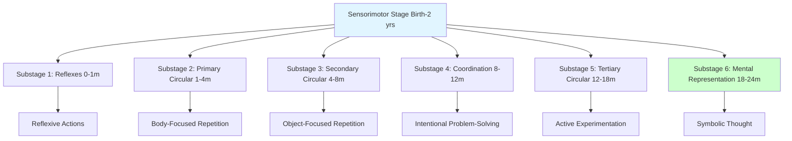

# Cognitive and Linguistic Development in Infancy

## Introduction

The cognitive and linguistic achievements of infancy are nothing short of remarkable. In just two years, infants progress from reflexive beings responding primarily to immediate sensations to intentional problem-solvers who can represent objects mentally, use tools, engage in pretend play, and communicate through language. Understanding how these extraordinary transformations occur provides insight into the nature of human intelligence and guides practices that support optimal development.

This unit explores two interconnected domains crucial for understanding infant development: cognitive development—focusing primarily on Jean Piaget's sensorimotor stage—and linguistic development, examining how infants progress from crying to speaking their first words and eventually combining words into meaningful communication.

## Cognitive Development in Infancy

### Defining Cognition

**Cognition** is a broad concept encompassing the mental activities involved in acquiring, processing, organizing, and using knowledge. Major cognitive processes include:

- **Detecting and interpreting** sensory information
- **Classifying and categorizing** experiences
- **Remembering** information and experiences
- **Evaluating** ideas and situations
- **Inferring** principles and relationships
- **Deducing** rules and drawing conclusions
- **Imagining** possibilities
- **Generating** strategies and solutions
- **Fantasizing and dreaming**

During infancy, cognitive development focuses primarily on understanding the physical world through sensory experience and motor action, forming mental representations, and developing basic problem-solving abilities.

### Piaget's Theory of Cognitive Development

**Jean Piaget** (1896-1980), a Swiss psychologist, was the most influential developmental psychologist of the twentieth century. His comprehensive theory of cognitive development has profoundly shaped our understanding of how intelligence develops.

#### Key Principles of Piaget's Theory

**1. Knowledge as Adaptation**:
- Knowledge serves to help the individual adapt to the environment
- Intelligence is active adaptation
- Children construct understanding through interaction with the world

**2. Active Learning**:
- Children don't passively receive information
- They actively explore, experiment, and construct knowledge
- Learning emerges from the child's own actions and discoveries

**3. Constructivism**:
- Knowledge isn't simply taught or transmitted
- Children build (construct) their understanding
- New knowledge builds on existing cognitive structures

**4. Stage Theory**:
Piaget proposed that cognitive development proceeds through four universal, invariant stages:
1. **Sensorimotor Stage** (Birth-2 years)
2. **Preoperational Stage** (2-7 years)
3. **Concrete Operational Stage** (7-11 years)
4. **Formal Operational Stage** (11-15 years and beyond)

Each stage represents a qualitatively different way of thinking and understanding the world.

#### Key Mechanisms of Development

**Schemes** (or Schemas):
- Organized patterns of thought or action
- Building blocks of cognitive development
- Examples: Grasping scheme, sucking scheme, object permanence scheme
- Become more complex and coordinated over time

**Adaptation**: Two complementary processes:

**Assimilation**:
- Incorporating new experiences into existing schemes
- Example: Infant who has sucking scheme tries to suck everything
- Using what you already know to understand new situations

**Accommodation**:
- Modifying existing schemes to fit new experiences
- Example: Infant learns to suck nipple differently than pacifier
- Changing what you know based on new information

**Equilibration**:
- Drive toward cognitive balance
- When experience doesn't fit existing schemes (disequilibrium), motivation to adapt
- Leads to more sophisticated understanding
- Engine driving development forward

### The Sensorimotor Stage (Birth - 2 Years)

**Overview**:
During the **sensorimotor stage**, infants understand the world primarily through **sensory experiences** (seeing, hearing, touching, tasting, smelling) and **motor actions** (grasping, sucking, moving). Thinking occurs through action rather than through mental representation.

**Characteristics**:
- Intelligence expressed through action, not thought
- No use of symbols or language (until stage 6)
- Object permanence gradually develops
- Progress from reflexive behavior to intentional, goal-directed behavior
- Self and world initially undifferentiated; gradual separation emerges

Piaget divided the sensorimotor stage into **six substages**, each representing increasingly sophisticated ways of interacting with and understanding the world.

#### Substage 1: Reflexes (Birth - 1 Month)

**Characteristics**:
- Behavior dominated by **innate reflexes**
- Reflexes provide building blocks for later schemes
- Beginning to modify reflexes through experience

**Key Reflexes**:
- **Sucking reflex**: Sucks when something touches lips/mouth
- **Rooting reflex**: Turns head toward touch on cheek
- **Grasping reflex**: Closes hand around object placed in palm
- **Moro reflex**: Startles, throws arms out when support suddenly removed
- **Stepping reflex**: Makes stepping motions when held upright with feet touching surface

**Cognitive Activity**:
- Practicing and strengthening reflexes
- Beginning to discriminate: Different stimuli elicit slightly different responses
- No differentiation between self and environment
- Actions purely reactive, not intentional

**Example**: Newborn sucks bottle, breast, pacifier, or finger with similar reflex action, but gradually modifies sucking to be more effective with each.

#### Substage 2: Primary Circular Reactions (1-4 Months)

**Circular Reactions**:
A **circular reaction** is a behavior that the infant stumbles upon by chance, finds interesting or pleasurable, and then repeats. "Circular" because the action produces a stimulus that triggers repeating the action in a cycle.

**Primary Circular Reactions**:
- Focus on infant's **own body**
- Accidental discovery of interesting action
- Repetition of action for its own sake
- Example: Accidentally brings thumb to mouth, enjoys sucking, continues to bring thumb to mouth

**Characteristics**:
- Coordination of separate schemes
- Beginning of intentional behavior (though limited)
- Interest in repeating pleasurable experiences
- Still largely centered on own body

**Examples**:
- Thumb sucking (deliberately bringing thumb to mouth)
- Watching own hand movements
- Making sounds and listening to them
- Kicking legs and watching them move

**Cognitive Significance**: First step beyond pure reflex; infant begins to take some control over behavior through repetition of satisfying actions.

#### Substage 3: Secondary Circular Reactions (4-8 Months)

**Secondary Circular Reactions**:
- Focus shifts from infant's body to **effects on external world**
- Repeating actions that produce interesting **environmental outcomes**
- Beginning awareness that actions have consequences

**Characteristics**:
- More outward focus; interested in manipulating objects
- Actions become more intentional and goal-directed
- Repeats actions to reproduce interesting effects
- **Not yet using means-end behavior** (separate means to achieve goal)

**Examples**:
- Shaking rattle to hear sound, repeating when sound stops
- Kicking legs to make mobile move, continuing to kick
- Hitting toy to make it squeak, hitting repeatedly
- Splashing water in bath, continuing when sees effect

**Cognitive Advance**:
- Greater awareness of relationship between action and outcome
- More sustained attention to objects
- Beginning to anticipate consequences of actions
- Foundation for later cause-and-effect understanding

#### Substage 4: Coordination of Secondary Schemes (8-12 Months)

**Major Cognitive Advance**:
This substage marks the beginning of **truly intentional, goal-directed behavior**. Infant can coordinate two or more schemes to achieve a goal.

**Characteristics**:
- **Means-end behavior**: Separate means from goal
- Intentional, purposeful actions
- Problem-solving through trial and error
- Object permanence emerging (searches for hidden objects)
- Anticipates consequences before acting

**Examples**:
- Pushing obstacle aside (means) to reach toy behind it (goal)
- Pulling blanket toward self to get toy resting on blanket
- Using adult's hand as tool: Placing adult's hand on toy to make adult activate it
- Searching for object when it disappears

**Object Permanence Development**:
- **Object permanence**: Understanding that objects continue to exist when out of sight
- Begins searching for hidden objects
- Still makes "A-not-B error": Searches in original hiding place even after seeing object moved to new location
- Shows memory and mental representation beginning

**Cognitive Significance**:
- Clear evidence of planning and intentionality
- Understands actions can be used as means to achieve separate goals
- Beginning of problem-solving
- Foundation for tool use

#### Substage 5: Tertiary Circular Reactions (12-18 Months)

**Tertiary Circular Reactions**:
- Active **experimentation** with objects
- Varying actions to see different outcomes
- "Little scientist" exploring properties of objects
- Intentional variation rather than simple repetition

**Characteristics**:
- Systematic exploration
- Curious about novel outcomes
- Experiments through trial and error
- Varies actions deliberately to discover effects

**Examples**:
- Dropping objects from different heights to see what happens
- Throwing objects in different directions
- Squeezing, poking, banging objects to see different effects
- Trying different ways to fit shapes into shape-sorter
- Testing objects in water: Do they sink or float?

**Cognitive Advances**:
- More sophisticated problem-solving
- Flexible thinking
- Learning about object properties through active experimentation
- Foundation for scientific reasoning

**Object Permanence**:
- Searches correctly after visible displacements
- Can follow object through multiple hiding places
- Still difficulty with invisible displacements (object hidden in hand, hand moved under several covers)

**Toddler Exploration**:
This substage explains why toddlers:
- Get into everything
- Need constant supervision
- Create "messes" (from adult perspective)
- Are endlessly curious

These aren't misbehavior but cognitive development!

#### Substage 6: Beginning of Thought (18-24 Months)

**Major Transition**:
This substage marks the transition from sensorimotor to symbolic thought. Major advance is ability to form **mental representations** and think about objects/actions not physically present.

**Characteristics**:
- **Mental representation**: Can think about objects without perceiving or acting on them
- **Deferred imitation**: Can imitate actions seen earlier, not just immediately
- **Symbolic play**: Beginning of pretend play
- **Insight solutions**: Solving problems mentally before acting
- Object permanence complete (searches after invisible displacements)

**Mental Representation**:
- Can form internal images of objects and events
- No longer needs direct perception or action
- Foundation for language development
- Enables planning and foresight

**Examples**:
- **Insight**: Toddler retrieves stick to reach toy under couch without physical trial and error
- **Deferred imitation**: Imitates behavior seen earlier (hours or days ago)
- **Pretend play**: Uses block as phone, banana as telephone
- **Object permanence**: Searches for object after seeing it hidden in hand and hand moved under multiple covers

**Language Connection**:
Mental representation enables language development:
- Words are symbols representing objects/actions
- Can think about absent objects and events
- Can communicate about past and future

**Cognitive Significance**:
- Transition from purely action-based to representational thought
- Foundation for symbolic function
- Beginning of true human thought
- Gateway to preoperational stage

### Contemporary Research on Infant Cognition

**Piaget's Contributions**:
- Groundbreaking observations and insights
- Demonstrated infants' active role in learning
- Identified important developmental sequences
- Influenced countless studies

**Criticisms and Revisions**:
Modern research suggests Piaget may have:
- **Underestimated infant competencies**: New methods show earlier abilities than Piaget thought
- **Overemphasized motor skills**: Infants may understand more than they can demonstrate motorically
- **Underestimated social-cultural influences**: Development more culturally variable than Piaget believed

**Modern Findings**:

**Object Permanence Earlier**:
- Habituation studies suggest basic object permanence by 3-4 months
- Infants show surprise when objects "violate" physical laws
- Piaget's tasks may have required motor skills infants lacked

**Core Knowledge Theory**:
- Infants may have innate "core knowledge" in certain domains
- Early understanding of objects, numbers, space, and causality
- Domain-specific learning mechanisms

**Social Cognition**:
- Infants highly attuned to social information from birth
- Early imitation abilities
- Understanding of intentions and goals emerges earlier than Piaget thought

**Individual and Cultural Variation**:
- Timing of milestones varies more than Piaget emphasized
- Cultural practices influence development
- Multiple pathways to cognitive competence

## Linguistic Development in Infancy

**Language Defined**:
Language is a system of symbols (words) with rules (grammar) for combining them to communicate meaning. It is uniquely human and extraordinarily complex, yet infants acquire it with apparent ease.

### Prelinguistic Period (Birth - 12 Months)

Long before speaking words, infants communicate and prepare for language through various vocalizations and interactions.

#### Early Vocalizations

**Crying** (Birth onward):
- **First communication**
- Different cry types: hunger, pain, anger
- Parents learn to discriminate cry meanings
- Universal across cultures

**Cooing** (2-4 months):
- Vowel-like sounds: "oooh," "aaah"
- Produced when content
- Often in response to caregiver interaction
- Beginning of vocal turn-taking

**Babbling** (4-8 months):
**Canonical Babbling** (6-8 months):
- Consonant-vowel combinations
- "ba-ba-ba," "da-da-da," "ma-ma-ma"
- Repetitive syllables
- Universal across cultures (even deaf infants babble orally initially)

**Variegated Babbling** (8-10 months):
- Mixing different syllables
- "ba-da-ma-ga"
- Sounds increasingly language-like
- Beginning to incorporate sounds of native language

**Functions of Babbling**:
- **Motor practice**: Exercising vocal apparatus
- **Auditory feedback**: Learning to control sounds
- **Social interaction**: Elicits caregiver response
- **Foundation for speech**: Practicing sounds used in language

#### Gestures (8-12 Months)

**Communicative Gestures**:
- **Pointing**: Directing attention (9-12 months)
- **Showing**: Holding up object to share
- **Giving**: Offering object to caregiver
- **Waving**: Bye-bye gesture

**Significance**:
- Intentional communication before words
- Understanding that communication is purposeful
- Often accompanied by vocalizations
- Predicts language development

### First Words (10-15 Months)

**Typical Timeline**:
- **First word**: Average around 12 months (range: 10-18 months)
- Highly variable timing
- Understanding precedes production (receptive before expressive language)

**Characteristics of First Words**:
- Usually refer to important people ("mama," "dada")
- Common objects in infant's world ("ball," "dog," "bottle")
- Action words ("up," "bye-bye")
- Often not perfect pronunciations
- May use one word to mean many things (overextension)

**Holophrastic Speech**:
- One word expressing a complete thought
- "Milk" might mean "I want milk," "That's milk," or "Where's my milk?"
- Context helps interpret meaning

**Vocabulary Growth**:
- **Slow initial growth**: 10-15 months: very gradual increase (1-3 words per month)
- **Vocabulary spurt**: 18-24 months: rapid acceleration (learning many new words weekly)

### Language Components

#### 1. Phonology (Speech Sounds)

**Development**:

**Birth-1 Year**:
- Discriminates speech sounds
- Sensitive to native language by 6-12 months
- Loses ability to discriminate non-native phoneme contrasts
- Babbling incorporates native language sounds

**1-2 Years**:
- Recognizes correct pronunciation of familiar words
- Produces simplified pronunciations
- **Phonological processes**: Systematic simplifications
  - Repeating first syllable: "TV" → "didi," "banana" → "nana"
  - Deleting unstressed syllables: "banana" → "nana"
  - Consonant simplifications

**Example**: Child says "goggie" for "doggie," showing systematic pattern, not random error.

#### 2. Semantics (Word Meanings)

**Development**:

**Birth-1 Year**:
- **Receptive language**: Understands much more than can say
- Recognizes own name by 4-5 months
- Responds to "no" by 9-10 months
- Understands many words by 12 months

**1-2 Years**:
- Vocabulary explosion begins (18-24 months)
- Fast mapping: Quick learning of new word meanings
- Object words (nouns) dominate early vocabulary
- Action words (verbs) also important
- **Word learning biases**:
  - Whole object assumption
  - Mutual exclusivity (one name per object)
  - Extending words to similar objects

**Semantic Errors**:

**Overextension**: Using word too broadly
- "Doggie" for all four-legged animals
- "Daddy" for all men
- Most common in production

**Underextension**: Using word too narrowly
- "Dog" only for family's specific dog
- "Car" only for family's car
- More common in comprehension

**Word Coining**: Creating new words to fill gaps
- "Cooker" for chef
- "Plant-man" for gardener
- Shows active construction of language

#### 3. Grammar (Syntax and Morphology)

**Syntax**: Rules for combining words into sentences

**1-2 Years**:
- **Telegraphic speech** (18-24 months): Two-word combinations
- Includes content words, omits function words
- "Mommy milk" = "Mommy give me milk" or "That's mommy's milk"
- "More cookie" = "I want more cookies"
- Productive: Generates novel combinations
- Shows understanding of word order

**Morphology**: Grammatical markers

**Beyond 2 Years** (beginning in late infancy):
- Adding grammatical morphemes
- "-ing" (progressive: "going," "eating")
- Plural "-s" ("dogs," "cats")
- Possessive "'s" ("Daddy's")
- Past tense "-ed" ("walked")

**Overregularization**:
- Applying rules too broadly
- "Goed" instead of "went"
- "Foots" instead of "feet"  
- Shows rule learning, not just imitation

#### 4. Pragmatics (Social Use of Language)

**Development**:

**Birth-1 Year**:
- **Joint attention**: Sharing attention to objects (9-12 months)
- Critical for word learning
- Turn-taking in vocalizations
- Babbling "conversations"

**1-2 Years**:
- Using language for functions:
  - Requesting ("want cookie")
  - Commenting ("big dog")
  - Greeting ("hi")
  - Protesting ("no!")
- Turn-taking in conversation
- Responding to questions
- Beginning to adjust language based on listener

### Individual Differences in Language Development

**Rate of Acquisition**:
- Wide normal variation
- Some begin talking at 10 months, others at 18+ months
- Both can end up with normal language

**Style Differences**:
- **Referential style**: Focus on naming objects
- **Expressive style**: Focus on social phrases and interaction
- Both successful paths

**Influences on Language Development**:

**Biological Factors**:
- Innate language learning capacity
- Brain lateralization
- Critical periods for optimal acquisition

**Environmental Factors**:
- **Quantity of language exposure**: More input = faster learning
- **Quality of input**: Child-directed speech (simplified, exaggerated, repetitive) facilitates learning
- **Responsiveness**: Adult response to child's communication attempts
- **Socioeconomic factors**: Language exposure varies by family circumstances

**Individual Factors**:
- Cognitive development
- Temperament
- Hearing ability
- Gender (girls often slightly earlier, but overlap is large)

## Self-Assessment Questions

### Multiple Choice

1. According to Piaget, the sensorimotor stage spans:
   a) Birth to 1 year
   b) Birth to 18 months
   c) Birth to 2 years
   d) Birth to 3 years

2. A circular reaction is:
   a) Moving in circles
   b) An action repeated for its own sake
   c) A reflexive movement
   d) A thinking pattern

3. Object permanence is the understanding that:
   a) Objects are permanent and don't change
   b) Objects continue to exist when out of sight
   c) Objects belong to specific people
   d) Objects have permanent names

4. The "little scientist" phase corresponds to Piaget's:
   a) Substage 3
   b) Substage 4
   c) Substage 5
   d) Substage 6

5. Mental representation first emerges in:
   a) Substage 4
   b) Substage 5
   c) Substage 6
   d) The preoperational stage

6. Canonical babbling typically begins around:
   a) 2 months
   b) 4 months
   c) 6-8 months
   d) 12 months

7. The average age for producing the first word is:
   a) 6 months
   b) 9 months
   c) 12 months
   d) 18 months

8. Using "doggie" to refer to all four-legged animals is an example of:
   a) Underextension
   b) Overextension
   c) Fast mapping
   d) Overregularization

9. Two-word combinations like "mommy milk" are called:
   a) Holophrastic speech
   b) Telegraphic speech
   c) Babbling
   d) Overregularization

10. The process of modifying existing schemes to fit new experiences is called:
    a) Assimilation
    b) Accommodation
    c) Equilibration
    d) Organization

### Short Answer Questions

1. Explain the difference between primary and secondary circular reactions.

2. What is object permanence, and why is it considered an important cognitive achievement?

3. Describe the progression of language development from birth through age 2.

4. What is meant by saying that infants are "active learners" according to Piaget?

5. Explain what telegraphic speech is and give examples.

---

**Source PDFs**: 
- 📄 [Block-1/Unit-3.pdf - Pages 36-40](/pdfs/MPC-002%20Life%20Span%20Psychology/Block-1/Unit-3.pdf)
- 📚 MPC-002 Life Span Psychology

## Answers to Self-Assessment Questions

### Multiple Choice
1. c) Birth to 2 years
2. b) An action repeated for its own sake
3. b) Objects continue to exist when out of sight
4. c) Substage 5
5. c) Substage 6
6. c) 6-8 months
7. c) 12 months
8. b) Overextension
9. b) Telegraphic speech
10. b) Accommodation

## Educational Videos

**Piaget's Sensorimotor Stage**:
<iframe width="560" height="315" src="https://www.youtube.com/embed/Fxr3FkXYewk" title="Sensorimotor Stage" frameborder="0" allow="accelerometer; autoplay; clipboard-write; encrypted-media; gyroscope; picture-in-picture" allowfullscreen></iframe>

**Language Development in Infancy**:
<iframe width="560" height="315" src="https://www.youtube.com/embed/jjHkT9UPn7U" title="Infant Language Development" frameborder="0" allow="accelerometer; autoplay; clipboard-write; encrypted-media; gyroscope; picture-in-picture" allowfullscreen></iframe>

## Memory Aids

### **Six Sensorimotor Substages: "R-P-S-C-T-M"**
1. **R**eflexes (0-1m)
2. **P**rimary circular (1-4m)
3. **S**econdary circular (4-8m)
4. **C**oordination (8-12m)
5. **T**ertiary circular (12-18m)
6. **M**ental representation (18-24m)

### **Language Components: "P-S-G-P"**
- **P**honology (sounds)
- **S**emantics (meanings)
- **G**rammar (structure)
- **P**ragmatics (social use)

### **Piaget's Key Processes: "AAE"**
- **A**ssimilation (fit new into existing)
- **A**ccommodation (modify existing for new)
- **E**quilibration (drive for balance)

## Further Resources

### Wikipedia Articles
- [Jean Piaget](https://en.wikipedia.org/wiki/Jean_Piaget)
- [Piaget's Theory of Cognitive Development](https://en.wikipedia.org/wiki/Piaget%27s_theory_of_cognitive_development)
- [Sensorimotor Stage](https://en.wikipedia.org/wiki/Piaget%27s_theory_of_cognitive_development#Sensorimotor_stage)
- [Object Permanence](https://en.wikipedia.org/wiki/Object_permanence)
- [Language Acquisition](https://en.wikipedia.org/wiki/Language_acquisition)
- [Babbling](https://en.wikipedia.org/wiki/Babbling)

### External Resources
- [Simply Psychology - Piaget](https://www.simplypsychology.org/piaget.html)
- [Stanford Encyclopedia - Cognitive Development](https://plato.stanford.edu/entries/cognitive-development/)

---

*Last Updated: January 28, 2025*
