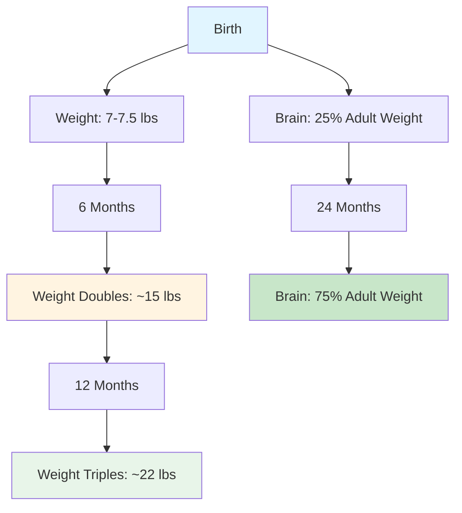
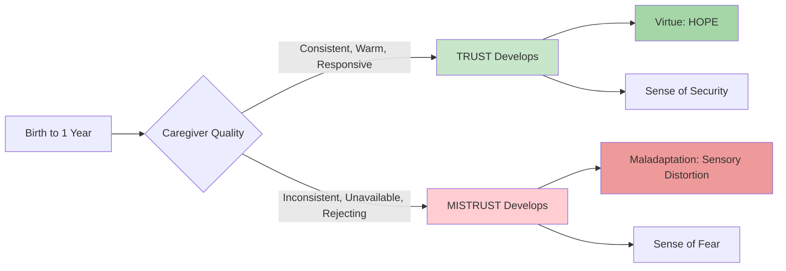

# Physical and Psychosocial Development in Infancy

## Overview

During infancy, **dramatic transformations** occur in both physical and psychosocial domains. Physically, the infant triples birth weight and develops from a reflexive organism to a mobile, exploring individual. Psychosocially, the infant forms foundational attachments and establishes basic expectations about the social world. This comprehensive examination explores these interconnected developmental processes.

---

## External Resources

### 📚 Essential Reading

- 📖 [Physical Development in Infancy - Wikipedia](https://en.wikipedia.org/wiki/Infant#Physical_characteristics) - Overview of infant physical growth patterns
- 📖 [Erik Erikson - Wikipedia](https://en.wikipedia.org/wiki/Erik_Erikson) - Biography and psychosocial theory overview  
- 🔬 [Infant Brain Development - Harvard Center on the Developing Child](https://developingchild.harvard.edu/science/key-concepts/brain-architecture/) - Neuroscience of early brain growth
- 🎓 [Attachment Theory - Simply Psychology](https://www.simplypsychology.org/attachment.html) - Comprehensive explanation of attachment research
- 📊 [Growth Charts - WHO](https://www.who.int/tools/child-growth-standards/standards/weight-for-age) - International standards for infant weight gain

### 🎥 Video Resources

- 🎬 [Erikson's Theory: Trust vs Mistrust - Sprouts](https://www.youtube.com/watch?v=EZBD-V_4cRg) (5 min) - Animated explanation of first psychosocial stage
- 🎬 [Attachment Theory - Crash Course Psychology #35](https://www.youtube.com/watch?v=fRMR0gdV51c) (11 min) - Bowlby and Ainsworth's research explained

### 📄 Recent Research

- 📑 Doyle, C., & Cicchetti, D. (2023). "Cascades of Development: Early Attachment Predicting Later Outcomes." *Development and Psychopathology*, 35(4), 1789-1805. - Longitudinal study on attachment impacts
- 📑 Jaekel, J., et al. (2024). "Physical Growth Trajectories in the First Two Years: Linking Nutrition to Neurodevelopment." *Pediatrics*, 153(1), e2023062100. - Contemporary research on growth-development connections

---

## Part I: Physical Development in Infancy

### 1. Physical Growth Patterns

#### 1.1 Rapid Growth in First Year

The PDF emphasizes that "the first year of infant is characterised by rapid physical growth," establishing it as the fastest growth period outside the prenatal period.

**Weight Gain Milestones**:

| Age | Weight Achievement | Significance |
|-----|-------------------|--------------|
| Birth | Baseline (avg 7-7.5 lbs) | Starting point |
| 6 months | **Doubles birth weight** | Critical milestone indicating adequate nutrition |
| 12 months | **Triples birth weight** | Completion of first year rapid growth phase |

**Additional Growth Indicators**:
- **Head and chest expansion**: Permits development of brain, heart, and lungs
- **Organ development**: Vital organs achieve functional maturity
- **Proportional changes**: Body proportions shift from newborn to infant configuration

:::info Clinical Significance
The doubling and tripling of birth weight are used as key indicators of nutritional adequacy and overall health during the first year. Failure to meet these milestones may signal feeding problems, illness, or failure to thrive.
:::

#### 1.2 Skeletal Development

**Bone Hardening Process**:
- **At birth**: Bones are relatively soft and pliable
- **During infancy**: Progressive hardening (ossification) occurs
- **Purpose**: Soft bones at birth facilitate passage through birth canal; hardening provides structural support as infant becomes mobile

**Fontanelles (Soft Spots on Skull)**:

The PDF describes two major fontanelles:

1. **Posterior fontanelle** (small one at back of head):
   - Closes at approximately **3 months**
   - Earlier closure than anterior

2. **Anterior fontanelle** (larger one in front):
   - Closes at varying ages up to **18 months**
   - Individual variation normal
   - Monitored as indicator of hydration and brain growth

**Clinical Monitoring**: Healthcare providers palpate fontanelles to assess:
- Hydration status (sunken = dehydrated)
- Intracranial pressure (bulging = elevated pressure)
- Growth and closure patterns

**Figure 1**: Rapid physical growth milestones during infancy showing weight tripling and brain reaching 75% adult weight.

#### 1.3 Brain Development

**Dramatic Growth**: According to the PDF, "brain weight also increases rapidly during infancy: by the end of the second year, the brain has already reached **75% of its adult weight**."

**Implications of Rapid Brain Growth**:

1. **Critical period for development**: Brain is highly plastic and responsive to experience

2. **Nutritional requirements**: Brain growth demands significant energy and nutrients

3. **Environmental sensitivity**: Experiences during this period have lasting neural impacts

4. **Foundation for later abilities**: Neural pathways established support future learning

**Synaptic Development**:
- Proliferation of neural connections
- Pruning of unused synapses
- Myelination of nerve fibers
- Specialization of brain regions

### 2. Environmental Influences on Growth

#### 2.1 Genetic vs. Environmental Factors

The PDF states: "Growth and size depend on environmental conditions as well as genetic endowment."

**Genetic Endowment**:
- Inherited growth potential
- Parental height and build
- Ethnic/racial characteristics
- Constitutional factors

**Environmental Conditions**:
- Nutrition quality and quantity
- Disease exposure and health status
- Caregiving quality
- Socioeconomic factors

#### 2.2 Nutritional Influences

**Critical Warning from PDF**: "Severe nutritional deficiency during the mother's pregnancy and in infancy are likely to result in an **irreversible impairment** of growth and intellectual development."

**Mechanisms of Nutritional Impact**:

1. **Prenatal nutrition** → Fetal brain development
2. **Postnatal nutrition** → Continued brain growth and body development
3. **Critical periods** → Windows of opportunity and vulnerability
4. **Irreversibility** → Some deficiency effects cannot be reversed later

**Optimal Nutrition**: The PDF notes that "human milk provides the basic nutritional elements necessary for growth," while also stating that "in Western cultures supplemental foods are generally added to the diet during the first year."

**Overfeeding Risk**: Conversely, the PDF warns that "overfed, fat infants are predisposed to become obese later in life," highlighting the importance of appropriate rather than excessive nutrition.

### 3. Sleep-Wake Patterns

#### 3.1 Newborn Sleep

**Initial Pattern**: "The newborn infant sleeps almost constantly, awakening only for feedings."

**Sleep Dominance**: Newborns typically sleep 16-17 hours per day, with brief waking periods primarily for feeding and elimination.

#### 3.2 Developmental Changes

**Progressive Organization**: "The number and length of waking periods gradually increases."

**Three-Month Milestone**: According to the PDF, "by the age of three months, most infants have acquired a fairly regular schedule for sleeping, feeding, and bowel movements."

**Significance of Regularity**:
- Predictability for caregivers
- Indication of neurological maturation
- Foundation for circadian rhythm development
- Reduction in parental stress

#### 3.3 End of First Year

**Sleep-Wake Balance**: "By the end of the first year, sleeping and waking hours are divided about equally."

**Typical Pattern at 12 Months**:
- ~12 hours sleep (including naps)
- ~12 hours awake
- Usually 1-2 naps during day
- Longer consolidated sleep at night

### 4. Maturation Processes

#### 4.1 Definition of Maturation

The PDF provides a detailed definition: **"Maturation refers to a universal sequence of biological events in the central nervous system that permits a psychological function to appear, assuming that the child is physically healthy and lives in an environment containing people and objects."**

**Key Concepts**:

1. **Universal sequence**: Same for all humans regardless of culture

2. **Biological basis**: Rooted in nervous system development

3. **Permissive function**: Maturation allows but does not cause development

4. **Environmental requirements**: Needs basic physical health and environmental stimulation

5. **Not sufficient alone**: Psychological functions require both maturation AND experience

#### 4.2 Maturation Cannot Cause Development

**Critical Understanding**: The PDF emphasizes that "maturation cannot cause a psychological function to occur; it only sets the limits on the earliest time of its appearance."

**Implication**: 
- **Readiness concept**: Child must be maturationally ready
- **Experience necessary**: But readiness alone insufficient
- **Individual variation**: Within maturational constraints, timing varies
- **No forcing**: Cannot accelerate beyond maturational readiness

**Example Applications**:
- **Walking**: Requires leg strength maturation + practice
- **Language**: Requires vocal apparatus maturation + language exposure
- **Toilet training**: Requires sphincter control maturation + training

#### 4.3 Puberty Example

The PDF uses puberty as an illustrative example: "Biological events in youth consider as maturation, when they grow between 12 to 15 years. It is an age of maturation and releases hormones from the pituitary gland located at the brain."

**Environmental Influences on Maturation**: "Environmental factors, such as the quality of nutrition during childhood, can accelerate the emergence of puberty by several years."

**Key Insight**: Even biologically-driven maturation processes are influenced by environmental conditions, demonstrating the constant interplay between nature and nurture.

---

## Part II: Psychosocial Development in Infancy

### 1. Defining Psychosocial Development

The PDF provides a clear definition: **"Psychosocial development is the development of a persons understanding of the environment they are living in, and figuring out how that relates to them, their behaviour, and others."**

**Simplified Version**: "It is learning about yourself, through your surroundings and other people."

**Core Components**:
1. Understanding the environment
2. Understanding oneself in relation to environment
3. Understanding behavior's meaning and impact
4. Understanding relationships with others

### 2. Erik Erikson's Psychosocial Theory

#### 2.1 Theoretical Background

The PDF presents **Erik Erikson** as the primary theorist for understanding psychosocial development in infancy, describing his theory as "perhaps one of the best ways to understand the psychosocial development in infancy period" and "one of the better theories of personality."

**Lifespan Perspective**: Erikson "describes the impact of social experience across the whole lifespan," providing a comprehensive framework extending beyond infancy.

**Erikson's Characterization**: He "characterised infancy as the period during which the child develops basic and long-lasting expectations about his world."

#### 2.2 Ego Identity - Central Concept

**Definition**: According to the PDF, **"ego identity refers to the conscious sense of self that we develop through social interaction."**

**Dynamic Nature**: "Our ego identity is constantly changing due to new experience and information we acquire in our daily interactions with others."

**Implications**:
- Identity not fixed but evolving
- Social interactions shape self-concept
- Experience continuously modifies identity
- Foundation established in infancy

#### 2.3 Competence and Motivation

The PDF describes an additional important aspect of Erikson's theory: "Erikson also believed that a sense of competence also motivates behaviours and actions. Each stage is concerned with becoming competent in an area of life."

**Successful Stage Mastery**:
- Person feels sense of mastery
- Erikson termed this **"ego strength"** or **"ego quality"**
- Competence motivates further development

**Failed Stage Mastery**:
- Person emerges with sense of inadequacy
- May struggle with related developmental tasks
- Potential for remediation in later stages

### 3. Developmental Crises

#### 3.1 Crisis as Turning Point

The PDF explains: "Erikson also believed in each stage, people experience a conflict that serves as a turning point in development. These conflicts are centered on either developing a psychological quality or failing to develop that quality."

**Crisis Characteristics**:
- **Turning point**: Critical juncture in development
- **High stakes**: "Potential for personal growth is high, but so is the potential for failure"
- **Dichotomous outcomes**: Quality develops or fails to develop
- **Lifelong impact**: Resolution affects subsequent stages

**Figure 2**: Erikson's Trust vs. Mistrust stage showing how caregiver quality determines developmental outcomes.

### 4. Stage 1 - Trust vs. Mistrust (Birth to 1 Year)

#### 4.1 Stage Overview

The PDF details: "The first stage of Erikson's theory of psychosocial development occurs between birth and one year of age and is the most fundamental stage in life."

**Why Most Fundamental**:
- Establishes basic orientation to world
- Creates template for relationships
- Forms foundation for all later stages
- Affects lifelong expectations

#### 4.2 Dependence and Trust Development

**Critical Factor**: "Because an infant is purely dependent on their family members, the development of trust is based on the dependability and quality of the child's caregivers."

**Successful Trust Development**:

According to the PDF: "If an infant successfully develops trust, he or she will feel safe and secure in the world."

**Components of Trust**:
- **Physical comfort**: Basic needs met reliably
- **Minimal fear**: Environment feels safe
- **Minimal apprehension**: Future seems predictable
- **Positive expectation**: World perceived as good place

**Foundational Nature**: "Trust in infancy sets the stage for a lifelong expectation that the world will be a good and pleasant place to live."

#### 4.3 Mistrust Development

**Failure Conditions**: "Caregivers who are inconsistent, emotionally unavailable, or rejecting contribute to feelings of mistrust in the children they care for."

**Consequences**: "Failure to develop trust will result in fear and a belief that the world is inconsistent and unpredictable."

**Specific Failures Leading to Mistrust**:
- **Inconsistency**: Unpredictable care
- **Emotional unavailability**: Caregiver physically present but emotionally absent
- **Rejection**: Active dismissal of infant needs
- **Unreliability**: Promises or patterns not followed through

#### 4.4 Achieving Balance

The PDF describes ideal development: "The infancy stage focuses on the infant's basic needs, being met by the parents. If the parents expose the child to warmth, regularly, and dependable affection, the infant's view of the world will be one of trust."

**Positive Elements**:
- **Warmth**: Emotional connection
- **Regularity**: Predictable patterns
- **Dependable affection**: Reliable emotional availability

**Negative Scenario**: "If the parents fail to provide a secure environment and fail to meet the child's basic need, a sense of mistrust will result."

#### 4.5 Virtue of Hope

**Successful Resolution**: "If proper balance is achieved, the child will develop the virtue **hope**, the strong beliefs that, even when things are not going well, they will work out well in the end."

**Hope Defined**:
- Belief in positive outcomes despite difficulties
- Resilience in face of challenges
- Optimism about future
- Foundation for perseverance

#### 4.6 Maladaptations

**Sensory Distortion**: "Failing this, maladaptive tendency or sensory distortion may develop."

**Withdrawal**: The PDF also mentions that "the malignant tendency of withdrawal will develop."

**Implications of Maladaptations**:
- Difficulty engaging with environment
- Perceptual distortions affecting reality testing
- Social withdrawal and isolation
- Foundation for potential psychopathology

---

## 5. Other Types of Social Behavior

Beyond Erikson's framework, the PDF describes several specific social behaviors developing during infancy:

### 5.1 Attachment

#### 5.1.1 Early Attachment Behaviors

The PDF beautifully describes the beginning: "A new born baby in arms is the greatest feeling of motherhood. An infant always seek love and attention from mother and he cries to be pick up, fed, and otherwise stimulated and often as not he cries when put down."

**Six-Week Milestone**: "At six weeks, infant will smile at his mother face and grasp his cloth. At this age infant can recognise their caretaker and his faces. He needs mother's and father's attention towards him."

#### 5.1.2 Indiscriminate Attachment

**Early Phase**: "This early attachment is called 'indiscriminate'; the infant seeks stimulation rather than any particular person."

**Characteristics**:
- Not specific to particular caregiver
- General need for human contact
- Responsive to anyone providing care
- Precursor to specific attachment

#### 5.1.3 Ainsworth's Research

The PDF references important research: **"The concept of attachment is investigated by Ainsworth and her associates (1978), was defined as an emotionally toned relationship or tie to the mother that led the infant to seek mother presence and comfort, particularly when the infant was frightened or uncertain."**

**Key Elements of Attachment**:
1. **Emotional tone**: Relationship has affective quality
2. **Selective**: Tie to specific person (usually mother)
3. **Comfort-seeking**: Infant seeks caregiver when distressed
4. **Security function**: Provides safe base for exploration

**Developmental Significance**: "This indicates that all healthy infants have healthy and strong attachment with their caretakers and this strong bonding provides the basis for healthy emotional and social development during later childhood."

### 5.2 Smiling

#### 5.2.1 Early Smiling

**Initial Phase**: The PDF notes that "an early smile of the infant is just a facial exercise of the muscles."

**First Social Smile**: "A child first pass his smile to his mother and this is at first bestowed indiscriminately between the mother and child."

#### 5.2.2 Development of Social Smile

**Emergence**: "The social smile appears at 7 or 8 weeks of age, and by 3 months infants will smile almost any face."

**Importance to Relationship**: "The smile is an important influence on mother-child relationship. The mother's responsive smile is equally important to the child. It transforms the spontaneous smile of the infant into an exchange."

**First Real Social Interaction**: "This may be called first real social interaction."

**Functional Significance**: "This smile is important to the caretakers and child because it invites adult to interact with the baby and therefore contributes to the attachment bonding."

### 5.3 Anxiety

#### 5.3.1 Separation Anxiety

**Developmental Context**: "As we all know that mother and child relation is important in infancy period. The child first recognised his mother face and infant is aware that mother is special person at this time; he is at once in a position to lose her."

**Manifestations**: The PDF provides a vivid description: "An infant around 10 months may be seen crawling behind his mother, from one room to another room. If mother is disappearing, he may be cry and scream, and watch every door."

**Attachment Indicator**: "Even his crying and searching at different places is an indication of attachment with the mother. The increase in attachment behaviour is considered to be an indication of separation anxiety."

**Developmental Timeline**: Typically emerges around 8-10 months, peaks around 12-18 months

### 5.4 Fear of Strangers

**Definition**: "A second anxiety that is a direct result of the infant's first attachment is stranger anxiety."

**Manifestation**: "The child is specially attach with the mother and he can be easily upset by the approach of an unfamiliar adult, especially if his mother is not present around."

**Typical Response**: "The infant fixes his eyes on the stranger and stares, unmoving, for a short time. He is likely to cry and show the signs of distress."

**Resolution**: "Stranger anxiety disappears toward the end of the first year, as the child comes in contact with a growing number of relatives."

**Developmental Function**:
- Protective mechanism
- Indicates discrimination ability
- Shows specific attachment formation
- Normal part of social-emotional development

---

## 💡 Memory Aids & Mnemonics

### Fontanelle Closure: **"Back Before Front"**
- **Posterior** (back): Closes at ~**3 months**
- **Anterior** (front): Closes at ~**18 months**

### Brain Growth: **"Three-Quarters by Two"**
- By age **2 years**, brain reaches **75%** of adult weight

### Trust Development: **"WWD = Trust"**
- **W**armth
- **W**aking predictability (regularity)
- **D**ependable affection

### Erikson's Stage 1 Components: **"CHEV"**
- **C**ompetence focus
- **H**ope (virtue developed)
- **E**go identity formation begins
- **V**ulnerability (high potential for growth OR failure)

### Attachment Indicators (10 months): **"SCS"**
- **S**eparation anxiety
- **C**rawling after caregiver
- **S**tranger anxiety

---

## 🌍 Real-World Applications

### Clinical Assessment
- **Growth Monitoring**: Regular weight checks ensure infants are doubling/tripling birth weight on schedule
- **Fontanelle Palpation**: Pediatricians assess hydration and brain development through soft spot examination
- **Attachment Screening**: Healthcare providers observe parent-infant interactions for signs of secure bonding
- **Developmental Surveillance**: Tracking physical milestones alongside emotional development

### Parenting Support
- **Responsive Caregiving**: Teaching parents that consistency builds trust (Erikson's framework guides intervention)
- **Nutrition Education**: Emphasizing adequate nutrition during rapid brain growth period
- **Attachment Promotion**: Encouraging skin-to-skin contact, responsive feeding, and emotional availability
- **Managing Separation Anxiety**: Helping parents understand crying when they leave is developmentally normal

### Policy and Programs
- **Paid Parental Leave**: Enables consistent caregiving during trust-building first year
- **WIC and Food Programs**: Ensure adequate nutrition for rapid physical and brain growth
- **Home Visiting**: Nurse visits support high-risk families in establishing secure attachments
- **Childcare Quality Standards**: Emphasize low ratios and consistent caregivers to support trust development

### Cultural Adaptations
- **Co-sleeping Practices**: Many cultures support attachment through nighttime proximity
- **Extended Family Care**: Multiple consistent caregivers can support trust development
- **Carrying Practices**: Constant physical contact in some cultures supports attachment formation
- **Feeding Practices**: Breastfeeding on demand supports both nutrition and emotional bonding

---

## Integration: Physical and Psychosocial Development

### Interconnections

While presented separately, physical and psychosocial development are deeply intertwined:

**Physical → Psychosocial**:
- Brain development enables emotional regulation
- Motor development allows social exploration
- Physical health affects social responsiveness

**Psychosocial → Physical**:
- Attachment security affects stress physiology
- Social interaction stimulates brain development
- Emotional states influence feeding and growth

### Comprehensive Development

Optimal infant development requires:
1. **Adequate physical care**: Nutrition, health, stimulation
2. **Responsive emotional care**: Consistent, warm, attuned
3. **Safe environment**: Physical and psychological security
4. **Social interaction**: Regular, positive engagement

---

## Summary

Physical and psychosocial development during infancy represent **dramatic, rapid, and foundational changes** establishing the basis for all future development. Physically, infants triple their birth weight, develop 75% of adult brain weight, and transition from reflexive to intentional movement. Psychosocially, infants form attachments, develop basic trust or mistrust, and begin constructing their sense of self through social interactions.

**Key Takeaways**:

1. **Rapid physical growth**: First year shows fastest postnatal growth, with brain reaching 75% adult weight by age 2

2. **Environmental sensitivity**: Growth depends on both genetic endowment and environmental conditions, especially nutrition

3. **Maturation as permissive**: Biological maturation allows but doesn't cause psychological functions

4. **Trust vs. mistrust**: Erikson's first stage establishes lifelong expectations about world's reliability

5. **Attachment foundation**: Specific attachments form basis for healthy emotional and social development

6. **Social behaviors emerge**: Smiling, separation anxiety, and stranger anxiety develop as part of normal psychosocial growth

7. **Interconnected domains**: Physical and psychosocial development continuously influence each other

Understanding these developmental processes enables caregivers, healthcare providers, and society to support optimal infant development through responsive care, adequate nutrition, and nurturing environments.

---

## Self-Assessment Questions

1. **Fill in the blanks**: 
   - Ego identity refers to the _____________ sense of self.
   - The Erikson's theory of psychosocial development occurs between birth to _____________ year of age.

2. **True/False**:
   - Cognition is involved in the acquisition, processing, organisation and use of knowledge. (______)
   - There are six components of language development in children that develop in infancy period. (______)

3. **Short Answer**: Explain why the PDF states that "maturation cannot cause a psychological function to occur" despite being necessary for development.

4. **Analysis Question**: The PDF describes the infant's smile as transforming into "first real social interaction" when the mother responds. Analyze the psychological significance of this reciprocal exchange for the developing infant.

5. **Application**: A 10-month-old infant crawls after her mother from room to room, crying when the mother is out of sight. Using concepts from both physical and psychosocial development, explain what capabilities must be present for this behavior to occur and what it indicates about the infant's development.

---

**Source PDFs**: 
- 📄 [Block-1/Unit-3.pdf - Pages 33-36](/pdfs/MPC-002%20Life%20Span%20Psychology/Block-1/Unit-3.pdf)
- 📚 MPC-002 Life Span Psychology
