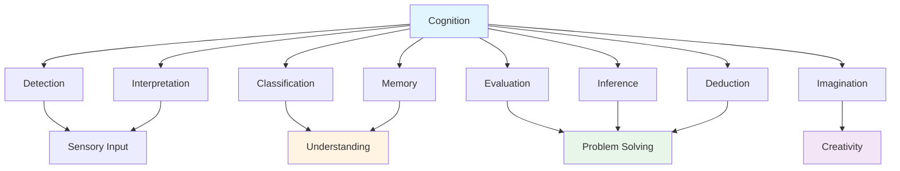
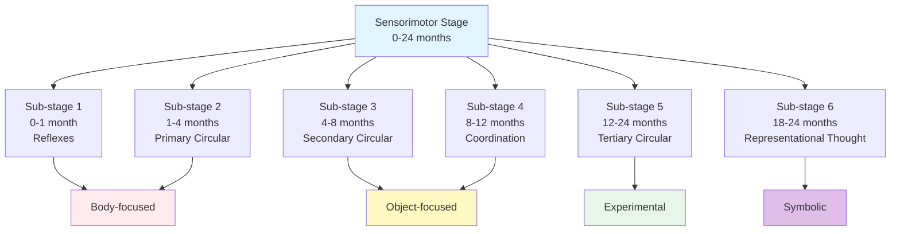
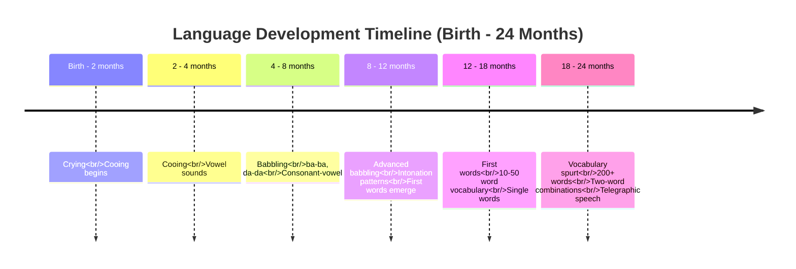

# Cognitive and Linguistic Development in Infancy

## Overview

During the first two years of life, infants undergo **remarkable cognitive and linguistic transformations**, evolving from reflexive organisms responding to immediate stimuli to intentional, symbolic thinkers capable of communication through language. This comprehensive exploration examines Jean Piaget's theory of cognitive development in the sensorimotor stage and traces the emergence of language from birth through early childhood.

---

## External Resources

### 📚 Essential Reading

- 📖 [Jean Piaget - Wikipedia](https://en.wikipedia.org/wiki/Jean_Piaget) - Biography and cognitive theory overview
- 📖 [Piaget's Theory of Cognitive Development - Wikipedia](https://en.wikipedia.org/wiki/Piaget%27s_theory_of_cognitive_development) - Detailed explanation of stages
- 📖 [Language Acquisition - Wikipedia](https://en.wikipedia.org/wiki/Language_acquisition) - Overview of how infants learn language
- 🔬 [Sensorimotor Stage - Simply Psychology](https://www.simplypsychology.org/sensorimotor.html) - Detailed breakdown of six sub-stages
- 🎓 [Language Development Milestones - ASHA](https://www.asha.org/public/speech/development/chart/) - Professional standards for speech development

### 🎥 Video Resources

- 🎬 [Piaget's Theory of Cognitive Development - Sprouts](https://www.youtube.com/watch?v=TRF27F2bn-A) (9 min) - Animated overview of all stages
- 🎬 [Language Development in Babies - Zero to Three](https://www.youtube.com/results?search_query=language+development+babies+0-3) (8 min) - Evidence-based language milestones

### 📄 Recent Research

- 📑 Kampis, D., et al. (2024). "Active Learning in Infancy: How Motor Development Shapes Cognitive Growth." *Psychological Science*, 35(1), 45-62. - Contemporary research on sensorimotor connections
- 📑 Perszyk, D. R., & Waxman, S. R. (2023). "The Power of Words in Infancy: How Language Shapes Infant Cognition and Object Categorization." *Trends in Cognitive Sciences*, 27(6), 523-537. - Recent findings on language-cognition links

---

## Part I: Cognitive Development in Infancy

### 1. Defining Cognition

#### 1.1 Comprehensive Definition

The PDF provides an extensive definition: **"Cognition is a broad and inclusive concept that refers to the mental activities involved in the acquisition, processing, organisation, and use of knowledge."**

**Major Cognitive Processes**:

The PDF enumerates key processes under cognition:
- **Detecting** information from environment
- **Interpreting** meanings and significance
- **Classifying** information into categories
- **Remembering** information for later use
- **Evaluating** ideas and possibilities
- **Inferring** principles from observations
- **Deducing** rules from patterns
- **Imagining** possibilities beyond present
- **Generating** strategies for problem-solving
- **Fantasizing and dreaming**

:::info Breadth of Cognition
This comprehensive list emphasizes that cognition encompasses far more than just "thinking"—it includes all mental processes involved in making sense of and interacting with the world.
:::

**Figure 1**: The broad scope of cognitive processes active during infant development.

#### 1.2 Infant Cognitive Capabilities

**Initial Competence**: The PDF emphasizes that "at the infancy period children develop many elements of abilities to think and to understand the world around them. Infants have remarkably competent organisms, even on the first day of life."

**Sensory Readiness**: "The newborn child is ready to the basic sensations of our species. They can see, hear, and smell, and they are sensitive to pain, touch, and changes in bodily position."

**Dual Development**: "Infants are not only growing physically during the first 2 years of life, but also they are growing cognitively (mentally). Every day they interact with different persons and learn about their environment and pathways between nerve cells both within their brains, and between their brains and bodies."

### 2. Understanding Cognitive Development

#### 2.1 Challenges in Assessment

The PDF acknowledges: "Cognitive change and development is a little harder to determine as clearly."

**Why Assessment Is Difficult**:
- Infants cannot verbalize thoughts
- Limited behavioral repertoire
- Rapid changes make measurement challenging
- Individual variation in developmental timing

**Research Approach**: "Therefore, much about what experts know about mental and cognitive development is based on the careful observation of developmental theories, such as Piaget's theory of cognitive development and Erikson's psychosocial stages."

### 3. Jean Piaget's Cognitive Theory

#### 3.1 Piaget's Historical Significance

The PDF states: **"Jean Piaget was the most influential developmental psychologist of the twentieth century."**

**Central Position**: "The work of cognition has held center stage in child development research since 1960."

**Nature of Theory**: "His theory of cognitive growth and change is original, comprehensive, integrative and elegant."

**Research Foundation**: "He recorded infant's and children's spontaneous activities, and presented problems of thousands of children and adolescents. His ideas have been the source of many research studies."

#### 3.2 Core Theoretical Assumptions

**Knowledge Purpose**: "In Piaget's theory, knowledge is assumed to have a specific goal or purpose to aid the person in adapting to the environment."

**Active Construction**: The PDF emphasizes several key principles:

1. **"The child does not receive information passively"** - Children actively construct understanding

2. **"Thoughts are not simply the product of teaching by others"** - Learning is not passive reception

3. **"Cognitive progress [is not] seen as primarily a product of maturation of a brain"** - Maturation alone insufficient

4. **"Knowledge is acquired and thought processes become more complex and efficient as a consequence of the maturing child's interactions with the world"** - Experience essential

5. **"The individual is active, curious and inventive throughout the life cycle"** - Innate drive to understand

#### 3.3 Nature of Cognitive Development Theory

The PDF provides context: "The theory of cognitive development is a comprehensive theory about the nature and development of human intelligence. It deals with the nature of knowledge itself and how humans come gradually to acquire it, construct it, and use it."

**Relationship to Language**: "Moreover, Piaget claims that cognitive development is at the centre of human organism and language is contingent on cognitive development."

**Implication**: Language depends on cognitive development, not vice versa—thinking precedes and enables language.

#### 3.4 Stage Theory Structure

The PDF states: "Piaget considered cognitive development in terms of stages."

**Four Stages**:
1. **Sensorimotor stage** (Birth - 2 years)
2. **Pre-operational stage** (2-7 years)
3. **Concrete operational stage** (7-11 years)
4. **Formal operational stage** (11-15 years)

**Focus**: Since infancy covers birth to 2 years, we focus on the **sensorimotor stage**.

### 4. Sensorimotor Stage (Birth - 2 Years)

#### 4.1 Stage Overview

The PDF describes: "The first stage is the sensory motor stage which lasts from birth to about two years old. The infant uses his or her senses and motor abilities to understand the world, beginning with reflexes and ending with complex combinations of sensory motor skills."

**Key Characteristics**:
- Understanding through **senses** (vision, hearing, touch, taste, smell)
- Understanding through **motor actions** (grasping, sucking, reaching, moving)
- Progression from **reflexes** to **complex coordinated actions**
- Foundation for symbolic thought

**Developmental Trajectory**: According to Piaget's theory referenced in the PDF, "infants interact with their environment entirely through reflexive behaviours. They do not think about what they are going to do, but rather follow their instincts and involuntary reactions to get what they need, such as food, air, and attention."

**Emergence of Intentionality**: "Piaget believed that as children begin to grow and learn about their environment through their senses, they begin to engage in intentional, goal-directed behaviours."

#### 4.2 Six Sub-Stages of Sensorimotor Development

The PDF states: "This stage can be divided into six separate sub-stages as given below."

##### Sub-Stage 1: Reflexes (Birth - 1 Month)

**Characteristics**: "The child understands the environment purely through inborn reflexes such as sucking and looking."

**Key Reflexes**:
- **Sucking reflex**: Survival mechanism for feeding
- **Rooting reflex**: Turning toward touch on cheek
- **Grasping reflex**: Clutching objects placed in palm
- **Looking/visual tracking**: Following moving objects

**Cognitive Significance**: These reflexes represent the infant's first "schemes" for interacting with the world—organized patterns of behavior that will be modified through experience.

##### Sub-Stage 2: Primary Circular Reactions (1-4 Months)

**Characteristics**: "Between one and four months, the child works on an action of his own which serves as a stimulus to which it responds with the same action, and around and around we go."

**"Circular" Explanation**: 
- Infant performs action (e.g., moving hand)
- Action creates interesting effect (e.g., sees hand move)
- Interesting effect stimulates repetition of action
- Action repeated "around and around"

**"Primary" Explanation**: Centers on infant's own body rather than external objects

**Examples**:
- Repeatedly bringing hand to mouth
- Repeatedly making sounds and listening
- Repeatedly kicking and watching legs move

**Cognitive Significance**: Infant begins coordinating sensory and motor systems, discovering cause-effect relationships with own body.

##### Sub-Stage 3: Secondary Circular Reactions (4-8 Months)

**Characteristics**: "The child becomes more focused on the world and begins to intentionally repeat an action in order to trigger a response in the environment."

**"Secondary" Explanation**: Now focuses on **effects on external objects** rather than just own body

**Examples**:
- Repeatedly shaking rattle to hear sound
- Repeatedly hitting mobile to see it move
- Repeatedly dropping objects to see them fall

**Cognitive Advance**: 
- **Intentionality emerges**: Actions are goal-directed
- **Object focus**: Attention extends to external world
- **Causality understanding**: Actions cause environmental effects

##### Sub-Stage 4: Coordination of Secondary Reactions (8-12 Months)

**Characteristics**: "Develop certain focuses on the demand object. Responses become more coordinated and complex."

**Key Developments**:
- **Means-end behavior**: Using one action to achieve another goal
- **Object permanence begins**: Understanding objects continue to exist when out of sight
- **Intentional problem-solving**: Overcoming obstacles to reach goals

**Examples**:
- Pushing aside barrier to reach desired toy
- Using one object as tool to reach another
- Crawling around furniture to get to caregiver

**Cognitive Significance**: Demonstrates true intentionality and planning—infant has goal in mind and figures out how to achieve it.

##### Sub-Stage 5: Tertiary Circular Reactions (12-24 Months)

**Characteristics**: "Children begin a period of trial-and-error experimentation during this sub-stage."

**"Tertiary" Explanation**: Not just repeating actions, but **varying actions** to see different results

**Examples**:
- Dropping objects from different heights to see what happens
- Banging different objects to compare sounds
- Using different strategies to open containers

**Cognitive Advance**:
- **Active experimentation**: Deliberately trying new approaches
- **Curiosity-driven exploration**: Experimenting to learn, not just to achieve goals
- **Flexibility**: Modifying actions based on outcomes

**"Little scientist"**: Piaget called children at this stage "little scientists" conducting experiments on the world.

**Figure 2**: Piaget's six sub-stages of the sensorimotor period showing progression from reflexes to symbolic thought.

##### Sub-Stage 6: Early Representational Thought (18-24 Months)

**Characteristics**: "Children begin to develop symbols to represent events or objects in the world in the final sensory motor sub-stage."

**Mental Representation**:
- Can think about objects not present
- Can recall past events
- Can anticipate future events
- Can engage in deferred imitation

**Examples**:
- Pretend play (using block as "phone")
- Searching systematically for hidden object
- Imitating behavior seen hours or days earlier
- Using words to refer to absent objects

**Cognitive Significance**: 
- **Transition to symbolic thought**: Foundation for language and imagination
- **Mental manipulation**: Can think about actions before performing them
- **Bridge to pre-operational stage**: Prepares for next developmental stage

---

## Part II: Linguistic Development in Infancy

### 1. Overview of Language Development

#### 1.1 Defining Language Development

The PDF states: "Language development is a process starting early in human life, when a person begins to acquire language by learning it as it is spoken and by mimicry."

**Developmental Pattern**: "Children's language development moves from simple to complex."

**Starting Point**: "Infants start without language."

#### 1.2 Remarkable Capacities

**Early Abilities**: "Yet by four months of age, babies can read lips and discriminate speech sounds."

**Rapid Acquisition**: "Language is acquired with amazing rapidity, particularly after children speak their first word, usually sometime around the end of the first year."

### 2. Prenatal Language Experience

**In Utero Learning**: The PDF notes that "the earliest learning begins in utero when the fetus can recognise the sounds and speech patterns of his mother's voice."

**Implications**:
- Language exposure begins before birth
- Newborns prefer mother's voice
- Prenatal experience shapes postnatal language perception
- Foundation for language learning established prenatally

### 3. Preverbal Communication

#### 3.1 Infant Communication Methods

**Non-linguistic Communication**: "Infants use their bodies, vocal cries and other preverbal vocalisations to communicate their wants, needs and dispositions."

**Communicative Functions Before Words**:
- Expressing needs (hunger, discomfort)
- Indicating emotions (pleasure, distress)
- Gaining attention
- Initiating interaction

#### 3.2 Caregiver Role

**Natural Learning**: "Even though most children begin to vocalise and eventually verbalize at various ages and at different rates, they learn their first language without conscious instruction from parents or caretakers."

**Implicit Teaching**: While not "consciously instructing," caregivers naturally:
- Speak "motherese" (infant-directed speech)
- Respond to infant vocalizations
- Provide language models
- Create communicative contexts

### 4. Language Development Timeline

The PDF provides specific developmental milestones:

#### 4.1 Babbling Stage (4-8 Months)

**Characteristics**: "The language that infants speak is called babbling."

**Types of Babbling**: "'baba', 'dada' and 'gaga'"

**Features**:
- Consonant-vowel combinations
- Repetitive syllables
- Universal across languages
- Practice for speech production

**Significance**:
- Exercises vocal apparatus
- Experiments with sounds
- Elicits caregiver responses
- Foundation for meaningful speech

#### 4.2 First Words (12 Months)

**Milestone**: "At the age of 12 months, the infant first utters the understandable words."

**Examples**: "mommy, dog, dirty and yes"

**Characteristics of First Words**:
- Usually nouns for familiar people, objects
- Often names for caregivers
- May include action words
- Typically words heard frequently

**Developmental Significance**: Marks transition from preverbal to verbal communication—ability to use symbols to represent concepts.

#### 4.3 Two-Word Combinations (18 Months)

**Milestone**: "During 18 months the language transforms into two word combination."

**Examples**: "mommy milk, my pencil and drink juice"

**Characteristics**:
- Telegraphic speech (omits articles, prepositions)
- Conveys relationships between concepts
- Shows understanding of basic grammar
- Combines words meaningfully

**Cognitive Connection**: Reflects cognitive ability to coordinate multiple concepts—requires mental representation and symbolic manipulation.

### 5. Components of Language Development

The PDF states: "There are four main components of language development in children. Each component has its own appropriate developmental periods."

#### 5.1 Phonology

**Definition**: "Phonology involves the rules about the structure and sequence of speech sounds."

##### Birth to 1 Year: Sound Production

**Cooing (2 Months)**: "At around two months, the baby will engage in cooing, which mostly consists of vowel sounds."

**Babbling (4 Months)**: "At around four months, cooing turns into babbling which is the repetitive combination of consonant and vowel."

**Comprehension First**: "Babies understand more than they are able to say."

##### 1-2 Years: Sound Recognition and Production

**Pronunciation Recognition**: "From 1–2 years, babies can recognise the correct pronunciation of familiar words."

**Simplification Strategies**: "Babies will also use phonological strategies to simplify word pronunciation."

**Examples of Simplification**:
1. **Reduplication**: "Repeating the first consonant-vowel in a multi syllable word ('TV'—> 'didi')"
2. **Deletion**: "Deleting unstressed syllables in a multi syllable word ('banana'—>'nana')"

**Developmental Purpose**: Allows production of words before full articulatory control achieved.

#### 5.2 Semantics

**Definition**: "Semantics consists of vocabulary and how concepts are expressed through words."

##### Birth to 1 Year: Comprehension Before Production

**Lag Between Understanding and Speaking**: "From birth to one year, comprehension (the language we understand) develops before production (the language we use). There is about a 5 month lag in between the two."

**Early Abilities**:
- **"Babies have an innate preference to listen to their mother's voice"**
- **"Babies can recognise familiar words"**
- **"Use preverbal gestures"**

##### 1-2 Years: Vocabulary Explosion

**Rapid Growth**: "From 1–2 years, vocabulary grows to several hundred words."

**Vocabulary Spurt**: "There is a vocabulary spurt between 18–24 months, which includes fast mapping."

**Fast Mapping**: "Fast mapping is the babies' ability to learn a lot of new things quickly."

**Word Types**: "The majority of the babies' new vocabulary consists of object words (nouns) and action words (verbs)."

##### 3-5 Years: Semantic Refinement

**Under-Extensions**: "Taking a general word and applying it specifically (for example, 'blankie')"

**Over-Extensions**: "Taking a specific word and applying it too generally (example, 'car' for 'van')"

**Word Coining**: "Children coin words to fill in for words not yet learned (for example, someone is a cooker rather than a chef because a child will not know what a chef is)."

**Metaphor Understanding**: "Children can also understand metaphors."

#### 5.3 Grammar

**Definition**: "Grammar involves two parts."

**Two Components**:
1. **Syntax**: "Refers to the rules in which words are arranged into sentences"
2. **Morphology**: "Refers to the use of grammatical markers (indicating tense, active or passive voice etc.)"

##### 1-2 Years: Telegraphic Speech

**Emergence**: "From 1–2 years, children start using telegraphic speech, which are two word combinations."

**Characteristics**:
- Essential words only (like telegram)
- Omits function words (articles, prepositions)
- Conveys meaning despite grammatical incompleteness
- Shows implicit understanding of word order

#### 5.4 Pragmatics

**Definition**: "Pragmatics involves the rules for appropriate and effective communication."

**Three Skills**:
1. **"Using language for greeting, demanding etc."**
2. **"Changing language for talking differently depending on who it is you are talking to"**
3. **"Following rules such as turn taking, staying on topic, etc."**

##### Birth to 1 Year: Preverbal Pragmatics

**Joint Attention**: "From birth to one year, babies can engage in joint attention (sharing the attention of something with someone else)."

**Turn-Taking**: "Babies also can engage in turn taking activities."

##### 1-2 Years: Conversational Skills

**Abilities**: "By 1–2 years, they can engage in conversational turn taking and topic maintenance."

**Developmental Significance**: Shows understanding that communication is interactive—involves both speaking and listening, giving and receiving.

**Figure 3**: Timeline of major linguistic milestones during the first two years of life.

### 6. Integration: Self-Awareness and Language

The PDF notes an important connection: "Speech, symbolism, imitation of family members or others and morality are the most distinctive characteristics of infants. After few months time the infant use their name and personal pronouns I, me, or my. It represents the self awareness and self consciousness."

**Language-Self Connection**:
- Using own name → self-concept
- Personal pronouns → self-other distinction
- Talking about self → self-awareness

---

## 💡 Memory Aids & Mnemonics

### Six Sensorimotor Sub-Stages: **"Really Primary, Secondary Circles Teach Representation"**
1. **R**eflexes (0-1 month)
2. **P**rimary Circular Reactions (1-4 months)  
3. **S**econdary Circular Reactions (4-8 months)
4. **C**oordination (8-12 months)
5. **T**ertiary Circular Reactions (12-24 months)
6. **R**epresentational Thought (18-24 months)

### Circular Reactions: **"Primary = Me, Secondary = Objects, Tertiary = Experiments"**
- **Primary**: Baby-focused (own body)
- **Secondary**: Object-focused (external world)
- **Tertiary**: Experiment-focused (trying variations)

### Language Components: **"PSGP" (Please Stop Generating Problems)**
- **P**honology (sound rules)
- **S**emantics (meaning)
- **G**rammar (syntax + morphology)
- **P**ragmatics (social use)

### Language Milestones: **"4-8-12-18-24"**
- **4 months**: Babbling begins
- **8 months**: Advanced babbling
- **12 months**: First words
- **18 months**: Vocabulary spurt
- **24 months**: Two-word combinations

### Comprehension vs Production: **"Understand Before Speak" (5-month lag)**
- Babies understand ~5 months before they can say same words

---

## 🌍 Real-World Applications

### Early Intervention
- **Developmental Screening**: Pediatricians use Piaget's milestones to identify cognitive delays
- **Object Permanence Assessment**: Failure to search for hidden objects at 12 months may indicate delay
- **Language Delay Detection**: Absence of babbling by 8 months or words by 18 months triggers evaluation
- **Targeted Support**: Early intervention services address specific sub-stage delays

### Parenting and Caregiving
- **Age-Appropriate Toys**: Understanding sub-stages guides toy selection (rattles for secondary circular, nesting cups for coordination)
- **Language Stimulation**: Knowing comprehension precedes production encourages continued talking even before baby responds
- **Realistic Expectations**: Parents understand why 6-month-old can't "learn" object permanence through teaching
- **Supporting Exploration**: Recognizing "little scientist" phase encourages safe exploration

### Educational Settings
- **Infant Curriculum Design**: Daycare activities match sensorimotor sub-stages (cause-effect toys for secondary circular reactions)
- **Caregiver Training**: Understanding that repetition is learning (circular reactions) not boredom
- **Language-Rich Environments**: Creating settings with abundant verbal interaction to support language acquisition
- **Individual Variation**: Recognizing normal range while monitoring for significant delays

### Clinical Applications
- **Autism Screening**: Absence of joint attention by 12 months is red flag
- **Hearing Assessment**: Lack of babbling by 6 months may indicate hearing loss
- **Cognitive Assessment**: Sensorimotor task performance helps evaluate infant intelligence
- **Speech Therapy**: Understanding normal sequence guides intervention for delays

---

## Connections Between Cognitive and Linguistic Development

### Piaget's Position

As noted in the PDF: "Piaget claims that cognitive development is at the centre of human organism and language is contingent on cognitive development."

**Implication**: Cognitive advances enable linguistic abilities:

1. **Object permanence** → Using words for absent objects
2. **Means-end behavior** → Requesting help verbally
3. **Symbolic representation** → Using words as symbols
4. **Categorization** → Organizing vocabulary into categories

### Mutual Facilitation

While Piaget emphasized cognition enabling language, modern research shows bidirectional influence:

**Cognition → Language**:
- Mental representations enable word meanings
- Problem-solving skills apply to language learning
- Memory supports vocabulary acquisition

**Language → Cognition**:
- Words provide labels for concepts
- Language enables thinking about abstract ideas
- Communication facilitates learning from others

---

## Summary

Cognitive and linguistic development during infancy represent **foundational transformations** in how infants understand and interact with their world. Cognitively, infants progress through Piaget's sensorimotor stage, moving from reflexive responses to intentional, symbolic thought across six sub-stages. Linguistically, infants advance from preverbal communication through babbling to first words and two-word combinations, mastering phonology, semantics, grammar, and pragmatics.

**Key Takeaways**:

1. **Cognitive breadth**: Cognition encompasses detecting, interpreting, classifying, remembering, evaluating, inferring, deducing, imagining, generating, fantasizing

2. **Active construction**: Children actively construct knowledge through interaction with environment, not passive reception

3. **Sensorimotor progression**: Six sub-stages trace development from reflexes to symbolic thought

4. **Early language exposure**: Language learning begins in utero with recognition of mother's voice

5. **Rapid language acquisition**: From no words at 12 months to two-word combinations at 18 months demonstrates remarkable speed

6. **Four language components**: Phonology, semantics, grammar, and pragmatics each follow developmental trajectories

7. **Cognition-language link**: Piaget emphasized cognitive development as foundation for language, though relationships are bidirectional

8. **Self-awareness emergence**: Use of personal pronouns represents developing self-consciousness

Understanding these cognitive and linguistic transformations enables caregivers and educators to support optimal development through appropriate stimulation, responsive interaction, and rich language environments.

---

## Self-Assessment Questions

1. **True/False**: 
   - Cognition is involved in the acquisition, processing, organisation and use of knowledge. (______)
   - The sensorimotor stage is divided into six sub-stages of development. (______)
   - There are six components of language development in children that develop in infancy period. (______)

2. **Fill in the Blanks**: The period of infancy is called the _____________ period of life.

3. **Short Answer**: Explain what Piaget meant by stating that "knowledge is assumed to have a specific goal or purpose to aid the person in adapting to the environment."

4. **Analysis Question**: The PDF describes babies as having "an innate preference to listen to their mother's voice." Explain how this preference might facilitate language development during infancy.

5. **Compare and Contrast**: Compare primary circular reactions (Sub-stage 2) with secondary circular reactions (Sub-stage 3) in Piaget's sensorimotor stage. What cognitive advance does the shift from primary to secondary represent?

6. **Application**: An 18-month-old child says "mommy milk" to request a drink. Analyze this utterance in terms of:
   - Which sensorimotor sub-stage this child has likely reached
   - Which language components (phonology, semantics, grammar, pragmatics) are demonstrated
   - What cognitive abilities must be present for this communication to occur

7. **Critical Thinking**: The PDF states that "language is contingent on cognitive development" according to Piaget. Provide two examples from the sensorimotor stage where specific cognitive advances enable particular language capabilities.

---

**Source PDFs**: 
- 📄 [Block-1/Unit-3.pdf - Pages 36-39](/pdfs/MPC-002%20Life%20Span%20Psychology/Block-1/Unit-3.pdf)
- 📚 MPC-002 Life Span Psychology
