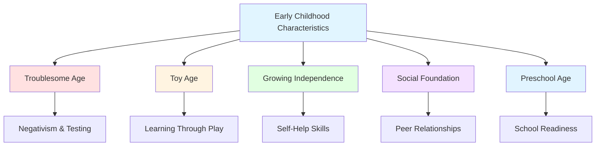

# Early Childhood: Concept, Characteristics, and Physical Development

## Introduction

Early childhood, spanning approximately ages 2 to 6 years, represents a bridge between the dependent infancy period and the more independent school years. Often called the "preschool years" or "play age," this period witnesses remarkable transformations in physical abilities, cognitive capacities, social relationships, and language skills. Children transition from toddlers who are just beginning to walk and talk to kindergarteners ready for formal schooling.

This developmental stage is characterized by increasing independence, emerging personality, expanding social worlds, and rapid learning. Understanding early childhood development helps parents, educators, and healthcare professionals support children's growth and identify when intervention may be beneficial. This unit explores the concept of early childhood, its distinctive characteristics, potential hazards, and the physical changes that occur during these formative years.

## Meaning and Definition of Early Childhood

### Defining Early Childhood

The term "early childhood" is defined somewhat differently across disciplines and contexts:

**Age Range Consensus**:
- **Typical definition**: Ages 2-6 years
- **UNESCO definition**: Birth to 8 years (broader definition emphasizing educational continuum)
- **Educational context**: Often focuses on ages 3-6 (preschool/kindergarten years)
- **Developmental psychology**: Usually 2-6 years, bridging toddlerhood and middle childhood

**Alternative Terms**:
- **Play age**: Emphasizes that play is the primary vehicle for learning
- **Preschool age**: Focuses on preparation for formal schooling
- **Prekindergarten years**: Highlights educational readiness
- **Toy age**: Recognizes the importance of toys and play materials

### Relationship to Other Developmental Periods

**Following Infancy**:
Early childhood begins when the infancy period concludes (approximately age 2), marking important transitions:
- From complete dependency to increasing independence
- From primarily nonverbal to verbal communication
- From sensorimotor to symbolic/representational thought
- From home-centered to increasingly social world

**Preceding Middle Childhood**:
Early childhood ends with entry into formal schooling (around age 6-7), when:
- Cognitive abilities enable academic learning
- Social skills support classroom participation
- Self-regulation permits structured activities
- Physical development enables sustained sitting and fine motor tasks

**Subdivision of Childhood**:
Child development is typically divided into:
1. **Early childhood**: Ages 2-6 years
2. **Middle childhood** (late childhood): Ages 6-12 years (until puberty)

This division reflects qualitative differences in cognitive abilities, social relationships, and educational contexts.

### Historical and Cultural Perspectives

**Historical Evolution**:
The concept of early childhood as a distinct developmental period has evolved:

**Pre-20th Century**:
- Children often viewed as miniature adults
- Little recognition of distinct developmental stages
- High childhood mortality rates
- Limited formal education before age 7-8

**Early 20th Century**:
- Emergence of developmental psychology
- Recognition of childhood as distinct from adulthood
- Froebel's kindergarten movement
- Montessori's educational philosophy

**Mid-20th Century to Present**:
- Scientific study of child development flourishes
- Early childhood education expands
- Recognition of early years' critical importance
- Investment in preschool programs (Head Start, etc.)

**Cultural Variations**:
Different cultures conceptualize early childhood differently:
- **Western industrialized cultures**: Often emphasize independence, verbal expression, individual achievement
- **Collectivist cultures**: May emphasize interdependence, respect, group harmony
- **Economic variations**: Access to early childhood education varies globally
- **Family structures**: Extended family involvement varies across cultures

### The Significance of Early Childhood

**Foundation Building Period**:
Early childhood establishes foundations for later development:

**Brain Development**:
- Rapid neural growth and pruning
- Language acquisition critical period
- Emotional regulation patterns forming
- Cognitive strategies developing

**Social-Emotional Development**:
- Attachment patterns influence relationships
- Emotional understanding expands
- Social skills emerge
- Self-concept develops

**Physical Development**:
- Motor skills enable exploration and learning
- Health habits establish
- Physical activity patterns form

**Learning Capacity**:
- Remarkable learning speed and flexibility
- Language acquisition facility
- Curiosity and motivation to learn naturally high
- Play as powerful learning mechanism

**Long-term Impact**:
Research consistently demonstrates that early childhood experiences have lasting effects:
- High-quality early education improves long-term outcomes
- Early adversity can have persistent effects (but not deterministically)
- Early intervention most effective for developmental concerns
- Foundation for lifelong learning established

## Characteristics of Early Childhood

Early childhood possesses distinctive characteristics that differentiate it from both infancy and later childhood periods.

### 1. The "Troublesome Age"

**Behavioral Challenges**:
Many parents find behavioral management during early childhood more challenging than the physical care demands of infancy. Common behaviors include:

**Negativism and Opposition**:
- Frequent use of "no"
- Resistance to parental requests
- Testing boundaries and limits
- Asserting independence (sometimes inappropriately)

**Stubbornness and Obstinacy**:
- Rigid insistence on own way
- Difficulty with transitions
- Strong reactions to not getting desires
- Limited flexibility

**Developmental Explanation**:
These behaviors, while challenging, reflect important developmental progress:
- Emerging autonomy and independence
- Growing sense of self as separate individual
- Testing cause-and-effect (What happens if I say no?)
- Limited emotional regulation abilities
- Egocentric thinking (difficulty seeing others' perspectives)

**Contemporary Understanding**:
Modern developmental science recognizes these behaviors as:
- Normal developmental phenomena
- Signs of healthy autonomy development
- Opportunities for learning self-regulation
- Requiring patient, consistent guidance rather than punishment

**Parenting Implications**:
Effective approaches include:
- Setting clear, consistent limits
- Offering appropriate choices
- Using positive guidance
- Understanding developmental limitations
- Maintaining patience and empathy

### 2. The Toy Age

**Centrality of Toys**:
Young children spend substantial time engaged with toys, making this period aptly named the "toy age."

**Functions of Toys**:

**Learning Tools**:
- Cognitive development: puzzles, shape sorters, building blocks
- Motor development: balls, tricycles, manipulative toys
- Social development: dolls, toy vehicles, play sets
- Language development: books, puppets, pretend play materials

**Imagination and Creativity**:
- Open-ended materials stimulate creativity
- Pretend play toys enable role-playing
- Art materials facilitate self-expression
- Building toys promote spatial reasoning

**Emotional Development**:
- Comfort objects provide security
- Aggressive play helps process emotions
- Nurturing play develops empathy
- Mastery experiences build confidence

**Social Skills**:
- Sharing toys teaches turn-taking
- Collaborative play develops cooperation
- Role-play facilitates perspective-taking
- Negotiations over toys build conflict resolution

**Educational Value**:
High-quality toys support learning:
- Age-appropriate complexity
- Open-ended possibilities
- Sensory stimulation
- Problem-solving opportunities

**Modern Considerations**:
- Screen time concerns: Balance between electronic and traditional toys
- Over-commercialization: Marketing directed at young children
- Safety standards: Importance of age-appropriate, safe toys
- Simplicity value: Sometimes simpler toys promote more creativity

### 3. Age of Increasing Independence

**Physical Independence**:
Young children become increasingly capable of self-care:

**Self-Help Skills** (Ages 2-6):
- Feeding: Using utensils, drinking from cups independently
- Dressing: Putting on simple clothing, managing fasteners gradually
- Toileting: Achieving bladder and bowel control
- Hygiene: Learning to wash hands, brush teeth (with supervision)
- Safety: Following basic safety rules (though supervision still essential)

**Mobility Independence**:
- Walking confidently, then running, jumping, climbing
- Exploring environment with less constant supervision
- Venturing further from caregivers
- Navigating familiar environments

**Psychological Independence**:
**Autonomy Development**:
- Making simple choices
- Expressing preferences
- Initiating activities
- Persisting at tasks

**Sense of Self**:
- Recognizing self as separate individual
- Beginning self-awareness
- Developing self-concept
- Understanding own capabilities

**School Readiness**:
By end of period, most children ready for:
- Separating from parents for school hours
- Following classroom routines
- Participating in group activities
- Focusing on structured tasks

**Balancing Independence and Dependence**:
Early childhood involves continuous negotiation between:
- Desire for independence vs. need for security
- Capable of much but still requires guidance
- Growing competence but limited judgment
- Increasing autonomy within safe boundaries

### 4. Foundation for Social Behavior

**Expanding Social World**:
Social experiences and relationships expand dramatically:

**From Family-Centered to Peer-Oriented**:
- **Infancy**: Primarily family relationships
- **Early childhood**: Peers become increasingly important
- **Play dates**, preschool, organized activities introduce social complexity

**Social Skills Development**:
**Ages 2-3 (Parallel Play)**:
- Playing alongside others
- Limited direct interaction
- Beginning awareness of peers
- Imitation of others

**Ages 3-4 (Associative Play)**:
- Playing with common materials
- Some interaction but not fully cooperative
- Beginning to share and take turns
- Conflicts over toys common

**Ages 4-6 (Cooperative Play)**:
- Playing together toward common goals
- Coordinating activities
- Assigned roles in dramatic play
- Developing friendships

**Prosocial Behaviors Emerge**:
- Helping: Assisting others when needed
- Sharing: Dividing resources with others
- Cooperating: Working together
- Comforting: Responding to others' distress
- Empathy: Understanding others' feelings (developing)

**Social Understanding**:
- Learning social norms and expectations
- Understanding taking turns
- Recognizing social cues (gradually)
- Beginning perspective-taking (though egocentrism persists)

**Importance for Later Development**:
Social skills learned during early childhood predict:
- School adjustment and academic success
- Peer relationships in middle childhood
- Social competence in adolescence
- Adult relationship quality

### 5. Preschool Age

**Increasing Educational Focus**:
Early childhood increasingly involves educational experiences:

**Preschool Attendance**:
- High percentage of children attend some form of preschool
- Ages 3-5 most common
- Varies by culture, socioeconomic status, and availability

**Educational Components**:
- Pre-literacy activities: Letter recognition, phonological awareness
- Pre-numeracy: Counting, one-to-one correspondence, shapes
- Social skills: Sharing, following directions, group participation
- Self-regulation: Sitting during circle time, waiting turns
- Motor skills: Using scissors, holding crayons/pencils

**Play-Based Learning**:
High-quality early childhood education emphasizes:
- Learning through play
- Child-initiated activities
- Hands-on experiences
- Social interaction
- Developmentally appropriate practice

**School Readiness**:
By end of early childhood, most children demonstrate:
- Attention span adequate for structured activities
- Ability to follow multi-step directions
- Basic self-care skills
- Social skills for classroom participation
- Emergent literacy and numeracy skills

## Hazards During Early Childhood

While early childhood is generally a healthy period, various hazards can affect development and well-being.

### Physical Hazards

#### 1. Illness and Infections

**High Susceptibility Period**:
Young children experience frequent illnesses due to:
- Immature immune systems
- Increased social exposure (daycare, preschool)
- Touching contaminated surfaces then face
- Close contact during play
- Limited hygiene practices

**Common Illnesses**:

**Respiratory Infections**:
- Most common childhood illness
- Average: 6-8 colds per year
- Otitis media (ear infections): Peak incidence ages 2-4
- Bronchitis, croup, pneumonia: Less common but concerning

**Gastrointestinal Illnesses**:
- Gastroenteritis (stomach flu)
- Food poisoning
- Parasitic infections (especially in group care settings)

**Childhood Diseases**:
With vaccination:
- Measles, mumps, rubella: Now rare
- Chickenpox: Declining with varicella vaccine
- Pertussis (whooping cough): Still concerns despite vaccination

**Impact of Illness**:
- **Physical**: Discomfort, energy depletion
- **Developmental**: Extended illness can delay skill acquisition
- **Social**: Missed play opportunities and social learning
- **Educational**: Missed preschool learning experiences

**Prevention**:
- Vaccination schedules
- Good hygiene practices (handwashing)
- Adequate nutrition and sleep
- Limiting exposure when sick
- Teaching covering coughs/sneezes

#### 2. Accidents and Injuries

**Leading Cause of Death**:
Accidents are the **leading cause of death** in early childhood, more than all diseases combined.

**Types of Accidents**:

**Falls**:
- Most common injury
- Playgrounds, stairs, furniture
- Usually minor but can be serious

**Burns**:
- Hot liquids (most common)
- Stoves, ovens, space heaters
- Sunburns

**Poisoning**:
- Medications (especially if look like candy)
- Cleaning products
- Plants, berries

**Drowning**:
- Swimming pools
- Bathtubs
- Natural bodies of water
- Second leading cause of accidental death ages 1-4

**Motor Vehicle Accidents**:
- As passengers: Importance of proper car seats
- As pedestrians: Impulsive behavior, limited safety awareness

**Choking**:
- Small toys, food items
- Importance of age-appropriate toys
- Supervising eating

**Gender Differences**:
- **Boys** have higher accident rates than girls
- Possibly due to:
  - More active, risk-taking behavior
  - Less impulse control
  - Greater physical activity levels
  - Socialization differences

**Prevention**:
- **Supervision**: Age-appropriate oversight
- **Childproofing**: Home safety measures
- **Education**: Teaching safety rules
- **Equipment**: Proper car seats, helmets, outlet covers
- **Environmental design**: Playground surfacing, pool fencing

#### 3. Obesity

**Increasing Concern**:
Childhood obesity has become a significant public health issue in recent decades.

**Prevalence**:
- Varies by country and population
- Increasing in both developed and developing nations
- Trends beginning in early childhood

**Risk Factors**:

**Biological**:
- **Genetic predisposition**: Endomorphic body build
- **Metabolic factors**: Some children have slower metabolism
- **Prenatal factors**: Maternal obesity, gestational diabetes

**Behavioral**:
- **Dietary patterns**: High-calorie, low-nutrient foods
- **Portion sizes**: Increasingly large servings
- **Eating habits**: Eating while distracted (TV), emotional eating
- **Physical activity**: Insufficient active play
- **Screen time**: Excessive sedentary behavior

**Environmental**:
- **Food availability**: Access to junk food vs. healthy options
- **Marketing**: Advertising directed at children
- **Built environment**: Limited safe play spaces
- **Cultural factors**: Family eating patterns and beliefs

**Health Consequences**:

**Immediate**:
- Physical discomfort
- Reduced physical capacity
- Social stigma and teasing
- Lower self-esteem

**Long-term**:
- Type 2 diabetes risk (increasing in children)
- Cardiovascular disease risk factors
- Orthopedic problems
- Adult obesity (childhood obesity tracks into adulthood)
- Psychosocial difficulties

**Prevention and Intervention**:
- **Healthy eating patterns**: Balanced, varied diet
- **Portion control**: Age-appropriate serving sizes
- **Physical activity**: Daily active play
- **Limited screen time**: AAP recommends <1-2 hours daily
- **Family involvement**: Modeling healthy behaviors
- **Early intervention**: Addressing concerns promptly
- **Positive approach**: Focus on health, not weight

### Psychological Hazards

#### 1. Speech and Communication Difficulties

**Impact on Development**:
Clear communication is essential for social belonging, emotional expression, and learning. Speech difficulties can significantly impact psychological well-being.

**Common Speech Issues** (Ages 2-6):

**Articulation Problems**:
- Difficulty producing specific sounds correctly
- "Wabbit" for "rabbit" beyond typical age
- May be developmentally normal or indicate disorders

**Fluency Problems**:
- **Stuttering**: Repetitions, prolongations of sounds
- Often begins ages 2-5
- More boys than girls affected
- Usually temporary but can persist

**Language Delays**:
- Limited vocabulary for age
- Difficulty forming sentences
- Comprehension difficulties

**Psychological Consequences**:
- **Social difficulties**: Peers may not understand, leading to exclusion
- **Frustration**: Inability to express needs/wants
- **Behavioral problems**: Acting out when can't communicate
- **Self-esteem**: Feeling inadequate or "different"
- **Academic concerns**: Language foundation for literacy

**Supportive Response**:
- **Professional evaluation**: Speech-language pathologist
- **Early intervention**: Most effective when started early
- **Patient listening**: Allowing time to communicate
- **Positive environment**: Not correcting constantly
- **Encouragement**: Praising communication attempts

#### 2. Social Hazards

**Social Difficulties**:
Early childhood is when children begin forming peer relationships, making social acceptance increasingly important.

**Sources of Social Problems**:

**Communication Difficulties**:
- Children with speech problems may be excluded
- Unable to participate fully in social exchanges

**Behavioral Issues**:
- Aggression, inability to share
- Can lead to peer rejection
- Limits opportunities to learn social skills

**Geographical Isolation**:
- Rural areas with few nearby children
- Limited peer interaction opportunities

**Discrimination and Prejudice**:
Young children beginning to notice and sometimes internalize:
- **Racial/ethnic differences**: May experience or express bias
- **Gender stereotypes**: Rigid gender norms enforced by peers
- **Socioeconomic status**: Awareness of material differences
- **Ability differences**: Children with disabilities may face exclusion

**Consequences**:
- **Loneliness**: Lacking peer relationships
- **Skill deficits**: Missing social learning opportunities
- **Negative self-concept**: Internalizing rejection
- **Biased attitudes**: Developing prejudiced views
- **Behavioral problems**: Acting out due to social difficulties

**Building Positive Social Environments**:
- **Inclusive practices**: Welcoming all children
- **Teaching social skills**: Direct instruction and coaching
- **Adult modeling**: Demonstrating respect and inclusion
- **Addressing bias**: Not ignoring discrimination
- **Creating opportunities**: Facilitating positive interactions

#### 3. Play Hazards

**Importance of Play**:
Play is the primary vehicle for learning and development in early childhood. Limitations in play opportunities constitute genuine hazards.

**Play Deprivation**:

**Geographical Isolation**:
- Living in areas with few children nearby
- Limited access to playgrounds or play spaces
- May result in solitary play only

**Social Rejection**:
- Excluded from peer play
- Forced into solitary activities
- Missing social learning

**Consequences of Limited Play**:
- **Motor skill delays**: Missing practice opportunities
- **Social skill deficits**: Not learning cooperation, negotiation
- **Cognitive impacts**: Play supports problem-solving, creativity
- **Emotional effects**: Feelings of rejection, loneliness
- **Self-concept**: Perceiving self as inadequate or different

**Over-Structured Schedules**:
Modern concern:
- Too many organized activities
- Insufficient free play time
- Adult-directed vs. child-initiated play
- May reduce creativity, self-direction

**Supporting Healthy Play**:
- **Ensure time**: Protect free play time
- **Provide space**: Safe areas for active play
- **Offer materials**: Age-appropriate, open-ended toys
- **Facilitate social play**: Help children connect
- **Balance**: Mix of free and structured activities

#### 4. Moral Hazards

**Moral Development Context**:
Early childhood is when children begin learning society's expectations and developing moral understanding (rudimentary).

**Inconsistent Discipline**:
**Problem**: When different caregivers have different rules or responses:
- Parents disagree on discipline
- Grandparents enforce different rules
- Preschool vs. home expectations differ

**Effects**:
- **Confusion**: Uncertainty about expectations
- **Anxiety**: Not knowing what will happen
- **Slowed learning**: Inconsistency impedes learning
- **Manipulation**: Learning to play adults against each other
- **Testing**: Increased boundary-pushing

**Overly Harsh or Permissive Discipline**:
Both extremes problematic:
- **Harsh**: Fear-based compliance, modeling aggression
- **Permissive**: Difficulty learning self-control

**Supporting Moral Development**:
- **Consistency**: Agreement among caregivers when possible
- **Clear expectations**: Age-appropriate rules
- **Explanations**: Why rules exist (simple reasoning)
- **Positive guidance**: Teaching rather than only punishing
- **Modeling**: Adults demonstrating desired behavior

## Physical Development in Early Childhood

### Growth Patterns

**Slowing Growth Rate**:
After infancy's rapid growth, early childhood shows more moderate, steady increases.

**Height**:
- **Average gain**: 2.5-3 inches per year
- **By age 6**: Approximately 42-46 inches tall
- **Individual variation**: Genetics play major role

**Weight**:
- **Average gain**: 5-7 pounds per year (some sources say 3-5)
- **By age 6**: 
  - Girls: Average 48.5 pounds
  - Boys: Average 49 pounds (slightly heavier)
- Six times birth weight by age 6

**Body Composition Changes**:
- **Body fat decreases**: "Baby fat" gradually lost
- **Muscle increases**: Especially in boys
- **Center of gravity lowers**: Better balance results

### Body Build Types

Individual differences in body type become apparent:

**Endomorphic**: Soft, rounded, more body fat
**Mesomorphic**: Muscular, athletic, sturdy build
**Ectomorphic**: Thin, lean, less fat and muscle

**Gender Differences**:
- Boys: More muscle mass
- Girls: Slightly more body fat
- Differences subtle in early childhood, more pronounced later

### Motor Development

**Gross Motor Skills** (Large muscle movements):

**Ages 2-3**:
- Runs, though sometimes falls
- Jumps with both feet
- Throws ball overhand
- Kicks ball forward
- Rides tricycle

**Ages 3-4**:
- Hops on one foot
- Catches large ball
- Runs smoothly, turns corners
- Climbs well
- Pedals tricycle skillfully

**Ages 4-5**:
- Skips, gallops
- Catches bounced ball
- Hops 2-3 yards on one foot
- Climbs ladders
- Beginning somersaults

**Ages 5-6**:
- Skips smoothly
- Rides bicycle (with/without training wheels)
- Jumps rope
- Complex climbing abilities
- Ball skills improving

**Fine Motor Skills** (Small muscle movements):

**Ages 2-3**:
- Strings large beads
- Turns pages one at a time
- Copies circle
- Snips with scissors

**Ages 3-4**:
- Draws person with 2-4 parts
- Uses scissors along line
- Copies square
- Buttons and unbuttons

**Ages 4-5**:
- Draws person with 6 parts
- Prints some letters
- Copies triangle
- Cuts along line

**Ages 5-6**:
- Draws detailed pictures
- Prints first name
- Copies more complex shapes
- Ties shoes (by end of period)
- Uses knife to cut soft foods

### Brain and Nervous System Development

**Continued Growth**:
Brain reaches approximately **90% of adult weight by age 6**.

**Neural Development**:
- Myelination continues (speeds neural transmission)
- Synaptic pruning (refining connections)
- Hemispheric specialization increasing

**Functional Improvements**:
- Better motor coordination
- Increased attention span
- Improved memory capacity
- Enhanced self-regulation

### Physical Health Needs

**Nutrition**:
- **Caloric needs**: Approximately 1,700 calories per day
- **Balanced diet**: Variety of foods important
- **Regular meals**: Breakfast especially important
- **Healthy snacks**: Supporting growth and energy

**Sleep**:
- **Ages 2-3**: 11-14 hours (including nap)
- **Ages 3-5**: 10-13 hours (nap gradually phased out)
- **Ages 5-6**: 10-12 hours
- Adequate sleep essential for growth, learning, emotional regulation

**Physical Activity**:
- AAP recommends at least 60 minutes daily
- Mix of structured and free play
- Both indoor and outdoor activities
- Variety of movement experiences

**Teeth**:
- **Baby teeth**: Completing eruption (by age 3)
- **Dental care**: Establishing brushing habits
- **Permanent teeth**: Beginning to emerge (around age 6)
- First dental visit recommended by age 1, regular check-ups thereafter

## Self-Assessment Questions

### Multiple Choice

1. Early childhood is typically defined as ages:
   a) 1-4 years
   b) 2-6 years
   c) 3-7 years
   d) 2-8 years

2. The average height gain per year during early childhood is approximately:
   a) 1-2 inches
   b) 2.5-3 inches
   c) 4-5 inches
   d) 6 inches

3. By age 6, a child typically weighs approximately how many times their birth weight?
   a) Three times
   b) Four times
   c) Six times
   d) Eight times

4. The leading cause of death in early childhood is:
   a) Cancer
   b) Infectious diseases
   c) Accidents
   d) Congenital abnormalities

5. Which gender tends to have more accidents during early childhood?
   a) Girls
   b) Boys
   c) No difference
   d) Varies by age

6. Early childhood is sometimes called the "toy age" because:
   a) Children are obsessed with toys
   b) Toys are the primary vehicle for learning
   c) Parents buy excessive toys
   d) Toy companies target this age

7. Which body build is characterized as soft and rounded with more body fat?
   a) Mesomorphic
   b) Ectomorphic
   c) Endomorphic
   d) Athletic

8. By age 6, the brain has reached approximately what percentage of adult weight?
   a) 60%
   b) 75%
   c) 90%
   d) 95%

9. Inconsistent discipline is considered a:
   a) Physical hazard
   b) Moral hazard
   c) Social hazard
   d) Play hazard

10. Which of the following is a characteristic of early childhood?
    a) Most rapid growth period
    b) Decreasing independence
    c) Foundation for social behavior
    d) Minimal play activity

### Short Answer Questions

1. Explain why early childhood is sometimes called the "troublesome age" and whether these behaviors are problematic.

2. Describe the progression of social play from ages 2-6.

3. Why are accidents the leading cause of death in early childhood, and what can be done to prevent them?

4. Explain how speech difficulties can become psychological hazards for young children.

5. Describe the changes in body composition that occur during early childhood.

---

**Source PDFs**: 
- 📄 [Block-1/Unit-4.pdf - Pages 41-47](/pdfs/MPC-002%20Life%20Span%20Psychology/Block-1/Unit-4.pdf)
- 📚 MPC-002 Life Span Psychology

## Answers to Self-Assessment Questions

### Multiple Choice
1. b) 2-6 years
2. b) 2.5-3 inches
3. c) Six times
4. c) Accidents
5. b) Boys
6. b) Toys are the primary vehicle for learning
7. c) Endomorphic
8. c) 90%
9. b) Moral hazard
10. c) Foundation for social behavior

## Educational Videos

**Early Childhood Development Overview**:
<iframe width="560" height="315" src="https://www.youtube.com/embed/bK_lYQWKb9Q" title="Early Childhood Development" frameborder="0" allow="accelerometer; autoplay; clipboard-write; encrypted-media; gyroscope; picture-in-picture" allowfullscreen></iframe>

## Memory Aids

### **Early Childhood Age: "2-6 Play Days"**
Ages **2-6** years, emphasizing **play** as central activity

### **Characteristics Mnemonic: "TIPS"**
- **T**roublesome (negativism)
- **I**ndependence growing
- **P**lay and toys central
- **S**ocial foundation building

### **Physical Hazards: "I-A-O"**
- **I**llness
- **A**ccidents
- **O**besity

### **Body Build Types: "EME"**
- **E**ndomorphic (soft, rounded)
- **M**esomorphic (muscular, athletic)
- **E**ctomorphic (thin, lean)

## Further Resources

### Wikipedia Articles
- [Early Childhood](https://en.wikipedia.org/wiki/Early_childhood)
- [Early Childhood Education](https://en.wikipedia.org/wiki/Early_childhood_education)
- [Child Development](https://en.wikipedia.org/wiki/Child_development)
- [Childhood Obesity](https://en.wikipedia.org/wiki/Childhood_obesity)

### External Resources
- [CDC - Early Childhood](https://www.cdc.gov/ncbddd/childdevelopment/positiveparenting/preschoolers.html)
- [Zero to Three - Ages 3-5](https://www.zerotothree.org/resources/series/your-child-s-development-age-based-tips-from-birth-to-36-months)
- [AAP - Preschooler Development](https://www.healthychildren.org/English/ages-stages/preschool/Pages/default.aspx)

---

*Last Updated: January 28, 2025*
