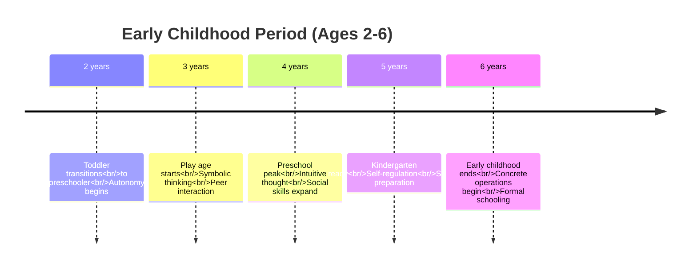
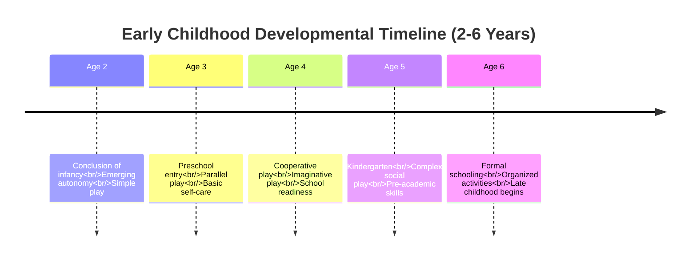
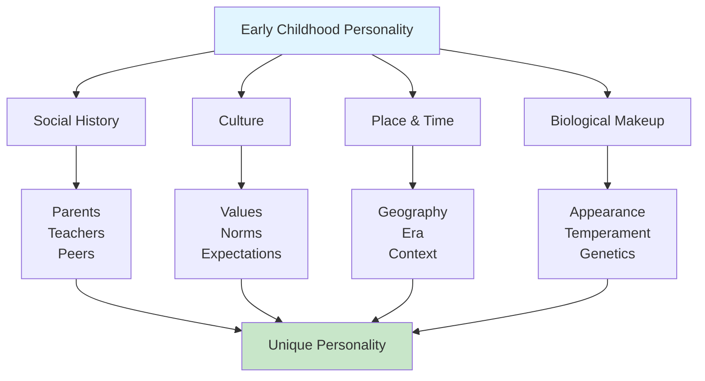
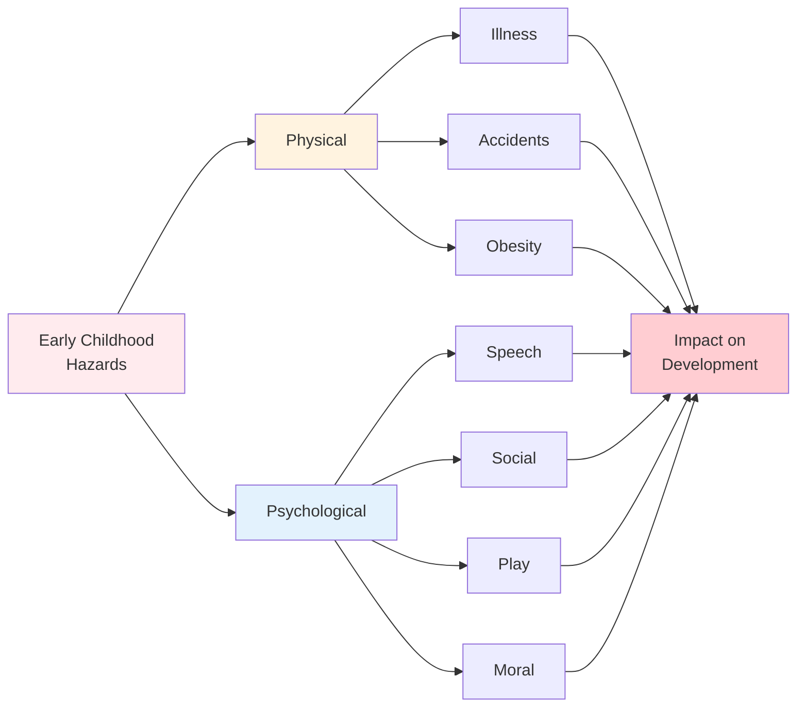

# Concept, Characteristics, and Hazards of Early Childhood

## Overview

Early childhood, spanning approximately **2 to 6 years of age**, represents a critical period of development often called the **"play age"** or **"preschool years."** This stage marks the conclusion of infancy and the emergence of a distinct personality, as children transition from complete dependence to increasing autonomy, self-sufficiency, and social participation.

---

## External Resources

### 📚 Essential Reading

- 📖 [Early Childhood Development - Wikipedia](https://en.wikipedia.org/wiki/Early_childhood) - Comprehensive overview of early childhood period
- 📖 [Preschool - Wikipedia](https://en.wikipedia.org/wiki/Preschool) - Educational aspects of early childhood
- 📖 [Child Development Stages - Wikipedia](https://en.wikipedia.org/wiki/Child_development_stages) - Developmental milestones and characteristics
- 🔬 [Early Childhood Development - WHO](https://www.who.int/health-topics/early-childhood-development) - Global health perspective
- 🎓 [Early Childhood Development - CDC](https://www.cdc.gov/ncbddd/childdevelopment/early-childhood/index.html) - Evidence-based milestones
- 📊 [Early Learning Standards - NAEYC](https://www.naeyc.org/resources/topics/early-learning-standards) - Educational guidelines

### 🎥 Video Resources

- 🎬 [Early Childhood Development Explained - Zero to Three](https://www.youtube.com/results?search_query=early+childhood+development+zero+to+three) (12 min) - Comprehensive overview
- 🎬 [The Importance of Play in Early Childhood - PBS](https://www.youtube.com/results?search_query=importance+of+play+early+childhood+pbs) (10 min) - Play as learning

### 📄 Recent Research

- 📑 Moreno, A. J., et al. (2023). "Early Childhood Personality Development: Stability and Change." *Developmental Psychology*, 59(8), 1456-1470. - Contemporary research on personality formation
- 📑 Johnson, S. P., & Hannon, E. E. (2024). "Hazards in Early Childhood: Prevention and Intervention." *Child Development Perspectives*, 18(1), 23-38. - Recent findings on childhood hazards

---

## External Resources

### 📚 Essential Reading

- 📖 [Early Childhood Development - Wikipedia](https://en.wikipedia.org/wiki/Early_childhood) - Comprehensive overview of early childhood period
- 📖 [Child Development Stages - Wikipedia](https://en.wikipedia.org/wiki/Child_development_stages) - Developmental milestones and characteristics
- 🔬 [Early Childhood Development - WHO](https://www.who.int/health-topics/early-childhood-development) - Global health perspective
- 🎓 [Preschool Development - CDC](https://www.cdc.gov/ncbddd/childdevelopment/positiveparenting/preschoolers.html) - Evidence-based parenting guidance
- 📊 [Early Years Foundation - Harvard Center](https://developingchild.harvard.edu/science/key-concepts/brain-architecture/) - Neuroscience of early development

### 🎥 Video Resources

- 🎬 [Early Childhood Development Stages - Zero to Three](https://www.youtube.com/results?search_query=early+childhood+development+2-6+years) (12 min) - Comprehensive overview
- 🎬 [Preschool Development Milestones - Child Development Institute](https://www.youtube.com/results?search_query=preschool+development+milestones) (10 min) - Age-specific milestones

### 📄 Recent Research

- 📑 Bauer, P. J., & Larkina, M. (2023). "The Development of Memory in Early Childhood." *Annual Review of Developmental Psychology*, 5, 23-48. - Recent findings on cognitive growth
- 📑 Zosh, J. M., et al. (2024). "Learning Through Play: A Review of Evidence for the Power of Play." *Psychological Bulletin*, 150(1), 1-32. - Contemporary research on play-based learning

---

## 1. Meaning of Early Childhood

### 1.1 Defining Early Childhood

**Simple Definition**: The PDF states that "early childhood age often focuses on children learning through play. It generally includes toddlerhood and sometime afterwards. Sometimes it is called a play age."

**UNESCO Definition**: "The period from birth to 8 years of age. A time of remarkable brain development, these years lay the foundation for subsequent learning."

**Age Range Variations**:
- **Narrow definition**: 2-6 years (preschool focus)
- **Broad definition**: Birth to 8 years (including infancy)
- **Educational focus**: 3-6 years (kindergarten age)



**Figure 1**: Timeline showing key transitions and developmental focuses across the early childhood period.

### 1.2 Related Terminology

**Educational Terms**:
- **"Preschool age"**: Emphasizes education around ages 3-6
- **"Kindergarten age"**: Formal educational preparation
- **"Early childhood learning"**: Comprehensive educational approach
- **"Early care" and "early education"**: Focus on developmental support

**Care Terms**:
- **"Day care"** and **"childcare"**: Do not fully embrace educational aspects
- **Modern evolution**: Many childcare centers now creating curricula and educational approaches

**"Play Age"**: Emphasizes the central role of play in learning and development during this period.



**Figure 1**: Developmental progression through early childhood showing key transitions and capabilities.

### 1.3 Relationship to Infancy

According to the PDF: "Childhood begins when the infancy period is over approximately two years of the age group. Childhood period is divided into two age group (i) early childhood, 2-6 years (ii) late childhood, 6- to the time the child becomes sexually mature."

**Early childhood as conclusion**: "Early childhood period is called as a conclusion of the infancy period."

**Key Distinction**: While infants are completely dependent, early childhood children develop independence, self-sufficiency, and distinct personalities.

---

## 2. Characteristics of Early Childhood

### 2.1 Personality Emergence

The PDF beautifully describes: "The child enters in the preschool and forms a personality that no–one adults or other children. His personality is absolutely individual. We generally consider as a 'little individual' or 'small figure' of the family."

**"Little Individual"**: Recognition that child has developed unique identity distinct from both parents and siblings.



**Figure 2**: Four factors converging to shape unique personality during early childhood.

### 2.2 Behavioral Challenges

**Parental Perspective**: "Some parents feel that behavioural problems of childhood period are more troublesome then physical care of infants."

**Common Behavioral Issues**:
- **Obstinacy**: Stubborn resistance to direction
- **Stubbornness**: Persistent determination
- **Disobedience**: Active resistance to rules
- **Negativism**: Oppositional responses
- **Antagonism**: Hostile or contrary behavior

**Developmental Context**: These behaviors reflect emerging autonomy and self-assertion, though challenging for caregivers.

```mermaid
graph TD
    A[Early Childhood<br/>Characteristics] --> B[Personality<br/>"Little Individual"]
    A --> C[Behavioral Challenges<br/>Autonomy-seeking]
    A --> D[Play Central<br/>"Toy Age"]
    A --> E[Independence<br/>Self-sufficiency]
    A --> F[Social Foundation<br/>School readiness]
    B --> G[Individual Identity]
    C --> G
    D --> H[Learning Mode]
    E --> H
    F --> I[Future Success]
    style A fill:#e1f5ff
    style G fill:#c8e6c9
    style H fill:#fff9c4
    style I fill:#f3e5f5
```

**Figure 2**: Key characteristics of early childhood showing their developmental significance.

### 2.3 Play as Central Activity

**"Toy Age"**: The PDF states "It is a toy age because most of the time children are engaged with their toys."

**Educational Function**: "These toys are also helpful to educate the children. Toys are important element of their play activities."

**Significance of Play**:
- Primary mode of learning
- Vehicle for cognitive development
- Social interaction practice
- Emotional expression outlet
- Motor skill development

### 2.4 Increasing Independence

**Physical and Mental Independence**: "This is a period when a child is considered physically and mentally independent. This is also a school going age."

**Self-Sufficiency Development**: "Children become more self sufficient, independent, develop self-esteem."

**Manifestations**:
- Self-feeding and dressing
- Toilet independence
- Separation from parents (school readiness)
- Self-initiated activities
- Beginning self-regulation

### 2.5 Social Development Foundation

**Social Behavior Foundation**: "This is the age of foundations of social behaviour. They are more organised social life they will be required to adjust to when they enter first grade."

**Comprehensive Development**: "Develop physical, cognitive, emotional and social development."

**School Preparation**: Learning social rules, peer interaction, group participation, and cooperative behavior.

---

## 3. Factors Influencing Personality Development

The PDF identifies **four major factors** shaping child personality:

### 3.1 Child's Social History

**Learning from Society**: "The child learning experiences comes from the society and these experiences are supervise by the parents or teachers."

**Supervised Socialization**:
- Parental modeling and guidance
- Teacher instruction and feedback
- Structured learning experiences
- Social rules and expectations

### 3.2 Culture

**Cultural Embodiment**: "The child is encouraged to embody the typical or ideal personality of her culture."

**Cultural Transmission**:
- Values and beliefs systems
- Gender role expectations
- Behavioral norms
- Communication styles
- Relationship patterns

### 3.3 Place and Time

**Contextual Influences**: "The element of place and time that bring out some personality traits and leave others to reserve."

**Geographic and Temporal Context**:
- Urban vs. rural environments
- Historical period influences
- Socioeconomic conditions
- Available resources and opportunities
- Cultural zeitgeist

### 3.4 Biological Makeup

**Innate Characteristics**: "Facial features, physique, growth rate, genetic and temperament can advance the child personality."

**Biological Contributors**:
- **Physical appearance**: Influences social reactions
- **Body build**: Affects activity preferences
- **Growth rate**: Impacts peer relationships
- **Genetics**: Inherited predispositions
- **Temperament**: Innate behavioral style

---

## 4. Hazards During Early Childhood

The PDF categorizes hazards into two types: **physical** and **psychological**.

### 4.1 Physical Hazards

#### 4.1.1 Illness

**Susceptibility**: "Illness is highly susceptible in early age. Children are more prone to respiratory illness and wide spread infectious diseases."

**Modern Concerns**: "Today many viruses are spread in the air, if children are affected to this virus they will fall sick."

**Developmental Impact**: "Children who are sick for an extended time fall behind in their learning of skills needed for play and other activities."

**Common Illnesses**:
- Respiratory infections (colds, flu, bronchitis)
- Widespread infectious diseases (measles, chickenpox—where not vaccinated)
- Ear infections
- Gastrointestinal illnesses

**Consequences**:
- Missed learning opportunities
- Delayed skill acquisition
- Social isolation during illness
- Parental stress and work disruption



**Figure 3**: Classification of early childhood hazards and their developmental impacts.

#### 4.1.2 Accidents

**High Risk Period**: "The chances of deaths in early years are high because of accidents than at any other age."

**Gender Differences**: "Some studies suggest that boys are having more accidents than the counterpart of girls."

**Common Accidents**: "Most young children face the problems of getting knife and blade cuts, burns, infections and broken bones, etc. Some also get into physical accidents which may disable them temporarily or permanently."

**Types**:
- **Cuts**: From sharp objects (knives, blades, broken glass)
- **Burns**: From hot surfaces, liquids, or flames
- **Broken bones**: From falls or impact
- **Disabilities**: Temporary or permanent impairments

**Contributing Factors**:
- Increased mobility without mature judgment
- Curiosity and exploration
- Inadequate supervision
- Unsafe environments
- Lack of safety awareness

#### 4.1.3 Obesity

**Hazard Status**: "Obesity is always a hazard in early childhood years."

**Body Type Susceptibility**: "Children with endomorphic body builds tend, as a group, to have more problems with obesity than do those who have mesomorphic body build."

**Health Risks**: "Children who are very fond of food, and having a typical personality are more prone to diabetics and heart attacks, as compared to normal children."

**Modern Contributor**: "Having junk food regularly make children more obese."

**Consequences**:
- Increased diabetes risk
- Cardiovascular concerns
- Social stigma
- Reduced physical activity
- Foundation for lifelong weight issues

### 4.2 Psychological Hazards

#### 4.2.1 Speech Hazards

**Communication Importance**: "Communication is an important tool for social belonging. They can communicate through their speech or language."

**Comprehension Problems**: "Some time their language is not understandable to others and their communication is not clear and this will lead to the feelings of inadequate and inferiority."

**Quality Issues**: "The quality of speech is poor in young children."

**Consequences**:
- Feelings of inadequacy
- Inferiority complex
- Social isolation
- Frustration and behavioral problems
- Reduced learning opportunities

#### 4.2.2 Social Hazards

**Communication-Social Link**: "If a child has some communication problem he may be unpopular with the peer group children."

**Isolation Effects**: "Such children may feel not only the lonely but also feel deprived of opportunities to learn to behave in a peer approved manner."

**Unhealthy Attitudes**: "Some times children develop unhealthy social attitudes."

**Discrimination Impact**: "Young children who have experiences of discrimination and prejudice because of religion, caste or sex, they manifest biased behaviours. As a result they minimize the contacts with the people at outside the home or inside the home."

**Consequences**:
- Peer rejection
- Loneliness
- Missed social learning
- Prejudiced attitudes
- Social withdrawal
- Limited worldview

#### 4.2.3 Play Hazards

**Isolation Risk**: "Children who feel isolated in the play ground and lack of playmates, either because of geographical isolation or because they are not forced to engage in solitary forms of play, stand to be rejected by other children."

**Skill Development**: "Do not develop the needed motor and other related skills and thus may feel handicapped and inferior to other children."

**Causes of Play Isolation**:
- **Geographic isolation**: Rural or remote locations
- **Lack of peers**: No children nearby
- **Forced solitary play**: Lack of opportunities or exclusion
- **Parental restrictions**: Overprotection or limited access

**Consequences**:
- Motor skill delays
- Social skill deficits
- Feelings of inferiority
- Peer rejection cycle
- Reduced physical fitness

#### 4.2.4 Moral Hazards

**Inconsistent Discipline**: "Inconsistent discipline slows down the process of learning to conform to social expectations."

**Confusion**: "Children are confused when they find that different people have different views about the particular behaviour."

**Sources of Inconsistency**:
- Different rules from mother vs. father
- Home rules vs. school rules
- Varying standards from different caregivers
- Inconsistent enforcement

**Consequences**:
- Moral confusion
- Difficulty internalizing rules
- Testing boundaries excessively
- Anxiety about expectations
- Delayed moral development

---

## 5. Growth and Development Principles

### 5.1 Growth vs. Development

**Growth**: "Growth indicates the bodily changes in a qualitatively way such as height and weight."

**Development**: "Development indicates the changes in both the qualitative and quantitative way (e.g. intelligence, creativity and language acquisition)."

**Complementary Processes**: "Growth and development are complementary processes."

### 5.2 Developmental Definition

The PDF provides: "Development can be defined as a 'progressive series of orderly coherent changes."

### 5.3 Five Developmental Principles

**Principle 1 - Orderly Sequence**: "Growth and development follow an orderly sequence."

**Principle 2 - Stages**: "Each child normally passes through a number of stages, each with its own essential characteristics."

**Principle 3 - Individual Differences**: "There are individual differences in rate and pattern of development."

**Principle 4 - Differential Rates**: "Though the human being develops as a unified whole, yet each part of the body develops at a different rate."

**Principle 5 - Maturation-Learning Interaction**: "Development is essentially the result of the interaction between maturation and learning."

**Maturation Defined**: "While maturation is the 'unfolding of characteristics potentially present in the individual's genetic endowment.'"

**Learning Defined**: "Learning refers to the relatively enduring 'changes that come about as a result of experience and practice.'"

---

## 💡 Memory Aids & Mnemonics

### Four Personality Factors: **"SCPB"**
- **S**ocial history (learning experiences)
- **C**ulture (values and ideals)
- **P**lace and time (contextual influences)
- **B**iological makeup (genetics, temperament)

### Physical Hazards: **"IAO"**
- **I**llness (respiratory, infectious)
- **A**ccidents (cuts, burns, breaks)
- **O**besity (endomorphic body type risk)

### Psychological Hazards: **"SSPM"**
- **S**peech (communication difficulties)
- **S**ocial (peer rejection, discrimination)
- **P**lay (isolation, skill delays)
- **M**oral (inconsistent discipline)

### Early Childhood Characteristics: **"Play, Individual, Independent"**
- **Play**: Central activity and learning mode
- **Individual**: Unique personality emerges
- **Independent**: Growing self-sufficiency

---

## 🌍 Real-World Applications

### Preschool Education
- **Play-Based Curriculum**: Recognizing play as primary learning vehicle
- **Individual Attention**: Acknowledging each child's unique personality
- **Safety Protocols**: Preventing accidents in childcare settings
- **Health Monitoring**: Early illness detection and management

### Parenting Support
- **Behavioral Understanding**: Recognizing stubbornness as normal autonomy-seeking
- **Nutritional Guidance**: Preventing obesity through healthy habits
- **Speech Development**: Early intervention for communication delays
- **Consistent Discipline**: Preventing moral confusion

### Healthcare Initiatives
- **Well-Child Visits**: Monitoring growth, development, and hazards
- **Immunization Programs**: Preventing infectious diseases
- **Accident Prevention**: Safety education for parents and caregivers
- **Obesity Screening**: Early identification and intervention

### Policy Development
- **Preschool Access**: Universal early childhood education
- **Safety Standards**: Toy safety, playground regulations
- **Health Insurance**: Covering preventive care and interventions
- **Parental Leave**: Supporting parent-child interaction

---

## 💡 Memory Aids & Mnemonics

### Four Personality Factors: **"SCPB"**
- **S**ocial history (learning experiences)
- **C**ulture (ideal personality embodiment)
- **P**lace/time (contextual influences)
- **B**iological makeup (innate characteristics)

### Physical Hazards: **"IAO"**
- **I**llness (respiratory, infectious diseases)
- **A**ccidents (cuts, burns, broken bones)
- **O**besity (endomorphic body type risk)

### Psychological Hazards: **"SSPM"**
- **S**peech (communication difficulties)
- **S**ocial (peer rejection, discrimination)
- **P**lay (isolation, skill deficits)
- **M**oral (inconsistent discipline confusion)

### Growth vs Development: **"Quantity vs Quality"**
- **Growth** = Quantitative (height, weight)
- **Development** = Both quantitative AND qualitative (intelligence, language)

---

## 🌍 Real-World Applications

### Parenting Strategies
- **Managing Behavioral Challenges**: Understanding negativism as autonomy-seeking helps parents respond patiently
- **Play-Based Learning**: Recognizing play as central learning mode justifies toy investments and playtime
- **Health Prevention**: Awareness of illness susceptibility guides hygiene practices and vaccination schedules
- **Safety Measures**: Knowing accident risks prompts childproofing and supervision

### Educational Settings
- **Preschool Curriculum**: Designed around play-based learning principles
- **Social Skills Training**: Addressing speech and social hazards through structured interaction
- **Physical Activity**: Preventing obesity through active play and movement
- **Moral Education**: Consistent rules across caregivers prevent moral confusion

### Healthcare Approaches
- **Preventive Care**: Well-child visits target illness and accident prevention
- **Speech Therapy**: Early intervention for communication difficulties
- **Nutritional Counseling**: Addressing obesity risk in endomorphic children
- **Developmental Screening**: Monitoring across all domains (physical, cognitive, social, emotional)

### Policy Implications
- **Universal Preschool**: Recognizing early childhood as foundation for later learning
- **Parental Leave**: Supporting families during critical early years
- **Nutrition Programs**: Ensuring adequate nutrition during rapid development
- **Playground Safety Standards**: Reducing accident risks in public spaces

---

## Summary

Early childhood (2-6 years) represents a **transformational period** marked by emerging independence, personality formation, and foundational skill development. Characterized by play as the primary learning mode, behavioral challenges reflecting autonomy-seeking, and increasing social participation, this stage prepares children for formal schooling and organized social life.

**Key Takeaways**:

1. **"Play Age"**: Play is central learning mechanism and developmental driver

2. **Personality Emergence**: Child becomes "little individual" with distinct identity

3. **Multiple Influences**: Personality shaped by social history, culture, place/time, and biology

4. **Physical Hazards**: Illness, accidents, and obesity pose significant risks requiring prevention

5. **Psychological Hazards**: Speech, social, play, and moral challenges affect long-term development

6. **Increasing Independence**: Transition from infant dependence to preschool self-sufficiency

7. **Social Foundation**: Period establishes social behavior patterns for school entry

8. **Maturation-Learning Interaction**: Development results from genetic unfolding meeting environmental experience

Understanding early childhood characteristics, influencing factors, and potential hazards enables parents, educators, and healthcare providers to support optimal development during these formative years.

---

## Self-Assessment Questions

1. **Fill in the blanks**: 
   - Childhood period is divided into two age groups: (i) __________ (ii) __________
   - Early childhood period is called a conclusion of __________ period
   - Physical hazards are __________, __________, __________, and __________
   - Psychological hazards are __________, __________, __________, and __________
   - Growth indicates the bodily changes in __________ way

2. **Short Answer**: Explain the difference between "growth" and "development" as defined in the PDF.

3. **Analysis Question**: The PDF describes early childhood as producing a "little individual" or "small figure" of the family. What does this characterization reveal about the developmental changes occurring during this period?

4. **Application**: A 4-year-old exhibits frequent stubbornness and disobedience. Using information from this unit, explain why these behaviors are considered characteristic of early childhood rather than problematic.

5. **Critical Thinking**: The PDF identifies four factors influencing personality (social history, culture, place/time, biology). Provide a specific example of how each factor might shape a particular personality trait.

6. **Compare and Contrast**: How do the hazards of early childhood differ from those of infancy? Consider both the types of risks and the developmental reasons for these differences.

---

**Source PDFs**: 
- 📄 [Block-1/Unit-4.pdf - Pages 41-44](/pdfs/MPC-002%20Life%20Span%20Psychology/Block-1/Unit-4.pdf)
- 📚 MPC-002 Life Span Psychology
