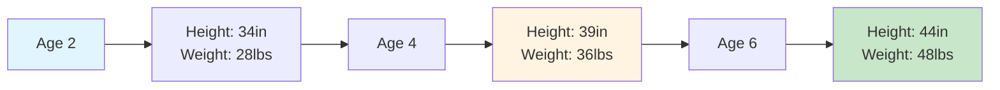

# Physical Development in Early Childhood

## Overview

Early childhood is characterized by **slower but steady physical growth** compared to infancy, accompanied by remarkable advances in motor skills, brain development, and body coordination. Children transform from toddlers to coordinated preschoolers capable of complex movements and self-care.

---

## External Resources

### 📚 Essential Reading
- 📖 [Physical Development - Wikipedia](https://en.wikipedia.org/wiki/Child_development#Physical_development) - Growth patterns overview
- 📖 [Motor Skill - Wikipedia](https://en.wikipedia.org/wiki/Motor_skill) - Motor development details
- 🔬 [Childhood Nutrition - WHO](https://www.who.int/health-topics/nutrition) - Nutritional guidelines
- 🎓 [Physical Activity Guidelines - CDC](https://www.cdc.gov/physicalactivity/basics/children/index.htm) - Activity recommendations

### 🎥 Video Resources
- 🎬 [Gross Motor Skills Development - Khan Academy](https://www.youtube.com/results?search_query=gross+motor+skills+development) (8 min)
- 🎬 [Fine Motor Skills Activities - PBS Parents](https://www.youtube.com/results?search_query=fine+motor+skills+preschool) (6 min)

### 📄 Recent Research
- 📑 Carson, V., et al. (2023). "Physical Activity and Motor Skills in Early Childhood." *Pediatrics*, 151(2), e2022058425.
- 📑 Schönbeck, Y., et al. (2024). "Growth Patterns in Modern Early Childhood." *JAMA Pediatrics*, 178(1), 45-53.

---

## 1. Height and Weight Changes

### 1.1 Growth Rate Slowing

**Height**: According to the PDF, "Growth rate slows: the average child in this stage grows 2½ inches in height and 5-7 pounds per year."

**Weight**: "The average annual increase in weight is 3 to 5 pounds."

**Six-Year Milestone**: "At age 6, children should gain weight approximately six times as much as they did at birth. The average girl weighs 48.5 pounds, and the average boy weighs 49 pounds."

**Body Composition Change**: "Body fat declines during preschool years."

### 1.2 Comparison to Infancy

| Period | Height Gain/Year | Weight Gain/Year | Pace |
|--------|------------------|------------------|------|
| Infancy (0-2 years) | ~10 inches | Triples birth weight | Rapid |
| Early Childhood (2-6 years) | 2.5 inches | 3-5 pounds | Steady, slower |

**Figure 1**: Steady growth progression through early childhood years.

---

## 2. Body Build Variations

### 2.1 Three Body Types

The PDF describes: "Body differences are fairly seen during this period."

**Endomorphic**: "Flabby, fat body"
- Higher body fat percentage
- Rounder appearance
- Greater obesity risk

**Mesomorphic**: "Sturdy look, muscular body build"
- Well-developed muscles
- Athletic build
- Balanced proportions

**Ectomorphic**: "Thin body"
- Lean appearance
- Less muscle mass
- Linear build

### 2.2 Gender Differences

**Composition**: "Boys have more muscle while girls have more fat."

**Muscle Development**: "The boy's muscles become larger, stronger, and heavier."

---

## 3. Motor Skills Development

### 3.1 Rapid Progress

The PDF states: "Gross and fine motor skills progress rapidly."

### 3.2 Gross Motor Skills

**Definition**: Large muscle movements involving whole body or limbs

**Examples**: "Include running, skipping and jumping."

**Developmental Sequence**:
- **Age 2-3**: Running (initially stiff), climbing stairs, kicking ball
- **Age 3-4**: Hopping on one foot, pedaling tricycle, throwing overhand
- **Age 4-5**: Skipping, catching ball, balancing on one foot
- **Age 5-6**: Jumping rope, riding bicycle, coordinated sports movements

### 3.3 Fine Motor Skills

**Definition**: Small muscle movements requiring precision and coordination

**Examples**: "Include turning pages of a book and learning to write and draw."

**Developmental Sequence**:
- **Age 2-3**: Turning pages one at a time, building tower of blocks, using spoon
- **Age 3-4**: Using scissors, drawing circles, buttoning large buttons
- **Age 4-5**: Drawing person with details, copying letters, using fork skillfully
- **Age 5-6**: Writing name, tying shoes, drawing recognizable pictures

---

## 4. Brain Development

### 4.1 Critical Growth

**Importance**: The PDF emphasizes: "The most important physical development during early childhood is the brain and nervous system growth."

**Continued Rapid Development**: Building on infancy when brain reached 75% adult weight by age 2, early childhood sees continued neural development

**Key Processes**:
- **Myelination**: Nerve fibers develop protective coating for faster signal transmission
- **Synaptic pruning**: Unused neural connections eliminated, strengthening frequently used pathways
- **Hemispheric specialization**: Left and right brain functions become more differentiated
- **Executive function development**: Planning, impulse control, working memory improve

---

## 5. Body Proportion and Shape

### 5.1 Nutritional Needs

**Caloric Requirements**: "The average preschool child requires 1700 calories per day."

**Balanced Diet Importance**: "Well balanced meals are important in this stage because their diet affects skeletal growth, body shape and susceptibility to disease."

**Dietary Impacts**:
- **Skeletal growth**: Calcium and vitamin D essential for bone development
- **Body shape**: Protein supports muscle development, excess calories contribute to obesity
- **Disease susceptibility**: Nutrition affects immune system function

### 5.2 Proportional Changes

**Shift from Infant Proportions**:
- Head becomes proportionally smaller relative to body
- Trunk elongates
- Legs lengthen significantly
- "Baby fat" decreases
- More adult-like proportions emerge

---

## 6. Teeth Development

### 6.1 Final Baby Teeth

**Eruption**: "During the first four to six months of this stage, the last four baby teeth—the back molars—erupt."

**Complete Primary Dentition**: Child has full set of 20 baby teeth by age 2.5-3 years

### 6.2 Transition to Permanent Teeth

**Beginning Replacement**: "During the last half year of early childhood, the baby teeth begin to replaced by permanent teeth."

**Typical Pattern**: "When early childhood is over, the child generally has one or two permanent teeth in front and some gaps where permanent teeth will eventually erupt."

**Developmental Timeline**:
- **Age 2-5**: Complete set of baby teeth maintained
- **Age 5-6**: Front lower incisors typically first permanent teeth to appear
- **Age 6+**: Continued gradual replacement throughout childhood

**Six-Year Molars**: First permanent molars (not replacing baby teeth) often erupt around age 6, marking transition to late childhood

---

## 7. Integration of Physical Changes

### 7.1 Impact on Behavior

**Increased Capabilities**:
- Greater mobility enables exploration
- Improved fine motor skills support self-care (dressing, feeding)
- Enhanced coordination allows complex play
- Brain development underpins cognitive advances

**Independence**: Physical competencies support growing autonomy and self-sufficiency

### 7.2 Individual Variation

**Normal Range**: While average patterns described, significant individual variation exists in:
- Growth rate timing
- Motor skill acquisition sequence
- Body build development
- Teeth eruption schedule

**Influencing Factors**:
- Genetic inheritance
- Nutritional adequacy
- Activity levels
- Health status
- Environmental opportunities

---

## 💡 Memory Aids & Mnemonics

### Three Body Types: **"EME"**
- **E**ndomorphic (round, higher fat)
- **M**esomorphic (muscular, athletic)
- **E**ctomorphic (thin, linear)

### Motor Skills: **"Gross = Large, Fine = Small"**
- **Gross**: Running, jumping, skipping (large muscles)
- **Fine**: Writing, drawing, buttoning (small muscles)

### Growth Pattern: **"2.5 and 3-5"**
- **2.5 inches** height gain per year
- **3-5 pounds** weight gain per year

---

## 🌍 Real-World Applications

### Pediatric Care
- Regular growth monitoring on percentile charts
- Motor skill milestone tracking
- Nutritional counseling (1,700 cal/day)
- Dental health (baby to permanent teeth)

### Early Education
- Age-appropriate playground equipment
- Fine motor skill activities (cutting, drawing)
- Gross motor play (running, climbing)
- Brain-building curriculum

---

## Summary

Physical development during early childhood shows **slower but steady growth** with dramatic advances in motor coordination and brain maturation. Children gain approximately 2.5 inches and 3-5 pounds annually, develop diverse body builds, master both gross and fine motor skills, and begin the transition from baby to permanent teeth. Brain and nervous system growth remains critical, supporting emerging cognitive and social capabilities.

**Key Takeaways**:

1. **Slowed growth**: Compared to infancy, growth rate decreases but remains steady

2. **Body composition**: Fat decreases, muscle increases (especially in boys)

3. **Motor skills**: Rapid progress in both gross (running, jumping) and fine (writing, drawing) skills

4. **Brain development**: Continued neural growth most important physical change

5. **Individual variation**: Three body types (endomorphic, mesomorphic, ectomorphic) emerge

6. **Nutritional impact**: 1,700 calories daily affects skeletal growth, body shape, disease resistance

7. **Teeth transition**: Baby teeth complete, permanent teeth begin emerging by age 5-6

Understanding physical development patterns enables parents and educators to provide appropriate nutrition, activity opportunities, and realistic expectations for early childhood capabilities.

---

## Self-Assessment Questions

1. **True/False**: Boys' muscles get weak during the early age. (______)

2. **Fill in the blanks**: The average child grows ______ inches in height per year during early childhood.

3. **Short Answer**: Describe the three body build types that become evident during early childhood.

4. **Analysis**: Explain why the PDF emphasizes that brain and nervous system growth is "the most important physical development during early childhood."

5. **Application**: A 4-year-old struggles to draw recognizable shapes and write letters. Should parents be concerned? Use information about fine motor skill development to support your answer.

---

**Source PDFs**: 
- 📄 [Block-1/Unit-4.pdf - Pages 45](/pdfs/MPC-002%20Life%20Span%20Psychology/Block-1/Unit-4.pdf)
- 📚 MPC-002 Life Span Psychology
