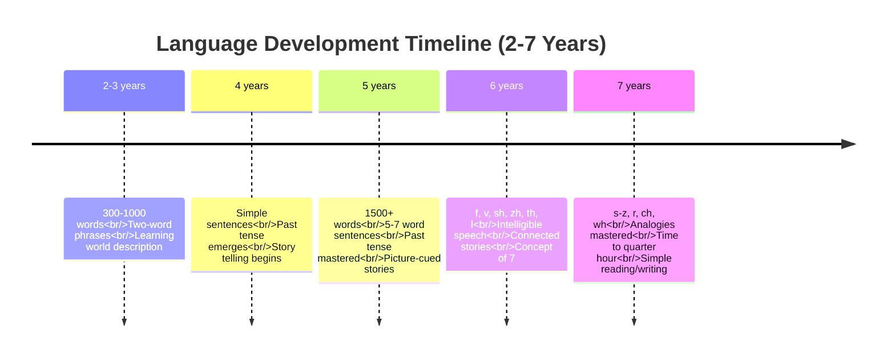

# Cognitive and Linguistic Development in Early Childhood

## Overview

Early childhood witnesses dramatic **cognitive and linguistic advances** as children transition from sensorimotor intelligence to symbolic, representational thought. Jean Piaget's **preoperational stage** (2-7 years) and remarkable language expansion characterize this period of mental growth.

---

## External Resources

### 📚 Essential Reading

- 📖 [Jean Piaget - Wikipedia](https://en.wikipedia.org/wiki/Jean_Piaget) - Biography and cognitive development theory
- 📖 [Preoperational Stage - Wikipedia](https://en.wikipedia.org/wiki/Piaget%27s_theory_of_cognitive_development#Preoperational_stage) - Detailed stage description
- 📖 [Language Development - Wikipedia](https://en.wikipedia.org/wiki/Language_development) - Comprehensive language acquisition overview
- 🔬 [Cognitive Development - Simply Psychology](https://www.simplypsychology.org/piaget.html) - Accessible Piaget explanation
- 🎓 [Preschool Language Milestones - ASHA](https://www.asha.org/public/speech/development/35/) - Professional speech standards

### 🎥 Video Resources

- 🎬 [Piaget's Preoperational Stage - Khan Academy](https://www.youtube.com/results?search_query=piaget+preoperational+stage) (8 min) - Stage overview
- 🎬 [Language Development 2-5 Years - Child Development](https://www.youtube.com/results?search_query=language+development+preschool+years) (10 min) - Vocabulary explosion

### 📄 Recent Research

- 📑 Gopnik, A., & Wellman, H. M. (2023). "Reconstructing Constructivism: Causal Models in Preschoolers." *Psychological Review*, 130(4), 1015-1042. - Contemporary understanding of preoperational thought
- 📑 Rowe, M. L., & Snow, C. E. (2024). "Analyzing Input Quality and Quantity in Language Development." *Annual Review of Linguistics*, 10, 1-25. - Recent research on vocabulary growth

---

## Part I: Cognitive Development

### 1. Piaget's Core Processes

#### 1.1 Assimilation

**Definition**: The PDF defines assimilation as "the process of using or transforming the environment so that it can be placed in preexisting cognitive structures."

**Example**: "An infant who uses a sucking schema that was developed by sucking on a small bottle when attempting to suck on a larger bottle."

**Key Concept**: Fitting new experiences into existing mental frameworks

#### 1.2 Accommodation

**Definition**: "Accommodation is the process of changing cognitive structures in order to accept something from the environment."

**Example**: "When the child needs to modify a sucking schema developed by sucking on a pacifier to one that would be successful for sucking on a bottle."

**Key Concept**: Modifying mental frameworks to fit new experiences

#### 1.3 Interaction of Processes

**Simultaneous Use**: "Both processes are used simultaneously and alternately throughout life."

**Balance**: Development involves continuous interplay between assimilating new information into existing schemas and accommodating schemas to new experiences

---

### 2. Schemas and Structures

#### 2.1 From Schemas to Structures

**Increasing Complexity**: "As schemas become increasingly more complex (i.e., responsible for more complex behaviours) they are termed structures."

#### 2.2 Hierarchical Organization

**Organization Principle**: "As one's structures become more complex, they are organised in a hierarchical manner (i.e., from general to specific)."

**Example**:
- **General**: Understanding "animal"
- **Specific**: Dog, cat, bird as subcategories
- **More specific**: Breeds within dog category

---

### 3. Preoperational Stage (2-7 Years)

#### 3.1 Stage Overview

**Intelligence Demonstration**: The PDF states: "At the pre-operational stage (Play age and Early Childhood) intelligence is demonstrated through the use of symbols, language use which matures, and memory and imagination are developed."

**Thinking Characteristics**: "But thinking is done in a non logical, non reversible manner."

**Dominant Feature**: "Egocentric thinking also predominates at this stage."

**Concept Formation**: "Children form stable concepts and mental reasoning begins to develop."

#### 3.2 Sub-Stage 1: Symbolic Reasoning (2-4 Years)

**Development**: "From 2-4 years children develop symbolic reasoning (the ability to picture an object that is not present)."

**Symbolic Function Examples**:
- Using toy phone to "call" someone
- Pretending block is car
- Role-playing family scenarios
- Drawing pictures to represent objects

**Egocentrism**: "Egocentrism starts out strong in early childhood, but weakens."

**Magical Thinking**: "Magical beliefs are constructed."

**Examples of Magical Thinking**:
- Believing wishes can make things happen
- Thinking monsters are real
- Confusing fantasy and reality
- Animism (attributing life to inanimate objects)

#### 3.3 Sub-Stage 2: Intuitive Thought (4-7 Years)

**Development**: "Between 4-7 years of age the child develops intuitive thought (the use of primitive reasoning skills and wondering 'why')."

**School Entry**: "Starting school is a major landmark for children at this age."

**Questioning**: Constant "why" questions reflect emerging curiosity and reasoning attempts

**Characteristics**:
- Primitive logic attempts
- Reliance on perception over logic
- Difficulty with conservation tasks
- Centration (focusing on one aspect)

---

### 4. Egocentrism

#### 4.1 Definition and Nature

**Piaget's Observation**: The PDF notes "Piaget also noted that children feel great difficulty to accept the views of others and Piaget called this egocentrism."

**Precise Definition**: "Egocentrism is when children experience difficulty in experiencing others person's perspective."

```mermaid
graph TD
    A[Preoperational Stage<br/>2-7 years] --> B[Sub-stage 1<br/>2-4 years<br/>Symbolic Reasoning]
    A --> C[Sub-stage 2<br/>4-7 years<br/>Intuitive Thought]
    B --> D[Symbolic Function<br/>Egocentrism Strong<br/>Magical Beliefs]
    C --> E[Primitive Reasoning<br/>Egocentrism Weakens<br/>Constant "Why?"]
    D --> F[Representation<br/>Without Logic]
    E --> F
    style A fill:#e1f5ff
    style B fill:#fff9c4
    style C fill:#ffe4b5
    style F fill:#e8f5e9
```

**Figure 1**: Piaget's preoperational stage showing two sub-stages and key cognitive features.

#### 4.2 Characteristics

**Not Selfishness**: Egocentrism ≠ selfishness; it's cognitive inability to take another's viewpoint

**Manifestations**:
- Assuming others see what they see
- Believing others know what they're thinking
- Difficulty understanding others have different knowledge
- Inability to consider multiple perspectives simultaneously

**Developmental Trajectory**: Strong at age 2-3, gradually weakens through age 4-7

---

### 5. Educational Implications

#### 5.1 Constructivist Learning

**Theoretical Foundation**: The PDF states: "Many schools are adopting the Piaget's theory of cognitive development, which provides part of the foundation for constructive learning."

**Core Principles**:
1. **Discovery learning**: Children learn through exploration
2. **Supporting interests**: Following child's developing curiosities

#### 5.2 Instructional Techniques

**Challenge Abilities**: "It is recommended that parents and teachers challenge the child's abilities."

**Concrete Experiences**: "It is also recommended that teachers use a wide variety of concrete experiences to help the child learn."

**Examples**: 
- **Manipulatives**: Hands-on objects for math and science
- **Group work**: Collaborative learning opportunities
- **Field trips**: Real-world experiences
- **Active experiments**: Direct interaction with materials

---

## Part II: Linguistic Development

### 1. Language as Cognitive Tool

**Central Importance**: The PDF emphasizes: "Proper language development is the main concern in the early childhood. Language is the only powerful tool to enhance the ability of cognitive development."

**Problem-Solving**: "A good language always allows the child to communicate or interact with others persons and solve their problems."

---

### 2. Vocabulary Explosion

#### 2.1 Ages 2-3 Years

**Initial Growth**: "Beginning the first three years of life, children develop a spoken vocabulary of between 300 and 1,000 words."

**Descriptive Function**: "They are able to use language to learn about and describe the world around them."

#### 2.2 Age 5 Years

**Dramatic Expansion**: "By age five, a child's vocabulary will grow to approximately 1,500 words."

**Sentence Complexity**: "Five-year-olds are also able to produce five-to seven-word sentences, learn to use the past tense, and tell familiar stories using pictures as cues."

---

### 3. Age-Specific Language Milestones

#### 3.1 Age 6 Years

**Consonant Mastery**: "A child can learn consonants that are to be mastered: f, v, sh, zh, th, l."

**Concept Development**: "They should develop the concept of 7."

**Intelligibility**: "Their speech should be completely intelligible and socially useful."

**Narrative Ability**: "Children at this age should be able to tell others a well connected story about a picture seeing the relationships therein between objects and happenings."

#### 3.2 Age 7 Years

**Advanced Consonants**: "A child masters the consonants s-z, r, voiceless th, ch, wh, and the soft g as in George."

**Analogical Reasoning**: "They should be able to handle opposite analogies easily: girl-boy, man-woman, flies-swims, blunt-sharp short-long, sweet-sour, etc."

**Conceptual Understanding**: "They must be able to understand such terms as: alike, different, beginning, end, etc."

**Advanced Skills**: "In addition children at this age should be able to tell time to quarter hour and do simple reading and write many words."



**Figure 2**: Major language development milestones across the early childhood period.

---

### 4. Cognitive-Linguistic Integration

#### 4.1 Language Supporting Cognition

**Conceptual Development**: Language provides labels for concepts, making abstract thought possible

**Memory Enhancement**: Verbal labels help encode and retrieve memories

**Problem-Solving**: Internal speech guides thinking and planning

#### 4.2 Cognition Supporting Language

**Symbolic Capacity**: Preoperational symbolic reasoning enables word-referent understanding

**Categorization**: Cognitive ability to categorize supports vocabulary organization

**Conceptual Understanding**: Must understand concepts before learning words for them

---

## 💡 Memory Aids & Mnemonics

### Assimilation vs Accommodation: **"Fit vs Change"**
- **Assimilation**: FIT new info into existing schemas ("this bigger bottle works like small bottle")
- **Accommodation**: CHANGE schemas to fit new info ("pacifier sucking doesn't work for bottle")

### Preoperational Sub-Stages: **"Symbolic then Intuitive"**
- **2-4 years**: **Symbolic** reasoning (pictures in mind)
- **4-7 years**: **Intuitive** thought (primitive reasoning, "why?")

### Egocentrism: **"Can't See Your View"**
- Difficulty taking others' perspectives
- NOT selfishness - cognitive limitation
- Weakens gradually 2-7 years

### Vocabulary Growth: **"300 to 1,500+"**
- **Age 2-3**: 300-1,000 words
- **Age 5**: 1,500 words
- **By Age 7**: Complex sentences, reading, writing

### Consonant Mastery: **"6 then 7"**
- **Age 6**: f, v, sh, zh, th, l
- **Age 7**: s-z, r, ch, wh, soft g

---

## 🌍 Real-World Applications

### Educational Practices
- **Hands-On Learning**: Manipulatives and concrete experiences match preoperational thinking
- **Discovery Learning**: Following child's interests supports constructivist development
- **Group Activities**: Peer interaction helps reduce egocentrism
- **Field Trips**: Real-world experiences provide concrete foundation for concepts

### Parenting Guidance
- **Understanding "Why"**: Constant questioning reflects intuitive thought development
- **Magical Thinking**: Fantasy-reality confusion is normal, not concerning
- **Perspective-Taking**: Teaching through role-play helps reduce egocentrism
- **Language Stimulation**: Talking, reading, singing support vocabulary explosion

### Clinical Applications
- **Developmental Screening**: Piaget's milestones help identify cognitive delays
- **Speech Therapy**: Age-specific consonant expectations guide intervention
- **Cognitive Assessment**: Egocentrism tasks evaluate preoperational reasoning
- **Early Intervention**: Targeting specific cognitive or language deficits

### Curriculum Design
- **Play-Based Learning**: Recognizing symbolic play as cognitive development
- **Language-Rich Environment**: Supporting 300-1,500 word growth through exposure
- **Concrete Materials**: Avoiding abstract concepts before concrete operations stage
- **Social Stories**: Helping children understand different perspectives

---

## Summary

Cognitive and linguistic development during early childhood transforms children from sensorimotor infants to symbolic thinkers and effective communicators. Piaget's preoperational stage (2-7 years) introduces symbolic reasoning, intuitive thought, and prominent egocentrism, while language explodes from 300-1,000 words at age 3 to 1,500+ words by age 5, with advancing grammatical complexity and social utility.

**Key Takeaways**:

1. **Assimilation and accommodation**: Core processes of cognitive adaptation throughout life

2. **Preoperational thinking**: Symbolic, egocentric, magical, non-logical but increasingly sophisticated

3. **Egocentrism**: Difficulty taking others' perspectives, gradually weakening with age

4. **Constructivist education**: Discovery learning and concrete experiences match cognitive stage

5. **Vocabulary explosion**: From 300 words at age 2-3 to 1,500+ by age 5-7

6. **Language-cognition link**: Language enhances cognitive development; cognition enables language

7. **Practical competence**: By age 7, children read, write, tell time, and engage in complex reasoning

Understanding these cognitive and linguistic patterns enables parents and educators to provide developmentally appropriate challenges, realistic expectations, and effective support during early childhood.

---

## Self-Assessment Questions

1. **True/False**: 
   - Egocentrism starts at preoperational stage. (______)
   - Clear communication may be hazardous for the child. (______)

2. **Short Answer**: Explain the difference between assimilation and accommodation using examples.

3. **Analysis**: Why does Piaget describe preoperational thought as "non-logical" and "non-reversible"? What does this reveal about early childhood cognitive limitations?

4. **Application**: A 4-year-old believes that when she closes her eyes, others cannot see her. Which characteristic of preoperational thought does this demonstrate? How would you explain this behavior to concerned parents?

5. **Synthesis**: How does the dramatic language expansion (300 to 1,500+ words) between ages 3-5 support the cognitive advances described in Piaget's preoperational stage?

---

**Source PDFs**: 
- 📄 [Block-1/Unit-4.pdf - Pages 46-47](/pdfs/MPC-002%20Life%20Span%20Psychology/Block-1/Unit-4.pdf)
- 📚 MPC-002 Life Span Psychology
