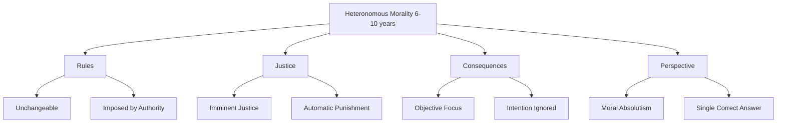
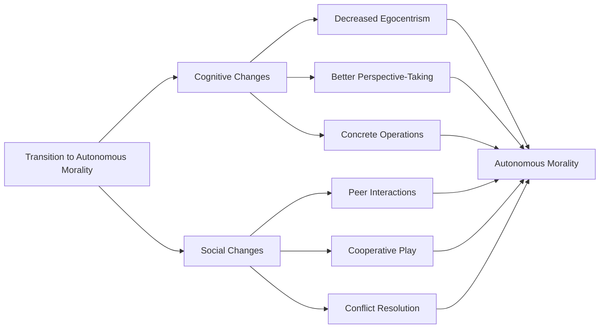
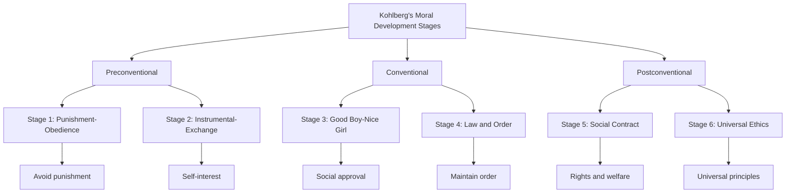

# Moral Development in Middle Childhood

## Introduction

Moral development represents one of the most significant achievements of middle childhood, as children transition from concrete, egocentric views of right and wrong to more sophisticated understandings of morality, justice, and ethical behavior. During the years from 6 to 11, children develop increasingly complex moral reasoning abilities, learn to consider multiple perspectives, and begin integrating societal rules with personal values. This period marks a critical time when children move from viewing rules as absolute and unchangeable to understanding morality as a system of principles that can be discussed, negotiated, and applied flexibly across situations.

## Piaget's Theory of Moral Development

Jean Piaget's pioneering work on moral development emerged from his observations of children playing games and their responses to moral dilemmas. His theory proposes that moral understanding develops in parallel with cognitive development, particularly the transition from preoperational to concrete operational thinking.

### Heteronomous Morality (Moral Realism)

When children enter the stage of concrete operations around age 6 or 7, they simultaneously enter what Piaget called **heteronomous morality** or **moral realism**. The term "heteronomous" means "under an outside authority," reflecting children's view that moral rules come from external authorities and cannot be changed.

**Key Characteristics of Heteronomous Morality:**

1. **Rules as Unchangeable and Absolute**
   - Children view rules as fixed, sacred, and imposed by authority figures (parents, teachers, God)
   - Rules are seen as existing independently of human agreements
   - Any modification of rules seems impossible or wrong
   - Example: "You can't change the rules of tag because that's just how the game is played"

2. **Imminent Justice**
   - Belief that wrongdoing invariably and automatically leads to punishment
   - The universe itself punishes wrongdoers
   - If punishment doesn't occur immediately, it will happen eventually
   - Example: A child who lies believes they will definitely be caught and punished

3. **Objective Consequences Focus**
   - Morality judged by objective consequences rather than intentions
   - The amount of damage matters more than why it occurred
   - Accidents that cause great harm seen as worse than intentional acts causing less harm
   - Example: Breaking 15 cups accidentally is worse than breaking 1 cup on purpose

4. **Moral Absolutism**
   - Belief in one correct moral conclusion per circumstance
   - Right and wrong are black and white with no gray areas
   - Cultural or contextual variations in morality not understood
   - Example: "Lying is always wrong, no matter what"

**Roots in Egocentrism:**

Piaget argued that young school children's egocentrism encourages these beliefs. Their limited perspective-taking ability prevents them from understanding that:
- Rules are human creations that can be modified
- Intentions matter as much as outcomes
- Different people and cultures may have different but equally valid moral positions
- Justice doesn't automatically or inevitably occur

### Autonomous Morality (Morality of Cooperation)

Around age 9 or 10, as children become less egocentric and develop better perspective-taking abilities, they transition to **autonomous morality** or **morality of cooperation**.

**Key Characteristics of Autonomous Morality:**

1. **Rules as Flexible and Modifiable**
   - Understanding that rules are arbitrary human agreements
   - Rules can be changed through consensus and negotiation
   - Personal decisions about rule-following become possible
   - Example: "We can change the rules of our game if everyone agrees"

2. **Intentions Matter**
   - Motives behind actions become important in moral judgment
   - Accidents judged less harshly than intentional harm
   - Context and circumstances considered in evaluating behavior
   - Example: Breaking cups accidentally is less bad than breaking one on purpose to hurt someone

3. **Moral Relativism**
   - Recognition that moral perspectives can vary
   - Different situations may call for different moral responses
   - Multiple valid viewpoints on moral issues
   - Example: "Lying is usually wrong, but maybe okay to protect someone's feelings"

4. **Cooperative Justice**
   - Morality based on mutual understanding and cooperation
   - Authority of adults replaced by peer-based morality
   - Praise and punishment should be distributed fairly and even-handedly
   - Reciprocity and equality become important principles

**Developmental Mechanisms:**

Piaget identified several factors driving the transition from heteronomous to autonomous morality:

- **Decreased Egocentrism**: Ability to consider multiple viewpoints simultaneously
- **Peer Interactions**: Cooperative relationships with equals promote understanding of reciprocity
- **Cognitive Development**: Concrete operational thinking enables flexible, logical reasoning about rules
- **Social Experience**: Negotiating and resolving conflicts with peers teaches that rules can be modified

### Limitations of Piaget's Theory

While influential, Piaget's theory has been criticized on several grounds:

- **Age Estimates**: Some research suggests children understand intentions earlier than Piaget proposed
- **Stage-like Progression**: Development may be more gradual than distinct stages suggest
- **Cultural Variations**: Theory based primarily on Western, middle-class children
- **Individual Differences**: Children show considerable variation in moral development timing
- **Moral Reasoning vs. Behavior**: Theory focuses on reasoning, not actual moral behavior

## Kohlberg's Theory of Moral Development

Lawrence Kohlberg extended and refined Piaget's work, creating a comprehensive six-stage theory that spans from early childhood through adulthood. Kohlberg studied moral development by presenting moral dilemmas to individuals of various ages and analyzing the reasoning behind their responses.

### The Heinz Dilemma

Kohlberg's most famous dilemma illustrates his methodology:

> "In Europe, a woman was near death from a special kind of cancer. There was one drug that the doctors thought might save her. It was a form of radium that a druggist in the same town had recently discovered. The drug was expensive to make, but the druggist was charging ten times what the drug cost him to make. He paid $200 for the radium and charged $2000 for a small dose of the drug. The sick woman's husband, Heinz, went to everyone he knew to borrow the money, but he could only get together about $1000, which was half of what it cost. He told the druggist that his wife was dying and asked him to sell it cheaper or let him pay later. But the druggist said, 'No, I discovered the drug and I'm going to make money from it.' So Heinz got desperate and considered breaking into the man's store to steal the drug for his wife. Should Heinz steal the radium?" (Kohlberg & Gilligan, 1971)

Kohlberg analyzed not whether individuals said "yes" or "no," but the reasoning behind their answers, identifying three broad levels of moral reasoning, each containing two stages.

### Level 1: Preconventional Morality (Ages 4-10)

At this level, individuals define morality in terms of consequences (punishment or reward) rather than considerations of right and wrong per se.

**Stage 1: Punishment-Obedience Orientation**
- **Focus**: Avoiding punishment
- **Reasoning**: "It's wrong because you'll get in trouble"
- **Perspective**: Egocentric, authority-oriented
- **Example Response**: "Heinz shouldn't steal because he'll go to jail"

**Stage 2: Instrumental-Exchange Orientation**
- **Focus**: Serving one's own interests
- **Reasoning**: "It's right if it benefits me or someone I care about"
- **Perspective**: Recognition of others' interests but self-interest primary
- **Example Response**: "Heinz should steal because he needs his wife" OR "The druggist shouldn't sell cheap because he needs money too"

### Level 2: Conventional Morality (Ages 10-13+)

At this level, individuals define morality in terms of maintaining social order and meeting others' expectations. This represents the shift Piaget described as children move beyond egocentrism.

**Stage 3: Good Boy-Nice Girl Orientation**
- **Focus**: Approval from others, being "good"
- **Reasoning**: "It's right if it makes others approve of you"
- **Perspective**: Considers how actions appear to others
- **Example Response**: "Heinz should steal because people will think he's a good husband" OR "He shouldn't steal because people will think he's a criminal"
- **Key Feature**: Concern with appearing good in others' eyes

**Stage 4: System-Maintaining Orientation (Law and Order)**
- **Focus**: Maintaining social order, following laws
- **Reasoning**: "It's right if it upholds the law and social system"
- **Perspective**: Societal viewpoint, understanding social institutions
- **Example Response**: "Heinz shouldn't steal because if everyone broke laws when they wanted, society would collapse"
- **Key Feature**: Rule-breaking inherently immoral because it creates chaos

### Level 3: Postconventional Morality (Age 13+, if at all)

At this level, individuals define morality in terms of abstract principles and values that apply to all situations and societies. Most middle childhood children do not reach this level, though it's included for completeness.

**Stage 5: Social-Contract Orientation**
- **Focus**: Individual rights and democratically determined laws
- **Reasoning**: Laws should serve human welfare; unjust laws should be changed
- **Perspective**: Prior-to-society perspective considering individual rights
- **Example Response**: "Laws against stealing usually protect society, but in this case the law conflicts with the right to life, which is more fundamental"

**Stage 6: Universal-Ethical-Principles Orientation**
- **Focus**: Abstract ethical principles (justice, equality, human dignity)
- **Reasoning**: Self-chosen ethical principles that apply universally
- **Perspective**: Ideal moral perspective transcending specific societies
- **Example Response**: "Human life has absolute value that transcends property rights or laws; Heinz must steal to uphold the principle of preserving life"

### Middle Childhood and Conventional Reasoning

The transition from preconventional to conventional reasoning typically occurs during middle childhood, making this period critical for moral development:

**Why Conventional Reasoning Emerges:**

1. **Cognitive Development**: Concrete operational thinking enables:
   - Understanding social perspectives beyond one's own
   - Coordinating multiple viewpoints simultaneously
   - Comprehending social systems and their functions

2. **Social Experience**: Expanding social world includes:
   - Peer relationships requiring cooperation
   - Understanding group norms and expectations
   - Experience with social institutions (school, teams, clubs)

3. **Role-Taking Ability**: Decreasing egocentrism allows:
   - Understanding others' expectations
   - Recognizing one's role in larger social systems
   - Appreciating how behavior affects group functioning

**Characteristics of Stage 3 Reasoning** (most common in early middle childhood):
- Strong desire to be viewed as "good" by others
- Concern with living up to expectations
- Emphasis on intentions in judging morality
- Beginning understanding of perspective-taking

**Characteristics of Stage 4 Reasoning** (emerging in late middle childhood):
- Understanding society's need for rules
- Concern with maintaining social order
- Respect for authority and institutions
- Recognition that chaos results from universal rule-breaking

## Moral Judgments and Moral Behavior

A crucial question in moral development concerns the relationship between moral reasoning (what children say) and moral behavior (what children do). Do children who demonstrate advanced moral reasoning actually behave more morally?

### The Hartshorne and May Studies

In a classic series of studies, Hugh Hartshorne and Mark May (1928-1930) investigated the moral behavior of approximately 10,000 children, examining the relationship between professed moral standards and actual behavior.

**Key Findings:**

1. **Limited Consistency**: Students who supported rigid moral standards didn't necessarily behave in ethical ways

2. **Situation-Specific Behavior**: Children who behaved honestly in one situation might cheat in another

3. **Discrepancy Between Words and Actions**: Verbal commitment to moral principles didn't predict moral behavior

4. **Complexity of Moral Action**: Actual moral behavior depends on multiple factors beyond reasoning ability

### Factors Influencing Moral Behavior

Research has identified several factors that affect whether children act on their moral knowledge:

**Cognitive Factors:**
- **Moral Reasoning Level**: Higher-stage reasoning associated with more consistent moral behavior
- **Problem-Solving Skills**: Ability to identify moral dimensions of situations
- **Anticipation of Consequences**: Thinking ahead to results of actions

**Emotional Factors:**
- **Empathy**: Feeling what others feel motivates prosocial behavior
- **Guilt**: Anticipating guilt can inhibit immoral behavior
- **Moral Emotions**: Shame, pride, and conscience influence actions

**Social Factors:**
- **Peer Pressure**: Strong influence on whether children act morally
- **Authority Presence**: Children behave differently when adults are present vs. absent
- **Group Norms**: What the peer group values and reinforces

**Situational Factors:**
- **Opportunity**: Whether circumstances make immoral behavior easy or difficult
- **Cost-Benefit Analysis**: Personal costs vs. benefits of moral action
- **Moral Salience**: Whether the moral dimensions of situation are obvious

### The Excuse-Making Phenomenon

Research with 9-11 year-old children reveals they are quick to find excuses to justify their own rule infractions while judging others harshly for similar behaviors:

**Common Self-Justifications:**
- "Everyone does it"
- "It wasn't really that bad"
- "I had no choice"
- "They deserved it"
- "It was just this once"

This demonstrates the complexity of moral development—children may understand moral principles intellectually while failing to apply them consistently to their own behavior.

### Coordinating Multiple Moral Considerations

Solving moral dilemmas involves coordinating several potentially conflicting needs and concerns:

1. **Cultural Laws and Norms**: What society says is right
2. **Peer Morality**: What friends and age-mates value
3. **Parental and Teacher Guidelines**: What authority figures expect
4. **Self-Interest**: Personal costs and benefits
5. **Empathy**: Considering others' feelings and welfare

Children in third and fourth grade may identify the moral principle in a story but struggle to apply it to their own lives. This application gap highlights that moral development involves not just understanding principles but also:

- Recognizing when principles apply to specific situations
- Overcoming self-interested motivations
- Managing emotional responses
- Resisting contrary peer or social pressures

### Promoting Moral Behavior

Research suggests several approaches help children translate moral understanding into action:

**Practice and Experience:**
- Real opportunities to make moral choices
- Experience with consequences of moral and immoral actions
- Discussion of moral dilemmas and reasoning

**Instruction and Modeling:**
- Specific guidance on applying moral principles
- Adult models who demonstrate moral behavior
- Discussion of how to generalize principles to life situations

**Maturity and Development:**
- Cognitive development enables better moral reasoning
- Emotional development supports empathy and guilt
- Social experience provides understanding of consequences

**Supportive Environment:**
- Clear expectations for moral behavior
- Consistent responses to moral and immoral actions
- Opportunities to see positive effects of moral behavior

## Cultural and Individual Variations

Moral development doesn't follow a universal, invariant path but is influenced by cultural values, family practices, and individual experiences.

### Cultural Influences

Different cultures emphasize different moral values:

**Individualist Cultures** (Western societies):
- Emphasis on individual rights and autonomy
- Justice and fairness as primary moral concerns
- Personal choice and self-determination valued

**Collectivist Cultures** (Many Asian, African, Latin American societies):
- Emphasis on group harmony and social obligations
- Caring for in-group members as primary moral concern
- Duty and role fulfillment valued

**Religious and Spiritual Frameworks:**
- Different religions emphasize different moral virtues
- Concepts of sin, karma, dharma shape moral understanding
- Sacred texts and authorities influence moral reasoning

### Family Influences

Parenting practices significantly impact moral development:

**Democratic/Authoritative Parenting:**
- Discussion of moral issues
- Explanation of rules and their purposes
- Encouragement of perspective-taking
- Results: Advanced moral reasoning, internalized values

**Authoritarian Parenting:**
- Emphasis on obedience
- Punishment for rule violations
- Limited explanation of moral principles
- Results: Conventional reasoning, external orientation

**Permissive Parenting:**
- Few rules or expectations
- Limited guidance on moral issues
- Inconsistent responses to behavior
- Results: Variable moral development, possible delays

### Gender Considerations

Carol Gilligan's (1982) critique of Kohlberg noted potential gender biases:

**Justice Orientation** (traditionally associated with males):
- Focus on rights, fairness, and equality
- Emphasis on abstract principles
- Kohlberg's stages reflect this orientation

**Care Orientation** (traditionally associated with females):
- Focus on relationships and responsibilities
- Emphasis on empathy and compassion
- Not well-captured by Kohlberg's stages

Contemporary research suggests both males and females can use both orientations, with situation and individual factors determining which predominates.

## Contemporary Research and Applications

### Social Media and Moral Development (2020-2024)

Recent research examines how digital contexts affect moral development:

- Children encounter new moral situations (cyberbullying, privacy, digital citizenship)
- Online disinhibition may reduce moral behavior
- Opportunities for prosocial behavior through online activism and support
- Need for explicit teaching about digital ethics

### Neuroscience of Moral Development

Brain imaging studies reveal:

- Prefrontal cortex development supports moral reasoning
- Limbic system maturation affects moral emotions
- Integration of cognitive and emotional systems enables mature morality
- Individual differences in brain development relate to moral reasoning variations

### Promoting Moral Development in Schools

Evidence-based practices include:

1. **Moral Dilemma Discussion**: Structured discussion of age-appropriate dilemmas
2. **Service Learning**: Opportunities to help others and reflect on experiences
3. **Character Education**: Explicit teaching of virtues and values
4. **Peer Mediation**: Training in conflict resolution and perspective-taking
5. **Classroom Democratic Practices**: Involving children in rule-making and governance

---

**Source PDFs**: 
- 📄 [Block-2/Unit-2.pdf - Pages 19-34](/pdfs/MPC-002%20Life%20Span%20Psychology/Block-2/Unit-2.pdf)
- 📚 MPC-002 Life Span Psychology

## Self-Assessment Questions

1. **True/False**: According to Piaget, children in the stage of heteronomous morality believe that rules are fixed and cannot be changed.

2. **Multiple Choice**: The belief that wrongdoing invariably leads to punishment is called:
   a) Moral absolutism
   b) Imminent justice
   c) Objective consequences
   d) Heteronomous morality

3. **Matching**: Match Kohlberg's stages with their primary focus:
   - Stage 1: ___
   - Stage 2: ___
   - Stage 3: ___
   - Stage 4: ___
   
   Options: A) Self-interest B) Social approval C) Punishment avoidance D) Law and order

4. **Short Answer**: Explain why a child in Stage 3 of Kohlberg's theory might say Heinz should steal the drug, while a child in Stage 4 might say he should not.

5. **Application**: A 10-year-old accidentally breaks a valuable vase while carefully moving it to safety. How would this situation be judged by a child in heteronomous morality versus autonomous morality?

6. **Critical Thinking**: The Hartshorne and May studies found that children who professed high moral standards didn't always behave morally. What factors might explain this discrepancy between moral reasoning and moral behavior?

7. **Analysis**: How does the transition from egocentric to perspective-taking thinking enable the shift from heteronomous to autonomous morality?

## Memory Aids

### Piaget's Two Stages Mnemonic: "HA"
- **H**eteronomous morality (younger, rules are absolute)
- **A**utonomous morality (older, rules are flexible)

### Kohlberg's Levels Mnemonic: "PCP"
- **P**reconventional (punishment and self-interest)
- **C**onventional (approval and order)
- **P**ostconventional (principles and ethics)

### Three I's of Heteronomous Morality
- **I**mminent justice (punishment is inevitable)
- **I**ntentions ignored (consequences matter most)
- **I**mmutable rules (cannot be changed)

### Remember Conventional Level Focus: "GAOL"
- **G**oodness in others' eyes (Stage 3)
- **A**pproval seeking
- **O**rder maintenance (Stage 4)
- **L**aw-following

## Further Learning

### Educational Videos

1. **Kohlberg's Stages of Moral Development**
   - [Crash Course Psychology - Moral Development](https://www.youtube.com/watch?v=WlZGoYKWQ9E)
   - Overview of Kohlberg's theory with examples

2. **Piaget's Theory of Moral Development**
   - [Simply Psychology - Moral Development](https://www.youtube.com/watch?v=8yyL1wBIV0Q)
   - Explanation of Piaget's stages and research

### External Resources

1. **[Stanford Encyclopedia of Philosophy - Moral Development](https://plato.stanford.edu/entries/moral-development/)**
   - Comprehensive academic overview of moral development theories

2. **[Wikipedia: Lawrence Kohlberg's Stages of Moral Development](https://en.wikipedia.org/wiki/Lawrence_Kohlberg%27s_stages_of_moral_development)**
   - Detailed information on Kohlberg's theory and research

3. **[Wikipedia: Jean Piaget](https://en.wikipedia.org/wiki/Jean_Piaget#Moral_development)**
   - Section on Piaget's contributions to moral development

4. **[Association for Moral Education](https://www.amenetwork.org/)**
   - Organization dedicated to moral education research and practice

5. **[Character.org - Character Education Resources](https://www.character.org/)**
   - Practical resources for promoting moral development

6. **[Center for the 4th and 5th Rs](https://www2.cortland.edu/centers/character/)**
   - Research-based character education approaches

7. **[Greater Good Science Center - Moral Development](https://greatergood.berkeley.edu/)**
   - Research on moral and prosocial development

### Recent Research Papers

1. Killen, M., & Dahl, A. (2023). "Moral Reasoning: Theory and Research in Developmental Science." In *Stevens' Handbook of Experimental Psychology and Cognitive Neuroscience* (4th ed.). Wiley.

2. Smetana, J. G., & Ball, C. L. (2024). "Young Children's Moral Judgments, Justifications, and Emotion Attributions in Peer Relationship and Bullying Contexts." *Child Development*, 95(2), 457-475.

3. Turiel, E., & Gingo, M. (2023). "Development of Moral Judgments and Social Reasoning." In *Handbook of Child Psychology and Developmental Science* (8th ed.). Wiley.

4. Malti, T., & Ongley, S. F. (2023). "The Development of Moral Emotions and Moral Reasoning." In *Handbook of Emotional Development*. Springer.

5. Walker, L. J., & Frimer, J. A. (2024). "Moral Development Across the Lifespan: Recent Progress and Future Directions." *Developmental Review*, 71, 101103.