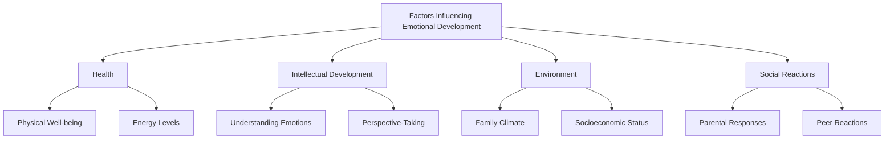
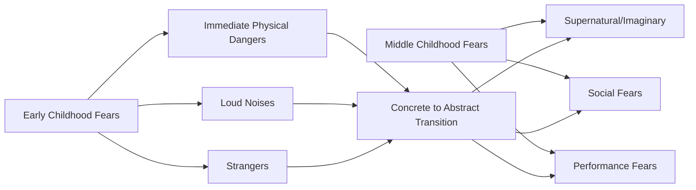
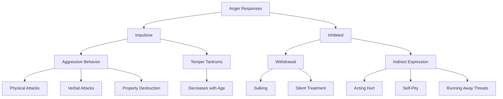

# Emotional Development in Middle Childhood

## Introduction

Emotional development during middle childhood represents a period of increasing sophistication in how children experience, express, and regulate emotions. Between ages 6 and 11, children's emotional lives become more complex and nuanced, moving from the relatively simple, intense emotions of early childhood to more modulated, socially appropriate expressions. This developmental period brings significant changes in both the types of situations that trigger emotions and the ways children express their feelings, reflecting growing cognitive abilities, expanding social awareness, and increasing self-control.

## Overview of Emotional Development

Emotions play a crucial role throughout human development, serving as signals about internal states, facilitating social communication, and motivating behavior. During middle childhood, emotional development involves several key dimensions:

**Developmental Changes:**
- Types of situations eliciting emotional responses change
- Forms of emotional expression become more sophisticated
- Ability to regulate and control emotions improves
- Understanding of emotions in self and others deepens
- Cultural display rules increasingly govern expressions

### Factors Influencing Emotional Development

Emotional development during middle childhood is influenced by multiple interacting factors:

**1. Health and Physical Well-Being:**
- Physical health affects emotional state and regulation
- Fatigue, hunger, or illness intensify emotional responses
- Chronic health conditions may impact emotional development
- Exercise and sleep influence emotional regulation capacity

**2. Intellectual Level:**
- Cognitive development enables better understanding of emotions
- Perspective-taking abilities affect emotional responses to situations
- Higher cognitive abilities associated with better emotion regulation
- Understanding of emotional causes and consequences improves

**3. Environmental Factors:**
- **Family Environment**: Home emotional climate shapes children's emotional development
- **Socioeconomic Status**: Croake (1969) found children from lower SES backgrounds tend to experience more fears and anxiety than those from higher SES backgrounds
- **Cultural Context**: Different cultures socialize different emotional patterns
- **School Environment**: Classroom climate and teacher attitudes influence emotional experiences

**4. Social Reactions:**
- Parental responses to emotions teach children which feelings are acceptable
- Peer reactions shape how emotions are expressed
- Gender socialization affects emotional expression patterns
- Cultural display rules learned through social feedback

### Child-Rearing Patterns and Emotional Development

Different parenting approaches systematically influence which emotions children develop and how they express them:

**Authoritarian Child-Rearing:**
- Encourages development of **anxiety and fear**
- Children worry about punishment and disapproval
- Expression of anger or assertive emotions discouraged
- Compliance motivated by fear rather than understanding

**Permissive and Democratic Training:**
- Encourages development of **curiosity and affection**
- Children feel safe exploring and asking questions
- Positive emotions reinforced and celebrated
- Negative emotions acknowledged and addressed constructively

### Gender Differences in Emotional Expression

Research reveals systematic differences in how boys and girls express emotions during middle childhood:

**Girls' Emotional Expression:**
- More likely to dissolve into tears when distressed
- Express frustration through crying or temper outbursts
- More verbal expression of emotions
- Greater emphasis on emotional communication
- Social acceptance of displaying sadness, fear, or anxiety

**Boys' Emotional Expression:**
- More likely to express annoyance through sullenness and moodiness
- Withdraw emotionally when distressed
- Less verbal emotional expression
- Physical outlets (sports, rough play) for emotional energy
- Social pressure to suppress "weak" emotions like fear or sadness

These differences reflect both biological factors and strong social socialization pressures regarding gender-appropriate emotional expression.

## Decreased Emotionality During Middle Childhood

After children become adjusted to school (typically by age 7 or 8), overall emotionality tends to subside compared to early childhood. Several factors explain this developmental trend:

### Reasons for Decreased Emotionality

**1. Well-Defined Social Roles:**
- Clear expectations about behavior in different settings
- Understanding of student role and responsibilities
- Knowledge of appropriate conduct with peers and adults
- Reduced confusion about how to act

**2. Ready Outlets for Emotional Energy:**
- Games and sports provide structured release
- Physical activities help discharge tension
- Organized activities channel emotions productively
- Social play offers emotional expression opportunities

**3. Improved Skills and Competence:**
- Better motor, social, and academic abilities
- Fewer frustrations from inability
- Success experiences build confidence
- Mastery reduces helplessness feelings

Despite this general decrease in emotional volatility, specific emotions continue to play important roles in development, and children still experience the full range of emotional states.

## Common Emotional Patterns

### Fear and Anxiety

Fear represents one of the primary emotions of childhood, though its focus and expression change dramatically during the middle childhood years.

#### Developmental Changes in Fear

**Shift from Concrete to Abstract Fears:**

Middle childhood witnesses a gradual transition from immediate, tangible fears to more generalized and abstract concerns:

**Common Fears in Middle Childhood** (Hurlock, 1978):

1. **Fanciful and Supernatural Fears:**
   - Imaginary creatures associated with darkness
   - Supernatural beings from stories and media
   - Characters from movies, comics, and television
   - Monsters, ghosts, and aliens

2. **Dark and Associated Elements:**
   - Being alone in the dark
   - Shadows and unfamiliar nighttime sounds
   - Dark rooms or basements
   - Night terrors and nightmares

3. **Death and Injury:**
   - Fear of dying or loved ones dying
   - Serious injury or pain
   - Medical procedures and hospitals
   - Accidents and natural disasters

4. **Natural Elements:**
   - Thunder and lightning
   - Storms and severe weather
   - Earthquakes and natural disasters
   - Fire

5. **Social and Performance Fears:**
   - Failing at school or activities
   - Being ridiculed or humiliated
   - Being different from peers
   - Public speaking or performance

#### Characteristics of Fear in Middle Childhood

**Adaptability Improves:**
- Children adjust more quickly to sudden, unexpected circumstances
- Previously fear-producing conditions lose their power
- Experience and exposure reduce specific fears
- Cognitive understanding diminishes irrational fears

**Social Pressure Curbs Overt Expression:**
- Children learn to hide fearful reactions
- "Acting brave" becomes socially valued
- Fear expressed indirectly rather than directly
- Gender expectations influence fear expression (especially for boys)

**Overt Fear Responses:**
1. **Facial Expressions**: Widened eyes, pale face, tense muscles
2. **General Motor Discharge**: Running away, trembling, agitation
3. **Retreat and Withdrawal**: Hiding, clinging to adults, avoiding situations
4. **Imaginary Illnesses**: Psychosomatic symptoms to avoid feared situations
5. **Quaking and Physical Symptoms**: Shaking, rapid heartbeat, sweating

#### Fear-Related Emotions

**Shyness:**
- Common in middle childhood social situations
- Expressed through blushing and stuttering
- Nervous mannerisms (pulling at ears, clothing adjustments)
- Shifting from foot to foot
- Avoiding eye contact

**Embarrassment:**
- Acute self-consciousness in social situations
- Worry about others' judgments
- Physical manifestations similar to shyness
- Avoidance of attention-drawing situations

**Worry:**
- Persistent anxious thoughts about future events
- Rumination about potential problems
- Difficulty letting go of concerns
- Can interfere with sleep and concentration

### Anxiety

Anxiety differs from fear in that it involves imagining something not present rather than reacting to immediate danger. This capacity for anticipatory emotion develops as cognitive abilities mature.

#### Development of Anxiety

**Cognitive Prerequisites:**
- Ability to imagine future events
- Capacity for abstract thought
- Understanding of possibilities and probabilities
- Mental representation of threatening scenarios

**Typical Onset and Progression:**
- Often emerges during early school years (ages 6-7)
- Tends to increase during fourth to sixth grade
- Peak anxiety often occurs around ages 10-11
- Individual differences in anxiety levels considerable

#### Manifestations of Anxiety

Children experiencing significant anxiety may display various symptoms:

**Emotional Manifestations:**
- Depression and persistent sadness
- Mood swings and irritability
- Heightened emotional sensitivity
- Quick to tears or anger

**Physical Manifestations:**
- Restless or disturbed sleep
- Nightmares
- Headaches or stomachaches
- Fatigue or low energy
- Loss of appetite

**Behavioral Manifestations:**
- Nervousness and fidgeting
- Difficulty concentrating
- Avoidance of challenging situations
- Excessive worry about performance
- Seeking constant reassurance

**Social-Emotional Impact:**
- Increased sensitivity to others' comments
- Difficulty managing criticism
- Withdrawal from social activities
- Reluctance to try new things
- Insecurity in relationships

**Fundamental Connection to Insecurity:**

Hurlock (1978) emphasized that anxious children are fundamentally unhappy children because they feel insecure. This insecurity stems from:
- Uncertain about their competence
- Worried about others' acceptance
- Doubtful about future outcomes
- Lacking confidence in ability to cope

### Anger

Anger represents one of the most frequently expressed emotions in childhood, even more common than fear according to research (Hurlock, 1978).

#### Common Triggers for Anger

**Personal Thwarting:**
- Blocking of desires or goals
- Denial of wishes or requests
- Frustration of plans or intentions
- Loss of privileges or possessions

**Activity Interruption:**
- Breaking up of ongoing play or activities
- Forced transitions between activities
- Disruption of preferred tasks
- Having to stop enjoyable experiences

**Interpersonal Sources:**
- Constant faultfinding and criticism
- Teasing by siblings or peers
- Unfavorable comparisons with other children
- Perceived unfairness or injustice
- Rejection by peers

#### Types of Anger Responses

Hurlock (1978) categorized anger responses into two major types:

**1. Impulsive Responses (Explosive, Uncontrolled):**

**Aggressive Behavior:**
- Physical attacks (hitting, pushing, biting)
- Verbal attacks (yelling, name-calling, insults)
- Destruction of objects or property
- Vindictive actions toward others

**Temper Tantrums:**
- Screaming and crying
- Throwing objects
- Stamping feet, slamming doors
- **Note**: Temper tantrums normally decrease with age as children develop better emotional regulation

**2. Inhibited Responses (Controlled, Internalized):**

**Withdrawal:**
- Sulking and brooding
- Refusing to interact
- Silent treatment toward others
- Emotional shutdown

**Indirect Expression:**
- Acting hurt or wounded
- Feeling sorry for oneself
- Appearing sad or dejected
- Threatening to run away
- Passive-aggressive behavior

#### Gender Differences in Anger Expression

**Boys:**
- More likely to express anger physically
- Aggressive responses more socially tolerated
- Direct confrontation more common
- Physical outlets (sports) encouraged

**Girls:**
- More likely to use verbal aggression
- Relational aggression (damaging friendships) more common
- Indirect expressions (sulking) more frequent
- Crying and emotional expression more acceptable

### Curiosity

Curiosity represents what Hurlock described as "the instinctive foundation of intellectual life." This emotion drives learning and exploration throughout childhood.

#### Nature of Curiosity in Middle Childhood

**The "Questioning Age":**
- Intense desire to understand the world
- Constant stream of "what," "why," and "how" questions
- Interest in mechanisms and causes
- Exploration of new ideas and concepts

**Topics of Curiosity:**
- **Own Bodies**: Physical changes, bodily functions, reproduction
- **Material Objects**: How things work, what things are made of
- **Social World**: Why people behave as they do, social rules
- **Natural World**: Animals, plants, weather, planets
- **Technology**: Machines, computers, electronic devices

#### Evolution of Curiosity Expression

**Early Middle Childhood (6-8):**
- Verbal questions primary means of satisfying curiosity
- Adults viewed as primary information sources
- Direct, concrete questions
- Immediate desire for answers

**Late Middle Childhood (9-11):**
- **Reading Replaces Questioning** (when children discover books provide answers)
- Independent information seeking increases
- More sophisticated questions
- Beginning to evaluate information sources

**Condition for Transition:**
Children replace questioning with reading **IF** they feel that reading can answer their questions. This depends on:
- Adequate reading skills
- Access to appropriate materials
- Encouragement to seek information independently
- Positive experiences with reading as information source

### Joy, Pleasure, and Delight

Joy represents the pleasant end of the emotional spectrum and plays a crucial role in children's well-being and development.

#### Characteristics of Joyful Expression

**Range of Expression:**
- **Quiet Contentment**: Self-satisfied, peaceful happiness
- **Bubbling Exuberance**: Energetic, enthusiastic excitement
- **Controlled Celebration**: Socially appropriate expressions of happiness

**Social Learning:**
As children grow, they learn to express joy in socially approved patterns for their group:
- Learning not to gloat over victories
- Understanding sportsmanship concepts
- Modulating excitement in different contexts
- Recognizing when exuberance is appropriate

#### Sources of Joy in Middle Childhood

**1. Success and Achievement:**
- **Primary Source**: Success represents the most reliably pleasant situation
- Academic achievements (good grades, mastery of subjects)
- Athletic accomplishments (winning games, improving skills)
- Artistic or musical achievements
- Social successes (making friends, being included)
- Personal goal attainment

**2. Peer Relationships:**
- Company of friends
- Playing with age-mates
- Being part of a group
- Shared activities and experiences
- Social acceptance and belonging

**3. Play and Recreation:**
- Unstructured play time
- Games and sports
- Creative activities
- Adventure and exploration
- Freedom from obligations

**4. Special Experiences:**
- Family outings and vacations
- Celebrations and parties
- Receiving gifts or privileges
- New experiences and adventures
- Special time with important adults

#### Individual Differences in Joy

Children show considerable variation in what brings them happiness:

**Active, Social Children:**
- Joy from group activities
- Excitement from competitions
- Happiness in social interactions
- Energy from physical activities

**Contemplative, Introspective Children:**
- Joy from nature observations
- Pleasure in reading
- Delight in creative activities
- Happiness in quiet pursuits

**Importance of Individual Joy Opportunities:**

Some parents deliberately arrange time for activities that bring their children joy, recognizing this as essential for:
- Psychological well-being
- Balance against academic pressures
- Emotional resilience
- Positive memories and experiences
- Preventing burnout from competitive schedules

## The Importance of Pleasant Emotions

A predominance of pleasant emotions (love, joy, happiness) over unpleasant emotions (fear, anger, anxiety) is essential for normal development:

**Benefits of Positive Emotional Climate:**
1. **Security**: Children feel safe and protected
2. **Confidence**: Self-assurance in approaching challenges
3. **Resilience**: Better ability to bounce back from setbacks
4. **Social Competence**: More positive peer interactions
5. **Academic Performance**: Better learning and achievement
6. **Physical Health**: Stronger immune function, better sleep

**Risks of Predominantly Negative Emotions:**
- Insecurity and anxiety
- Low self-esteem
- Social withdrawal
- Academic difficulties
- Physical health problems
- Mental health risks

## Emotional Tolerance

Emotional tolerance—the ability to accept and adjust to unpleasant emotional experiences—represents a crucial developmental achievement of middle childhood.

### Definition and Importance

**Emotional Tolerance** is the capacity to:
- Accept that negative emotions will occur
- Tolerate uncomfortable emotional states
- Adjust to unpleasant experiences
- Maintain functioning despite distress
- Recover from emotional upsets

**Why Tolerance Becomes Necessary:**

As children grow, control over their environment becomes increasingly difficult:
- More complex social situations
- Higher academic expectations
- Greater peer pressure
- Expanding awareness of problems beyond their control
- Understanding of life's inevitable disappointments

### Developing Emotional Tolerance

**Experiences That Build Tolerance:**
1. **Manageable Challenges**: Facing difficulties within coping capacity
2. **Supportive Recovery**: Help processing difficult emotions
3. **Successful Coping**: Learning strategies that work
4. **Gradual Exposure**: Increasing difficulty over time
5. **Adult Modeling**: Observing healthy emotional responses

**Parental and Teacher Roles:**
- Acknowledging children's feelings
- Helping them understand emotions
- Teaching coping strategies
- Providing appropriate support
- Encouraging persistence through difficulty

### Emotional Balance

The goal of emotional development is not elimination of negative emotions but rather emotional balance:

**Characteristics of Emotional Balance:**
- Ability to experience full range of emotions
- Neither overwhelmed nor emotionally numb
- Can tolerate distress without being disabled by it
- Recovers from emotional upset reasonably quickly
- Maintains relationships despite emotional difficulties
- Continues functioning in key life domains

**Promoting Emotional Balance:**
- Validate all emotions as normal
- Teach emotion identification and labeling
- Provide coping strategy instruction
- Create safe spaces for emotional expression
- Model healthy emotional regulation
- Ensure adequate ratio of positive to negative experiences

## Contemporary Research and Applications

### Emotion Regulation Research (2020-2024)

Recent neuroscience research has illuminated the biological basis of emotion regulation:

**Brain Development Findings:**
- Prefrontal cortex maturation enables better emotional control
- Connections between limbic system and cortex strengthen
- Individual differences in brain development affect regulation ability
- Experience shapes neural circuits for emotional regulation

**Intervention Research:**
- Mindfulness programs show promise for emotional regulation
- Social-emotional learning curricula improve emotional competence
- Parent training in emotion coaching benefits children
- School-based interventions can reduce anxiety and increase joy

### Cultural Variations in Emotional Socialization

Contemporary research increasingly recognizes cultural diversity in emotional development:

**Individualist Cultures:**
- Emphasis on emotional expression
- Value placed on emotional honesty
- Individual emotions prioritized
- Personal feelings validated

**Collectivist Cultures:**
- Emphasis on emotional restraint
- Value placed on group harmony
- Group needs prioritized over individual feelings
- Emotional modulation emphasized

### Digital Age Emotional Development

New research examines how digital contexts affect emotional development:

- Social media exposure to peer emotions
- Online emotional communication challenges
- Cyberbullying's emotional impact
- Digital games and emotional regulation practice
- Screen time effects on emotional development

---

**Source PDFs**: 
- 📄 [Block-2/Unit-2.pdf - Pages 19-34](/pdfs/MPC-002%20Life%20Span%20Psychology/Block-2/Unit-2.pdf)
- 📚 MPC-002 Life Span Psychology

## Self-Assessment Questions

1. **True/False**: According to research, fear is more frequently expressed than anger during middle childhood.

2. **Multiple Choice**: Which parenting style encourages the development of curiosity and affection?
   a) Authoritarian
   b) Permissive and democratic
   c) Neglectful
   d) Uninvolved

3. **Short Answer**: Explain the difference between "impulsive" and "inhibited" anger responses, providing one example of each.

4. **Application**: A 9-year-old child expresses fear of thunder and lightning. Using information from the chapter, explain why this type of fear is common at this age and suggest appropriate parental responses.

5. **Critical Thinking**: Why do temper tantrums normally decrease as children progress through middle childhood? What developmental changes contribute to this decrease?

6. **Analysis**: Describe how the shift from questioning to reading as a means of satisfying curiosity reflects both cognitive and social development.

7. **True/False**: Emotional tolerance means eliminating negative emotions completely.

## Memory Aids

### Common Middle Childhood Fears: "FDANS"
- **F**anciful/supernatural creatures
- **D**ark and associated elements
- **A**nxiety about performance
- **N**atural elements (storms, etc.)
- **S**ocial fears (ridicule, failure)

### Two Types of Anger Responses: "I-I"
- **I**mpulsive (aggressive, tantrums)
- **I**nhibited (withdrawal, indirect)

### Sources of Joy: "SAPP"
- **S**uccess and achievement
- **A**ctivities and play
- **P**eer relationships
- **P**leasant experiences

### Remember Anxiety Symptoms: "PEBP"
- **P**hysical (sleep issues, aches)
- **E**motional (depression, mood swings)
- **B**ehavioral (nervousness, avoidance)
- **P**sychological (insecurity)

## Further Learning

### Educational Videos

1. **Emotional Development in Middle Childhood**
   - [Yale Center for Emotional Intelligence](https://www.youtube.com/watch?v=XmVF0L6e6Yc)
   - Overview of emotional changes during school years

2. **Understanding Children's Fears and Anxieties**
   - [Child Mind Institute - Anxiety in Children](https://www.youtube.com/watch?v=5n2R4p1HK7Y)
   - Practical information about childhood fears

### External Resources

1. **[American Psychological Association - Children's Emotions](https://www.apa.org/topics/children/emotions)**
   - Research-based information on emotional development

2. **[Child Mind Institute - Emotional Development](https://childmind.org/topics/concerns/emotional-development/)**
   - Practical guides for parents and educators

3. **[Wikipedia: Emotional Development](https://en.wikipedia.org/wiki/Emotional_development)**
   - Overview of emotional development theories and research

4. **[Center on the Developing Child - Emotional Development](https://developingchild.harvard.edu/science/key-concepts/brain-architecture/)**
   - Harvard research on emotional and brain development

5. **[Zero to Three - Emotional Development](https://www.zerotothree.org/resources/series/emotional-development)**
   - Developmental milestones and support strategies

6. **[CASEL - Social and Emotional Learning](https://casel.org/)**
   - Leading organization for social-emotional learning

7. **[Greater Good Science Center - Emotional Intelligence](https://greatergood.berkeley.edu/topic/emotional_intelligence)**
   - Research-based emotional intelligence resources

### Recent Research Papers

1. Thompson, R. A., & Goodman, M. (2024). "Development of Emotion Regulation: More Than Meets the Eye." In *Handbook of Emotional Development*. Springer.

2. Zeman, J., Cassano, M., & Adrian, M. C. (2023). "Socialization Influences on Children's and Adolescents' Emotional Self-Regulation Processes." *Child Development Perspectives*, 17(1), 35-42.

3. Perry, N. B., & Calkins, S. D. (2023). "Emotion Regulation and Risk for Psychopathology in Middle Childhood." *Development and Psychopathology*, 35(4), 1823-1837.

4. Morris, A. S., Criss, M. M., & Silk, J. S. (2024). "Fostering Children's Emotion Regulation in the Family Context." *Annual Review of Developmental Psychology*, 6, 215-240.

5. Lengua, L. J., & Thompson, S. F. (2023). "Contextual Stress and Children's Emotional Development: The Role of Family Emotional Climate." *Journal of Family Psychology*, 37(3), 421-435.