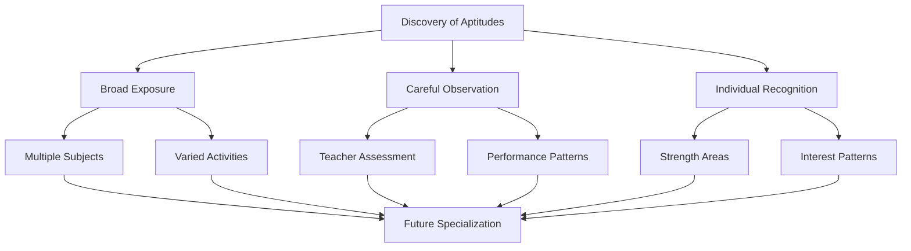
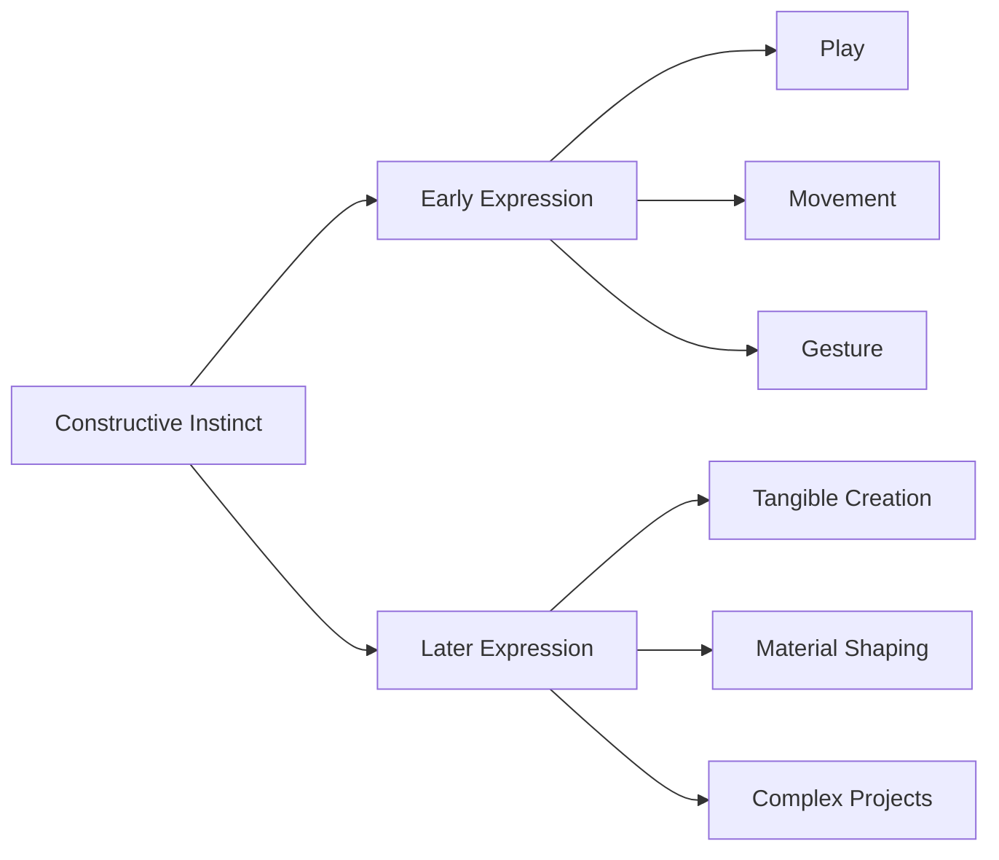

# School and the Life of Children: Aims and Philosophy

## Introduction

Middle childhood represents the golden age of formal education, when children's minds are optimally prepared for systematic learning, skill acquisition, and intellectual development. Between ages 6 and 11, schooling serves as the primary vehicle for transmitting cultural knowledge, developing cognitive abilities, and shaping character. This period bridges the informal learning of early childhood with the specialized education of adolescence, making the philosophy and aims of elementary education critically important for lifelong development.

The question of what schools should accomplish and how they should educate children has occupied philosophers and educators for centuries. Two influential voices—Bertrand Russell and John Dewey—offer complementary yet distinct perspectives on the aims and methods of education during middle childhood, providing frameworks that continue to shape educational practice today.

## Bertrand Russell's Aims of Education

Bertrand Russell (1872-1970), the British philosopher, mathematician, and social critic, articulated a comprehensive philosophy of education in his 1926 work "On Education: Especially in Early Childhood." His perspective emphasized systematic knowledge acquisition while respecting children's developmental readiness.

### The Four Primary Aims

Russell identified four fundamental purposes that should guide education during the early school years:

#### 1. Cultivation of Intelligence

**Definition and Importance:**

Russell defined intelligence as encompassing both **actual knowledge** (what one knows) and **receptivity to knowledge** (capacity to learn). He argued that cultivating intelligence represents education's most essential purpose, as our complex modern world cannot exist, much less progress, without intellectual development.

**Key Principles:**
- Intelligence cannot be trained without imparting information
- Knowledge and thinking skills develop together, not sequentially
- Real understanding comes from connecting new information to existing knowledge
- Critical thinking emerges from engaging with substantial content

**Educational Implications:**
- Curriculum must include substantive content, not just skills
- Children need exposure to various domains of knowledge
- Teaching methods should encourage questioning and reasoning
- Learning experiences should connect to children's existing understanding

#### 2. Discovery of Special Aptitudes

**Purpose:**

Education should identify each child's particular talents and abilities so these can be carefully developed in later years. Not all children excel in the same areas, and recognizing individual differences represents good educational practice.

**Areas of Aptitude:**
- **Mathematical/Logical**: Facility with numbers, patterns, logical reasoning
- **Linguistic**: Exceptional verbal abilities, love of language
- **Artistic**: Musical, visual, or performance talents
- **Physical**: Athletic abilities, fine motor skills
- **Social**: Leadership, empathy, interpersonal understanding
- **Mechanical**: Understanding how things work, building, creating

**Educational Approach:**
- Provide diverse experiences across multiple domains
- Observe children's responses to different subjects and activities
- Note areas where children show enthusiasm and natural facility
- Avoid premature specialization while recognizing strengths
- Create opportunities for talents to emerge organically

#### 3. Base Subjects for All

**Principle:**

Everyone should learn fundamental subjects, which need not be pursued by those who are bad at them beyond basic competence. This recognizes that while some subjects are essential for all educated persons, not everyone needs advanced mastery of every domain.

**Base Subjects Include:**
- Reading and comprehension
- Writing and communication
- Basic mathematics
- Elementary science understanding
- Geography and basic history
- Physical education and health

**Two Determining Principles:**

**First Principle - What Children Ought to Know:**
- Essential knowledge for functioning in society
- Cultural literacy and shared knowledge base
- Skills needed for further learning
- Understanding necessary for citizenship

**Second Principle - Order of Teaching:**
- Teach the easiest subjects first
- Progress from concrete to abstract
- Build on existing knowledge
- Match content to developmental readiness

#### 4. Age-Appropriate Challenges

**Critical Guideline:**

"Anything involving severe mental effort should not be undertaken before the age of seven."

**Rationale:**
- Young children's brains are still developing
- Cognitive stamina increases with maturation
- Premature pressure can create negative associations with learning
- Foundation-building takes precedence over advanced achievement

**Practical Application:**
- Early elementary focus on skill-building, not intensive study
- Gradual increase in mental demands
- Plenty of active, hands-on learning
- Balance between challenge and achievability
- Protection against academic overload

### Russell's Developmental Perspective

Russell's philosophy recognized that education must align with children's developmental capabilities:

**Before Age 7:**
- Focus on play-based learning
- Sensory and motor development
- Basic skill introduction (letters, numbers)
- Social and emotional foundation
- Limited sustained mental effort

**Ages 7-11 (Middle Childhood):**
- Systematic skill development (3 Rs)
- Gradual introduction of subject matter
- Increased but still limited mental effort
- Cultivation of curiosity and interest
- Foundation for future specialization

**After Age 11:**
- More sustained intellectual work
- Subject specialization begins
- Abstract reasoning develops
- Advanced content becomes accessible
- Preparation for secondary education

## John Dewey's Child-Centered Philosophy

John Dewey (1859-1952), American philosopher, psychologist, and educational reformer, offered a radically different approach to education that emphasized children's natural learning processes and the social purposes of schooling.

### Dewey's Core Principle

**Education Centered on the Life of the Child:**

Dewey argued that education should adopt the spontaneous ways children naturally use to learn from their surroundings, rather than imposing external structure on passive recipients.

**Revolutionary Insight:**

"The young child is already running over, spilling over with the activities of all kinds. He is not purely latent being whom the adult has to approach with great caution and skill in order gradually to draw out some hidden germ of activity."

**Implications:**
- Children are active, not passive learners
- Energy and curiosity are already present
- Education's role is **direction**, not extraction
- Learning builds on existing activities and interests

### The Five Fundamental Instincts

Dewey identified five instincts that educators must recognize and shape through appropriate experiences:

#### 1. Social Instinct

**Manifestation:**
- Shown in conversation and personal intercourse
- Communication and interaction with others
- Desire to share experiences
- Interest in group activities

**Educational Response:**
- Create collaborative learning environments
- Encourage discussion and sharing
- Use group projects and activities
- Develop communication skills

#### 2. Language Instinct

**Nature:**
- The simplest form of social expression
- The greatest of all educational resources
- Natural vehicle for thought and communication

**Educational Approach:**
- Rich verbal environment
- Encourage expression in multiple forms
- Read aloud frequently
- Provide authentic communication purposes
- Develop both oral and written language

#### 3. Constructive Instinct

**Expression:**
- The instinct of making and creating
- First expressed in play, movement, gesture, make-believe
- Later becomes more definite
- Seeks outlet in shaping materials into tangible forms

**Educational Applications:**
- Hands-on activities and projects
- Building, crafting, creating
- Manipulation of materials
- Design and construction tasks
- Art and craft activities

#### 4. Investigation Instinct (Curiosity)

**Characteristics:**
- Children have limited instinct for abstract inquiry initially
- Grows from combining constructive impulse with conversational needs
- No difference to child between experimental science and carpentry

**Educational Implications:**
- Provide opportunities for exploration
- Support questioning and wondering
- Hands-on investigation and experimentation
- Practical rather than theoretical approach
- Learning by doing

#### 5. Expressive or Art Instinct

**Development:**
- Grows out of communicating and constructive instincts
- Their refinement and full manifestation
- Makes construction adequate, full, free, and flexible
- Gives social motive to creative work

**Educational Support:**
- Multiple forms of expression (visual, musical, dramatic, kinesthetic)
- Refinement through practice and exposure
- Social sharing of creative work
- Integration of arts across curriculum

### Dewey's Vision of Schooling

**Purpose of Schooling:**

Provide full bloom to children's instincts in healthy ways. By recognizing fields of interest, education furthers development in directions that may give children purpose in life.

**The School as Embryonic Society:**

Dewey envisioned school as a miniature community where children learn through genuine participation in social life, not just preparation for future adult roles.

**Key Principles:**

1. **Learning by Doing**: Knowledge comes through active engagement, not passive reception
2. **Social Learning**: Education is fundamentally social in nature
3. **Integration**: Subjects should connect rather than remain isolated
4. **Relevance**: Learning connects to children's lives and interests
5. **Democratic Practice**: Schools should model democratic participation

## Comparing Russell and Dewey

While Russell and Dewey shared concern for children's welfare and appropriate education, their philosophies differed in significant ways:

### Areas of Agreement

**Child Development Focus:**
- Both recognized developmental stages and readiness
- Both opposed inappropriate intellectual demands on young children
- Both valued children's natural curiosity

**Broad Education:**
- Both supported well-rounded education
- Both included arts, physical education, and academics
- Both opposed narrow, exam-focused approach

### Key Differences

| Aspect | Russell | Dewey |
|--------|---------|-------|
| **Knowledge** | Systematic transmission of cultural knowledge | Knowledge emerges from purposeful activity |
| **Teacher Role** | Expert guide imparting organized content | Facilitator of child-directed learning |
| **Curriculum** | Structured subjects in logical sequence | Integrated projects based on interests |
| **Methods** | Direct instruction balanced with exploration | Learning by doing, experiential education |
| **Discipline** | Necessary for systematic learning | Natural result of engaged activity |
| **Goals** | Cultivating intelligence and transmitting culture | Social cooperation and personal growth |

### Contemporary Synthesis

Modern educational practice often attempts to synthesize these perspectives:

- **Balanced Approach**: Systematic instruction plus child-centered exploration
- **Structured Freedom**: Clear learning goals with flexible methods
- **Teacher as Guide**: Expert who facilitates rather than merely tells
- **Active Learning**: Hands-on activities structured around learning objectives
- **Integration**: Subject connections while maintaining disciplinary integrity

## The Role of the Teacher

Both Russell and Dewey recognized the teacher's critical importance, though they conceived the role differently:

### Russell's Conception

**Teacher as Knowledgeable Guide:**
- Possesses deep subject matter knowledge
- Organizes content for optimal learning
- Structures progression from simple to complex
- Models intellectual virtues and curiosity
- Balances challenge with encouragement

### Dewey's Conception

**Teacher as Facilitator and Social Architect:**
- Understands child development and interests
- Creates environment for exploration
- Guides rather than directs learning
- Connects activities to subject matter
- Supports social cooperation

### Universal Teacher Qualities

Regardless of philosophical approach, effective elementary teachers demonstrate:

**Content Knowledge:**
- Deep understanding of subjects taught
- Ability to explain concepts multiple ways
- Recognition of common misconceptions
- Connection-making across domains

**Pedagogical Skill:**
- Understanding of how children learn
- Repertoire of teaching strategies
- Assessment and adjustment abilities
- Classroom management competence

**Personal Qualities:**
- Patience and empathy
- Enthusiasm for learning
- Respect for children
- Commitment to growth

**Professional Disposition:**
- Continuous learning and improvement
- Reflection on practice
- Collaboration with colleagues
- Responsiveness to individual needs

## Contemporary Educational Perspectives

Modern research and practice have built on and refined Russell's and Dewey's insights:

### Cognitive Science Contributions

**Information Processing:**
- Working memory limitations affect learning
- Prior knowledge crucial for new learning
- Practice and repetition necessary for skill mastery
- Spaced practice more effective than massing

**Developmental Readiness:**
- Concrete operations characterize middle childhood thinking
- Abstract reasoning emerges gradually
- Individual variation in developmental timing
- Zone of proximal development guides instruction

### Constructivist Approaches

**Building on Dewey:**
- Children construct understanding through active engagement
- Social interaction supports cognitive development
- Hands-on, minds-on learning
- Authentic problems and projects

**Modern Adaptations:**
- Project-based learning
- Inquiry-based science
- Workshop approaches to literacy
- Collaborative learning structures

### Direct Instruction Research

**Building on Russell:**
- Explicit teaching of skills and content
- Systematic progression through curriculum
- Clear explanations and modeling
- Guided practice before independence

**Evidence-Based Practices:**
- Phonics instruction for reading
- Explicit strategy instruction
- Worked examples in mathematics
- Scaffolded support with gradual release

### Balanced Literacy and Mathematics

Contemporary best practice often integrates multiple approaches:

**In Literacy:**
- Systematic phonics instruction (Russell)
- Authentic reading and writing (Dewey)
- Explicit comprehension strategy teaching
- Rich literary experiences
- Integration across curriculum

**In Mathematics:**
- Procedural fluency development
- Conceptual understanding through manipulatives
- Problem-solving applications
- Mathematical reasoning and discourse

## Implications for Modern Elementary Education

### Curriculum Design

**Balanced Approach:**
- Core academic subjects with systematic development
- Integration opportunities across disciplines
- Arts, physical education, and enrichment
- Social-emotional learning components

**Developmental Appropriateness:**
- Match content to cognitive capabilities
- Gradual increase in abstract thinking
- Concrete, hands-on experiences
- Active rather than passive learning

### Instructional Methods

**Varied Approaches:**
- Direct instruction for skill development
- Discovery learning for concept formation
- Collaborative projects for social learning
- Individual practice for mastery
- Technology as tool, not replacement

**Student-Centered Elements:**
- Choice within structure
- Interest-based activities
- Real-world connections
- Purposeful learning activities

### Assessment Practices

**Multiple Measures:**
- Formative assessment during learning
- Summative evaluation of achievement
- Observation of process and engagement
- Recognition of diverse aptitudes

**Purpose-Driven Assessment:**
- Guide instruction, not just rank students
- Identify strengths and needs
- Support growth mindset
- Inform teaching decisions

## Cultural and Individual Considerations

Modern education must also address dimensions Russell and Dewey didn't fully consider:

### Cultural Responsiveness

- Recognition of diverse family backgrounds
- Culturally relevant curriculum content
- Multiple perspectives in subject matter
- Respect for home languages and cultures

### Individual Differences

- Learning disabilities and special needs
- Gifted and talented students
- English language learners
- Social-emotional challenges
- Economic disparities

### 21st Century Skills

- Digital literacy
- Critical thinking and problem-solving
- Collaboration and communication
- Creativity and innovation
- Global awareness

---

**Source PDFs**: 
- 📄 [Block-2/Unit-3.pdf - Pages 35-44](/pdfs/MPC-002%20Life%20Span%20Psychology/Block-2/Unit-3.pdf)
- 📚 MPC-002 Life Span Psychology

## Self-Assessment Questions

1. **True/False**: According to Russell, anything involving severe mental effort should not be undertaken before age seven.

2. **Multiple Choice**: Which of Dewey's five instincts is described as "the greatest of all educational resources"?
   a) Social instinct
   b) Language instinct
   c) Constructive instinct
   d) Investigation instinct

3. **Short Answer**: Explain the difference between Russell's and Dewey's views on the role of the teacher.

4. **Application**: A first-grade teacher notices a student shows exceptional facility with numbers but struggles with reading. Using Russell's framework, how should the teacher respond?

5. **Critical Thinking**: Dewey argued that children are "running over, spilling over with activities." How does this view challenge traditional conceptions of education?

6. **Analysis**: Modern education often tries to balance systematic instruction with child-centered learning. Give two examples of how this might look in practice.

7. **Comparison**: Create a comparison showing how Russell and Dewey would approach teaching geography to third-graders.

## Memory Aids

### Russell's Four Aims: "CIAB"
- **C**ultivation of intelligence
- **I**dentification of aptitudes
- **A**ll learn base subjects
- **B**efore 7, avoid severe effort

### Dewey's Five Instincts: "SLICE"
- **S**ocial (conversation, interaction)
- **L**anguage (communication)
- **I**nvestigation (curiosity)
- **C**onstructive (making, building)
- **E**xpressive (artistic refinement)

### Remember Teaching Principles: "DRAM"
- **D**evelopmentally appropriate
- **R**espect natural instincts
- **A**ctive rather than passive
- **M**atch methods to aims

## Further Learning

### Educational Videos

1. **John Dewey's Philosophy of Education**
   - [Philosophy Tube - Dewey](https://www.youtube.com/watch?v=VdH_T3m2Z5s)
   - Overview of Dewey's educational philosophy

2. **Progressive Education Explained**
   - [Crash Course - Progressive Education](https://www.youtube.com/watch?v=5cH_DwQdDm0)
   - History and principles of child-centered education

### External Resources

1. **[Stanford Encyclopedia of Philosophy - John Dewey](https://plato.stanford.edu/entries/dewey/)**
   - Comprehensive academic overview of Dewey's philosophy

2. **[Wikipedia: Bertrand Russell](https://en.wikipedia.org/wiki/Bertrand_Russell#Education)**
   - Section on Russell's educational philosophy

3. **[Progressive Education Network](https://progressiveeducationnetwork.org/)**
   - Modern applications of progressive principles

4. **[Association for Supervision and Curriculum Development (ASCD)](https://www.ascd.org/)**
   - Educational research and best practices

5. **[John Dewey Society](http://www.johndeweysociety.org/)**
   - Organization dedicated to Dewey's educational ideas

6. **[Philosophy of Education Society](https://educationphilosophy.org/)**
   - Academic organization exploring educational philosophy

### Recent Research Papers

1. Labaree, D. F. (2023). "Someone Has to Fail: The Zero-Sum Game of Public Schooling and Progressive Education." *Educational Theory*, 73(1), 45-62.

2. Simpson, D. J., Jackson, M. J., & Aycock, J. C. (2023). "John Dewey's Concept of the Student and the Role of the Teacher in Education." *Studies in Philosophy and Education*, 42(2), 203-221.

3. Noddings, N. (2024). "Philosophy of Education in Classical Pragmatism." *Oxford Research Encyclopedia of Education*. Oxford University Press.

4. Boisvert, R. D. (2023). "Dewey's Metaphysics and the Self." *Transactions of the Charles S. Peirce Society*, 59(2), 147-165.

5. Garrison, J., Neubert, S., & Reich, K. (2024). "Democracy and Education Reconsidered: Dewey After One Hundred Years." *Education and Culture*, 40(1), 5-25.