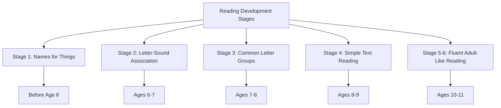
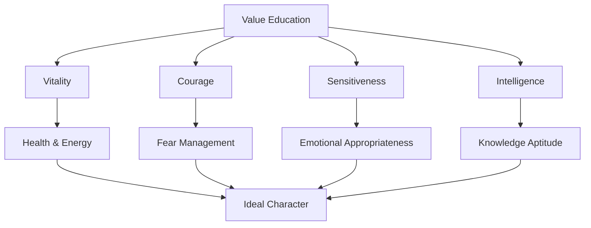

# Basic Skills, Subjects, and Value Education

## Introduction

Middle childhood education encompasses three interconnected dimensions: fundamental skills (the "3Rs" plus computer literacy), subject matter knowledge (geography, history, science, languages), and character development (value education). Together, these create well-rounded individuals prepared for both further education and meaningful participation in society.

## Part 1: Basic School Skills - The 3Rs and Computer

### Learning to Read

Reading represents the foundational intellectual skill upon which all other academic learning depends. A child's performance across all subjects relies on successful reading comprehension.

**Progressive Development of Reading:**

**Components of Good Reading:**
- Clear pronunciation
- Adequate voice modulation
- Recognition of emotional overtones in text
- Proper recognition of pauses
- Adequate speed for listener comprehension

**Teaching Strategies:**
- Enacting literary works (stories, dramas)
- Reading aloud to children
- Providing books matched to interest and ability
- Creating authentic purposes for reading
- Avoiding forced, boring practice

**Individual Differences:**
Some children may lack initial motivation for reading. For such children, having family members read interesting books at home proves more effective than forced school practice.

### Learning to Write

Writing skills develop through practice and organized planning, though educators debate the optimal approach.

**Two Philosophical Approaches:**

**Dewey's Spontaneous Development:**
- Writing emerges from expressing thoughts and experiences
- Language guided by real experiences and ideas
- Social context drives communication need
- Children always have something to say

**Russell's Literature-Based Approach:**
- Reading good literature creates mental models
- Expression should come spontaneously but requires foundation
- Intimate knowledge of good literature generates habits of thought
- Modern society has lost primitive aesthetic impulses

**Effective Writing Practices:**

1. **Base on Experience**: Writing exercises should connect to children's personal or classroom activities

2. **Teach Multiple Purposes**: Children should know writing serves different functions:
   - Recording ideas
   - Imaginative creation
   - Requesting information
   - Entertainment

3. **Pre-Writing Discussion**: Discuss purpose and provide elaboration points before assignment

4. **Uninterrupted Composition**: Once writing begins, don't interrupt the flow

5. **Revision Time**: Provide opportunity to reorganize and re-evaluate

6. **Display All Work**: Publish/display papers from all students, not just top performers

7. **Integration**: Plan reading and oral exercises around writing activities

### Developing Math Skills

"Arithmetic is a bugbear of childhood - I remember weeping bitterly because I could not learn the multiplication table" (Russell)

**Russell's Perspective:**

Mathematics, tackled gradually and carefully, need not cause despair. Arithmetic provides natural introduction to **accuracy** - answers are either right or wrong, never "interesting" or "suggestive." This aspect makes arithmetic important in early education.

**Key Principles:**
- Difficulties should be carefully graded
- Not too much time at a stretch devoted to mathematics
- Concrete objects aid learning more than paper-pencil methods
- Training with abacus shows tremendous improvement in computation

**Developmental Timeline:**
- **Ages 6-8**: Basic operations with concrete materials
- **Ages 9-11**: Increasing abstraction, mental arithmetic
- **After 11**: Introduction to formal geometry and algebra

**Modern Findings:**

Research shows teaching mathematics with manipulatives and concrete objects produces better results than abstract paper-pencil methods. Success with numbers improves speed and confidence across all school work.

### Computer Skills

Computer literacy has joined the traditional 3Rs as a basic skill for modern education.

**Two Functions:**

1. **Computer as Machine**: Understanding and mastering the technology itself
2. **Computer as Teaching Aid**: Using technology to support learning

**Recommended Approach:**

- **Before Age 14**: Not formal subject, but exploration opportunity
   - Provide access to machines
   - Allow free exploration
   - Let natural curiosity guide learning
- **Around Ages 11-12**: Most children familiar with basic operations
- **Age 14+**: Formal computer science instruction appropriate

**Cautions:**

Russell's concern about concentrated mental effort applies to computers. While computers reinforce learning and provide exploration opportunities, research (Greenfield, 1984) shows they don't necessarily accelerate knowledge acquisition. Excessive computer time may cause problems in normal physical and social development.

## Part 2: Teaching for Knowledge

### Geography

Geography encompasses places, lands, forests, rivers, mountains, weather, and Earth's features. Children show natural love for this knowledge through interest in trains, airplanes, and travel.

**Russell's Approach:**

When taught only through books and question-answers, natural curiosity for this vast knowledge domain is lost. Knowledge is difficult to impart without curiosity.

**Effective Teaching Methods:**

1. **Visual Learning**: Pictures and travelers' tales
2. **Cinema/Videos**: Showing what travelers see
3. **Progressive Instruction**:
   - Begin with pictures and stories
   - Progress to maps and illustrated information
   - Students create essays about different countries
   - Later stages incorporate more systematic study

**Integration with Experience:**
- Educational excursions to geographical features
- Observation of local environment
- Connection to students' travel experiences
- Use of maps and globes

### History

History should follow geography because sense of time is initially rudimentary compared to sense of space.

**Beginning History Instruction:**

Start with illustrated stories of eminent personalities:
- Rani Laxmi Bai, Raja Ram Mohan Roy, S. Radhakrishnan, Ramanujan (Indian)
- Newton, Columbus, Darwin (International)
- Use necessary simplifications, pictures, cinema
- Visit places of historical importance

**Two Relevant Aspects for Children:**

1. **General Pageant**: The progression from geology to humans, from savage to civilized life
   - Discovery of fire, writing, printing
   - Development of cities, architecture, agriculture, industries
   - Scientific and technological advances
   - Land and air travel

2. **Dramatic Story-Telling**: Incidents with sympathetic heroes
   - Rise and fall of civilizations
   - Wars and reconciliations
   - True conquerors: Buddha, Socrates, Archimedes, Galileo, Newton, Ambedkar, Gandhi

**Purpose:**

History creates a link between the individual and entire humanity. It shows human struggle against external chaos and internal darkness, celebrating those who dispelled both.

### Science Teaching

Basic science teaching at elementary level lays foundation for formal physics and chemistry after age 14.

**Russell's Perspective:**

Teaching science can contribute to imagination as much as poetry and stories - perhaps more if taught properly. Knowledge of:
- The sun and planets
- Functioning of machines
- Humans and nature
- Body and health
- Elementary principles

These create strong foundation for curiosity and scientific aptitude.

**"Learning by Doing" Approach:**

Teachers should practice this method to develop true spirit of:
- Observation
- Experimentation
- Hypothesis formation
- Testing and verification

### Language Teaching

Languages should be started at very young age. Middle childhood represents optimal period for perfect language acquisition, which becomes more difficult later.

**Effective Methods:**

1. **Play-Based Learning**: Games depending on understanding and responding in target language

2. **Problem-Solving Activities**: Puzzles requiring language comprehension

3. **Drama and Acting**: Plays in target language

4. **Conversational Practice**: Natural communication contexts

**Advantage:**

Languages learned during middle childhood are learned perfectly and with less waste of educational time than any subsequent period.

### Literature

Literature teaching serves dual purposes:

**1. Memory Training:**
- Learning poems and texts by heart
- Associated with acting enhances retention
- Material stays in thoughts long-term

**2. Developing Sensitivity:**
- Beauty of language in speech and writing
- Appreciation of literary forms
- Emotional resonance with texts

**Critical Principle:**

Good literature should give pleasure. If children cannot derive pleasure, they won't derive benefit. Content must be chosen carefully for age-appropriateness and interest.

## Part 3: Value Education

Education should develop ideal character. Russell identified four characteristics encompassing all other virtues:

### 1. Vitality

**Nature:**
- Rather physiological than mental
- Present where there's perfect health
- Pleasure in feeling alive, independent of circumstances

**Benefits:**
- Makes it easy to take interest in whatever occurs
- Promotes objectivity
- Interest in outside world
- Power for hard work
- Safeguard against envy

### 2. Courage

**Two Forms:**
1. **Absence of Fear**: Natural fearlessness
2. **Power of Controlling Fear**: Conscious management of fear responses

**Foundation:**

Combination of self-respect with impersonal outlook on life creates universal courage. Sources helping transcend self:
- Parental love
- Knowledge
- Art

**Ideal:**

"The perfection of courage is found in the man of many interests, who feels his ego to be but a small part of the world" (Russell)

**Development:**

Achievable when instinct is free and intelligence active.

### 3. Sensitiveness

**Purpose:**

Corrective of mere courage. Courageous behavior shouldn't be based on ignorance.

**Nature:**

Belongs to emotions. If sensitiveness is to be good, emotional reaction must be appropriate.

**Desirable Forms:**
- Pleasant behavior
- Sympathy
- Empathy
- Appropriate emotional responses

### 4. Intelligence

**Definition:**

Aptitude for acquiring knowledge, developed through both exercise and information.

**Development of Intelligence:**

We've discussed information through subjects. Aptitude for acquiring knowledge develops through:

**a) Direction of Curiosity:**
- Foundation of intellectual life
- Curiosity about general propositions shows higher intelligence than curiosity about particular facts

**b) Associated Habits:**
- Observation
- Belief in possibility of knowledge
- Patience and industry
- Open-mindedness
- Cooperation

**Natural Development:**

These develop naturally with proper intellectual education.

### Teaching Values

**Critical Understanding:**

Values cannot be imparted through books. Teacher's personality is essential. Emotions are contagious - values pass from teacher to student if the teacher:
- Practices these values
- Sincerely works for their cultivation
- Doesn't make students consciously aware of the exercise

### Discipline and Order

**Dewey's Perspective:**

Discipline depends on aims. If the aim is forty children learning set lessons for recitation, discipline must secure that result. But if the aim is developing spirit of social cooperation and community life, discipline must grow from and relate to that goal.

**Deeper Discipline:**

Found in constructive work directed toward purpose. School classroom should be like a busy workshop:
- No absolute silence
- Certain "disorder" from activity
- Bustle from engaged work
- Purposeful rather than enforced order

## Part 4: Other Subjects and Enrichment

### Physical Education

Physical education completes education alongside knowledge and values, serving dual purposes:

**1. Value Inculcation:**
- Being part of a team
- Working for common aim
- Natural development of cooperation

**2. Physical Growth:**
- Budding powers find full expression
- Physical movement supports overall development
- Health and fitness

**Broader Scope:**

Beyond sports, includes:
- Health education
- Hygiene practices
- Personal cleanliness
- Common disease prevention
- Safety awareness

### Teaching for Pleasure

**Dance:**
- Good for body and aesthetic training
- Great pleasure to children
- Collective dance teaches cooperation young children easily appreciate
- Natural movement expression

**Music:**
- Should begin slightly after dance (rudiments more difficult)
- Start with nursery rhymes
- Progress to beautiful songs
- More difficult singing reserved for older children
- Should not be enforced

Both activities provide:
- Physical coordination
- Aesthetic development
- Emotional expression
- Social experience
- Cultural transmission

### Educational Excursions

**Purpose:**

Make children familiar with their surroundings and processes involved in creating things they use.

**Examples:**

**Understanding Food Sources:**
- How crops are grown
- Agricultural processes
- From farm to table

**Manufacturing Processes:**
- How books are printed
- How products are made
- Industrial processes

**Community Resources:**
- Historical places
- Libraries and museums
- Natural environments (forests, fields)
- Cities and villages

**Critical Principle:**

If knowledge is first imparted through words, then children see the reality, natural curiosity may be lost. Words are still difficult for young children to fully convey life's colors and experiences. Direct experience should often precede or accompany verbal instruction.

**Alternatives:**

When trips aren't possible:
- Cinema/videos
- Pictures and photographs
- Virtual field trips
- Guest speakers

---

**Source PDFs**: 
- 📄 [Block-2/Unit-3.pdf - Pages 35-44](/pdfs/MPC-002%20Life%20Span%20Psychology/Block-2/Unit-3.pdf)
- 📚 MPC-002 Life Span Psychology

## Self-Assessment Questions

1. **True/False**: According to Russell, arithmetic provides natural introduction to accuracy because answers are either right or wrong.

2. **Multiple Choice**: The four characteristics of ideal character according to Russell are:
   a) Vitality, Courage, Intelligence, Creativity
   b) Vitality, Courage, Sensitiveness, Intelligence
   c) Health, Courage, Sympathy, Knowledge
   d) Energy, Bravery, Emotion, Thinking

3. **Short Answer**: Explain the two philosophical approaches to teaching writing (Dewey vs. Russell).

4. **Application**: A teacher wants to teach geography to third-graders. Using principles from this unit, design a lesson plan that engages natural curiosity.

5. **Critical Thinking**: Why does Russell suggest history should follow geography rather than being taught first?

6. **Analysis**: How do educational excursions support the principle of "learning by doing"? Provide specific examples.

7. **Comparison**: Compare Dewey's and Russell's views on discipline in the classroom.

## Memory Aids

### The 3Rs Plus: "RWM-C"
- **R**eading (foundation for all learning)
- **W**riting (expression and communication)
- **M**athematics (accuracy and logical thinking)
- **C**omputer (modern essential skill)

### Four Ideal Character Traits: "VCSI"
- **V**itality (health and energy)
- **C**ourage (managing fear)
- **S**ensitiveness (appropriate emotions)
- **I**ntelligence (acquiring knowledge)

### Subject Teaching Order: "GPS-LH"
- **G**eography (space understanding first)
- **P**hysical education (body and health)
- **S**cience (observation and experimentation)
- **L**anguage (optimal age for acquisition)
- **H**istory (time understanding develops later)

## Further Learning

### Educational Videos

1. **Teaching Reading in Elementary School**
   - [Reading Rockets - Effective Instruction](https://www.youtube.com/watch?v=YJ8TsM8aRMw)

2. **Math Manipulatives in Action**
   - [NCTM - Concrete Mathematics](https://www.youtube.com/watch?v=U8nM5V4VJCs)

### External Resources

1. **[Wikipedia: Reading Education](https://en.wikipedia.org/wiki/Reading_education_in_the_United_States)**

2. **[Wikipedia: Mathematics Education](https://en.wikipedia.org/wiki/Mathematics_education)**

3. **[National Geographic Education](https://www.nationalgeographic.org/education/)**

4. **[ReadWriteThink - Literacy Resources](http://www.readwritethink.org/)**

5. **[NCTM - Mathematics Teaching](https://www.nctm.org/)**

6. **[Character.org - Character Education](https://www.character.org/)**

7. **[Edutopia - Project-Based Learning](https://www.edutopia.org/project-based-learning)**

### Recent Research Papers

1. Shanahan, T. (2024). "Reading Comprehension Instruction: Where Are We Now?" *Reading Research Quarterly*, 59(1), 45-68.

2. Carpenter, T. P., Franke, M. L., & Levi, L. (2023). *Thinking Mathematically: Integrating Arithmetic and Algebra in Elementary School* (2nd ed.). Heinemann.

3. Liben, L. S., & Downs, R. M. (2023). "Geography for Young Children: Maps as Tools for Learning Environments." *Applied Developmental Science*, 27(2), 134-152.

4. Berkowitz, M. W., & Bier, M. C. (2024). "Character Education: What Works and Why." *Review of Educational Research*, 94(1), 89-123.

5. Bailey, D. H., et al. (2023). "The Importance of Number Sense in Elementary Mathematics Achievement." *Journal of Educational Psychology*, 115(4), 567-589.