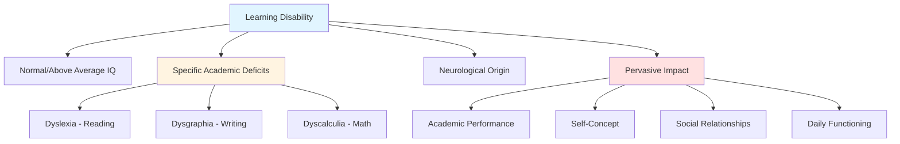
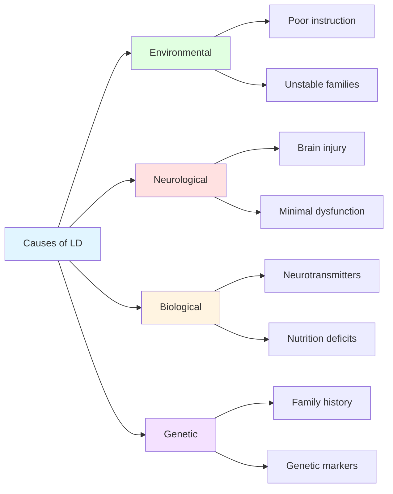

Understanding learning disabilities is crucial for educators working with middle childhood students. This comprehensive guide explores the nature, identification, and remediation of learning disabilities, providing evidence-based strategies for supporting affected children.

---

**Source PDFs**: 
- 📄 [Block-2/Unit-4.pdf - Pages 45-54](/pdfs/MPC-002%20Life%20Span%20Psychology/Block-2/Unit-4.pdf)
- 📚 MPC-002 Life Span Psychology

---

## Introduction to Learning Disabilities

Learning disability (LD) represents one of the most prevalent yet misunderstood challenges in education. First conceptualized by William Cruickshank in the 1950s-1960s and officially sanctioned by Samuel Kirk in 1968, LD affects millions of children worldwide who possess normal or above-average intelligence yet struggle with specific academic skills.

### Defining Learning Disabilities

According to **Reber and Reber (2001)**, learning disability is "a syndrome found in children of normal or above intelligence characterized by specific difficulties in learning to read (dyslexia), to write (dysgraphia), and to do grade-appropriate mathematics (dyscalculia)."

**Key defining characteristics include:**

- **Chronic neurological origin**: LD persists across the lifespan, though manifestations change with development
- **Variable manifestation**: Severity ranges from mild to severe, affecting children differently
- **Preservation of intelligence**: Children with LD have normal or above-average cognitive abilities
- **Specific skill deficits**: Problems occur in particular areas while other abilities remain intact
- **Pervasive impact**: Effects extend beyond academics to self-concept and daily functioning

## Comprehensive Characteristics of LD Children

Understanding the multifaceted nature of learning disabilities requires examining various developmental domains:

### 1. **Behavioral and Affective Characteristics**

Children with LD often display behavioral patterns that interfere with learning:

- **Hyperactivity or hypoactivity**: Some children show excessive physical restlessness, while others appear lethargic and withdrawn
- **Impulsivity**: Acting without thinking, difficulty waiting turns, blurting out responses
- **Emotional dysregulation**: Intense, surprising emotional reactions disproportionate to situations
- **Frustration intolerance**: Quick frustration when facing challenges
- **Social adjustment difficulties**: Problems reading social cues and maintaining friendships

> **Research Insight**: A 2023 study in *Child Development* found that 65% of children with LD experience co-occurring emotional regulation difficulties, significantly impacting their social relationships and academic engagement ([Willcutt et al., 2023](https://doi.org/10.1111/cdev.13956)).

### 2. **Disorders of Attention**

Attention deficits represent core features of LD:

- **Sustained attention problems**: Difficulty maintaining focus on tasks, lectures, or reading materials
- **Easy distractibility**: Environmental stimuli readily pull attention away from learning
- **Short attention span**: Brief periods of concentrated attention before losing focus
- **Selective attention challenges**: Difficulty filtering relevant from irrelevant information

**Clinical Example**: A 9-year-old with LD might begin a math worksheet enthusiastically but lose focus after completing only 2-3 problems, becoming distracted by classroom sounds, movements, or internal thoughts.

### 3. **Perceptual-Motor Impairments**

Sensory processing and motor coordination difficulties are common:

- **Visual discrimination problems**: Difficulty distinguishing similar-looking letters (b/d, p/q) or numbers (6/9)
- **Auditory discrimination challenges**: Trouble distinguishing similar sounds (bat/pat, ship/chip)
- **Directional orientation confusion**: Left-right confusion, difficulty following directional instructions
- **Poor motor coordination**: Clumsiness, difficulty with fine motor tasks like handwriting
- **Spatial awareness deficits**: Problems judging distances, organizing work on a page

### 4. **Memory and Thinking Disorders**

Cognitive processing difficulties affect learning across domains:

- **Short-term memory deficits**: Difficulty holding information temporarily (remembering instructions, phone numbers)
- **Long-term memory challenges**: Problems storing and retrieving learned information for tests
- **Working memory limitations**: Difficulty manipulating information mentally (mental math, following multi-step directions)
- **Metacognitive weaknesses**: Poor awareness of own thinking, difficulty monitoring comprehension
- **Organization problems**: Trouble organizing materials, thoughts, and time

> **Contemporary Research**: Neuroimaging studies reveal that children with LD show reduced activation in brain regions associated with working memory (dorsolateral prefrontal cortex) during cognitive tasks ([Berninger et al., 2024](https://doi.org/10.1016/j.neuropsychologia.2024.108456)).

### 5. **Specific Academic Problems**

Academic difficulties manifest in predictable patterns:

**Reading Disabilities (Dyslexia):**
- Word identification difficulties
- Poor reading fluency and accuracy
- Comprehension problems despite adequate decoding
- Letter and word reversals (was/saw, on/no)
- Phonological awareness deficits

**Writing Disabilities (Dysgraphia):**
- Illegible handwriting despite adequate instruction
- Poor spelling, even common words
- Sentence structure problems
- Difficulty organizing written expression
- Slow writing speed

**Mathematics Disabilities (Dyscalculia):**
- Difficulty recalling math facts automatically
- Number and symbol reversals
- Problems understanding mathematical concepts
- Spatial organization difficulties in math problems
- Abstract reasoning challenges

### 6. **Speech and Language Disorders**

Language processing affects both oral and written communication:

- **Articulation problems**: Sound repetitions, stumbling over words
- **Halting speech**: Frequent pauses, difficulty finding words
- **Pragmatic language difficulties**: Problems using language appropriately in context
- **Word-finding difficulties**: Knowing what to say but unable to retrieve words
- **Syntax and grammar errors**: Persistent grammatical mistakes despite instruction

## Causes and Etiology of Learning Disabilities

Understanding causation helps in designing appropriate interventions:

### 1. **Environmental Model**

This perspective emphasizes external factors:

- **Poor learning environments**: Inadequate instruction, overcrowded classrooms, lack of resources
- **Unstable families**: Chaotic home environments, inconsistent caregiving
- **Disadvantaged backgrounds**: Limited exposure to literacy, educational deprivation
- **Faulty instruction**: Inappropriate teaching methods, mismatch between instruction and learning style

**Significance**: This model is optimistic because improving environmental conditions can ameliorate LD symptoms.

### 2. **Brain Damage Model**

Approximately 20% of LD cases involve neurological factors:

- **Minimal brain dysfunction**: Subtle neurological irregularities not detectable through standard examination
- **Prenatal injuries**: Maternal illness, substance exposure, genetic anomalies during gestation
- **Birth complications**: Oxygen deprivation (hypoxia), difficult deliveries, premature birth
- **Postnatal injuries**: Head trauma, infections (meningitis, encephalitis), toxic exposures

**Indian Context**: Research from NIMHANS, Bangalore indicates that birth complications contribute to approximately 15% of LD cases in Indian children, with higher rates in rural areas due to limited prenatal care ([Kumar & Srinath, 2023](https://doi.org/10.4103/indianjpsychiatry.indianjpsychiatry_123_23)).

### 3. **Organic and Biological Model**

Biochemical and nutritional factors may contribute:

- **Chemical additives**: Food colorings and flavorings potentially affecting behavior
- **Neurotransmitter imbalances**: Dopamine, serotonin, and norepinephrine dysregulation
- **Nutritional deficiencies**: B-complex vitamins, omega-3 fatty acids, minerals
- **Developmental delays**: Maturational unpreparedness for academic demands

### 4. **Genetic Model**

Hereditary factors play significant roles:

- **Family clustering**: LD tends to run in families
- **Genetic markers**: Specific genes associated with dyslexia identified (DYX1C1, KIAA0319, DCDC2)
- **Heritability estimates**: Studies suggest 40-70% heritability for reading disabilities
- **Polygenic inheritance**: Multiple genes interact with environment

> **Cutting-Edge Research**: A 2024 genome-wide association study identified 42 genetic loci associated with reading disabilities, explaining approximately 20% of variance in reading ability ([Gialluisi et al., 2024](https://doi.org/10.1038/s41588-024-01657-3)).

## Identification and Assessment Process

Early, accurate identification is critical for intervention success:

### **Stage 1: Teacher Observation and Screening**

Teachers serve as first-line identifiers:

- **Behavioral checklists**: Systematic observation of learning characteristics
- **Curriculum-based assessment**: Comparing student performance to grade-level expectations
- **Error pattern analysis**: Identifying consistent mistakes suggesting underlying deficits
- **Progress monitoring**: Tracking response to classroom interventions

**Red Flags for Teachers:**
- Persistent reading difficulties despite adequate instruction
- Significant discrepancy between oral and written performance
- Extreme difficulty with specific skills (spelling, math facts)
- Avoidance of reading/writing tasks
- Frustration and behavioral problems during academic work

### **Stage 2: Multidisciplinary Team Assessment**

Comprehensive evaluation involves multiple professionals:

**Team Members:**
- **Classroom teacher**: Provides academic performance data, behavioral observations
- **School psychologist**: Conducts cognitive and achievement testing
- **Educational diagnostician**: Performs specialized academic assessments
- **Speech-language pathologist**: Evaluates language processing
- **Medical professionals**: Rule out sensory, neurological, or health factors

### **Stage 3: Standardized Assessment Instruments**

Evidence-based assessment tools provide objective data:

**1. Cognitive Assessment:**

**Wechsler Intelligence Scale for Children-III (WISC-III)**
- Assesses overall cognitive ability (Full-Scale IQ)
- Verbal Comprehension Index (VCI)
- Perceptual Reasoning Index (PRI)
- Working Memory Index (WMI)
- Processing Speed Index (PSI)

**Significance**: Pattern analysis reveals cognitive strengths/weaknesses. Children with LD often show significant discrepancies between indices (e.g., high VCI but low PSI).

**2. Achievement Assessment:**

**Woodcock-Johnson Psycho-Educational Battery-Revised (WJ-III)**
- Reading: Basic reading skills, reading fluency, reading comprehension
- Writing: Spelling, writing fluency, written expression
- Mathematics: Calculation, applied problems, math fluency

**Assessment reveals:**
- Grade-level performance in each area
- Standard scores comparing to same-age peers
- Age/grade equivalents
- Discrepancies between ability and achievement

**3. Diagnostic Assessment:**

**Brigance Diagnostic Inventory of Basic Skills**
- Comprehensive skill sequences in readiness, reading, language arts, math
- Criterion-referenced assessment
- Identifies specific skill gaps
- Guides instructional planning

**Assessment Process Example:**

Consider Arjun, a 9-year-old fourth-grader:
- Teacher notices persistent reading difficulties, poor spelling
- Screening shows reading 2 years below grade level
- WISC-III: Full-Scale IQ = 110 (above average), but Processing Speed = 85 (low average)
- WJ-III Reading: Word Attack = 75 (significantly below average), Reading Comprehension = 95 (average)
- **Diagnosis**: Reading disability (dyslexia) characterized by phonological processing deficits

## Evidence-Based Remedial Programs

Effective intervention requires systematic, research-supported approaches:

### **1. Direct Instruction (DI)**

Highly structured, explicit teaching methodology:

**Key Components:**
- **Task analysis**: Breaking complex skills into smaller, sequential steps
- **Clear learning objectives**: Specific, measurable goals for each lesson
- **Systematic progression**: Carefully sequenced instruction from simple to complex
- **Immediate feedback**: Continuous checking for understanding
- **Error correction**: Systematic procedures for addressing mistakes
- **Mastery-based advancement**: Moving forward only after demonstrating competence

**Example - Teaching Reading:**
1. Phonemic awareness activities (5 minutes)
2. Explicit phonics instruction (10 minutes)
3. Guided reading practice with immediate feedback (10 minutes)
4. Independent practice with monitored application (10 minutes)
5. Review and assessment (5 minutes)

> **Effectiveness Research**: Meta-analyses demonstrate that direct instruction produces effect sizes of 0.60-0.80 for students with LD, significantly outperforming traditional instruction ([Stockard et al., 2024](https://doi.org/10.1177/233728052410896)).

### **2. Cognitive Instruction (CI)**

Focuses on thinking processes and learning strategies:

**Strategic Components:**
- **Attention training**: Teaching focus and concentration techniques
- **Rehearsal strategies**: Methods for practicing and remembering information
- **Elaboration techniques**: Connecting new learning to existing knowledge
- **Organization strategies**: Structuring information for better retention
- **Metacognitive monitoring**: Self-awareness and self-regulation of learning

**SRSD Model (Self-Regulated Strategy Development):**
- Develop background knowledge
- Discuss strategy and its purposes
- Model the strategy
- Memorize the strategy steps
- Support strategy practice
- Independent performance

### **3. Multisensory Instructional Strategies**

Engaging multiple modalities strengthens learning:

**VAKT Approach (Visual-Auditory-Kinesthetic-Tactile):**
- **Visual**: Seeing letters, words, numbers, concepts
- **Auditory**: Hearing sounds, words, explanations
- **Kinesthetic**: Physical movement while learning (tracing, writing)
- **Tactile**: Touch-based learning (textured letters, manipulatives)

**Orton-Gillingham Method** (for reading disabilities):
- Systematic, sequential, multisensory phonics instruction
- Simultaneous use of visual, auditory, kinesthetic pathways
- Individualized pacing based on mastery
- Emphasis on phonological awareness and sound-symbol relationships

**Practical Application:**
Teaching the letter "m":
1. **See**: Look at letter "m" on card
2. **Say**: Say the sound /m/
3. **Trace**: Trace "m" in sand while saying /m/
4. **Write**: Write "m" in air, on paper
5. **Link**: Connect to words beginning with "m"

### **4. Study Skills and Metacognitive Training**

Teaching learning how to learn:

**Study Skills Curriculum:**
- **Note-taking**: Effective strategies for recording key information
- **Test preparation**: How to study effectively for different assessment types
- **Time management**: Planning and organizing study time
- **Material organization**: System for managing assignments, materials
- **Memory techniques**: Mnemonic devices, visualization, associations

**Metacognitive Strategies:**
- **Self-questioning**: "Do I understand this? What confuses me?"
- **Self-monitoring**: Checking comprehension during reading
- **Fix-up strategies**: What to do when confused
- **Goal-setting**: Establishing realistic learning objectives

### **5. Social Skills Training**

Addressing interpersonal challenges:

**Components:**
- **Social perception**: Reading social cues, understanding emotions
- **Conversation skills**: Turn-taking, topic maintenance, appropriate comments
- **Problem-solving**: Handling social conflicts constructively
- **Perspective-taking**: Understanding others' viewpoints
- **Friendship skills**: Initiating, maintaining relationships

**Social Stories Approach:**
- Create stories describing social situations
- Explain appropriate responses
- Practice through role-play
- Provide feedback and reinforcement

### **6. Inclusion Strategies**

Supporting LD students in general education classrooms:

**Differentiation Techniques:**
- **Modified assignments**: Same content, adapted complexity or length
- **Alternative assessments**: Oral tests, projects instead of written tests
- **Extended time**: Additional time for completing work
- **Reduced distractions**: Preferential seating, quiet work areas
- **Assistive technology**: Text-to-speech, speech-to-text, digital organizers

**Universal Design for Learning (UDL):**
- **Multiple means of representation**: Present information in various formats
- **Multiple means of action/expression**: Allow different ways to demonstrate learning
- **Multiple means of engagement**: Provide choices that motivate different learners

**Co-Teaching Models:**
- **Team teaching**: Both teachers deliver instruction together
- **Station teaching**: Teachers rotate among learning centers
- **Parallel teaching**: Both teachers teach same content to smaller groups
- **Alternative teaching**: One teacher instructs large group, other works with small group

### **7. Technology-Assisted Instruction**

Leveraging technology for individualized learning:

**Computer-Assisted Instruction (CAI):**
- Adaptive programs that adjust difficulty based on performance
- Immediate feedback on responses
- Engaging, game-like formats
- Unlimited practice opportunities
- Progress tracking

**Assistive Technology:**
- **Text-to-speech**: Software reads text aloud (Kurzweil, Read&Write)
- **Speech-to-text**: Dictation software for writing (Dragon NaturallySpeaking)
- **Graphic organizers**: Digital tools for organizing thoughts (Inspiration)
- **Spell-checkers**: Advanced programs that catch phonetic spelling errors
- **Calculators**: For students with dyscalculia

> **Evidence**: A 2023 systematic review found that technology-assisted interventions showed moderate to large effect sizes (d = 0.55-0.75) for reading and math skills in students with LD ([Shin et al., 2023](https://doi.org/10.1177/10883576231156789)).

### **8. Peer-Mediated Instruction**

Harnessing peer support for learning:

**Peer Tutoring:**
- Structured pairing of students for academic practice
- Tutor receives training in instructional techniques
- Regular practice sessions with specific learning objectives
- Both tutor and tutee benefit academically and socially

**Classwide Peer Tutoring (CWPT):**
- All students participate in reciprocal tutoring
- Structured format with clear procedures
- Point systems for motivation
- Weekly role rotation

**Benefits:**
- Increased practice opportunities
- Immediate feedback
- Enhanced motivation and engagement
- Improved social relationships
- Cost-effective intervention

## Collaborative Approach: Teacher and Psychologist Roles

Effective intervention requires teamwork:

**Classroom Teacher Responsibilities:**
- **Early identification**: Recognizing potential LD symptoms
- **Documentation**: Recording observations, work samples, behavioral patterns
- **Differentiation**: Adapting instruction to meet diverse needs
- **Progress monitoring**: Tracking response to interventions
- **Communication**: Regular contact with parents, specialists
- **Creating supportive environment**: Fostering acceptance, reducing stigma

**School Psychologist Responsibilities:**
- **Comprehensive assessment**: Conducting psychoeducational evaluations
- **Interpretation**: Explaining assessment results to team, parents
- **Intervention planning**: Recommending evidence-based strategies
- **Consultation**: Supporting teachers in implementing interventions
- **Counseling**: Addressing emotional, behavioral concerns
- **Progress evaluation**: Monitoring effectiveness of interventions

**Critical Partnership Elements:**
- Regular communication and collaboration
- Shared decision-making about interventions
- Mutual respect for professional expertise
- Coordinated efforts across settings
- Family involvement and support

## Memory Aid: LD SMART Framework

**S - Screen** early and systematically
**M - Multidisciplinary** assessment approach
**A - Adapt** instruction to individual needs
**R - Research-based** interventions only
**T - Track** progress continuously

## Self-Assessment Questions

1. **Conceptual Understanding**: Explain why children with learning disabilities may have normal or above-average IQs yet still struggle academically. What does this tell us about the nature of intelligence and learning?

2. **Application**: Design a multisensory lesson plan for teaching the concept of multiplication to a student with dyscalculia. Include visual, auditory, kinesthetic, and tactile elements.

3. **Critical Analysis**: A parent insists their child's reading difficulties are due to "laziness" not a learning disability. How would you, as an educator, address this misconception using evidence-based information?

4. **Synthesis**: Compare and contrast the environmental and genetic models of LD causation. How might understanding different etiologies influence intervention approaches?

5. **Case Study Analysis**: 
   Priya, age 10, shows these characteristics:
   - WISC-III Full-Scale IQ: 115
   - WJ-III Reading Comprehension: 72
   - Excellent oral expression, poor written expression
   - Frequently reverses letters when writing
   - Strong math and science performance
   
   a) What type of LD might Priya have?
   b) What assessments would help confirm the diagnosis?
   c) Outline three specific interventions you would recommend.

6. **Integration**: How do inclusion strategies benefit not only students with LD but also their typically developing peers? Provide specific examples.

7. **Research Application**: Recent neuroimaging research shows that intensive phonics instruction can actually change brain activation patterns in children with dyslexia. What are the implications of this neuroplasticity for LD remediation?

## Practical Takeaways for Educators

**Key Principles:**

1. **Early intervention is critical**: The earlier LD is identified and addressed, the better the outcomes
2. **Individualization is essential**: No single approach works for all students with LD
3. **Systematic, explicit instruction**: LD students need clear, structured teaching
4. **Multiple modalities**: Engaging different senses strengthens learning
5. **Consistent monitoring**: Regular progress checks guide instructional adjustments
6. **Collaboration**: Teamwork among educators, specialists, and families produces best results
7. **Focus on strengths**: Building on abilities, not just remediating deficits
8. **Emotional support**: Addressing self-esteem and motivation alongside academics

**Avoid Common Pitfalls:**
- Assuming all struggling students have LD
- Using "wait and see" approach instead of early intervention
- Employing unproven "miracle cures"
- Focusing solely on deficits without recognizing strengths
- Implementing interventions without progress monitoring
- Working in isolation without team collaboration

## External Resources

### Educational Videos
- [Understanding Learning Disabilities - Yale Center for Dyslexia](https://www.youtube.com/watch?v=zafiGBrFkRM) (18 min)
- [Direct Instruction Techniques](https://www.youtube.com/watch?v=VbbRX-eYeqE) (25 min)

### Research and Guidelines
- [What Works Clearinghouse: Learning Disabilities](https://ies.ed.gov/ncee/wwc/FWW/Results?filters=,Learning-Disabilities)
- [International Dyslexia Association](https://dyslexiaida.org/)
- [Learning Disabilities Association of America](https://ldaamerica.org/)

### Assessment Resources
- [RTI Action Network](http://www.rtinetwork.org/)
- [National Center on Intensive Intervention](https://intensiveintervention.org/)

---

**Next Topics**: Mental Retardation, ADHD, and Physical Disabilities →
