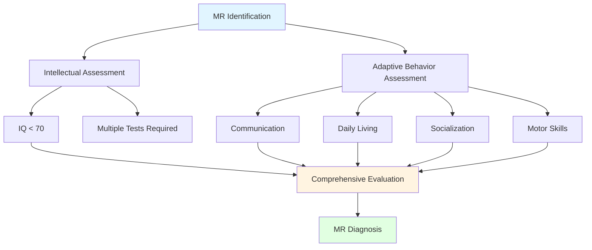

This comprehensive guide explores mental retardation, attention deficit hyperactivity disorder (ADHD), and physical disabilities in school-aged children, providing evidence-based assessment and intervention strategies.

---

**Source PDFs**: 
- 📄 [Block-2/Unit-4.pdf - Pages 51-57](/pdfs/MPC-002%20Life%20Span%20Psychology/Block-2/Unit-4.pdf)
- 📚 MPC-002 Life Span Psychology

---

## Mental Retardation (MR): Understanding and Assessment

### Defining Mental Retardation

Mental retardation represents a developmental condition characterized by significantly subaverage intellectual functioning combined with limitations in adaptive behavior. According to **Reber & Reber (2001)**, the concept "is based purely on IQ test scores; no judgments are made about origins or causes, about emotional, motivational, social or familial factors, or about prognosis."

**Diagnostic Criteria:**
- **IQ below 70** on standardized intelligence tests
- **Significant difficulties in adaptive functioning** across multiple domains
- **Onset during developmental period** (before age 18)

**Classification by Severity:**

| Level | IQ Range | Educational Potential | Adult Functioning |
|-------|----------|----------------------|-------------------|
| **Mild** | 50-70 | Educable (EMR) | Semi-independent living, competitive employment possible |
| **Moderate** | 35-49 | Trainable (TMR) | Supervised living, sheltered employment |
| **Severe** | 20-34 | Limited academic skills | Dependent care, basic self-help skills |
| **Profound** | Below 20 | Custodial care | Complete dependence for care |

### Causes and Etiology

**1. Physical Causes (Accounting for most severe/profound MR):**

**Genetic and Chromosomal Disorders:**
- **Down syndrome** (Trisomy 21): Most common chromosomal cause
- **Fragile X syndrome**: Leading inherited cause of intellectual disability
- **Phenylketonuria (PKU)**: Metabolic disorder causing brain damage if untreated
- **Prader-Willi syndrome, Williams syndrome**: Rare genetic conditions

> **Contemporary Research**: Advances in genetic testing now identify specific genetic causes in approximately 40% of MR cases, enabling early intervention and family counseling ([Vissers et al., 2024](https://doi.org/10.1038/s41576-024-00721-4)).

**Brain Damage:**
- **Prenatal**: Maternal infections (rubella, toxoplasmosis), substance exposure (alcohol, drugs), malnutrition
- **Perinatal**: Oxygen deprivation during birth, premature delivery, birth trauma
- **Postnatal**: Head injuries, infections (meningitis, encephalitis), toxic exposures (lead poisoning)

**2. Cultural-Familial Causes (More common in mild MR):**

These are "insidious" because they lack clear organic pathology:
- **Environmental deprivation**: Lack of cognitive stimulation, impoverished learning environments
- **Dysfunctional family systems**: Neglect, abuse, chaotic home environments
- **Socioeconomic disadvantage**: Limited access to education, healthcare, nutrition
- **Intergenerational patterns**: Parents with limited intellectual abilities

**Indian Context**: Studies from NIMHANS indicate that 40-50% of mild MR in India has cultural-familial origins, with malnutrition and limited educational opportunities as significant contributing factors ([Malhotra & Choudhury, 2023](https://doi.org/10.4103/indianjpsych.indianjpsych_456_23)).

### Identification and Assessment Process

#### **Dual Assessment Requirement**

Children must demonstrate deficits in BOTH areas for MR diagnosis:

**1. Intellectual Assessment:**

**Comprehensive Testing Protocol:**
- **Multiple assessment sessions** (never single test diagnosis)
- **Behavioral observations** across settings
- **Curriculum-based assessments** for academic skills
- **Interviews** with parents, teachers
- **Standardized intelligence tests**

**Key Intelligence Tests:**

**Stanford-Binet Intelligence Scale (5th Edition)**
- Age range: 2-85+ years
- Measures five factors: Fluid Reasoning, Knowledge, Quantitative Reasoning, Visual-Spatial Processing, Working Memory
- Yields Full-Scale IQ and factor scores

**Wechsler Intelligence Scale for Children-III (WISC-III)**
- Age range: 6-16 years
- **Verbal Comprehension Index (VCI)**: Language-based reasoning
- **Perceptual Reasoning Index (PRI)**: Visual-spatial processing
- **Working Memory Index (WMI)**: Attention, concentration
- **Processing Speed Index (PSI)**: Speed of mental processing

**Kaufman Assessment Battery for Children (K-ABC)**
- Reduces cultural/language bias
- Sequential vs. Simultaneous processing model
- Achievement subtests integrated

**2. Adaptive Behavior Assessment:**

Adaptive behavior represents practical, everyday skills necessary for independence. Assessment tools evaluate:

**Vineland Adaptive Behavior Scale (3rd Edition)**

**Domains Assessed:**
- **Communication**: Receptive, expressive, written language
- **Daily Living Skills**: Personal, domestic, community living
- **Socialization**: Interpersonal relationships, play/leisure, coping skills
- **Motor Skills**: Gross and fine motor (ages 0-6)
- **Maladaptive Behavior**: Optional scale for problem behaviors

**Administration**: Semi-structured interview with parent/caregiver

**Adaptive Behavior Scale-School (ABS-S)**

**Part I - Independent Functioning:**
- Physical development and coordination
- Economic activity
- Language development
- Numbers and time concepts
- Vocational activities
- Self-direction and responsibility
- Socialization skills

**Part II - Maladaptive Behavior:**
- Violent/destructive behavior
- Antisocial and rebellious behavior
- Withdrawal patterns
- Stereotyped and odd mannerisms
- Inappropriate interpersonal behavior
- Unacceptable vocal/personal habits
- Hyperactivity and psychological disturbances

### Remedial Measures and Educational Programs

#### **Early Intervention (Birth to Age 5)**

Focus: Family support and developmental stimulation
- Parent education on developmental milestones
- Home visitation programs
- Therapeutic services (physical, occupational, speech therapy)
- Preschool readiness activities

#### **School-Age Programs (6-21 years)**

**1. Inclusion Programs:**
- Educating MR students with typically developing peers
- Modified curriculum maintaining grade-level content
- Support services (paraprofessional aides, resource room)
- Social integration opportunities

**2. Resource Room Services:**
- Pull-out support for specific skill deficits
- Small group or individual instruction
- Remedial help while maintaining general education placement
- Supplemental materials and equipment

**3. Self-Contained Classrooms:**
- Separate classes for moderate/severe MR
- Specialized curriculum focusing on functional skills
- Lower student-teacher ratios (typically 8-12:1)
- Intensive, systematic instruction

**4. Functional Curriculum Approach:**

**Life Skills Focus:**
- **Self-care**: Hygiene, dressing, eating, toileting
- **Domestic skills**: Cleaning, cooking, laundry, safety
- **Community functioning**: Shopping, transportation, recreation
- **Vocational training**: Work habits, job skills, employment preparation

**Academic Adaptations:**
- **Functional reading**: Signs, labels, menus, forms
- **Functional math**: Money management, measurement, time
- **Functional writing**: Forms, lists, messages

> **Evidence-Based Practice**: Research demonstrates that functional curriculum approaches significantly improve adult independence outcomes, with 60-70% of individuals with mild MR achieving competitive employment with appropriate training ([Kirby et al., 2023](https://doi.org/10.1352/1934-9556-61.5.395)).

#### **Behavioral Interventions**

**Behavior Modification Techniques:**
- **Positive reinforcement**: Rewarding desired behaviors systematically
- **Token economies**: Points/tokens exchangeable for privileges
- **Shaping**: Reinforcing successive approximations toward target behavior
- **Task analysis**: Breaking complex skills into teachable steps
- **Modeling**: Demonstrating target behaviors

**Applications:**
- Increasing on-task behavior and attention
- Reducing disruptive, inappropriate behaviors
- Teaching new skills systematically
- Promoting independence and self-management

### Effective Teaching Strategies for MR Students

**1. Instructional Adaptations:**
- **Extended instruction time**: More practice for mastery
- **Simplified language**: Clear, concrete directions
- **Multisensory approaches**: Visual, auditory, kinesthetic learning
- **Repetition and overlearning**: Practice beyond initial acquisition
- **Immediate feedback**: Prompt correction and reinforcement

**2. Environmental Modifications:**
- **Structured routines**: Predictable schedules reduce anxiety
- **Visual supports**: Pictures, symbols, written schedules
- **Reduced distractions**: Minimize environmental stimulation
- **Clear expectations**: Explicit behavioral and academic standards

**3. Curriculum Considerations:**
- **Functional emphasis**: Real-world application of skills
- **Age-appropriate materials**: Avoid "babyish" content for older students
- **Individual pacing**: Instruction matched to ability level
- **Sequential instruction**: Build on mastered skills systematically

**4. Assessment Strategies:**
- **Avoid timed tests**: Allow extended time
- **Alternative formats**: Oral testing, demonstrations, portfolios
- **Frequent, brief assessments**: Rather than infrequent comprehensive exams
- **Celebrate progress**: Focus on growth, not comparison to peers

**5. Error Correction Procedures:**
- **Non-punitive approach**: Errors as learning opportunities
- **Immediate correction**: Prompt feedback on mistakes
- **Reteach systematically**: Different approach if initial instruction unsuccessful
- **Success experiences**: Ensure high rate of correct responses

---

## Attention Deficit Hyperactivity Disorder (ADHD)

### Definition and Core Features

ADHD represents a neurodevelopmental disorder affecting children's ability to regulate attention, control impulses, and manage activity levels. According to **DSM-III-R (1987)**, it describes "children whose ability to learn and profit from new experiences is impaired by their distractibility, impulsiveness, lack of concentration, restlessness, inappropriate talking and lack of regard for inappropriate situations."

### ADHD Subtypes and Characteristics

#### **Type 1: Predominantly Inattentive Presentation**

**Core Symptoms (Must show 6+ for 6 months):**

**Attention Deficits:**
- **Fails to attend to details**: Careless mistakes in schoolwork, other activities
- **Difficulty sustaining attention**: Cannot focus on tasks, play, conversations
- **Appears not to listen**: Even when spoken to directly
- **Fails to follow through**: Starts but doesn't complete homework, chores
- **Poor organization**: Messy work, disorganized materials, poor time management
- **Avoids effortful tasks**: Resists homework, projects requiring sustained mental effort
- **Loses necessary items**: Frequently misplaces books, pencils, assignments
- **Easily distracted**: External stimuli readily pulls attention away
- **Forgetful**: Misses appointments, forgets daily activities

**School Impact Example:**
A 9-year-old with inattentive ADHD might:
- Start math worksheet enthusiastically but complete only 3 of 20 problems
- Frequently daydream during instruction, miss key information
- Forget to bring completed homework to school
- Have desk filled with disorganized, crumpled papers
- Struggle to follow multi-step directions

#### **Type 2: Predominantly Hyperactive-Impulsive Presentation**

**Hyperactivity Symptoms:**
- **Fidgets/squirms**: Constant movement in seat
- **Leaves seat inappropriately**: Gets up during instruction, meals
- **Runs/climbs excessively**: In situations where it's inappropriate
- **Difficulty with quiet activities**: Cannot engage in leisure activities quietly
- **"On the go"**: Described as "driven by a motor"
- **Talks excessively**: Difficulty remaining quiet

**Impulsivity Symptoms:**
- **Blurts out answers**: Before questions completed
- **Cannot wait turn**: Difficulty in lines, games, conversations
- **Interrupts/intrudes**: Butts into conversations, games, others' activities

**Classroom Impact:**
- Disrupts instruction through constant movement, talking
- Difficulty participating appropriately in group activities
- Social problems from impulsive behavior
- Safety concerns from reckless actions

#### **Type 3: Combined Presentation**

Meets criteria for BOTH inattentive AND hyperactive-impulsive types. Most common presentation (~60-70% of cases).

### Etiology and Neurobiological Basis

**Medical/Neurological Model:**

**Brain Structure Differences:**
- **Prefrontal cortex**: Reduced volume, affects executive functions
- **Basal ganglia**: Smaller caudate nucleus, impacts motor control
- **Cerebellum**: Reduced size, affects attention and motor coordination

**Neurotransmitter Imbalances:**
- **Dopamine dysregulation**: Affects reward, motivation, attention
- **Norepinephrine deficiency**: Impacts alertness, arousal

**Genetic Factors:**
- **Heritability**: 70-80% genetic contribution
- **Family clustering**: Siblings, parents of ADHD children at higher risk
- **Specific genes implicated**: DRD4, DRD5, DAT1, SNAP-25

> **Cutting-Edge Neuroscience**: 2024 fMRI studies reveal that children with ADHD show reduced connectivity between prefrontal cortex and posterior attention networks, explaining attention regulation difficulties ([Cortese et al., 2024](https://doi.org/10.1001/jamapsychiatry.2024.0156)).

**Environmental/Lifestyle Contributors:**
- **Prenatal exposures**: Maternal smoking, alcohol consumption
- **Low birth weight/prematurity**: Increased ADHD risk
- **Environmental toxins**: Lead exposure, pesticides
- **Diet**: Sugar, artificial additives (controversial, limited evidence)
- **Poor parenting**: May exacerbate but doesn't cause ADHD

### Assessment and Identification

**Comprehensive Evaluation Sequence:**

**1. Rating Scales Collection:**
- **Conners Rating Scales**: Parent, teacher, self-report versions
- **Vanderbilt Assessment Scales**: Screen for ADHD and comorbidities
- **ADHD Rating Scale-IV**: DSM-based symptom checklist

**2. Clinical Interviews:**
- **Student interview**: Assess self-awareness, concerns
- **Parent interview**: Developmental history, symptom onset, family functioning
- **Teacher consultation**: Academic performance, classroom behavior

**3. Behavioral Observations:**
- **Multiple settings**: Classroom, playground, home
- **Structured vs. unstructured**: Compare behavior in different contexts
- **Direct observation**: Frequency counts of specific behaviors

**4. Standardized Testing:**
- **Intelligence tests**: Rule out cognitive impairment
- **Achievement tests**: Identify academic skill deficits
- **Continuous Performance Tests (CPT)**: Measure sustained attention, impulsivity

**5. Medical Evaluation:**
- **Physician assessment**: Rule out medical conditions (thyroid, seizures)
- **Vision/hearing screening**: Ensure sensory abilities intact
- **Medication assessment**: If pharmacological treatment considered

**6. Integration and Diagnosis:**
- **Multidisciplinary team review**: Synthesize all data
- **DSM-5 criteria application**: Meet diagnostic thresholds
- **Differential diagnosis**: Rule out anxiety, depression, learning disabilities

### Treatment and Educational Programs

#### **Multimodal Treatment Approach**

**1. Medical Management:**

**Stimulant Medications (First-Line):**
- **Methylphenidate (Ritalin, Concerta)**: Enhances dopamine/norepinephrine
- **Amphetamines (Adderall, Vyvanse)**: Similar mechanism, longer duration
- **Effectiveness**: 70-80% of children show improvement
- **Side effects**: Appetite suppression, sleep disturbances, growth concerns

**Non-Stimulant Medications:**
- **Atomoxetine (Strattera)**: Norepinephrine reuptake inhibitor
- **Guanfacine (Intuniv)**: Alpha-2 agonist, helps impulsivity
- **Use when**: Stimulants ineffective or side effects problematic

**2. Psychological Counseling:**

**Individual Therapy:**
- **Cognitive-behavioral therapy (CBT)**: Challenge negative thoughts, develop coping strategies
- **Social skills training**: Improve peer relationships
- **Emotional regulation**: Manage frustration, anger

**Family Therapy:**
- **Parent training**: Behavior management techniques
- **Family systems work**: Reduce conflict, improve communication
- **Sibling support**: Address impacts on family members

**3. Environmental Modifications:**

**Classroom Accommodations:**
- **Preferential seating**: Front, away from distractions
- **Movement breaks**: Structured opportunities for physical activity
- **Reduced distractions**: Quiet work areas, noise-canceling headphones
- **Modified assignments**: Shorter tasks, frequent checkpoints
- **Extended time**: Tests, assignments

**4. Educational Planning:**

**Individualized Education Program (IEP):**
- **Special education services**: If ADHD impairs learning
- **Related services**: Counseling, behavior support
- **Accommodations/modifications**: Documented, legally binding

**504 Plan:**
- **General education with supports**: Accommodations without special education
- **Examples**: Extended time, preferential seating, behavior intervention plan

**5. Behavior Management:**

**Positive Behavior Support:**
- **Token economy**: Points for appropriate behavior, exchanged for rewards
- **Daily report card**: Home-school communication, immediate feedback
- **Self-monitoring**: Students track own behavior

**Specific Interventions:**
- **Organizational training**: Planners, checklists, folders
- **Time management**: Timers, schedules, prioritization
- **Study skills**: Note-taking, test preparation strategies

> **Research Support**: The landmark MTA Study demonstrated that combined medication and behavioral therapy produces best long-term outcomes for children with ADHD, superior to either intervention alone ([Molina et al., 2024](https://doi.org/10.1016/j.jaac.2024.02.013)).

---

## Physical and Orthopedic Disabilities

### Cerebral Palsy (CP)

**Definition**: Cerebral palsy is a group of disorders affecting movement, posture, and muscle tone due to damage to the developing brain, typically occurring before, during, or soon after birth.

**Causes:**
- **Prenatal**: Brain malformations, maternal infections, genetic factors
- **Perinatal**: Oxygen deprivation (hypoxia), difficult delivery
- **Postnatal**: Head injuries, infections, near-drowning (infancy to age 3)

**Key Characteristics:**
- **Non-progressive**: Brain damage doesn't worsen over time
- **Not infectious**: Cannot be transmitted
- **Not hereditary**: Not directly inherited (though genetic factors may contribute)
- **Permanent**: Current technology cannot reverse brain damage

### Types of Cerebral Palsy

**1. Spastic CP (~70-80% of cases):**
- **Hypertonic muscles**: Stiff, tense muscles
- **Poor coordination**: Jerky, difficult movements
- **Contractures**: Muscles permanently shortened
- **Subtypes**: Diplegia (legs mainly), hemiplegia (one side), quadriplegia (all four limbs)

**2. Athetoid/Dyskinetic CP (~10-20%):**
- **Hypotonic muscles**: Low muscle tone
- **Involuntary movements**: Slow, writhing movements
- **Difficulty controlling**: Speech, hands, swallowing
- **Fluctuating tone**: Varies from too tight to too loose

**3. Ataxic CP (~5-10%):**
- **Balance problems**: Unsteady, wide gait
- **Poor depth perception**: Difficulty judging distances
- **Tremors**: Shaking during intentional movements
- **Poor coordination**: Fine motor tasks very difficult

**4. Mixed CP:**
- **Combination**: Features of multiple types
- **Most common mix**: Spastic and athetoid

### Associated Challenges with CP

**Motor Difficulties:**
- Mobility limitations (wheelchair, walker, braces often needed)
- Fine motor impairments (handwriting, self-care tasks)
- Oral-motor problems (speech, eating, drooling)

**Sensory Issues:**
- Vision problems (strabismus, cortical visual impairment)
- Hearing impairments (more common than general population)
- Tactile sensitivities

**Communication Disorders:**
- Dysarthria (speech muscle weakness)
- Language delays (in some cases)
- Need for augmentative communication (devices, sign language)

**Cognitive Functioning:**
- **Wide range**: From superior intelligence to intellectual disability
- **Many have normal intelligence**: CP affects movement, not necessarily cognition
- **Learning disabilities common**: Even with normal IQ

**Other Health Concerns:**
- Seizure disorders (epilepsy in 30-50%)
- Scoliosis, hip dislocations
- Bowel/bladder control difficulties

### Educational Strategies for Students with Physical Disabilities

**1. Teacher Knowledge:**
- **Understand specific condition**: Causes, prognosis, medical needs
- **Information sources**: Parents, medical professionals, student (when appropriate)
- **Emergency procedures**: Know what to do if medical issues arise
- **Avoid assumptions**: Understand capabilities/limitations accurately

**2. Assistive Technology:**

**Mobility Devices:**
- Wheelchairs (manual, powered)
- Walkers, crutches, canes
- Standing frames, gait trainers

**Academic Tools:**
- **Computers with adapted input**: Voice recognition, eye-gaze technology
- **Augmentative and Alternative Communication (AAC)**: Speech generating devices
- **Modified writing tools**: Pencil grips, slant boards, keyboards
- **Calculators, watches with alarms**

**3. Environmental Modifications:**
- **Accessible classroom layout**: Wide aisles for wheelchairs
- **Adapted furniture**: Adjustable desks, specialized chairs
- **Accessible materials**: Books at appropriate height, within reach
- **Bathroom accommodations**: Grab bars, accessible stalls

**4. Instructional Adaptations:**
- **Pacing**: Allow rest periods between activities
- **Assignment modifications**: Reduce writing requirements, allow oral responses
- **Testing accommodations**: Scribe, extended time, oral exams
- **Alternative formats**: Digital texts, audio books

**5. Clear Communication:**
- **Ensure understanding**: Check comprehension of directions
- **Multiple modalities**: Visual, verbal, written instructions
- **Allow processing time**: Students may need extra time to respond
- **Repeat/rephrase**: Use different words if student doesn't understand

**6. Necessary Assignments Only:**
- **Focus on learning objectives**: Not busywork
- **Quality over quantity**: If student understands concept, extensive practice may be unnecessary
- **Homework considerations**: What is truly essential for learning?

**7. Emotional and Social Support:**
- **Peer education**: Help classmates understand, interact appropriately
- **Self-advocacy training**: Teach student to communicate needs
- **Counseling**: Address frustration, self-esteem, social challenges
- **Family collaboration**: Work with parents as partners

---

## Self-Assessment Questions

1. **Compare and Contrast**: How do the causes of mental retardation differ from those of learning disabilities? What implications do these differences have for intervention?

2. **Case Analysis**: 
   A 10-year-old student scores 65 on an IQ test. Can you diagnose mental retardation based solely on this score? Why or why not? What additional information would you need?

3. **ADHD Subtypes**: Describe how classroom behavior would differ between a student with predominantly inattentive ADHD versus predominantly hyperactive-impulsive ADHD. What different accommodations would each need?

4. **Integration**: Explain how a teacher can effectively support a student with cerebral palsy in a general education classroom. What specific strategies would address motor, communication, and learning needs?

5. **Ethical Considerations**: Debate the pros and cons of medication for ADHD in children. What factors should guide decision-making?

6. **Critical Thinking**: A parent insists their child with mild mental retardation should be in a general education classroom full-time with no special services. How would you respond? What evidence would you use?

7. **Application**: Design a token economy system for a student with ADHD who struggles with staying on task and completing work. Include specific behaviors to target and potential rewards.

## Memory Aid: ADAPT Framework

**A - Assess** comprehensively before diagnosing  
**D - Differentiate** instruction to individual needs  
**A - Accommodate** environment and expectations  
**P - Partner** with families and specialists  
**T - Track** progress and adjust interventions

## External Resources

### Research and Evidence
- [National Institute of Mental Health - ADHD](https://www.nimh.nih.gov/health/topics/attention-deficit-hyperactivity-disorder-adhd)
- [American Association on Intellectual and Developmental Disabilities](https://www.aaidd.org/)
- [United Cerebral Palsy](https://www.ucp.org/)

### Educational Videos
- [Understanding ADHD - Mayo Clinic](https://www.youtube.com/watch?v=Bh5hGWh6Y_U) (12 min)
- [Cerebral Palsy - Children's Hospital Philadelphia](https://www.youtube.com/watch?v=9yxPxATdCRw) (15 min)

---

**Next Topic**: Sensory Impairments and Gifted Children →
