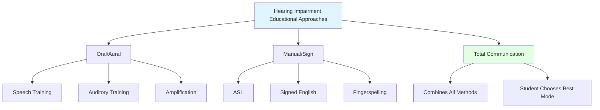

Understanding sensory impairments is essential for educators to provide appropriate support for students with hearing and visual disabilities.

---

**Source PDFs**: 
- 📄 [Block-2/Unit-4.pdf - Pages 56-58](/pdfs/MPC-002%20Life%20Span%20Psychology/Block-2/Unit-4.pdf)
- 📚 MPC-002 Life Span Psychology

---

## Hearing Impairments: Overview and Impact

Hearing loss is significantly more common than blindness, affecting approximately 1-2 per 1,000 school-age children. The severity of impact depends largely on **when the hearing loss occurred** (congenital vs. acquired) and **degree of loss** (mild to profound).

### Developmental Impact

**Language Development:**
- **Most severely affected domain** for hearing-impaired individuals
- Children born deaf will **not develop oral language** without extensive intervention
- **Critical period**: First 3-5 years crucial for language acquisition
- Delayed language affects cognitive, social, academic development

**Intellectual Assessment Challenges:**
- Standard IQ tests heavily language-dependent
- Hearing-impaired children may **appear less intelligent** due to language barriers
- Non-verbal IQ tests show **normal intellectual potential**
- Difficulty measuring true cognitive abilities complicates educational planning

**Social-Emotional Development:**
- Communication barriers lead to social isolation
- Frustration from inability to express needs, understand others
- Potential behavioral problems from communication difficulties
- Identity issues (Deaf culture vs. hearing world)

> **Research Insight**: Studies show that children with hearing impairments who receive early intervention (before age 2) achieve language outcomes approaching those of hearing peers, while late intervention (after age 3) results in persistent language delays ([Yoshinaga-Itano et al., 2024](https://doi.org/10.1044/2023_AJA-23-00073)).

### Educational Placement Options

**Five Basic Options (Least to Most Restrictive):**

**1. Full-Time Regular Classroom (with supports)**
- **For**: Students with mild hearing loss or with effective hearing aids
- **Supports**: FM systems, preferential seating, note-takers, captioning
- **Goal**: Maximum integration with typically hearing peers

**2. Part-Time Special Education**
- **Resource room services**: Speech therapy, auditory training, specialized instruction
- **General education**: Most academic subjects
- **Balance**: Integration with targeted support

**3. Special Class in Regular School**
- **Self-contained classroom** for most of day
- **Some integration**: Art, PE, lunch with hearing students
- **Intensive services**: Specialized instruction, communication training

**4. Separate Day School**
- **Specialized school** for deaf/hard-of-hearing students
- **Comprehensive program**: Academic, language, social skills
- **Deaf community**: Peer interaction with others who are deaf
- **Commute**: Student lives at home, attends specialized school

**5. Residential School**
- **24-hour program**: Live at school during week
- **Comprehensive services**: Academic, vocational, recreational
- **Immersion**: Deaf culture, sign language community
- **For**: Severe/profound hearing loss, inadequate local services

### Communication Approaches

**1. Oral/Aural Approaches**

**Focus**: Developing oral language as primary communication mode

**Key Components:**
- **Amplification**: Hearing aids, cochlear implants maximize residual hearing
- **Auditory training**: Developing listening skills, speech discrimination
- **Speech training**: Articulation, voice quality, speech rhythm
- **Speech reading (lip reading)**: Visual cues from speaker's mouth
- **Natural gestures**: Facial expressions, body language (but not formal sign language)

**Advantages:**
- Facilitates communication with hearing world
- May enable mainstream education more easily
- Access to broader society

**Limitations:**
- Requires significant residual hearing
- Years of intensive therapy needed
- Not all sounds visible on lips (many sounds look identical)
- Exhausting to speech-read for extended periods

**2. Manual Approaches**

**Focus**: Sign language as primary communication mode

**American Sign Language (ASL):**
- **Complete language**: Own grammar, syntax different from English
- **Visual-spatial**: Three-dimensional, uses space meaningfully
- **Deaf culture language**: Primary language of Deaf community
- **Acquired naturally**: By deaf children of deaf parents

**Signed Exact English (SEE):**
- **Manual code**: Represents English word-for-word in signs
- **Follows English grammar**: Word order, verb tenses, articles
- **Educational tool**: Teaching English reading, writing
- **Not natural language**: Cumbersome, rarely used by deaf adults

**Finger Spelling:**
- **Manual alphabet**: Each letter represented by hand shape
- **Used for**: Proper names, technical terms, unfamiliar words
- **Supplement**: Used with sign language, not standalone communication

**Advantages:**
- Accessible immediately (no hearing required)
- Natural, complete language (ASL)
- Deaf culture identity and community
- Can achieve age-appropriate language development

**Limitations:**
- Communication limited to those who sign
- May not facilitate English literacy (especially ASL)
- Requires family to learn signing

**3. Total Communication**

**Philosophy**: Use **all available methods** to facilitate communication

**Combines:**
- Sign language (ASL or SEE)
- Speech and speech reading
- Amplification (hearing aids)
- Finger spelling
- Natural gestures
- Written language

**Goal**: Give students access to **multiple communication modes**, choosing what works best for each situation

**Currently Preferred**: Most programs for deaf/hard-of-hearing students use total communication approach

**4. Cued Speech**

**System**: Hand shapes near mouth **cue** sounds that look identical on lips
- Disambiguates homophonous sounds ("pat" vs. "bat")
- Makes all phonemes of English visible
- Used with speech reading, not standalone
- Facilitates English literacy

**5. Auditory-Verbal Therapy**

**Intensive approach**: Maximizing use of residual hearing through amplification
- Early identification and amplification (cochlear implants)
- Intensive listening therapy
- No sign language or visual communication
- Controversial in Deaf community

### Cochlear Implants

**Technology**: Surgically implanted device that **bypasses damaged cochlea**, directly stimulates auditory nerve

**Components:**
- **External**: Microphone, speech processor, transmitter
- **Internal**: Receiver, electrode array in cochlea

**Candidates:**
- Severe to profound sensorineural hearing loss
- Limited benefit from hearing aids
- No medical contraindications
- Motivation for auditory skill development
- **Best results**: Implanted before age 2-3

**Outcomes:**
- **Highly variable**: Some achieve near-normal speech perception; others limited benefit
- **Not a cure**: Doesn't restore normal hearing
- **Intensive therapy required**: Auditory training, speech therapy
- **Controversy**: Deaf community concerns about cultural identity

> **Recent Evidence**: Meta-analyses show children receiving cochlear implants before age 2 achieve significantly better speech perception and language outcomes than those implanted later ([Dettman & Dowell, 2023](https://doi.org/10.1097/AUD.0000000000001295)).

### Teaching Strategies for Hearing-Impaired Students

**1. Interpreter Collaboration:**
- **Pre-lesson planning**: Discuss lesson content, specialized vocabulary
- **Team teaching**: Coordinate timing, pacing
- **Clarifications**: Interpreter asks questions for student
- **Positioning**: Ensure student sees both interpreter and teacher

**2. Face the Student:**
- **Speech reading essential**: Many students rely on lip reading
- **Don't talk to board**: Turn around when speaking
- **Good lighting**: Face should be well-lit (not backlit)
- **Facial expressions**: Provide additional contextual cues

**3. Visual Supports:**
- **Captioned videos**: All multimedia should have captions
- **Written outlines**: Provide notes, can't watch interpreter and write simultaneously
- **Visual aids**: Pictures, diagrams, demonstrations
- **Written homework assignments**: Don't rely solely on verbal

**4. Environmental Considerations:**
- **Minimize background noise**: Close windows, doors; use carpeting
- **Acoustic treatments**: Sound-absorbing materials on walls
- **Classroom arrangement**: Circular or U-shaped seating (students can see each other sign)
- **Lighting**: Bright, even illumination (shadows interfere with speech reading, signing)

**5. Communication Adjustments:**
- **Gain attention first**: Before speaking (touch shoulder, wave, flicker lights)
- **Speak naturally**: Don't exaggerate lip movements or shout
- **Rephrase if not understood**: Use different words, not louder voice
- **Verify understanding**: Check comprehension frequently
- **Writing**: Use written communication when needed

**6. Technology Integration:**
- **FM systems**: Teacher wears microphone; signal transmitted directly to student's hearing aid/cochlear implant
- **Real-time captioning**: CART (Communication Access Realtime Translation) for lectures
- **Video relay services**: For phone calls
- **Alerting devices**: Vibrating/flashing alarms (fire, bells)

**7. Social Inclusion:**
- **Peer education**: Help classmates communicate with deaf/hard-of-hearing students
- **Sign language classes**: Teach basics to hearing students
- **Buddy system**: Pair with hearing peer for notes, clarifications
- **Deaf role models**: Invite successful deaf adults as speakers

---

## Visual Impairments: Definitions and Classifications

**Legal Blindness**: Visual acuity of **20/200 or worse** in better eye with correction, OR visual field restriction to 20 degrees or less

**Educational Definitions:**

**Blind:**
- **Severely impaired vision**: Cannot use vision for learning
- **Braille readers**: Must learn tactile reading
- **Orientation and mobility training**: White cane, guide dog

**Low Vision (Partially Sighted):**
- **Usable vision**: Can read print with magnification, large print
- **Visual aids**: Magnifiers, telescopes, CCTV
- **Print readers**: With accommodations

### Causes of Visual Impairment

**Congenital (Present at Birth):**
- **Retinopathy of Prematurity (ROP)**: Premature infants, oxygen exposure
- **Congenital cataracts**: Clouding of lens
- **Optic nerve hypoplasia**: Underdeveloped optic nerve
- **Genetic conditions**: Leber's congenital amaurosis, genetic syndromes

**Acquired (Develops Later):**
- **Diabetic retinopathy**: Complication of diabetes
- **Macular degeneration**: Central vision loss
- **Glaucoma**: Optic nerve damage from pressure
- **Trauma**: Injuries to eye or brain
- **Infections**: Can damage eyes

### Developmental Needs of Students with Visual Impairments

**Essential Skill Domains:**

**1. Concept Development and Academic Skills:**
- **Concrete experiences**: Cannot learn through observation alone
- **Hands-on learning**: Tactile exploration of objects
- **Verbalization**: Describe visual information explicitly
- **Expanded core curriculum**: Skills unique to blind/low vision students

**2. Communication Skills:**
- **Braille literacy**: For blind students, equivalent to print reading
- **Large print/magnification**: For low vision students
- **Assistive technology**: Screen readers (JAWS, NVDA), screen magnification
- **Audio books and materials**: Supplement reading

**3. Sensory-Motor Skills:**
- **Tactile discrimination**: Identifying objects, textures by touch
- **Auditory skills**: Locating objects, people by sound
- **Kinesthetic awareness**: Body position, movement
- **Fine motor**: Braille reading, writing; operating equipment

**4. Orientation and Mobility Skills:**
- **Body image**: Understanding spatial relationships
- **Environmental concepts**: Spatial layout, directions
- **Cane travel**: Long white cane techniques
- **Independent travel**: Navigation in various environments

**5. Daily Living Skills:**
- **Personal hygiene**: Grooming, dressing independently
- **Food preparation**: Cooking, eating skills
- **Money management**: Identifying currency, financial skills
- **Household management**: Cleaning, organization

**6. Social-Emotional Skills:**
- **Social cues**: Understanding non-verbal communication (through description)
- **Self-advocacy**: Communicating needs, requesting accommodations
- **Dealing with attitudes**: Responding to stereotypes, misconceptions
- **Peer relationships**: Building friendships

**7. Career and Vocational Skills:**
- **Career awareness**: Understanding diverse careers accessible to blind individuals
- **Workplace skills**: Assistive technology, accommodations
- **Work experience**: Internships, job shadowing

### Braille Literacy

**Braille System:**
- **Tactile writing**: Raised dots in cells of 6 positions (2 columns x 3 rows)
- **63 combinations**: Each represents letter, number, punctuation
- **Grades of Braille**:
  - **Grade 1**: Letter-by-letter (rarely used)
  - **Grade 2**: Contractions (standard, most common)
  - **Grade 3**: Shorthand (personal note-taking)

**Spelling Consideration:**
- **Not letter-by-letter correspondence**: Contractions represent multiple letters
- Example: Single cell for "ch", "sh", "th", "and", "for", "the"
- Teachers learning braille should understand this difference

### Teaching Strategies for Visually Impaired Students

**1. Environmental Modifications:**

**Eliminate Clutter:**
- **Clear pathways**: Wide, obstacle-free aisles
- **Consistent organization**: Items always in same place
- **Verbal warnings**: Notify of changes in room arrangement

**Tactile Maps:**
- **Classroom layout**: Raised-line maps with Braille labels
- **School campus**: Navigation aids
- **Community**: Orientation to local environment

**2. Assistive Technology:**

**For Blind Students:**
- **Screen readers**: Software that reads screen content aloud (JAWS, NVDA, VoiceOver)
- **Braille displays**: Refreshable braille output from computer
- **Braille printers (embossers)**: Create braille documents
- **Audio descriptions**: Describe visual content in videos, presentations

**For Low Vision Students:**
- **Screen magnification**: Zoom++, MAGic, built-in OS features
- **Large print materials**: 18-24 point font
- **High-contrast materials**: Black on yellow paper
- **CCTV/video magnifiers**: Electronic magnification of print, objects
- **Talking calculators, watches**: Audio feedback

**3. Instructional Adaptations:**

**Reading Materials:**
- **Braille or large print**: Provide in advance, not day of lesson
- **Audio books**: Supplement, not replacement for literacy
- **Textbook description**: Explain visual information (charts, diagrams, photos)
- **Tactile graphics**: Raised-line drawings for maps, diagrams

**Alternative Assignments:**
- **Oral reports**: Instead of written (for some assignments)
- **Digital submission**: Email, upload to learning management system
- **Recorded responses**: For lengthy written work
- **Partner reading**: Peer reads questions aloud

**4. Vocabulary and Descriptions:**

**Visual Concepts:**
- **Explicit teaching**: Colors, visual concepts meaningless without experience
- **Comparisons**: "As bright as the sun" meaningless; use tactile or auditory comparisons
- **Avoid assumptions**: Don't assume student understands visual references

**Describing Visual Information:**
- **Be specific**: "On your right" not "over there"
- **Use clock positions**: "The pencil is at 2 o'clock on your desk"
- **Describe gestures**: "I'm nodding my head yes"
- **Read aloud**: Written board work, handouts

**5. Accessible Format Considerations:**

**Large Print Guidelines (Low Vision):**
- **Font size**: 18-24 point (student preference)
- **Font type**: Sans serif (Arial, Verdana) easier to read
- **Contrast**: Black text on white or yellow paper
- **Spacing**: Increased line spacing, larger margins
- **Bold**: Use bold for emphasis, not underline or italics

**6. Collaboration and Communication:**

**Vision Teacher Consultation:**
- **Specialized instruction**: Braille, orientation and mobility
- **Adapted materials**: Creating tactile graphics, braille
- **Assessment**: Functional vision assessment
- **Equipment**: Assistive technology training, maintenance

**Family Partnership:**
- **Home practice**: Braille reading, daily living skills
- **Transportation**: Orientation and mobility practice
- **Expectations**: Encouraging independence, not over-protection

---

## Self-Assessment Questions

1. **Compare**: How do the educational needs of students with hearing impairments differ from those with visual impairments? What skills are unique to each group?

2. **Communication Decision**: A parent wants their deaf child taught only oral methods, but the child is making minimal progress after 3 years. How would you address this situation? What factors should guide the decision?

3. **Technology Application**: Design a lesson plan for teaching a science concept (e.g., water cycle) to a student who is blind. What assistive technology and teaching strategies would you use?

4. **Critical Analysis**: Debate the cochlear implant controversy. What are the medical, educational, and cultural arguments on each side?

5. **Practical Application**: A student with low vision sits in the back of your classroom. List 10 specific environmental modifications and instructional strategies you would implement.

6. **Case Study**: A blind student excels academically but struggles socially. What skills from the expanded core curriculum would you target? Describe specific interventions.

## Memory Aid: ACCESS Framework

**A - Assess** functional vision and hearing  
**C - Communicate** clearly with appropriate methods  
**C - Collaborate** with specialists and families  
**E - Environment** modifications for accessibility  
**S - Support** independence, not dependence  
**S - Sensory** skills training (O&M, listening, tactile)

## External Resources

### Organizations
- [American Foundation for the Blind](https://www.afb.org/)
- [National Association of the Deaf](https://www.nad.org/)
- [Hadley Institute for the Blind and Visually Impaired](https://hadley.edu/)

### Educational Videos
- [Understanding Hearing Loss](https://www.youtube.com/watch?v=gRo8YR9k6ic) (10 min)
- [Orientation and Mobility Training for Blind Students](https://www.youtube.com/watch?v=GpLWNxTHZzY) (15 min)

### Research
- [Journal of Visual Impairment & Blindness](https://journals.sagepub.com/home/jvb)
- [American Journal of Audiology](https://pubs.asha.org/journal/aja)

---

**Next Topic**: Gifted Children and Integration →
